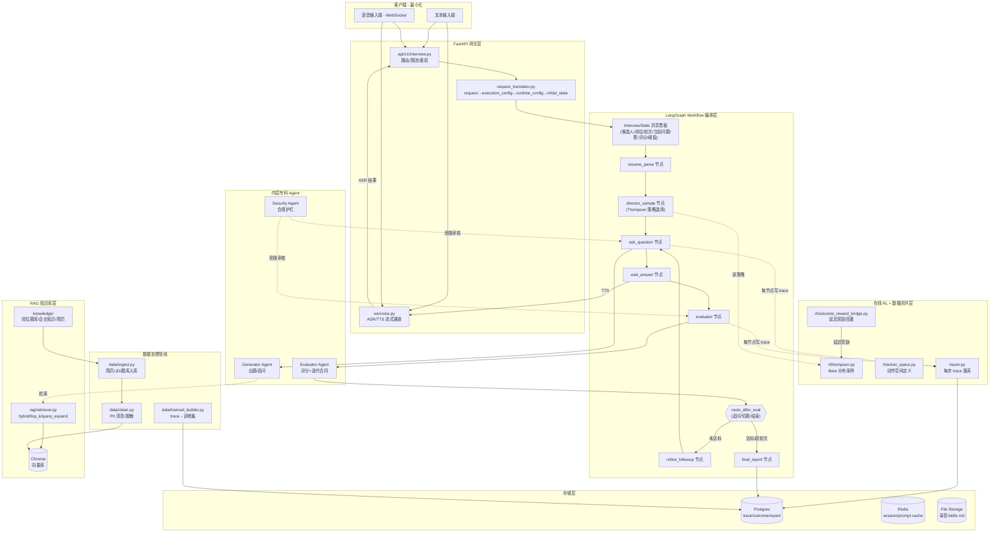

# AI 面试官 Agentic Workflow 后端工程 Plan

## 0. 设计锚点(TL;DR)

- **参考蓝本**: [`reference/AI面试官Agent项目架构设计.md`](reference/AI面试官Agent项目架构设计.md) 给出"控制束底座 + 垂直业务工作流"战略,本 Plan 将其**工程化落地**。
- **直接借鉴**: [`reference/Agentic-Content-Optimizer/LANGGRAPH_WORKFLOW_BUSINESS_LOOP.md`](reference/Agentic-Content-Optimizer/LANGGRAPH_WORKFLOW_BUSINESS_LOOP.md) 的 `State → Node → Router → Refinement → Trace → Reward` 五段式骨架,原样迁移到面试场景。
- **六大模块全部纳入**: RAG / 多智能体 / Workflow / 在线 RL / 数据处理 / 多模态(音频),数字人留到 V3。
- **技术栈**: Python 3.11 + LangGraph 1.x (GA 自 2025-10,当前 1.1.x) + FastAPI + PostgreSQL(主库/trace)+ Chroma(向量)+ Redis(session 缓存)+ LangSmith(可选 trace)+ Whisper API/Deepgram + TTS API。
- **核心思想**: 外层确定性 LangGraph 图 + 内层专科 Agent 做非确定性推理 + 旁路 Trace/Outcome/Reward 闭环(不污染主生成链)。

## 1. 目标架构总览



## 2. 目录结构

```
agentic_interviewer/
  backend/
    app/
      api/v1/
        interview.py           # 发起/查询面试的 REST
        ws_voice.py            # WebSocket 音频通道
      core/
        request_translator.py  # request→execution_config→runtime_config→initial_state
        tracer.py              # 统一 trace 落库
        settings.py            # 配置/密钥
      engine/
        workflow/
          langgraph_workflow.py  # 主图定义: StateGraph + add_node + conditional_edges
          state.py               # InterviewState TypedDict
          routers.py             # _route_after_eval/_should_refine
          nodes/
            resume_parse.py
            director_sample.py
            ask_question.py
            wait_answer.py
            evaluator.py
            refine_followup.py
            final_report.py
        agents/
          generator.py          # 出题/追问 Agent(含迭代合同)
          evaluator_agent.py    # Critic + rubric
          security.py           # 合规护栏 Agent
          prompts/
            system_skeleton.md  # 静态骨架
            rubric_templates/
        rag/
          ingestion.py          # 文档→chunk→向量
          retriever.py          # hybrid/top_k/expand
          vectorstore.py        # Chroma 客户端
      ml/rl/
        action_space.py         # 策略枚举(深挖/切题/提示/跳过)
        thompson.py             # Beta 分布采样
        outcome_reward_bridge.py  # 延迟奖励回灌
        reward_fn.py            # 即时 reward 计算
      data/
        ingest.py               # 外部资料入库
        clean.py                # PII 脱敏
        trainset_builder.py     # trace→训练样本
      voice/
        asr.py                  # Whisper/Deepgram 封装
        tts.py                  # OpenAI TTS/Azure 封装
        stream_manager.py       # 音频流缓冲管理
      models/                    # SQLAlchemy ORM
        interview_session.py
        generation_trace.py
        outcome_record.py
      tasks/
        outcome_sync_tasks.py   # Celery/APScheduler 定时回灌
      main.py                   # FastAPI 启动
    tests/
      unit/
      integration/
      fixtures/                 # 假简历/JD/题库
    knowledge/                   # 题库/企业 KB 源文件
      tech_questions/
      behavioral_questions/
      sample_resumes/
    scripts/
      seed_kb.py                # 初始化向量库
      run_demo.py               # 文本模式 CLI 演示
    pyproject.toml              # 依赖(poetry 或 uv)
    .env.example
    docker-compose.yml          # postgres + redis + chroma
    README.md
  reference/                     # 知识库(已存在,不动)
```

## 3. LangGraph 状态机核心(必看)

### 3.1 `InterviewState` 设计(参考 ACO 的 `ContentGenerationState`)

在 [`backend/app/engine/workflow/state.py`](backend/app/engine/workflow/state.py):

```python
class InterviewState(TypedDict):
    # 身份与目标
    candidate: dict            # {name, resume_parsed, email_hash}
    job_spec: dict             # {title, level, required_skills, rubric}
    mode: Literal["tech", "behavioral", "mixed"]

    # RL 控制
    selected_action: dict      # Director 决定的追问策略
    policy_id: str             # 当前 bandit 策略标识

    # 对话轮次
    turn_idx: int
    current_question: dict
    current_answer: str
    qa_history: list[dict]

    # 评估
    rubric: dict
    evaluation: dict           # 当前轮评分
    scores_per_dim: dict       # 累计各维度分

    # 控制参数
    max_turns: int
    quality_threshold: float
    turn_budget_remaining: int

    # 运行期
    runtime_config: dict       # RAG/LLM/RL 参数
    messages: list             # LLM messages 历史
    trace_id: str

    # 输出
    final_report: dict | None
```

### 3.2 节点清单与职责(对标 ACO 的 `add_node(...)`)

- `resume_parse`: 只解析一次简历+JD,写 `candidate/job_spec/rubric`
- `director_sample`: 调用 [`ml/rl/thompson.py`](backend/app/ml/rl/thompson.py) 从 Beta 分布采样策略 → 写 `selected_action/policy_id`
- `ask_question`: 调 Generator Agent,基于 `selected_action` + RAG 检索出题 → 写 `current_question`
- `wait_answer`: 阻塞等候答案(文本直接回填/语音经 WS 回填)→ 写 `current_answer/qa_history`
- `evaluator`: 调 Evaluator Agent + 迭代合同(先对齐 rubric,再评分)→ 写 `evaluation/scores_per_dim`
- `refine_followup`: 基于评估薄弱点生成追问,不切题
- `final_report`: 汇总 rubric 各维度,写 `final_report`,落 Postgres

### 3.3 条件边(路由函数,不是节点)

在 [`backend/app/engine/workflow/routers.py`](backend/app/engine/workflow/routers.py):

- `_route_after_eval(state)`: 输出 `"refine" | "next_question" | "end"`
  - 当前维度未达 `quality_threshold` 且 `turn_budget > 0` → `refine`
  - 维度达标但还有其他维度 → `next_question`(回到 `director_sample`)
  - 全部达标或超预算 → `end`

### 3.4 HITL 与 Checkpointer

- 使用 `langgraph.checkpoint.postgres.PostgresSaver`,thread_id = interview_session_id。
- HITL 断点: `wait_answer` 节点调用 `interrupt()`,等候客户端回填答案后 `resume()`。
- 这是本项目**在线 RL 能工作的前提**,必须先把 checkpointer 打通。

## 4. 内层 Agent(迭代合同)

按 `AI面试官Agent项目架构设计.md` 的"生成器-评估器迭代合同":

- [`agents/generator.py`](backend/app/engine/agents/generator.py):
  - 先和 Evaluator **协商 rubric**(这一轮题要考察什么/什么是合格答案)
  - Evaluator 同意后再真正出题给候选人
- [`agents/evaluator_agent.py`](backend/app/engine/agents/evaluator_agent.py):
  - 拿到候选人回答后,**严格按合同**评分
  - 可驳回 Generator 要求重评(内部循环 3-5 次,用户不可见)
- [`agents/security.py`](backend/app/engine/agents/security.py):
  - 旁路 Agent,审核每条题目与回答是否合规(歧视/隐私)
  - 不进主链,失败时中断图

**Prompt 静态骨架**放 [`agents/prompts/system_skeleton.md`](backend/app/engine/agents/prompts/system_skeleton.md),利用 Claude/GPT 的 prompt cache。

## 5. RAG 知识库

- **数据源**: 岗位题库(技术/行为)、企业文化文档、候选人简历。放 `knowledge/` 目录。
- **入库**: [`data/ingest.py`](backend/app/data/ingest.py) 用 LangChain `RecursiveCharacterTextSplitter` 切片 → OpenAI embeddings → Chroma。
- **检索**: [`rag/retriever.py`](backend/app/engine/rag/retriever.py) 支持 `hybrid`(BM25+向量)、`top_k`、`query_expansion`(让 LLM 扩写 query)。
- **使用位置**: `ask_question` 节点检索相关题库/简历要点注入 prompt。
- **MVP 可简化**: 先纯向量检索+top_k=5,hybrid/expansion 做 V1 升级。

## 6. 在线 RL 闭环

### 6.1 动作空间(MVP 简版)

在 [`ml/rl/action_space.py`](backend/app/ml/rl/action_space.py):

```python
ACTIONS = [
    "deepen_technical",    # 高压深挖技术细节
    "switch_dimension",    # 切换考察维度
    "give_hint",           # 给予提示引导
    "skip_to_next",        # 快速跳过
]
```

### 6.2 Thompson Sampling

[`ml/rl/thompson.py`](backend/app/ml/rl/thompson.py) 维护 `{job_level × action: (alpha, beta)}` 的 Beta 分布。`director_sample` 节点每轮从各 Beta 采样 → 选最大值的动作。

### 6.3 双轨奖励

- **即时 reward**(`reward_fn.py`): 基于 `evaluator` 输出的打分偏差/rubric 覆盖度,当场计算
- **延迟 reward**(`outcome_reward_bridge.py`): 后台任务,当有真实 outcome(录用/绩效)时反向回灌 alpha/beta
- **关键**: reward 只写 Postgres,不改主链 state,防止污染

### 6.4 Trace 持久化

[`core/tracer.py`](backend/app/core/tracer.py) 在每个节点出入口自动写 `generation_traces` 表:`{trace_id, turn_idx, node, state_snapshot, selected_action, policy_id, evaluation, ts}`。这是 RL 回灌和后续训练集构建的唯一真相源。

## 7. 数据处理管线

- [`data/ingest.py`](backend/app/data/ingest.py): 简历/JD/题库 → 结构化 JSON → 向量库
- [`data/clean.py`](backend/app/data/clean.py): PII 脱敏(正则+小模型),入库前强制过
- [`data/trainset_builder.py`](backend/app/data/trainset_builder.py): 从 trace + outcome 构造 SFT/DPO 训练样本(输出 jsonl),为后续微调预留接口

## 8. 音频交互(简化版)

- [`api/v1/ws_voice.py`](backend/app/api/v1/ws_voice.py): WebSocket 通道,浏览器推 PCM/Opus 流
- [`voice/asr.py`](backend/app/voice/asr.py): 片段化调 Whisper API / Deepgram(流式),VAD 检测到停顿后触发 `wait_answer` 回填
- [`voice/tts.py`](backend/app/voice/tts.py): OpenAI TTS 流式,`ask_question` 节点生成文本后调用,回推给前端
- **延迟容忍**: 2-3 秒,不做自适应中断处理(Pipecat 方案是 V3 升级方向)

## 9. 分阶段路线图

### Phase 0 - 地基(Week 1)

- 初始化项目、依赖、Docker compose(Postgres+Redis+Chroma)、CI
- 写 `InterviewState`/数据库模型/基础 FastAPI 骨架
- **验收**: `curl /health` 通,空 LangGraph 图能跑通

### Phase 1 - MVP 文本面试(Week 2-3)

- 实现 7 个节点 + 路由函数 + Generator/Evaluator + 基本 RAG
- 用固定策略(不启用 RL),文本 API 跑完整一次面试
- 简历/题库 seed 10 份 demo 数据
- **验收**: 输入简历+JD,完成 5 轮 QA,产出结构化 report。`scripts/run_demo.py` 可复演。

### Phase 2 - RL 闭环 + Trace(Week 4)

- 接入 Thompson Sampling,`director_sample` 真正选动作
- Trace 全链路落库,实现即时 reward
- 模拟 outcome 数据,验证延迟奖励回灌
- **验收**: 跑 20 场面试后,alpha/beta 有分化;能从 trace 重建任一 session

### Phase 3 - 语音通道(Week 5)

- WS 音频链路 + Whisper + TTS
- `wait_answer` 节点改造为 interrupt/resume 模式
- 最简前端 demo 页(单页 HTML,能录音+播放)
- **验收**: 能完整语音完成一次面试,延迟可接受

### Phase 4 - 完善(Week 6+,可选)

- hybrid RAG、query expansion、迭代合同完整实现
- Security Agent 上线
- LangSmith 对接
- 训练集构建脚本 + 预留 DPO 微调路径
- V3 方向: 数字人(HeyGen/D-ID API 对接)

## 10. 关键设计取舍(为什么这么做)

- **为什么不直接全盘照抄 `AI面试官Agent项目架构设计.md`**: 那份是战略研究,包含 Pipecat/LiveKit/数字人等企业级栈,对 demo 项目过重。本 Plan **保留核心模式**(迭代合同/Thompson/延迟回灌/旁路 trace),**简化基础设施**(WebSocket 替代 WebRTC、Chroma 替代 Pinecone、APScheduler 替代 Celery)。
- **为什么用 LangGraph 而非 CrewAI/AutoGen**: 面试流程是**有明确阶段的状态机**,不是开放对话。LangGraph 的 StateGraph + 条件边 + Checkpointer 最贴合;CrewAI 的角色叙事对评分场景反而增加不确定性。
- **为什么外层图 + 内层 Agent**: ACO/Claude Code 的经验是"全动态改图不稳定"。固定骨架(7 节点)+ 条件路由驱动分支 + 动作空间参数化,既有可控性又有自适应。
- **为什么 RL 做 bandit 而非 PPO**: 在线面试场景**每步决策独立性强、数据稀疏、无明确 reward signal 累积**,多臂赌博机比完整 RL 更工程化、更便宜、更可解释。PPO 留给有 10万+轨迹后的 V4。
- **为什么 trace/reward 走旁路不进主链**: ACO 文档反复强调"reward 幂等/口径若混入主生成链会难以归因"。旁路 tracer 可独立升级采样策略和 reward 函数。

## 11. 风险与缓解

- **LangGraph Checkpointer 学习曲线**: Postgres saver 的 schema 需磨合,先用 `MemorySaver` 跑通再替换。当前实现:`build_workflow()` 读 `Settings.checkpoint_backend`,`memory` / `postgres` 二选一;切到 postgres 时 `PostgresSaver.from_conn_string(...).setup()` 会自动创建表。
- **LLM 成本失控**: runtime_config 设 `turn_budget`,超预算强制走 `end` 路径;Prompt cache 静态骨架
- **RAG 效果不稳**: MVP 先接受"够用",V1 再加 hybrid/rerank;单独给 RAG 节点写 eval 脚本
- **语音延迟体验**: 明确预期(2-3s),失真/截断做明显 UI 反馈,避免用户以为断连

## 12. 第一步具体动作(待你确认后执行)

1. 创建 `backend/` 目录骨架 + `pyproject.toml`(poetry 或 uv)
2. 写 `docker-compose.yml` 拉起 postgres+chroma+redis
3. 写 `app/engine/workflow/state.py` + 一张最小的 LangGraph 空图(只有 `START → resume_parse → final_report → END`)跑通 hello-world
4. 补 `scripts/run_demo.py` 验证端到端可跑

等你确认 Plan 后,我会按这个顺序落地。