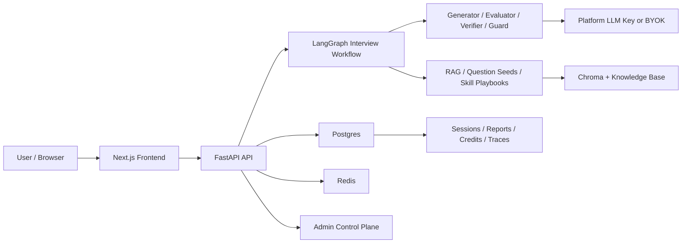

# Agentic Interviewer

> 面向个人练习场景的 AI 模拟面试系统：用 LangGraph 编排多智能体面试主链路，并补齐账号归属、平台额度、BYOK、Admin 后台与上线预检等 SaaS 控制面能力。

Agentic Interviewer 不是一个简单的聊天 Demo。它围绕“完成一次高质量模拟面试、拿到反馈和复盘”这个目标，把面试运行时、记录归属、额度账本、管理员运营和生产 readiness 串成一个完整工程闭环。

## 项目亮点

| 方向 | 覆盖内容 |
| --- | --- |
| Agentic workflow | 基于 LangGraph 的多节点面试状态机，覆盖提问、追问、评分、校验、报告和复练建议。 |
| 面试体验 | 支持岗位/简历/JD 输入、文本面试、语音面试、最终报告、训练回放、弱项复练和历史记录。 |
| 上下文与检索 | 支持简历/JD 解析、session anchors、Chroma/BM25 检索、结构化题库和技能 playbook 注入。 |
| 账号与归属 | 使用 HttpOnly Cookie 登录态；账号记录与本机匿名记录分离；支持匿名记录显式保存到账号。 |
| 平台额度 | 平台托管模式按场扣减额度；BYOK 不扣平台次数；额度流水采用 append-only ledger。 |
| Admin 后台 | Admin role、用户管理、额度调整、额度申请审批、面试记录和 workflow 观测面板。 |
| 上线准备 | 生产预检、schema upgrade 防护、管理员 bootstrap 脚本、上线 runbook 和 smoke drill。 |

## 适用定位

这个项目适合展示一个 production-aware 的 AI 应用如何从“能跑的主链路”升级为“可归属、可运营、可上线审查”的产品化系统。

它不是招聘决策系统，也不主张用 AI 替代面试官做录用判断。用户侧语言聚焦在模拟面试、评分反馈、成长信号和训练建议。

## 演示路径

推荐演示顺序：

1. 打开前端，进入面试设置页。
2. 填写岗位、候选人信息，或上传简历/JD。
3. 选择平台托管模式开始面试，或切换到个人 API Key / BYOK。
4. 回答多轮问题，观察追问、下一题和评分反馈。
5. 打开最终报告，查看总分、维度分、证据、反馈和训练建议。
6. 进入“我的面试”，查看账号记录与本机匿名记录的区别。
7. 打开“账号与额度”，查看剩余次数、额度流水和额度申请。
8. 使用 admin 账号进入后台，查看用户管理、额度管理、申请审批、面试记录和观测数据。

## 架构概览



主链路可以概括为：

```text
setup / resume parse
  -> self intro
  -> director sample
  -> ask question
  -> wait answer
  -> evaluator
  -> verifier / reward update
  -> follow-up | next question | final report
  -> training plan
```

工程重点不只是一次 LLM 调用，而是把多轮状态、上下文检索、评分证据、恢复能力和控制面治理组织成一个可复盘的系统。

## 技术栈

| 层级 | 技术 |
| --- | --- |
| Backend API | Python 3.11+, FastAPI, Uvicorn, Pydantic |
| Agent runtime | LangGraph, LangChain, multi-agent workflow nodes |
| Persistence | PostgreSQL, SQLAlchemy, LangGraph checkpointing |
| Runtime state | Redis |
| Retrieval | Chroma, BM25, OpenAI/stub embeddings |
| LLM providers | OpenAI, Anthropic, DeepSeek, OpenAI-compatible providers, stub mode |
| Voice | WebSocket, ASR/TTS provider routing, browser recording |
| Frontend | Next.js 14 App Router, React 18, TypeScript, Tailwind |
| Testing | Pytest, Node source tests, TypeScript typecheck, Next production build |

## 仓库结构

```text
Agentic_Interviewer/
  ai-interviewer/
    backend/       # FastAPI、LangGraph workflow、模型服务、DB、测试
    frontend/      # Next.js 前端、面试 UI、账号与 Admin 面板
    docs/          # 架构说明、上线决策、runbook、简历讲解稿
    README.md      # 项目内部 README
  AGENTS.md        # 本地 agent 协作说明
  CLAUDE.md        # Claude/Cursor 规则镜像
  README.md        # GitHub 项目主页
```

## 快速启动

### 1. 启动基础设施

```powershell
cd ai-interviewer/backend
docker compose up -d postgres redis chroma
```

### 2. 启动后端

```powershell
cd ai-interviewer/backend
python -m venv .venv
.\.venv\Scripts\Activate.ps1
pip install -e ".[dev,voice]"
copy .env.example .env
python -m app.scripts.seed_kb
uvicorn app.main:app --reload --port 8000
```

健康检查：

```text
http://localhost:8000/health
```

本地无真实模型 Key 时可以使用 stub 模式：

```env
LLM_PROVIDER=stub
EMBEDDING_PROVIDER=stub
ASR_PROVIDER=stub
TTS_PROVIDER=stub
CHECKPOINT_BACKEND=memory
```

### 3. 启动前端

```powershell
cd ai-interviewer/frontend
npm install
copy .env.local.example .env.local
npm run dev
```

打开：

```text
http://localhost:3000
```

## Admin Bootstrap

项目没有默认管理员账号。

1. 先在前端注册一个普通账号。
2. 在后端运行提升脚本：

```powershell
cd ai-interviewer/backend
python -m app.scripts.promote_admin --email admin@example.com
```

3. 重新登录该账号。
4. 需要显示 Admin 入口时，在前端环境配置中开启：

```env
NEXT_PUBLIC_ADMIN_NAV_ENABLED=true
```

`API_TOKEN` 仍可作为 emergency / bootstrap fallback；正常后台路径是 `role=admin` 账号登录。

## 验证命令

后端：

```powershell
cd ai-interviewer/backend
python -m pytest tests/unit -q
ruff check app/core/deployment_preflight.py app/core/settings.py app/scripts/promote_admin.py
```

前端：

```powershell
cd ai-interviewer/frontend
npm test
npm run typecheck
npm run build
```

生产 smoke：

```powershell
cd ai-interviewer/backend
python -m app.scripts.production_smoke --check-deps
```

## 关键文档

- [项目内部 README](./ai-interviewer/README.md)
- [项目文档索引](./ai-interviewer/docs/README.md)
- [后端 README](./ai-interviewer/backend/README.md)
- [前端 README](./ai-interviewer/frontend/README.md)
- [项目架构一页纸](<./ai-interviewer/docs/项目架构一页纸.md>)
- [控制面与权限边界说明](<./ai-interviewer/docs/控制面与权限边界说明.md>)
- [简历与面试讲解稿](<./ai-interviewer/docs/简历与面试讲解稿.md>)
- [Phase 3.0 产品与上线决策](<./ai-interviewer/docs/PHASE_3_0_产品与上线决策.md>)
- [Production Readiness Runbook](./ai-interviewer/docs/PRODUCTION_READINESS_RUNBOOK.md)
- [本地开发命令速查](<./ai-interviewer/docs/本地开发命令速查.md>)

## 当前边界

已完成：

- agentic mock interview 主链路；
- 文本和语音面试；
- 报告、回放、弱项复练和历史记录；
- 登录/注册、账号记录归属和匿名兼容；
- 平台额度、额度流水、额度申请和 BYOK 分离；
- Admin role、用户管理、额度管理和观测后台；
- 生产预检、schema upgrade 防护和上线 runbook。

暂不包含：

- 邮箱验证；
- 邀请码注册；
- captcha / bot 防护；
- 支付 checkout；
- 会员或订阅套餐；
- 正式 admin audit log；
- 完整公共生产运维体系。

这些是有意延后，而不是遗漏。当前项目更适合作为 portfolio-ready、production-aware 的 AI 应用工程样本，而不是已经完整运营的商业 SaaS。

## 本地研发备注

本地工作区可能存在 `reference/` 等研发参考资料或 agent 工作资料。这些内容不参与项目运行，也不随远程仓库发布；公开 README 以 `ai-interviewer/` 下的可运行项目和已跟踪文档为准。
