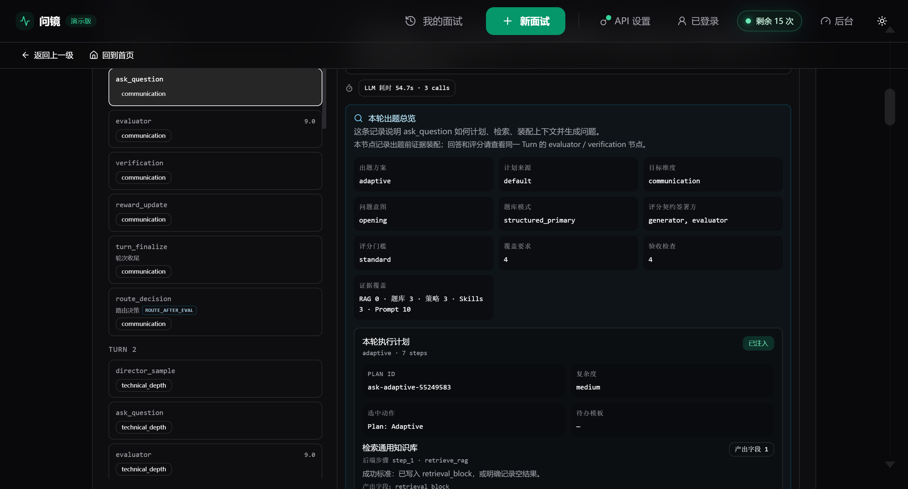
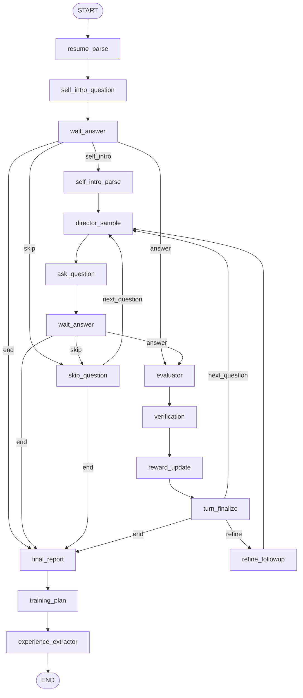

# 问镜（Agentic Interviewer）

> 基于 LangGraph 的 AI 模拟面试与复盘训练系统：核心是可恢复、可观测、可复盘的多智能体面试 workflow，外层再补齐账号归属、平台额度、BYOK、Admin 后台和上线预检等产品控制面。

问镜（Agentic Interviewer）不是普通聊天机器人，也不是“套一层简历问题 prompt”的 Demo。它围绕一次完整模拟面试构建真实 workflow：采集上下文、生成问题、等待用户回答、评分、验证、奖励回填、决定追问或下一题，最后生成报告和复练计划。

项目的重点是展示：**如何把 agentic workflow 从一次 LLM 调用，工程化成可恢复、可观测、可复盘、可运营的产品系统。**

[](https://www.bilibili.com/video/BV1Ey7Z6gEcA/)

[观看 5 分钟演示视频（Bilibili）](https://www.bilibili.com/video/BV1Ey7Z6gEcA/) · [GitHub Release 下载](https://github.com/liuhan-agent/Agentic_Interviewer/releases/tag/demo-video-2026-06-04)

## 核心工程主张

| 主张 | 体现 |
| --- | --- |
| Workflow 不是 chat loop | LangGraph 注册真实 node，并通过 conditional edge 控制自我介绍、正式题、跳过、追问、收尾等分支。 |
| 出题不是一次 prompt | `ask_question` 统一装配历史投影、结构化题库、候选人锚点、简历/自我介绍 RAG、策略记忆、Skill playbook 和评分契约。 |
| 评分不是最终答案 | `evaluator` 评分后进入 `verification` 校验，再由 `reward_update` 回填动作、题库、策略记忆和 skill 使用信号。 |
| Trace 不是日志堆积 | Trace Explorer 区分 workflow node、condition-edge diagnostics 和内部执行步骤，用于解释路由、prompt slots、评分契约和 reward attribution。 |
| 控制面服务主链路 | 登录、记录归属、额度、BYOK、Admin 和生产预检是为了让 workflow 具备真实产品边界，而不是喧宾夺主的登录页。 |

## Agentic Workflow 主链路

LangGraph 中的主流程可以概括为：

```text
START
  -> resume_parse
  -> self_intro_question
  -> wait_answer
  -> self_intro_parse
  -> director_sample
  -> ask_question
  -> wait_answer
  -> evaluator
  -> verification
  -> reward_update
  -> turn_finalize
  -> refine_followup | director_sample | final_report
  -> training_plan
  -> experience_extractor
  -> END
```

更完整的路由关系：



其中 `route_decision` 不是 LangGraph node，而是 `turn_finalize` 写出的 condition-edge diagnostics，用来解释本轮为什么追问、进入下一题或结束。

## 出题装配器：`ask_question`

`ask_question` 是当前系统最核心、也最复杂的节点。它不是简单调用 LLM 生成一道题，而是一次面试上下文装配：

- 从完整 `qa_history` 生成 prompt-facing projection，保留事实源不被裁剪；
- 选择结构化题库 seed / variant，避免问题完全泛化；
- 注入 `CANDIDATE_ANCHOR`，把题库问题适配到候选人的项目、技能和岗位背景；
- 检索简历 RAG 与自我介绍 RAG，补充 session-scoped 候选人材料；
- 读取 strategy memory 和 skill playbook，让历史策略与业务 skill 进入出题上下文；
- 生成或协商评分契约，让 evaluator 后续知道本题必须覆盖什么、如何验收；
- 写入 trace payload，暴露 prompt slots、裁剪诊断、候选题和 contract 信息。

这也是项目和普通“AI 面试问答”最大的区别之一：系统关心的不只是“LLM 问了什么”，还关心“本轮为什么问这个、用了哪些材料、下一步如何评分和学习”。

## 评分、验证与学习闭环

一轮正式题的生命周期是：

```text
director_sample
  -> selected_action / policy_context_keys / target_difficulty

ask_question
  -> current_question / current_ask_plan / current_contract / prompt_slots

wait_answer
  -> current_answer / current_answer_raw_ref / answer intent

evaluator
  -> evaluation / qa_history / scores_per_dim / dimension_status

verification
  -> keep / warn / revise evaluation

reward_update
  -> bandit / strategy memory / question variant / skill usage attribution

turn_finalize
  -> clear side-channel / route diagnostics
```

`reward_update` 做的是每轮即时回填，`experience_extractor` 做的是整场结束后的经验沉淀。二者不会混在一起：前者影响本轮动作、题库、策略记忆和 skill 的统计，后者沉淀跨场可复用的 StrategySignal。

## 上下文与可观测性

项目把上下文分成事实源和 prompt view：

- `qa_history` 是完整事实源，服务报告、训练计划、经验抽取和后续上下文投影；
- `INTERVIEW_HISTORY_SUMMARY`、`RECENT_QA`、`CURRENT_GAPS` 是出题前生成的 prompt slots；
- RAG、题库 seed、candidate anchor、strategy memory、skill playbook 是不同类型的上下文来源，不能简单合并成“检索命中/没命中”。

Trace Explorer 的价值也不只是看 raw payload，而是把不可见的内部机制结构化展示出来：

- workflow node；
- condition-edge diagnostics；
- AskPlan internal steps；
- prompt slots 和裁剪原因；
- contract diagnostics；
- verification changes；
- reward attribution。

## 产品控制面

控制面是 workflow 的产品化外壳，重点是把“能跑”变成“能被拥有、能被运营、能被上线审查”。

| 能力 | 边界 |
| --- | --- |
| 账号与归属 | 登录创建的 session 绑定 `owner_user_id`；匿名记录只属于当前浏览器，显式 claim 后才进入账号。 |
| 平台额度 | 平台托管面试按场扣 1 次；额度流水记录赠送、扣减、退款、Admin 调整和申请审批。 |
| BYOK | 个人 API Key 不扣平台次数，但会消耗用户自己的模型服务额度。 |
| Admin | Admin role 可管理用户、额度、申请、记录和 workflow 观测；提升 Admin 走后端脚本，不在前端自助开放。 |
| 生产预检 | `APP_ENV=prod` 拦截 stub LLM、memory backend、缺 admin token、开放注册 + 免费额度 + 未要求邮箱验证等危险组合。 |

更完整的权限和归属边界见 [控制面与权限边界说明](<./ai-interviewer/docs/控制面与权限边界说明.md>)。

## 演示路径

主线演示建议先讲 workflow，再讲控制面：

1. 进入面试设置页，填写岗位、候选人信息，或上传简历/JD。
2. 开始面试，先经历自我介绍，再进入正式问题。
3. 回答多轮问题，观察 `director_sample -> ask_question -> evaluator -> verification -> reward_update` 的循环。
4. 打开最终报告，查看维度分、证据、反馈、成长信号和训练建议。
5. 进入历史记录，展示账号记录与本机匿名记录的区别。
6. 打开账号与额度，展示平台次数、额度流水和 BYOK 边界。
7. 使用 Admin 账号进入后台，展示 Trace Explorer、用户管理、额度管理和申请审批。

## 技术栈

| 层级 | 技术 |
| --- | --- |
| Backend API | Python 3.11+, FastAPI, Uvicorn, Pydantic |
| Agent runtime | LangGraph, LangChain, multi-agent workflow nodes |
| Persistence | PostgreSQL, SQLAlchemy, LangGraph checkpointing |
| Runtime state | Redis |
| Retrieval | Chroma, BM25, OpenAI/stub embeddings |
| LLM providers | OpenAI, Anthropic, DeepSeek, OpenAI-compatible providers, stub mode |
| Voice | WebSocket, ASR/TTS provider routing, browser recording |
| Frontend | Next.js 14 App Router, React 18, TypeScript, Tailwind |
| Testing | Pytest, Node source tests, TypeScript typecheck, Next production build |

## 仓库结构

```text
Agentic_Interviewer/
  ai-interviewer/
    backend/       # FastAPI、LangGraph workflow、模型服务、DB、测试
    frontend/      # Next.js 前端、面试 UI、账号与 Admin 面板
    docs/          # 架构说明、上线决策、runbook、简历讲解稿、历史归档
    README.md      # 项目内部 README
  AGENTS.md        # 本地 agent 协作说明
  CLAUDE.md        # Claude/Cursor 规则镜像
  README.md        # GitHub 项目主页
```

## 快速启动

### 1. 启动基础设施

```powershell
cd ai-interviewer/backend
docker compose up -d postgres redis chroma
```

### 2. 启动后端

```powershell
cd ai-interviewer/backend
python -m venv .venv
.\.venv\Scripts\Activate.ps1
pip install -e ".[dev,voice]"
copy .env.example .env
python -m app.scripts.seed_kb
uvicorn app.main:app --reload --port 8000
```

健康检查：

```text
http://localhost:8000/health
```

本地无真实模型 Key 时可以使用 stub 模式：

```env
LLM_PROVIDER=stub
EMBEDDING_PROVIDER=stub
ASR_PROVIDER=stub
TTS_PROVIDER=stub
CHECKPOINT_BACKEND=memory
```

### 3. 启动前端

```powershell
cd ai-interviewer/frontend
npm install
copy .env.local.example .env.local
npm run dev
```

打开：

```text
http://localhost:3000
```

## Admin Bootstrap

项目没有默认管理员账号。

1. 先在前端注册一个普通账号。
2. 在后端运行提升脚本：

```powershell
cd ai-interviewer/backend
python -m app.scripts.promote_admin --email admin@example.com
```

3. 重新登录该账号。
4. 需要显示 Admin 入口时，在前端环境配置中开启：

```env
NEXT_PUBLIC_ADMIN_NAV_ENABLED=true
```

`API_TOKEN` 仍可作为 emergency / bootstrap fallback；正常后台路径是 `role=admin` 账号登录。

## 验证命令

后端：

```powershell
cd ai-interviewer/backend
python -m pytest tests/unit -q
ruff check app/core/deployment_preflight.py app/core/settings.py app/scripts/promote_admin.py
```

前端：

```powershell
cd ai-interviewer/frontend
npm test
npm run typecheck
npm run build
```

生产 smoke：

```powershell
cd ai-interviewer/backend
python -m app.scripts.production_smoke --check-deps
```

## 关键文档

- [项目内部 README](./ai-interviewer/README.md)
- [项目文档索引](./ai-interviewer/docs/README.md)
- [项目架构一页纸](<./ai-interviewer/docs/项目架构一页纸.md>)
- [控制面与权限边界说明](<./ai-interviewer/docs/控制面与权限边界说明.md>)
- [简历与面试讲解稿](<./ai-interviewer/docs/简历与面试讲解稿.md>)
- [Phase 3.0 产品与上线决策](<./ai-interviewer/docs/PHASE_3_0_产品与上线决策.md>)
- [Production Readiness Runbook](./ai-interviewer/docs/PRODUCTION_READINESS_RUNBOOK.md)
- [本地开发命令速查](<./ai-interviewer/docs/本地开发命令速查.md>)
- [后端 README](./ai-interviewer/backend/README.md)
- [前端 README](./ai-interviewer/frontend/README.md)

## 当前边界

已完成：

- LangGraph agentic mock interview 主链路；
- 上下文装配、RAG、结构化题库、candidate anchors、skill playbook；
- evaluator / verifier / reward / experience extraction 闭环；
- Trace Explorer 与 Admin 观测面；
- 文本和语音面试；
- 报告、回放、弱项复练和历史记录；
- 登录/注册、账号记录归属和匿名兼容；
- 平台额度、额度流水、额度申请和 BYOK 分离；
- Admin role、用户管理、额度管理和生产预检。

暂不包含：

- 邮箱验证；
- 邀请码注册；
- captcha / bot 防护；
- 支付 checkout；
- 会员或订阅套餐；
- 正式 admin audit log；
- 完整公共生产运维体系。

这些是有意延后，而不是遗漏。当前项目更适合作为 portfolio-ready、production-aware 的 agentic AI 应用工程样本，而不是已经完整运营的商业 SaaS。

## 本地研发备注

本地工作区可能存在未跟踪的研发参考资料、复盘笔记或 agent 工作资料。这些内容不参与项目运行，也不随远程仓库发布；公开 README 以 `ai-interviewer/` 下的可运行项目和已跟踪文档为准。
