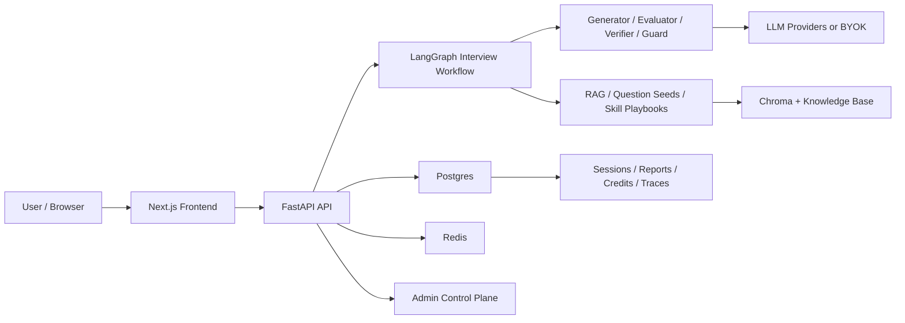

# Agentic Interviewer

Agentic Interviewer is an AI mock interview system built around a multi-agent
workflow. It is not a simple chat demo: the project connects an interview
runtime, account ownership, platform usage credits, admin operations, and
production-readiness checks into one coherent engineering artifact.

In product terms, it helps a user complete a realistic mock interview, receive
multi-dimensional feedback, review weak areas, and continue training from prior
records. In engineering terms, it demonstrates how an agentic workflow can be
wrapped with the control-plane pieces a real SaaS product would need.

## What Makes It Interesting

| Area | What this project covers |
| --- | --- |
| Agentic workflow | LangGraph-based interview loop with director, generator, evaluator, verifier, reward update, report, and training plan stages. |
| Interview experience | Setup from resume/JD, text interview, voice interview, answer feedback, final report, replay, weak-area practice links, and progress history. |
| Session resilience | Durable session state, browser recovery tokens, account-owned records, anonymous session compatibility, and claim-to-account flow. |
| Retrieval and context | Resume/JD parsing, session anchors, Chroma/BM25 retrieval, structured question seeds, skill playbook injection, and context assembly. |
| Learning loop | Trace, outcome, reward, Thompson Sampling bandit, verifier drift, and admin observability surfaces. |
| SaaS control plane | Login/register, HttpOnly cookie auth, roles, user management, credits, credit ledger, credit requests, BYOK separation, and admin operations. |
| Production readiness | Deployment preflight, DB schema upgrade safeguards, admin bootstrap script, production runbook, and smoke drill checklist. |

The project is positioned as a training and feedback tool, not a hiring
decision engine. Some internal historical field names still use recruitment
terms for backward compatibility, but user-facing copy is framed around
interview practice, scoring, feedback, and growth signals.

## Demo Walkthrough

A strong demo path is:

1. Open the app and go to the interview setup page.
2. Fill candidate/job information or upload a resume/JD.
3. Start a platform-hosted interview or switch to BYOK with a personal API key.
4. Answer several questions and observe follow-up / next-question behavior.
5. Open the final report and review score breakdown, evidence, feedback, and
   training plan.
6. Visit interview history to see account records versus local anonymous
   records.
7. Open the account panel to view credits, recent credit ledger entries, and
   credit request flow.
8. Log in as an admin and inspect user management, credits, requests, interview
   history, trace explorer, and observability panels.

## Architecture



The core interview loop is driven by LangGraph:

```text
setup / resume parse
  -> self intro
  -> director sample
  -> ask question
  -> wait answer
  -> evaluator
  -> verifier / reward update
  -> follow-up | next question | final report
  -> training plan
```

The runtime also keeps a side channel for learning and observability:

```text
generation traces -> outcomes -> rewards -> bandit update -> admin dashboards
```

## Control Plane

The control plane is intentionally treated as part of the main product, not as a
separate login-page afterthought.

- **Auth and ownership:** product accounts use HttpOnly cookies. Logged-in
  sessions are bound to `owner_user_id`; anonymous browser records remain local
  until explicitly claimed.
- **Credits:** platform-hosted interviews debit account credits. BYOK interviews
  do not consume platform credits, but they may consume the user's own provider
  quota.
- **Credit ledger:** grants, debits, refunds, admin adjustments, and approved
  credit requests are recorded through an append-only ledger.
- **Admin role:** admin users can inspect users, balances, ledgers, credit
  requests, interview records, and workflow observability. Admin promotion is an
  operator script action, not a frontend self-service flow.
- **Production gate:** `APP_ENV=prod` preflight blocks unsafe defaults such as
  memory backends, missing admin token, stub LLM mode, and open registration
  with free credits but no email-verification requirement.

## Tech Stack

| Layer | Stack |
| --- | --- |
| Backend API | Python 3.11+, FastAPI, Uvicorn, Pydantic |
| Agent runtime | LangGraph, LangChain, multi-agent workflow nodes |
| Persistence | PostgreSQL, SQLAlchemy, LangGraph checkpointing |
| Shared runtime state | Redis |
| Retrieval | Chroma, BM25, OpenAI/stub embeddings |
| LLM providers | OpenAI, Anthropic, DeepSeek, OpenAI-compatible providers, stub mode |
| Voice | WebSocket, ASR/TTS provider routing, browser recording |
| Frontend | Next.js 14 App Router, React 18, TypeScript, Tailwind |
| Admin / observability | Admin role APIs, trace explorer, bandit/drift dashboards |
| Testing | Pytest, Node source tests, TypeScript typecheck, Next production build |

## Repository Layout

```text
ai-interviewer/
  backend/
    app/
      api/v1/              # auth, account, interview, voice, admin APIs
      core/                # settings, logging, preflight, rate limits
      engine/              # LangGraph workflow, agents, RAG, context
      services/            # persistence, auth, credits, requests
      models/              # SQLAlchemy models
      scripts/             # seed, smoke, admin promote, import tools
    docs/                  # backend design and rollout docs
    knowledge/             # question seeds, skills, examples, strategy memory
    tests/unit/            # backend unit tests
    docker-compose.yml
    pyproject.toml
    README.md
  frontend/
    src/app/               # Next.js routes
    src/components/        # layout, auth, admin, interview UI
    src/lib/               # API clients, auth, credits, storage, hooks
    tests/                 # frontend source tests
    README.md
  docs/                    # project-level plans and runbooks
  README.md
```

## Quick Start

### Prerequisites

- Python 3.11+
- Node.js 18.17+ or 20 LTS
- npm
- Docker Desktop
- Optional: an OpenAI / Anthropic / DeepSeek API key

The project can run in stub mode without a real model key.

### 1. Start infrastructure

```powershell
cd ai-interviewer/backend
docker compose up -d postgres redis chroma
```

### 2. Start backend

```powershell
cd ai-interviewer/backend
python -m venv .venv
.\.venv\Scripts\Activate.ps1
pip install -e ".[dev,voice]"
copy .env.example .env
python -m app.scripts.seed_kb
uvicorn app.main:app --reload --port 8000
```

Health check:

```text
http://localhost:8000/health
```

To run without real model calls, set these in `backend/.env`:

```env
LLM_PROVIDER=stub
EMBEDDING_PROVIDER=stub
ASR_PROVIDER=stub
TTS_PROVIDER=stub
CHECKPOINT_BACKEND=memory
```

To use a real OpenAI-backed route:

```env
LLM_PROVIDER=openai
LLM_MODEL=gpt-4o-mini
OPENAI_API_KEY=your-key

EMBEDDING_PROVIDER=openai
EMBEDDING_MODEL=text-embedding-3-small
```

### 3. Start frontend

```powershell
cd ai-interviewer/frontend
npm install
copy .env.local.example .env.local
npm run dev
```

Open:

```text
http://localhost:3000
```

The frontend dev server proxies `/api/v1/*`, `/ws/voice/*`, `/health`, and
`/admin/*` to the backend.

## Admin Bootstrap

There is no default admin account.

1. Register a normal account from the frontend.
2. Promote it from the backend:

```powershell
cd ai-interviewer/backend
python -m app.scripts.promote_admin --email admin@example.com
```

3. Log in again as that account.
4. Enable the admin UI when needed:

```env
NEXT_PUBLIC_ADMIN_NAV_ENABLED=true
```

`API_TOKEN` remains available as an emergency / bootstrap fallback, but the
normal admin path is `role=admin` account login.

## Verification

Backend:

```powershell
cd ai-interviewer/backend
python -m pytest tests/unit -q
ruff check app/core/deployment_preflight.py app/core/settings.py app/scripts/promote_admin.py
```

Frontend:

```powershell
cd ai-interviewer/frontend
npm test
npm run typecheck
npm run build
```

Production readiness smoke:

```powershell
cd ai-interviewer/backend
python -m app.scripts.production_smoke --check-deps
```

## Key Documents

- [Backend README](./backend/README.md): backend setup, workflow modules, env
  variables, persistence, RAG, and voice details.
- [Frontend README](./frontend/README.md): Next.js setup, routes, UI structure,
  polling, and voice frontend details.
- [Production Readiness Runbook](./docs/PRODUCTION_READINESS_RUNBOOK.md):
  deployment env checklist, preflight rules, smoke drill, troubleshooting, and
  rollback guidance.
- [Architecture one-pager](<./docs/项目架构一页纸.md>): workflow runtime,
  control plane, data/state layers, production boundary, and interview talking
  points.
- [Resume and interview talking guide](<./docs/简历与面试讲解稿.md>): resume
  bullets, 30-second and 2-minute project pitches, deep-dive Q&A, and project
  close-out framing.
- [Phase 3.0 product and launch decisions](./docs/PHASE_3_0_产品与上线决策.md): project close-out
  decision, launch posture, commercialization boundaries, and resume framing.
- [Local development command reference](<./docs/本地开发命令速查.md>): local command reference for Docker,
  backend, frontend, and troubleshooting.

The repository-level reference knowledge base starts at
[reference/MEMORY.md](../reference/MEMORY.md). Use it for repo-scoped pattern
borrowing and cross-project comparisons, not as a replacement for official docs.

## Current Scope and Boundaries

Completed scope:

- agentic mock interview main workflow,
- text and voice interview paths,
- reports, replay, weak-area practice, and progress history,
- account ownership and anonymous compatibility,
- platform credits and BYOK separation,
- admin role operations and observability,
- production preflight and launch runbook.

Deferred scope:

- email verification,
- invite-code registration,
- captcha / bot protection,
- payment checkout,
- memberships or subscription plans,
- formal admin audit log,
- full public production operations.

This boundary is intentional. The project is currently best presented as a
portfolio-ready, production-aware AI application rather than as a fully operated
commercial SaaS.
