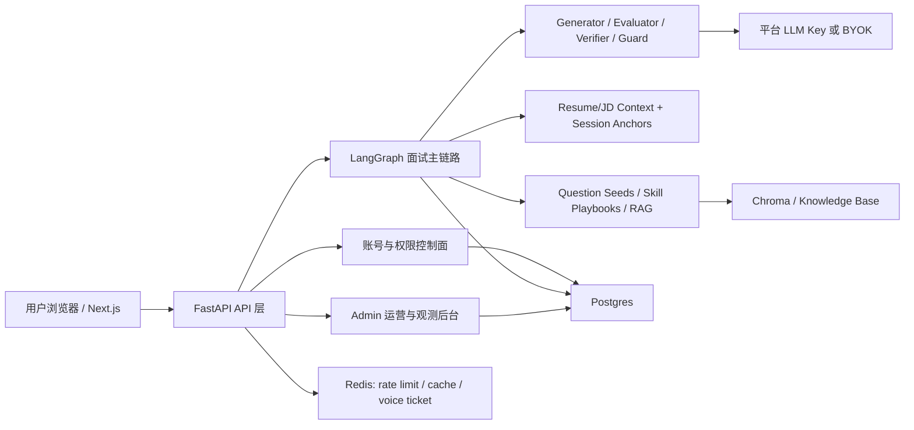

# 项目架构一页纸

> 用途：给 README、项目讲解和简历面试准备使用。重点不是罗列所有文件，
> 而是说明 Agentic_Interviewer 如何把 agentic workflow、产品控制面和生产
> readiness 串成一个完整工程闭环。

## 1. 架构主张

Agentic_Interviewer 不是一个普通聊天机器人，而是一个围绕“完成一次高质量模拟面试”构建的 agentic workflow 产品。它的核心价值来自两层闭环：

- **业务主链路**：完成面试设置、提问、回答、评分、追问、报告、复练。
- **控制面闭环**：管理账号归属、平台额度、BYOK、admin 运维、生产预检和部署演练。

项目的工程亮点在于：没有把登录、额度、后台、部署预检当作附属功能，而是把它们作为 workflow runtime 的 ownership/control-plane 补强。

## 2. 总体结构



这一层结构可以概括为：

- **Frontend** 负责用户体验、账号入口、面试页、历史页、报告页和 admin 面板。
- **FastAPI** 负责 API 边界、认证、会话、额度、admin 和生产预检。
- **LangGraph workflow** 负责面试主链路状态机。
- **Postgres/Redis/Chroma** 分别承载业务状态、共享运行时状态和检索能力。
- **LLM provider routing** 支持平台托管 Key 与用户 BYOK 并存。

## 3. 面试主链路

```text
setup / resume parse
  -> self intro
  -> director sample
  -> ask question
  -> wait answer
  -> evaluator
  -> verifier / reward update
  -> follow-up | next question | final report
  -> training plan
```

主链路由 LangGraph 状态机驱动，每个节点承担清晰职责：

- `setup / resume parse`：整理候选人、岗位、简历和 JD 上下文。
- `director sample`：根据当前状态选择下一步面试策略。
- `ask question`：结合上下文、题库、RAG 和策略生成问题。
- `wait answer`：等待文本或语音回答，保持 HITL 中断点。
- `evaluator`：按 rubric 评分，并生成证据与反馈。
- `verifier / reward update`：对边界答案做校验，把结果写入学习旁路。
- `final report / training plan`：产出多维度报告、复练建议和成长信号。

这个 workflow 的重点不是一次 LLM 调用，而是把多轮状态、策略、证据、评分和恢复能力组织成一个可继续、可观测、可复盘的系统。

## 4. 控制面与归属边界

控制面围绕“谁拥有这场面试、谁消耗平台资源、谁能管理后台”展开。

| 能力 | 架构边界 |
| --- | --- |
| 登录/注册 | 普通账号使用 HttpOnly Cookie；不把 admin token 当普通用户身份。 |
| 记录归属 | 登录创建的 session 绑定 `owner_user_id`；匿名记录只属于本浏览器，显式 claim 后才进入账号。 |
| 平台额度 | 平台托管面试开始时扣 1 次；ledger 记录免费赠送、扣减、退款、admin 调整和申请审批。 |
| BYOK | 用户个人 API Key 不扣平台次数，但消耗用户自己的模型服务额度。 |
| Admin | `role=admin` 账号进入后台；`API_TOKEN` 只作为 bootstrap / emergency fallback。 |
| 注册防滥用 | 生产 preflight 拦住“开放注册 + 免费额度 + 不要求邮箱验证”的裸奔组合。 |

这层控制面的意义是：让面试主链路从“能跑”提升到“能被拥有、能被运营、能被上线审查”。

## 5. 数据与状态分层

| 数据/状态 | 存储或载体 | 作用 |
| --- | --- | --- |
| 面试 session / report | Postgres | 持久化账号记录、报告、恢复元数据。 |
| LangGraph checkpoint | Postgres | 支持 HITL 面试在进程重启后恢复。 |
| Auth session | Postgres + HttpOnly Cookie | 保存登录态，禁用用户后旧 cookie 不再认证。 |
| Credit account / ledger | Postgres | 额度余额与 append-only 账本。 |
| Credit request | Postgres | 用户申请额度、admin 审批。 |
| Trace / outcome / reward | Postgres | workflow 观测、策略学习和 admin 诊断。 |
| Rate limit / voice ticket / cache | Redis | 多 worker 生产环境共享运行时状态。 |
| RAG / anchors | Chroma + knowledge files | 支撑题库、简历锚点、技能卡和检索上下文。 |
| 本地匿名历史 | Browser storage | 兼容未登录体验，不等同于账号记录。 |

这个分层避免把所有状态塞进前端或一次性 prompt，也让生产问题可以按“账号、会话、额度、trace、运行时依赖”分别排查。

## 6. 生产化边界

项目已经具备生产 readiness 证据，但没有把自己扩成完整商业 SaaS。

已经补齐：

- production preflight：阻断 memory backend、stub LLM、缺 admin token、危险注册策略等。
- schema upgrade safeguards：启动时 additive upgrade，兼容旧 SQLite/Postgres 表。
- admin bootstrap：普通账号注册后通过 `promote_admin` 脚本升为 admin。
- smoke drill：覆盖登录保持、开始面试、扣额度、我的记录、admin、额度申请。
- runbook：记录 env checklist、DB、BYOK、排障和回滚建议。

明确延后：

- 邮箱验证、邀请码、支付、会员、完整审计日志、正式生产运维自动化。

这个边界适合项目展示：它证明作者理解公开上线会遇到什么，但没有把作品集项目拖进支付/风控/运营长尾。

## 7. 面试讲解口径

一句话：

> 我做的是一个 production-aware 的 agentic mock interview system：主链路用 LangGraph 编排多智能体面试，外层补了账号归属、额度账本、BYOK、admin 后台和生产预检。

展开时可以按四段讲：

1. **Workflow runtime**：多节点状态机完成提问、评分、追问、报告和复练。
2. **Context/RAG**：简历、JD、题库、skills、session anchors 共同构建面试上下文。
3. **Control plane**：账号、记录归属、平台额度、BYOK、admin 管理形成 SaaS 边界。
4. **Production readiness**：preflight、schema upgrade、smoke drill、runbook 证明上线风险被显式管理。

最重要的取舍：

- 不把项目包装成招聘决策系统，而是训练反馈工具。
- 不在当前阶段继续做支付和邮箱验证，而是把它们列为 Phase 3.x backlog。
- 不让匿名记录默认变成账号资产，必须由用户显式保存/认领。
- 不让 BYOK 消耗平台额度，也不把平台 Key 暴露到前端。
