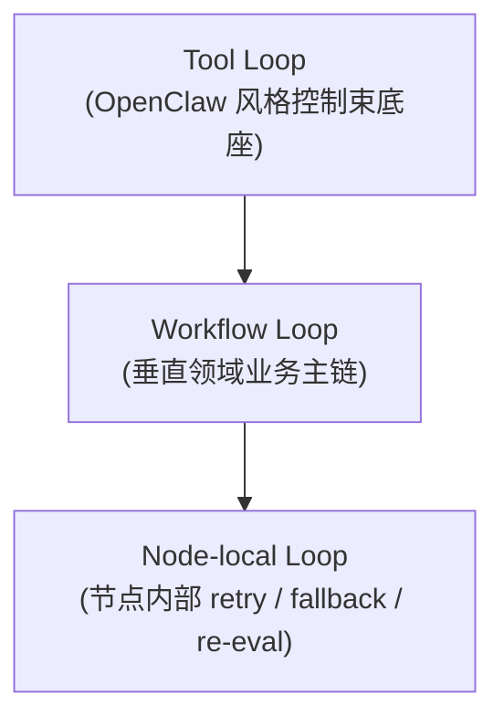
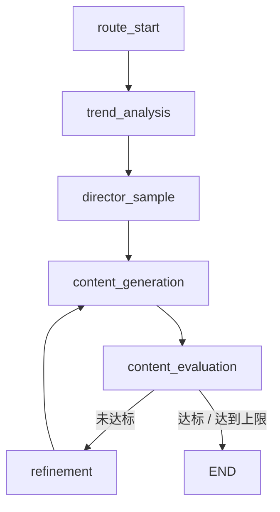
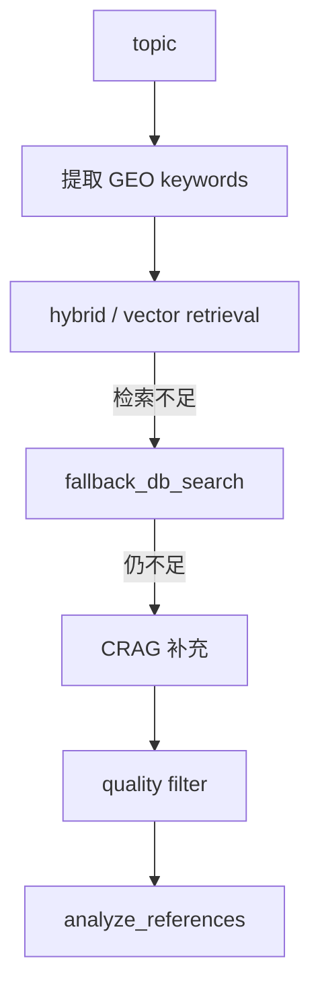
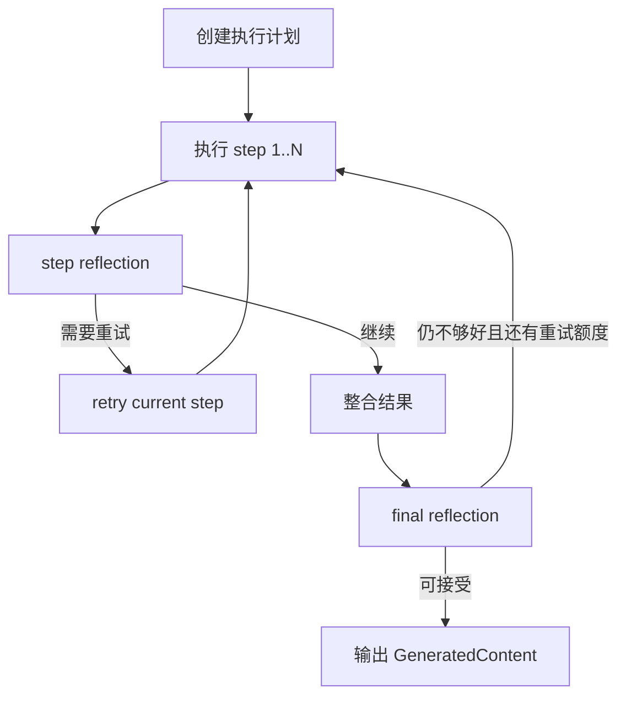
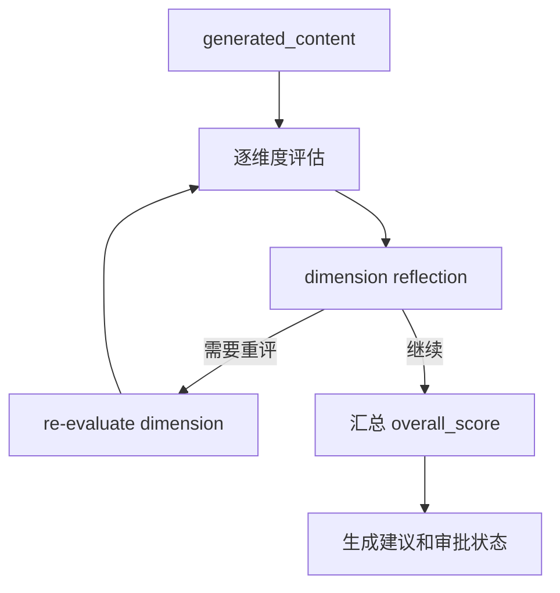
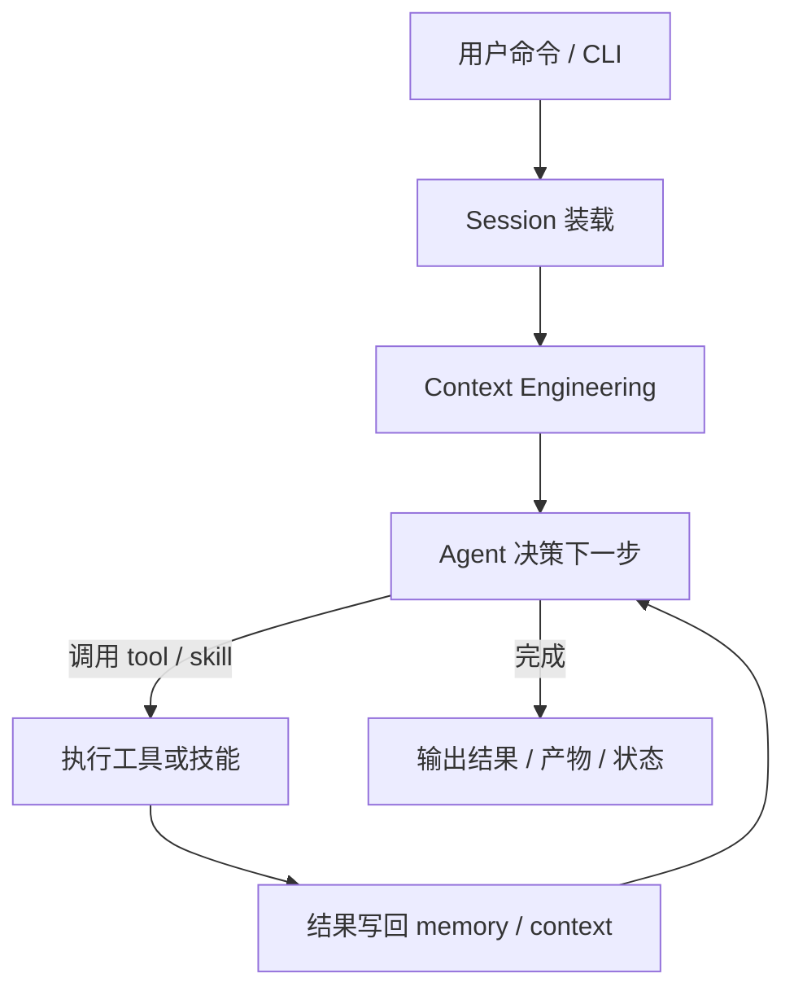
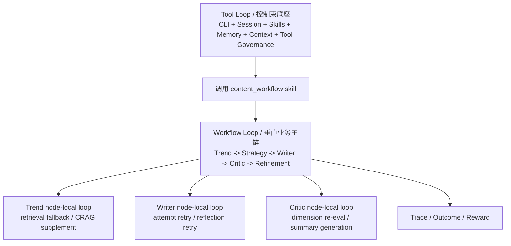

# 混合架构中的底座与三层 Loop 边界

## 1. 这份文档要回答什么

这份文档只回答一个问题：

**如果我的项目采用“OpenClaw 风格控制束底座 + 垂直领域 Workflow Agent”这种混合架构，那么系统里的三种 loop 应该怎么理解、怎么分层、怎么协作？**

这里说的三种 loop 是：

- `tool loop`
- `workflow loop`
- `node-local loop`

这份文档不展开具体实现代码，而是把：

- 三种 loop 的定义
- 它们和 `Agentic_Content_Optimizer` 当前 LangGraph 主链的对应关系
- 它们在我的混合架构里的合理职责边界
- 它们应该怎么嵌套
- 哪些能力该放在 OpenClaw 风格底座，哪些能力该留在垂直 Workflow Agent

一次性讲清楚。

---

## 2. 先说结论：三种 loop 不是同一层东西

最重要的结论先放前面：

- `tool loop` 属于控制束底座层
- `workflow loop` 属于垂直业务主链层
- `node-local loop` 属于具体业务节点内部

它们不是三个平级模块，而是三层嵌套结构。

最推荐的嵌套关系是：

也就是说：

- 最外层负责“怎么调度能力”
- 中间层负责“业务闭环怎么跑”
- 最里层负责“单个节点怎么把事情做稳”

---

## 3. 为什么要把这三种 loop 分开

因为它们解决的问题完全不同。

### 3.1 `tool loop` 解决的问题

`tool loop` 解决的是：

- 用户发出命令后，系统下一步应该调哪个 skill / tool
- 当前 session、memory、context 应该怎么装载
- 调用完工具之后，结果怎么回写上下文
- 要不要继续调下一个工具

所以它是：

**通用 Agent 运行时循环。**

### 3.2 `workflow loop` 解决的问题

`workflow loop` 解决的是：

- 一条具体的行业工作流应该按什么节点顺序跑
- 不达标时是否重新生成
- 达标时何时结束
- 哪些节点是主链，哪些是可选分支

所以它是：

**业务状态机循环。**

### 3.3 `node-local loop` 解决的问题

`node-local loop` 解决的是：

- 这个节点内部如果第一次失败，是否 fallback
- 如果结果不好，是否 retry
- 如果局部评估不稳，是否重评

所以它是：

**节点内部稳定性循环。**

---

## 4. 结合 `Agentic_Content_Optimizer`，三种 loop 现状分别是什么

如果只看当前 `Agentic_Content_Optimizer` 的 LangGraph 主链，那么结论是：

- 有 `workflow loop`
- 有 `node-local loop`
- **没有通用意义上的 `tool loop`**

这点一定要分清。

---

## 5. `workflow loop`：`Agentic_Content_Optimizer` 现在最核心的 loop

这条 loop 就是 LangGraph 主图里的业务环。

它的核心路径是：

这里的循环对象不是工具，也不是 session，而是：

- 内容生成
- 内容评估
- 迭代修正

它的退出条件来自：

- `quality_threshold`
- `max_iterations`
- `agent_mode`

所以 `execution_config` 真正控制的是：

- 这条业务 loop 最多转几圈
- 什么分数算达标
- 本次请求走完整链还是降级链

这不是 OpenClaw 的工具循环，而是：

**以业务结果为驱动的工作流级循环。**

---

## 6. `node-local loop`：`Agentic_Content_Optimizer` 节点内部已经存在的小循环

虽然当前项目没有通用 tool loop，但节点内部已经存在很多局部 loop。

### 6.1 Trend 节点里的局部 loop

Trend 节点内部不是只查一次，而是多级 fallback：

这里的 loop/链式退化解决的是：

- 检索结果不足怎么办
- 如何尽量把上下文补齐

它是节点内部的“多级退化与补足”。

### 6.2 Writer 节点里的局部 loop

Writer 节点内部有明显的：

- plan step 执行循环
- reflection 驱动的 retry
- attempt 级重试

可以抽象成：

这里的循环解决的是：

- 一次生成不够好时，如何在节点内部修正

### 6.3 Critic 节点里的局部 loop

Critic 节点内部也有：

- 多维度评估循环
- 单维度 reflection 后重评

可以抽象成：

所以 `node-local loop` 的本质是：

**节点内部把结果做稳，但不改变主 workflow 图的业务边界。**

---

## 7. `tool loop`：OpenClaw 风格底座里的通用 Agent 运行时循环

这个 loop 在当前 `Agentic_Content_Optimizer` LangGraph 主链里没有真正存在。

它更像我后面混合架构里要补上的那一层。

它可以抽象成：

它的特征是：

- 循环对象：通用能力调用链
- 谁决定继续：agent runtime
- 退出条件：当前任务已完成或被显式终止
- 能力范围：CLI、session、skills、memory、context、tool 权限与审计

这和 `Agentic_Content_Optimizer` 当前 workflow loop 的最大区别是：

- workflow loop 的下一步是预定义的
- tool loop 的下一步是动态决定的

换句话说：

- workflow loop 是“预先编排好的业务链”
- tool loop 是“运行时决定下一步的通用 Agent 链”

---

## 8. 三种 loop 的最清楚对照表

| loop 类型 | 所属层次 | 在 `Agentic_Content_Optimizer` 当前主链中是否存在 | 循环对象 | 谁决定继续 | 退出条件 | 典型例子 |
| --- | --- | --- | --- | --- | --- | --- |
| `tool loop` | 控制束底座层 | 没有通用版 | 通用工具/技能调用链 | runtime / agent | 任务完成、用户终止、策略判断 done | CLI 命令后连续调 skill / tool |
| `workflow loop` | 垂直业务主链层 | 有 | 整条业务闭环 | workflow 控制逻辑 | 达阈值、达上限、模式截断 | `Writer -> Critic -> Refinement -> Writer` |
| `node-local loop` | 节点内部 | 有 | 单个节点的子流程 | 节点内部代码 | retry 用完、fallback 结束、结果可接受 | Trend fallback、Writer retry、Critic re-eval |

你以后判断某个循环属于哪一层，可以直接问：

- 它是在决定“下一步调哪个能力”吗？
  - 如果是，偏 `tool loop`
- 它是在决定“整条业务链要不要再转一轮”吗？
  - 如果是，偏 `workflow loop`
- 它是在决定“当前这个节点内部要不要再试一次”吗？
  - 如果是，偏 `node-local loop`

---

## 9. 为什么这三层分法特别适合我的混合架构

因为我的目标不是只做一个业务 workflow，也不是只做一个通用 agent，而是两者结合：

- 外层要体现 OpenClaw 风格的底座能力
- 内层要体现垂直领域 Workflow Agent 的行业应用能力

所以最合理的组合不是二选一，而是分层组合。

可以概括成这一句：

**OpenClaw 风格底座负责通用控制束，垂直 Workflow Agent 负责受控业务闭环，节点内部再各自做局部稳定性循环。**

---

## 10. 我最推荐的组合：底座负责什么，垂直 Workflow Agent 负责什么

这是这份文档里最关键的一段结论。

我最推荐的组合是：

### OpenClaw 风格底座负责

- `CLI`
- `Session`
- `Skill Registry`
- `Memory Policy`
- `Context Builder`
- `Tool 权限与审计`

这些能力解决的是：

- 用户怎样把任务发给系统
- 系统怎样维护会话和运行状态
- 系统怎样发现和路由 skill
- 系统怎样装配上下文
- 系统怎样安全地调用工具

它们不应该直接承担具体的 Trend / Writer / Critic 业务逻辑。

### 垂直 Workflow Agent 负责

- `Trend`
- `Policy Sampling`
- `Writer`
- `Critic`
- `Refinement`
- `Trace/Outcome/Reward`

这些能力解决的是：

- 业务上下文怎么来
- 内容策略怎么选
- 内容怎么生成
- 质量怎么评估
- 如何迭代修正
- 如何形成真实业务反馈学习闭环

它们不应该反过来去承担 CLI、session、memory orchestration 这类控制束职责。

### 10.1 一个容易混淆但非常关键的点：`Trace / Outcome / Reward` 到底属于 workflow 还是底座

这部分最容易被误判成“底座能力”或者“纯业务能力”，更准确的说法是：

**`Trace / Outcome / Reward` 是一项“业务主导、底座托管”的跨层能力。**

也就是说，它不是完全只属于一边。

#### 为什么说它在业务语义上属于 workflow

因为 `Trace / Outcome / Reward` 记录和反馈的对象，本质上是这条业务主链里的东西：

- 这次内容是怎么生成的
- 这次用了哪套 `policy_id`
- 这次评估分数如何
- 这次上线后的真实效果如何
- 这次真实效果最终要更新哪套策略

这些问题都只有垂直 Workflow Agent 自己最清楚。

换句话说：

- `Trace` 记录的是业务 workflow 的执行快照
- `Outcome` 记录的是业务产物上线后的真实表现
- `Reward` 回灌的是业务策略层，而不是通用 CLI 或 session 层

所以从“语义归属”上看，它们明显更靠近：

- `Trend`
- `Policy Sampling`
- `Writer`
- `Critic`
- `Refinement`

这一侧。

#### 为什么说它在工程承接上又离不开底座

虽然语义属于业务，但一旦要把它做成真实系统，就会立刻碰到底座能力：

- `trace_id` 如何全局唯一
- 这些记录如何落库
- 哪个用户有权回填 Outcome
- 哪个 session / request / user 和这次 trace 关联
- 日志、审计、可观测性怎么统一处理
- 数据存储、查询、生命周期怎么管理

这些问题就不应该由 `Writer` 或 `Critic` 自己来扛，而更适合由控制束底座承接。

所以从“工程承接”上看，它们又明显需要：

- Session
- Memory Policy
- Tool 权限与审计
- 持久化与追踪基础设施

这一侧的配合。

#### 最准确的边界划分

最推荐这样划：

##### 垂直 Workflow Agent 负责

- 定义 trace 里哪些业务字段必须记录
- 定义 outcome 里哪些指标才算这个业务的真实结果
- 定义 reward 的业务含义和计算逻辑
- 决定 reward 最终更新到哪个策略对象上

##### OpenClaw 风格底座负责

- 提供 trace / outcome 的持久化通道
- 提供 request_id / session_id / user_id / trace_id 的统一管理
- 提供权限校验与审计能力
- 提供统一的日志、事件、存储与查询能力

所以更准确地说：

- **“记录什么、为什么记录、记录后怎么学”属于业务层**
- **“怎么存、怎么查、怎么管、谁能改”属于底座层**

#### 放到三层 loop 结构里怎么理解

如果放回这份文档的三层结构里，可以这样看：

- `workflow loop`
  - 决定何时产出 `policy_id`
  - 决定何时生成 `Trace`
  - 决定真实 `Outcome` 应该反馈给哪套策略
- `tool loop`
  - 提供 trace / outcome 回填命令入口
  - 组织 session、权限、上下文、审计
  - 让这些能力以可控工具/skill 的方式被调用
- `node-local loop`
  - 一般不直接拥有 `Trace / Outcome / Reward`
  - 但它们的局部行为会被 workflow 汇总进 trace

所以 `Trace / Outcome / Reward` 不是第三种独立 loop，而是：

**横跨 tool loop 和 workflow loop 的一条“学习与追踪通路”，其中业务语义由 workflow 主导，工程承接由底座负责。**

#### 为什么这点对混合架构特别重要

如果把 `Trace / Outcome / Reward` 完全塞到底座里，会有两个问题：

- 底座会被迫理解太多业务字段
- reward 会失去和 `policy_id`、业务策略空间的强绑定

如果把它完全塞进业务 workflow 里，也会有两个问题：

- 业务层会被迫承担存储、权限、审计、查询这些基础设施职责
- 会破坏底座层本来应该统一提供的治理能力

所以最合理的做法不是二选一，而是：

**业务层定义语义，底座层承接治理。**

这也是为什么在前面的职责划分里，我把：

- `Trace / Outcome / Reward`

列在“垂直 Workflow Agent 负责”的那一侧，但你在架构实现上仍然要让底座帮它们提供：

- ID 体系
- session 关联
- 权限校验
- 存储与审计

### 10.2 用一句话记住这个边界

如果你后面只想快速回忆这个点，可以直接记这一句：

**`Trace / Outcome / Reward` 的“业务含义和学习逻辑”属于垂直 Workflow Agent，而它们的“存储、追踪、权限、审计”属于 OpenClaw 风格底座。**

### 10.3 `Session / Memory / Context` 和业务 state 的边界怎么划

这也是混合架构里最容易混淆的一组边界。

如果你现在心里的困惑更偏向“`Agentic_Content_Optimizer` 这条 LangGraph 主链到底算不算 multi-agent、它的 Agent 是否各自持有独立上下文、它们之间怎么通信”，建议先配合阅读 [LANGGRAPH_WORKFLOW_BUSINESS_LOOP.md](./LANGGRAPH_WORKFLOW_BUSINESS_LOOP.md) 里关于 multi-agent 与通信机制的那一节。那一节讲的是当前主链怎么跑；这里讲的是你后面自己做混合架构时，这几类概念应该怎么分层。

最推荐的记法是：

- `Session` 管容器
- `Memory` 管沉淀
- `Context` 管当前可见输入
- `业务 state` 管 workflow 推进

如果只记一句话，我最推荐记这一句：

**`Session` 是运行容器，`Memory` 是长期沉淀，`Context` 是当前节点可见输入，`业务 state` 是垂直 workflow 的状态机本体。**

#### `Session` 是什么

`Session` 最适合承载的是：

- `session_id`
- `user_id`
- 当前 workspace / 环境
- 当前激活的 skill
- 当前 run 是否在执行
- 权限、取消状态、配额等会话级信息

它回答的问题是：

**“这是谁、在哪个会话里、当前在跑什么任务、还能不能继续跑？”**

所以 `Session` 更像“运行容器”或“任务外壳”。

#### `Memory` 是什么

`Memory` 最适合承载的是跨步骤、跨运行、甚至跨会话保留下来的长期信息。

例如：

- 用户偏好
- 已导入资料
- 历史 trace 索引
- 历史 outcome 汇总
- 长期知识条目
- 可复用模板和策略统计

它回答的问题是：

**“系统长期记住了什么，后续还能拿来检索和复用什么？”**

所以 `Memory` 更像“沉淀层”。

#### `Context` 是什么

`Context` 不是数据库，也不是长期记忆，而是：

**某个节点、某次模型调用当下真正能看到的输入集合。**

它通常由 `Context Builder` 动态组装，来源可能包括：

- 本次 request 的一部分字段
- 从 memory 中检索出来的少量相关信息
- 从当前 workflow state 中抽出的必要字段
- 当前节点特有的 prompt variables

它回答的问题是：

**“这一步执行时，到底把哪些信息拿给模型或节点看？”**

所以 `Context` 的生命周期最短，也最应该被裁剪。

#### `业务 state` 是什么

`业务 state` 指的是垂直 Workflow Agent 自己那条状态机的运行本体。

在内容工作流里，它最典型的字段是：

- `topic`
- `platform`
- `references`
- `selected_action`
- `policy_id`
- `generated_content`
- `evaluation`
- `iteration`
- `final_content`
- `final_score`

它回答的问题是：

**“这条业务链现在跑到哪一步、已经产出了什么、下一步应该去哪？”**

所以 `业务 state` 的核心作用不是长期沉淀，而是：

- 驱动节点跳转
- 驱动 refinement
- 承载当前 run 的真实进度

#### 为什么这四者一定要分开

因为它们的生命周期和职责完全不同。

##### `Session`

- 生命周期：会话级
- 可能跨多个命令、多个 workflow run

##### `Memory`

- 生命周期：最长
- 可以跨会话、跨多次任务长期存在

##### `Context`

- 生命周期：最短
- 通常只活在某一次节点执行或某一次模型调用里

##### `业务 state`

- 生命周期：一条 workflow run
- 从开始到结束
- 必要时可 checkpoint / resume

只要把生命周期一放在一起看，边界就会清楚很多。

#### 最容易踩的四类坑

##### 不要把 `Session` 塞进 `业务 state`

例如：

- 权限信息
- workspace 元信息
- CLI 命令历史
- 大量 session 控制字段

这些不应该直接成为 workflow state 的一部分。

更合理的做法是：

- 业务 state 只拿少量必要的运行时快照
- 其余会话级信息仍留在底座 session 层

##### 不要把 `Memory` 当成 `state`

例如：

- 把 `generated_content`
- `evaluation`
- `references`

这类本次运行临时产物直接当成长久 memory 主体

这是不合适的。

更合理的做法是：

- 它们先属于本次业务 state
- 只有真正值得长期保留的部分，才提升为 trace / artifact / indexed memory

##### 不要把 `Context` 当成数据库

例如：

- 每个节点都把全部 session
- 全部 memory
- 全部 state

一股脑喂给模型

这会让：

- token 膨胀
- 语义污染
- 上下文噪声激增

更合理的做法是：

- `Context Builder` 按节点裁剪
- 当前步骤只看到当前最需要的信息

##### 不要让节点自己随意越层读取全部 memory

如果每个业务节点都自行去扫全库、拼上下文，很快就会出现：

- 上下文来源失控
- 调试困难
- 无法统一治理

更合理的做法是：

- 底座层统一提供 context building / retrieval adapter
- 业务节点只消费被授权、被裁剪过的上下文

#### 放到我的混合架构里，最推荐谁负责什么

##### OpenClaw 风格底座负责

- `Session`
- `Memory`
- `Context Engineering`

也就是说，底座负责：

- 会话生命周期
- 长期记忆治理
- 当前节点上下文的受控组装

##### 垂直 Workflow Agent 负责

- `业务 state`
- 状态迁移
- 节点输入输出契约
- refinement 逻辑
- stop policy

也就是说，垂直业务层负责：

- 这条状态机怎么推进
- 各阶段产出是什么
- 什么时候继续、什么时候结束

#### 用 `Agentic_Content_Optimizer` 的内容工作流举一个完整例子

假设用户发出命令：

`content run --topic "AI 提效工具" --mode full_pipeline`

这时四层最合理的分工是：

##### `Session`

保存：

- `session_id`
- `user_id`
- 当前激活 skill 是 `content_workflow`
- 当前 run 是否正在执行

##### `Memory`

可能提供：

- 用户偏好的内容风格
- 历史高表现 topic / policy
- 过去导入的行业资料
- 历史 trace / outcome 汇总

##### `Context`

到了不同节点时会变化：

- Trend 节点 context：
  - `topic + platform + rag config + 少量相关知识`
- Writer 节点 context：
  - `action + references + geo_keywords + audience/style + feedback`
- Critic 节点 context：
  - `generated_content + references + quality_threshold`

##### `业务 state`

在 workflow 中持续变化：

- 初始：`topic / platform / iteration = 0`
- Trend 后：`references`
- Strategy 后：`selected_action / policy_id`
- Writer 后：`generated_content`
- Critic 后：`evaluation / final_score`
- Refinement 后：`iteration + 1`

所以它们的关系不是谁替代谁，而是：

- `Session` 提供运行容器
- `Memory` 提供长期沉淀
- `Context` 提供当前可见输入
- `业务 state` 提供 workflow 推进本体

#### 最后用一句话收住这个边界

如果你后面只想快速回忆，我最推荐记这一句：

**底座层用 `Session` 承接会话、用 `Memory` 承接沉淀、用 `Context` 承接当前输入装配；垂直 Workflow Agent 则用 `业务 state` 承接这条业务链的真实推进。**

### 10.4 为什么这两个边界问题要放在一起理解

`Trace / Outcome / Reward` 的边界，和 `Session / Memory / Context / 业务 state` 的边界，最好一起理解。

因为它们都在回答同一个大问题：

**混合架构里，到底哪些东西属于底座的运行治理，哪些东西属于垂直业务主链的语义本体。**

把这两组边界同时看清楚，你后面做架构时会更不容易把：

- 会话容器
- 长期记忆
- 当前上下文
- 业务状态
- 追踪与学习闭环

混成一团。

---

## 11. 推荐的整体嵌套图

这张图可以作为“混合架构中的底座与三层 loop 边界”的总图。

它表达的是：

- 用户通过 CLI 或其他入口进入系统
- 底座通过 tool loop 组织 session、context、skill 调用
- 其中某个 skill 会触发垂直内容工作流
- 内容工作流作为一条独立的 workflow loop 跑业务闭环
- 各节点内部再有自己的 node-local loop

---

## 12. 在我的混合架构里，这三层应该怎样落位

这里不展开代码实现，只讲概念落位。

### 12.1 `tool loop` 的落位

应该放在“底座层 / harness 层”。

它的核心职责是：

- 接收命令
- 建立和恢复 session
- 装配运行上下文
- 决定调用哪个 skill
- 统一记录 memory / trace
- 管理工具权限和审计

这一层最像“Agent Runtime / Agent OS”。

### 12.2 `workflow loop` 的落位

应该放在“垂直业务层 / content_workflow 层”。

它的核心职责是：

- 定义工作流状态
- 定义节点顺序和分叉
- 定义 stop policy
- 定义 refinement 何时触发
- 输出最终业务结果

这一层最像“受控状态机业务引擎”。

### 12.3 `node-local loop` 的落位

应该放在“各业务节点内部”。

它的核心职责是：

- 节点内部 retry
- fallback
- 子步骤重试
- 局部质量修正

这一层不应该被抽成全局框架，否则容易把本来清晰的业务边界搞乱。

---

## 13. 哪些东西不能放错层

这是后面做架构时最容易踩坑的地方。

### 13.1 不要把垂直业务节点放进底座层

例如：

- Trend
- Writer
- Critic

这些都不应该出现在“通用 CLI / session / skills runtime”这一层作为底座内核逻辑。

原因是：

- 它们是业务能力，不是通用控制束能力

### 13.2 不要把 session / memory orchestration 塞进业务 workflow

例如：

- CLI 命令处理
- 跨任务 session 生命周期
- 通用 tool 权限

这些也不应该由内容工作流自己承担。

原因是：

- 它们属于 Agent 底座层

### 13.3 不要把节点内部 retry 升级成全局通用 tool loop

Writer 的 retry、Trend 的 fallback、Critic 的重评，都是局部稳定性逻辑。

如果把它们硬抽成一套“全局 agent 工具循环”，反而会丢掉：

- 清晰的业务边界
- 易解释的节点职责
- 可控的工作流结构

---

## 14. 这三种 loop 和 `execution_config` 的关系

前面我们还专门聊过一个容易误解的问题：

`execution_config` 控制的是不是 OpenClaw 那种 tool loop？

答案是：不是。

`execution_config` 控制的是：

- 本次 workflow 最多循环几轮
- 质量阈值是多少
- 走哪条业务路径

也就是：

- `workflow loop` 的总控参数

而不是：

- `tool loop` 的下一步工具决策参数

所以要特别记住：

### `execution_config` 服务的是 `workflow loop`

例如：

- `max_loops`
- `quality_0_10`

这些都是：

- 业务主链转几轮
- 什么时候停

### `runtime_config` 更偏向服务节点和业务运行细节

例如：

- `rag`
- `rl`
- `agent.mode`
- `generation`

它们会影响：

- Trend 怎么检索
- Director 怎么采样策略
- Writer 怎么生成
- Critic 怎么评估

但都不是通用 tool loop 的 runtime。

---

## 15. 用 `Agentic_Content_Optimizer` 的业务再举一遍三层 loop 的例子

假设用户发出命令：

`content run --topic "AI 提效工具" --mode full_pipeline`

在我的混合架构里，这个命令会被三层 loop 分别处理。

### 第一步：`tool loop` 处理

底座会做：

1. 读取当前 session
2. 读取 memory policy
3. 组装 context
4. 决定调用 `content_workflow` 这个 skill

### 第二步：`workflow loop` 处理

`content_workflow` skill 内部启动业务主链：

1. Trend
2. Strategy
3. Writer
4. Critic
5. Refinement
6. 必要时再次 Writer

### 第三步：`node-local loop` 处理

在具体节点内部：

- Trend 会做多级 retrieval fallback
- Writer 会做 reflection 驱动的 retry
- Critic 会做局部重评

所以同一个请求，其实会同时穿过三层 loop，但每层处理的问题不同。

---

## 16. 为什么这种结构最适合作为作品亮点

因为它能同时讲清楚两种能力：

### 16.1 底座能力

你可以很清楚地展示你做了：

- CLI 命令体系
- session 生命周期
- skill 路由
- memory/context engineering
- tool 权限治理

这部分体现的是“控制束工程能力”。

### 16.2 垂直行业能力

你也可以很清楚地展示你做了：

- 趋势检索
- 策略采样
- 内容生成
- 质量门控
- outcome/reward 学习闭环

这部分体现的是“行业 Workflow Agent 能力”。

这比“只会用一个 workflow 框架”或“只会做一个 agent shell”都更完整。

---

## 17. 如果要为 ACO 这类 Workflow Agent 设计底座，应该怎么设计

前面我们已经反复确认过一件事：

- `Agentic_Content_Optimizer` 当前主链不是聊天 Agent
- 它没有把 `HumanMessage / AIMessage / ToolMessage` 作为工作流主载体
- 它也没有 OpenClaw 那种开放式通用 tool loop

但这**不等于**底座没有意义。

更准确的结论是：

**ACO 这类系统不需要“聊天式底座”，但仍然需要“面向 workflow/control-plane 的底座”。**

如果你后面真的要做“Mini-OpenClaw + 垂直 Workflow Agent”混合架构，这个判断非常关键。

### 17.1 先把一个容易误判的结论纠正过来

很容易出现这样的推理：

1. ACO 不是聊天 Agent
2. 它没有 `HumanMessage / ToolMessage`
3. 很多节点输入直接来自 `state`
4. 所以 `Session / Memory / Skills / Tools / Context Engineering` 这些底座模块也没必要

这个推理只对了一半。

对的部分是：

- ACO 的 LangGraph 主链确实不是靠聊天消息历史驱动
- 它确实主要靠 `request + runtime_config + workflow state`
- 它也确实没有通用意义上的模型工具调用循环

但错的部分是：

**把“不是聊天式系统”继续推成“底座不需要”。**

因为底座的价值，从来不只等于：

- 聊天消息管理
- tool calls 协议
- 多轮对话历史拼接

对于 workflow agent 来说，底座更重要的价值其实是：

- 运行控制
- 会话治理
- 长期沉淀
- 上下文裁剪
- 能力入口治理
- 权限与审计

### 17.2 `workflow state` 到底能解决什么，不能解决什么

`workflow state` 在这类系统里当然重要，但它只解决一类问题：

**“这一次 run 现在跑到哪了，已经产出了什么，下一步该去哪。”**

例如：

- `references`
- `selected_action`
- `policy_id`
- `generated_content`
- `evaluation`
- `iteration`

这些都很适合进 state。

但它不适合承接这些问题：

- 这次 run 属于谁、在哪个 session 里
- 当前 run 能不能取消、恢复、重放
- 当前系统可调用哪些能力
- 跨 run 的用户偏好和历史资料如何复用
- 哪些上下文该给 Writer，哪些不该给 Critic
- 哪些工具允许被哪些能力调用
- 这次执行要不要审计、追踪、人工审核

所以一定要记住：

- `state` 是业务推进体
- 它不是运行时操作系统

### 17.3 什么时候底座可以做薄，什么时候不能

如果你的目标只是：

- 接一个固定请求
- 跑一条固定 workflow
- 返回结果

那底座当然可以做得很薄。

这种情况下，很多控制逻辑确实可以直接写在 API + workflow 外壳里。

但如果你的目标是你现在这个混合架构项目，也就是希望系统支持：

- CLI 命令入口
- 多个能力入口
- trace 查询
- outcome 回填
- reward 同步
- 资料导入
- 用户偏好
- run 取消 / 恢复 / 重放
- 人工审核
- 权限治理

那底座就重新变得很有价值。

换句话说：

- **单一固定工作流产品** 可以薄底座
- **带控制束亮点的混合架构项目** 不应该没有底座

### 17.4 这类底座应该怎么重新定义

如果按聊天 Agent 的习惯去理解底座，你会觉得：

- 没有 `HumanMessage`
- 没有 `ToolMessage`
- 没有开放式技能调用

那底座好像没用。

但如果按 workflow/control-plane 的角度看，底座应该被重新定义成：

**一层服务于垂直 workflow 的运行控制面。**

它负责的不是“多轮聊天体验”，而是：

- 给 workflow 提供稳定入口
- 管理 run 和 session
- 装配节点级上下文
- 沉淀长期业务记忆
- 暴露受控工具能力
- 做 trace / audit / permission 治理

所以 ACO 风格底座的关键词不是：

- chat
- conversation
- tool calling

而更像：

- runtime
- control plane
- workflow entry
- governed context
- persistent learning memory

### 17.5 `Session` 在这类底座里该是什么

在聊天 Agent 里，`Session` 很容易被理解成“对话线程”。

但在 ACO 这类系统里，`Session` 更应该理解成：

**任务运行容器 / 控制容器。**

它更适合承接的是：

- `session_id`
- `user_id`
- 当前 workspace / 环境
- 当前激活 skill
- 当前 run_id / request_id / trace_id
- 当前是否正在执行
- 是否允许取消 / 人工审核 / 恢复

它解决的问题不是：

- “刚才你说过什么”

而是：

- “这次任务属于谁，在哪个运行容器里，当前生命周期是什么状态”

所以即使没有 `HumanMessage`，`Session` 依然有价值。

### 17.6 `Memory` 在这类底座里该是什么

在聊天 Agent 里，`Memory` 常常被想成：

- 对话记忆
- 上一轮说过的话

但在 ACO 这类系统里，更合理的 `Memory` 应该是：

**长期业务记忆 / 学习记忆 / 资料记忆。**

它更适合沉淀的是：

- 用户偏好的内容风格
- 导入的行业资料
- 历史高表现 topic / policy
- trace 索引
- outcome 汇总
- reward 统计
- prompt 模板版本
- 可复用参考库

所以在这类系统里，`Memory` 的重点不是“记住聊天”，而是：

- 让后续 run 可复用长期沉淀
- 让 reward 学习闭环有地方存活
- 让用户资产和知识资产跨 run 保留

### 17.7 `Context Engineering` 在这类底座里该是什么

如果把 `Context Engineering` 理解成“把聊天记录拼进 prompt”，那你会觉得 ACO 不需要它。

但这只是聊天型系统里的一个特殊子集。

对 workflow agent 来说，`Context Engineering` 更准确的定义是：

**给当前节点组装“恰好够用”的输入视图。**

这意味着它会综合：

- 一部分 `workflow state`
- 一部分 `runtime_config`
- 一部分长期 memory
- 一部分平台规则 / 模板 / 外部资料

然后裁成当前节点真正可见的输入。

例如：

- Trend 看到：`topic + platform + rag config + 少量相关知识`
- Writer 看到：`references + selected_action + audience/style + feedback + 必要资料摘要`
- Critic 看到：`generated_content + references + quality threshold + 审核标准`

所以“上下文直接从 state 里取”只说对了一半。

更完整的说法是：

- `state` 是上下文的重要来源之一
- 但上下文仍然需要按节点裁剪、拼装、限权

这件事本质上仍然是 `Context Engineering`。

### 17.8 `Tools` 在这类底座里该是什么

你刚才抓到的一个关键点是：

- ACO 当前主链没有通用 `tool_calls`

这完全正确。

但“没有模型工具调用”不等于“没有工具层”。

在混合架构里，工具完全可以定义成：

- retrieval / search
- data import
- trace inspect
- outcome sync
- reward sync
- prompt lookup
- policy stats query
- artifact store
- cover generation

这些能力不一定都要暴露给模型自由调用。

更合理的做法是：

- 由 runtime / skill / workflow 受控调用
- 底座负责权限、配额、审计和统一接口

所以这类系统的 `Tools` 更像：

**受控能力接口层**

而不是：

**给 LLM 自主函数调用的一组开放工具**

### 17.9 `Skills` 在这类底座里该是什么

ACO 当前确实没有成熟的 `skill registry`，这一点你判断得没错。

但在你的混合架构里，skill 仍然有价值，只是它应该做薄、做稳。

最合理的理解是：

**skill 是 runtime 对外暴露的稳定能力入口。**

例如可以有：

- `content_workflow`
- `trace_inspect`
- `outcome_sync`
- `dataset_import`

其中：

- `content_workflow` skill 内部再去跑固定主链
- `trace_inspect` skill 提供调试与追踪入口
- `outcome_sync` skill 负责把业务效果回灌到学习层

所以 skill 的意义不是让模型“自由探索世界”，而是：

- 给 CLI 和 runtime 一个清晰的能力目录
- 给底座一个清晰的治理单元

### 17.10 最推荐的底座职责划分

结合前面的所有讨论，我仍然最推荐这组职责分工：

#### OpenClaw 风格底座负责

- `CLI`
- `Session`
- `Skill Registry`
- `Memory Policy`
- `Context Builder`
- `Tool 权限与审计`

这些能力回答的是：

- 用户怎么进入系统
- 当前任务怎么被托管
- 哪些能力可以被调
- 长期沉淀放哪
- 节点上下文怎么裁
- 工具怎么被治理

#### 垂直 Workflow Agent 负责

- `Trend`
- `Policy Sampling`
- `Writer`
- `Critic`
- `Refinement`
- `Trace / Outcome / Reward` 的业务语义

这些能力回答的是：

- 这条行业工作流怎么跑
- 业务闭环怎么推进
- 这次生成如何被评估并纳入学习飞轮

### 17.11 一个最实用的最小底座清单

如果你不想一上来把底座做得过重，我最建议先有下面这几个最小单元：

- `CLI / command entry`
- `session manager`
- `skill registry`
- `context builder`
- `trace store`
- `memory store`
- `tool executor / permission layer`

其中：

- `trace store` 更偏运行轨迹与回放
- `memory store` 更偏长期业务沉淀

这两个不要混成一个东西。

### 17.12 用一句话收住“设计 ACO 底座”这件事

如果把这一整节压成一句话，我最推荐你记这一句：

**ACO 这类系统不需要“聊天式底座”，但非常适合“面向 workflow 和 control-plane 的底座”：让 state 专注于业务推进，让 Session / Memory / Context / Tools / Skills 专注于运行治理和长期复用。**

### 17.13 `Context Builder` 和 `context reset` 在混合架构里分别解决什么问题

这是你后面做混合架构时非常值得先想清楚的一组边界。

因为一旦开始关注：

- 上下文越来越长
- 节点输入越来越复杂
- Writer / Critic 可能出现多轮 retry

就很容易把两种完全不同的机制混在一起：

- `Context Builder`
- `context reset`

更准确的理解是：

- `Context Builder` 是主方案
- `context reset` 是增强方案

它们不是互斥关系，而是分别解决不同层次的问题。

#### `Context Builder` 解决的是什么问题

`Context Builder` 解决的是：

**每当业务闭环流转到一个新节点时，如何从 `state + memory + runtime_config` 里，重新组装一份当前节点最小必要上下文。**

也就是说，它关心的是：

- 当前节点到底需要看什么
- 哪些信息应该注入
- 哪些历史不该带进去
- 哪些 memory 需要检索并压缩

这是一种：

- 节点级
- 默认发生
- 正常路径上的

上下文重建机制。

在你的混合架构里，它最适合服务：

- `Trend`
- `Writer`
- `Critic`

也就是每当 workflow 流转到这些节点时，都由 `Context Builder` 重建一次当前节点的最小输入视图。

#### `context reset` 解决的是什么问题

`context reset` 解决的不是“进入新节点时怎么装配上下文”，而是：

**当某个执行体自己已经拖着一段过长、过脏、过难治理的上下文继续跑下去会明显退化时，如何用更干净的上下文重开。**

它通常意味着：

- 丢掉大段旧上下文
- 保留一份 handoff note / structured summary
- 用干净窗口继续同一任务的后续部分

所以它更像：

- 节点内部长任务的自救机制
- 极端情况下的任务续跑机制

而不是 workflow 正常推进时的默认手段。

#### 在混合架构里，为什么 `Context Builder` 是主方案

因为你的系统本身就是：

- 显式 workflow
- 显式业务 state
- 显式节点边界

在这种系统里，只要你做到：

- `state` 里放真正重要的业务进度
- 每到新节点就用 `Context Builder` 重新组装最小上下文

很多“长上下文拖垮执行”的问题，本来就会小很多。

所以主链层面最值得先做好的不是：

- 上来就做 Anthropic 那种重型 reset

而是：

- 先把 `Context Builder` 做对

#### 在混合架构里，什么时候才需要 `context reset`

只有当某个节点自己也变成长链任务时，`Context Builder` 才可能不够。

典型情况是：

- Writer 节点内部有多轮 planning / retry / reflection / tool use
- Critic 节点内部有多轮 re-evaluate / rubric check / compliance check

这时你虽然进入节点前已经重建过一次上下文了，但节点内部自己又把上下文拖长了。

这时候才值得考虑：

- node-level reset
- attempt-level handoff
- retry 之间只保留最小 structured note

也就是说，`context reset` 更像：

- 节点内部的高级增强机制

而不是：

- 取代 `Context Builder` 的主机制

#### 具体到 `Trend / Writer / Critic`，更适合哪一层

##### `Trend`

通常只需要：

- `Context Builder`

因为它本来就是：

- 一次 topic
- 一次检索链
- 一次 references 构建

通常不会长到需要重型 reset。

##### `Writer`

最可能既需要：

- 进入节点前的 `Context Builder`

也可能在未来增强后需要：

- 节点内部的 `context reset`

因为 Writer 最容易出现：

- 多轮 retry
- 多轮 reflection
- 多次工具补查

##### `Critic`

通常先靠：

- `Context Builder`

就够了。

但如果你把 Critic 做得更强，比如：

- 多轮规则查询
- 多轮重评
- 复杂合规流程

那它也可能需要：

- 节点内部 reset / handoff

##### `Director / route / stop policy`

这类控制面节点一般不需要：

- `context reset`

它们更适合继续维持：

- 显式逻辑
- 显式状态迁移

#### 用一句话收住这个边界

如果把这一小节压成一句话，我最推荐你记这一句：

**在混合架构里，`Context Builder` 负责 workflow 正常流转时的节点级最小上下文重建；`context reset` 只在 Writer / Critic 这类节点自己内部也变成长任务时，作为局部增强机制出现。**

---

## 18. 混合架构里的 Memory 系统：怎么写、怎么读、怎么接到节点上下文

前面我们已经把 `Memory` 定位成：

- 长期业务记忆
- 学习记忆
- 资料记忆

但如果真的要把它做成你的混合架构底座的一部分，还必须继续回答三个更具体的问题：

1. 什么内容值得写进 memory
2. 在什么时机、由谁触发写入
3. 后续又在什么场景下被读出来，究竟是进入 `Context Builder`，还是暴露成 `tool_calls`

这一节就是专门把这三件事讲清楚。

### 18.1 先把“memory 写入”和“模型直接调文件工具写文件”分开

这是最容易混淆的第一步。

如果你脑子里先想到的是：

- 要写 memory
- 那就得让模型有文件操作工具
- 然后模型自己调用文件工具写入

那这条思路并不是最推荐的。

更合理的方式是：

- **节点或模型产出“候选信息”**
- **runtime / extractor 判断这些候选是否值得沉淀**
- **memory write policy 决定要不要写、写到哪类 memory**
- **memory store 负责真正持久化**

也就是说：

`node output / trace / outcome / human feedback -> extractor -> write policy -> memory store`

所以一定要分清：

- `memory 写入` 需要持久化能力支撑
- 但它不等于“默认让模型自由调用文件写入工具”

### 18.2 `MemoryStore` 要不要落到文件，还是数据库 / 检索库

真正必须的是：

- 持久化能力
- 查询能力
- 去重与更新能力

至于底层载体，可以有多种实现。

#### 文件型

例如：

- `memory/preferences.json`
- `memory/policies.json`
- `memory/knowledge/*.md`
- `memory/failure_patterns.json`

优点是：

- 可读性强
- 适合作品集展示
- 容易手工检查

#### 数据库型

例如：

- SQLite
- PostgreSQL

优点是：

- 结构化能力更强
- 查询和更新更稳定
- 更贴近真实系统

#### 检索型 / 向量型

例如：

- 可检索的知识记忆
- reference summary memory
- pattern memory

优点是：

- 更适合后续 `memory_search`
- 更适合挂到 RAG / hybrid retrieval 上

所以真正必须的不是“给模型文件工具”，而是：

- **给底座一个可治理的持久化 memory backend**

### 18.3 谁负责“写 memory”

在混合架构里，我最推荐的分工是：

#### 业务节点负责

- 产出业务结果
- 产出候选可沉淀信息

#### `MemoryExtractor` 负责

- 从运行结果中提炼长期有价值的信息
- 去重
- 压缩
- 归类

#### `MemoryWritePolicy` 负责

- 决定值不值得写
- 写到哪类 memory
- 权重是多少
- 是否需要合并已有条目

#### `MemoryStore` 负责

- 真正落盘 / 落库 / 建索引

所以更准确的说法不是：

- “哪个节点直接写 memory 文件”

而是：

- “哪个节点产出了值得沉淀的候选，随后由 runtime 在合适时机写入 memory”

### 18.4 哪些场景适合触发 memory 写入

我最推荐把写入时机分成五类。

#### 第一类：用户显式导入或确认

这是最稳的写入场景。

例如：

- 导入行业资料
- 导入平台规则
- 用户明确确认内容偏好
- 人工审核后确认某条经验有效

这类信息最适合直接进入：

- `knowledge memory`
- `rule memory`
- `preference memory`

因为它们具有：

- 来源明确
- 价值稳定
- 跨 run 可复用

#### 第二类：workflow 结束后，基于本次 run 做提炼

一轮 run 结束时，你已经有：

- `topic`
- `references`
- `selected_action`
- `policy_id`
- `generated_content`
- `evaluation`
- `trace`

这时不应该把所有中间结果原样写进 memory，而应该只提炼：

- 可复用参考摘要
- 经验证的风格线索
- 明显失败原因
- 值得保留的内容结构模式

这类写入更适合进入：

- `reference summary memory`
- `preference memory`
- `failure pattern memory`

#### 第三类：outcome 回填之后

这是长期 memory 更新里最有价值的触发点之一。

因为这时你终于知道：

- 哪个 `policy_id` 真的表现好
- 哪种 topic / audience / style 组合有效
- 哪种内容结构实际转化高

这类写入更适合进入：

- `policy_stats memory`
- `pattern memory`
- `topic-performance memory`

而且这类更新通常不应该由生成节点触发，而更适合由：

- `outcome_sync`
- `reward updater`
- `post-outcome summarizer`

来触发。

#### 第四类：重复失败模式被观测到

如果多次 run 里重复出现类似问题，例如：

- Writer 经常漏 GEO keyword
- Critic 常在某个维度打低分
- 某平台某类 CTA 反复表现差

那就很适合把这种“重复失败模式”提炼成长期 memory。

这类场景不适合某次单节点立刻写入，而更适合：

- 聚合多次 trace
- 超过阈值
- 再写入 `failure pattern memory`

#### 第五类：人工反馈 / 人工编辑之后

如果后续你支持人工审核、人改稿或人工确认，这也是很好的 memory 写入场景。

例如：

- 人工确认某类标题更适合平台
- 人工补充平台规则解释
- 人工指出某类开头不自然

这类信息最适合进入：

- `human-curated memory`
- `platform rule memory`
- `style preference memory`

### 18.5 具体到 ACO 这条链，哪些节点最可能产出“可沉淀候选”

不是所有节点都一样适合产生长期 memory 候选。

#### `Trend`

最容易产出：

- 可复用参考摘要
- 资料片段
- 行业知识条目

但我不建议 Trend 直接写 memory，而更建议：

- Trend 先写 `references`
- run 结束后由 extractor 判断哪些参考值得沉淀

#### `Writer`

最容易产出：

- 风格偏好线索
- 内容结构模式
- blueprint 模式

也不建议 Writer 在节点内直接落长期 memory，更适合：

- 先写 `generated_content`
- 再由 post-run 或 post-outcome 阶段提炼

#### `Critic`

最容易产出：

- 失败模式
- 审核规则线索
- 质量经验

Critic 很适合成为“经验候选”的来源，但仍然更建议：

- 先写到 `evaluation`
- 再由 runtime 聚合后沉淀

#### `Refinement`

通常不适合直接写长期 memory。

因为它更偏：

- run-local
- iteration-local

它的建议大多应该先进入：

- trace
- run replay

而不是直接进入 long-term memory。

#### `Outcome / Reward` 阶段

这是最适合真正触发长期 memory 更新的阶段之一。

因为它已经接近“真实验证后的沉淀”。

例如可以更新：

- `policy performance`
- `topic-policy performance`
- `audience-style effectiveness`
- `high-performing pattern memory`

### 18.6 我最推荐的第一版写入触发点

如果你现在要做第一版，我最建议只做这三个触发点，最稳：

#### 第一，`import / confirm`

适合写：

- 用户偏好
- 平台规则
- 导入资料

#### 第二，`workflow end`

适合写：

- 参考摘要
- 风格线索
- 失败原因候选

#### 第三，`outcome sync`

适合写：

- `policy_stats`
- 高表现模式
- 长期 reward 相关统计

只做这三种，就已经足够像一个成熟系统了。

### 18.7 那 memory 在什么场景会被读出来

如果说写入解决的是“长期留下什么”，那读取解决的就是：

- 什么时候把这些长期沉淀重新拿出来参与当前 run

最常见的读取场景有这些。

#### 请求刚进入系统时

读取：

- 用户偏好
- 已导入资料
- 平台规则
- 默认配置

用途是：

- 给这次 run 做初始上下文装配

#### `Trend` 节点前

读取：

- 行业知识
- 平台规则
- 相似 topic 的历史参考摘要

用途是：

- 帮助 query expansion
- 帮助 reference building

#### `Writer` 节点前

读取：

- 用户风格偏好
- 高表现内容模式
- 相关知识摘要
- 可复用表达模板

用途是：

- 提高风格一致性
- 降低“凭空乱写”

#### `Critic` 节点前

读取：

- 审核 rubric
- 平台合规规则
- 常见失败模式

用途是：

- 提高评估稳定性

#### `Outcome / 人工审核` 之后

读取：

- 相似案例
- 历史 policy 表现
- 相似 topic 的效果模式

用途是：

- 做归因分析
- 更新统计
- 辅助下一轮沉淀

### 18.8 读取 memory 时，默认更适合 `Context Builder`，而不是直接暴露成 tool_calls

这是混合架构里最关键的读取边界之一。

最推荐的做法是：

#### 第一层：默认隐式读取

由 `Context Builder` 在节点开始前自动完成：

- `memory_search`
- 过滤
- 重排序
- 压缩
- 注入当前节点输入

这是主路径，因为它最：

- 稳定
- 可控
- 易审计
- 易复现

#### 第二层：节点内显式补查

当某个节点确实发现“还缺一块信息”时，再允许它有限调用：

- `memory_search`
- `memory_get`

这是兜底路径，不应该变成默认路径。

所以更准确的说法是：

- `Context Builder` 负责默认读取
- `tool_calls` 只负责节点内有限补查

### 18.9 为什么我建议做成 `memory_search` + `memory_get`

这一点和 OpenClaw 的思路非常一致，而且很适合你的混合架构。

#### `memory_search`

作用是：

- 找候选
- 返回摘要
- 返回 snippet
- 返回 score 和 metadata

它适合做：

- top-k 候选发现
- 当前节点快速拿线索

比较合理的返回字段可以是：

- `memory_id`
- `memory_type`
- `title`
- `summary`
- `snippet`
- `score`
- `source`
- `metadata`

#### `memory_get`

作用是：

- 根据 `memory_id` 获取完整内容

它适合做：

- 选中少数候选后再拿全文
- 避免一开始就把大块内容塞进上下文

所以这两个接口组合起来很自然：

- `memory_search` 负责找候选
- `memory_get` 负责取全文

### 18.10 为什么要支持混合检索和重排序

这也是第一版就值得有的能力。

因为你的 memory 不会只有一种类型：

- 偏好
- 知识资料
- 失败模式
- 高表现模式
- 策略统计

只靠向量检索不够，只靠关键词检索也不够。

更稳的做法是：

#### 检索阶段：混合检索

组合：

- lexical / BM25
- vector retrieval
- metadata filter

元数据过滤条件可以包括：

- `memory_type`
- `platform`
- `user_id`
- `scope`
- `topic`
- `approved_only`
- `confidence`
- `recency`

#### 融合阶段

推荐：

- RRF
- 或加权融合

#### 重排序阶段

再根据当前节点目标做 rerank。

例如：

- Trend 更看重主题相关性与信息密度
- Writer 更看重可写性与风格匹配
- Critic 更看重规则性与约束匹配

所以同一套 memory，对不同节点应该允许不同 rerank 策略。

### 18.11 我最推荐的 memory 读取总路径

你可以直接按这个思路设计：

#### 底层接口

- `memory_search(query, filters, top_k, mode="hybrid")`
- `memory_get(memory_id)`

#### 默认路径

- `Context Builder` 在节点运行前自动调用 `memory_search`
- 对结果做 rerank + compression
- 只把前几条摘要注入节点上下文

#### 节点内兜底路径

- `Trend / Writer / Critic` 可以有限调用 `memory_search`
- 需要全文时再调用 `memory_get`

#### 不建议开放的部分

- `Director`
- `route`
- `should_refine`
- `trace / outcome / reward`

这些部分仍然更适合显式控制。

### 18.12 如果只做第一版，我最推荐的 memory 类型

如果你现在只做第一版，我最建议先做下面四类：

- `knowledge_memory`
- `preference_memory`
- `pattern_memory`
- `policy_stats_memory`

其中：

#### `knowledge_memory`

适合放：

- 行业资料
- 平台规则
- 导入内容

#### `preference_memory`

适合放：

- 用户风格
- 语气偏好
- 表达倾向

#### `pattern_memory`

适合放：

- 高表现模式
- 常见失败模式

#### `policy_stats_memory`

适合放：

- `policy_id` 相关表现统计
- 长期 reward 归因结果

### 18.13 用一句话收住这套 memory 系统

如果把这一整节压成一句话，我最推荐你记这一句：

**混合架构里的 memory 系统，最合理的不是“让模型自己写文件和随意搜”，而是“由 runtime 在 import / workflow end / outcome sync 等关键时机提炼写入，由 Context Builder 默认读取，再保留 `memory_search / memory_get` 作为节点内受限补查工具，并通过混合检索 + 重排序把长期沉淀重新接回当前 workflow。”**

---

## 19. 为什么最适合采用“外层显式编排、内层有限 tool use”

前面我们已经确认过：

- ACO 当前主链不是开放式 tool loop
- 但它内部已经在调用很多能力模块
- 这些能力没有通过开放式 `tool_calls` 暴露给模型

这时一个非常自然的问题就是：

**既然工具能力已经存在，为什么不把它们全面开放给大模型，让模型自己决定何时查资料、何时拿知识、何时调工具？**

如果只是从“模型能力最大化”的角度看，这个想法确实很诱人。

但如果把目标换成“构建一个可解释、可治理、可回灌的混合架构项目”，最合适的答案通常不是：

- 全面开放式 tool calling

而是：

- **外层显式编排**
- **内层有限 tool use**

也就是：

- workflow 主链继续由你显式控制
- 只有部分业务节点，在白名单范围内给模型有限的工具主动性

### 19.1 为什么“全面开放式 tool_calls”不一定更好

开放式 `tool_calls` 的优点当然存在：

- 模型可以自己判断缺什么信息
- 遇到长尾问题时更灵活
- 在开放环境里探索能力更强

但它也会带来一些对 workflow agent 非常致命的问题：

#### 它会削弱主链的稳定性

像 ACO 这类系统，业务主链本来就相对确定：

- Trend
- Strategy
- Writer
- Critic
- Refinement

如果把这些关键步骤是否执行、执行顺序、执行次数交给模型临场决定，就会削弱：

- 流程一致性
- 质量门控
- 可解释性

#### 它会削弱策略归因能力

ACO 最重要的不是“模型能不能多查一次”，而是：

- `policy_id`
- `trace`
- `outcome`
- `reward`

这条链要求你能较稳定地回答：

- 这次用了哪套策略
- 为什么效果变好或变差
- reward 该回灌给谁

如果模型在运行中自由决定：

- 查了哪些工具
- 查了几次
- 用了哪些附加上下文

那你很快会分不清：

- 是策略本身有效
- 还是工具路径偶然更优

这会直接削弱学习闭环。

#### 它会显著增加治理复杂度

一旦工具向模型开放，你就必须处理：

- 哪些工具允许哪个节点调用
- 最大调用次数
- 超时策略
- 重试策略
- 工具结果如何进入 state
- 工具结果是否允许进入长期 memory

这些不是不能做，而是会让你的项目复杂度暴涨。

对“想把控制束底座做成作品亮点”的你来说，全面开放反而可能把边界冲淡。

### 19.2 最适合你的组合：主链必须显式编排，节点可以有限放权

所以最推荐的不是两极：

- 既不是“完全不用工具主动性”
- 也不是“让模型全面开放式自由调工具”

而是中间这条路：

**主链显式编排，节点有限放权。**

具体说就是：

#### 必须继续显式编排的部分

- `request entry`
- `route`
- `policy sampling`
- `stop policy`
- `refinement`
- `trace / outcome / reward`

这些部分属于：

- workflow 控制面
- 学习闭环控制面
- 治理控制面

它们最不适合交给模型自由决定。

#### 可以给模型有限 tool use 的部分

- `Trend`
- `Writer`
- `Critic`

这些部分都具有一个共同特点：

- 信息可能不充分
- 局部补信息会提升质量
- 输出可以被结构化 schema 收口

这就是“适合有限放权”的典型信号。

### 19.3 哪些节点最适合有限 tool use

#### `Trend`

这是最适合开放一点的节点。

因为它的任务本来就是：

- 找信息
- 扩查询
- 补参考
- 过滤材料

在这里开放白名单工具，最符合节点本职。

典型可开放工具：

- `search_references`
- `query_expansion`
- `knowledge_lookup`
- `platform_rule_lookup`
- `reference_filter`

但要限制：

- 最多 `2-3` 次调用
- 只允许检索类和资料类工具
- 输出必须收敛成统一 `references` / `trend context`

#### `Writer`

Writer 也可以有限开放，但必须比 Trend 更谨慎。

因为 Writer 已经处在内容生成核心位，如果放权太多，很容易把主链从“可控生成”变成“自由探索”。

典型可开放工具：

- `reference_lookup`
- `example_lookup`
- `platform_style_guide_lookup`
- `keyword_coverage_check`

但要限制：

- 最多 `1-2` 次调用
- 以只读工具为主
- 不能改变 workflow 路线
- 结果必须回到 `GeneratedContent` schema

#### `Critic`

Critic 也可以少量开放，但更适合：

- 规则查询
- 合规检查
- rubric 获取

而不是大范围探索式检索。

典型可开放工具：

- `rubric_lookup`
- `policy_check`
- `platform_compliance_lookup`
- `quality_rule_lookup`

但要限制：

- 最多 `1-2` 次调用
- 不能直接改内容
- 只能返回结构化评估和建议

### 19.4 哪些地方不应该开放给模型做 tool use

最不应该开放的是这些部分：

#### `Director / policy sampling`

因为这一层最需要的是：

- `policy_id` 稳定
- 策略可追踪
- reward 可归因

如果 Director 也变成开放式工具探索，你后面很难判断：

- 是 policy 生效了
- 还是工具路径改变了结果

#### `route / stop policy / should_refine`

这些决定的是：

- 走哪条业务路径
- 什么时候停
- 是否继续 refinement

它们属于 workflow 控制面，本来就应该由显式逻辑负责。

#### `Trace / Outcome / Reward`

这些是治理面和学习闭环面，更不应该交给模型自由判断：

- 要不要写 trace
- 要不要同步 outcome
- 要不要更新 reward

这些更适合由底座或 runtime 明确执行。

### 19.5 为什么这种做法最适合你的混合架构项目

这正好能同时保住你最想展示的两种能力。

#### 第一，保住“控制束底座”这个亮点

如果整条链都开放给模型自由调工具，项目看起来会更像：

- 一个开放式 agent shell

而不是：

- 一个你自己设计过控制面和边界的混合架构

但你真正想展示的是：

- 你会做控制束
- 你会做运行治理
- 你会划分边界
- 你会做显式 workflow

所以“主链显式、节点有限放权”最能体现这个能力。

#### 第二，保住 ACO 这条业务闭环最有价值的部分

ACO 最值得学的不是“模型能不能更自由”，而是：

- `Trend -> Policy -> Writer -> Critic -> Refinement`
- `policy_id -> trace -> outcome -> reward`

这条链最宝贵的地方在于：

- 可解释
- 可回放
- 可学习
- 可归因

有限开放比全面开放更容易保住这些性质。

#### 第三，更容易控成本、控延迟、控失败模式

有限 tool use 的优势很直接：

- 调用次数可控
- token 成本可控
- 超时和 fallback 更容易设计
- 错误边界更清楚

这比“让模型想查几次就查几次”更工程化。

#### 第四，更适合文档表达和作品叙事

对于项目表达来说，下面这套叙事特别顺：

- 我自研了 OpenClaw 风格控制束底座
- 外层 workflow 明确控制业务主链
- 内层只在 Trend / Writer / Critic 节点开放白名单工具
- 所有工具调用都有次数、权限、schema 和治理边界
- 所有关键业务决策仍然可追踪、可回灌、可归因

这个故事比“我让模型自由调工具”更有工程信号。

### 19.6 最后用一句话收住这个判断

如果把这一整节压成一句话，我最推荐你记这一句：

**最适合你的混合架构项目的，不是“全面开放式 tool calling”，而是“外层显式控制、内层有限放权”：让 workflow 保住稳定与归因，让节点在白名单范围内获得少量主动补信息能力。**

---

## 20. 这份文档最想让你记住的三句话

如果要把整份文档压缩成三句话，我最希望你记住这三句：

1. `tool loop` 决定的是“系统下一步调哪个能力”，属于 OpenClaw 风格控制束底座。
2. `workflow loop` 决定的是“这条行业业务链怎么跑、要不要再来一轮”，属于垂直 Workflow Agent 主链。
3. `node-local loop` 决定的是“某个节点内部要不要再试一次”，属于节点内部稳定性机制。

---

## 21. 最后的总括

对我的混合架构来说，最合理的不是把一切都做成开放式 agent，也不是把一切都做成硬编码流水线，而是：

**用 OpenClaw 风格底座承接通用控制束，用垂直 Workflow Agent 承接受控业务闭环，再让各节点内部保留必要的局部 retry/fallback 机制。**

换句话说，就是：

- 底座层负责“调度能力”
- 业务层负责“跑业务闭环”
- 节点层负责“把事情做稳”

这就是“混合架构中的底座与三层 loop 边界”。
