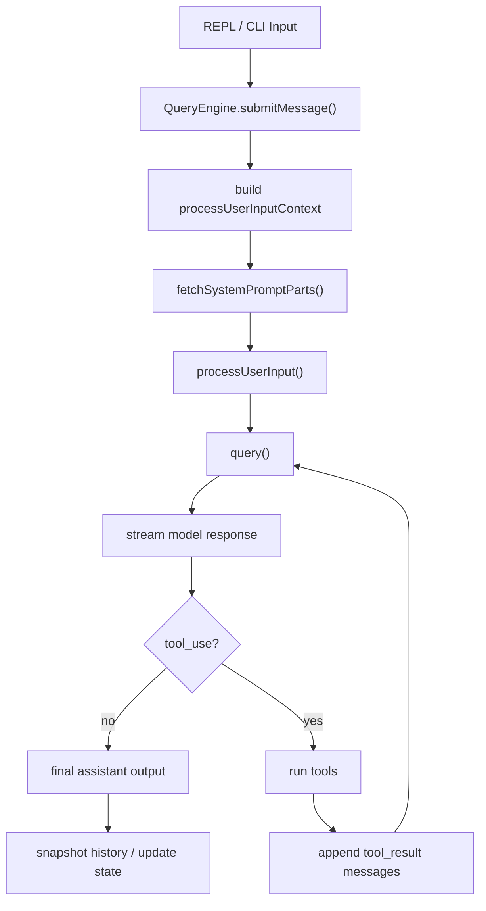
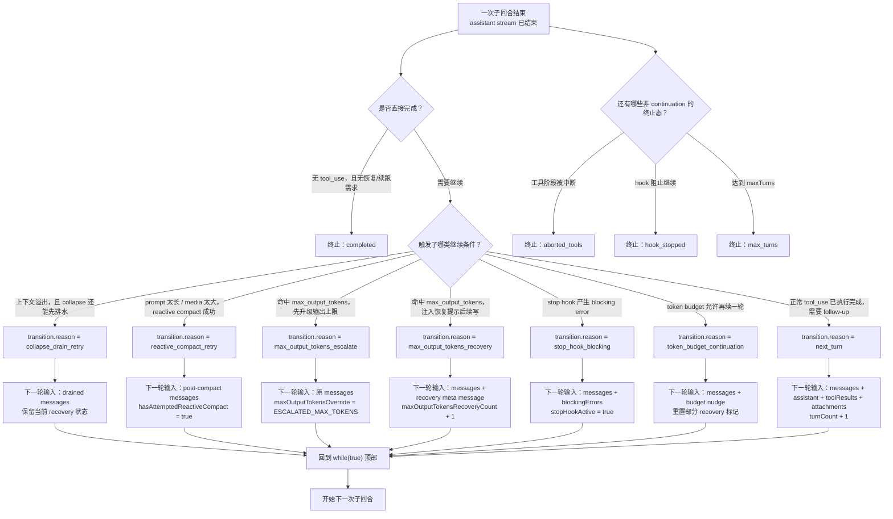
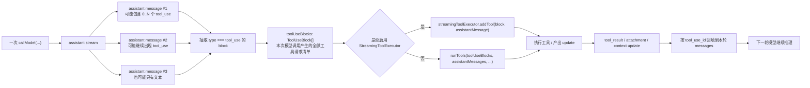
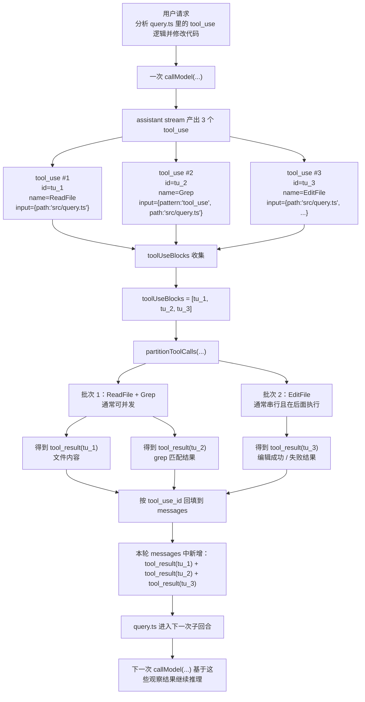
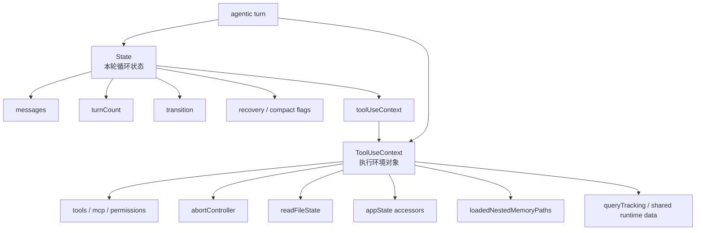

# Agent Loop 深拆

## 模块定位

Agent Loop 是整个系统的运行内核。  
它回答的不是“模型会说什么”，而是更工程化的问题：

- 一次用户输入如何被转成一轮可执行任务
- 模型输出工具调用后，系统如何继续推进
- 工具执行失败、上下文过长、输出截断时，系统怎样恢复
- 一轮完成后，会话状态如何保留下来给下一轮继续使用

如果把 Claude Code 看作一个 agent runtime，那么 Agent Loop 就是它的“调度内核”。

## 核心源码边界

| 文件 | 责任 |
| --- | --- |
| `src/screens/REPL.tsx` | 交互入口，接收用户输入、展示消息、承接权限 UI |
| `src/QueryEngine.ts` | 会话级编排器，负责每轮输入的上下文装配、状态维护、历史快照 |
| `src/query.ts` | 单轮执行状态机，负责模型流式响应、工具循环、压缩与恢复 |
| `src/services/api/claude.ts` | 模型 API 适配层，负责发起流式请求并产出事件 |
| `src/services/tools/StreamingToolExecutor.ts` | 流式工具执行器，允许边接收 tool_use 边启动工具 |
| `src/services/tools/toolOrchestration.ts` | 非流式工具调度器，负责串并行分批执行 |
| `src/query/config.ts` | 单轮 query 的配置输入和行为开关 |

## 分层理解

这个模块不是一个“发请求然后等回复”的函数，而是明确分层的：

1. `REPL.tsx` 管交互和展示，不直接承担核心编排。
2. `QueryEngine.ts` 管会话生命周期，是 conversation-level orchestrator。
3. `query.ts` 管单轮 turn lifecycle，是 turn-level state machine。
4. `api/claude.ts` 管模型请求协议。
5. `services/tools/*` 管工具执行协议。

这种拆法的价值很大：

- 会话状态和单轮循环被拆开了
- UI 和 runtime 被拆开了
- 模型流和工具流被拆开了
- 恢复策略被内嵌进 loop，而不是散在 UI 层

这正是 Harness Engineering 的典型味道：  
模型只是 runtime 的一个部件，而不是系统本身。

## 主执行流程



## 主执行流程详解

如果只看表面，Agent Loop 很像“用户发一句话，模型回一句话”。  
但从源码看，它的真实执行链路更像一条多阶段流水线：

1. 输入进入交互层
2. 会话编排层把这一轮任务初始化好
3. 单轮状态机准备上下文、预算和恢复参数
4. 模型开始流式输出
5. 一旦出现 `tool_use`，控制权暂时从模型切到工具 runtime
6. 工具结果回填为新的消息
7. 单轮状态机决定是否继续下一轮推理
8. 没有后续动作时，这一轮才真正结束

它最关键的特点是：  
主循环的“下一步”并不是由某一个函数单独决定，而是由消息状态、工具结果、压缩状态和恢复状态共同决定。

### 这条主循环也在持续重算和补写上下文

从架构角度看，`query.ts` 的主循环不只是“调模型 -> 调工具 -> 判断是否继续”。  
它还在持续维护上下文闭环：

- 迭代前，从 `state.messages` 重新投影出本轮 `messagesForQuery`
- 迭代末，把本轮新增的 attachment / memory / skill / queued commands 写回 `state.messages`

所以每次循环推进的，不只是任务执行进度，  
还有“下一轮模型将看到什么”这件事本身。更完整的拆解见 [context-engineering.md](D:/Agent/ClaudeCode/claude-code源码/claude-code-main/module-docs/context-engineering.md) 中“Agentic Turn 里的‘迭代前重算’和‘迭代末补写’”一节。

### 阶段 1：输入进入 REPL / CLI

入口通常从：

- `src/entrypoints/cli.tsx`
- `src/main.tsx`
- `src/screens/REPL.tsx`

这一层负责的事情很克制：

- 接收用户输入
- 更新界面
- 把输入交给 `QueryEngine`
- 在工具执行时展示中间状态和权限交互

这里还没有真正进入 agent runtime。  
真正的执行起点，是 `QueryEngine.submitMessage(...)`。

### 阶段 2：`QueryEngine.submitMessage()` 启动一轮会话任务

在 `src/QueryEngine.ts` 里，`submitMessage(...)` 是 turn 级入口。  
它做的第一批事情，可以理解成“为这轮 query 建立运行现场”：

- 读取当前配置，例如 `cwd`、`tools`、`mcpClients`、`thinkingConfig`
- 包装 `canUseTool(...)`，把权限拒绝也记录进 SDK/reporting 侧
- 决定本轮使用的主模型 `mainLoopModel`
- 调用 `fetchSystemPromptParts(...)` 拿到：
  - `defaultSystemPrompt`
  - `userContext`
  - `systemContext`
- 合成最终 `systemPrompt`
- 构造 `ProcessUserInputContext`

这一步非常关键，因为它明确把“模型调用前的准备”放在会话层，而不是塞进 `query.ts`。

换句话说：

- `QueryEngine` 负责把“这一轮要怎么跑”定义清楚
- `query.ts` 负责“这一轮真正怎么推进”

### 阶段 3：输入预处理，主循环获得第一版消息状态

在进入 `query(...)` 前，系统会先做 `processUserInput(...)` 这一类输入预处理。  
这一步主要是在模型开始推理之前，把一些“用户输入的工程化语义”处理掉。

典型作用包括：

- 处理 slash commands
- 更新 `mutableMessages`
- 处理结构化输入块
- 保证后续 loop 拿到的是一致的消息数组

这一阶段结束后，`QueryEngine` 会把准备好的：

- `messages`
- `systemPrompt`
- `userContext`
- `systemContext`
- `toolUseContext`
- `canUseTool`

交给 `src/query.ts`。

此时控制权正式从“会话编排层”切到“单轮状态机层”。

### 阶段 4：`query.ts` 初始化单轮状态机

`query.ts` 一开始不会直接调模型，而是先建立 loop state。

源码里的初始状态至少包括：

- `messages`
- `toolUseContext`
- `maxOutputTokensOverride`
- `autoCompactTracking`
- `stopHookActive`
- `maxOutputTokensRecoveryCount`
- `hasAttemptedReactiveCompact`
- `turnCount`
- `pendingToolUseSummary`
- `transition`

这里要特别注意：  
`query.ts` 不是“本轮只跑一次”，而是 `while (true)` 的 turn loop。

因此这个初始状态不是单次调用参数，而是整个本轮递进过程的状态容器。  
只要出现新的 `tool_result` 或恢复分支，它就会基于新状态继续下一次迭代。

### 阶段 5：预取和预算准备

在每次迭代开始时，`query.ts` 不会立刻调模型，而是先做一批并行准备：

- `startRelevantMemoryPrefetch(...)`：预取相关记忆
- 启动 skill discovery prefetch
- 生成 `queryTracking`
- 从完整历史中切出当前 query window：`getMessagesAfterCompactBoundary(...)`

然后对即将送进模型的消息做一轮“上下文治理”：

1. `applyToolResultBudget(...)`
   - 限制工具结果对上下文的占用
2. `snipCompactIfNeeded(...)`
   - 对历史进行 snip
3. `microcompact(...)`
   - 更轻量的压缩
4. `contextCollapse.applyCollapsesIfNeeded(...)`
   - 让 collapse 投影视图生效
5. `autocompact(...)`
   - 需要时生成 summary messages 并替换上下文窗口

这一步的重要意义是：

- 模型并不是直接看到“原始历史”
- 它看到的是 runtime 预算治理后的工作集

所以 Agent Loop 的真正起点，不是“把聊天记录送给模型”，而是“先把上下文整理成可执行工作面”。

### 阶段 6：建立工具执行器，准备进入模型流

在模型流开始前，`query.ts` 会完成两件关键事情：

1. 决定当前运行模型
2. 决定工具执行模式

如果启用了流式工具执行，会创建：

- `new StreamingToolExecutor(...)`

否则，后面会走：

- `runTools(...)`

这意味着在模型真正开始回答前，系统已经把“如果模型一会儿要调工具，我该怎么接住它”准备好了。

这里体现的是典型 runtime 思维：

- 工具调用不是意外事件
- 工具调用是主循环中的标准阶段

### 阶段 7：调用模型，进入 streaming response

真正的模型调用发生在：

- `deps.callModel(...)`

传进去的核心内容包括：

- `prependUserContext(messagesForQuery, userContext)`
- `systemPrompt`
- `thinkingConfig`
- `tools`
- 当前权限上下文
- 当前模型
- MCP tools / pending MCP 状态
- query tracking
- task budget

这一步开始后，loop 就进入最关键的“流式事件消费阶段”。

在这个阶段里，系统会一边接收 assistant message，一边做下面这些事：

- 收集普通文本输出
- 收集 `tool_use` block
- 识别 recoverable error
- 在 streaming tool execution 模式下，边流边启动工具

### 阶段 8：一旦遇到 `tool_use`，控制权转移到工具 runtime

这是 Agent Loop 最核心的转折点。

当 assistant message 中出现 `tool_use` block 时：

- 这些 block 会被收集进 `toolUseBlocks`
- `needsFollowUp` 会被置为 `true`
- 如果启用了 `StreamingToolExecutor`，工具会立刻进入执行队列

此时主循环的语义已经变成：

- 当前 assistant 输出还没完全等同于最终回答
- 它只是“生成了下一步行动计划”

换句话说，模型在这里输出的不是最终结果，而是下一批 runtime action。

### 阶段 9：工具执行与结果回填

模型流结束后，如果本轮产生了工具调用，系统会进入工具执行阶段：

- 如果使用 `StreamingToolExecutor`，就取 `getRemainingResults()`
- 否则使用 `runTools(...)`

这一步里会持续产出 update：

- `message`
- `newContext`

工具结果会被转成：

- user message 形式的 `tool_result`
- attachment message

并统一追加到 `toolResults`

这个阶段的本质，是把“外部世界的观察结果”重新喂回消息历史。  
也正因为如此，Claude Code 的 loop 才是典型的：

- Thought
- Action
- Observation
- Next Thought

### 阶段 10：补充动态附件

工具跑完并不意味着下一轮可以直接开始。  
系统还会在递归前再补一层动态上下文：

- `getAttachmentMessages(...)`
- memory prefetch consume
- skill prefetch collect
- queued command attachments

这一步很关键，因为它说明“本轮工具执行带来的新上下文”并不只来自 `tool_result`，还来自运行时动态注入。

因此，进入下一轮模型调用前的上下文，实际上是：

- 历史消息
- 本轮 assistant 输出
- 本轮 tool result
- 本轮动态附件

共同组成的。

### 阶段 11：决定是否继续下一轮

当 assistant + tool results + attachments 都收集完成后，`query.ts` 会判断：

- 是否被中断
- hook 是否阻止继续
- 是否达到 `maxTurns`
- 是否还有后续 reasoning 必要

如果需要继续，就构造新的 `State`：

- `messages: [...messagesForQuery, ...assistantMessages, ...toolResults]`
- 更新 `toolUseContext`
- `turnCount + 1`
- reset 某些恢复计数
- 记录 `transition: { reason: 'next_turn' }`

然后重新回到 `while (true)` 顶部，开始下一次迭代。

这就是 Claude Code 里“一次用户输入却发生多轮模型调用”的根本原因。  
从用户视角看是一次请求，从 runtime 视角看是一串有状态的子回合。

### 阶段 12：什么情况下真正结束

主循环真正结束，一般有几类原因：

- 本轮没有 `tool_use`，assistant 输出就是最终结果
- 工具链执行完后不再需要 follow-up
- 用户中断
- 命中 blocking limit / max turns / token budget
- 某些恢复路径最终失败

结束后，控制权回到 `QueryEngine`。  
然后由它负责：

- 更新 `mutableMessages`
- 做文件历史快照
- 更新 attribution
- 输出最终 SDK message / REPL message

所以一次完整执行的闭环其实是：

`REPL -> QueryEngine -> query loop -> tools/attachments/recovery -> QueryEngine -> REPL`

## 循环层级图

下面这张图把 Claude Code 里最容易混淆的四层循环重新画成了“显式分层图”。  
这次我不再依赖 Mermaid 的 subgraph 背景渲染，而是直接给每一层用不同颜色的层标题节点，这样：

- 不容易出现文字遮挡
- 每层边界更清楚
- 第一层和后面三层的关系也更直观

```mermaid
flowchart TB
  classDef layer1 fill:#FDE68A,stroke:#B45309,color:#111827,stroke-width:1.5px;
  classDef layer2 fill:#BFDBFE,stroke:#1D4ED8,color:#111827,stroke-width:1.5px;
  classDef layer3 fill:#C7F9CC,stroke:#15803D,color:#111827,stroke-width:1.5px;
  classDef layer4 fill:#FBCFE8,stroke:#BE185D,color:#111827,stroke-width:1.5px;
  classDef neutral fill:#F8FAFC,stroke:#64748B,color:#111827;

  L1["第 1 层 会话循环<br/>Conversation"]:::layer1 --> U1["等待用户新消息"]:::neutral
  U1 --> U2["QueryEngine.submitMessage()<br/>启动一个新的 agentic turn"]:::layer1

  U2 --> L2["第 2 层 Agentic Turn 主循环<br/>query.ts / while(true)"]:::layer2
  L2 --> T1["初始化 / 解构 State"]:::neutral
  T1 --> T2["准备上下文<br/>memory、budget、compact、collapse"]:::neutral
  T2 --> T3["发起一次模型调用"]:::neutral

  T3 --> L3["第 3 层 模型流循环<br/>for await callModel(...)"]:::layer3
  L3 --> S1["消费 assistant stream"]:::neutral
  S1 --> S2{"是否出现 tool_use"}:::neutral
  S2 -- "否" --> S3["结束这次模型流"]:::neutral
  S2 -- "是" --> S4["收集 toolUseBlocks<br/>可选：边流边启动工具"]:::neutral
  S4 --> S3

  S3 --> T4{"本子回合是否需要动作执行"}:::neutral
  T4 -- "否" --> T7["进入续跑/终止判定"]:::neutral
  T4 -- "是" --> L4["第 4 层 工具执行循环<br/>runTools / StreamingToolExecutor"]:::layer4
  L4 --> X1["执行一个或多个工具"]:::neutral
  X1 --> X2["生成 tool_result / attachment / context update"]:::neutral
  X2 --> T5["把观察结果回填进 messages"]:::neutral
  T5 --> T6["补充动态附件<br/>memory、skill、queued commands"]:::neutral
  T6 --> T7

  T7 --> T8{"是否继续下一次子回合"}:::neutral
  T8 -- "继续" --> T2
  T8 -- "结束" --> T9["agentic turn 完成"]:::layer2

  T9 --> U3["QueryEngine 收尾<br/>快照、状态写回、结果返回 UI"]:::layer1
  U3 --> U1
```



### 这四层到底是什么关系

这四层不是“并列的四个循环”，而是严格的嵌套关系：

1. 最外层是会话循环
   它的职责很简单：
   等用户下一条消息，再启动下一次 `submitMessage()`

2. 会话循环内部，每次用户输入会触发一个 `agentic turn`
   也就是 `query.ts` 里那条 `while (true)` 主循环

3. `agentic turn` 的每一次子回合里，通常会发起一次模型调用
   这就是模型流循环

4. 如果这次模型调用里出现了 `tool_use`
   才会进入工具执行循环

所以正确的理解方式是：

- 第一层包住第二层
- 第二层包住第三层
- 第三层在需要行动时才进入第四层
- 第四层跑完后返回第二层，而不是直接返回第一层

这也是你刚才觉得“第一层和其它层没啥关联”的原因。  
原来的图更强调“嵌套框”，但没有把“返回路径”画得足够明显。  
这次图里我把这条主线明确画成了：

- 第一层启动第二层
- 第二层内部反复调用第三层
- 第三层按需触发第四层
- 第四层结果回填给第二层
- 第二层结束后再回到第一层

### 第 1 层：会话循环到底在循环什么

这一层循环的不是模型，也不是工具，而是：

- 用户输入
- turn 启动
- turn 收尾
- 等待下一条用户输入

它的单位是“用户请求”。

也就是说，它每转一圈，意味着：

- 上一次用户请求已经完整处理完了
- 系统回到待命状态
- 准备接受下一次新的用户请求

所以第一层关心的是：

- 会话是否空闲
- 当前是否已经有 query 在跑
- 下一条消息什么时候到来

这一层最像“前台调度层”。

### 第 2 层：agentic turn 主循环到底在循环什么

这一层循环的是：

- 当前这次请求还要不要继续推理
- 当前这次请求是否已经因为工具结果、恢复分支、预算决策而需要再来一轮

它的单位不是“用户消息”，而是“当前请求内部的一个子回合”。

所以它每转一圈，意味着：

- 这一轮子回合已经拿到了某种结果
  - 可能是 assistant 文本
  - 可能是 tool_result
  - 可能是 compact/recovery 后的新上下文
- 系统需要基于这些结果再决定要不要继续下一轮

这一层是整个 Agent Loop 的核心，因为：

- 多步任务就是在这一层实现的
- 恢复逻辑也是在这一层实现的
- `turnCount` 记录的就是这一层跑了几轮

你可以把它理解成：

- 一次用户请求
- 内部被拆成多次“子回合”
- 每次子回合结束时决定：继续，还是收工

### 第 3 层：模型流循环到底在循环什么

这一层循环的是：

- 同一次模型调用返回的 streaming block / event

它的单位是“流式返回块”，而不是“子回合”。

也就是说，这一层每转一圈，通常不是又发起了一次新推理，而只是：

- 继续接收本次 assistant 输出
- 发现新的文本块
- 发现新的 thinking 块
- 发现新的 `tool_use` 块

所以第三层的职责不是“决定任务是不是完成”，而是：

- 把一次模型调用的流完整消费干净
- 并从中提取出会影响第二层状态的信号

例如：

- 有没有 `tool_use`
- 有没有 recoverable error
- streaming fallback 有没有触发

这一层最像“流解析器”。

### 第 4 层：工具执行循环到底在循环什么

这一层循环的是：

- 本次模型输出的一批工具调用

它的单位是“工具 update / 工具结果”，不是用户请求，也不是模型 token。

也就是说，这一层每转一圈，通常是在：

- 启动一个工具
- 接收一个 progress/update
- 收到一个结果
- 更新上下文

如果是 `StreamingToolExecutor`，它还要额外处理：

- 哪些工具处于 `queued`
- 哪些正在 `executing`
- 哪些已经 `completed`
- 哪些结果已经 `yielded`

所以第四层的职责是：

- 把模型想做的动作真正落地
- 把外部世界的观察结果重新回填给第二层

这一层最像“动作执行器”。

### 再用最容易记的方式压缩一遍

如果你只想记住最本质的区别，就记下面这四句：

- 第 1 层问的是：用户下一条消息来了没有
- 第 2 层问的是：这次任务还要不要再来一轮
- 第 3 层问的是：这次模型调用流里到底吐了什么
- 第 4 层问的是：这批工具调用到底执行成了什么

### 为什么必须拆成这四层

如果把它们混在一起，就会出现很多概念污染：

- 把“用户又发一条消息”误认为“模型又续跑了一轮”
- 把“模型流里来了一个新块”误认为“agent 又完成了一轮推理”
- 把“又执行了一个工具”误认为“会话进入了下一轮”

而 Claude Code 把这四层拆开以后，每层都只承担一个问题：

- 会话层负责会话边界
- agentic turn 层负责任务推进
- 模型流层负责流消费
- 工具层负责动作执行

这才让它看起来像一个 runtime，而不是一堆 callback 拼起来的聊天机器人。

## 状态机与状态说明

上面那张图讲的是“循环层级”。  
但如果你继续往源码里看，很快会遇到另一个问题：

- 哪些状态是代码里真的被显式建模出来的
- 哪些状态只是执行流程里的阶段

Claude Code 这套 Agent Loop 里，两种都有。  
所以这里我分四层讲：

1. 会话层状态机
2. `agentic turn` 主状态机
3. 模型流阶段状态
4. 工具执行状态机

### 1. 会话层状态机：`QueryGuard`

如果只看“是否正在跑 query”，最显式的状态机其实在 [QueryGuard.ts](D:/Agent/ClaudeCode/claude-code源码/claude-code-main/src/utils/QueryGuard.ts)。

它只有 3 个状态：

| 状态 | 含义 | 作用 |
| --- | --- | --- |
| `idle` | 当前没有 query 在执行 | 可以安全地接受下一条输入，或从队列里取下一项 |
| `dispatching` | 已经从队列里取到一项，但还没真正进入 `onQuery` | 防止在“异步链还没接上”的空窗期发生重入 |
| `running` | query 已正式开始执行 | 表示当前会话中有一个 turn 正在进行 |

这层状态机解决的是“会话/交互层并发保护”问题，不是工具推理问题。

你可以把它理解成：

- `idle`：前台空闲
- `dispatching`：正在把一次请求送上跑道
- `running`：引擎已经点火

### 2. `agentic turn` 主状态机：`query.ts` 的 `State`

这一层才是 Agent Loop 的核心状态机。  
它不是靠一个 `status: 'x' | 'y' | 'z'` 字段表示，而是靠一组状态字段共同定义当前所处位置。

也就是说，它是“结构化状态机”，不是“单枚举状态机”。

#### 2.1 核心状态字段

`State` 定义在 [query.ts](D:/Agent/ClaudeCode/claude-code源码/claude-code-main/src/query.ts#L204)。

| 状态字段 | 含义 | 主要作用 |
| --- | --- | --- |
| `messages` | 当前这个 turn 累积到现在的消息历史 | 决定下一次模型调用能看到什么 |
| `toolUseContext` | 当前工具运行时上下文 | 决定工具怎么执行、权限怎么判定、上下文怎么更新 |
| `autoCompactTracking` | 自动压缩历史状态 | 避免 compact 盲目重复，记录最近 compact 的轨迹 |
| `maxOutputTokensRecoveryCount` | `max_output_tokens` 已恢复重试了几次 | 防止无穷续写 |
| `hasAttemptedReactiveCompact` | 是否已经尝试过 reactive compact | 防止 prompt-too-long / media-too-large 恢复死循环 |
| `maxOutputTokensOverride` | 是否临时放宽本次模型输出上限 | 用于 `max_output_tokens` 的升级重试 |
| `pendingToolUseSummary` | 异步中的工具摘要任务 | 不阻塞主链路地生成下一轮要注入的工具摘要 |
| `stopHookActive` | 是否处在 stop hook 干预状态 | 让 hook 可以改变 continuation 语义 |
| `turnCount` | 当前 `agentic turn` 已经跑到第几个子回合 | 控制 `maxTurns`，也用于若干统计与消费时机 |
| `transition` | 上一次为什么会继续到这一轮 | 用于调试、测试、恢复路径判断 |

#### 2.2 这层状态机的“阶段状态”

虽然 `State` 不是单枚举，但它在语义上仍然会经历几个稳定阶段：

| 阶段 | 进入条件 | 在做什么 |
| --- | --- | --- |
| 初始化阶段 | `query()` 刚开始 | 建立第一版 `State` |
| 上下文准备阶段 | 每次 `while (true)` 开头 | 预取 memory、切 query window、做 compact/collapse |
| 模型调用阶段 | `deps.callModel(...)` 开始 | 让模型产出文本或 `tool_use` |
| 工具执行阶段 | 收到 `toolUseBlocks` 后 | 真正运行工具并收集 `tool_result` |
| 附件补充阶段 | 工具跑完后、决定继续前 | 注入 memory、skill、queued command 等附件 |
| 续跑判定阶段 | 一次子回合末尾 | 决定 `continue` 还是 `return` |
| 终止阶段 | 无后续动作或命中终止条件 | 返回 `completed` / `max_turns` / `aborted_tools` 等终态 |

所以这一层状态机最好这样理解：

- `State` 字段是“状态存储”
- `while (true)` 每轮经过的阶段是“状态演化路径”

#### 2.3 `transition` 的状态值

`transition` 本身就是一个“上一轮为什么继续”的显式状态记录。  
从 [query.ts](D:/Agent/ClaudeCode/claude-code源码/claude-code-main/src/query.ts) 里能看到至少这些 continuation 原因：

| `transition.reason` | 含义 | 用途 |
| --- | --- | --- |
| `next_turn` | 正常工具回填后继续下一轮 | 最常见的继续原因 |
| `collapse_drain_retry` | 发生上下文溢出后，先 drain collapse 再重试 | 给 context collapse 恢复路径留机会 |
| `reactive_compact_retry` | 发生 prompt/media 问题后，做 reactive compact 再重试 | 走压缩恢复路径 |
| `max_output_tokens_escalate` | 临时提高输出上限后重试 | 解决一次输出不够长的问题 |
| `max_output_tokens_recovery` | 注入恢复消息后继续 | 让模型接着写 |
| `stop_hook_blocking` | stop hook 介入后继续 | 让 hook 改变主循环语义 |
| `token_budget_continuation` | token budget 允许再续一轮 | 把预算决策接回 loop |

这个字段很重要，因为它让“为什么会继续”变成了状态，而不是藏在消息文本里。

#### 2.4 `transition.reason` 状态迁移图

如果把 `transition.reason` 单独拿出来看，它其实描述的是：

- 上一轮子回合为什么没有结束
- 主循环为什么会 `continue`
- 下一轮会以什么样的状态重新开始

可以把它画成下面这张图：



这张图最关键的阅读方式是：

- `transition.reason` 不是“当前状态名”
- 它是“上一轮为什么会继续”的标签
- 真正的状态仍然体现在 `State` 整体字段上

也就是说，`transition.reason` 更像是主状态机上的“转移标签”，而不是状态机里的节点名字。

#### 2.5 每一种 `transition.reason` 的真实语义

为了避免把这些 reason 看成只是字符串，下面把它们再翻译成人话：

| reason | 人话解释 | 下一轮最重要的变化 |
| --- | --- | --- |
| `collapse_drain_retry` | 先不急着 full compact，先把已经 staged 的 collapse 真正提交掉，再试一次 | `messages` 会变成 drained 之后的版本 |
| `reactive_compact_retry` | 当前上下文已经顶不住了，做一次 reactive compact 后再试 | `messages` 换成 post-compact 结果，且标记“这条恢复路径试过了” |
| `max_output_tokens_escalate` | 不是内容逻辑错了，是输出额度太小了，先放大额度重跑这一轮 | `maxOutputTokensOverride` 被设为更大值 |
| `max_output_tokens_recovery` | 即便放大上限也不够，给模型一条“直接接着写”的 meta message 再续一轮 | `messages` 里会多一条 recovery prompt |
| `stop_hook_blocking` | 模型本轮结束了，但 stop hook 认为不能就这么结束，需要带着 blocking error 再来一轮 | `messages` 里会追加 hook 的 blocking error，`stopHookActive = true` |
| `token_budget_continuation` | 系统判断还有预算、而且再来一轮值得，于是塞一条 budget nudge 给模型继续 | `messages` 里会多一条预算提示，部分 recovery 标志会被重置 |
| `next_turn` | 最普通的 agent loop 续跑：本轮产生了工具结果，需要模型基于观察结果继续推理 | `messages` 会并入 assistant、toolResults、attachments，`turnCount + 1` |

#### 2.6 为什么 `transition.reason` 很重要

如果没有这个字段，主循环虽然也能跑，但有三个问题会很严重：

1. 测试时不知道为什么进入了下一轮
2. 恢复逻辑之间容易互相打架
3. 某些恢复路径没法避免重复触发

最典型的例子就是：

- `collapse_drain_retry`
  - 它会检查上一轮是不是已经走过同样的 drain
- `reactive_compact_retry`
  - 它要避免 prompt-too-long 再次回到同一条恢复路径

所以 `transition.reason` 的价值不是为了日志好看，  
而是为了让主循环里的恢复分支可以“记住自己刚才做过什么”。

### 3. 模型流阶段状态：一次 `callModel(...)` 内部在经历什么

这一层在代码里没有单独的 `enum`，但执行语义很稳定。  
它大致会经历下面几个阶段：

| 阶段 | 含义 | 关键动作 |
| --- | --- | --- |
| 请求发起 | 本次模型调用刚开始 | `yield { type: 'stream_request_start' }` |
| 流式接收 | 正在消费 assistant stream | 接文本块、thinking 块、tool_use 块 |
| 工具检测 | 流里出现 `tool_use` | 收集到 `toolUseBlocks`，标记 `needsFollowUp = true` |
| 可恢复错误识别 | 流里出现 prompt-too-long / media-too-large / max-output-tokens 等错误 | 先暂缓输出，留给恢复分支处理 |
| streaming fallback | 当前流式尝试不可用，需要切换路径 | tombstone 旧 assistant，丢弃旧工具执行器 |
| 流结束 | 本次模型调用完成 | 决定是进入工具执行，还是本轮直接结束 |

所以这层更像“流处理生命周期”，不是业务主状态机。

### 3.1 `tool_use` 到 `toolUseBlocks` 到 `tool_result` 的链路图

你前面问的那个点，最适合单独看这一张小图：

- 一次模型调用里会不会有多个 `tool_use`
- `toolUseBlocks` 到底收集的是什么
- 后面这些请求怎么变成真正的 `tool_result`



#### 一次 assistant stream 里到底能不能有多个 `tool_use`

可以，而且这是这套 runtime 的常规设计目标之一。

更准确地说，有两层“多个”的可能：

1. 同一个 assistant message 的 `content[]` 里，可以有多个 `tool_use` block
2. 同一次模型流式响应里，后续 assistant message 还可以继续出现新的 `tool_use`

所以代码不会假设“这次模型调用只会请求一个工具”。  
相反，它的做法是：

- 每来一条 assistant message
- 就把其中所有 `type === 'tool_use'` 的 block 抽出来
- 统一追加进 `toolUseBlocks`

在 [query.ts](D:/Agent/ClaudeCode/claude-code源码/claude-code-main/src/query.ts#L832) 这一段就能看到这个逻辑：

- 先从 `assistantMessage.message.content` 里过滤 `tool_use`
- 得到 `msgToolUseBlocks`
- 再 `toolUseBlocks.push(...msgToolUseBlocks)`

所以这里的语义非常明确：

- `msgToolUseBlocks`
  - 是“这一个 assistant message 里发现的工具调用请求”
- `toolUseBlocks`
  - 是“这一次模型调用里累计发现的全部工具调用请求”

#### 一个 `tool_use` block 是一个工具，还是一批工具

一个 `tool_use` block 对应一个工具调用请求，不是一批。

最核心的结构大致就是：

```ts
type ToolUseBlock = {
  type: 'tool_use'
  id: string
  name: string
  input: Record<string, unknown>
}
```

从源码的使用方式可以确认，至少这几个字段是核心字段：

- `block.id`
- `block.name`
- `block.input`

也就是说，一个 `tool_use` 的语义是：

- “请调用名字为 `name` 的这个工具”
- “参数是 `input`”
- “这次调用的唯一标识是 `id`”

不是：

- “请在一个 block 里帮我顺便跑好几个工具”

#### `toolUseBlocks` 到底是在干嘛

它本质上是“本次模型调用的动作计划表”。

模型流里出现的 `tool_use`，对 runtime 来说只是“动作请求”，还不是执行结果。  
所以系统要先把这些请求攒起来，形成一个待执行列表，这就是 `toolUseBlocks`。

它的用途至少有四个：

1. 标记本轮需要 follow-up
   只要 `toolUseBlocks` 里有东西，`needsFollowUp` 就会变成 `true`

2. 驱动工具执行
   后面不管走流式执行还是批量执行，输入都是这组 `ToolUseBlock[]`

3. 让 `tool_result` 能和原请求一一对应
   因为 `tool_result` 会带 `tool_use_id`

4. 生成工具摘要
   后面的 `generateToolUseSummary(...)` 也是基于它做的

#### 为什么一定要先“收集”，而不是一看到一个 `tool_use` 就立刻结束

因为在流式响应里，模型可能还没把这次子回合说完。  
如果系统一看到第一个 `tool_use` 就立刻打断流，可能会丢掉：

- 同一条 assistant message 里的其他 `tool_use`
- 后续继续流出来的 `tool_use`
- 同轮文本解释

所以 Claude Code 的设计是：

- 继续消费这次模型流
- 把出现过的 `tool_use` 全都收集起来
- 再统一进入工具执行

唯一的优化是：

- 如果启用了 `StreamingToolExecutor`
- 那么工具可以边流边开始跑
- 但“收集列表”这件事仍然要做

这就是为什么 `toolUseBlocks` 和 `streamingToolExecutor.addTool(...)` 会同时存在：

- 一个负责“记录本轮所有动作请求”
- 一个负责“尽早启动执行，降低延迟”

#### 最容易记的理解方式

你可以把这条链压缩成一句话：

- `tool_use` 是模型提出的单个动作请求
- `toolUseBlocks` 是这次模型调用提出的全部动作清单
- `runTools` / `StreamingToolExecutor` 是动作执行器
- `tool_result` 是动作执行后的观察结果

也就是：

**模型产生命令清单 -> runtime 执行动作 -> 观察结果回填 -> 模型继续推理**

### 3.2 真实示例图：`ReadFile -> Grep -> EditFile`

上面的图还是抽象版。  
如果换成一个真实一点的例子，链路会更好理解。

假设用户说：

> 帮我找到 `query.ts` 里和 `tool_use` 相关的逻辑，然后改一下编辑提示文案

模型可能在一次 assistant stream 里给出下面三次工具调用请求：

1. `ReadFile(path="src/query.ts")`
2. `Grep(pattern="tool_use", path="src/query.ts")`
3. `EditFile(path="src/query.ts", old=..., new=...)`

对应的 runtime 链路可以画成这样：



#### 这个例子里最值得注意的点

第一，`toolUseBlocks` 收集的是“请求”，不是“结果”。

也就是：

- `tu_1`、`tu_2`、`tu_3` 进入 `toolUseBlocks` 时
- 只是说明模型想做这三件事
- 还不代表这三件事已经做完

第二，收集顺序和执行策略是两回事。

例如这个例子里：

- `ReadFile`
- `Grep`
- `EditFile`

虽然它们在 `toolUseBlocks` 里是按 assistant 产出的顺序排列的，  
但真正执行时，runtime 还会再判断：

- 哪些是只读工具
- 哪些是并发安全的
- 哪些必须串行

所以工具执行不是“按数组傻跑”，而是：

- 先保留 assistant 请求顺序
- 再按工具语义分批执行

第三，`tool_result` 和 `tool_use` 是靠 `id` 严格关联的。

也就是说，最后回填的不是泛泛的“ReadFile 成功”，而是：

- `tool_result(tool_use_id = tu_1)`
- `tool_result(tool_use_id = tu_2)`
- `tool_result(tool_use_id = tu_3)`

这保证了系统永远知道：

- 哪个结果对应哪个请求
- 哪些工具已经完成
- 哪些工具结果该被后续摘要、压缩、展示引用

第四，下一轮模型不是“重新开始”，而是“基于观察继续”。

在这个例子里，下一次模型调用能看到的就不是原始用户请求了，而是：

- 原始用户请求
- assistant 的上轮动作规划
- `ReadFile` 的结果
- `Grep` 的结果
- `EditFile` 的结果

也就是：

**模型先规划动作 -> runtime 执行动作 -> 结果回填 -> 模型继续推理**

#### 为什么这个例子能说明 Agent Loop 的本质

因为它把 Claude Code 和普通 function calling 的区别暴露得很清楚。

普通 function calling 往往会让人误以为：

- 模型调一个函数
- 拿回结果
- 结束

而 Claude Code 实际上是：

- 一次 assistant stream 里可能规划多步动作
- runtime 先把动作收集成 `toolUseBlocks`
- 再按工具语义分批执行
- 再把所有观察结果回填进主循环
- 然后再进入下一次子回合

这也是为什么它更像“带执行器的状态机”，而不只是“带函数调用的聊天模型”。

### 4. 工具执行状态机：`StreamingToolExecutor`

这里是另一套非常明确的显式状态机。  
在 [StreamingToolExecutor.ts](D:/Agent/ClaudeCode/claude-code源码/claude-code-main/src/services/tools/StreamingToolExecutor.ts) 里有：

- `type ToolStatus = 'queued' | 'executing' | 'completed' | 'yielded'`

每个状态的含义很清楚：

| 状态 | 含义 | 作用 |
| --- | --- | --- |
| `queued` | 工具已被模型请求，但还没开始执行 | 等待并发条件满足 |
| `executing` | 工具正在运行 | 可能产出 progress，也可能失败或完成 |
| `completed` | 工具已经完成，结果已准备好 | 结果还没一定被主循环消费 |
| `yielded` | 工具结果已经被主循环取走并发出 | 防止重复产出同一个结果 |

这套状态机解决的是“工具可以并发执行，但结果仍需有序回填”的问题。

#### 工具执行层还有一个隐式批次状态

在 [toolOrchestration.ts](D:/Agent/ClaudeCode/claude-code源码/claude-code-main/src/services/tools/toolOrchestration.ts) 里，还存在一个更轻量的批次状态语义：

- 当前批次是否 `isConcurrencySafe`
- 是并发批次还是串行批次

所以工具层其实有两套状态概念：

- 工具实例状态：`queued / executing / completed / yielded`
- 工具批次状态：并发安全批次 / 非并发安全批次

### 5. 这几套状态机分别解决什么问题

最后把它们压缩成一句话：

| 状态机层次 | 解决的问题 |
| --- | --- |
| 会话层状态机 | 防重入、防并发冲突，保证一次只跑一个 query |
| `agentic turn` 主状态机 | 让一次用户请求可以经历多轮“推理-行动-观察”并可恢复 |
| 模型流阶段状态 | 管理一次模型调用的 streaming 生命周期 |
| 工具执行状态机 | 管理工具的并发、取消、顺序回填和错误合成 |

### 6. 最容易记的理解方式

你可以把它们分别想成：

- 会话层状态机：前台调度器
- `agentic turn` 主状态机：任务总控台
- 模型流阶段状态：一次推理调用的流处理器
- 工具执行状态机：动作执行器

这四层叠在一起，Claude Code 才真正具备了 agent runtime 的骨架。

## 从“控制权流转”角度再看一遍

如果你从“谁在主导下一步”这个角度看，主流程可以被压缩成下面这条链：

1. `REPL` 主导：接收用户输入
2. `QueryEngine` 主导：准备本轮运行现场
3. `query.ts` 主导：决定当前迭代的上下文窗口和恢复状态
4. `callModel` 主导：让模型产出文本或工具调用
5. `StreamingToolExecutor / runTools` 主导：执行动作并生成观察结果
6. `query.ts` 再次主导：把观察结果合回状态并决定是否继续
7. `QueryEngine` 收尾：写回会话状态

这就是为什么它不是普通聊天循环。  
普通聊天只有“用户 -> 模型 -> 用户”，而这里是一个多控制面来回接力的执行系统。

## 为什么这个主流程是它最核心的架构亮点

因为这条流程同时解决了四个问题：

1. 如何让模型获得持续行动能力
2. 如何把工具结果稳定地反馈回推理链
3. 如何在长上下文和长任务里维持可恢复性
4. 如何让 UI、权限、工具、上下文压缩都留在同一条主链路上

也就是说，Claude Code 的 Agent Loop 强，不在于“会调工具”本身，  
而在于它把：

- 推理
- 行动
- 观察
- 压缩
- 恢复
- 权限

全都编织进了同一个受控执行循环。

## 会话层：`QueryEngine.ts`

`QueryEngine` 的定位非常清楚，源码注释直接写了：

- 一个 `QueryEngine` 对应一个 conversation
- 每次 `submitMessage()` 都会启动新的一轮 turn

它负责的不是模型细节，而是“把这一轮执行组织起来”：

- 获取 system prompt parts
- 构造 `ProcessUserInputContext`
- 调用 `processUserInput(...)` 做输入预处理
- 调用 `query(...)` 进入单轮 agent loop
- 维护 `messages`、文件历史、attribution、会话级状态
- 在回合结束时做快照，如 `fileHistoryMakeSnapshot`

可以把它理解成：

- `QueryEngine` 负责“这轮任务要开始了”
- `query.ts` 负责“这轮任务到底怎么跑完”

这是一种非常典型的 orchestration / execution 分层。

## 单轮层：`query.ts` 是一个真正的状态机

`query.ts` 内部维护的 `State` 不是装饰性的，它承载了整个 loop 的推进条件。  
从源码可以看到其中至少包含：

- `messages`
- `toolUseContext`
- `autoCompactTracking`
- `maxOutputTokensRecoveryCount`
- `hasAttemptedReactiveCompact`
- `pendingToolUseSummary`
- `turnCount`
- `transition`

这说明它不是普通递归调用，而是显式地把每轮状态都模型化了。

### 为什么这个状态设计重要

因为 agent loop 面对的是一个不稳定执行面：

- 模型可能要求继续 tool use
- 工具可能失败
- 响应可能被 `max_output_tokens` 截断
- prompt 可能超长
- 媒体内容可能过大
- 用户可能在中途打断

如果没有显式状态，所有这些异常都会变成难维护的分支噩梦。  
而这个实现是把“恢复”直接做成状态迁移的一部分。

## 单轮的详细运行流程

在 `query.ts` 中，一轮 turn 的内部流程大致是：

1. 启动相关记忆预取：`startRelevantMemoryPrefetch(...)`
2. 从完整消息历史中取出当前查询窗口：`getMessagesAfterCompactBoundary(...)`
3. 计算工具结果预算、附件、压缩策略
4. 依次执行：
   - snip compaction
   - microcompact
   - collapse projection / commit
   - autocompact
5. 创建 `StreamingToolExecutor`，在流式响应期间准备接管工具调用
6. 向模型发起流式请求
7. 边接收 assistant 内容，边收集 `tool_use`
8. 如果允许，工具可以在 assistant 输出还没结束时就提前开始
9. 收集剩余工具结果并回填为 `tool_result`
10. 把 assistant + tool_result 追加回消息流
11. 判断是否需要进入下一次 loop，还是结束这一轮

最关键的一点是：  
“上下文预算控制”与“工具调用控制”都在同一个 loop 里，而不是在外面拼贴。

## 工具执行不是附属功能，而是 loop 的一部分

### `StreamingToolExecutor.ts`

这是这个模块非常亮眼的实现之一。  
它把工具执行建模为可跟踪状态：

- `queued`
- `executing`
- `completed`
- `yielded`

它解决了三个很难同时满足的问题：

1. 工具可以尽早开始执行，降低整体延迟
2. 最终结果仍然按收到 `tool_use` 的顺序产出
3. 出错时要能合成一致的 `tool_result` 错误消息

源码里还能看到它对一些边缘场景做了专门处理：

- streaming fallback 时，丢弃当前尝试里的工具执行
- 用户中断时，为被取消工具合成 synthetic error result
- 并行工具里某个 Bash 失败时，通过 `siblingAbortController` 立刻中止兄弟子进程

这说明开发者不是把工具当“RPC 回调”，而是当成 loop runtime 中的另一条执行流。

### `toolOrchestration.ts`

当不走 streaming executor 路径时，系统使用 `runTools(...)`。  
它的关键抽象是：按照 `tool.isConcurrencySafe()` 将工具调用切成两类批次：

- 并发安全批次：可以一起跑
- 非并发安全批次：必须串行

更细一点：

- 连续的只读工具会被聚成一个并发批次
- 非只读或不安全工具会单独成批
- 并发期间的 `contextModifier` 会先排队，等批次结束后再提交

这其实体现了一种很成熟的 runtime 思路：  
并发不是“想并就并”，而是通过工具自身声明的行为语义来调度。

## 恢复机制是架构亮点，不是边角补丁

`query.ts` 对失败恢复的处理非常系统化，至少包括：

- prompt too long
- oversized media
- `max_output_tokens`
- stop hook 阻塞

### `max_output_tokens` 恢复

源码里有明确的：

- `MAX_OUTPUT_TOKENS_RECOVERY_LIMIT = 3`
- `maxOutputTokensRecoveryCount`

也就是说，输出被截断不是简单报错，而是被 loop 当成一种可恢复状态：

- 有时会注入恢复消息，请模型继续
- 有时会升级策略
- 达到上限后才终止恢复

### 过长上下文恢复

当 prompt 太长时，系统会优先尝试：

- collapse / compact
- reactive compact
- 必要时丢弃保留尾部中的超大媒体

换句话说，系统不是寄希望于“模型自己处理大上下文”，而是 runtime 自己承担上下文治理责任。

## 这个模块体现了什么开发范式

### 1. 显式状态机范式

不是隐式递归，不是 callback soup，而是把 turn state 变成显式数据结构。

### 2. Orchestrator / Executor 分层

- `QueryEngine` 负责会话编排
- `query.ts` 负责单轮推进
- `tools/*` 负责动作执行

### 3. Event-stream first

API 响应、工具进度、工具结果都以流式事件来处理，而不是等整轮结束再合并。

### 4. Recovery as a first-class concern

错误恢复不是外围 try/catch，而是 loop 自身的一部分。

### 5. Runtime owns the loop

不是“模型决定一切”，而是 runtime 通过预算、权限、压缩、工具调度去约束和辅助模型。

## 为什么它算 Harness Engineering

如果只做 Prompt Engineering，通常会看到这样的模式：

- 一个 system prompt
- 一个消息数组
- 一次模型调用
- 最多再做一层 function calling

而这里完全不是这个范式。  
这个模块体现的是：

- 对话被封装在一个可恢复的执行循环里
- 工具执行有自己的并发和取消语义
- 上下文压缩和异常恢复被系统托管
- 模型只是 loop 中的 reasoning engine

这正是 Harness Engineering 的核心：  
不是“让模型更聪明”，而是“给模型搭一个可靠的执行 harness”。

## 当前逆向版本的限制

需要特别注意：

- `feature()` 在当前构建中恒为 `false`
- 因此部分内部实验分支虽然保留了架构入口，但不会实际启用
- 这不影响我们分析主干 loop 设计，但会影响某些增强路径是否真正可运行

换句话说：  
你现在看到的是“主引擎非常完整，但不是所有外挂模块都点亮”的形态。

## 后续最值得继续深挖的点

- `query.ts` 一轮内部的完整状态迁移图
- assistant streaming event 到 `tool_use` 收集的精确时序
- `StreamingToolExecutor` 如何保证“并发执行 + 顺序产出”
- compaction / collapse 与 loop 的耦合边界
- `QueryEngine` 和 REPL 状态更新之间的消息同步关系
## `agentic turn` 的核心状态字段 与 运行时上下文 的区别和关联

这一组概念特别容易混。最简单的结论是：

- `State` 是“这一次 `agentic turn` 在 while 循环里怎么往前推进”的状态包
- `ToolUseContext` 是“这次执行到底拥有哪些运行能力和共享环境”的上下文包
- 二者不是一回事，但 `State` 会把 `ToolUseContext` 当成自己的一部分随迭代往前传

所以它们不是同层概念。

### 1. 先用一句话区分

- `State` 更像“循环控制面”
- `ToolUseContext` 更像“执行环境面”

也可以再换一种说法：

- `State` 决定这轮 turn 现在跑到哪一步了
- `ToolUseContext` 决定这轮 turn 能访问什么、能调用什么、会把哪些副作用写到哪里

### 2. 它们各自装的是什么

`query.ts` 里的 `State` 大致是：

```ts
type State = {
  messages: Message[]
  toolUseContext: ToolUseContext
  autoCompactTracking: AutoCompactTrackingState | undefined
  maxOutputTokensRecoveryCount: number
  hasAttemptedReactiveCompact: boolean
  maxOutputTokensOverride: number | undefined
  pendingToolUseSummary: Promise<...> | undefined
  stopHookActive: boolean | undefined
  turnCount: number
  transition: Continue | undefined
}
```

它关心的是：

- 当前消息历史是什么
- 当前工具环境是什么
- compact / recovery / continuation 走到了哪一步
- 下一轮是否应该继续

而 [Tool.ts](D:/Agent/ClaudeCode/claude-code源码/claude-code-main/src/Tool.ts) 里的 `ToolUseContext` 更像：

- 可用工具列表 `options.tools`
- MCP 连接和资源
- `AbortController`
- `readFileState`
- `getAppState()` / `setAppState(...)`
- permission / prompt / JSX / notification 相关句柄
- `loadedNestedMemoryPaths`
- `discoveredSkillNames`
- `queryTracking`
- `contentReplacementState`
- `renderedSystemPrompt`
- 以及一部分共享的 `messages`

这说明：

- `State` 偏控制流程
- `ToolUseContext` 偏运行环境和共享资源

### 3. 二者的关系图



这张图里最重要的一点是：

- `ToolUseContext` 不是 `State` 计算出来的临时值
- 它是一个长期活着的执行环境对象
- `State` 只是把它作为当前迭代要携带的运行句柄之一

### 4. 它们和“上下文”的关系一样吗

不一样，而且这里要区分两个“上下文”概念：

1. 模型上下文  
指真正送进 `callModel(...)` 的消息和 prompt

2. 运行时上下文  
指工具执行、权限判断、文件缓存、MCP、UI 句柄这些环境信息

`State` 和 `ToolUseContext` 只部分参与“模型上下文”的形成，但它们本身并不等于模型上下文。

更准确地说：

- `State.messages` 是模型上下文的重要原料
- `ToolUseContext` 里的部分信息会影响附件注入、工具列表、system prompt、权限与压缩行为
- 但真正发给模型的是经过加工后的 `messagesForQuery + systemPrompt + userContext + attachments + tools`

所以你说它们是不是“上下文原料”，答案是：

- **是，但只是原料的一部分**
- 而且两者参与加工的方式不一样

### 5. 哪些字段属于“上下文原料”，哪些不是

可以这样分：

#### 更接近模型上下文原料的

- `State.messages`
- `ToolUseContext.messages`
- `ToolUseContext.readFileState`
- `ToolUseContext.loadedNestedMemoryPaths`
- `ToolUseContext.options.tools`
- `ToolUseContext.renderedSystemPrompt`
- `ToolUseContext.queryTracking`

这些字段会直接或间接影响：

- 当前可见消息
- 附件是否去重
- 文件是否被视为已读
- 当前可声明给模型的工具集合
- 是否能复用 prompt cache

#### 更接近循环控制与执行环境的

- `turnCount`
- `transition`
- `maxOutputTokensRecoveryCount`
- `hasAttemptedReactiveCompact`
- `stopHookActive`
- `abortController`
- `setAppState(...)`
- `requestPrompt(...)`

这些字段通常不会直接变成模型输入文本，但会强烈影响：

- 要不要继续下一轮
- 能不能恢复
- 工具是否可执行
- 是否能弹权限框或中断

### 6. 最关键的关联点：`ToolUseContext` 会被工具执行改写，再被带入下一轮 `State`

这是理解二者关系最关键的一步。

在 `query.ts` 里，一轮工具执行结束后，并不是只把 `tool_result` 写回 `messages`。  
系统还会更新 `updatedToolUseContext`，然后构造下一轮：

```ts
const next: State = {
  messages: [...messagesForQuery, ...assistantMessages, ...toolResults],
  toolUseContext: toolUseContextWithQueryTracking,
  ...
}
```

这意味着：

- 工具执行会改变运行时上下文
- 更新后的运行时上下文会成为下一轮 `State` 的组成部分
- 所以下一轮不只是“消息历史变了”
- 而是“消息历史 + 执行环境”都可能变了

这也是 Claude Code 和普通聊天系统的重要差异。

### 7. 一个最直观的例子

假设这一轮模型先读了一个文件，并触发了 nested memory：

1. 工具执行后，`tool_result` 会写进 `messages`
2. 该文件会进入 `readFileState`
3. 某些 `nested_memory` 路径会被记进 `loadedNestedMemoryPaths`
4. 如果 MCP 工具列表刷新了，`options.tools` 也可能变化

然后下一轮开始时：

- `State.messages` 告诉模型“上一轮看到了什么”
- `ToolUseContext.readFileState` 告诉 runtime“哪些文件已经看过了”
- `ToolUseContext.loadedNestedMemoryPaths` 告诉 attachment 系统“哪些局部规则已经注入过了”

所以这不是单纯的“消息递归”，而是“消息状态 + 环境状态”一起递归。

### 8. 为什么要把它们拆成两层，而不是全塞进一个大对象

因为它们的变化频率和职责不同：

- `State` 是每次循环都要重建和替换的
- `ToolUseContext` 更像长寿命环境对象，内部部分字段会被增量更新

如果全塞进一个扁平大对象，会有几个问题：

- 哪些是控制状态、哪些是共享资源会混在一起
- 很难看出哪些字段应该在 `continue` 时 reset
- 很难看出哪些字段应该跨迭代累积
- 工具系统和循环状态机会相互污染

拆开之后就很清楚：

- `State` 负责“这轮 turn 的推进”
- `ToolUseContext` 负责“这轮 turn 的运行环境”

### 9. 最后压缩成一句话

如果只记一句，可以记这个：

- `State` 是 agentic turn 的“过程状态”
- `ToolUseContext` 是 agentic turn 的“执行环境”
- 真正送给模型的上下文，是系统从这两者再加上 system prompt、attachments、memory、compaction 结果里加工出来的

也就是说，它们确实都是上下文工程的原料，但：

- `State` 更像“本轮如何继续”的原料
- `ToolUseContext` 更像“本轮拥有什么环境”的原料
