# Context Engineering 深拆

## 1. 模块定位

在 Claude Code 里，上下文不是一段固定的 system prompt。  
它更像一个动态装配系统，要把下面这些东西拼到一起：

- 角色与行为约束
- 当前环境信息
- Git 状态
- 项目规则和局部规则
- 用户记忆与项目记忆
- 动态附件
- MCP 指令增量
- 语言、模式、权限、工作目录等运行态信息

所以这里讨论的不是“Prompt 写得好不好”，而是“系统如何把上下文工程化”。

## 2. 核心源码边界

| 文件 | 责任 |
| --- | --- |
| `src/context.ts` | 生成系统上下文和用户上下文的基础内容 |
| `src/utils/queryContext.ts` | 为 query 装配 system prompt parts |
| `src/utils/systemPrompt.ts` | 把默认 prompt、自定义 prompt、追加 prompt、代理 prompt 合成为最终 system prompt |
| `src/constants/prompts.ts` | 定义各类 prompt section 与动态/静态边界 |
| `src/utils/claudemd.ts` | 发现、解析并合并多级 `CLAUDE.md` / rules |
| `src/utils/attachments.ts` | 动态附件装配中心 |
| `src/commands/context/context.tsx` | 交互层查看上下文的入口 |

## 3. 先看架构思想：上下文被拆成三层

### 3.1 第一层：`systemPrompt` 静态骨架区

这一层位于 `systemPrompt` 的前半段，尽量保持稳定，用于提供长期规则，也最适合被 Prompt Cache 复用。  
例如：

- 基础角色定义
- 大部分工具说明
- 相对稳定的系统行为约束

### 3.2 第二层：`systemPrompt` 动态区

这一层仍然属于 `systemPrompt`，但内容会随当前 turn、环境和连接状态变化。  
例如：

- `memory` / `session_guidance`
- `env_info_simple` / `language` / `output_style`
- `mcp_instructions`
- `systemContext.gitStatus`

### 3.3 第三层：`messages` 侧运行时上下文

这一层走 `messages` 通道，不属于 `systemPrompt`。它承载的是会话历史、工具结果，以及运行时追加的事实。  
例如：

- `userContext` 形成的 meta user message
- 普通 user / assistant 历史消息
- `tool_result`
- `nested_memory` / `relevant_memories`
- `mcp_instructions_delta` / `skill_discovery`

这三层设计的含义非常重要：  
Claude Code 不是把所有上下文都粗暴拼成一坨文本，而是先区分 **system 侧的静态规则**、**system 侧的动态背景**，再区分 **messages 侧的运行时事实流**。

### 4. Claude Code 一次模型请求的完整运行时输入是什么

如果从最终 API 请求的角度看，Claude Code 一次真正发给模型的输入，不只是“上下文文本”，而是一整个请求对象。

在 [query.ts](D:/Agent/ClaudeCode/claude-code源码/claude-code-main/src/query.ts#L660) 和 [claude.ts](D:/Agent/ClaudeCode/claude-code源码/claude-code-main/src/services/api/claude.ts#L1700) 这一层，最终请求大致可以近似理解成：

```ts
{
  model,
  system,
  messages,
  tools,
  tool_choice,
  max_tokens,
  thinking,
  betas,
  metadata,
  context_management?,
  output_config?,
  ...extraBodyParams,
}
```

这里最容易混淆的一点是：

- 文档里我们常说的 `systemPrompt`
- 到真正 API 层时会被加工成请求里的 `system`

所以更准确的关系是：

- `defaultSystemPrompt` / `systemPrompt`
  - 是 Claude Code 内部的 system prompt 表示
- `system`
  - 是送进 API 的最终 system blocks

下面把这几个输入模块分别拆开看。

#### 4.1 `system`

这是请求里的 system 通道，承载的是系统级规则和前置背景。

它的内容主要由这些部分组成：

1. `defaultSystemPrompt`
   - 来自 [prompts.ts](D:/Agent/ClaudeCode/claude-code源码/claude-code-main/src/constants/prompts.ts#L444) 的 `getSystemPrompt(...)`
   - 包含代码里写好的 prompt sections

2. `customSystemPrompt` / `appendSystemPrompt`
   - 在 [QueryEngine.ts](D:/Agent/ClaudeCode/claude-code源码/claude-code-main/src/QueryEngine.ts#L324) 里和默认底稿一起合成

3. `systemContext`
   - 通过 [appendSystemContext(...)](D:/Agent/ClaudeCode/claude-code源码/claude-code-main/src/utils/api.ts#L437) 追加到尾部
   - 典型内容是 `gitStatus`

4. API 层附加的前缀块
   - 例如 attribution header、CLI sysprompt prefix
   - 在 [claude.ts](D:/Agent/ClaudeCode/claude-code源码/claude-code-main/src/services/api/claude.ts#L1359) 再次包一层

它在上下文里的位置是：

- 在 `messages` 之前
- 属于单独的 `system` 通道
- 不会混在普通 user / assistant 消息数组里

它的 cache 特征是：

- 在 [claude.ts#L3214](D:/Agent/ClaudeCode/claude-code源码/claude-code-main/src/services/api/claude.ts#L3214) 的 `buildSystemPromptBlocks(...)` 里被切成多个 block
- 各 block 可以带 `cache_control`
- 如果命中 [SYSTEM_PROMPT_DYNAMIC_BOUNDARY](D:/Agent/ClaudeCode/claude-code源码/claude-code-main/src/constants/prompts.ts#L114)，静态前缀和动态后缀还能分开缓存

#### 4.2 `messages`

这是请求里的消息通道，承载的是会话流和运行时上下文。

它的内容主要由这些部分组成：

1. `userContext`
   - 通过 [prependUserContext(...)](D:/Agent/ClaudeCode/claude-code源码/claude-code-main/src/utils/api.ts#L449) 插入到最前面
   - 典型内容是：
   - `currentDate`
   - `claudeMd`

2. 普通会话历史
   - 用户消息
   - assistant 历史消息

3. `tool_result`
   - 工具执行结果

4. attachment messages
   - `nested_memory`
   - `relevant_memories`
   - `opened_file_in_ide`
   - `edited_text_file`
   - `mcp_instructions_delta`
   - `skill_discovery`

##### 4.2.1 attachment messages 是什么

这里最容易误解的一点是：

- `attachment`
- `attachment message`

这两个不是同一个层次的东西。

更准确地说：

- `attachment`
  - 是 runtime 内部的结构化对象
  - 例如：
  - `{ type: 'opened_file_in_ide', filename: 'src/query.ts' }`
  - `{ type: 'nested_memory', content: {...} }`
  - `{ type: 'relevant_memories', memories: [...] }`

- `attachment message`
  - 是这些 attachment 被翻译之后，真正进入 `messages` 通道的 meta user message
  - 往往会被包装成 `<system-reminder>` 风格文本

这条链在源码里是：

- [attachments.ts#L2938](D:/Agent/ClaudeCode/claude-code源码/claude-code-main/src/utils/attachments.ts#L2938) `getAttachmentMessages(...)`
- [messages.ts#L3488](D:/Agent/ClaudeCode/claude-code源码/claude-code-main/src/utils/messages.ts#L3488) `normalizeAttachmentForAPI(...)`
- [messages.ts#L3136](D:/Agent/ClaudeCode/claude-code源码/claude-code-main/src/utils/messages.ts#L3136) `wrapMessagesInSystemReminder(...)`

可以把它理解成：

- runtime 先产出“附件对象”
- 再把附件对象渲染成“模型能读懂的补充消息”
- 最后把这些补充消息插进 `messages`

链路图如下：

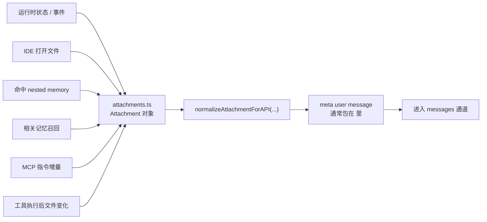

最典型的几种 attachment message，真实会长成这样：

- `opened_file_in_ide`
  - 来自 [messages.ts#L3663](D:/Agent/ClaudeCode/claude-code源码/claude-code-main/src/utils/messages.ts#L3663)
  - 会被渲染成：
  - `The user opened the file ... in the IDE. This may or may not be related to the current task.`

- `nested_memory`
  - 来自 [messages.ts#L3735](D:/Agent/ClaudeCode/claude-code源码/claude-code-main/src/utils/messages.ts#L3735)
  - 会被渲染成：
  - `Contents of /path/to/CLAUDE.md: ...`

- `relevant_memories`
  - 来自 [messages.ts#L3743](D:/Agent/ClaudeCode/claude-code源码/claude-code-main/src/utils/messages.ts#L3743)
  - 会被渲染成一条或多条 memory 文本

- `mcp_instructions_delta`
  - 来自 [messages.ts#L4255](D:/Agent/ClaudeCode/claude-code源码/claude-code-main/src/utils/messages.ts#L4255)
  - 会被渲染成 MCP server 新增/失效的说明

所以一句话说，attachment messages 不是“用户消息”，也不是“systemPrompt section”，而是：

- **runtime 临时生成的系统补充消息**
- **最终走 `messages` 通道进入模型**

它在上下文里的位置是：

- `userContext` 形成的 meta user message 在最前面
- 正常会话消息在中间
- `tool_result` 和 attachment 会随着 loop 推进不断追加到后面

它的 cache 特征是：

- 在 [claude.ts#L3079](D:/Agent/ClaudeCode/claude-code源码/claude-code-main/src/services/api/claude.ts#L3079) 一带，会给整条消息链放一个 message-level `cache_control` marker
- 所以 `messages` 也能进入 prompt cache
- 但它更像“按消息前缀缓存”，不像 `system` 那样可以按 section 边界精细切分

这里的 `cache marker`，可以理解成：

- runtime 在这次请求里专门选一个消息位置
- 在那个位置挂上 `cache_control`
- 告诉底层缓存系统：“到这里为止的消息前缀可以作为缓存断点”

它不是一条新的用户可见消息，也不是新的 attachment 类型，  
而是请求参数层面对某条 message content block 做的缓存标记。

源码里这件事发生在：

- [claude.ts#L3079](D:/Agent/ClaudeCode/claude-code源码/claude-code-main/src/services/api/claude.ts#L3079) `addCacheBreakpoints(...)`

这里有两个关键点：

1. 每个请求只放一个 message-level cache marker  
   源码注释写得很明确：`Exactly one message-level cache_control marker per request.`

2. 这个 marker 通常放在消息数组的最后一条附近  
   也就是“当前这次请求可复用的最长前缀边界”。

所以你可以把它想成：

- `system` 通道那边，是按 system prompt blocks 做缓存边界
- `messages` 通道这边，是靠一个 message-level cache marker 给消息前缀划缓存边界

关于缓存时长，文档里只需要记最重要的结论：

- 默认 prompt cache 从源码注释和检测逻辑看，按**约 5 分钟**处理
- 某些满足条件的 query source / 用户资格场景下，客户端会显式请求 **`1h` TTL**
- 真正的 Prompt Cache 由服务端负责，Claude Code 客户端只是把 `cache_control` 边界发过去
- 是否真的命中缓存，最直接看返回 usage 里的 `cache_read_input_tokens`
  - 大于 `0`，通常就说明这次请求读到了服务端缓存前缀

还要补一句边界：

- 不是所有 LLM 服务端都天然支持这套 Prompt Cache 机制
- Claude Code 客户端会按支持 prompt caching 的协议去构造请求
- 在这份源码里，Anthropic first-party 是明确支持的，Bedrock 也有专门适配；其它 3P provider 是否完整生效，仍取决于服务端本身

##### 4.2.2 为什么 `messages` 里除了普通 history 和 `tool_result`，还会多出一类 runtime message

Claude Code 的 `messages` 主干里，最终会汇入三类内容：

- 普通会话历史
- `tool_result`
- `attachment messages`

前两类比较常见：

- 普通会话历史负责记录用户说了什么、assistant 回了什么
- `tool_result` 负责记录工具真正执行后观察到了什么

Claude Code 之所以还要多出第三类，是因为它有不少“对下一轮推理很重要，但又既不属于自然对话、也不等于某个工具原始输出”的运行时事实，例如：

- 某个目录下的 `AGENTS.md` / nested memory 刚刚命中
- relevant memories 的预取结果这轮末尾才 ready
- 用户刚在 IDE 里打开了某个文件
- 某个 MCP server 刚连接上，带来了新的 instructions delta
- skill discovery 这轮刚找到更相关的 skill

这些信息如果只留在 runtime 变量里，下一轮模型看不到；如果强行塞进 `systemPrompt`，又太动态、太晚发生，也不适合作为长期稳定前缀。所以 Claude Code 选择把它们物化成 `attachment messages`，写回 `messages`。

可以把三类 message 的职责压缩成一句话：

- 普通 history 记录对话过程
- `tool_result` 记录动作结果
- `attachment messages` 记录运行时新增事实

这也是 Claude Code 比很多普通 Agent 更“重”的地方。很多 Agent 只有“对话 + 工具结果”两条线，而 Claude Code 额外补了一条“运行时事实通道”，让 memory、IDE 状态、MCP 增量、局部规则这些信息也能以消息的形式进入下一轮推理。

#### 4.3 `tools`

这是请求里的工具能力面，不属于文本上下文本身，但它会直接影响模型“认为什么动作可以做”。

它的内容主要由这些部分组成：

1. 内置工具 schema
   - 从工具池里来的 name / description / input schema / cache_control

2. MCP tools
   - 来自当前 MCP 连接池
   - 这也是为什么 MCP tool 的出现会影响整体请求形态

3. 额外工具 schema
   - 例如某些 advisor / server-side tools

##### 4.3.1 `tools` schema 和 `defaultSystemPrompt` 里的工具说明有什么区别

这里顺手把它和 `defaultSystemPrompt` 里的“工具使用说明”对照一下：

| 维度 | `defaultSystemPrompt` 里的工具说明 | 请求里的 `tools` schema |
| --- | --- | --- |
| 形态 | 自然语言 prompt section | 结构化 JSON schema 数组 |
| 入口 | [prompts.ts#L269](D:/Agent/ClaudeCode/claude-code源码/claude-code-main/src/constants/prompts.ts#L269) `getUsingYourToolsSection(...)` | [claude.ts#L1236](D:/Agent/ClaudeCode/claude-code源码/claude-code-main/src/services/api/claude.ts#L1236) `toolSchemas` |
| 主要作用 | 告诉模型“应该怎么选工具、怎么排工具、什么时候别乱用 Bash” | 告诉模型“有哪些工具、每个工具叫什么、参数怎么传” |
| 内容类型 | 工具使用策略、优先级、并行/串行原则 | `name`、`description`、`input_schema`、`cache_control`、`defer_loading` 等 |
| 例子 | “读文件用 `Read`，不要用 `cat`”；“能并行就并行” | `{ name: "Read", input_schema: {...} }` |
| 缺了会怎样 | 模型可能知道工具存在，但不会高质量地选择和编排 | 模型知道应该用某工具，但无法按协议发出有效 `tool_use` |

所以两者的关系不是重复，而是互补：

- `defaultSystemPrompt` 讲“怎么用工具”
- `tools` schema 定义“怎么调工具”

它在请求里的位置是：

- 单独的 `tools` 字段
- 和 `system`、`messages` 并列
- 不会作为普通 prompt 文本拼进 `system` 或 `messages`

它的 cache 特征是：

- 它不是 prompt 文本的一部分
- 但它会影响服务器侧如何理解请求，也可能影响 cache key 的稳定性
- 尤其是动态 MCP tools 的增减，往往会带来 cache churn

#### 4.4 `thinkingConfig`

这是请求里的推理模式配置，不是文本文本块，而是模型推理行为控制参数。

它的内容主要由这些部分组成：

1. 是否启用 thinking
2. 是否使用 adaptive thinking
3. thinking budget

在 Claude Code 内部，它先表现为：

- `thinkingConfig`

到 API 请求时，在 [claude.ts#L1597](D:/Agent/ClaudeCode/claude-code源码/claude-code-main/src/services/api/claude.ts#L1597) 一带会被转换成：

- `thinking`

它在请求里的位置是：

- 和 `system`、`messages`、`tools` 并列
- 不在文本上下文里

它的 cache 特征是：

- 它不属于 prompt 文本前缀
- 但它属于请求行为参数，和 betas / model 一样，会影响一次请求的实际执行语义

#### 4.5 其它请求参数

除了上面四块，Claude Code 还会一起发很多协议级参数。

最重要的包括：

1. `model`
   - 当前使用哪个模型

2. `tool_choice`
   - 工具调用策略

3. `max_tokens`
   - 输出 token 上限

4. `betas`
   - 各类 beta header 对应的能力开关

5. `metadata`
   - 请求元数据

6. `context_management`
   - 某些 beta 下的上下文管理参数

7. `output_config`
   - 结构化输出相关配置

8. `extraBodyParams`
   - provider / beta / bedrock/vertex 等额外 body 参数

这些东西的共同特点是：

- 它们不属于“文本上下文内容”
- 但它们共同决定了这次请求用什么协议、什么模型、什么行为模式、什么缓存策略来执行

如果只记一句，可以记成：

- `system + messages` 决定模型“看到什么”
- `tools` 决定模型“能做什么”
- `thinkingConfig` 决定模型“怎么想”
- 其它请求参数决定模型“按什么协议和限制来跑”

### 5. Claude Code 的 Prompt Cache

这里最容易混淆的一点是：  
大家常把 Transformer 推理里的“前缀可复用”和产品层面的“Prompt Cache”混在一起说。

先把两层区分开：

1. `KV cache`
   - 发生在**单次请求内部**
   - 前缀 token 在每一层产生的 `K / V` 被缓存
   - 后续 token 只需要带着自己的 `Q` 去读取这些旧 `K / V`
   - 因此生成新 token 时，不必把整段前缀每次都重算

2. `prompt cache`
   - 发生在**跨请求**
   - 如果新请求的前缀和旧请求足够一致，服务端就可以直接复用那段前缀 prefill 后的内部状态
   - 于是只从“第一次分叉的位置”往后继续算

所以 Claude Code 这里讨论的 Prompt Cache，不是“客户端本地把 prompt 字符串存起来”，而是：

- Claude Code 客户端尽量把请求切成更稳定的前缀和更动态的尾部
- 再通过 `cache_control` 等协议字段把缓存边界告诉服务端
- 真正的缓存命中和复用仍由 LLM 服务端负责

#### 5.1 从 Transformer 视角看：为什么“前缀可复用”

如果只看模型内部，前缀 token 并不是简单“算出一个结果文本”以后就结束了。  
更准确地说，在每一层里：

- 旧 token 会留下自己的 `K / V`
- 新 token 会算出自己的 `Q`
- 再用 `Q` 去匹配旧 `K`
- 然后对旧 `V` 做加权求和

也就是说，不是“前面的 `V` 直接算后面的 `V`”，而是：

- **新 token 用自己的 `Q` 去读取旧 token 留下来的 `K / V`**

这就是单次请求里 `KV cache` 的本质。

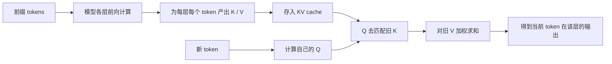

从产品工程角度，服务端 Prompt Cache 可以近似理解成：

- 之前某次请求已经把一段稳定前缀做完了 prefill
- 这次只要前缀仍然一致
- 就不必从 token 1 重新跑那段前缀

所以这两层关系可以压成一句话：

- `KV cache` 是“单次请求里，旧 token 给新 token 复用”
- `prompt cache` 是“跨请求里，同一段前缀给下一次请求复用”

#### 5.2 Claude Code 里，哪些部分共同决定“可缓存前缀”

Claude Code 真正发给模型的不是一段字符串，而是一整个请求对象。  
因此 Prompt Cache 也不是只由 `messages` 决定，而是由请求前部多块材料共同决定。

最重要的四块是：

- `system prompt`
- `tools / tool schemas`
- `thinkingConfig`
- `messages` 前缀

可以画成这样：

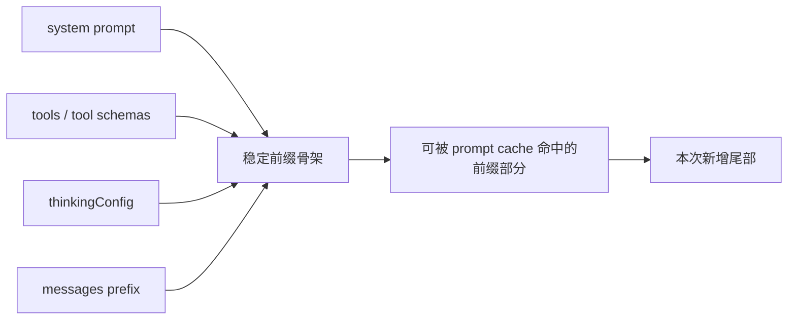

所以“前缀稳定”不是一句很虚的话，它至少包含三层含义：

- 前缀内容稳定
- 前缀顺序稳定
- 前缀里的变化尽量晚发生

这里再特别纠正一个常见误解：

- `tools` 不是 `messages` 里的文本块
- 但它仍然属于请求前缀骨架的一部分

因此：

- `tools` / tool schema 的增减、顺序变化、描述漂移
- `thinkingConfig` 的切换
- `system prompt` 早段的动态变化

都可能把 prompt cache 的分叉点往前推。

#### 5.3 三种最典型的“分叉位置”

Prompt Cache 更像“从请求开头开始比对，一直比到第一次不一致的位置”。  
所以关键不是“能不能变”，而是：

- **第一次变化发生在哪里**

最典型的三种情况如下。

##### 5.3.1 只在 `messages` 尾部新增内容

这是最理想的一类：

- `system prompt` 不变
- `tools` 不变
- `thinkingConfig` 不变
- 老消息前缀不变
- 只在尾部追加这轮的新内容


典型例子包括：

- 新一轮 user 消息
- `forked agent` 的 `promptMessages`
- 主线程追问时追加的新消息

这也是为什么像：

- `initialMessages = [...forkContextMessages, ...promptMessages]`

这种“保住旧前缀、只在尾部加新任务说明”的做法特别适合吃缓存。

##### 5.3.2 在 `tools` 层就发生变化

这时分叉点会明显更早。

典型情况包括：

- tool list 顺序变化
- 新增了某些 workflow tools
- 某些 deferred tools 这轮被 inline 进来了，上轮没有
- tool description / schema 漂移

它的后果通常是：

- `system prompt` 那段可能还能命中
- 但从 `tools` 开始，后面一般都得重新算

所以 Claude Code 会非常在意：

- 基础工具面的顺序稳定
- tool schema 的 session-stable 基底
- 不要把重而场景化的工具过早塞进基础工具骨架

##### 5.3.3 在 `system prompt` 早段就发生变化

这是最伤缓存的一类。

典型情况包括：

- `defaultSystemPrompt` 早段变化
- `systemContext` 很早就插入了动态内容
- dynamic system section 顺序变化
- 某些本该靠后注入的运行时指导被提前塞进 system 前部

一旦这里分叉，后面的：

- `tools`
- `thinkingConfig`
- `messages`

通常都接不到原来的大前缀缓存边界。

最短一句话记住：

- **不是“不能变”，而是“别太早变”。**

#### 5.4 Claude Code 怎样把分叉点尽量往后推

前面第 3 节讲的“三层上下文结构”，本质上就是在为 Prompt Cache 服务。  
Claude Code 的很多工程决策，本质都在做一件事：

- **尽量让静态骨架留在前面，把变化留到后面**

这主要体现在四个方向。

##### A. `system prompt` 先分静态骨架，再分动态区

`system` 侧最关键的内部标记是：

- [prompts.ts](D:/Agent/ClaudeCode/claude-code源码/claude-code-main/src/constants/prompts.ts) 里的 `SYSTEM_PROMPT_DYNAMIC_BOUNDARY`

它是一个**客户端内部哨兵字符串**，作用不是让服务端直接识别，而是帮助 Claude Code 在内部把 `defaultSystemPrompt` 切成：

- 更稳定、适合缓存的静态前缀
- 更动态、容易变化的 system 后缀

真正发请求时，客户端会通过 [claude.ts](D:/Agent/ClaudeCode/claude-code源码/claude-code-main/src/services/api/claude.ts) 的 `buildSystemPromptBlocks(...)`，把 system prompt 转成 API 的 `system` blocks，并在需要的 block 上挂 `cache_control`。

##### B. `messages` 保持“稳定前缀 + 动态尾部”

`messages` 侧没有 system 那样的 section 边界，但会：

- 在 [claude.ts#L3079](D:/Agent/ClaudeCode/claude-code源码/claude-code-main/src/services/api/claude.ts#L3079) 一带使用 **一个 message-level cache marker**
- 给当前这次请求里“可复用的最长消息前缀”打上缓存断点

这也是为什么 Claude Code 会特别强调：

- 普通 history 保持稳定
- 新的 runtime facts、`tool_result`、attachment messages 尽量追加到后面
- `forked agent` 子任务说明尽量作为 `promptMessages` 接在继承前缀之后

##### C. `tools` 要尽量形成稳定的基础工具面

这里最容易被讲错。  
`tools` 不是文本 prompt，但它依然是请求前缀骨架的一部分。

Claude Code 在这层主要做三件事：

1. 通过工具池装配逻辑，尽量保持 built-in tools 顺序稳定
2. 在 [api.ts](D:/Agent/ClaudeCode/claude-code源码/claude-code-main/src/utils/api.ts#L119) 的 `toolToAPISchema(...)` 里缓存 session-stable 的 tool schema base
3. 把 `defer_loading`、`cache_control` 这类 per-request 字段作为 overlay 叠上去，而不是每轮重造整段 schema

它背后的思路非常简单：

- 不要让工具描述轻微漂移就把整段工具前缀搅乱
- 不要让每轮都不同的场景化工具过早污染基础工具面

##### D. 用 deferred loading / `ToolSearch` 保护工具前缀

这一点是最近最容易一眼看懂 Prompt Cache 意图的地方。

`ToolSearch` 不是决定哪些工具 deferred 的那层，但它让系统可以做到：

- 首轮先只暴露 deferred tools 的名字
- 不急着把完整 schema 提前塞进基础 `tools` 骨架
- 真的需要时，再把那把工具的完整定义拉出来

所以它保护的不是“消息尾部”，而是：

- **基础工具前缀的稳定性**

也就是说：

- 对 `messages`，理想做法是尾部追加
- 对 `tools`，理想做法是不要让重工具过早混进稳定骨架

#### 5.5 `forked agent` 为什么总想继承主线程骨架

这也是 Prompt Cache 在 multi-agent 里的直接体现。

`forked agent` 典型做法不是“把子任务上下文压到理论最小”，而是尽量继承主线程已经形成的 cache-safe skeleton，例如：

- `systemPrompt`
- `toolUseContext.options.tools`
- `thinkingConfig`
- `forkContextMessages`

然后只在尾部增加：

- 这次子任务自己的 `promptMessages`

它的目标不是“最小上下文”，而更像：

- **尽量复用主线程刚刚形成的可缓存前缀**

这也是为什么 `extractMemories`、`SessionMemory`、某些 compaction side task 这些短命副任务，会特别适合走 fork。

#### 5.6 服务端真正看到的是什么

服务端通常不会直接“识别 `__SYSTEM_PROMPT_DYNAMIC_BOUNDARY__` 这串字面量”。  
服务端真正消费的是客户端转换后的协议字段，例如：

- `system` blocks
- 各 block 上的 `cache_control`
- `messages` 里的 message-level `cache_control`
- 某些 tool result 上的 `cache_reference`

所以更准确地说：

- `SYSTEM_PROMPT_DYNAMIC_BOUNDARY` 是客户端内部的分界哨兵
- `cache_control` / `cache_reference` 才是服务端真正理解的缓存协议

这条链可以用下面这张小图理解：

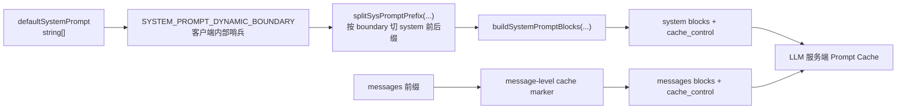

这张图里最重要的区别是：

- 左边 `SYSTEM_PROMPT_DYNAMIC_BOUNDARY` 只存在于客户端内部切分逻辑里
- 右边真正发给服务端的是带 `cache_control` 的 `system blocks` 和 `messages blocks`

#### 5.7 默认缓存多久，怎么判断命中

从源码看，客户端发出的 `cache_control` 默认是：

- `type: 'ephemeral'`

在特定条件下，还会显式请求：

- `ttl: '1h'`

这部分逻辑在 [claude.ts](D:/Agent/ClaudeCode/claude-code源码/claude-code-main/src/services/api/claude.ts) 的 `getCacheControl(...)` 和 `should1hCacheTTL(...)`。

从项目里的注释和检测逻辑看，默认 ephemeral prompt cache 一般按**约 5 分钟**理解；满足资格条件时，客户端会请求 **1 小时 TTL**。

是否命中缓存，最直接看服务端返回 usage 里的：

- `cache_read_input_tokens`

通常：

- 大于 `0`，说明这次请求读到了服务端缓存前缀
- `cache_creation_input_tokens > 0` 更像是“这次新写入了缓存”

#### 5.8 是不是所有 provider 都支持

不是。

- Claude Code 会按支持 prompt caching 的协议去构造请求
- 但不是所有 LLM 服务端都天然支持这套机制

在这份源码里，最明确的结论是：

- Anthropic first-party 明确支持
- Bedrock 有专门适配
- 其它 3P provider 是否完整支持，要看服务端是否兼容相同或类似的缓存协议

所以最短结论就是：

- Claude Code 负责“把稳定前缀组织好，并声明缓存协议”
- LLM 服务端负责“真正缓存和复用前缀”
- `SYSTEM_PROMPT_DYNAMIC_BOUNDARY` 不是跨厂商通用服务端标记，而是客户端内部哨兵
- 跨 provider 能否真正生效，最终还是取决于服务端

### 6. 进一步展开：运行时上下文三层模型

这里先明确一个边界。  
如果从 API 请求的角度看，Claude Code 每次发给模型的不只是“消息历史”，还包括：

- `systemPrompt`
- `messages`
- `tools`
- `thinkingConfig`
- 以及若干权限、缓存、流式相关选项

但如果只聚焦 **Context Engineering**，我们真正关心的是“模型认知输入是怎么被组织出来的”。  
按源码里的构建路径，这里的“三层”应该和前面的摘要完全对应：

1. 静态 system prompt 骨架
2. 动态 prompt/context 区块
3. `messages` 侧运行时上下文

补一句：`query.ts` 里的 `messagesForQuery`、`applyToolResultBudget(...)`、`snip`、`microcompact`、`collapse`、`autocompact`，属于这三层内容装配完成之后的治理流程，不属于这套“三层”本身。

这样拆开之后，[QueryEngine.ts](D:/Agent/ClaudeCode/claude-code源码/claude-code-main/src/QueryEngine.ts)、[query.ts](D:/Agent/ClaudeCode/claude-code源码/claude-code-main/src/query.ts)、[attachments.ts](D:/Agent/ClaudeCode/claude-code源码/claude-code-main/src/utils/attachments.ts)、[context.ts](D:/Agent/ClaudeCode/claude-code源码/claude-code-main/src/context.ts)、[prompts.ts](D:/Agent/ClaudeCode/claude-code源码/claude-code-main/src/constants/prompts.ts) 的责任边界就会清楚很多。

先把一个最容易混的点定死：

- `userContext`
  - 虽然是在 [fetchSystemPromptParts(...)](D:/Agent/ClaudeCode/claude-code源码/claude-code-main/src/utils/queryContext.ts#L44) 里和 `defaultSystemPrompt`、`systemContext` 一起返回的
  - 但它最终通过 [prependUserContext(...)](D:/Agent/ClaudeCode/claude-code源码/claude-code-main/src/utils/api.ts#L449) 进入 `messages`
  - 所以它属于**第三层**

- `systemContext`
  - 最终通过 [appendSystemContext(...)](D:/Agent/ClaudeCode/claude-code源码/claude-code-main/src/utils/api.ts#L437) 追加到 `systemPrompt` 尾部
  - 所以它属于**第二层**

#### 6.1 先把几个最容易混的对象放回正确层里

| 对象 | 来源 | 最终进入哪里 | 属于哪一层 |
| --- | --- | --- | --- |
| `defaultSystemPrompt` 里的静态 sections | `getSystemPrompt(...)` | `systemPrompt` | 第一层 |
| `defaultSystemPrompt` 里的动态 sections | `getSystemPrompt(...)` | `systemPrompt` | 第二层 |
| `systemContext` | `getSystemContext()` | `systemPrompt` 尾部 | 第二层 |
| `userContext` | `getUserContext()` | `messages` 最前面的 meta user message | 第三层 |
| 普通 user / assistant 历史 | transcript | `messages` | 第三层 |
| `tool_result` | 工具执行结果 | `messages` | 第三层 |
| attachment messages | `attachments.ts` + `messages.ts` | `messages` | 第三层 |

#### 6.2 Skill 元数据放在哪一层

如果这里说的 “Skill 元数据” 指的是：

- skill 名称
- skill 描述
- 当前有哪些 skill 可用
- 哪些 skill 和当前任务相关

那答案是：**主要不在第一层静态 system prompt 里**，而是分散在第二层和第三层。

可以分成三种形态来看：

1. **Skill 的长期使用规则**
   - 这部分更接近 system prompt 里的长期规则
   - 讲的是“SkillTool / DiscoverSkills 应该怎么用”
   - 更偏第一层/第二层之间的规则层，而不是具体 skill 元数据本身

2. **当前 session 是否有可用 skill 能力**
   - 这部分在第二层
   - 主要体现在 [prompts.ts](D:/Agent/ClaudeCode/claude-code源码/claude-code-main/src/constants/prompts.ts) 的 `session_guidance`
   - 它会根据 `getSkillToolCommands(cwd)` 和当前启用工具，告诉模型：
     - 当前有没有 user-invocable skills
     - 是否可以用 `SkillTool`
     - 是否可以用 `DiscoverSkills`

3. **具体 skill 元数据本身**
   - 这部分在第三层
   - 以 runtime message / attachment 的形式进入 `messages`
   - 主要有两类：
     - `skill_listing`
       - 列出当前可用 skills
       - 在 [attachments.ts](D:/Agent/ClaudeCode/claude-code源码/claude-code-main/src/utils/attachments.ts) 的 `getSkillListingAttachments(...)` 生成
       - 在 [messages.ts](D:/Agent/ClaudeCode/claude-code源码/claude-code-main/src/utils/messages.ts#L3763) 渲染成 “The following skills are available...”
     - `skill_discovery`
       - 列出和当前任务相关的 skills
       - 在 [messages.ts](D:/Agent/ClaudeCode/claude-code源码/claude-code-main/src/utils/messages.ts#L3542) 渲染成 `- name: description` 的列表

所以最短可以记成：

- **静态 system prompt**：最多放 Skill 的长期使用规则，不放具体 skill 名单/描述
- **第二层动态 system prompt**：放“这轮是否有 skill 能力、怎么用”
- **第三层 messages**：放“具体有哪些 skills、名字和描述是什么、哪些和当前任务相关”

##### 6.2.1 `skill_discovery` 进入 `messages` 的流程

`skill_discovery`` 的关键点不是“它属于第三层”这么简单，而是：  
它既可能在 turn 0 就进入 `messages`，也可能在 agentic turn 的后续迭代里异步补写进 `messages`。

可以把它分成两条入口：

1. **turn 0：用户输入触发的阻塞 discovery**
2. **inter-turn：主循环里的异步 prefetch discovery**

流程图如下：

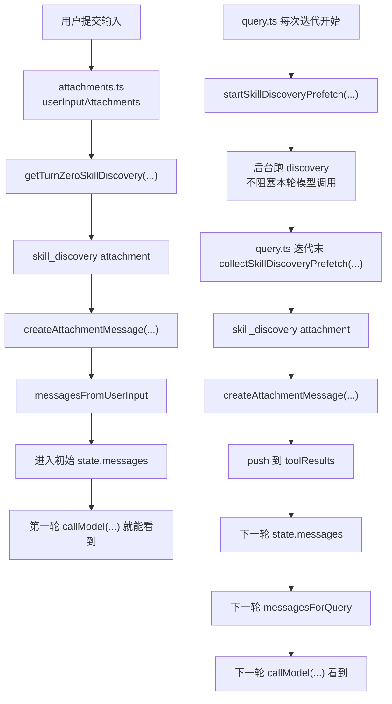

这张图里最重要的区别是：

- **turn 0 路径**
  - 在 query loop 真正开跑前就完成
  - 所以第一轮模型调用就可能直接看到 `skill_discovery`

- **inter-turn 路径**
  - 在本轮模型流和工具执行期间后台跑
  - 本轮末尾收集后写回 `messages`
  - 通常由**下一轮**模型调用看到

##### 6.2.2 为什么说它是“写回 messages”，不是“重新构建 messages”

这里最容易误解成：每一轮是不是都把整条消息链重新从零拼一遍。

更准确地说：

- 系统维护一条累计的 `state.messages`
- 每轮调用模型前，再从它投影出当前可见的 `messagesForQuery`
- `skill_discovery` 被发现后，会先变成 attachment message，再写回 `state.messages`

所以真正发生的是：

- **重算的是“本轮可见工作集”**
- **补写的是“新发现的运行时事实”**

`skill_discovery` 就属于后者。

##### 6.2.3 它最终长什么样

在 runtime 内部，`skill_discovery` attachment 的核心结构在：

- [attachments.ts](D:/Agent/ClaudeCode/claude-code源码/claude-code-main/src/utils/attachments.ts#L538)

大致是：

```ts
{
  type: 'skill_discovery',
  skills: [{ name, description, shortId? }, ...],
  signal,
  source
}
```

真正渲染成模型可见消息时，在：

- [messages.ts](D:/Agent/ClaudeCode/claude-code源码/claude-code-main/src/utils/messages.ts#L3542)

会被转成 `<system-reminder>` 风格的 meta user message，大致像：

```text
Skills relevant to your task:

- skill-a: description
- skill-b: description
```

##### 6.2.4 这份逆向仓库里的一个现实限制

还要补一句很重要的边界：

- [prefetch.ts](D:/Agent/ClaudeCode/claude-code源码/claude-code-main/src/services/skillSearch/prefetch.ts) 在这份仓库里目前是 stub

所以现在能从源码里稳定看清的是：

- `skill_discovery` **什么时候触发**
- **什么时候进入 messages**
- **对哪一轮模型调用生效**

但“具体用什么检索算法找到这些 skills”的实现，在这份逆向版本里并没有恢复出来。

##### 6.2.5 `skill_listing` 和 `skill_discovery` 的对照表

这两个名字很像，但在上下文工程里的职责并不一样。  
最短一句话：

- `skill_listing` 更像“当前有哪些 skills 可用”
- `skill_discovery` 更像“当前任务最相关的是哪些 skills”

可以直接对照着看：

| 项目 | `skill_listing` | `skill_discovery` |
| --- | --- | --- |
| 核心问题 | 当前可用技能清单是什么 | 当前任务最相关的技能是什么 |
| 上下文层级 | 第三层：`messages` 侧运行时上下文 | 第三层：`messages` 侧运行时上下文 |
| 典型内容 | 一份可用 skills 列表，偏 inventory | `name + description` 的相关 skills shortlist |
| 结构形态 | `type: 'skill_listing'`，带 `content / skillCount / isInitial` | `type: 'skill_discovery'`，带 `skills[] / signal / source` |
| 触发方式 | 由 `getSkillListingAttachments(...)` 按当前 runtime 可用技能生成 | 由 turn 0 discovery 或 inter-turn prefetch 生成 |
| 与当前任务的关系 | 不一定和当前任务强相关，更像能力总表 | 明确和当前任务相关，是任务导向的推荐 |
| 进入 `messages` 的时机 | 作为 attachment message 注入 `messages` | turn 0 可首轮进入，inter-turn 常在迭代末补写进下一轮 |
| 渲染后的文本风格 | `The following skills are available...` | `Skills relevant to your task: ...` |
| 架构角色 | 告诉模型“工具箱里有哪些技能包” | 告诉模型“这次最该看哪几个技能包” |

它们在源码里的入口也不同：

- `skill_listing`
  - attachment 生成在 [attachments.ts](D:/Agent/ClaudeCode/claude-code源码/claude-code-main/src/utils/attachments.ts) 的 `getSkillListingAttachments(...)`
  - 渲染到消息在 [messages.ts](D:/Agent/ClaudeCode/claude-code源码/claude-code-main/src/utils/messages.ts) 的 `case 'skill_listing'`

- `skill_discovery`
  - turn 0 / prefetch 链路在 [attachments.ts](D:/Agent/ClaudeCode/claude-code源码/claude-code-main/src/utils/attachments.ts) 和 [query.ts](D:/Agent/ClaudeCode/claude-code源码/claude-code-main/src/query.ts)
  - 渲染到消息在 [messages.ts](D:/Agent/ClaudeCode/claude-code源码/claude-code-main/src/utils/messages.ts) 里 feature-gated 的 `skill_discovery` 分支

如果用一个具体场景来理解会更直观：

- `skill_listing`
  - 像是在告诉模型：“当前这个项目里，`frontend-review`、`release-checklist`、`db-migration` 这些 skills 都存在。”

- `skill_discovery`
  - 像是在告诉模型：“你这次在分析 `src/query.ts` 和工具链，最相关的可能是 `agent-loop-review`、`tool-runtime-guide` 这两个 skills。”

所以两者不是重复设计，而是两个不同粒度的上下文信号：

- `skill_listing` 提供 **可用能力面**
- `skill_discovery` 提供 **任务相关性排序**

##### 6.2.6 为什么 `skill_discovery` 不需要携带 path

这里很容易产生一个直觉疑问：

- `skill_discovery` 里只有 `name + description`
- 没有 skill 包路径
- 那后面怎么加载 skill 的详细内容

答案是：**Claude Code 把“推荐 skill”和“加载 skill”拆成了两步。**

也就是说，`skill_discovery` 的职责不是“把 skill 文件路径提前暴露给模型”，而是先告诉模型：

- 这次最相关的 skills 是哪些
- 如果需要详细说明，可以调用 `Skill("<name>")`

真正的详细内容加载，发生在模型决定调用 skill 之后。

整条链可以简化成：

1. `skill_discovery` 进入 `messages`
2. 模型看到推荐结果，决定调用 `Skill("xxx")`
3. `SkillTool` 收到这个 `commandName`
4. runtime 通过 `getCommands(...)` 和 `findCommand(...)` 找到对应 skill command
5. 这个 command 对象来自 skills 注册表，而 skills 注册表在本地加载阶段本来就知道 skill 文件路径
6. 然后再进入 skill 的详细内容展开或执行链

所以真正带路径意识的，不是 `skill_discovery` 这条 attachment，而是：

- `loadSkillsDir.ts` 里的 skill loader
- `commands.ts` / `getCommands(...)` 里的 command registry
- `SkillTool.ts` 里的按名字查找与执行链

换句话说：

- `skill_discovery` 是 **推荐信号**
- `Skill("<name>")` 之后的 registry lookup 才是 **定位和加载机制**

这也是它故意不携带 path 的原因：

- 避免在 discovery 阶段把大量路径和实现细节都塞进上下文
- 让推荐层保持轻量
- 把真正的文件定位和详细展开延迟到“模型确定要用这个 skill”之后

所以不是“没有 path 就没法加载”，而是：

**path 不在 discovery 消息里，而在 runtime 的 skill registry 里。**

##### 6.2.7 skills 注册表到底是什么

这里说的 “skills 注册表”，不是一份单独的文档，也不是某个静态 JSON 文件。  
它更接近：

- **运行时内存里的技能索引 / 命令表**

可以把它理解成一条四步链：

1. **磁盘上的 skill 文件**
   - 例如本地 `SKILL.md`
   - 项目 skills
   - bundled skills
   - plugin skills
   - MCP skills

2. **skill loader 读取这些文件**
   - [loadSkillsDir.ts](D:/Agent/ClaudeCode/claude-code源码/claude-code-main/src/skills/loadSkillsDir.ts) 会把 skill 文件解析成运行时 `Command` / `PromptCommand`
   - 这一层其实知道 skill 的文件路径，源码里还有内部类型 `SkillWithPath`

3. **commands 层把多路 skills 合并成运行时命令表**
   - [commands.ts](D:/Agent/ClaudeCode/claude-code源码/claude-code-main/src/commands.ts) 的 `getCommands(...)`
   - 会把：
   - skill dir commands
   - bundled skills
   - plugin skills
   - builtin plugin skills
   - dynamic skills
   - 合成一份运行时可查找的 command 集合

4. **SkillTool 按名字查找并执行**
   - [SkillTool.ts](D:/Agent/ClaudeCode/claude-code源码/claude-code-main/src/tools/SkillTool/SkillTool.ts)
   - 模型调用 `Skill("name")` 后，runtime 会：
   - `getAllCommands(context)`
   - `findCommand(commandName, commands)`
   - 然后再加载/展开 skill 的详细内容

所以这里最重要的区分是：

- skill 文件
  - 在磁盘上
- skills 注册表
  - 在运行时内存里
- `skill_discovery`
  - 只提供推荐结果，不直接承担路径定位

最短一句话：

**skill 文件在磁盘上，skills 注册表在内存里，`SkillTool` 再按名字去注册表里找对应 skill。**

#### 6.3 `systemPrompt` 到底由哪几部分组成

如果走默认主路径，也就是没有 `customSystemPrompt` 覆盖时，可以先记成：

```ts
systemPrompt
= defaultSystemPrompt
+ appendSystemPrompt?

fullSystemPrompt
= appendSystemContext(systemPrompt, systemContext)
```

这里的 `?` 只是文档里的简写，表示“这一项是可选的，有值才会拼进去”。

这几部分分别是什么：

- `defaultSystemPrompt`
  - 默认 system prompt 底稿
  - 本身 already 包含第一层和第二层
- `appendSystemPrompt`
  - 调用方额外追加的一段 system 文本
- `systemContext`
  - 不是 `defaultSystemPrompt` 的一部分
  - 而是在最后通过 `appendSystemContext(...)` 挂到尾部

如果存在 `customSystemPrompt`，主链会变成：

```ts
systemPrompt = asSystemPrompt([
  customSystemPrompt,
  ...(memoryMechanicsPrompt ? [memoryMechanicsPrompt] : []),
  ...(appendSystemPrompt ? [appendSystemPrompt] : []),
])
```

这里代码里的 `?...:...` 也是同一个意思：条件成立才追加，不成立就跳过。

也就是说：

- 默认情况下，前两层都来自 `defaultSystemPrompt`，再加上 `systemContext`
- 自定义 prompt 情况下，`customSystemPrompt` 会替换默认底稿
- 不管哪条路径，`userContext` 都不属于 `systemPrompt`

##### 6.3.1 它们分别从哪里进入 `systemPrompt` 和 `messages`

Claude Code 不是把所有上下文都塞进一个地方。  
从 API 请求的角度看，核心有两条注入通道：

1. `systemPrompt` 通道
2. `messages` 通道

最关键的区别是：

- `systemPrompt` 更适合放“系统级、规则级、前置背景”
- `messages` 更适合放“用户消息、运行时结果、meta context、附件”

具体看源码，这两条通道是这样汇合的：

- `systemPrompt`
  - 在 [QueryEngine.ts](D:/Agent/ClaudeCode/claude-code源码/claude-code-main/src/QueryEngine.ts#L324) 里组装
  - 基底来自 `defaultSystemPrompt`
  - `systemContext` 再通过 [appendSystemContext(...)](D:/Agent/ClaudeCode/claude-code源码/claude-code-main/src/utils/api.ts#L437) 追加到尾部

- `messages`
  - 在 [query.ts](D:/Agent/ClaudeCode/claude-code源码/claude-code-main/src/query.ts#L660) 里送给 API
  - 先对 `messagesForQuery` 调 [prependUserContext(...)](D:/Agent/ClaudeCode/claude-code源码/claude-code-main/src/utils/api.ts#L449)
  - 所以 `userContext` 会变成最前面的 meta user message
  - 后续 attachment message、`tool_result`、普通 user/assistant 历史消息，也都在这条通道里

如果按“来源 -> 通道”来分，大致是这样：

- **代码内置 prompt sections**
  - 进入 `systemPrompt`
  - 例如 `# Intro`、`# System`、`# Using your tools`

- **`systemContext`**
  - 进入 `systemPrompt` 尾部
  - 例如 `gitStatus`

- **`userContext`**
  - 不进 `systemPrompt`
  - 进入 `messages` 最前面
  - 例如 `currentDate`、`claudeMd`

- **普通会话消息**
  - 进入 `messages`
  - 例如用户问题、assistant 历史回复

- **工具结果和 attachments**
  - 进入 `messages`
  - 例如 `tool_result`、`nested_memory`、`relevant_memories`

##### 6.3.2 它们在上下文里的位置

从最终请求的相对位置看，可以近似理解成：

```text
system:
  [attribution header]
  [CLI system prompt prefix]
  [defaultSystemPrompt sections...]
  [appendSystemPrompt?]
  [systemContext appended at tail]

messages:
  [meta user message from prependUserContext(userContext)]
  [normal conversation history]
  [tool_result messages]
  [attachment messages]
```

这意味着：

- `defaultSystemPrompt` 在 `system` 通道里靠前，属于 system prompt 主体
- `systemContext` 在 `system` 通道里靠后，是追加进去的尾部环境块
- `userContext` 在 `messages` 通道里最靠前，表现为一个 `<system-reminder>` meta user message
- `tool_result` 和 attachments 都在 `messages` 里，位置随 loop 推进不断往后增长

##### 6.3.3 它们能不能被 Prompt Cache

能，但**不是所有部分都以同样方式被 cache**。

先看 `systemPrompt` 侧：

- 在 [claude.ts](D:/Agent/ClaudeCode/claude-code源码/claude-code-main/src/services/api/claude.ts#L3214) 的 `buildSystemPromptBlocks(...)` 里，`systemPrompt` 会被切成多个 text block
- 这些 block 会根据 `cacheScope` 带上 `cache_control`
- 如果启用了 global cache，并且命中了 [SYSTEM_PROMPT_DYNAMIC_BOUNDARY](D:/Agent/ClaudeCode/claude-code源码/claude-code-main/src/constants/prompts.ts#L114)：
  - boundary 前的静态部分可以走更稳定的 cache
  - boundary 后的动态部分就不一定能复用

再看 `messages` 侧：

- 在 [claude.ts](D:/Agent/ClaudeCode/claude-code源码/claude-code-main/src/services/api/claude.ts#L3079) 一带，request 里只会有**一个 message-level cache_control marker**
- 也就是说，`messages` 这条通道也能参与 prompt caching
- 但它是按“消息前缀”来缓存，不是像 `systemPrompt` 那样按 section 边界切得那么细

所以从“缓存友好度”来看，大致可以这样理解：

- 第一层静态骨架
  - 最适合被 cache
- 第二层动态 prompt/context
  - 可以被 cache，但更容易因为环境变化失效
- 第三层运行时消息/附件
  - 也能进入前缀缓存，但因为变化最频繁，最容易 churn

如果只记一句，可以记成：

- `systemPrompt` 更像“可分块缓存的系统前缀”
- `messages` 更像“按消息前缀缓存的会话上下文”

#### 6.4 `defaultSystemPrompt` 到底是什么

`defaultSystemPrompt` 不是“一整段已经拼好的最终 prompt 字符串”。  
在实现上，它更接近：

- **基础 system prompt 的 section 数组**
- 类型上就是 `string[]`
- 每一项都是一个独立的 prompt block

它是在 [prompts.ts](D:/Agent/ClaudeCode/claude-code源码/claude-code-main/src/constants/prompts.ts#L444) 的 `getSystemPrompt(...)` 里生成的，  
然后由 [queryContext.ts](D:/Agent/ClaudeCode/claude-code源码/claude-code-main/src/utils/queryContext.ts#L44) 的 `fetchSystemPromptParts(...)` 取出来，作为：

- `defaultSystemPrompt`
- `userContext`
- `systemContext`

这三部分里的第一部分。

它大致长这样：

```ts
[
  getSimpleIntroSection(...),
  getSimpleSystemSection(),
  getSimpleDoingTasksSection(),
  getActionsSection(),
  getUsingYourToolsSection(enabledTools),
  getSimpleToneAndStyleSection(),
  getOutputEfficiencySection(),
  SYSTEM_PROMPT_DYNAMIC_BOUNDARY?,
  ...resolvedDynamicSections,
].filter(Boolean)
```

也就是说，`defaultSystemPrompt` 本质上是：

- 一组有顺序的 prompt sections
- 前半段偏静态骨架
- 后半段可以带动态 sections
- 但它还不是“最终完整 API 请求”

##### 6.4.1 静态 sections 和动态 sections 有什么区别

最短可以这样记：

- 静态 sections：长期稳定的 system 规则骨架
- 动态 sections：每轮重算的 system 背景区块

它们的区别可以直接对照来看：

| 维度 | 静态 sections | 动态 sections |
| --- | --- | --- |
| 在 `defaultSystemPrompt` 里的位置 | `SYSTEM_PROMPT_DYNAMIC_BOUNDARY` 之前 | `SYSTEM_PROMPT_DYNAMIC_BOUNDARY` 之后 |
| 作用 | 定义长期稳定规则 | 补充当前 turn / 环境相关背景 |
| 稳定性 | 更稳定 | 更容易变化 |
| Prompt Cache 友好度 | 更高 | 更容易失效 |
| 典型来源 | `prompts.ts` 里的静态 section builder | `prompts.ts` 里的 `dynamicSections` |

静态 sections 典型包括：

- `getSimpleIntroSection(...)`
- `getSimpleSystemSection()`
- `getSimpleDoingTasksSection()`
- `getActionsSection()`
- `getUsingYourToolsSection(...)`
- `getSimpleToneAndStyleSection()`
- `getOutputEfficiencySection()`

它们主要讲的是：

- 你是谁
- 长期行为约束是什么
- 大部分工具怎么用
- 输出风格和效率要求是什么

动态 sections 典型包括：

- `session_guidance`
- `memory`
- `ant_model_override`
- `env_info_simple`
- `language`
- `output_style`
- `mcp_instructions`
- `scratchpad`
- `frc`（function result clearing）
- `summarize_tool_results`
- 某些条件下还有 `token_budget`、`brief`

它们主要讲的是：

- 这一轮当前有哪些会话级 guidance
- 当前环境 / 模型 / 语言 / 输出风格是什么
- 当前 memory mechanics 和 MCP instructions 应该长什么样

从来源上看，两者都来自 [prompts.ts](D:/Agent/ClaudeCode/claude-code源码/claude-code-main/src/constants/prompts.ts)，但生成方式不同：

- 静态 sections 是直接顺序拼进返回数组的固定 section builder
- 动态 sections 是先在 `dynamicSections` 里注册，再通过 `resolveSystemPromptSections(...)` 解析出来

所以更准确地说：

- 静态 sections 和动态 sections 都属于 `defaultSystemPrompt`
- 区别不在于“是不是来自代码”，而在于“稳定性”和“是否按当前 turn / 环境重算”

如果把它再翻成更直白的话，它长得不是这样：

```ts
"你是 Claude Code ......（一整大段字符串）"
```

而更像这样：

```ts
[
  "# Intro ...", 						// 先定义 agent 身份、总体目标、最高优先级约束
  "# System ...", 						// 说明 system tags、权限机制、tool result 注入等底层运行规则
  "# Doing tasks ...", 		 	    	// 约束做事范式，比如少做无关重构、避免过度抽象、完成后要验证
  "# Executing actions with care ...", // 定义高风险操作的确认原则和 blast radius 意识
  "# Using your tools ...",			   // 告诉模型优先用哪些专用工具、哪些工具可并行、Bash 何时兜底
  "# Tone and style ...",			   // 约束输出风格、引用代码方式、用户可见文本的表达习惯
  "# Communicating with the user ...", // 约束过程汇报、阶段更新、最终总结的沟通方式
  "# Environment ...", 				   // 注入当前环境事实，如 cwd、平台、shell、OS、模型/知识截止信息
  "# Memory ...", 					   // 注入 memory mechanics 或长期记忆规则，不是具体某条 recall
]
```

其中前面几个 section 的真实来源，你可以直接在这些函数里看到：

- [prompts.ts#L175](D:/Agent/ClaudeCode/claude-code源码/claude-code-main/src/constants/prompts.ts#L175) `getSimpleIntroSection(...)`
- [prompts.ts#L186](D:/Agent/ClaudeCode/claude-code源码/claude-code-main/src/constants/prompts.ts#L186) `getSimpleSystemSection()`
- [prompts.ts#L199](D:/Agent/ClaudeCode/claude-code源码/claude-code-main/src/constants/prompts.ts#L199) `getSimpleDoingTasksSection()`
- [prompts.ts#L255](D:/Agent/ClaudeCode/claude-code源码/claude-code-main/src/constants/prompts.ts#L255) `getActionsSection()`
- [prompts.ts#L269](D:/Agent/ClaudeCode/claude-code源码/claude-code-main/src/constants/prompts.ts#L269) `getUsingYourToolsSection(...)`
- [prompts.ts#L430](D:/Agent/ClaudeCode/claude-code源码/claude-code-main/src/constants/prompts.ts#L430) `getSimpleToneAndStyleSection()`
- [prompts.ts#L403](D:/Agent/ClaudeCode/claude-code源码/claude-code-main/src/constants/prompts.ts#L403) `getOutputEfficiencySection()`

最关键的一点是：

- `defaultSystemPrompt` 是“默认 system prompt section 列表”
- 它是 `systemPrompt` 的默认底稿，而不是最终完整的 API 请求对象

#### 6.5 第一层：静态 system prompt 骨架

这一层只讨论 `defaultSystemPrompt` 里 **`SYSTEM_PROMPT_DYNAMIC_BOUNDARY` 之前** 的那一半。  
上一小节已经解释了 `defaultSystemPrompt` 整体是什么；这里不再重复讲整体结构，只聚焦“静态前缀到底包含什么”。

##### 6.5.1 这一层包含什么

第一层最典型的就是这些长期稳定的 section：

- `# Intro`
- `# System`
- `# Doing tasks`
- `# Executing actions with care`
- `# Using your tools`
- `# Tone and style`
- `# Output efficiency`

它们合起来主要定义：

- agent 的长期身份
- 基础行为约束
- 大部分工具使用方法论
- 输出风格和效率要求

##### 6.5.2 这一层来自哪里

它主要来自 [prompts.ts](D:/Agent/ClaudeCode/claude-code源码/claude-code-main/src/constants/prompts.ts) 里的静态 section builder，例如：

- [prompts.ts#L175](D:/Agent/ClaudeCode/claude-code源码/claude-code-main/src/constants/prompts.ts#L175) `getSimpleIntroSection(...)`
- [prompts.ts#L186](D:/Agent/ClaudeCode/claude-code源码/claude-code-main/src/constants/prompts.ts#L186) `getSimpleSystemSection()`
- [prompts.ts#L269](D:/Agent/ClaudeCode/claude-code源码/claude-code-main/src/constants/prompts.ts#L269) `getUsingYourToolsSection(...)`

这部分主要是源码内置规则，不是本地文档，也不是运行期工具结果。

##### 6.5.3 这一层何时构建

- 新的 user turn 开始时，`fetchSystemPromptParts(...)` 会通过 `getSystemPrompt(...)` 一起拿到它

##### 6.5.4 这一层何时更新

- 实现上每个新 turn 都会重新取
- 语义上通常只有这些条件变化时才容易变：
  - 可用工具池变化
  - 主模型变化
  - 输出风格配置变化
  - 相关 system prompt 设置变化

所以它可以理解成“每轮可重取，但大多数时候最稳定”的那部分。

##### 6.5.5 为什么要单独成层

因为它位于 `SYSTEM_PROMPT_DYNAMIC_BOUNDARY` 之前，是整个 system prompt 里最稳定、也最适合被 Prompt Cache 复用的前缀。  
模型在真正开始这一轮思考前，先看到的就是这层长期规则骨架。

#### 6.6 第二层：`systemPrompt` 动态区

这一层回答的是：

- 哪些内容仍然属于 prompt/context，但会随当前 turn 或环境变化
- 哪些上下文块不是永久固定的，而是每轮重新构建的

这里要先澄清一个特别容易混的点：

- 这里说的 `systemPrompt`，主要不是第一层那种更稳定的 `defaultSystemPrompt` 骨架本体
- 也不是 `userContext`
- 更准确地说，第二层主要指的是：
  - `prompts.ts` 里通过 `systemPromptSection(...)` 挂进去的**动态 system sections**
  - 再加上最后会并到 system prompt 尾部的 `systemContext`

其中最典型、也最容易被我们误说成“systemPrompt 本体”的，就是：

- `systemPromptSection('memory', () => loadMemoryPrompt())`

也就是说：

- “怎么记 memory / 是写正式 memory 还是写 daily log” 这类规则，属于第二层的 `memory` 动态 section
- 它不是第一层 `defaultSystemPrompt` 主骨架
- 也不是第三层 `userContext` 里的普通消息材料

它的主入口在：

- [queryContext.ts](D:/Agent/ClaudeCode/claude-code源码/claude-code-main/src/utils/queryContext.ts) 的 `fetchSystemPromptParts(...)`
- [context.ts](D:/Agent/ClaudeCode/claude-code源码/claude-code-main/src/context.ts) 的 `getSystemContext()`
- [prompts.ts](D:/Agent/ClaudeCode/claude-code源码/claude-code-main/src/constants/prompts.ts) 的动态 section

##### 6.6.1 这一层包含什么

第二层最值得讲清楚的，不只是“有哪些 block”，而是“它们都还属于 systemPrompt，而不属于 messages”。

它的来源主要有四类：

1. **会话级策略和能力说明**
   - 代表是 `session_guidance`、`language`、`output_style`
   - 来源是当前 session 的工具池、skill commands、语言偏好、输出风格设置

2. **运行环境事实**
   - 代表是 `env_info_simple`
   - 来源是工作目录、平台、shell、OS、git/worktree 等环境信息

3. **记忆机制和外部能力说明**
   - 代表是 `memory`、`mcp_instructions`、`scratchpad`
   - 它们讲的是“机制和使用规则”，不是某条具体 recall 或某次 attachment

4. **system 尾部上下文**
   - 代表是 `systemContext.gitStatus`
   - 来源是当前 git 仓库状态，以及某些构建下的 `cacheBreaker`

第二层最典型的 block 可以直接记成：

- `session_guidance`
- `memory`
- `env_info_simple`
- `language`
- `output_style`
- `mcp_instructions`
- `scratchpad`
- `function result clearing`
- `summarize_tool_results`
- `systemContext.gitStatus`

这里再强调一次：

- `userContext.currentDate`
- `userContext.claudeMd`

虽然也是 turn 开始时取到的，但它们最终进入 `messages`，所以不算第二层。

如果用“广义 system prompt”来拆层次，可以直接记成：

1. **第一层**
   - 更稳定的 `defaultSystemPrompt` 骨架
2. **第二层**
   - `systemPromptSection(...)` 这类动态 system sections
   - 外加 `systemContext` 这条 system 尾部上下文
3. **第三层**
   - `userContext` 和普通 `messages`

所以我们前面一直在讨论的：

- 显式保存的 memory 规则
- KAIROS daily-log 的 memory 规则

它们都属于：

- **第二层的 `memory` 动态 section**

不是：

- 第一层 `defaultSystemPrompt`
- 也不是第三层 `userContext.claudeMd`

##### 6.6.2 这一层何时构建

它的构建时机是：

- 新的 user turn 开始时，由 `QueryEngine.submitMessage()` 先调用 `fetchSystemPromptParts(...)`
- 相比第一层，它变化更频繁，但仍然属于 prompt/context 组装，而不是 attachment 注入

##### 6.6.3 这一层何时更新

第二层是三层里最典型的“可缓存但可失效”上下文。

- 正常情况下，它至少会在每个新 turn 开始时被重新取用
- 当下面这些条件变化时，后续 turn 往往会看到更新后的第二层：
  - `CLAUDE.md` / AGENTS.md 内容变化
  - git 状态变化
  - MCP 连接池变化
  - working directory / worktree 环境变化
  - 手动清 cache 或 compact 后触发重算

源码里很能说明这一点的地方是：

- [context.ts](D:/Agent/ClaudeCode/claude-code源码/claude-code-main/src/context.ts#L32) 的 `getUserContext.cache.clear?.()`
- [context.ts](D:/Agent/ClaudeCode/claude-code源码/claude-code-main/src/context.ts#L33) 的 `getSystemContext.cache.clear?.()`

也就是说，第二层不是“每次都完全重建一切”，而是：

- 平时尽量复用
- 该失效时明确失效
- 在下一个 turn 重新装配

##### 6.6.4 具体例子

举几个最具体的例子：

- `systemContext.gitStatus`
  在 [context.ts](D:/Agent/ClaudeCode/claude-code源码/claude-code-main/src/context.ts#L96) 的拼装逻辑里，会形成类似：
  - `Current branch: main`
  - `Main branch (you will usually use this for PRs): main`
  - `Status:\n M src/query.ts`
  - `Recent commits:\nabc123 fix compact edge case`

- `env_info_simple`
  在 [prompts.ts](D:/Agent/ClaudeCode/claude-code源码/claude-code-main/src/constants/prompts.ts#L499) 一带，它会把环境事实整理成一段 system 文本，例如：
  - `Primary working directory: ...`
  - `Platform: win32`
  - `Shell: powershell`
  - `OS Version: Windows ...`

- `memory section`
  在 [prompts.ts](D:/Agent/ClaudeCode/claude-code源码/claude-code-main/src/constants/prompts.ts#L495) 里，它是动态 section 的一部分，由 `loadMemoryPrompt()` 提供
  - 入口其实就是：
    - `systemPromptSection('memory', () => loadMemoryPrompt())`
  - 普通模式下，`loadMemoryPrompt()` 返回的是正式 memory 规则
  - KAIROS 模式下，`loadMemoryPrompt()` 返回的是 daily-log 规则
  - 所以“显式保存”和“KAIROS daily-log”的行为差异，本质上就是这一节 dynamic system section 的内容不同

所以第二层更像“每轮重算的 prompt/context 区块”：

- 当前 git 快照是什么
- 这一轮 memory / env / language / MCP 说明应该长什么样

##### 6.6.5 第二层内部是怎么组装出来的

这一层最容易被误解成“就是把几个字符串拼起来”。  
但从源码看，它其实是一条很清晰的装配链：

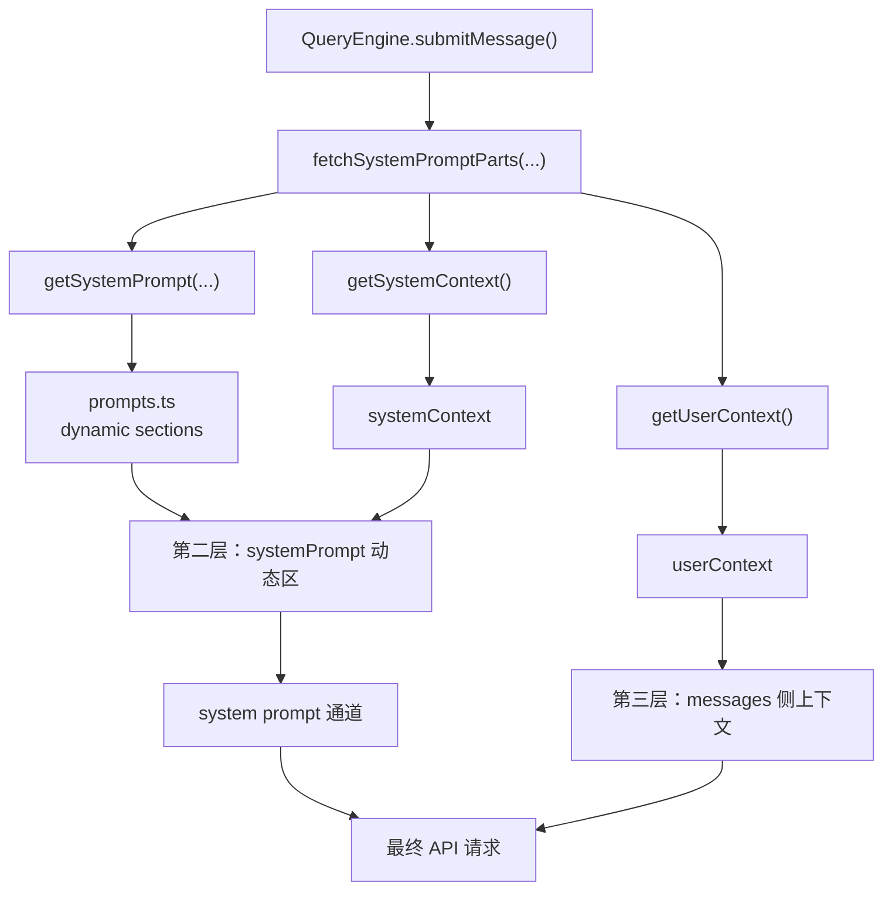

这一段真正做的不是“一次性生成最终 prompt”，而是：

1. 先并行取出这轮需要的 `getSystemPrompt()`、`getSystemContext()`、`getUserContext()`
2. 其中：
   - `getSystemPrompt()` 里的动态 sections
   - 加上 `getSystemContext()`
   共同组成第二层
3. `getUserContext()` 虽然是同一时间拿到的，但它属于第三层，后面走 `messages` 通道
4. 再按不同通道把它们送进 API 请求
5. 让动态块和静态骨架既能组合，又不会和 `messages` 侧材料混层

##### 6.6.6 第二层有哪些典型 block

按源码来源看，第二层里最重要的动态块大致有五类：

1. `systemContext`
   - 入口在 [context.ts](D:/Agent/ClaudeCode/claude-code源码/claude-code-main/src/context.ts#L116)
   - 代表字段主要是：
   - `gitStatus`
   - 某些构建下的 cache breaker / injection
   - 这部分最后走 [appendSystemContext(...)](D:/Agent/ClaudeCode/claude-code源码/claude-code-main/src/utils/api.ts#L437) 追加到 system prompt 尾部

2. `env_info_simple`
   - 定义在 [prompts.ts](D:/Agent/ClaudeCode/claude-code源码/claude-code-main/src/constants/prompts.ts#L499)
   - 真实内容会来自 `computeSimpleEnvInfo(...)`
   - 例如：
   - `Primary working directory: ...`
   - `Is a git repository: true`
   - `Platform: win32`
   - `Shell: powershell`
   - `OS Version: Windows ...`

3. `session_guidance`
   - 定义在 [prompts.ts](D:/Agent/ClaudeCode/claude-code源码/claude-code-main/src/constants/prompts.ts#L492)
   - 由 `getSessionSpecificGuidanceSection(enabledTools, skillToolCommands)` 生成
   - 这里面会根据当前 session 的工具池和 `skillToolCommands`，决定要不要补充 skill 相关 guidance
   - 所以如果你问“第二层是不是也有 skill”，答案是：**有，主要就在这个 block 里**
   - 但它讲的是“当前这轮有哪些 skill 能力可用、怎么理解 DiscoverSkills/SkillTool”，不是具体 skill 内容本身

4. `memory`
   - 定义在 [prompts.ts](D:/Agent/ClaudeCode/claude-code源码/claude-code-main/src/constants/prompts.ts#L504)
   - 由 `loadMemoryPrompt()` 产出
   - 它不是附件召回，而是“每轮都要带着走的 memory mechanics / memory policy”
   - 更准确地说，它走的是：
     - `systemPromptSection('memory', () => loadMemoryPrompt())`
   - 普通模式下，这一节会告诉主模型如何写正式 memory
   - KAIROS 模式下，这一节会切换成 daily-log 规则

5. `mcp_instructions`
   - 定义在 [prompts.ts](D:/Agent/ClaudeCode/claude-code源码/claude-code-main/src/constants/prompts.ts#L514)
   - 由 `getMcpInstructionsSection(...)` 生成
   - 它描述的是“当前 MCP server 提供了什么能力、该怎么使用”
   - 如果启用了 delta 机制，这部分可能部分下沉到第三层的 `mcp_instructions_delta`

这里明确一下：

- `userContext.currentDate`
- `userContext.claudeMd`

不在这份“第二层典型 block”列表里，因为它们最终不进入 `systemPrompt`，而是进入第三层的 `messages`。

这里顺手把 skill 的三种位置也分清：

- `SkillTool` / `DiscoverSkills` 的长期使用规则
  - 更接近第一层静态骨架
- “这一轮当前 session 里有没有可用的 skill 能力”
  - 属于第二层 `session_guidance`
- “这轮实际发现了哪些 skills relevant to your task”
  - 属于第三层 `skill_discovery` attachment

##### 6.6.7 第二层这些 block 是什么时候构建的

这里要分清两件事：

- `fetchSystemPromptParts(...)` 这一步会同时把 `defaultSystemPrompt`、`userContext`、`systemContext` 都取出来
- 但按三层归属来看，这里真正属于第二层的是：
  - `defaultSystemPrompt` 骨架上挂进去的动态 sections
  - 以及 `systemContext`

所以关键不是“谁被一起取出来”，而是“谁最终进入 `systemPrompt`”。

大体时序是这样的：

1. 用户发起一个新的 turn
2. [QueryEngine.ts](D:/Agent/ClaudeCode/claude-code源码/claude-code-main/src/QueryEngine.ts#L295) 调用 [fetchSystemPromptParts(...)](D:/Agent/ClaudeCode/claude-code源码/claude-code-main/src/utils/queryContext.ts#L44)
3. `fetchSystemPromptParts(...)` 并行拉取：
   - `getSystemPrompt(...)`
   - `getUserContext()`
   - `getSystemContext()`
4. `getSystemPrompt(...)` 内部再去解析 `prompts.ts` 的动态 sections
   - 其中就包括：
     - `systemPromptSection('memory', () => loadMemoryPrompt())`
5. 这些结果返回给 `QueryEngine`
6. 真正请求模型前，再分别走：
   - `prependUserContext(...)`
   - `appendSystemContext(...)`
   - `systemPrompt.ts` 的 merge

也就是说，第二层不是在工具执行之后才临时补的，它主要发生在：

- 一个新的用户 turn 起点
- 某些 compact / clear cache / worktree 切换后的重算时机

这也是为什么源码里会出现：

- `getUserContext.cache.clear?.()`
- `getSystemContext.cache.clear?.()`

因为系统承认这部分是“可缓存但必须可失效”的动态 context。

##### 6.6.8 为什么要单独成层

不并到第一层，是因为它们虽然属于 prompt/context，但并不稳定。

具体看几个例子：

- `currentDate`
  - 每天都会变
- `gitStatus`
  - 用户一改文件就可能变
- `mcp_instructions`
  - MCP 连接池一变就可能变
- `env_info_simple`
  - 进入 worktree、增加 working directory、切换模型后都可能变

不并到第三层，是因为它们又不像 attachment 那样“只有在某个工具动作后才出现”。

比如：

- `currentDate`
- `gitStatus`
- `memory mechanics`
- `MCP usage guidance`

这些都属于“模型在这一轮开始思考前就应该知道的背景块”，  
而不是等 `tool_result` 出来后才临时追加。

所以第二层的角色非常明确：

- 它比第一层更动态
- 它比第三层更前置
- 它仍然属于 prompt/context 组装，而不是运行期消息流

如果只记一句，可以记成：

**第二层是“每轮开工前重算一次的动态背景块”。**

#### 6.7 第三层：messages 侧运行时上下文

这里的“第三层”不是只指 `attachment messages`，而是整个 `messages` 通道；`attachment messages` 只是其中一类最容易被单独拿出来分析的运行时消息。

这一层回答的是：

- 当前任务执行过程中，哪些消息、tool result、attachment 会进入模型上下文
- 哪些内容不是 prompt block，而是作为运行时消息流动态追加的

它的主入口在：

- [context.ts](D:/Agent/ClaudeCode/claude-code源码/claude-code-main/src/context.ts) 的 `getUserContext()`
- [api.ts](D:/Agent/ClaudeCode/claude-code源码/claude-code-main/src/utils/api.ts) 的 `prependUserContext(...)`
- 原始会话消息历史
- [attachments.ts](D:/Agent/ClaudeCode/claude-code源码/claude-code-main/src/utils/attachments.ts) 的 `getAttachmentMessages(...)`
- [messages.ts](D:/Agent/ClaudeCode/claude-code源码/claude-code-main/src/utils/messages.ts) 对 attachment 的渲染

##### 6.7.1 这一层包含什么

这一层真正承载的是“当前任务现场正在流动的上下文”。  
它和前两层最大的不同是：这里的内容很多都不是在 turn 开始前一次性准备好的，而是在运行中不断长出来的。

它的来源主要有五类：

1. **`userContext` 形成的消息前缀**
   - 代表就是 `currentDate`、`claudeMd`
   - 它们会先被 [prependUserContext(...)](D:/Agent/ClaudeCode/claude-code源码/claude-code-main/src/utils/api.ts#L449) 包成一个 meta user message，再进入 `messages`

2. **会话消息本身**
   - 原始 user / assistant 消息历史
   - 这是第三层最基础的底板

3. **工具执行结果**
   - 代表就是 `tool_result`
   - 来源是 ReadFile、Grep、Edit、Bash、Agent 等工具真正跑出来的结果

4. **按路径或相关性注入的本地文档 / 本地记忆**
   - 代表就是 `nested_memory`、`relevant_memories`
   - 这部分常常来自本地规则文件、本地 memory 文件，而不是源码里的固定 prompt
   - 但它们不会像第二层那样在 turn 开始前统一进入 prompt，而是按需变成 attachment message

5. **IDE / 编辑器 / 文件状态**
   - 代表就是 `opened_file_in_ide`、`edited_text_file`
   - 来源是用户当前在 IDE 里打开了什么、刚编辑了什么

6. **运行时增量能力提示**
   - 代表就是 `mcp_instructions_delta`、`skill_discovery`
   - 来源是 MCP 连接变化、skill 发现结果
   - 它们不是长期背景，而是“运行中新增的提醒”

所以第三层具体包括：

- `userContext` 形成的 meta user message
- 原始 user / assistant 消息历史
- `tool_result`
- `nested_memory`
- `relevant_memories`
- `opened_file_in_ide`
- `edited_text_file`
- `mcp_instructions_delta`
- `skill_discovery`

一句话说它的来源：

- **`userContext` 前缀消息**
- **会话消息**
- **工具结果**
- **按需注入的本地文档 / 记忆**
- **IDE 状态**
- **运行时增量提示**

##### 6.7.2 这一层何时构建

第三层不是只在一个 turn 开始时构建一次。

- 它会先继承当前已有的消息历史
- 然后在 [query.ts](D:/Agent/ClaudeCode/claude-code源码/claude-code-main/src/query.ts#L1583) 里，通过 [getAttachmentMessages(...)](D:/Agent/ClaudeCode/claude-code源码/claude-code-main/src/utils/attachments.ts#L2938) 继续生成 attachment message
- 所以它既有“已有 transcript”，也有“这轮运行中新追加的附件消息”

##### 6.7.3 这一层何时更新

第三层的更新频率是三层里最高的。

- 每次 agent loop 子回合推进时，`messages` 都可能变化
- 每次工具执行完成后，新的 `tool_result` 会进入这一层
- 每次 attachment 生成后，新的 attachment message 也会进入这一层
- 在 `query.ts` 的主循环里，`getAttachmentMessages(...)` 不是只跑一次，而是会随着 loop 推进反复参与

这意味着第三层不是“turn 开始时拍一张快照”，而是：

- 会随着工具执行持续增长
- 会随着 memory prefetch / IDE 状态 / MCP delta 持续补充
- 会在 compact 之后进入新的消息基线，再继续往后长

##### 6.7.4 具体例子

举一个最具体的组合例子。

假设用户说：

- `帮我分析 src/query.ts 里的 tool_use 逻辑`

这时第三层里真正会出现的“现场消息”，可能包括：

1. 用户当前这句请求
2. 上一轮 assistant 的中间分析
3. `ReadFile(src/query.ts)` 的 `tool_result`
4. `Grep(tool_use)` 的 `tool_result`
5. `opened_file_in_ide`
6. 一个 `nested_memory` attachment
7. 一条 `relevant_memories` attachment

##### 6.7.5 为什么要单独成层

如果你更喜欢一个极简对比，可以这样看：

- 第一层像“长期设定”
- 第二层像“每轮重算的 prompt 区块”
- 第三层像“现场实时流进来的消息和附件”

### 7. Agentic Turn 里的“迭代前重算”和“迭代末补写”

这里有一个很容易绕晕的点：  
很多人会觉得，第三层上下文是不是只在“调模型之前”准备一次。其实不是。对 `query.ts` 来说，第三层上下文是沿着主循环不断被：

- 迭代前重算
- 迭代末补写

这两件事首尾相接地维护着。

#### 7.1 迭代前重算：在调用模型前，重新投影本轮可见上下文

每次 `agentic turn` 主循环进入新一轮时，系统不会直接把 `state.messages` 原样喂给模型，而是先重新算出本轮真正要看的 `messagesForQuery`。

这里有一个很容易混淆、但必须先分清的层次：

- `state.messages`
  - 是 Claude Code **内部维护的消息主干**
  - 里面的每一项都是运行时 `Message` 对象
  - 类型定义在 [message.ts](D:/Agent/ClaudeCode/claude-code源码/claude-code-main/src/types/message.ts)
  - 其中不只有普通 `user / assistant`，还可能包含：
  - `attachment`
  - `system`
  - `progress`
  - `grouped_tool_use`
  - `collapsed_read_search`

- `messagesForQuery`
  - 是当前这一轮从 `state.messages` **投影出来的模型可见工作集**
  - 它已经经过 compact boundary、budget、snip、microcompact、collapse、autocompact 等治理

- API 侧真正发给模型的 `messages`
  - 还不是 `messagesForQuery` 的原样拷贝
  - 在调用模型前，Claude Code 还会再做一层 API 组装：
  - `prependUserContext(messagesForQuery, userContext)`
  - 以及 `normalizeMessagesForAPI(...)` 这类归一化处理

所以最准确的关系不是：

```ts
state.messages === 发给 LLM 的 messages
```

而是：

```ts
state.messages
  -> messagesForQuery
  -> prependUserContext(...) / normalizeMessagesForAPI(...)
  -> 发给 LLM 的 messages
```

这意味着两件很重要的事：

1. Claude Code 内部确实维护一条“持续累计”的消息主干
   - 新的 `assistant` 输出
   - 新的 `tool_result`
   - 新的 attachment message
   都会并回这条主干

2. 但不是这条主干里的每个对象都会原样进入 LLM 上下文
   - 有些内部消息只用于 transcript、UI、边界标记或中间态治理
   - 真正发给模型的，是被重新裁剪、过滤、归一化后的可见窗口

所以这里最短的理解应该是：

- **累计的是内部消息主干**
- **重算的是本轮可见工作窗口**

这一步的关键代码在 [query.ts#L365](D:/Agent/ClaudeCode/claude-code源码/claude-code-main/src/query.ts#L365) 一带，顺序大致是：

1. 从 compact boundary 之后取消息
   - `getMessagesAfterCompactBoundary(messages)`
2. 对 tool result 做预算治理
   - `applyToolResultBudget(...)`
3. 做 `snip`
4. 做 `microcompact`
5. 做 `collapse`
6. 做 `autocompact`
7. 再把 `userContext` / `systemContext` 拼回 API 输入

所以这一步更准确的说法不是“准备一下上下文”，而是：

- **从累计状态中重新投影出本轮工作集**

它回答的问题是：

- 这一轮模型真正应该看到哪些消息
- 哪些旧消息要被压缩
- 哪些工具结果要被替换或缩短
- 哪些 system / user context 要重新拼回去

#### 7.2 迭代末补写：把本轮新产生的上下文事实写回状态

而在这一轮模型输出、工具执行、附件生成快结束时，系统又会做另一件事：

- 把本轮新产生的上下文事实，转成 message，写回 `state.messages`

这一步的关键代码在 [query.ts#L1583](D:/Agent/ClaudeCode/claude-code源码/claude-code-main/src/query.ts#L1583) 到 [query.ts#L1719](D:/Agent/ClaudeCode/claude-code源码/claude-code-main/src/query.ts#L1719)。

这里补进去的东西，典型包括：

- `getAttachmentMessages(...)` 生成的 attachment messages
- settled 之后的 memory prefetch 结果
- skill discovery prefetch 结果
- queued commands / task notifications

这些信息的共同点是：

- 它们往往不是本轮一开始就固定存在的
- 而是在“这轮已经执行了一些动作之后”才有资格进入上下文

所以这一步不是为了当前这次模型调用，而是为了：

- **给下一轮准备新的上下文原料**

这里也要补一句非常关键的边界：

- 迭代末“写回 `messages`”
  - 指的是写回 **内部状态主干 `state.messages`**
- 它不等于“所有刚写回的对象都已经原样进入 LLM 请求”

真正发生的是：

1. 本轮末先把新增事实登记进 `state.messages`
2. 下一轮开始时，再从更新后的 `state.messages` 重新投影出新的 `messagesForQuery`
3. 然后新的 `messagesForQuery` 才会继续走 API 归一化，进入下一次模型调用

所以“补写”这一步干的是：

- **把新事实并回状态主干**
- 不是 **跳过治理层，直接把对象原样塞给模型**

这也是为什么前面会说：

- `state.messages` 会持续累计
- 但 LLM 真正看到的是每轮重新投影后的窗口，而不是内部主干的机械全量拷贝

更具体地说，Agentic Turn 里常见有下面几种场景，会触发这种“补写”：

1. 这轮动作让某些 attachment 现在终于有资格出现了
   - 例如模型刚刚读了某个文件，或者用户在 IDE 里打开了某个文件
   - 这时 `getAttachmentMessages(...)` 可能生成：
   - `opened_file_in_ide`
   - `edited_text_file`
   - `nested_memory`
   - `mcp_instructions_delta`
   - 这些都不是 turn 一开始就能无条件塞进去的，而是要等“这轮发生了相关动作”之后才成立

2. memory prefetch 在本轮中途异步完成了
   - `pendingMemoryPrefetch` 是前面启动的，但它不一定在本轮开头就已经 ready
   - 如果到迭代末它终于 ready 了，系统就会把这些 memory attachment 变成 message 写回去
   - 对应 [query.ts#L1595](D:/Agent/ClaudeCode/claude-code源码/claude-code-main/src/query.ts#L1595)

3. skill discovery prefetch 在本轮结束前拿到了结果
   - 这一轮模型也许已经暴露出它接下来要做的是测试、构建、迁移、review 等特定工作
   - prefetch 于是找到了更相关的 skills
   - 到迭代末，系统把这些结果转成 skill attachment message 写回去
   - 对应 [query.ts#L1620](D:/Agent/ClaudeCode/claude-code源码/claude-code-main/src/query.ts#L1620)

4. 队列里的 command / task notification 到了该消费的时候
   - `queuedCommandsSnapshot` 是这轮结束前拍下来的命令队列快照
   - 其中一部分会被转成 attachment message，然后消费出队
   - 对应 [query.ts#L1573](D:/Agent/ClaudeCode/claude-code源码/claude-code-main/src/query.ts#L1573) 和 [query.ts#L1633](D:/Agent/ClaudeCode/claude-code源码/claude-code-main/src/query.ts#L1633)

如果用一个具体例子来感受，会更容易：

- 用户要求分析 `src/query.ts`
- 本轮模型先发出 `ReadFile(src/query.ts)`
- 工具读完文件后，runtime 发现这个文件路径命中了某条 nested memory
- 同时 relevant memory prefetch 也在这段时间里完成了
- 到本轮末尾，系统就会把：
  - 读文件得到的 `tool_result`
  - 命中的 `nested_memory`
  - 刚 ready 的 `relevant_memories`
  - 可能还有 `opened_file_in_ide`
  一起写回 `messages`

这样下一轮模型再思考时，看到的就不只是“我刚刚读了文件”，而是：

- 文件内容
- 这条路径对应的局部规则
- 跟当前任务相关的记忆
- 当前用户在 IDE 里关注的文件

##### 7.2.1 为什么一定要写进 `messages`

这里最关键的问题不是“为什么不放在临时变量里”，而是：

- **下一轮模型只能看到被正式并入消息历史的东西**

把这些新事实写进 `messages`，至少有四个作用：

1. 让下一轮模型真的能看到它们
   - 如果只停留在 runtime 临时变量里，本轮结束后模型上下文并不会自动继承这些信息

2. 让这些事实成为“有因果顺序的历史”
   - 一旦写进 `messages`，它们就和：
   - 本轮 assistant 输出
   - 本轮 `tool_result`
   - 下一轮推理
   连成了一条可追踪的因果链

3. 让后续 compaction / collapse / cache / dedup 都能统一处理它们
   - 只有进入消息历史，它们才会被后续的上下文治理机制看见
   - 否则这些新事实会变成“系统知道、模型不知道、治理层也看不见”的悬空状态

4. 让这些补充上下文可以跨迭代延续，而不是只在本轮尾声闪一下
   - `next` 状态最终是：
   - [query.ts#L1719](D:/Agent/ClaudeCode/claude-code源码/claude-code-main/src/query.ts#L1719) `messages: [...messagesForQuery, ...assistantMessages, ...toolResults]`
   - 这意味着本轮末补写进去的内容，会成为下一轮“迭代前重算”的原料

所以“迭代末补写”最本质的作用，不是简单追加几条提醒，而是：

- **把本轮新产生的上下文事实，正式登记进会话历史**
- **让它们从‘runtime 里知道’变成‘下一轮模型也知道’**

#### 7.3 为什么这两步其实是一条闭环

如果只看“调模型前”，你会觉得上下文工程是在做裁剪和装配。  
如果只看“调模型后”，你会觉得上下文工程是在做附件追加和历史写回。

但从主循环看，这两步其实是一条闭环：

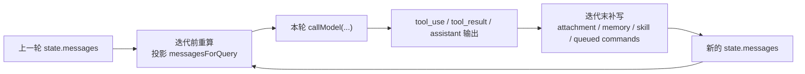

也就是说：

- 前半段在算“这一轮该看什么”
- 后半段在写入“这一轮新知道了什么”

下一轮再基于更新后的 `state.messages` 重新投影。

#### 7.4 最容易记的理解方式

可以把这两个动作分别记成：

- **迭代前重算**：从累计历史里，重新剪出这一轮的工作窗口
- **迭代末补写**：把这一轮新增的上下文事实入账，供下一轮再剪一次

所以它们都和上下文工程直接相关，只是分工不同：

- 前者负责“算本轮输入”
- 后者负责“写回下一轮原料”

#### 7.5 三层关系图

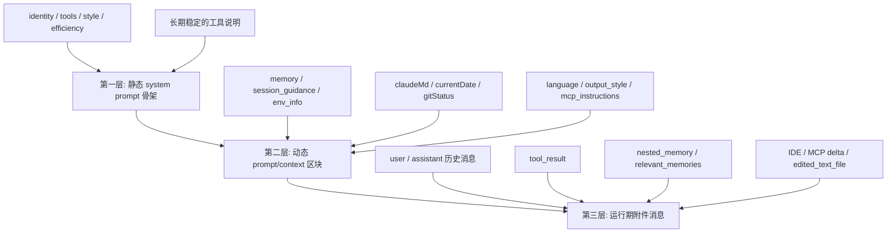

#### 7.6 同一个任务在三层里分别长什么样

下面用同一个真实任务来对照三层。

假设用户当前说的是：

- `帮我分析 src/query.ts 里的 tool_use 逻辑，并说明 tools 是怎么接进主循环的`

那么在三层里，它看到的上下文不是一个东西，而是三种不同形态：

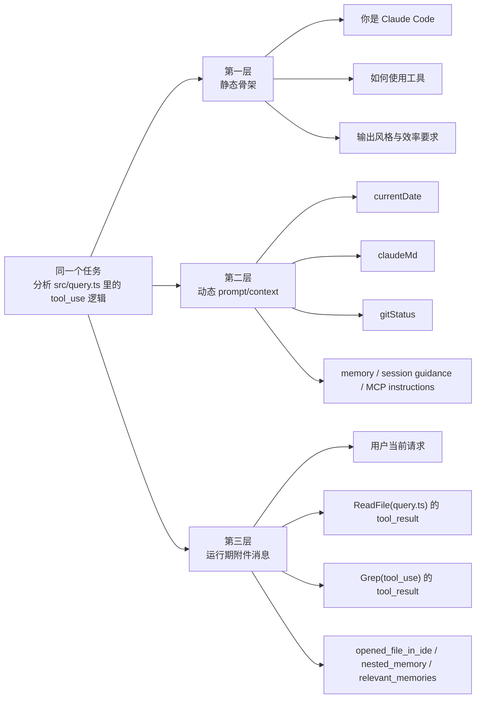

如果把这张图翻译成更直白的话：

- 第一层里，这个任务看到的是“长期背景”
  - 例如：
  - 你是 Claude Code
  - 如何使用工具
  - 输出风格和效率要求

- 第二层里，这个任务看到的是“每轮重算的 prompt/context”
  - 例如：
  - 今天是 2026-04-08
  - `CLAUDE.md` 的项目规则
  - 当前仓库 git 状态
  - 这一轮 memory / env / MCP 说明

- 第三层里，这个任务看到的是“现场实时流进来的消息和附件”
  - 例如：
  - 当前用户请求
  - 上一轮 assistant 的分析
  - `ReadFile(src/query.ts)` 的结果
  - `Grep(tool_use)` 的结果
  - `opened_file_in_ide`
  - 一个 `nested_memory` attachment
  - 一条 `relevant_memories` attachment

最关键的一点是：

- 第一层不会告诉模型“刚刚发生了什么”
- 第二层不会负责承载实时消息流
- 第三层才是当前 turn 真正在会话流里追加的东西

所以同一个任务，其实在三层里分别对应：

- “长期背景版”
- “每轮重算的 prompt/context 版”
- “现场消息版”

#### 7.7 为什么必须拆成三层

原因其实就四个：

1. 把长期稳定信息和短期动态信息分开  
稳定层可以缓存，动态层可以按需更新。

2. 让上下文具备条件性和时机性  
很多信息不是永远有用，而是在某个文件、某个记忆命中、某个 MCP 变化时才有用。

3. 让运行期消息与治理流程解耦  
前三层先负责把上下文内容准备好，后面的 `tool result budget / snip / microcompact / collapse / autocompact` 再统一治理这些内容。

4. 让恢复和续跑成为可能  
因为后面还有显式的 `messagesForQuery` 工作集，系统才能在 prompt 过长、需要 compact、需要 continuation 时重新计算有效窗口。

如果只记一句，可以记这个：

- 第一层回答“长期骨架是什么”
- 第二层回答“当前这轮临时补什么”
- 第三层回答“最后真正送进模型的窗口是什么”

## 8. 从 `state.messages` 到 API `messages`：五层上下文治理链

前面讲了很多次：

- `state.messages` 会持续累计
- 但真正发给模型的不是它的原样全量拷贝

这一点真正落地到源码里，就是 `query.ts` 在每轮调用模型前都会跑的一条治理链。  
如果把这条链抽出来单独看，它其实是理解 Claude Code Context Engineering 的关键桥梁。

先看总图：

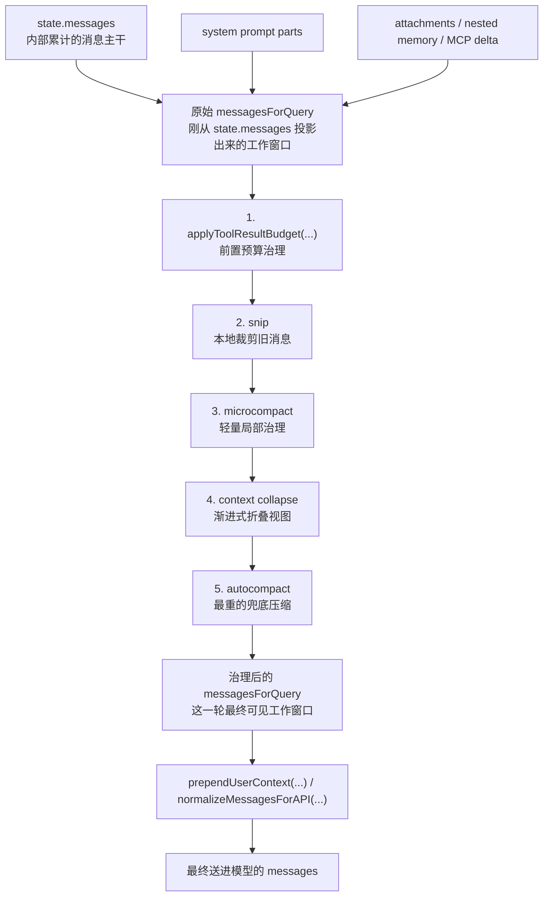

这张图最核心的意思不是“有 5 个压缩函数”，而是：

- Claude Code 先维护一条 **内部消息主干**
- 再从中投影出 **原始 `messagesForQuery`**
- 然后用 5 层治理链把它改造成 **治理后的 `messagesForQuery`**
- 最后才变成真正送给 LLM 的 API `messages`

这里要特别注意：

- “原始 `messagesForQuery`” 和 “治理后的 `messagesForQuery`” 变量名相同
- 但语义上不是同一个中间形态
- 前者是刚切出来的工作窗口
- 后者是经过五层治理之后、准备用于本轮模型调用的最终工作窗口

也就是说：

- 前面三层上下文模型，解决的是“上下文从哪里来”
- 这里这条五层治理链，解决的是“这些上下文最后以什么形态进模型”

这里说的“治理”，不是泛泛地指“系统处理一下”，而是特指：

- 对 `messagesForQuery` 做 **预算控制**
- 做 **裁剪**
- 做 **替换**
- 做 **折叠**
- 必要时做 **重压缩并重建窗口**

也就是说，“治理”这个词在这里基本等于：

- **把原始可见消息窗口加工成一个更适合当前模型调用的工作窗口**

### 8.1 `state.messages` 是怎么进入运行时上下文的

这里最容易绕的地方在于：

- `state.messages`
- `messagesForQuery`
- API 请求里的 `messages`

这 3 个名字看起来很像，但它们不是同一个层次的东西。  
如果只抓一句最短定义，可以先记成：

- `state.messages`
  - 是 **内部累计的消息主干**
- `messagesForQuery`
  - 是 **这一轮从主干里投影出来的工作窗口**
- API `messages`
  - 是 **真正发给模型的消息数组**

更完整地说，`state.messages` 进入运行时上下文的过程，可以拆成 6 步。

先把最容易混的三层对象并排看，会更容易稳住心智模型：

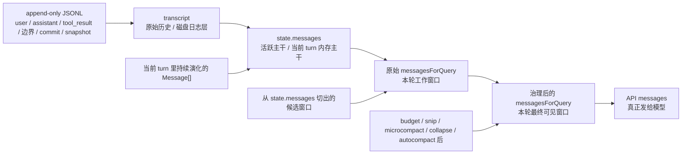

把这三层最短地对照起来，可以记成：

| 对象 | 更像什么 | 主要存什么 | 主要作用 | 发生 compact / snip / collapse 时会怎样 |
|---|---|---|---|---|
| `transcript` | 原始历史 / 磁盘底账 | append-only 的会话记录：user / assistant / `tool_result` / 各种 boundary / compact summary / collapse commit / snapshot | 给 `resume`、恢复、回放、调试提供持久化历史 | **通常不按“活跃窗口”那样被改写**；旧历史往往仍保留在磁盘上，但会追加新的 boundary / summary / commit / snapshot，用于之后恢复出新的活跃视图 |
| `state.messages` | 活跃主干 / 内存中的工作主干 | 当前 turn 真正继续往后跑要用的 Message[] 主干；会吸收新 `assistantMessages`、`tool_result`、attachment messages | 作为每一轮重新投影 `messagesForQuery` 的主要语料池 | **会被演化**；`snip`、`collapse`、`autocompact` 的效果会继续体现在后续主干里，它不是不可变 transcript |
| `messagesForQuery` | 本轮工作窗口 | 当前这一轮从 `state.messages` 切出的可见窗口 | 作为五层治理链的直接操作对象，并最终进入 API `messages` | **每轮都会被重算，而且会直接被治理链改写**；它不是持久化历史，而是当前轮的临时工作集 |

这里最关键的边界是：

- `transcript`
  - 更像“**原始历史仓库**”
  - 它的职责是记下来、能恢复、能回放
- `state.messages`
  - 更像“**当前 turn 还在活着的上下文主干**”
  - 它的职责是继续支持后续迭代推理
- `messagesForQuery`
  - 更像“**这一轮真正拉出来加工的工作窗口**”
  - 它的职责是进入治理链，再进入这轮模型请求

所以一旦发生 `compact / snip / collapse` 这类治理，不要用同一种想象去看这三层：

- 对 `transcript` 来说
  - 更常见的是 **追加新的结构记录**
  - 例如 boundary、summaryMessages、collapse commit / snapshot
  - 旧历史通常仍在磁盘里
- 对 `state.messages` 来说
  - 更常见的是 **活跃主干被切换到一个新版本**
  - 后续继续跑的不再是全量旧历史，而是治理后的演化主干
- 对 `messagesForQuery` 来说
  - 更常见的是 **这一轮窗口被直接改写**
  - 它会从“原始窗口”变成“治理后的窗口”，然后才进 API

所以最容易记住的一句话是：

- **`transcript` 管“记下来”**
- **`state.messages` 管“活着跑”**
- **`messagesForQuery` 管“这一轮送进去”**

这三者里，`transcript` 和 `state.messages` 的关系尤其容易混。更准确地说：

- 新消息、boundary、summary 在主流程里产生时，**经常会同时影响这两条线**
- 但它们的职责不同：
  - `transcript`
    - 负责把这些东西持久化到磁盘，供 `resume` / 恢复 / 回放使用
  - `state.messages`
    - 负责让当前 turn 的后续迭代继续拿着一条“活着的主干”往下跑

所以它们不是“同一份数组的两个别名”，而是：

- 一条偏 **磁盘持久化**
- 一条偏 **内存活跃状态**

也正因为这样，`resume` 时会从 transcript 恢复出新的活跃链；但在正常运行中，compact / snip / collapse 更直接改写的是 `state.messages` 这条活跃主干，而 transcript 更多是在旁边追加“这次怎么演化的记录”。

#### 8.1.1 第一步：用户输入先被写进会话主干

入口在 [QueryEngine.ts](D:/Agent/ClaudeCode/claude-code源码/claude-code-main/src/QueryEngine.ts) 的 `submitMessage()`。

这一层先做的是：

1. 处理用户输入
   - `processUserInput(...)`
2. 生成 `messagesFromUserInput`
   - 这里不只是用户原始文本
   - 还可能带上：
   - slash command 处理结果
   - turn 0 attachments
   - turn 0 `skill_discovery`
   - 其它输入侧派生消息
3. 把这些消息推进当前会话主干
   - `this.mutableMessages.push(...messagesFromUserInput)`

这一步之后，`QueryEngine` 手里拿到的是：

```ts
const messages = [...this.mutableMessages]
```

这时它还不是“API 里的运行时上下文”，而只是：

- **当前会话在内部累计出的消息主干**

#### 8.1.2 第二步：`query()` 把它接成当前 turn 的 `state.messages`

接下来 `QueryEngine` 会调用 `query({...})`，把这条内部消息主干传进去：

```ts
query({
  messages,
  systemPrompt,
  userContext,
  systemContext,
  ...
})
```

进入 [query.ts](D:/Agent/ClaudeCode/claude-code源码/claude-code-main/src/query.ts) 之后，主循环的状态初始化大致是：

```ts
let state: State = {
  messages: params.messages,
  ...
}
```

也就是说：

- `QueryEngine` 里的 conversation messages
- 进入了当前 `agentic turn` 的 `state.messages`

从这一步开始，`state.messages` 才成为：

- **这次 turn 在主循环里反复读写的消息主干**

#### 8.1.3 第三步：从 `state.messages` 切出本轮 `messagesForQuery`

每轮 `while (true)` 迭代开始时，`query.ts` 不会直接把 `state.messages` 发给模型，而是先做第一轮投影：

```ts
let messagesForQuery = [...getMessagesAfterCompactBoundary(messages)]
```

这里产生了第一个非常重要的“中间形态”：

- `state.messages`
  - 全部内部消息主干
- `messagesForQuery`
  - compact boundary 之后、当前还可参与本轮的消息窗口

这一步说明：

- 不是整个历史都自动进入本轮上下文
- 系统会先根据 compact boundary 做一次窗口切分

这里要特别避免一个容易误导的理解：

- 不能简单把 compact boundary 想成“左边永远是旧历史原文，右边永远是 compact 后新表示，而且两边一直同时活跃”

更准确地说，要分两个视角：

1. **活跃运行时视角**
   - 当前 query loop 真正继续使用的，是 `getMessagesAfterCompactBoundary(...)` 取出来的这一段
   - 也就是：
   - boundary 本身
   - boundary 后的 compact summary / messagesToKeep / 新消息
   - boundary 前的旧历史不会继续作为活跃工作窗口参与后续推理

2. **持久化 transcript 视角**
   - 磁盘上的 append-only transcript 往往还保留 compact 前的旧历史
   - 这样做是为了 `--resume`、调试、链恢复和事后分析
   - 但 loader 和 query loop 后续不会把 pre-boundary 全量重新装回活跃窗口

所以更准确的表述应该是：

- **boundary 前：在持久化 transcript 里，通常还能找到 compact 前的旧历史**
- **boundary 后：是后续运行时真正继续继承的 compact 后表示**

也就是说：

- “boundary 前还有旧历史” 这句话，如果指的是磁盘 transcript，通常成立
- 但如果指的是后续活跃运行时上下文，就不成立

#### 8.1.4 第四步：`messagesForQuery` 再经过五层治理链

切出来的 `messagesForQuery` 还不是最终模型输入。  
接下来它会继续经过：

1. `applyToolResultBudget(...)`
2. `snip`
3. `microcompact`
4. `context collapse`
5. `autocompact`

也就是说，第二个重要中间形态是：

- **原始投影后的 `messagesForQuery`**

第三个重要中间形态是：

- **治理后的 `messagesForQuery`**

这两者名字一样，但内容可能已经不同了：

- tool result 可能被 replacement
- 旧历史可能被 snip 掉
- 某些历史可能被 collapse 成更紧凑的可见视图
- 必要时甚至会直接变成新的 `postCompactMessages`

所以 `messagesForQuery` 不是一个静态名词，而是：

- **每轮都会被不断改写的工作窗口变量**

不过，在进入这五层治理链之前，还值得先把 compact 之后最关键的 3 种 message 形态讲清楚。  
因为只要 boundary 一出来，后面的工作窗口里最核心的就是它们。

##### 8.1.4.1 `boundaryMarker`

这是 compact 之后生成的 **system message 边界标记**，创建入口在：

- [messages.ts](D:/Agent/ClaudeCode/claude-code源码/claude-code-main/src/utils/messages.ts) 的 `createCompactBoundaryMessage(...)`

它的主要职责不是“承载摘要正文”，而是：

- 告诉 runtime：这里发生过一次 compact
- 告诉 `getMessagesAfterCompactBoundary(...)`：从这里开始切后续窗口
- 给 transcript / loader / resume 链提供一个明确的结构切分点

所以它更像：

- **结构边界**

而不是：

- **主要语义载体**

要特别注意：

- boundary marker 会留在 post-compact messages 里
- 但它本身通常不会成为模型真正依赖的摘要内容
- 更像是 runtime 自己理解上下文版本切换的锚点

##### 8.1.4.2 `summaryMessages`

这才是 compact 后真正承接“旧历史被压缩后如何表达”的主力载体。

在 [compact.ts](D:/Agent/ClaudeCode/claude-code源码/claude-code-main/src/services/compact/compact.ts) 里，compact 流程会：

1. 调 compact summarizer 得到 `summary`
2. 再把它包装成 `summaryMessages`
3. 这些消息会带 `isCompactSummary: true`

所以如果你问：

- “compact 后的摘要/重组结果到底在哪里”

最主要看的其实就是：

- **`summaryMessages`**

它们的语义是：

- 旧历史原文不再继续整段带着跑
- 改由这批 summary message 来承接旧历史的关键信息

所以 compact 真正“替换旧历史”的核心，不是 boundary 本身，而是：

- **boundary + summaryMessages**

##### 8.1.4.3 `messagesToKeep`

compact 也不是把旧历史 100% 全变成摘要。  
某些路径下，它还会显式保留少量原始消息，也就是：

- `messagesToKeep`

它们的作用是：

- 保留那些不适合只靠摘要表达的消息
- 保留后续还需要继续原样参与推理的上下文片段

所以 compact 后的工作窗口不是只有：

- boundary
- summary

还可能有：

- 少量被保留下来的原始消息

这也是为什么你有时会觉得：

- “怎么 compact 之后还看得到旧原文”

因为看到的通常不是“compact 前整段旧历史还在”，而是：

- **被刻意保留的 `messagesToKeep`**

##### 8.1.4.4 把这三种形态放在一起看

compact 后形成的 post-compact messages，最核心可以近似理解成：

```ts
[
  boundaryMarker,
  ...summaryMessages,
  ...(messagesToKeep ?? []),
  ...attachments,
  ...hookResults,
]
```

所以三者的关系可以压缩成一句话：

- `boundaryMarker` 负责 **切分版本**
- `summaryMessages` 负责 **承接旧历史语义**
- `messagesToKeep` 负责 **保留少量必须继续原样存在的上下文**

#### 8.1.5 第五步：治理后的 `messagesForQuery` 再变成 API `messages`

调用模型前，`query.ts` 真正传给 `callModel(...)` 的，不是裸的 `messagesForQuery`，而是：

```ts
messages: prependUserContext(messagesForQuery, userContext)
```

这一步又产生了一个新的中间形态：

- **API 级 `messages`**

它和前面的区别是：

- `messagesForQuery`
  - 还是 query 层的工作变量
- API `messages`
  - 已经把 `userContext` prepend 进去了
  - 是准备发给模型服务端的消息数组

同时，`system` 那一侧也会并行完成：

```ts
const fullSystemPrompt = appendSystemContext(systemPrompt, systemContext)
```

所以完整的运行时文本上下文，其实是两条通道同时成型：

- `fullSystemPrompt`
- `prependUserContext(messagesForQuery, userContext)`

也就是说：

- `state.messages` 只会进入 **messages 通道**
- 不会进入 `systemPrompt` 通道

#### 8.1.6 第六步：这一轮结束后，再把新结果写回下一轮的 `state.messages`

模型输出和工具执行完成之后，当前轮又会生成：

- `assistantMessages`
- `toolResults`
- attachment messages

最后在 `query.ts` 里，下一轮状态大致会变成：

```ts
state = {
  messages: [...messagesForQuery, ...assistantMessages, ...toolResults],
  ...
}
```

这一步很关键，因为它说明：

- `state.messages` 不是永远保存“原始历史”
- 它会吸收本轮治理后的工作窗口，再加上本轮新产出的消息

这里最值得单独停一下，因为很多人第一眼看到会误以为：

- 系统应该把“旧的原始 `state.messages`”
- 再加上“本轮新增消息”
- 直接拼成下一轮的 `state.messages`

但源码不是这么做的。  
它用的是：

- **治理后的 `messagesForQuery`**
- 再加上
- **本轮新产出的 `assistantMessages` 和 `toolResults`**

这意味着一个非常重要的架构选择：

- 下一轮继承的，不是“原始旧主干”
- 而是“本轮已经整理过、裁剪过、压缩过的工作窗口”

也就是说，`state.messages` 每轮都在发生一种“演化”：

1. 上一轮的 `state.messages`
2. 被投影成原始 `messagesForQuery`
3. 被治理成更紧凑的工作窗口
4. 再与本轮新增结果合并
5. 形成下一轮新的 `state.messages`

如果把它写成更接近语义的话，其实可以理解成：

```ts
nextState.messages =
  本轮最终保留下来的上下文窗口
  + 本轮新增 assistant 输出
  + 本轮新增 tool / attachment 结果
```

所以它不是简单的：

```ts
nextState.messages = oldState.messages + delta
```

而更像是：

```ts
nextState.messages = evolvedWorkingSet + delta
```

这正是 Claude Code 和“纯 transcript 累加型聊天系统”很不一样的地方：

- 普通聊天系统更像一直 append transcript
- Claude Code 更像每轮都在维护一个“可持续续跑的上下文主干”

这样做的直接好处有三个：

1. 下一轮不用再从一大坨原始历史里重复治理已经处理过的部分
   - 因为当前继承下来的，已经是被整理过的工作窗口

2. 上下文压力不会随着 turn 机械线性膨胀
   - 因为“保留下来什么”是每轮都重新做过选择的

3. compact / snip / collapse 的效果能真正跨轮次延续
   - 如果下一轮又退回原始旧主干，这些治理就等于白做了

所以这里最短的一句话是：

- **下一轮 `state.messages` 继承的是“治理后的窗口”，不是“未经处理的旧 transcript”。**

顺手把顺序也钉清楚：

- 如果**不把 `userContext` 算进来**
- 那下一轮 `state.messages` 的主顺序大致就是：

```ts
[
  ...messagesForQuery,
  ...assistantMessages,
  ...toolResults,
]
```

也就是说：

- 普通历史 / 旧工作窗口在前
- 当前轮 assistant 输出在中间
- `tool_result` 和 attachment messages 在后

而且 `toolResults` 这个数组内部也不是只有纯 `tool_result`：

- 工具执行阶段先 push 进来的，通常是 `tool_result`
- 之后 `getAttachmentMessages(...)`、memory prefetch、skill discovery prefetch、queued commands 生成的 attachment messages 也会继续 append 到 `toolResults`

所以如果只看第三层里那几类消息的相对顺序，通常更接近：

- 普通历史
- assistant 当前输出
- `tool_result`
- attachment messages

所以它更像：

- **可持续演化的运行时消息主干**

而不是：

- 一份只会 append、从不重算的原始 transcript

#### 8.1.7 把这 6 步压缩成一张图

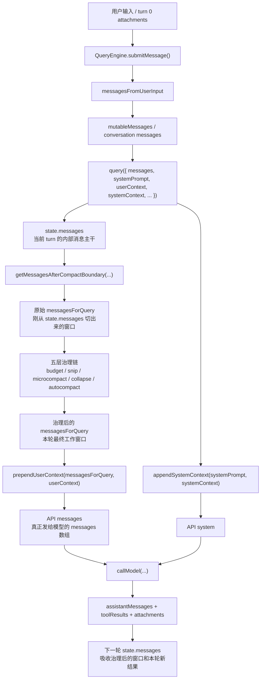

这张图里最需要盯住的，还是这 5 个中间形态：

- `conversation messages`
  - `QueryEngine` 这一层维护的会话消息主干

- `state.messages`
  - 进入当前 `agentic turn` 后，主循环持有的内部消息主干

- 原始 `messagesForQuery`
  - 刚从 `state.messages` 切出来、还没经过治理的工作窗口

- 治理后的 `messagesForQuery`
  - 经过五层治理后，真正准备用于本轮模型调用的工作窗口

- API `messages`
  - 在治理后的 `messagesForQuery` 基础上，再 prepend `userContext` 后形成的请求数组

所以它们之间的关系不是：

- `state.messages = API messages`

而是：

- `conversation messages`
- `-> state.messages`
- `-> 原始 messagesForQuery`
- `-> 治理后的 messagesForQuery`
- `-> API messages`

#### 8.1.8 最容易记错的地方

这条链里最容易记错的，基本就是这 4 点：

1. 误以为 `state.messages` 会直接原样发给模型
   - 不对，中间还要经过 `messagesForQuery`

2. 误以为 `messagesForQuery` 就是最终 API `messages`
   - 不对，后面还要 prepend `userContext`

3. 误以为 `state.messages` 只是 append 新消息
   - 不完全对，它会在每轮 continue 时吸收“治理后的窗口 + 本轮新结果”

4. 误以为 `state.messages` 同时决定 `system` 和 `messages`
   - 不对，它只走 `messages` 这条通道
   - `systemPrompt` 是并行构建的另一条通道

### 8.2 为什么这里必须单独拎出来讲

很多人第一次看 Claude Code，会下意识把上下文理解成：

- 有一堆 Message 对象
- 一直往后 append
- 然后直接整包送给模型

但源码并不是这样。  
真正发生的是：

1. `state.messages` 持续累计内部消息
2. 每轮开始时切出 `messagesForQuery`
3. 对 `messagesForQuery` 依次做预算治理、裁剪、折叠、重压缩
4. 然后才经过 API 归一化送进模型

所以这条链不只是“压缩策略”，它其实是：

- **内部运行时状态**
- 到
- **模型可见上下文**

之间的转换流水线。

### 8.3 五层治理链分别在干什么

先给一张更贴近源码阅读方式的细表：

| 层级 | 输入对象 | 输出对象 | 主要动作 | 是否直接改写 message 内容 | 是否会产出新的 message set | 是否依赖模型/API | 对 Prompt Cache 的影响 |
| --- | --- | --- | --- | --- | --- | --- | --- |
| `applyToolResultBudget(...)` | `messagesForQuery` 里已有的 `tool_result` blocks | 仍然是 `messagesForQuery` | 对过大的工具结果做 preview / replacement | 会，主要改 `tool_result.content` | 不会单独生成新 transcript，只返回替换后的数组 | 不依赖模型；可能触发持久化 side effect | 很强，设计目标之一就是让 replacement 决策跨 turn 稳定，避免 cache prefix 抖动 |
| `snip` | 当前 `messagesForQuery` | 裁剪后的 `messagesForQuery` | 去掉更旧、价值更低的历史片段 | 会，主要是删消息或插边界消息 | 不会生成 compact 后新世界，只是局部裁剪 | 纯本地 | 主要通过缩短窗口减预算，不是直接为 cache 服务 |
| `microcompact` | 当前 `messagesForQuery` | 轻量治理后的 `messagesForQuery` | 清理一部分局部上下文，尤其是工具结果压力 | 可能会，取决于走哪条路径 | 一般不生成全新 compact transcript；更像轻量变换 | 不一定。time-based 路径偏本地，cached-MC 路径和 cache-editing 机制耦合 | 中等。cached-MC 路径明显带有 cache-aware 设计 |
| `context collapse` | 当前 `messagesForQuery` | collapse 投影后的 `messagesForQuery` | 把部分历史折叠成更稠密的视图 | 不一定是直接改原消息内容，更像改“可见视图” | 不会像 autocompact 那样产出一整套 post-compact messages | 本地 | 间接影响，主要目的是在不做重 compact 的前提下降低窗口压力 |
| `autocompact` | 当前 `messagesForQuery` + `system/user/systemContext` 等参数 | `postCompactMessages` | 调用最重的 compact 流程，重建新的上下文窗口 | 会，因为最终会生成新的 compact 后消息集 | 会，这是最明确会产出新 message set 的一层 | 会，属于最重的 compact / summarize 路径 | 很强。compact 后形成新的稳定前缀，直接改变后续请求窗口 |

这里最值得特别强调的是两点：

1. 这不是简单“四层压缩”
   - 因为前面还有 `applyToolResultBudget(...)` 这一层前置预算治理

2. 这 5 层改的不是同一种东西
   - 有的主要改 `tool_result`
   - 有的主要裁旧消息
   - 有的主要改“历史的可见视图”
   - 有的则会真的产出一套新的 compact 后消息集

如果再把它们压缩成一句更适合记忆的话，可以记成：

- `applyToolResultBudget(...)`：先处理“工具结果太胖”
- `snip`：再处理“旧历史太长”
- `microcompact`：再做“轻量局部瘦身”
- `context collapse`：再做“渐进式折叠视图”
- `autocompact`：最后才做“重建一套更小的新窗口”

#### 8.3.1 `applyToolResultBudget(...)`：先治理过胖的 `tool_result`

这一层是最容易被漏掉、但其实非常关键的前置治理。

它解决的问题不是：

- 整个上下文太长

而是更具体的：

- **单条或少数几条 `tool_result` 太大，正在把当前窗口瞬间撑爆**

它的输入对象是：

- 当前 `messagesForQuery` 中的 `tool_result` blocks

如果用更接近代码的方式写，可以近似理解成：

- 输入对象：

```ts
messagesForQuery: Message[]
```

- 输出对象：

```ts
nextMessagesForQuery: Message[]
```

变化主要发生在：

- 某些 `user` message 里的 `tool_result.content`

它做的核心动作是：

1. 扫描哪些 `tool_result` 是候选大块
2. 按“每条 API 级 message 的 aggregate budget”做检查
3. 对超预算的结果生成稳定 preview / replacement
4. 把原本巨大的 `tool_result.content` 替换成一个可重复、可持久化的精简表示

这一层最有意思的架构亮点在于，它不是“每轮重新决定一次怎么裁”。  
它在 [toolResultStorage.ts](D:/Agent/ClaudeCode/claude-code源码/claude-code-main/src/utils/toolResultStorage.ts) 里维护了：

- `seenIds`
- `replacements`

并把候选结果分成：

- `mustReapply`
- `frozen`
- `fresh`

这意味着：

- 一个 `tool_result` 一旦被看过，它后面“该保留还是该替换”的命运就会冻结
- 如果之前替换过，后面每轮都重用同一份 replacement
- 如果之前没替换过，后面也不会突然改主意再替换

这样做的根本目的，是：

- **保持 Prompt Cache 前缀稳定**

所以这一层不是简单的“截断长输出”，而是：

- **对工具结果做带记忆的、跨轮稳定的预算治理**

这里还要明确一点：

- `applyToolResultBudget(...)` **不需要额外调用 LLM 来生成 preview / replacement**

它走的是本地路径：

1. `persistToolResult(...)`
   - 把完整结果持久化到本地文件
2. `generatePreview(...)`
   - 本地截取前 `2000` 字节左右的 preview
   - 尽量按换行边界截断
3. `buildLargeToolResultMessage(...)`
   - 拼出一个稳定的 replacement message
   - 告诉模型：完整输出已落盘，当前这里只给 preview

所以这一层更像：

- **本地持久化 + 本地 preview 生成**

而不是：

- **再发一次模型请求，让模型帮忙总结工具结果**

它输出之后，`messagesForQuery` 的主体结构通常没变，但某些 `tool_result.content` 已经不是原文，而是 replacement preview 了。

这里要明确点名一句：

- `applyToolResultBudget(...)` **确实有助于保持 Prompt Cache 前缀稳定**

因为它不是“这一轮觉得太长就替换、下一轮又改回原文”，而是：

- 一旦某个 `tool_result` 的 fate 被决定
- 后续轮次就会按同样的决定重放
- replacement 也是从 `replacements` 表里做 byte-identical re-apply

所以它保护的是：

- **已经发给模型看过的那段前缀，不要在后续轮次里又发生字节级变化**

但也要反过来澄清：

- **不是只有 compact 才会影响 Prompt Cache 前缀稳定**

从 [promptCacheBreakDetection.ts](D:/Agent/ClaudeCode/claude-code源码/claude-code-main/src/services/api/promptCacheBreakDetection.ts) 看，至少这些变化也都会影响缓存前缀或命中情况：

- `systemPrompt` 变化
- `tools` schema 变化
- `model` 变化
- `betas` 变化
- `cache_control` / global cache strategy 变化
- cached microcompact 的 cache deletion
- 以及任何会改写“已经看过的旧前缀内容”的动作

所以更准确的结论应该是：

- `applyToolResultBudget(...)` 是 **专门减少一种很常见的前缀不稳定来源**
- compact 只是“前缀变化的大头之一”，不是唯一来源

为什么它必须排在最前面：

- 因为 tool result 往往是最容易瞬间暴涨的部分
- 先把这部分稳住，后面的 `snip / microcompact / autocompact` 才能在更可控的窗口上继续工作

#### 8.3.2 `snip`：先把更旧、价值更低的历史裁掉

`snip` 更像一个“窗口裁剪层”。

它解决的问题是：

- **即使 tool result 已经处理过，当前窗口里还是有太多旧历史**
- **这时候还没必要立刻做重 compact，但需要先把一部分旧消息移出当前工作窗口**

它的输入输出都还是：

- 输入：当前 `messagesForQuery`
- 输出：裁剪后的 `messagesForQuery`

如果写成更接近返回值的形态，可以近似理解成：

- 输入对象：

```ts
messagesForQuery: Message[]
```

- 输出对象：

```ts
{
  messages: Message[],
  executed: boolean,
  tokensFreed: number,
  boundaryMessage?: Message
}
```

先说一个很重要的边界：

- 这份逆向仓库里的 [snipCompact.ts](D:/Agent/ClaudeCode/claude-code源码/claude-code-main/src/services/compact/snipCompact.ts) 目前是 stub
- 现在真实返回的是：

```ts
{
  messages,
  executed: false,
  tokensFreed: 0,
}
```

也就是说，这个仓库里目前并没有恢复出“到底按什么规则挑哪些旧消息来删”的原始算法。

但从 [query.ts](D:/Agent/ClaudeCode/claude-code源码/claude-code-main/src/query.ts#L397)、[QueryEngine.ts](D:/Agent/ClaudeCode/claude-code源码/claude-code-main/src/QueryEngine.ts#L919)、[sessionStorage.ts](D:/Agent/ClaudeCode/claude-code源码/claude-code-main/src/utils/sessionStorage.ts#L1977) 这些外围契约看，`snip` 原本的机制其实已经能还原得比较清楚。

##### 8.3.2.1 它不是“总结旧历史”，而是“直接删一批旧消息”

`snip` 的语义不是：

- 把旧历史压成一段摘要

而是：

- 直接把一批较旧消息从当前工作窗口里移出去
- 保留最近、更活跃、更可能继续被下一步推理依赖的部分

所以它更像：

- 剪枝
- 轻量裁窗

而不像：

- 摘要器
- 重建器

这也是它和 `autocompact` 的根本区别：

- `snip`：删掉一部分旧消息，窗口还是“原消息窗口”
- `autocompact`：生成一套 compact 后的新消息世界

##### 8.3.2.2 “更旧、价值更低”在这里具体指什么

这句话容易听起来很玄，但结合主循环的位置，它其实是在说：

- 这些消息已经不在最近的活跃尾部
- 它们不是当前这轮 assistant 刚产生的消息
- 也不是刚执行完、强相关的 `tool_result`
- 在不触发重 compact 的前提下，它们是最适合优先被拿掉的一批历史片段

换句话说，`snip` 的目标不是“找最不重要的语义”，而是优先处理：

- 更老的
- 距离当前工作尾部更远的
- 继续原样保留收益较低的

历史消息。

##### 8.3.2.3 它具体会留下哪些结构性产物

所以 `snip` 不只是“给你一份裁剪后的数组”，它还会额外告诉后续链路：

- 这次有没有真的执行
- 大概释放了多少 token
- 是否需要发出一个 snip 边界消息

在 `query.ts` 里，`snip` 还会额外返回：

- `tokensFreed`
- 可选的 `boundaryMessage`

这两个返回值很重要：

- `tokensFreed`
  - 告诉后面的 `autocompact`：前面其实已经释放掉一部分 token 了
  - 否则只看 usage 可能高估当前窗口压力

- `boundaryMessage`
  - 说明这次 snip 不是无痕裁剪
  - runtime 还会显式记录一个边界消息

这说明 `snip` 不是单纯的“临时本地裁剪”，而是会产出可追踪、可回放的结构结果。

##### 8.3.2.4 这个边界消息是干什么用的

从 [QueryEngine.ts](D:/Agent/ClaudeCode/claude-code源码/claude-code-main/src/QueryEngine.ts#L919) 的注释可以看出来，snip 边界消息不是“给模型看的内容消息”，而更像一个结构信号：

- 它告诉 runtime：刚才发生过一次 snip
- 这次 snip 删除了哪些旧消息
- 后续如果要重放、恢复、同步内存主干，需要按这条边界的元数据再执行一遍相同删除

`QueryEngine` 甚至不会把外面 yield 出来的 snip boundary 原样 push 进自己的 store，而是会通过 `snipReplay(...)` 在 `mutableMessages` 上重放删除逻辑，再用重放后的消息数组替换自己的会话主干。

源码注释写得很直接：

- 如果不 replay
- marker 会残留
- 同一轮之后还会重复触发
- `mutableMessages` 也不会真正缩小
- 长会话里会形成内存泄漏

所以 snip boundary 的本质是：

- 结构边界
- 删除回放指令

不是一条普通提示消息。

##### 8.3.2.5 `snip` 删除的消息是怎么被记录和恢复的

这里先把一个词说清楚：

- `transcript`
  - 基本就是磁盘上的会话记录文件
  - 在这个项目里主要由 [sessionStorage.ts](D:/Agent/ClaudeCode/claude-code源码/claude-code-main/src/utils/sessionStorage.ts) 负责读写
  - 文件形态是本地 JSONL，会被 `--resume`、恢复链路、某些 sidechain 恢复逻辑重新读取

所以这一小节真正想说的是：

- `snip` 不只是“当前内存里删掉几条消息”
- 它还会把“这次删了谁”写进磁盘 transcript
- 这样以后 resume 时，系统才能再按同样规则删一遍

在 [sessionStorage.ts](D:/Agent/ClaudeCode/claude-code源码/claude-code-main/src/utils/sessionStorage.ts#L1977) 里，注释明确写了：

- snip boundary 会记录 `removedUuids`
- resume / transcript load 时，会按这份 `removedUuids` 再做一次精确删除

如果翻成最白的话，就是：

1. 这次 snip 发生时，runtime 不只是在内存里删消息
2. 它还会生成一个 snip boundary
3. 这个 boundary 上会带一份元数据：
   - `removedUuids`
   - 也就是“这次到底删掉了哪些消息 UUID”
4. 这条 boundary 会被写进 transcript 文件
5. 以后如果用户 resume 这个会话，loader 读 transcript 时就会看到这条 boundary
6. 然后按里面的 `removedUuids` 再把同样的消息删掉

源码里的恢复逻辑可以近似理解成：

1. 先从 transcript 把消息读进 `Map<uuid, message>`
2. 再遍历所有 snip boundary
3. 收集里面记录的 `snipMetadata.removedUuids`
4. 把这些 UUID 对应的消息从 Map 里删掉
5. 再把幸存消息的 `parentUuid` 重新 relink 到最近的未删除祖先

所以这层机制的意义是：

- **snip 不是“本轮删掉，resume 又全长回来”**
- 而是“这轮删了谁，会被写进磁盘 transcript；下次恢复时再精确重放一次删除”

如果不做这层记录，后果会很直接：

- 当前会话里看起来已经 snip 掉的旧历史
- 到了 resume 时会被 transcript 全量读回来
- 上下文会瞬间重新膨胀

所以这里的重点不是“有个磁盘文件”这么简单，而是：

- **snip 的删除结果是有持久化语义的**
- **它会随着 transcript 一起进入后续恢复链路**

##### 8.3.2.6 UI、模型输入、无 UI 会话，对 `snip` 的处理还不一样

这里还要补一个很重要的架构细节。

[messages.ts](D:/Agent/ClaudeCode/claude-code源码/claude-code-main/src/utils/messages.ts#L4674) 的注释说明了：

- REPL UI 默认保留 full history 以便 scrollback
- 但模型输入路径会默认调用 `projectSnippedView(...)`
- 也就是把已经被 snip 的消息从模型可见视图里过滤掉

这意味着在带 UI 的会话里：

- 用户滚动历史时，系统可以保留更完整的 scrollback
- 但 `messagesForQuery` 这条模型路径看到的是 snipped 之后的工作视图

而在没有 UI 的 headless / SDK 会话里，[QueryEngine.ts](D:/Agent/ClaudeCode/claude-code源码/claude-code-main/src/QueryEngine.ts#L163) 的注释写得更明确：

- 没有 scrollback 需要保留
- 所以会直接在 `mutableMessages` 上 replay snip
- 用来真正缩小内存主干

也就是说，`snip` 不只是“删旧消息”，而是：

- UI 侧：更像投影视图裁剪
- headless 侧：更像直接收缩会话主干

##### 8.3.2.7 用一个具体例子来理解

假设当前 `messagesForQuery` 是这样：

```text
[较早的 user/assistant 往返 1]
[较早的 tool_result A]
[较早的 user/assistant 往返 2]
[最近的 assistant 分析]
[最近的 tool_result B]
[当前用户问题]
```

这时 `applyToolResultBudget(...)` 已经先把过胖的 `tool_result` 处理过了，但窗口仍然很长。

`snip` 如果执行，它更像会做这件事：

- 把前面较老的几段历史整段移出当前工作窗口
- 保留最近的 assistant / tool_result / 当前用户问题
- 返回新的 `messages`
- 同时记录“刚才删掉的是哪几个消息 UUID”
- 如有需要再产出一个 snip boundary 作为 replay 边界

所以它不是：

- “把前面三段总结成一句话”

而是更接近：

- “先把前面三段从当前工作窗里裁掉，后面再看还要不要继续 microcompact / autocompact”

##### 8.3.2.8 这一层现在我们到底能确认到什么程度

现在能从源码稳定确认的是：

- 它在 query loop 里的精确位置
- 它的输入输出契约
- 它会返回 `tokensFreed`
- 它可能会返回 `boundaryMessage`
- boundary 会记录 `removedUuids`
- resume 时会精确回放删除并 relink 父链
- UI 与 headless 对 snip 的落地方式不同

但这份逆向仓库里仍然缺失的是：

- 具体怎样给消息打“该 snip / 不该 snip”的分数
- 精确的删选启发式
- 真正的 `projectSnippedView(...)` 逻辑

所以最准确的表述应该是：

- **我们已经能看清 `snip` 的架构语义和生命周期**
- **但还看不清它原始实现里的筛选算法**

##### 8.3.2.9 我对 `snip` 筛选算法的推测

下面这部分要明确标成“推测”，不是源码里已经恢复出的事实。

但这个推测不是瞎猜，而是基于几条很强的外围证据：

- [messages.ts](D:/Agent/ClaudeCode/claude-code源码/claude-code-main/src/utils/messages.ts#L198) 明确写了：
  - user message 会被追加 `[id:...]` 标签
  - 用途就是 **for snip tool referencing**
- [attachments.ts](D:/Agent/ClaudeCode/claude-code源码/claude-code-main/src/utils/attachments.ts#L3960) 说明：
  - 每累计约 10k token 的增长而没有发生 snip，就会注入一次 `context_efficiency` nudge
- [query.ts](D:/Agent/ClaudeCode/claude-code源码/claude-code-main/src/query.ts#L399) 写了：
  - 有一个 **protected-tail assistant**，它在 snip 后保持不变
- [sessionStorage.ts](D:/Agent/ClaudeCode/claude-code源码/claude-code-main/src/utils/sessionStorage.ts#L1977) 写了：
  - boundary 会记录 `removedUuids`
  - loader 会据此重放删除并 relink 父链

基于这些线索，我觉得它原始实现大概率不是“给每条消息打一个独立分数，再挑一些零散消息删掉”，而更像一个 **按边界裁整段历史的混合算法**。

更具体地说，我倾向于它大概是这样工作的：

1. **触发层：不是纯自动，也不是纯手工**
   - 一部分来自 runtime 的 context-efficiency nudge
   - 一部分来自模型看到 `[id:...]` 后主动调用 `SnipTool`
   - 还有人工 `/force-snip` 这种强制路径

2. **选择层：更像“选一个裁剪边界”，不是“选若干零散消息”**
   - 模型很可能基于 user message 的短 ID，选择“从哪个 user turn 之前开始裁掉”
   - runtime 再把这个边界之前的一整段旧消息链解析成 `removedUuids`

3. **保护层：最近的活跃尾部不会被碰**
   - 当前用户问题
   - 最近的 assistant 推理
   - 最近的 tool_use / tool_result 轨迹
   - 这些大概率属于 protected tail

4. **删除层：大概率删的是整段连续 span**
   - 而不是随意从历史里挖几个洞
   - 这也更符合 `removedUuids + parentUuid relink` 这种恢复模型

5. **目标层：优先删“旧而完成”的轮次**
   - 已经完成任务闭环的旧 user/assistant 往返
   - 较早的阅读、搜索、grep 结果
   - 距离当前工作尾部更远、短期内不太会回看的那几轮

所以如果把我的推测压成一句话，大概是：

**`snip` 很可能是一个“模型/用户选边界，runtime 按边界删整段旧历史，并保护最近活跃尾部”的机制。**

这也解释了为什么它和 `autocompact` 看起来完全不像一回事：

- `snip` 更像“把一截旧历史整段收掉”
- `autocompact` 更像“把整段历史重新翻译成一个新上下文版本”

#### 8.3.3 `microcompact`：做轻量局部瘦身，不急着进重 compact

`microcompact` 的定位，介于简单裁剪和真正重 compact 之间。

它想解决的是：

- **当前窗口还嫌大，但还没必要立刻做最重的 compact**
- **尤其是 tool results 这类“很占上下文、但不一定还要原文保留”的局部内容**

如果把输入输出先钉清楚，可以近似写成：

- 输入对象：

```ts
messagesForQuery: Message[]
```

- 输出对象：

```ts
{
  messages: Message[],
  compactionInfo?: {
    pendingCacheEdits?: ...
  }
}
```

这也是为什么 `microcompact` 读起来容易晕：

- 有时候它真的会返回“改过内容的 `messages`”
- 有时候 `messages` 几乎不变，但会多一个 `pendingCacheEdits` sidecar
- 后者要等到 API 调用阶段才真正兑现

##### 8.3.3.1 它和 `snip` 最核心的区别是什么

先把和上一层的差别钉死：

- `snip` 的主动作是：删掉一批旧消息
- `microcompact` 的主动作是：处理消息里的局部“胖内容”，尤其是 `tool_result`

也就是说，`microcompact` 主要不是在回答：

- 哪些整段历史要先移出窗口

而是在回答：

- 哪些局部结果可以先瘦身
- 哪些旧 tool results 可以清空正文但保留结构
- 哪些结果可以通过 cache editing 只在 API 层“逻辑删除”

所以它更像：

- 局部瘦身
- 内容清理
- cache-aware 的细粒度治理

而不像：

- 大刀砍掉整段旧历史

##### 8.3.3.2 它现在在源码里到底有哪几条路径

从 [microCompact.ts](D:/Agent/ClaudeCode/claude-code源码/claude-code-main/src/services/compact/microCompact.ts) 看，它至少有两条重要路径：

1. **time-based microcompact**
   - 基于“距离上次主线程 assistant 消息已经过了多久”来触发
   - 会清空较老 tool results 的内容，只保留最近少量结果
   - 更偏本地、轻量处理

2. **cached microcompact**
   - 这是很有 Claude Code 风格的一条路径
   - 它不是简单改字符串，而是尽量通过 cache-editing 方式移除工具结果
   - 注释里甚至明确写了：
   - `Does NOT modify local message content`
   - 真正的 cache edits 是在 API 层附加进去的

再补一个边界：

- 旧的 legacy microcompact 路径已经移除了
- 如果 time-based 没触发、cached MC 又不可用
- 这层就会直接返回 `{ messages }`
- 也就是本轮 `microcompact` 事实上 no-op，把压力留给后面的 `autocompact`

所以 `microcompact` 最容易被讲错的地方就是：

- 它不总是“本地截断几段文本”
- 也不总是显式改写 `messagesForQuery`

更准确地说，它是：

- **一层轻量级、带 cache-aware 设计的局部治理**

而且源码里还明确写了：

- legacy microcompact path 已经移除
- 对某些上下文，如果 cached-MC 不可用，这层甚至可能直接 no-op
- 这时更重的压力会留给后面的 `autocompact`

##### 8.3.3.3 time-based microcompact 具体做什么

这条路径是最容易讲清楚的一条，因为它真的会改本地消息内容。

入口在：

- [microCompact.ts](D:/Agent/ClaudeCode/claude-code源码/claude-code-main/src/services/compact/microCompact.ts#L402)

它的判断条件是：

- 必须是主线程 querySource
- 必须启用了对应配置
- 距离上一次主线程 assistant 消息已经超过阈值

一旦触发，它会：

1. 找出所有 compactable tool 的 `tool_use_id`
2. 只保留最近 `N` 个
3. 把更早的那些 `tool_result.content` 直接改写成固定文本：

```ts
'[Old tool result content cleared]'
```

4. 统计这次大约省了多少 token
5. 返回改写后的 `messages`

这说明 time-based MC 不是：

- 删掉整条 `tool_result` 消息

而是：

- 保留这条 `tool_result` 的结构和位置
- 只把里面巨大的正文清空成一个固定占位文本

这点非常关键，因为它体现了 `microcompact` 的“局部治理”本质：

- 结构还在
- 语义缩小
- 成本远低于 full compact

##### 8.3.3.4 cached microcompact 又具体做什么

这条路径更像 Claude Code 的“工程技巧”，也是最容易读晕的地方。

入口在：

- [microCompact.ts](D:/Agent/ClaudeCode/claude-code源码/claude-code-main/src/services/compact/microCompact.ts#L296)

它的核心步骤是：

1. 扫消息，找出 compactable tool 的 `tool_use_id`
2. 把这些 tool results 按 user message 分组注册到 cached-MC state
3. 根据阈值判断哪些旧 tool results 应该删除
4. 生成 `cache_edits` block
5. 把这份 `cache_edits` 放进 `pendingCacheEdits`
6. 返回时 **本地 `messages` 不变**

所以 cached MC 做的不是：

- 立刻改写 `messagesForQuery`

而是：

- 给 API 层准备一份“下一次请求该怎么做 cache editing”的 sidecar 指令

这也就是为什么它返回的是：

```ts
{
  messages,
  compactionInfo: {
    pendingCacheEdits: ...
  }
}
```

在 [query.ts](D:/Agent/ClaudeCode/claude-code源码/claude-code-main/src/query.ts#L420) 里，`pendingCacheEdits` 会先被暂存；  
等 API 真正返回 usage 后，系统再用真实的 `cache_deleted_input_tokens` 生成一条 `microcompact_boundary`。

所以 cached MC 的时序是：

- 本地阶段：消息几乎不动，先登记 cache edits
- API 阶段：真正把删除作用到服务端 cache
- 响应后：再补一条 boundary 作为本轮 compact 记录

##### 8.3.3.5 它为什么需要 `microcompact_boundary`

[messages.ts](D:/Agent/ClaudeCode/claude-code源码/claude-code-main/src/utils/messages.ts#L4596) 里有 `createMicrocompactBoundaryMessage(...)`，它会记录：

- `trigger`
- `preTokens`
- `tokensSaved`
- `compactedToolIds`
- `clearedAttachmentUUIDs`

这说明 `microcompact` 也不是“无痕发生”的。

它虽然不像 `snip` 那样记录 `removedUuids` 去删整条消息链，但仍然会留下一个结构边界，用来表达：

- 这次 MC 是怎么触发的
- 大概省了多少 token
- 影响了哪些 tool results

所以它的 boundary 更像：

- 一条 compact 操作记录

而不像 snip boundary 那样更偏：

- 删除重放指令

##### 8.3.3.6 为什么它不算真正的“重 compact”

因为它没有像 `autocompact` 那样：

- 重新生成一套 post-compact messages
- 重写上下文版本
- 让旧历史被摘要世界接管

`microcompact` 更像是在原窗口上做局部手术：

- 清空一些旧 tool result 内容
- 或通过 cache editing 让旧 tool results 在服务端逻辑失效
- 但整体窗口结构还基本延续原样

所以你可以把三层差异记成：

- `snip`：删一批较旧消息
- `microcompact`：瘦一批较胖内容
- `autocompact`：重建一套新窗口

##### 8.3.3.7 用一个具体例子来理解

假设当前窗口里有：

```text
[assistant 调用了 ReadFile]
[tool_result: 一个很长的 200KB 文件内容]
[assistant 调用了 Grep]
[tool_result: 很长的 grep 输出]
[assistant 最近的新分析]
[当前用户问题]
```

这时：

- `snip` 更可能做的是：
  - 把更早的一整段历史往前裁掉

- `microcompact` 更可能做的是：
  - 不删掉这些 `tool_result` 消息本身
  - 而是把较早的 `tool_result.content` 清成固定占位文本
  - 或通过 cached MC，在 API 层告诉服务端“这些旧 tool results 可以删除引用”

所以它更像是：

- 给“胖内容”做减脂

而不是：

- 把整段历史直接砍掉

##### 8.3.3.8 这一层现在我们到底能确认到什么程度

现在能从源码稳定确认的是：

- 它有 time-based 和 cached 两条路径
- time-based 会直接改本地 `tool_result.content`
- cached MC 不改本地消息，而是生成 `pendingCacheEdits`
- cached MC 的兑现发生在 API 层，不在 `messagesForQuery` 这一步
- 它会留下 `microcompact_boundary`
- legacy 路径已经移除，某些上下文里会 no-op

但这份逆向仓库里仍然有边界：

- `cachedMicrocompact.ts` 当前是 stub
- 所以真正的 cache-editing 细节、阈值、保留策略，没有完整恢复出来

所以最准确的表述应该是：

- **我们已经能看清 `microcompact` 的运行时形态差异**
- **但还看不清 cached MC 的完整内部算法**

#### 8.3.4 `context collapse`：先把旧历史折叠成视图，而不是立刻 full compact

`context collapse` 是五层治理链里最容易被误读的一层。

它想做的不是：

- 立刻把整段旧历史删掉
- 立刻把整窗换成 compact 后的新版本
- 从对话里抽取“结构化记忆”写进本地记忆目录

它更像是在做：

- **先把当前窗口里一段较早、已经完成使命的历史，从“逐条展开”改成“折叠视图”**

所以它的作用不是“正式压缩整个会话”，而是：

- **先把当前轮模型看到的历史变得更稠密**
- **如果这样已经够了，就尽量避免更重的 `autocompact`**

##### 8.3.4.1 这一层到底改了什么

它改的不是：

- transcript 磁盘原文
- REPL 里已经展示过的全部历史
- `memdir` / `relevant_memories` 那套长期记忆系统

它改的是：

- **当前轮 `messagesForQuery` 里的历史表现形式**

如果只看输入输出，可以先近似理解成：

- 输入对象：

```ts
messagesForQuery: Message[]
```

- 输出对象：

```ts
{
  messages: Message[]
}
```

但这里最重要的点是：

- 输出虽然表面上还是 `Message[]`
- 它代表的已经不是“原样历史数组”
- 而是 **collapse 之后的当前可见视图**

一句话区分：

- `snip` 改的是“哪些消息还在窗口里”
- `microcompact` 改的是“某些旧消息正文还保留多少”
- `context collapse` 改的是“这段历史是逐条展开，还是折叠成一个更短的 summary placeholder”

##### 8.3.4.2 它和 `snip`、`autocompact` 到底有什么区别

这三个最容易混。

**和 `snip` 的区别**

- `snip`：直接把一段旧消息裁掉
- `context collapse`：不优先删掉这段历史，而是先把它收起来，用更短的折叠表示接管

所以：

- `snip` 更像“剪掉一截”
- `context collapse` 更像“收起一截并贴个摘要标签”

**和 `autocompact` 的区别**

- `context collapse`：还是尽量保留当前窗口结构，只是把一段旧历史改成折叠视图
- `autocompact`：正式产出一套新的 compact 后消息集，完成上下文版本切换

所以：

- `context collapse` 是局部折叠
- `autocompact` 是整窗换版

##### 8.3.4.3 它为什么说自己是“读时投影”

这一点在 [query.ts](D:/Agent/ClaudeCode/claude-code源码/claude-code-main/src/query.ts#L428) 的注释里说得很直白：

- 它 runs before `autocompact`
- `Nothing is yielded`
- `the collapsed view is a read-time projection`
- `Summary messages live in the collapse store, not the REPL array`

这几句放在一起，意思就是：

- 它不会像 `autocompact` 一样，向 transcript / REPL 正式产出一批新的 compact messages
- 它是在“读当前轮窗口”的时候，先把一段历史投影成折叠视图

换成消息数组的语言就是：

- 输入时，`messagesForQuery` 里可能有一整段较早历史 span
- 输出时，`collapseResult.messages` 里这段 span 已经被一个更短的折叠表示接管
- 最近仍然活跃的尾部消息继续保留原样
- 然后：

```ts
messagesForQuery = collapseResult.messages
```

所以它当然会影响 API `messages`，只是它影响的方式不是：

- 先把 transcript 改写掉

而是：

- **先把本轮工作窗口投影成 collapsed view，再拿这份 view 去组 API `messages`**

##### 8.3.4.4 它具体长什么样

继续用一个具体例子。

假设 collapse 前的当前轮窗口大概像：

```text
[user: 请分析 query.ts]
[assistant: 我先读这个文件]
[user(tool_result): ReadFile(query.ts) 的长结果]
[assistant: 我看到 while (true) 是主循环入口]
[user(tool_result): Grep(tool_use) 的长结果]
[assistant: 这里有 toolUseBlocks 的收集逻辑]
[user(tool_result): ReadFile(toolOrchestration.ts) 的长结果]
[assistant: 现在我已经确认了工具执行链]
[assistant: 接下来我要解释 transition.reason]
[user: 那继续讲 transition.reason]
```

如果系统判断：

- 前面“读文件 -> 搜索 -> 初步分析”的这一长段过程已经完成使命
- 但还不想像 `snip` 那样直接删掉
- 也还不想像 `autocompact` 那样重建整窗

那 `context collapse` 更像会把它变成：

```text
[collapsed summary placeholder:
 已完成 query.ts / toolOrchestration.ts 的读取，
 已确认 toolUseBlocks 的收集逻辑和工具执行链。]
[assistant: 接下来我要解释 transition.reason]
[user: 那继续讲 transition.reason]
```

所以它做的事情是：

- 前面一长串逐条展开的分析过程，不再原样送给模型
- 这段过程被一个更短的折叠表示接管
- 最近还活跃的尾部继续原样展开

这就是前面两种说法的关系：

- “从逐条展开改成折叠视图”是架构描述
- “折成一个摘要占位”是这件事在消息窗口里的具体表现

##### 8.3.4.5 它为什么不是“结构化记忆”

这一点也要单独钉住。

`context collapse` 看起来也会“提炼旧历史”，但按当前能看到的源码，它不是：

- 抽取用户偏好
- 抽取项目结构事实
- 抽取任务状态 fact table
- 再把这些结构化条目写进本地记忆目录

它更像：

- **会话内的历史折叠系统**

关键证据在 [types/logs.ts](D:/Agent/ClaudeCode/claude-code源码/claude-code-main/src/types/logs.ts#L240)：

- 持久化的是 `ContextCollapseCommitEntry`
- 里面记录的是：
  - `summaryUuid`
  - `summaryContent`
  - `summary`
  - `firstArchivedUuid`
  - `lastArchivedUuid`

也就是说，它记录的是：

- 哪一段消息 span 被折叠了
- 这段 span 对应的 summary placeholder 是什么

而不是：

- 一条结构化长期记忆

所以它更接近：

- 会话历史折叠
- 视图级压缩

而不是：

- 记忆目录写回

##### 8.3.4.6 它对 transcript 的影响到底是什么

这里最容易误会成：

- “既然它改了窗口，那是不是直接把 transcript 原文改了？”

不是。

从 [sessionStorage.ts](D:/Agent/ClaudeCode/claude-code源码/claude-code-main/src/utils/sessionStorage.ts#L1538) 看，它对 transcript 的影响是：

- 追加一条 `ContextCollapseCommitEntry`
- 追加或更新一条 `ContextCollapseSnapshotEntry`

commit 里记录的是：

- `collapseId`
- `summaryUuid`
- `summaryContent`
- `summary`
- `firstArchivedUuid`
- `lastArchivedUuid`

snapshot 里记录的是：

- staged queue
- spawn trigger 状态

这意味着：

- transcript 原来的消息原文还在
- 额外持久化的是“哪一段应该折叠成什么摘要占位”的提交记录

所以如果要用一句话概括它对 transcript 的影响，就是：

- **它不直接重写 transcript 原文，而是给 transcript 追加一份 collapse commit / snapshot 日志**

##### 8.3.4.7 它为什么还能跨轮、跨 resume 生效

因为它不是纯内存优化。

从 [sessionRestore.ts](D:/Agent/ClaudeCode/claude-code源码/claude-code-main/src/utils/sessionRestore.ts#L121) 可以看到：

- 在第一次 `query()` 前，要先 restore context-collapse commit log + staged snapshot

源码注释明确说了：

- 这样 `projectView()` 才能基于 resumed `Message[]` 重建 collapsed view

所以它的生命周期是：

- 当前 turn 内，collapsed view 会继续往后流
- resume 后，系统还会根据 transcript 里的 collapse commits / snapshot 重新恢复这套折叠视图逻辑

所以它和 `snip` 相似的一点是：

- 都不是“一次性的临时 UI 效果”

但它 replay 的不是：

- 删除哪些消息

而是：

- 该把哪一段消息 span 折叠成什么摘要占位

##### 8.3.4.8 它和 `autocompact` 的关联是什么

这两个不是二选一，而是前后级联。

[query.ts](D:/Agent/ClaudeCode/claude-code源码/claude-code-main/src/query.ts#L428) 的注释写得很清楚：

- `context collapse` runs before `autocompact`
- 如果 collapse 已经把窗口压到阈值以下，`autocompact` 就可能 no-op

所以顺序是：

1. 先试着 collapse
2. 如果折叠后窗口已经回到安全区，就先不 full compact
3. 如果还不够，再落到 `autocompact`

最短关系就是：

- `context collapse`：先折叠
- `autocompact`：再重建

##### 8.3.4.9 它在 overflow 时还能做什么

它不只是平时在主链里“先试一层温和折叠”。

在 [query.ts](D:/Agent/ClaudeCode/claude-code源码/claude-code-main/src/query.ts#L1093) 可以看到，当真实 API 返回 413 / prompt-too-long 时，它还有一条恢复路径：

- `recoverFromOverflow(messagesForQuery, querySource)`

如果这次 drain 真的提交了若干 staged collapses：

- 就会构造新的 `State`
- `transition.reason` 记为 `collapse_drain_retry`
- 然后再用 drained 后的新 `messages` 重试一轮

这说明它不是纯展示逻辑，而是：

- 真正参与 prompt-too-long 的恢复
- 属于 agent loop 的恢复分支之一

##### 8.3.4.10 这一层现在我们到底能确认到什么程度

最后还是要诚实补一句边界。

这份逆向仓库里：

- [contextCollapse/index.ts](D:/Agent/ClaudeCode/claude-code源码/claude-code-main/src/services/contextCollapse/index.ts) 目前是 stub
- [operations.ts](D:/Agent/ClaudeCode/claude-code源码/claude-code-main/src/services/contextCollapse/operations.ts) 和 [persist.ts](D:/Agent/ClaudeCode/claude-code源码/claude-code-main/src/services/contextCollapse/persist.ts) 也还是 stub

所以现在确认不了的是：

- 实际如何挑 span 去 collapse
- summary 生成的真实算法
- staged queue 的完整调度策略

但现在已经能确认的，已经足够建立稳定的架构理解：

- 它改的是当前轮 `messagesForQuery` 的可见视图
- 它不是 `snip`
- 它也不是 `autocompact`
- 它不是长期记忆系统
- 它依赖 commit / snapshot 日志跨轮、跨 resume 持续生效

因为它处理的是：

- 当前会话历史在这一轮里的可见视图

而不是：

- Claude Code 专门那套 memory subsystem
- `MEMORY.md`
- `nested_memory`
- `relevant_memories`

所以更稳妥的叫法是：

- **会话历史折叠**
- **视图级上下文压缩**

如果一定要说“会话记忆压缩”，最好自己心里补一句：

- 这里的“记忆”说的是 **会话历史记忆**
- 不是项目/用户/本地记忆系统

##### 8.3.4.12 它和 `autocompact` 是互斥的吗

不是严格互斥，而是：

- **前后串联**
- **collapse 先试**
- **autocompact 兜底**

[query.ts](D:/Agent/ClaudeCode/claude-code源码/claude-code-main/src/query.ts#L428) 的注释写得很直白：

- `context collapse` 跑在 `autocompact` 之前
- 如果 collapse 已经把窗口压到 auto-compact threshold 以下
- 那么后面的 `autocompact` 就会变成 no-op
- 系统因此能保留更 granular 的上下文，而不是过早退化成单一大摘要

所以更准确地说：

- 它们不是“二选一”的硬互斥关系
- 而是“前一层先试，后一层兜底”的软串联关系

可以这样理解：

1. 先问：能不能只靠 collapse，把展开视图折小一点？
2. 如果可以，就先别 full compact。
3. 如果不可以，或者真实 API 还是 413 / prompt-too-long，
4. 再让 `autocompact` 或其它更重恢复路径接管。

所以在一次 turn 里常见的真实关系是：

- collapse 成功 enough -> `autocompact` 仍然在后面，但实际 no-op
- collapse 不够 -> `autocompact` 继续执行

##### 8.3.4.13 它需要调用 LLM 吗

如果问的是 **这份逆向仓库当前的实现**，答案基本是：

- **不需要**

因为：

- `feature('CONTEXT_COLLAPSE')` 在这个仓库里恒为 `false`
- [contextCollapse/index.ts](D:/Agent/ClaudeCode/claude-code源码/claude-code-main/src/services/contextCollapse/index.ts) 是 stub
- 当前 `applyCollapsesIfNeeded(...)` / `recoverFromOverflow(...)` 都只是占位实现

但如果问的是 **原始架构意图**，我不会说得这么绝对。

从这些痕迹看，原设计里它 **很可能会牵涉 LLM 或子 agent**：

- [types/logs.ts](D:/Agent/ClaudeCode/claude-code源码/claude-code-main/src/types/logs.ts#L272) 写到：
  - snapshot 会在每次 `ctx-agent spawn resolves` 后写入
- `ContextCollapseCommitEntry` 里有：
  - `summaryUuid`
  - `summaryContent`
  - `summary`
- [query.ts](D:/Agent/ClaudeCode/claude-code源码/claude-code-main/src/query.ts#L434) 也明确说：
  - `summary messages live in the collapse store`

这些痕迹合在一起，更像是在说：

- collapse 的“读时投影”本身偏本地
- 但“要折叠成什么 summary placeholder”这件事，原始实现里大概率不是纯本地规则就能完成
- 它很可能需要某种 summarization step，而这一步可能由 `ctx-agent` 或模型调用承担

所以最准确的回答应该是：

- **当前逆向仓库实现：不需要，因为功能被关掉且代码是 stub**
- **原始设计语义：大概率需要某种 LLM / ctx-agent 参与来产出 summary**

最短一句话：

- `context collapse` 的“视图投影”本身偏本地
- 但它的“折叠摘要生成”在原始实现里，很可能不是纯本地规则

但能稳定确认的是：

- 它在治理链中的位置
- 它是读时投影，不是直接改 transcript
- 它有 commit / snapshot 持久化语义
- resume 时会 restore 这套 collapse store
- overflow 时会通过 `recoverFromOverflow(...)` 参与恢复

所以最准确的表述应该是：

- **我们已经能看清 `context collapse` 的架构角色和持久化范式**
- **但还看不清它原始版本里的 span 选择与摘要算法**

#### 8.3.5 `autocompact`：当前窗口保不住时，正式切到 compact 后的新版本

`autocompact` 是五层治理链里最重的一层。  
前四层还在尽量修补当前窗口：

- 控单条胖结果
- 裁旧历史
- 瘦旧正文
- 折叠旧视图

而 `autocompact` 做的已经不是“再修修旧底盘”，而是：

- **生成一套 compact 后的新窗口**
- **让当前 query loop 直接切到这个新版本继续跑**

所以它的核心作用可以先压成一句：

- **当前窗口结构保不住了，就不要再死守原结构，而是重建一个更小的新上下文底盘**

##### 8.3.5.1 `autocompact` 的总流程

按 [autoCompact.ts](D:/Agent/ClaudeCode/claude-code源码/claude-code-main/src/services/compact/autoCompact.ts#L253) 的真实控制流，它的主流程更准确地是：

1. 先过前置 guard
   - `DISABLE_COMPACT`
   - failure circuit breaker

2. 跑 `shouldAutoCompact(...)`
   - 如果 `false`，这一轮直接不 compact

3. 如果需要 compact，先尝试 `trySessionMemoryCompaction(...)`
   - 如果成功，直接返回 `CompactionResult`

4. 如果 `session memory compaction` 返回 `null`
   - 再 fallback 到 `compactConversation(...)`

5. 无论走哪条 compact 路，都会得到一个 `CompactionResult`

6. 回到 query loop 后，再物化成：

```ts
postCompactMessages = buildPostCompactMessages(compactionResult)
```

7. 当前这一轮直接执行：

```ts
messagesForQuery = postCompactMessages
```

所以最短版流程是：

- **guard -> `shouldAutoCompact(...)` -> session memory compaction -> Full Compaction -> `CompactionResult` -> `postCompactMessages`**

##### 8.3.5.2 它口中的“太大”到底是什么

这层的“大”是五层里最硬的一种。

在 [autoCompact.ts](D:/Agent/ClaudeCode/claude-code源码/claude-code-main/src/services/compact/autoCompact.ts#L62)：

- `AUTOCOMPACT_BUFFER_TOKENS = 13_000`

阈值公式是：

```ts
autoCompactThreshold =
  effectiveContextWindow - AUTOCOMPACT_BUFFER_TOKENS
```

意思就是：

- 先算当前模型的有效 context window
- 再预留大约 `13k` token 缓冲
- 如果整个当前窗口超过这个安全线，就进入 auto-compact 判定区

所以 `autocompact` 看的不是某条消息，而是：

- **整个当前窗口级 token 占用**

##### 8.3.5.3 `session memory compaction` 分支在做什么

这里最容易误解成：

- “autocompact 现场从对话里提炼结构化事实，再写入记忆文件”

更准确地说，不是这样。

真正发生的是两步：

1. **SessionMemory 子系统** 在后台持续维护一个会话级 notes 文件  
   这一步在 [sessionMemory.ts](D:/Agent/ClaudeCode/claude-code源码/claude-code-main/src/services/SessionMemory/sessionMemory.ts)。

2. `session memory compaction` 在 autocompact 时优先**复用这份已存在的 notes 文件**，而不是重新做一次 full compact 摘要  
   这一步在 [sessionMemoryCompact.ts](D:/Agent/ClaudeCode/claude-code源码/claude-code-main/src/services/compact/sessionMemoryCompact.ts#L514)。

###### 8.3.5.3.1 这个会话级 notes 文件到底是什么

这里的“会话级 notes 文件”不是抽象概念，而是一份**真实落在本地磁盘上的 Markdown 文件**。

它的路径生成在 [filesystem.ts](D:/Agent/ClaudeCode/claude-code源码/claude-code-main/src/utils/permissions/filesystem.ts#L261) 和 [filesystem.ts](D:/Agent/ClaudeCode/claude-code源码/claude-code-main/src/utils/permissions/filesystem.ts#L269)：

- 目录：`{projectDir}/{sessionId}/session-memory/`
- 文件：`summary.md`

也就是说，每个 session 都有一份自己独立的 `session-memory/summary.md`。  
它不是原始对话 transcript，也不是 `memdir` 里的长期记忆条目，而是一份**结构化的会话笔记**。

这份 session memory 文件不是 `memdir` 那种长期记忆条目，而是一个结构化 Markdown notes 文件。模板在 [prompts.ts](D:/Agent/ClaudeCode/claude-code源码/claude-code-main/src/services/SessionMemory/prompts.ts#L11)，典型 section 包括：

- `# Current State`
  - 现在做到哪了、当前卡点是什么、下一步最该接着做什么
- `# Task specification`
  - 用户真正要什么，任务边界和目标是什么，哪些要求不能跑偏
- `# Files and Functions`
  - 这轮里最关键的文件、模块、函数有哪些，它们各自负责什么
- `# Workflow`
  - 已经走过的工作路径，比如读了哪些文件、用了哪些工具、验证了什么
- `# Errors & Corrections`
  - 这轮踩过哪些坑、哪里理解错过、后来怎么修正的
- `# Codebase and System Documentation`
  - 这次会话里确认下来的系统结构、架构规则、实现约束
- `# Learnings`
  - 从这轮分析里提炼出的可复用经验和方法
- `# Key results`
  - 已经得到的关键结论，后面可以直接复用，不必重新推一遍
- `# Worklog`
  - 更像时间顺序的简短工作日志，记录这轮做过哪些关键动作

所以这条路径更像：

- **先由后台子系统把对话提炼成结构化会话笔记**
- **再由 compaction 复用这份笔记来承接旧历史**

###### 8.3.5.3.2 它是怎么更新的，什么时候更新

这份 `session-memory/summary.md` 不是每轮都改，也不是只有 compact 时才改。  
它由 **SessionMemory 子系统的 post-sampling hook** 在后台增量更新，注册入口在 [sessionMemory.ts](D:/Agent/ClaudeCode/claude-code源码/claude-code-main/src/services/SessionMemory/sessionMemory.ts#L357)。

它的更新时机有几个前提：

1. 只在主 REPL 线程运行  
   - `querySource` 必须是 `repl_main_thread`
   - 子 agent、teammate、其它线程不会更新这份文件  
   见 [sessionMemory.ts](D:/Agent/ClaudeCode/claude-code源码/claude-code-main/src/services/SessionMemory/sessionMemory.ts#L277)

2. 只有在 auto-compact 开启时才会注册这条 hook  
   - `initSessionMemory()` 会先检查 `isAutoCompactEnabled()`
   - 没开 auto-compact，就不会启这条后台更新链  
   见 [sessionMemory.ts](D:/Agent/ClaudeCode/claude-code源码/claude-code-main/src/services/SessionMemory/sessionMemory.ts#L357)

3. 命中阈值才会真正触发更新  
   触发判断在 [shouldExtractMemory(...)](D:/Agent/ClaudeCode/claude-code源码/claude-code-main/src/services/SessionMemory/sessionMemory.ts#L134)，默认阈值在 [sessionMemoryUtils.ts](D:/Agent/ClaudeCode/claude-code源码/claude-code-main/src/services/SessionMemory/sessionMemoryUtils.ts#L31)：
   - 首次初始化至少要达到 `minimumMessageTokensToInit = 10000`
   - 两次更新之间，当前上下文至少要再增长 `minimumTokensBetweenUpdate = 5000`
   - 且通常还要求两次更新间至少新增 `toolCallsBetweenUpdates = 3` 次工具调用

4. 它偏好在“自然断点”更新  
   - 如果最近一个 assistant turn 已经没有新的 `tool_use`
   - 只要 token 增长阈值满足，也可以更新
   - 这相当于尽量挑一个相对稳定的时机去刷新 notes  
   见 [sessionMemory.ts](D:/Agent/ClaudeCode/claude-code源码/claude-code-main/src/services/SessionMemory/sessionMemory.ts#L157)

真正更新时的流程是：

1. 创建或读取 `session-memory/summary.md`
2. 如果文件不存在，就先写入默认模板  
   见 [sessionMemory.ts](D:/Agent/ClaudeCode/claude-code源码/claude-code-main/src/services/SessionMemory/sessionMemory.ts#L183)
3. 读取当前文件内容，作为“已有会话笔记”
4. 调 `buildSessionMemoryUpdatePrompt(...)` 生成一条“更新 notes 文件”的专用 prompt
5. 用 `runForkedAgent(...)` 启一个隔离子 agent 来编辑这一个文件  
   - 只允许它编辑精确的 memory file
   - 不让它污染父上下文  
   见 [sessionMemory.ts](D:/Agent/ClaudeCode/claude-code源码/claude-code-main/src/services/SessionMemory/sessionMemory.ts#L315)
6. 更新成功后，记录：
   - 当前提炼到哪条 message
   - 当前上下文大小
   - 提炼事件 telemetry  
   见 [sessionMemory.ts](D:/Agent/ClaudeCode/claude-code源码/claude-code-main/src/services/SessionMemory/sessionMemory.ts#L343)

所以它不是：

- 每轮都全量重写一次摘要
- 也不是在 compact 触发时临时现做一份总结

而是：

- **平时在后台按阈值增量刷新**
- **compact 时优先复用这份已维护好的会话笔记**

###### 8.3.5.3.3 `session memory compaction` 的内部流程

在 [sessionMemoryCompact.ts](D:/Agent/ClaudeCode/claude-code源码/claude-code-main/src/services/compact/sessionMemoryCompact.ts#L514) 里，这条分支的流程是：

1. 检查 feature / gate 是否允许走这条路
2. `await waitForSessionMemoryExtraction()`
   - 等待后台 notes 抽取完成
3. 读取当前 session memory 文件
   - `getSessionMemoryContent()`
4. 如果文件不存在，或内容只是空模板，就返回 `null`
5. 计算 `messagesToKeep`
   - [calculateMessagesToKeepIndex(...)](D:/Agent/ClaudeCode/claude-code源码/claude-code-main/src/services/compact/sessionMemoryCompact.ts#L324)
   - 会尽量保留最近一部分消息
   - 默认约束：
     - `minTokens = 10_000`
     - `minTextBlockMessages = 5`
     - `maxTokens = 40_000`
   - 还会避免打断 `tool_use / tool_result` 配对

   这里的 `messagesToKeep` 不是可有可无的附属物，而是 compact 后新窗口里故意保留下来的“最近原始上下文尾部”。

   它的作用主要有四个：

   - 保住最近的工作现场
     - session memory / compact summary 负责承接旧历史的大意
     - `messagesToKeep` 负责保住最近几轮还在活跃的细节
   - 让 compact 后还能无缝继续跑
     - 下一轮不是只看 summary，还会继续看到最近的 user / assistant / tool 轨迹
   - 避免把 API 约束切断
     - 如果保留下来的消息里有 `tool_result`
     - 系统会把对应的 `tool_use` 一起往前补回来
     - 避免出现 orphan `tool_result`
   - 控制 compact 后窗口不要过小也不要过大
     - 至少保留一段足够有信息量的尾部
     - 但又不能让这段尾部重新把 compact 后窗口撑爆

   所以 compact 后的新窗口，不是“只有一段 summary”，而更像：

   - `boundaryMarker`
   - `summaryMessages`
   - `messagesToKeep`

   其中：

   - `summaryMessages` 管旧历史
   - `messagesToKeep` 管最近现场

6. 用已有的 session memory 文本构造 `CompactionResult`
   - [createCompactionResultFromSessionMemory(...)](D:/Agent/ClaudeCode/claude-code源码/claude-code-main/src/services/compact/sessionMemoryCompact.ts#L437)
7. 如果构造出来的 post-compact token 仍然过大，就放弃这条路，返回 `null`

这里很重要的一点是：

- `messagesToKeep` 不会和 notes 文件“拼成一段大文本”
- 而是两者分别变成 compact 后新窗口里的不同部分

具体过程是：

1. 先读取 `session-memory/summary.md`
2. 把这份 notes 文件包装成 `summaryMessages`
   - 通过 `getCompactUserSummaryMessage(...)`
   - 最终变成一条 `isCompactSummary: true` 的 user message
   - `summaryMessages = [createUserMessage({ content: summaryContent, isCompactSummary: true, ... })]`
3. `messagesToKeep` 保持为原始的 `Message[]`
   - 它保留最近还在活跃的 user / assistant / tool 轨迹
4. 然后把两者一起装进 `CompactionResult`
   - `boundaryMarker`
   - `summaryMessages`
   - `messagesToKeep`
   - `attachments`
   - `hookResults`
5. 最后由 [buildPostCompactMessages(...)](D:/Agent/ClaudeCode/claude-code源码/claude-code-main/src/services/compact/compact.ts#L332) 组装成新的 compact 后窗口，顺序固定是：
   - `boundaryMarker`
   - `summaryMessages`
   - `messagesToKeep`
   - `attachments`
   - `hookResults`

所以 compact 后的新窗口，不是“summary 覆盖一切”，而是：

- **summaryMessages 用 session notes 承接旧历史**
- **messagesToKeep 保留最近现场**

这也是为什么 compact 之后，模型既能知道“前面大致发生了什么”，又不会失去“当前正在进行到哪里”的细粒度现场感。

所以这条路径的本质不是：

- 重新理解一遍整段对话再出摘要

而是：

- **读取一份已经提炼好的会话笔记**
- **再用它和最近保留的消息一起拼出 compact 后新窗口**

###### 8.3.5.3.4 这条路径的优势是什么

会话记忆压缩的优势在于：

- 到了 compact 当下，不必再重新发起一次 Full Compaction 摘要请求
- 而是直接复用后台已维护好的 session notes 作为摘要层
- 再配合 `messagesToKeep` 保留最近原始现场

所以它在 compact 当下通常会更轻、更便宜，也更容易保住最近几轮的细节连续性。

##### 8.3.5.4 Full Compaction 路径

###### 8.3.5.4.1 Full Compaction 的主流程是什么

如果 `session memory compaction` 走不通，`autocompact` 就会 fallback 到 [compactConversation(...)](D:/Agent/ClaudeCode/claude-code源码/claude-code-main/src/services/compact/compact.ts#L389)。

这条 Full Compaction 的主流程是：

1. 执行 `pre-compact hooks`
   - [executePreCompactHooks(...)](D:/Agent/ClaudeCode/claude-code源码/claude-code-main/src/services/compact/compact.ts#L415)
   - hooks 可以追加 `customInstructions`

2. 组 compact prompt
   - [getCompactPrompt(customInstructions)](D:/Agent/ClaudeCode/claude-code源码/claude-code-main/src/services/compact/compact.ts#L442)

3. 构造 `summaryRequest`
   - 一个 user message，请模型输出 compact summary

4. 调 `streamCompactSummary(...)`
   - 真正去拿 summary

5. 拿到 summary 后，清理旧运行时状态
   - 清 `readFileState`
   - 清 `loadedNestedMemoryPaths`

6. 重建 compact 后附件
   - 文件附件
   - async agent 附件
   - plan / plan mode / skills
   - deferred tools / agent listing / MCP delta

7. 运行 `SessionStart hooks`

8. 生成：
   - `boundaryMarker`
   - `summaryMessages`
   - `attachments`
   - `hookResults`

9. 打 telemetry / prompt cache / metadata 收尾

10. 返回 `CompactionResult`

所以 Full Compaction 不是“模型写一句摘要”那么简单，而是一整条完整的 compact pipeline。

###### 8.3.5.4.2 Full Compaction 为什么需要调用 LLM

需要，而且很明确。

Full Compaction 的核心任务是：

- **为旧历史生成新的摘要承接层**

这一步不是本地字符串算法，而是模型调用。

调用路径在 [streamCompactSummary(...)](D:/Agent/ClaudeCode/claude-code源码/claude-code-main/src/services/compact/compact.ts#L1180)，它有两条分支：

1. **forked-agent 路径**
   - [runForkedAgent(...)](D:/Agent/ClaudeCode/claude-code源码/claude-code-main/src/services/compact/compact.ts#L1190)
   - 优先复用主线程 prompt cache

2. **streaming fallback 路径**
   - [queryModelWithStreaming(...)](D:/Agent/ClaudeCode/claude-code源码/claude-code-main/src/services/compact/compact.ts#L1294)

所以 Full Compaction 的 summary 生成，本质上就是一次专门的模型请求。

这里还有一个很容易混淆的点：

- **Full Compaction 会优先尝试 forked agent，但不等于“压缩请求一定由 forked agent 执行”**

更准确地说：

- 当 `promptCacheSharingEnabled` 打开时，会先试 `runForkedAgent(...)`
- 如果这条路失败，或者 cache sharing 本来就没开
- 就会退回到 `queryModelWithStreaming(...)`

所以最准确的说法是：

- **Full Compaction 的压缩请求优先走 forked-agent 路径，共享主线程 cache；失败后再走主流程自己的 streaming fallback**

这里要特别区分两种 `forked agent` 语义：

- Full Compaction 里的 forked agent
  - 不是 post-sampling hook 触发的后台维护任务
  - 而是 compact 主流程内部 **直接 `await` 的同步步骤**
  - 它不跑完，compact 就拿不到 summary，也就不能继续往下组装新窗口
- SessionMemory 里的 forked agent
  - 才是 post-sampling hook 触发的后台 notes 更新任务
  - 主线程触发 hook 后不会阻塞等它跑完整个维护流程

所以虽然它们都叫 `forked agent`，但运行语义不同：

- **Full Compaction fork = 当前 compact 流程里的摘要执行器**
- **SessionMemory fork = 主线程采样后的后台笔记维护器**

###### 8.3.5.4.3 compact prompt 和 `<analysis>` 机制是什么

compact prompt 在 [prompt.ts](D:/Agent/ClaudeCode/claude-code源码/claude-code-main/src/services/compact/prompt.ts)。

它不是一句“帮我总结一下对话”，而是一套非常强约束的压缩任务说明。  
如果把它翻成最白的话，它其实是在对模型说：

- 你现在的任务不是继续开发
- 而是把当前会话压缩成一份非常详细、可续跑的工程摘要
- 不准调用任何工具
- 先在 `<analysis>` 里整理思路
- 再在 `<summary>` 里按固定结构输出最终结果

这里有四个特别关键的设计。

**第一，强约束：不要调用工具**

最前面的 `NO_TOOLS_PREAMBLE` 非常强硬：

- 只能文本回答
- 禁止任何工具调用
- 必须输出：

```text
<analysis>...</analysis>
<summary>...</summary>
```

对应：
- [prompt.ts#L19](D:/Agent/ClaudeCode/claude-code源码/claude-code-main/src/services/compact/prompt.ts#L19)

它的原意大致是：

- 只能输出纯文本
- 不准调用 `Read`、`Bash`、`Grep`、`Glob`、`Edit`、`Write` 或任何其它工具
- 你已经拥有对话中所需的全部上下文
- 如果调工具，这一轮会被拒绝，而且会浪费掉你唯一的一轮 compact 机会

之所以把这段放在最前面，而且说得这么重，是因为 compact fork 路径会继承父线程工具集。  
如果模型在 compact 这一轮误调工具，这轮 compact 就很容易直接失败或退回 fallback。

这里“继承父线程工具集”的意思不是说 compact 想让模型继续干活，而是：

- 这条 compact fork 路径为了尽量复用父线程的 Prompt Cache
- 会尽量保持和父线程相同的 cache-safe 参数
- 其中就包括工具相关配置

所以对模型来说，它表面上仍然像是“工具可用”的。  
如果模型不听 prompt 的话，误输出了 `tool_use`，这一轮 compact 就拿不到我们真正想要的纯文本 `<analysis> + <summary>`。

而 compact 这条 fork 路径通常是高约束、短命的摘要任务：

- 工具调用会被拒绝
- 这一轮的机会会被浪费
- 最后只能退回 fallback 或重试

所以这里说“白跑了”，指的就是：

- **这轮本来应该产出摘要**
- **结果却把唯一的一轮消耗在错误的工具调用上**

也正因为如此，prompt 才会在开头和结尾都反复强调：

- **不要调工具，只输出纯文本摘要**

**第二，要求 summary 很详细**

`BASE_COMPACT_PROMPT` 不是让模型写一句短摘要，而是要求它覆盖：

- Primary Request and Intent
- Key Technical Concepts
- Files and Code Sections
- Errors and fixes
- Problem Solving
- All user messages
- Pending Tasks
- Current Work
- Optional Next Step

对应：
- [prompt.ts#L61](D:/Agent/ClaudeCode/claude-code源码/claude-code-main/src/services/compact/prompt.ts#L61)

这些 section 可以翻成更直白的话：

- `Primary Request and Intent`
  - 用户到底要什么，真实意图是什么
- `Key Technical Concepts`
  - 这轮涉及了哪些关键技术概念、框架、模式
- `Files and Code Sections`
  - 具体看过哪些文件、改过哪些文件、为什么重要
- `Errors and fixes`
  - 遇到过哪些错误，怎么修掉的
- `Problem Solving`
  - 已经解决了什么问题，还在排查什么
- `All user messages`
  - 所有非 `tool_result` 的用户消息都要记下来
- `Pending Tasks`
  - 还有哪些明确没做完的事
- `Current Work`
  - compact 前最后正在干什么
- `Optional Next Step`
  - 如果有，下一步应该紧贴最近任务继续做什么

这说明它要的根本不是“摘要感”，而是：

- **一份足够详细、能让后续 agent 无缝接力的工程化续跑说明**

它尤其强调：

- 最近的工作现场
- 最近的用户反馈
- 最近的任务边界

目的就是尽量避免 compact 之后发生“任务漂移”。

**第三，`<analysis>` 是草稿区，`<summary>` 才是最终留存物**

prompt 明确要求模型输出两段：

- `<analysis> ... </analysis>`
- `<summary> ... </summary>`

在 [formatCompactSummary(...)](D:/Agent/ClaudeCode/claude-code源码/claude-code-main/src/services/compact/prompt.ts#L311)：

- 会先删掉 `<analysis>...</analysis>`
- 再提取 `<summary>...</summary>`

所以 `<analysis>` 的作用是：

- 帮模型先组织推理和回顾过程
- 但不会进入最终 compact 后上下文

这是一种很典型的 harness 技巧：

- **允许模型先有结构化草稿**
- **但只保留最终 summary，避免把草稿污染进后续上下文**

也就是说：

- `<analysis>` 负责帮助模型先整理和检查
- `<summary>` 才负责真正接管旧历史

**第四，这个 prompt 还支持附加 compact 指令**

`getCompactPrompt(customInstructions?)` 会在基础模板之后继续追加：

- `Additional Instructions: ...`

也就是说 compact prompt 不是完全固定死的。  
它可以在基础模板上，再叠加这次 compact 特别想强调的说明。

所以如果把整个 Full Compaction prompt 压缩成一句中文，可以写成：

- **请不要调用任何工具。基于当前对话，先在 `<analysis>` 里彻底梳理用户意图、技术细节、文件与代码、错误修复、当前工作和下一步，再在 `<summary>` 里按固定结构输出一份足够详细、可直接续跑的工程摘要。**

如果把它再展开成更接近原 prompt 语气的中文版本，大致可以理解成：

> 你现在的任务不是继续开发，而是为当前会话生成一份非常详细的压缩摘要。  
> 这份摘要必须足够完整，能够让后续 agent 在不丢上下文的情况下继续工作。  
> 不准调用任何工具；你已经拥有当前对话所需的全部上下文。  
> 先把你的分析过程写在 `<analysis>` 标签里，用来检查你是否覆盖了所有必要信息；再把最终结果写在 `<summary>` 标签里。  
> 你的 summary 必须系统覆盖：用户的明确请求与意图、关键技术概念、涉及的文件和代码片段、错误与修复、问题解决过程、所有用户消息、未完成任务、当前正在做的工作，以及紧贴最近任务的下一步。  
> 如果有附加 compact 指令，也必须遵守。最终只返回纯文本摘要，不要做别的事。

它之所以这么写，核心是在保两件事：

- **任务连续性**
  - compact 之后不要丢“用户到底要什么、现在正在做什么、下一步该接什么”
- **技术细节连续性**
  - compact 之后不要把关键文件、代码、错误修复、用户纠偏这些高价值信息压没了

###### 8.3.5.4.4 如果 compact 请求自己触发 `prompt-too-long` 怎么办

这是 Full Compaction 一个很关键的恢复分支。

在 [compact.ts](D:/Agent/ClaudeCode/claude-code源码/claude-code-main/src/services/compact/compact.ts#L462)：

- 如果 compact summary 返回以 `PROMPT_TOO_LONG_ERROR_MESSAGE` 开头
- 说明 **compact 请求本身也太长了**

这时系统不会立刻放弃，而会进入 PTL retry：

1. `ptlAttempts++`
2. 调 `truncateHeadForPTLRetry(...)`
3. 把最老的一批 API-round groups 截掉
4. 用截断后的消息重新再试 compact

如果重试次数耗尽还不行：

- 抛 `ERROR_MESSAGE_PROMPT_TOO_LONG`

所以这条机制的意思是：

- **就算 compact 自己也撞上 PTL，系统也会先牺牲最老的历史组，尽量把压缩请求救活**

###### 8.3.5.4.5 压缩成功后，要做哪些收尾工作

这是 Full Compaction 最工程化的一部分。

这里最容易误以为：

- 模型已经吐出 summary 了
- compact 这一步就结束了

但实际上不是。  
Full Compaction 真正要完成的，不是“拿到一段摘要文本”，而是：

- **把这段摘要真正落成一个可继续运行的新上下文版本**

也就是说，summary 只是“新窗口的核心材料”，还不是“新窗口本身”。  
系统还得把旧状态收掉、把新附件补回、把边界和 transcript 接好，主循环才能真的从旧窗口切换到 compact 后新窗口。

如果用更白的话来讲，这一串收尾动作其实都是在做“上下文版本切换的落地工作”。

拿到 summary 之后，不是直接结束，而是还要做一大串收尾：

1. 保存并清空旧文件状态
   - 保存 `preCompactReadFileState`
   - 清 `readFileState`
   - 清 `loadedNestedMemoryPaths`

2. 重建 compact 后附件
   - 文件附件
   - async agent 附件
   - plan / plan mode / skill 附件
   - deferred tools / agent listing / MCP delta

3. 再跑一轮 `SessionStart hooks`

   这一步的作用，不是“再开一个 forked agent 去做点后台工作”，而是：

   - **把新上下文版本需要的启动级 / 会话级 hook 产物重新补回去**

   原因是：Full Compaction 刚刚把旧窗口切成了一个新的 compact 后版本。  
   这时很多原来依附在旧窗口上的 hook 产物，不会自动跟着 summary 一起继承到新窗口里。

   在源码里，[compact.ts](D:/Agent/ClaudeCode/claude-code源码/claude-code-main/src/services/compact/compact.ts#L589) 会直接：

   - 发一个 `hooks_start`
   - 然后 `await processSessionStartHooks('compact', { model })`

   也就是说：

   - 它是 **Full Compaction 主流程内部直接等待的一步**
   - 不是 `post-sampling hook` 触发的后台 forked agent
   - 也不是“summary 生成完之后可有可无的附加动作”

   `processSessionStartHooks('compact', ...)` 本身会返回一批 `HookResultMessage[]`，并且还可能：

   - 汇总 `additionalContexts`
   - 把它们包装成一条 `hook_additional_context` attachment message
   - 更新 `watchPaths`
   - 捕获 `initialUserMessage` 这类 side channel

   所以这一步更准确的理解是：

   - **compact 成功后，再按“compact continuation”这个场景，把 hook 体系能提供的启动级上下文重新注入到新窗口**

   它和 SessionMemory 那条 forked agent 路径的区别是：

   - SessionMemory 的 forked agent：由 `post-sampling hook` 后台触发，用来维护 `session-memory/summary.md`
   - Full Compaction 里的 `SessionStart hooks`：由 compact 主流程直接 `await`，用来给 compact 后新窗口补回 hook 产物

4. 生成 `boundaryMarker` 和 `summaryMessages`

5. 记录 compaction telemetry
   - pre / post compact token
   - compaction usage
   - cache read / creation
   - `willRetriggerNextTurn`

6. 通知 prompt cache break 检测器
   - `notifyCompaction(...)`

7. 标记进入 post-compaction 状态
   - `markPostCompaction()`

8. `reAppendSessionMetadata()`
   - 确保 custom title / tag 等 metadata 不会被挤出 transcript 尾部窗口

9. 可选写 reduced transcript segment

10. 跑 `post-compact hooks`

11. finally 里重置 UI / status

如果把这 11 件事再按作用归类，可以分成四组来看：

- **清旧状态**
  - 例如清 `readFileState`、清 `loadedNestedMemoryPaths`
  - 否则新窗口会带着旧窗口的文件状态继续跑
- **补新上下文**
  - 例如重建 compact 后附件、再跑 `SessionStart hooks`
  - 否则新窗口只有 summary，没有 hook 产物、附件消息和其它继续运行所需的运行时上下文
- **正式生成新版本**
  - 例如生成 `boundaryMarker` 和 `summaryMessages`
  - 这一步才真正标记“从这里开始已经切到 compact 后上下文”
- **把外围系统接上**
  - 例如 telemetry、prompt cache break 检测、metadata、transcript、UI/status reset
  - 否则 compact 只在模型输入层成立，外部系统会断链

所以 compact 成功后的真正含义不是：

- “拿到 summary 了”

而是：

- **把 summary 接成新的上下文版本**
- **把所有运行时状态、附件、metadata、telemetry 一并切换和收尾**

##### 8.3.5.5 `CompactionResult` 和 `postCompactMessages` 的关系

这里最容易被一句话带过，但其实是整个 `autocompact` 的关键。

可以先把这两个概念分开记：

- `CompactionResult`
  - 是 compact 阶段产出的**结构化结果对象**
- `buildPostCompactMessages(...)`
  - 是把这个结果对象真正组装成新消息窗口的函数

也就是说：

- `CompactionResult` 更像“装配清单”
- `buildPostCompactMessages(...)` 更像“按清单装配成真正的新窗口”

`CompactionResult` 本身不是最终发给模型的 `messages`。  
它先把 compact 的结果拆成几个部件，再交给统一的装配函数处理。

`autocompact` 真正返回给 query loop 的不是直接新窗口，而是先返回：

```ts
{
  wasCompacted: boolean,
  compactionResult?: CompactionResult,
  consecutiveFailures?: number
}
```

然后再由：

- [buildPostCompactMessages(...)](D:/Agent/ClaudeCode/claude-code源码/claude-code-main/src/services/compact/compact.ts#L332)

物化成：

```ts
[
  boundaryMarker,
  ...summaryMessages,
  ...(messagesToKeep ?? []),
  ...attachments,
  ...hookResults,
]
```

之所以要分成两层，是因为 compact 流程里要先决定：

- 摘要是什么
- 保留哪些原始消息
- 边界怎么标
- 还要补哪些附件和 hook 结果

这些都先形成一个稳定的结构化对象，后面才能：

- 统一估算 token
- 判断 compact 后窗口是否还超阈值
- 统一走同一套 post-compact 装配逻辑

所以最准确的说法应该是：

- `autocompact` 先生成 `CompactionResult`
- 再物化成 `postCompactMessages`

##### 8.3.5.6 它是怎么接回当前 query loop 的

在 [query.ts](D:/Agent/ClaudeCode/claude-code源码/claude-code-main/src/query.ts#L470) 一带，主循环会：

1. 拿到 `compactionResult`
2. 调 `buildPostCompactMessages(compactionResult)`
3. `yield` 这些 post-compact messages
4. 直接执行：

```ts
messagesForQuery = postCompactMessages
```

这意味着：

- `autocompact` 不是“总结完等下轮再说”
- 而是 **当前这一轮就切到 compact 后的新窗口继续跑**

这就是它为什么是真正的“上下文版本切换”：

- 之后继续跑的，已经不是旧历史原文
- 而是 compact 后的新工作世界

##### 8.3.5.7 这一层现在我们到底能确认到什么程度

现在能从源码稳定确认的是：

- 它有明确的 threshold 判断
- 它有 failure circuit breaker
- 它先尝试 `session memory compaction`
- 再尝试 `compactConversation(...)`
- `session memory compaction` 复用的是已有 session notes，而不是现场抽记忆
- Full Compaction 确实会调用 LLM
- compact prompt 明确要求 `<analysis> + <summary>`
- compact 自己也有 `prompt-too-long` 重试逻辑
- `CompactionResult` 的结构和 `buildPostCompactMessages(...)` 的顺序都清楚
- 当前 query loop 会直接切换到 `postCompactMessages`

边界也要说清：

- 这份逆向仓库里，某些 compact 内部细节仍然是裁剪版或受 feature gate 影响
- 我们能非常清楚地看见外部运行契约
- 但 compact summarizer 内部的全部策略，并不是每一段都完整可见

所以最准确的表述应该是：

- **我们已经能看清 `autocompact` 的运行时角色、结果结构、LLM 请求方式和版本切换语义**
- **它确实是五层治理链里最重、最接近“真正重建上下文”的那一层**

#### 8.3.6 Claude Code 的 `forked agent` 是什么

`forked agent` 可以理解成：
**Claude Code 在主线程旁边，临时再拉起一个“隔离的小 agent query loop”，帮主线程处理某个副任务。**

它不是新的 UI 会话窗口，也不是接管主任务的第二个主线程 agent。  
它更像 runtime 里的一个**旁路子任务执行器**。

为了避免和本节其它内容互相重复，关于 `forked agent` 的完整说明已经单独抽成了一篇：

- [forked-agent.md](D:/Agent/ClaudeCode/claude-code源码/claude-code-main/module-docs/forked-agent.md)

那篇独立文档里已经把这些问题统一整理了：

- `runForkedAgent(...)` 和 `createSubagentContext(...)` 各自做什么
- `context.messages`、`forkContextMessages`、`cacheSafeParams`、`promptMessages` 的关系
- 一个请求里哪些部分共同决定 cache-safe 前缀
- 为什么 forked agent 往往会带一点“对子任务并非绝对必要”的上下文
- `skipTranscript`、`skipCacheWrite`、`maxTurns`、`maxOutputTokens` 这些参数有什么语义
- `SessionMemory`、`extractMemories`、`autoDream`、Full Compaction 四条典型路径分别怎么启动、怎么构建上下文、prompt 在要求什么

如果你现在正顺着 `autocompact` 往下读，这里只要记住一句话就够了：

- **`forked agent` = 复用父线程 cache-safe 前缀、但隔离运行时状态的子 query loop。**

#### 8.3.7 把五步治理放在一起看：区别、关联、触发条件

前面 8.3.1 到 8.3.5 是一层一层拆开的。  
这里把它们重新并排放在一起看，主要回答两个问题：

1. 这五步是不是每一轮都会发生
2. 每一层口中的“当前窗口还嫌大”，到底“大”在什么地方

##### 8.3.7.1 这五步在每一轮都会发生吗

如果精确一点说，不应该讲成：

- “每一轮这五步都会完整执行一遍”

而应该讲成：

- **每一轮都会经过这五个治理槽位**
- **但不是每一层都会真的改动窗口**

更具体地说：

- `applyToolResultBudget(...)`
  - 在 [query.ts](D:/Agent/ClaudeCode/claude-code源码/claude-code-main/src/query.ts#L379) 每轮都会调用
  - 但如果 `contentReplacementState` 没开，或者当前没有超预算 `tool_result`，它就是 no-op

- `snip`
  - 在 Anthropic 原始路径里，每轮都会进入这个判断槽位
  - 但只有 `HISTORY_SNIP` 打开时才会真正运行
  - 在这份逆向仓库里 `feature()` 恒为 `false`，所以当前构建里它实际上不会跑

- `microcompact`
  - 在 [query.ts](D:/Agent/ClaudeCode/claude-code源码/claude-code-main/src/query.ts#L414) 每轮都会调用
  - 但它很可能返回 `{ messages }`，也就是检查过后发现这轮不需要 compact

- `context collapse`
  - 每轮都会有这个治理位置
  - 但只有 `CONTEXT_COLLAPSE` 打开并启用时才会真正 apply
  - 否则就是跳过 / no-op

- `autocompact`
  - 在 [query.ts](D:/Agent/ClaudeCode/claude-code源码/claude-code-main/src/query.ts#L454) 每轮都会调用 `deps.autocompact(...)`
  - 但 `shouldAutoCompact(...)` 很多时候会返回 `false`
  - 只有阈值真的击穿、并且各类 guard 都放行时，它才会真正 compact

所以最准确的一句话是：

- **每一轮都会走过同一条治理流水线**
- **但很多步骤只是“检查并决定是否动作”，不是“每次都实质改写上下文”**

##### 8.3.7.2 这五步都会留下 transcript 吗

不一定。

这是另一个很容易混淆的点：

- 这五步都会治理当前轮的 `messagesForQuery`
- 但不是每一步都会把治理结果写成 transcript 里的“新消息”

更准确地说，transcript 里可能出现的是三种东西：

- 普通消息
- 边界消息
- 元数据 / commit / replacement 记录

把五步并排看会更清楚：

| 步骤 | 会不会影响当前轮 `messagesForQuery` | 会不会留下 transcript 痕迹 | 痕迹长什么样 |
|---|---|---|---|
| `applyToolResultBudget(...)` | 会 | 会 | `content-replacement` 记录，保存 replacement 决策 |
| `snip` | 会 | 会 | `snip boundary`，里面带 `removedUuids` |
| `microcompact` | 会 | 不一定 | cached 路径会有 `microcompact_boundary`；time-based 路径通常只是本轮窗口变了 |
| `context collapse` | 会 | 会 | `marble-origami-commit` / `marble-origami-snapshot` |
| `autocompact` | 会 | 会，而且最明显 | `compact boundary` + `summaryMessages` + 其它 compact 后消息 |

这里最关键的区分是：

- **治理当前窗口**
  - 指的是：这一层有没有改当前轮送给模型看的工作窗口

- **写入 transcript**
  - 指的是：这一层有没有把自己的治理结果持久化成可恢复的日志、边界或新消息

这两件事不是一回事。

逐层看会更稳：

1. `applyToolResultBudget(...)`
   - 会改当前轮窗口里的某些 `tool_result.content`
   - 还会把 replacement 决策写成 `content-replacement` 记录
   - 所以它有 transcript 痕迹，但通常不是普通 user/assistant 消息

2. `snip`
   - 会裁掉一段旧历史
   - 会产出 `boundaryMessage`
   - boundary 上记录 `removedUuids`
   - resume 时靠这份记录重放删除

3. `microcompact`
   - 一定会影响当前轮窗口的判断结果
   - 但不保证每次都写 transcript
   - time-based 路径更像“本地把旧正文清瘦”
   - cached 路径才更像“有边界记录、可恢复副作用”

4. `context collapse`
   - 会把当前轮窗口投影成 collapsed view
   - 但不会像 `autocompact` 那样直接产出一批新 transcript 消息
   - 它持久化的是 collapse commit / snapshot 元数据

5. `autocompact`
   - 不只是改窗口
   - 而是直接产出一套新的 compact 后消息版本
   - 所以它留下的 transcript 痕迹最完整、也最明显

最短一句话：

- **五步都会治理 `messagesForQuery`**
- **但只有其中一部分会把治理结果持久化成 transcript 的边界、元数据或新消息**

##### 8.3.7.3 这五步是重复的吗

不是重复，而是五种不同的治理方式，依次处理五种不同形态的压力。

如果只说“它们都在压缩上下文”，确实很容易听起来像重复劳动。真正更准确的说法是：

- 它们处理的对象不同
- 它们下手的方式不同
- 它们产出的结果不同
- 它们解决不掉的问题，也不同

可以把这五步放在一张对照里看：

| 步骤 | 主要治理对象 | 主要治理动作 | 产出结果 | 为什么不能替代后面的步骤 |
|---|---|---|---|---|
| `applyToolResultBudget(...)` | 单个 API user message 里的聚合 `tool_result` | 把超大结果替换成 preview / replacement，引到本地持久化结果 | 还是同一批 messages，只是某些 `tool_result.content` 被稳定替换 | 它只控“单条消息里的胖结果”，不处理旧历史跨度，也不重建整窗 |
| `snip` | 当前窗口里较老的历史段 | 直接裁掉一整段旧消息，并记录 boundary / `removedUuids` | 一个更短的窗口；某批旧消息不再参与当前工作集 | 它是“删消息”，不是“瘦内容”；也不会折叠视图，更不会生成 compact 后新版本 |
| `microcompact` | 窗口里较老、但还保留着的胖 `tool_result` 正文 | 清掉旧正文，或生成 API cache edits 让旧内容从缓存引用里退出 | message 结构大多还在，但旧正文变瘦了 | 它不删整段历史，也不把历史改成摘要视图，更不切换上下文版本 |
| `context collapse` | 展开态的历史视图 | 把一部分历史折叠成更稠密的可见视图 | 当前轮看到的是 collapsed view，而不是原始展开态 | 它主要改“怎么看历史”，不是彻底重建一个新的 compact 后消息集 |
| `autocompact` | 整个当前窗口 | 调 compact pipeline，生成 `boundary + summaryMessages + messagesToKeep + attachments` | 一套新的 post-compact messages，上下文版本切换 | 它是最重的兜底层，前四层没挡住时才需要它 |

所以这五步不是在重复做同一种压缩，而是在做五种不同层级的治理：

1. `applyToolResultBudget(...)` 先控“单条结果太胖”。
2. `snip` 再控“旧历史跨度太长”。
3. `microcompact` 再控“旧内容还太胖”。
4. `context collapse` 再控“展开视图太贵”。
5. `autocompact` 最后兜底“整窗仍然太大”。

最容易记住的一句话是：

- `applyToolResultBudget(...)` 像先给胖工具结果限流
- `snip` 像把太旧的一截历史剪掉
- `microcompact` 像把留着的旧正文抽脂
- `context collapse` 像把历史改成折叠阅读模式
- `autocompact` 像把整段上下文重做成一个新版本

##### 8.3.7.4 每一层说的“太大”到底是什么标准

这是最容易被口头说糊的一点。

严格按源码看，这五层判断“大”的标准其实并不一样。最稳的看法是：每一层都在回答不同的问题。

| 步骤 | 它在看什么 | “多大算大” | 是不是有硬阈值 |
|---|---|---|---|
| `applyToolResultBudget(...)` | 单个 API user message 内聚合后的 `tool_result` | 一条消息里的工具结果字符数已经超预算 | 有。默认约 `200_000` 字符 |
| `snip` | 当前窗口里较老历史段的跨度 | 旧历史已经长到值得整段裁掉 | 没有恢复出明确单值阈值 |
| `microcompact` | 较老 `tool_result` 的正文和缓存引用 | 旧结果已经老到不值得继续带原文 | 部分有。time-based 路径有明确配置 |
| `context collapse` | 展开态历史视图的成本 | 展开视图太贵，应该先折叠 | 没看到明确硬阈值 |
| `autocompact` | 整个当前窗口的 token 占用 | 整窗已经逼近模型有效上下文上限 | 有。按模型 context window 减 buffer 计算 |

下面逐层展开。

**第一层：`applyToolResultBudget(...)`**

它在看的不是整个会话，也不是整个窗口，而是：

- 一个 **API 级 user message** 里聚合起来的 `tool_result`

它口中的“大”，就是：

- 这条消息里挂着的工具结果字符数已经太多

源码在 [toolResultStorage.ts](D:/Agent/ClaudeCode/claude-code源码/claude-code-main/src/utils/toolResultStorage.ts#L421)：

- `getPerMessageBudgetLimit()`

默认回落到 [toolLimits.ts](D:/Agent/ClaudeCode/claude-code源码/claude-code-main/src/constants/toolLimits.ts#L39)：

- `MAX_TOOL_RESULTS_PER_MESSAGE_CHARS = 200_000`

所以这层最准确的一句话是：

- **一条消息里的工具结果超过约 20 万字符，就算“大”**

**第二层：`snip`**

它在看的不是某条 `tool_result` 的大小，而是：

- 当前工作窗口里，较老历史段有没有已经长到“整段裁掉更划算”

这层在当前逆向仓库里没有恢复出精确阈值算法。  
但从架构上能确定，它说的“大”不是：

- 单条结果太长
- 或者整个窗口已经快爆 token 上限

而是：

- **旧历史段本身太长、太旧、太占窗口**

从 `context_efficiency` nudge 的注释看：

- 大约每累计 `10k` token 增长且没有发生 snip，就会提示一次

所以更贴切的说法是：

- **snip 的“大”是一种“旧历史跨度压力”**

它不是一个硬性的“超过 X token 就必须 snip”的单值阈值。

**第三层：`microcompact`**

它看的重点是：

- 已经比较老、但还留在窗口里的 `tool_result` 正文

它的“大”也不是“整窗太大”，而是：

- 这些旧结果继续保留全文已经不划算

这里其实有两种标准：

1. time-based 路径
   - 不是看窗口 token，而是看“过了多久”
   - 默认配置见 [timeBasedMCConfig.ts](D:/Agent/ClaudeCode/claude-code源码/claude-code-main/src/services/compact/timeBasedMCConfig.ts#L28)
   - 默认：
     - `gapThresholdMinutes = 60`
     - `keepRecent = 5`

   所以它问的是：
   - **这些旧 tool results 是不是已经老到可以清正文了**

2. cached MC 路径
   - 看的是 cached results 的数量和保留范围
   - stub 里能看到 `triggerThreshold`、`keepRecent`
   - 但完整阈值策略在这份仓库没恢复出来

所以这层最贴切的一句话是：

- **microcompact 的“大”是“旧 tool result 留全文已经不值”**

**第四层：`context collapse`**

它看的不是单条消息尺寸，也不是时间间隔，而是：

- 当前历史如果继续以“展开态”参与推理，成本是不是太高

所以它问的问题更像：

- 现在是不是应该先把若干 span 折叠成更稠密的可见视图
- 让窗口先降压，而不是立刻 full compact

这份逆向仓库没恢复出精确数值阈值，但 `query.ts` 的注释很清楚：

- 它就是 `autocompact` 之前那层更温和的“先折叠再说”

所以这层最准确的一句话是：

- **context collapse 的“大”是“展开视图太贵”**

**第五层：`autocompact`**

这层的大是最硬、最全局的一种。

在 [autoCompact.ts](D:/Agent/ClaudeCode/claude-code源码/claude-code-main/src/services/compact/autoCompact.ts#L57)：

- `AUTOCOMPACT_BUFFER_TOKENS = 13_000`

阈值公式是：

```ts
autoCompactThreshold =
  effectiveContextWindow - AUTOCOMPACT_BUFFER_TOKENS
```

也就是：

- 先算模型有效 context window
- 再预留约 `13k` token 缓冲
- 当前窗口超过这个阈值，就进入 auto-compact 判定区

所以这一层最准确的一句话是：

- **整个窗口级 token 占用已经逼近模型有效上下文上限**

##### 8.3.7.5 把“大”的标准翻成更直白的话

如果用一句更白的话来总结五层的“大”：

- `applyToolResultBudget(...)`
  - 一条消息里的工具结果太胖

- `snip`
  - 当前窗口里的旧历史段太长

- `microcompact`
  - 旧工具结果太老，不值得继续带原文

- `context collapse`
  - 历史展开态太贵，应该先折叠成更密的视图

- `autocompact`
  - 整个窗口已经逼近模型 context 上限

##### 8.3.7.6 最后用一句话把五步关系记住

这五步不是“五次重复压缩”，而是五种不同颗粒度的治理：

- **先控胖结果**
- **再裁旧历史**
- **再瘦旧正文**
- **再折叠展开态**
- **最后才重建整个窗口**

### 8.4 真实顺序为什么很重要

源码里的顺序是：

1. `applyToolResultBudget(...)`
2. `snip`
3. `microcompact`
4. `context collapse`
5. `autocompact`

这和很多口头讲法最大的不同有两点：

1. `snip` 是先于 `microcompact`
   - 不少资料会画反

2. `context collapse` 是在 `autocompact` 之前
   - 目的就是先尝试更细粒度、更渐进的治理
   - 如果 collapse 已经把上下文压到阈值以下，后面的 `autocompact` 就可能不触发

所以从架构意图上看，这条链其实是在遵守一个原则：

- **先试轻量治理**
- **再试渐进折叠**
- **最后才进入最重的 compact**

但只说“顺序”还不够，真正要理解这条链，得继续问一层：

- **为什么这一层做完后，控制权还要继续传给下一层？**

如果把它画成控制流，更接近下面这样：

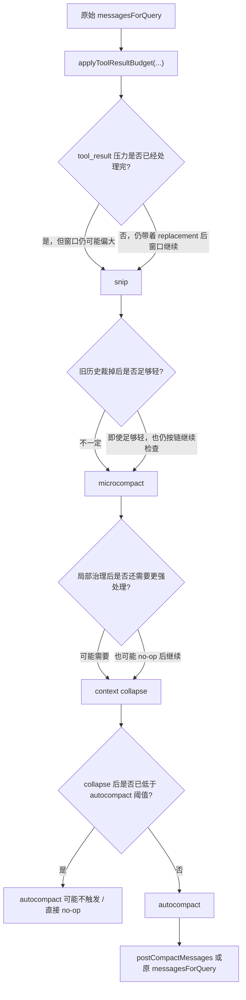

这里最关键的点不是“每一层一定都会大改一遍”，而是：

- 每一层都有机会 **no-op**
- 但控制流依然会顺序往下走
- 直到某一层真正把压力解决，或者走到最重的兜底层

#### 8.4.1 为什么 `applyToolResultBudget(...)` 之后不会直接结束

因为这层只回答一个很局部的问题：

- `tool_result` 有没有过胖

它并不回答：

- 整条历史是不是还是太长
- 旧消息是不是太多
- 当前窗口是不是仍然逼近阈值

所以即使这层已经成功把超大 `tool_result` 替换成 preview，控制权也必须继续传给 `snip`。

换句话说：

- `applyToolResultBudget(...)` 处理的是 **块级爆炸**
- 不是 **整窗体积**

#### 8.4.2 为什么 `snip` 之后还要继续到 `microcompact`

因为 `snip` 的强项是：

- 裁掉更旧、相关性更低的历史

但它不擅长：

- 对仍然保留下来的局部上下文做更精细的瘦身
- 处理 cache-aware 的局部优化

所以它做完之后，系统还需要继续问：

- “就算旧历史已经裁掉了，剩下的窗口内部是不是还太胖？”

这就是 `microcompact` 接手的原因。

可以把两者理解成：

- `snip` 是先砍老树枝
- `microcompact` 是再给留下来的枝叶修形

#### 8.4.3 为什么 `microcompact` 之后还需要 `context collapse`

因为 `microcompact` 的定位仍然是：

- **局部轻量治理**

它不会直接承担：

- 历史结构重排
- 大段历史的渐进折叠
- overflow 时的视图级恢复

而 `context collapse` 恰恰补的是这一层：

- 它试图在不进入最重 compact 的前提下
- 先把一部分历史改造成更稠密的“可见视图”

所以控制权继续往下传，不是因为前面失败了，而是因为：

- 前面几层更多在改内容
- 这里开始要尝试改“历史的呈现方式”

#### 8.4.4 为什么 `context collapse` 之后才轮到 `autocompact`

这是整条链最有设计感的地方。

`context collapse` 放在 `autocompact` 之前，意味着系统在说：

- 先别急着做最重的 compact
- 先看看能不能通过更细粒度、更渐进的折叠，把窗口压到安全区

所以这里的控制权转移逻辑其实是：

- 如果 collapse 已经把窗口压到阈值以下
  - `autocompact` 可能就直接 no-op
- 如果 collapse 还不够
  - 才继续落到最重的 `autocompact`

也就是说，`context collapse` 是：

- **重 compact 之前的最后一道细粒度缓冲层**

#### 8.4.5 为什么 `autocompact` 必须放在最后

因为它和前面几层不一样，它不是简单“再做点治理”，而是：

- 真正重建一套新的 `postCompactMessages`

在 `query.ts` 里，一旦 `compactionResult` 成立，会发生两件事：

1. `buildPostCompactMessages(compactionResult)`
2. `messagesForQuery = postCompactMessages`

这说明：

- 前面几层大多是在“原窗口上修修补补”
- `autocompact` 则是在“直接换一套新窗口”

所以它只能放在最后当兜底层。  
如果把它放前面，前面所有轻量治理的意义都会被大幅削弱。

最短一句话：

- **前四层是在尽量不重建整个窗口的前提下逐层减压**
- **最后一层才真正重建窗口**

再用一个简化示例看，会更直观。

假设这一轮刚开始时，`messagesForQuery` 大致长这样：

```ts
[
  user("帮我分析 query.ts 里的 tool_use 逻辑"),
  assistant("我先读文件和搜索相关位置"),
  user(tool_result: "Read(query.ts) 的超长全文输出 ..."),
  user(tool_result: "Grep(tool_use) 的超长输出 ..."),
  user(attachment: "nested_memory: src/CLAUDE.md 的规则"),
  assistant("根据读取结果，我下一步准备继续分析"),
]
```

这条消息链经过五层治理时，可以近似理解成：

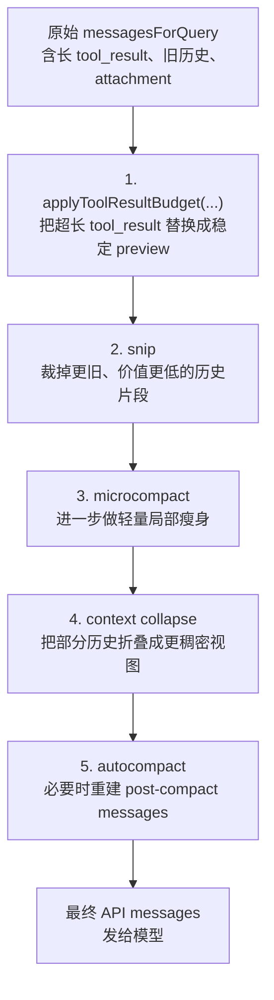

如果把每一层“改了什么”直接说出来，可以近似写成：

1. `applyToolResultBudget(...)`
   - `Read(query.ts)` 的超长结果不再整段保留
   - 被替换成稳定 preview / persisted replacement

2. `snip`
   - 更早的一些旧消息可能被直接裁掉
   - 尽量保住最近几轮与当前任务强相关的上下文

3. `microcompact`
   - 再对局部上下文做一轮轻量处理
   - 例如继续降低工具结果的存在成本

4. `context collapse`
   - 某些历史段落不再以原始展开形态出现
   - 而是以更稠密的折叠视图参与当前窗口

5. `autocompact`
   - 如果前面还不够，就进入最重的 compact
   - 直接生成一套新的 `postCompactMessages`
   - 后续这轮 query 会在这套新窗口上继续跑

所以这五层不是五次“差不多的压缩”，而是五种不同粒度的治理动作：

- 有的改块内容
- 有的删旧消息
- 有的改可见视图
- 有的重建整个窗口

### 8.5 哪些地方最容易被讲错

这部分最常见的误解，基本有 4 类：

1. 误解一：`state.messages` 会原样发给模型
   - 不对
   - 真正发给模型的是治理后的 `messagesForQuery`，再加 API 归一化后的 `messages`

2. 误解二：这里只有“四层压缩”
   - 不对
   - 源码上至少要把 `applyToolResultBudget(...)` 单独算出来

3. 误解三：`microcompact` 永远是纯本地、无 API
   - 不对
   - 它至少有 time-based 本地路径和 cached-MC 路径
   - 某些场景下也可能直接 no-op

4. 误解四：`autocompact` 只是“生成一个摘要”
   - 不够准确
   - 更准确地说，它会产出新的 post-compact messages，让当前 query 继续在新窗口上跑

#### 8.5.1 什么叫“前缀稳定”，为什么它这么重要

这里说的“前缀稳定”，核心不是一句抽象口号，而是一个非常具体的缓存条件：

- **已经发给模型的那段旧上下文前缀，下一轮尽量保持不变**

因为 Prompt Cache 的本质，是服务端复用“前面那段已经见过的输入”。  
所以从客户端视角看，最重要的不是：

- 后面有没有新增 tail

而是：

- **前面那段旧前缀有没有被改写**

这里可以把两种情况直接对照来看。

**情况 A：只是在后面追加新的 tail**

例如：

```ts
旧请求: [prefix_old]
新请求: [prefix_old, tail_new]
```

这时通常仍然有机会命中 Prompt Cache，因为：

- 旧前缀本身没变
- 只是后面新增了这一轮的 assistant / tool / attachment 尾巴

**情况 B：把旧前缀本身改掉了**

例如：

```ts
旧请求: [prefix_old]
新请求: [prefix_old_but_rewritten]
```

这时前缀缓存更容易断掉，因为：

- 服务端看到的已不是同一段前缀字节

所以对 Claude Code 来说，最危险的不是：

- “后面又多了一些新消息”

而是：

- “前面那些已经看过的旧消息，后面又被悄悄改了”

这也是为什么前面那几层治理链里，很多设计都在努力避免：

- 对已经看过的旧内容反复做不稳定改写

例如：

- `applyToolResultBudget(...)`
  - 会冻结 `tool_result` 的 replacement 决策
- `messagesToKeep`
  - 避免 compact 后某些必须保留的片段来回换表示
- compact boundary
  - 让系统从结构上切换到 compact 后的新版本，而不是让旧原文和新摘要混在一起反复抖动

所以“前缀稳定”最短可以理解成：

- **别去反复改写已经被模型看过的旧上下文**

而 Prompt Cache 命中的友好路径通常是：

- **保住旧前缀不变，只在后面追加新 tail**

### 8.6 为什么这条链是 Context Engineering 的核心亮点

很多系统会把：

- 上下文拼装
- 压缩
- 恢复

当成 3 个彼此割裂的模块。

Claude Code 的亮点恰恰在于，它把它们接成了一条连续主链：

- 前三层上下文模型负责“选材”
- 五层治理链负责“裁剪和重排”
- Agent Loop 再负责“把结果写回状态，供下一轮继续重算”

所以它不是“上下文拼完了，后面再补个压缩器”，而是：

- **上下文从一开始就是按预算感来设计的**
- **压缩不是补丁，而是主流程的一部分**

## 9. 主装配流程

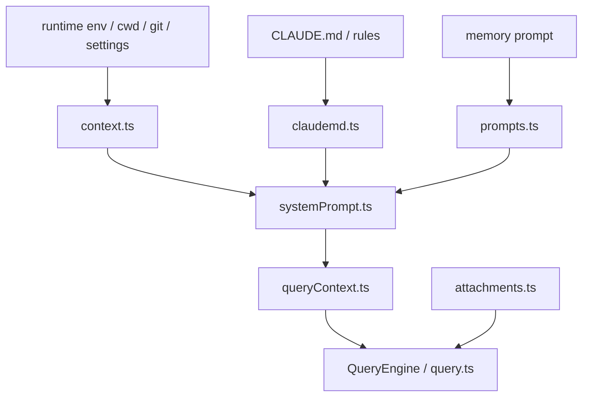

## 10. 主链分层图

如果把 Context Engineering 按“进入模型之前的输入装配链”来拆，可以把它看成四层：

1. 上下文数据源层
2. system prompt parts 组装层
3. 运行期 attachments 注入层
4. compaction / budget 协调层

这四层不是并列关系，而是前一层给后一层提供材料，最后共同形成一次 query 的有效上下文。

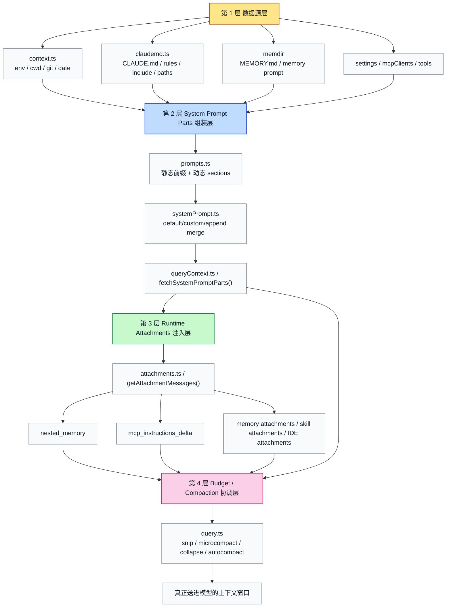

### 10.1 这张图的重点

这篇文档最关键的一点是：  
Claude Code 的上下文不是“一个 prompt 文件”，而是一条加工链。

也就是说，最终送进模型的上下文并不是直接来自某个单一模块，而是：

- `context.ts` 提供环境事实
- `claudemd.ts` 提供规则层记忆
- `prompts.ts` / `systemPrompt.ts` 把这些东西组装成 system prompt parts
- `attachments.ts` 在运行期继续补充动态上下文
- `query.ts` 再结合预算和压缩策略决定最后真正送给模型的窗口

所以这条链最终产出的不是“完整原始上下文”，而是：

**经过选择、分层、注入、压缩之后的有效上下文**

## 11. `system prompt parts` 组装链

如果只盯着 `systemPrompt` 这个名字，很容易误以为系统是在“生成一大段 prompt 文本”。  
但从源码看，它真正做的是先分块，再合成。

### 11.1 链路图

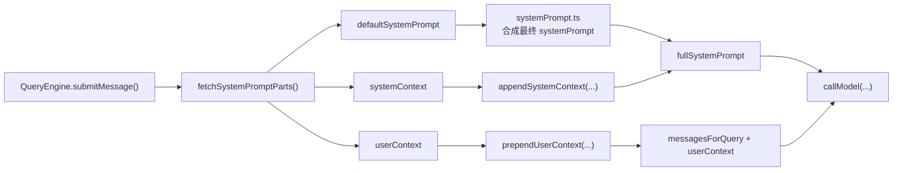

### 11.2 这条链到底在干嘛

`fetchSystemPromptParts()` 的意义不是“一次性吐出最终 prompt”，而是把上下文拆成三部分：

- `defaultSystemPrompt`
  - 更像系统级静态/半静态 prompt parts
- `userContext`
  - 更像插在消息前面的用户上下文
- `systemContext`
  - 更像附加到 system prompt 末尾的环境/系统事实

这三部分之后不会被同一种方式处理：

- `defaultSystemPrompt` 会进入 `systemPrompt.ts` 继续 merge
- `userContext` 会通过 `prependUserContext(...)` 进入消息流
- `systemContext` 会通过 `appendSystemContext(...)` 进入最终 system prompt

这说明 Claude Code 不是只关心“内容是什么”，还关心“这些内容应该放在哪个通道里”。

### 11.3 为什么要拆成这些 parts

这样拆的收益至少有三个：

1. 让缓存边界更清楚
   静态前缀和动态段可以分开管理

2. 让运行期更新更轻
   某些信息不需要每次重建整个 prompt

3. 让不同来源的上下文进入不同通道
   比如有些更适合进 system prompt，有些更适合进 message prefix

所以 `system prompt parts` 的核心价值不只是“把东西拼起来”，  
而是把上下文做成**可路由的部件**。

## 12. Attachments 主链：为什么不是所有内容都放进 prompt

`attachments.ts` 的存在，说明系统从一开始就不打算把所有上下文都塞进 system prompt。

### 12.1 Attachments 链路图

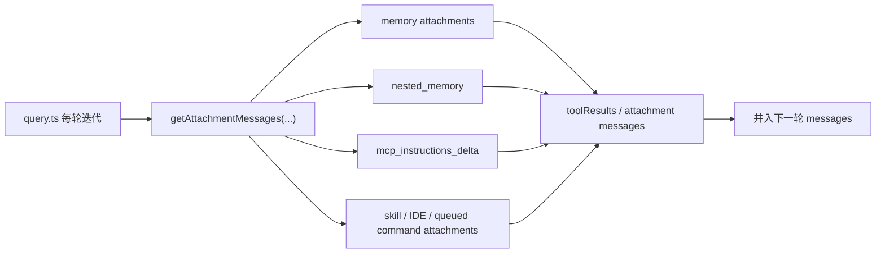

### 12.2 为什么要走 attachment 通道

原因非常实际：

- 某些内容是动态的
- 某些内容只在某个 turn 才需要
- 某些内容只在操作某个文件时才需要
- 某些内容如果放进 system prompt 会破坏缓存稳定性

例如：

- `mcp_instructions_delta`
  - 适合做增量通知，而不是每次重算整段 MCP 说明
- nested memory
  - 适合按目标路径按需注入，而不是常驻全局 prompt

因此 attachments 解决的是：

- **上下文何时注入**
- **上下文是否按需注入**
- **上下文是否应该占用 system prompt 的稳定区**

它更像一个“运行期上下文总线”。

## 13. Nested Memory 主链：为什么它是 Context Engineering 的关键亮点

`nested memory` 是这套系统最像“代码 agent 专项优化”的设计之一。  
因为它不是根据“当前项目”粗粒度给规则，而是根据“当前要处理的具体文件路径”补局部规则。

### 13.1 Nested Memory 链路图

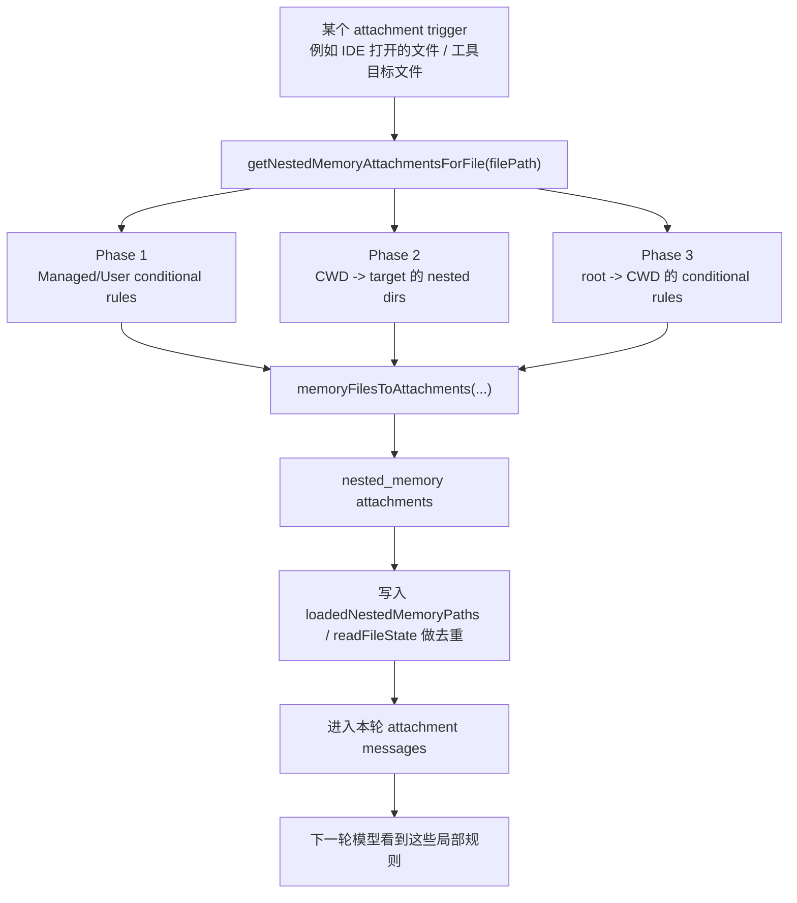

### 13.2 这条链解决了什么问题

如果没有 nested memory，系统通常只能在两种粒度上工作：

- 全局规则
- 项目规则

但实际代码仓库里，经常存在第三种粒度：

- 模块规则
- 子目录规则
- 某类文件路径的局部约束

例如：

- `src/server/*` 和 `src/web/*` 的规范不同
- `migrations/*` 有严格禁止规则
- `tests/*` 的写法和生产代码不同

Nested memory 的价值就是：  
不把这些局部规则永久压进全局 prompt，而是在当前文件路径被涉及到时再加载。

### 13.3 为什么 `memoryFilesToAttachments(...)` 重要

它不是简单把文件读出来，而是做了两件很关键的事：

1. 转换成统一 attachment 结构
   - 类型变成 `nested_memory`
   - 携带展示路径和内容

2. 做去重和读状态同步
   - `loadedNestedMemoryPaths`
   - `readFileState`

这意味着 nested memory 不是一遍遍盲注，而是 runtime 知道“这条规则今天已经给过模型了没有”。

## 14. Context 与 Compaction 的主链关系

很多系统把 Context Engineering 和 Compaction 当成两个模块分开讲，  
但在 Claude Code 里，这两者实际上是同一条链上的前后段。  

前面 [8. 从 `state.messages` 到 API `messages`：五层上下文治理链](D:/Agent/ClaudeCode/claude-code源码/claude-code-main/module-docs/context-engineering.md) 已经把这条链单独展开讲过了；这里更强调的是：

- 这条治理链为什么和 Context Engineering 本身密不可分
- 为什么它不是后置补丁，而是上下文工程的一部分

### 14.1 Compaction 耦合图

```mermaid
flowchart TD
  A["state.messages<br/>内部累计的消息主干"] --> B["messagesForQuery<br/>本轮可见工作窗口"]
  A1["system prompt parts"] --> B
  A2["attachments / nested memory / MCP delta"] --> B

  B --> C["1. applyToolResultBudget(...)<br/>前置预算治理<br/>对 tool_result 做稳定 preview / replacement"]
  C --> D["2. snip<br/>本地裁剪较旧消息<br/>优先保最近上下文"]
  D --> E["3. microcompact<br/>轻量局部治理<br/>time-based 本地路径 / cached-MC 路径"]
  E --> F["4. context collapse<br/>渐进式折叠视图<br/>尽量避免过早进入重压缩"]
  F --> G["5. autocompact<br/>最重的兜底压缩<br/>产出新的 post-compact messages"]
  G --> H["prependUserContext(...) / normalizeMessagesForAPI(...)"]
  H --> I["最终送进模型的 messages"]
```

### 14.2 这张图真正想表达什么

Claude Code 不是：

- 先把上下文拼满
- 然后不够了再随便裁一点

而是从一开始就承认：

- system prompt parts 会占预算
- attachments 会占预算
- nested memory 会占预算
- tool results 也会占预算

所以 Context Engineering 和 Compaction 的关系是：

- 前者决定“哪些信息值得进上下文”
- 后者决定“这些信息最后以什么密度、什么窗口进入模型”

也就是说：

- Context Engineering 管“选材与分层”
- Compaction 管“预算与裁剪”

这也是为什么在 `query.ts` 里，上下文准备永远发生在模型调用之前，而且是每轮都要重新做的。

如果这里用一句话回看前面的结论，可以记成：

- Context Engineering 管“哪些内容进窗口”
- Compaction 治理链管“这些内容以什么密度进入窗口”

## 15. 一句话总结这条主链

如果把你关心的那条主链压缩成一句话，可以写成：

**system prompt parts 先定义稳定骨架，attachments 再补充运行期上下文，nested memory 负责按路径注入局部规则，最后 compaction 决定真正送进模型的有效窗口。**

这句话基本就是 Claude Code 的 Context Engineering 主干。

## 16. `prompts.ts`：缓存意识非常强

`src/constants/prompts.ts` 里有一个非常关键的常量：

- `SYSTEM_PROMPT_DYNAMIC_BOUNDARY = '__SYSTEM_PROMPT_DYNAMIC_BOUNDARY__'`

这几乎直接说明了设计者的意图：  
system prompt 不是单纯给模型看的，也是给缓存系统看的。

### 16.1 为什么这个边界重要

系统会把 prompt section 划分为：

- 可以稳定复用的前缀
- 容易变化、需要频繁重建的后缀

这样做的收益：

- 降低 token 成本
- 避免每轮都重传长前缀
- 保持工具列表和基础行为约束的 cache stability

这是一种非常典型的“Prompt-as-runtime-asset”思路。  
Prompt 在这里不只是文本，也是需要被工程化管理的结构件。

## 17. `systemPrompt.ts`：system prompt 不是单来源

这个文件的价值在于：  
它把“最终 system prompt”变成了一个合成产物，而不是固定文件。

它需要同时考虑：

- 默认系统提示
- `customSystemPrompt`
- `appendSystemPrompt`
- agent-specific prompt
- coordinator 或特殊模式附加说明

也就是说，system prompt 在这里不是静态模板，而是一个 merge result。  
这种设计让后面的 Agent、Skill、MCP、模式切换都可以叠加自己的语义层。

## 18. `claudemd.ts`：项目规则发现器，而不只是文件读取器

这个文件是整个 Context Engineering 最值得反复读的模块之一。

源码注释里明确写了加载顺序：

1. Managed memory，例如 `/etc/claude-code/CLAUDE.md`
2. User memory，例如 `~/.claude/CLAUDE.md`
3. Project memory，例如 `CLAUDE.md`、`.claude/CLAUDE.md`、`.claude/rules/*.md`
4. Local memory，例如 `CLAUDE.local.md`

而且它不是简单读几个文件，它还做了很多“工程化上下文处理”：

- 从当前目录向上遍历到根目录发现规则
- 离当前目录越近，优先级越高
- 支持 `.claude/rules/*.md`
- 支持 `@include`
- 阻止循环引用
- 只允许文本类型文件被 include
- 解析 frontmatter 中的 `paths`
- 依据目标路径应用条件规则
- 安全地剥离 HTML 注释

### 18.1 这意味着什么

这意味着 Claude Code 把“项目知识”建模成了一个可分层、可组合、可按路径选择性生效的规则系统。  
这已经明显超出普通 prompt 工程的范畴了。

## 19. `attachments.ts`：真正的动态上下文总线

如果说 `prompts.ts` 管的是 prompt section，  
那 `attachments.ts` 管的就是运行期注入。

源码里能看到：

- `getAttachmentMessages(...)`
- `memoryFilesToAttachments(...)`
- `mcp_instructions_delta`
- nested memory 注入

最关键的一个事实是：  
`getAttachmentMessages(...)` 不是只在最开始跑一次，而是在 `query.ts` 的 loop 中反复执行。

这意味着上下文不是静态快照，而是会随着 loop 推进持续变化的。

## 20. Nested Memory：按目标文件路径动态补充规则

`attachments.ts` 中对 nested memory 的处理尤其能体现 Context Engineering 的成熟度。  
源码注释把加载流程写得很清楚：

1. Managed/User 条件规则，按目标路径匹配
2. 从 CWD 到 target 的嵌套目录，加载 `CLAUDE.md` + unconditional rules + conditional rules
3. 从 root 到 CWD 的目录，只加载 conditional rules

这说明系统不是只根据“当前仓库”给规则，  
而是根据“这次工具操作的具体文件路径”补充局部上下文。

这种路径敏感的上下文装配很适合代码场景，因为：

- 同一个仓库不同模块可以有不同规则
- 一个 agent 在编辑具体文件时才需要这条局部约束
- 不必把所有局部规则都塞进全局 prompt

## 21. `context.ts`：环境快照提供者

`src/context.ts` 更像整个上下文装配流水线的数据源：

- 当前日期
- shell / OS 信息
- Git 状态
- 项目级上下文

它的价值不在于复杂逻辑，而在于把“环境事实”以统一格式供 prompt 层消费。  
这种拆分让 prompt 层不需要自己去探测运行环境。

## 22. 上下文工程与 compaction 的关系

Claude Code 的上下文工程不是“能塞多少塞多少”，它天然和压缩系统耦合。

因为它从一开始就承认：

- prompt 是有预算的
- 预算是动态的
- 记忆、附件、工具列表会竞争 token
- 因此上下文必须支持裁剪、分层和增量注入

这也是为什么：

- 有动态边界
- 有 attachment 层
- 有 nested memory 按需装配
- 有 `mcp_instructions_delta` 而不是全部静态写死

本质上，这是把“上下文预算管理”变成了架构职责。

## 23. 这个模块体现的开发范式

### 23.1 Context as pipeline

上下文来自多个源头，通过装配管线合成，而不是手写一个超长 prompt。

### 23.2 Stable prefix + dynamic tail

缓存友好的前缀与动态后缀分离，这是非常典型的高成本 agent runtime 设计。

### 23.3 Conditional overlays

路径规则、nested memory、MCP delta 都属于条件覆盖层。

### 23.4 Runtime-time context assembly

很多上下文直到某个 turn、某个工具、某个文件路径出现时才真正被注入。

### 23.5 Context is executable infrastructure

这里的上下文不是“文案”，而是 runtime 的输入协议。

## 24. 为什么这算 Harness Engineering

如果一个系统只是写了很长的 system prompt，通常不算成熟的 Harness Engineering。  
而这里已经明显是另一种级别：

- 上下文有发现器
- 有合成器
- 有缓存边界
- 有动态注入总线
- 有路径条件规则
- 有与 compaction 联动的预算意识

换句话说，这个系统在“驾驭上下文”，而不是“堆上下文”。

## 25. 当前逆向版本的限制

当前仓库里仍然能看到一些更高级路径：

- 某些 feature-gated prompt section
- 某些 Anthropic 内部模式
- 部分 MCP / swarm 相关增强注入

但由于 `feature()` 恒为 `false`，不是所有路径都会在当前构建中激活。

这不影响我们理解它的主架构：  
Context Engineering 主干已经足够完整，而且非常成熟。

## 26. 后续最值得继续深挖的点

- `prompts.ts` 各个 section 的精确拼接顺序
- `claudemd.ts` 条件规则匹配和 `@include` 展开细节
- `attachments.ts` 中不同 attachment 类型的注入优先级
- context 预算如何与 compaction / collapse 对接
- path-specific memory 为什么是代码 agent 的关键能力
