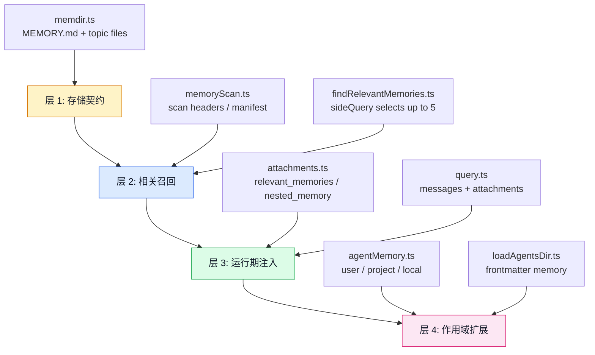
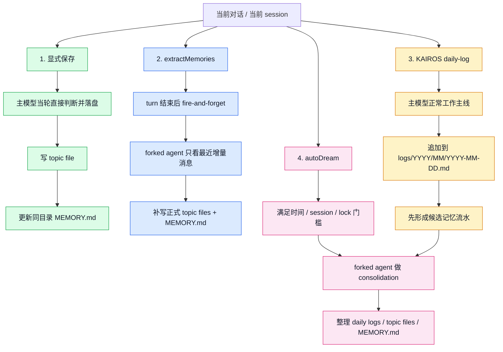
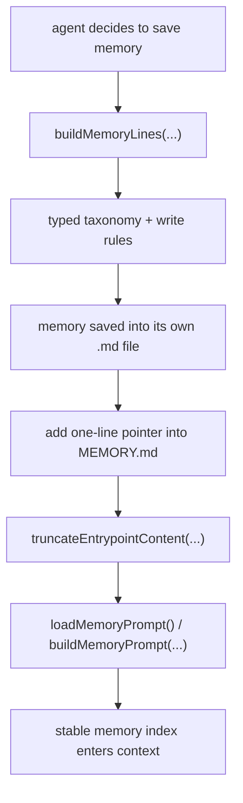
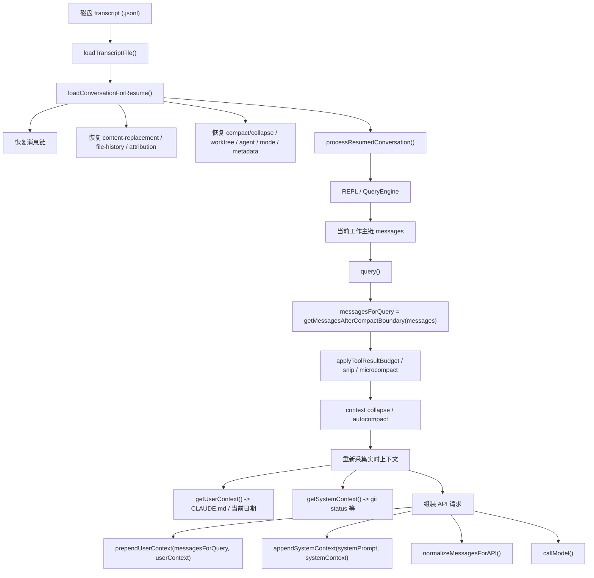
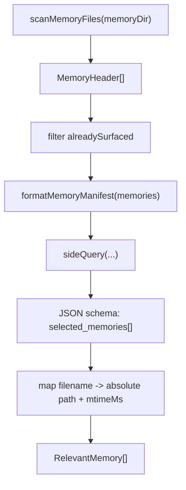
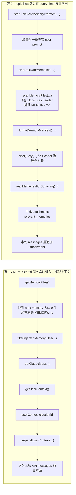
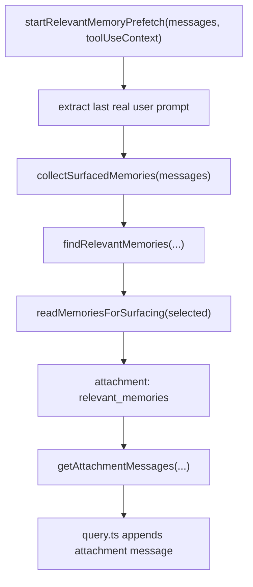
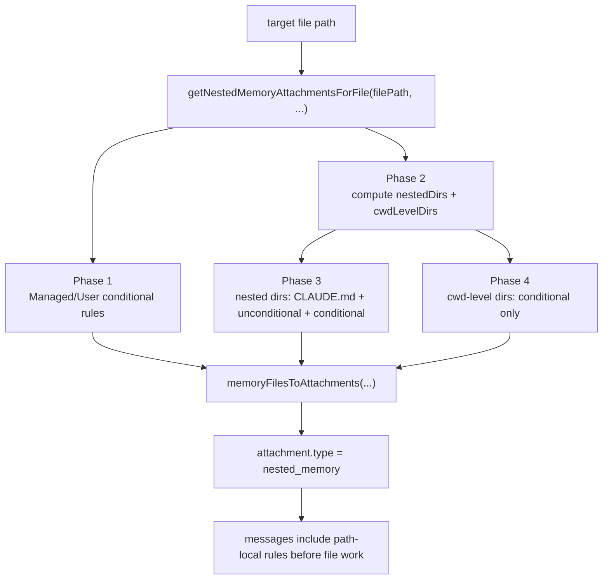
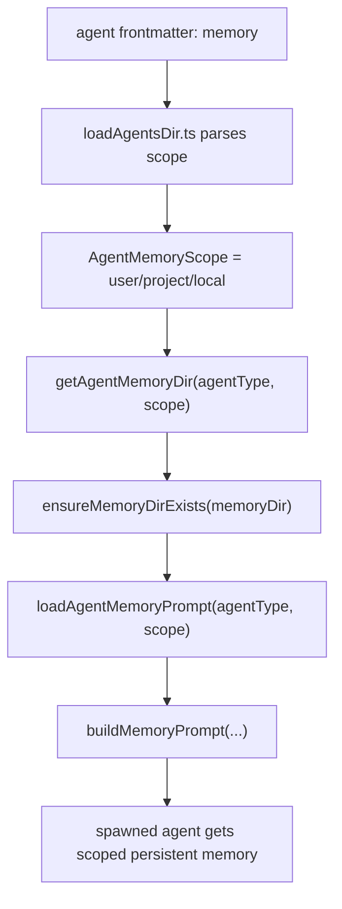

# 记忆系统深拆

## 模块定位

Claude Code 的记忆系统不是一个独立外挂的 RAG 子系统，而是直接嵌进 runtime 的一组长期上下文机制。它同时承担四件事：

- 保存跨会话仍然有价值的信息
- 把长期知识变成当前 turn 可消费的上下文
- 约束“什么值得记、什么不该记”
- 让主 agent、子 agent、项目级规则和路径级规则处在同一认知平面内

所以它不是“向量库 + 检索”这么简单，而是一条完整的工程链：

- `memdir` 负责存储契约
- `findRelevantMemories.ts` 负责相关召回
- `attachments.ts` 负责运行期注入
- `agentMemory.ts` 负责多 agent 场景下的作用域持久化
- `claudemd.ts` 负责把规则型记忆和文件型记忆一起纳入上下文体系

---

## 核心源码边界

| 文件 | 责任 |
| --- | --- |
| `src/memdir/memdir.ts` | 定义 `MEMORY.md` 入口、截断规则、typed memory prompt、目录初始化 |
| `src/memdir/paths.ts` | 管理 memory base dir、auto/team memory 路径 |
| `src/memdir/findRelevantMemories.ts` | 扫描 memory header，并通过 `sideQuery(...)` 选择最相关记忆 |
| `src/memdir/memoryScan.ts` | 从 memory 目录提取可供召回的 header / manifest |
| `src/utils/claudemd.ts` | 统一读取 `CLAUDE.md` / `MEMORY.md` 一类长期规则与索引文件 |
| `src/utils/attachments.ts` | 记忆注入总线：nested memory、relevant memories、prefetch、dedup |
| `src/tools/AgentTool/agentMemory.ts` | 子 agent 的持久记忆作用域与 prompt 注入 |
| `src/tools/AgentTool/loadAgentsDir.ts` | 从 agent frontmatter 解析 `memory: user/project/local` |
| `src/utils/teamMemoryOps.ts` | team memory 的读写识别与摘要辅助 |

---

## 主链总览

下面这张图先把记忆系统的四条主链放到一起：



这四层分别解决不同问题：

1. 第 1 层问的是：记忆在磁盘上应该长什么样，入口文件怎么控制预算，哪些内容允许持久化  
2. 第 2 层问的是：面对当前用户请求，哪些长期记忆真的值得拿出来  
3. 第 3 层问的是：这些记忆什么时候、以什么消息形态进入当前 loop  
4. 第 4 层问的是：不同 agent 是否应该共享同一份记忆，还是按作用域隔离

---

## 一、存储契约：`memdir.ts` 把记忆做成文件系统，而不是黑盒数据库


### 为什么很多自主智能体偏爱文件记忆，而不是一上来就用数据库

这里先说一个容易误解的点：

- 现在的自主智能体并不是“都只用本地文件记忆”
- 更常见的是把几类东西分开存：
  - 状态 / checkpoint / 线程恢复
  - 长期记忆 / 规则 / 偏好
  - 语义召回索引

Claude Code 这套实现明显偏向：

- 用普通 markdown 文件保存长期记忆
- 用 `MEMORY.md + topic files` 做可读、可审计、可编辑的记忆层

这不是因为数据库做不到，而是因为本地 coding agent 有一组很现实的工程偏好：

- 模型本来就擅长读写文件
- 人类可以直接打开、检查、修改、diff、回滚
- 不需要额外数据库基础设施
- 可以天然复用 `Read / Edit / Write` 这套工具链
- 记忆本身往往就是“规则、偏好、项目事实、工作笔记”这类文档型内容

所以像 Claude Code 这样的本地 agent，更容易把记忆设计成：

- **文件可读**
- **prompt 可消费**
- **工具可直接编辑**

而不是先做成一层黑盒数据库。

#### 1 本地文件记忆的优点和代价

这里其实也最好分成两类看：

- **历史类文件**
  - 例如 transcript、append-only event log、操作日志
- **记忆类文件**
  - 例如 `MEMORY.md`、topic files、规则文档、长期笔记

因为这两类虽然都落在文件系统上，但解决的问题并不完全一样。

如果把“本地文件记忆”的优点和代价再拆开，其实可以这样理解：

- **把文件当历史账本**
  - 优点会集中在：
    - append-only 自然
    - 可回放
    - 可审计
    - 可导出
    - 人类能直接排查
  - 代价会集中在：
    - 恢复当前状态常常要从历史重建
    - 并发写入弱
    - 跨 session 查询和聚合差
- **把文件当长期记忆正文**
  - 优点会集中在：
    - 人和模型都能直接读写
    - Git / diff / 备份友好
    - prompt 友好
    - 零运维
  - 代价会集中在：
    - 去重和冲突治理难
    - 全局一致性弱
    - 海量检索和语义召回不如专门索引系统

下面这组“优点 / 代价”清单，主要说的是这两类文件放在一起时的综合特征。

**优点**

- 人类可读可改，最透明
- 非常适合走 Git / 审计 / 备份
- 零运维，单机就能跑
- 对“规则、偏好、项目约束、笔记”这类文档型记忆特别自然

**代价**

- 并发写入弱
- 多用户 / 多 worker 协调能力差
- 查询、聚合、统计、权限控制都不如数据库
- 大规模语义召回时，天然不如专门的索引系统高效

#### 2 数据库 / 向量库的优点和代价

数据库这边也同样最好分成两类：

- **状态 / 历史数据库**
  - 例如 Redis、SQLite、Postgres
- **记忆 / 检索数据库**
  - 例如向量库、搜索索引、检索型数据库

它们分别对应的是两种很不一样的问题：

- **前者更关心**
  - 当前 session 在什么状态
  - checkpoint 怎么恢复
  - 多用户 / 多 worker 怎么并发安全地读写
- **后者更关心**
  - 海量知识怎么召回
  - 语义上最相关的片段怎么找回来

所以下面这节其实不是在说“数据库是一种东西”，而是在并排比较：

- 结构化状态数据库
- 语义检索型数据库

**SQLite / Postgres 这类结构化数据库**

更适合：

- 线程状态
- checkpoint
- 消息历史
- 多用户 / 服务端部署

优点是：

- 事务、并发、查询、恢复都更稳
- 很适合“状态型持久化”

代价是：

- schema、迁移、运维复杂度更高
- 直接给模型看的“文档感”没那么强
- 人工检查和手改不如文件直观

**Chroma / pgvector / Milvus 这类向量库**

更适合：

- 海量片段的语义召回
- RAG / 文档库 / 长知识库

优点是：

- 大规模语义检索更强

代价是：

- 需要 embedding / 索引重建 / 去重治理
- 不适合替代事务型主存储
- 人类直接维护体验差

#### 3 最成熟的做法通常不是二选一

很多成熟 agent 最后会形成这样的分工：

- 文件：存规则、偏好、长期笔记
- 数据库：存线程、checkpoint、事件日志
- 向量库：存海量语义召回索引

也就是说：

- 文件负责“可读记忆”
- 数据库负责“可靠状态”
- 向量库负责“语义召回”

Claude Code 当前这套 memory system 更偏第一种：

- 它不是把记忆当成数据库里的 opaque rows
- 而是把它当成模型和人类都能读写的 prompt 文档系统

一句话总结：

**不是“自主智能体都只用文件记忆”，而是本地 coding agent 特别适合先用文件做长期记忆；一旦走向多用户、生产化、海量检索，数据库和向量库就会越来越重要。**


#### 4 更准确的抽象：这不只是“文件 vs 数据库”，而是“状态 / 历史 / 记忆 / 检索”四层分工

如果把这个问题只理解成：

- 文件系统
- 对比
- 数据库

其实还是有点粗。

更准确的抽象是：

- **当前状态层**
- **历史账本层**
- **长期记忆层**
- **分析检索层**

很多成熟 agent 最后会把这四层拆开，而不是希望一种存储同时把四件事都做漂亮。

```mermaid
flowchart TD
    A["用户 / Agent 运行中"] --> B["1. 当前状态层"]
    A --> C["2. 历史账本层"]
    A --> D["3. 长期记忆层"]
    A --> E["4. 分析检索层"]

    B --> B1["Redis / Postgres / SQLite"]
    B --> B2["session 当前状态"]
    B --> B3["运行中任务 / 锁 / TTL / 心跳"]
    B --> B4["关注: 现在系统处于什么状态"]

    C --> C1["JSONL / append-only event log"]
    C --> C2["transcript / tool events / compact 痕迹"]
    C --> C3["可回放 / 可审计 / 可导出 / 可 fork"]
    C --> C4["关注: 之前到底发生了什么"]

    D --> D1["Markdown / 文件系统"]
    D --> D2["MEMORY.md / topic files / 规则文档"]
    D --> D3["人和模型都可读可改"]
    D --> D4["关注: 哪些知识值得长期保留"]

    E --> E1["Postgres / Elasticsearch / 向量库 / OLAP"]
    E --> E2["检索 / 聚合 / 统计 / 报表 / 推荐"]
    E --> E3["关注: 如何跨大量数据高效查找和分析"]
```



用这张图再回头看，就会更清楚：

- 数据库更擅长“状态”
- JSONL / 事件日志更擅长“历史”
- Markdown / 文件系统更擅长“长期记忆”
- 向量库 / 索引系统更擅长“检索”

也正因为如此，Claude Code 这种系统并不是在说：

- “文件系统比数据库更高级”

而是在说：

- **对“长期记忆”这一层，文件系统特别合适**

因为它天然满足这层最重要的几个要求：

- 可读
- 可改
- 可审计
- 可 diff
- 可直接进入 prompt

而如果换成：

- session 当前状态
- 恢复点
- 多用户运行态
- 大规模查询

数据库往往反而更合适。

#### 5 一个最实用的判断标准：你在存的是“当前状态”，还是“可读知识”

如果要把这节压成一个最实用的工程判断标准，可以直接问自己一句：

- **我现在要保存的，到底是“当前状态”，还是“可读知识”？**

再展开一点，其实可以分成 4 个问题：

| 你真正要解决的问题 | 更像哪一层 | 更适合的载体 |
| --- | --- | --- |
| 现在系统处于什么状态 | 当前状态层 | Redis / SQLite / Postgres |
| 之前到底发生了什么过程 | 历史账本层 | JSONL / event log |
| 哪些经验和规则值得以后继续带着 | 长期记忆层 | Markdown / 文件系统 |
| 如何跨大量历史高效检索和分析 | 分析检索层 | 数据库索引 / 向量库 / 搜索系统 |

这样一来，“很多自主智能体偏爱文件记忆”这句话就不会被误解成：

- “文件能取代数据库”

它真正的意思更接近：

- **当你存的是“人和模型都要直接读写的长期知识”时，文件往往是最自然的第一选择**

而不是：

- 当前 session 运行态
- 实时并发状态
- 大规模检索索引

这些层照样常常需要数据库。

所以更准确的结论是：

- 文件系统不是全能存储
- 数据库也不是所有知识层问题的默认答案
- **最成熟的做法，是让不同层各自用最顺手的存储介质**

把这个判断标准带回 Claude Code 当前这套 memory system，就会发现它的取向非常一致：

- 它把长期 memory 做成 markdown 文件
- 把 `MEMORY.md` 做成稳定入口索引
- 把 topic files 做成可读、可 diff、可召回的知识正文
- 而不是一开始就把这层信息塞进数据库里的 opaque rows

### 1.1 `MEMORY.md` 不是正文，而是入口索引

[memdir.ts](D:\Agent\ClaudeCode\claude-code源码\claude-code-main\src\memdir\memdir.ts) 里直接定义了：

- `ENTRYPOINT_NAME = 'MEMORY.md'`
- `MAX_ENTRYPOINT_LINES = 200`
- `MAX_ENTRYPOINT_BYTES = 25_000`

这说明系统从一开始就不把记忆当成“无限膨胀的上下文池”，而是当成一套受预算约束的入口索引。

源码注释非常关键：

- `MEMORY.md` 是 index，不是完整记忆正文
- 每条记忆应该写到独立文件
- `MEMORY.md` 只保留指针和一句 hook

这就是非常典型的 `index + detail split` 范式。

### 1.2 为什么要分成 `MEMORY.md + 独立 topic files`

因为 runtime 有两个冲突目标：

- 一方面要让模型稳定看到长期记忆入口
- 另一方面又不能让所有历史内容直接污染 prompt

Claude Code 的做法是：

- 让 `MEMORY.md` 永远扮演“稳定入口”
- 把真正细节拆到单独 memory file
- 只有在需要时，才通过召回链把具体文件读进来

这比“直接把整份长期记忆塞进 system prompt”成熟得多。

### 1.2.1 Claude Code 到底会存哪些“内容类型”的记忆

源码把允许持久化的长期记忆限制成 4 种，这一点在 [memoryTypes.ts](D:\Agent\ClaudeCode\claude-code源码\claude-code-main\src\memdir\memoryTypes.ts) 里写得很清楚：

- `user`
  - 用户的角色、背景、知识结构、职责、长期偏好
- `feedback`
  - 用户对协作方式的纠偏，或者明确确认过的做法
- `project`
  - 不能从代码 / git 直接推导出来的项目事实，例如冻结窗口、目标、约束、谁在做什么
- `reference`
  - 外部系统入口，例如 Linear 项目、Grafana 面板、Slack 渠道

这里要特别区分两个层次：

- `user / feedback / project / reference` 这 4 个是**记忆类型 taxonomy**
- 它们不是 4 份固定文档

真实落盘时，更常见的形态是：

- 一个 memory 目录里有 **1 份 `MEMORY.md` 索引**
- 再加上 **多份独立 topic files**
- 每个 topic file 通过 frontmatter 里的 `type` 字段声明自己属于哪一类

所以更准确地说：

- 所有长期记忆不会只落到“4 个文档中的一个”
- 而是会分散落到**很多个 topic memory files** 里
- 这 4 个类型只是给这些文件打上的语义标签

反过来说，下面这些内容**不该进 memory**：

- 代码模式、架构、文件路径、项目结构
- git history
- debugging fix recipe
- 已经写在 `CLAUDE.md` 里的内容
- 当前会话里的临时任务细节

这条边界非常重要，因为它说明 Claude Code 的 memory 存的不是“代码库事实”，而是：

- **跨会话仍然有价值**
- **又不能从当前项目状态直接推导出来**

的那部分信息。

如果上一节回答的是“语义上到底记什么”，那下一节就回答：

- **这些记忆在磁盘上到底长什么样**

### 1.2.2 记忆目录里到底会存哪些东西

如果把 Claude Code 的记忆目录按“磁盘上实际长什么样”来拆，最重要的是下面几类：

1. `MEMORY.md`
   - 这是稳定入口索引，不是正文仓库
   - 通常是**每个 memory 目录各有一份**
   - 它负责告诉模型“有哪些长期记忆主题存在”
   - 但不承担长正文存储

2. 独立的 topic memory files
   - 例如 `user_role.md`、`feedback_testing.md`
   - 这些文件才是真正的长期记忆正文
   - 它们通常带 frontmatter，至少会有：
     - `name`
     - `description`
     - `type`

3. `auto memory` 的 append-only 日志
   - 这是一条特殊路径
   - 写入到按日期组织的 log file
   - 后面再由 nightly process 蒸馏成 `MEMORY.md + topic files`

如果把它画成文件结构，最容易理解成下面这样：

```text
memory/
├─ MEMORY.md                    # 稳定入口索引；一行一个指针，不写长正文
├─ user_background.md           # user 类型的 topic memory 正文
├─ feedback_testing.md          # feedback 类型的 topic memory 正文
├─ project_merge_freeze.md      # project 类型的 topic memory 正文
├─ reference_ingest_linear.md   # reference 类型的 topic memory 正文
└─ logs/
   └─ 2026/
      └─ 04/
         └─ 2026-04-12.md       # auto memory 的 append-only 日志；后续再蒸馏
```

其中：

- `MEMORY.md`
  - 稳定入口索引
- 根目录下这些独立 `.md`
  - 是正式的 topic memory files
- `logs/YYYY/MM/YYYY-MM-DD.md`
  - 是 `auto memory` 的 append-only 日志
  - 后面再被蒸馏成正式 topic files

如果再把子 agent 的 scoped memory 也一起画进来，会更像：

```text
~/.claude/
├─ memory/
│  ├─ MEMORY.md                 # 主 memory 目录的稳定入口
│  ├─ user_background.md        # 主 memory 目录下的 topic files
│  ├─ feedback_testing.md       # 主 memory 目录下的 topic files
│  └─ logs/...                  # auto memory 日志目录
└─ agent-memory/
   └─ <agentType>/
      ├─ MEMORY.md              # user-scope agent memory 的入口索引
      └─ topic files...         # 某类 agent 自己的长期记忆正文

<project>/.claude/
├─ agent-memory/
│  └─ <agentType>/
│     ├─ MEMORY.md              # project-scope agent memory 的入口索引
│     └─ topic files...         # 当前项目共享给该 agent 的长期记忆
└─ agent-memory-local/
   └─ <agentType>/
      ├─ MEMORY.md              # local-scope agent memory 的入口索引
      └─ topic files...         # 当前机器 / 当前项目本地的 agent 记忆
```

这张结构图最想强调的是：

- 主 memory 目录存“用户 / 项目 /外部参考”这类长期记忆
- scoped agent memory 目录存“某类 agent 自己的持久记忆”
- `logs/` 不是最终成品，而是中间层

这几类不要混为一谈：

- `MEMORY.md` 是索引页
- topic files 是正文页
- auto memory logs 是“先记流水，再夜间蒸馏”的中间层

#### 1.2.2.1 `MEMORY.md` 和独立 topic files 的结构长什么样

`MEMORY.md` 和独立 topic files 的结构并不一样。

**`MEMORY.md`**

它是**索引文件**，不是正文文件。

特点是：

- 没有 frontmatter
- 一行一个指针
- 每行通常是：
  - `- [Title](file.md) — one-line hook`

一个典型例子会像这样：

```md
- [用户背景](user_background.md) — 用户后端 Go 经验深，但第一次接触这个仓库的 React 前端
- [测试策略](feedback_testing.md) — 这个区域的集成测试必须连接真实数据库
- [合并冻结](project_merge_freeze.md) — 2026-03-05 起进入移动端发布冻结期
```

它的职责是：

- 给模型一个稳定、低成本的长期记忆入口
- 告诉模型“有哪些主题记忆存在”
- 但不承担长正文存储

**独立 topic files**

它们才是**真正的长期记忆正文文件**。

结构通常是：

1. 开头一段 YAML frontmatter
2. 后面是 Markdown 正文

最小结构大概是：

```md
---
name: 用户背景
description: 用户后端 Go 经验深，但第一次接触这个仓库的 React 前端
type: user
---

用户有多年的 Go 开发经验，但这是他第一次接触这个仓库的 React / 前端部分。

How to apply:
- 解释前端结构时，尽量类比后端服务、模块边界和数据流。
- 避免默认他已经熟悉前端生态术语。
```

其中 frontmatter 里最关键的 3 个字段是：

- `name`
  - 这条记忆的名字
- `description`
  - 一句话描述，后面相关召回会用到
- `type`
  - 只能是固定枚举：
    - `user`
    - `feedback`
    - `project`
    - `reference`

所以最短的区分可以记成：

- `MEMORY.md` = 目录页 / 索引页
- topic file = 正文页 / 详情页

#### 1.2.2.2 这类 topic file 应该怎么写

一个很实用的总模板是：

```md
---
name: ...
description: ...
type: user|feedback|project|reference
---

核心事实。

Why:
为什么这件事重要。

How to apply:
以后遇到什么情况时应该怎么用。
```

注意两个边界：

- 正文完全可以用中文写
- `name`、`description` 也可以用中文
- 只有 `type` 必须保持英文枚举值，因为源码会按固定 taxonomy 解析它

下面把 4 种最常见的 topic file 都换成中文版例子。

**1. `user`**

适合存：

- 用户是谁
- 用户擅长什么
- 用户长期偏好什么表达方式

```md
---
name: 用户背景
description: 用户后端 Go 经验深，但第一次接触这个仓库的 React 前端
type: user
---

用户有多年的 Go 开发经验，但这是他第一次接触这个仓库的 React / 前端部分。

How to apply:
- 解释前端结构时，尽量类比后端服务、模块边界和数据流。
- 避免默认他已经熟悉前端生态术语。
```

**2. `feedback`**

适合存：

- 用户纠正过你的工作方式
- 用户明确确认过某种非显然做法是对的

```md
---
name: 测试策略偏好
description: 这个区域的集成测试必须连接真实数据库，而不是 mock
type: feedback
---

这个区域的集成测试应该连接真实数据库，而不是 mock。

Why:
之前出现过 mocked tests 通过、但生产迁移失败的事故。

How to apply:
- 涉及数据库行为的改动，优先建议真实环境集成验证。
- 不要把 mock-only 测试当成这里的主要安全网。
```

**3. `project`**

适合存：

- 不能从代码和 git 直接看出来的项目事实
- 比如冻结窗口、目标、约束、项目背景

```md
---
name: 移动端发布冻结期
description: 2026-03-05 起非关键变更进入冻结期，为移动端发布分支切出让路
type: project
---

从 2026-03-05 开始，非关键改动进入合并冻结期，因为移动端团队要切发布分支。

Why:
当前优先级是发布稳定性，而不是无关改动继续进入主干。

How to apply:
- 如果工作不是关键修复，要主动提醒可能撞上冻结窗口。
- 更偏向低风险改动，或者建议把非必要工作延后。
```

**4. `reference`**

适合存：

- 外部系统入口
- 去哪里找最新信息

```md
---
name: Pipeline 缺陷跟踪入口
description: Pipeline 相关 bug 统一记录在 Linear 的 INGEST 项目里
type: reference
---

Pipeline 相关 bug 统一记录在 Linear 的 `INGEST` 项目里。

How to apply:
- 当用户提到 pipeline incident、相关 ticket 或历史背景时，优先去看 INGEST。
- 把它当作这一块外部问题上下文的首要入口。
```

到这里为止，我们已经分别讲清了：

- **应该记什么**
- **这些记忆文件长什么样**

接下来再看第三个问题：

- **这些记忆是什么时候被写进去的**

### 1.2.3 这些记忆是什么时候存的

这一节最容易混的，不是“记忆会不会写”，而是三件事总被说成一件事：

- **是谁在写**
  - 主模型
  - 还是后台 forked agent
- **写出来的是什么**
  - 正式 topic memory
  - 还是 append-only daily log
- **在什么时机写**
  - 当前轮里顺手写
  - turn 结束后后台补写
  - 还是隔一段时间再做 consolidation

所以这里更适合直接按 4 种**记录方式**来讲：

1. **显式保存**
   - 主模型当轮直接写正式 memory
2. **后台正式 memory 提取（`extractMemories`）**
   - turn 结束后 forked agent 补写正式 memory
3. **KAIROS daily-log**
   - 主模型在正常工作主线上按需 append 候选日志
4. **`autoDream`**
   - 周期性 forked agent 整理整套长期 memory 系统

其中最容易混的是中间两条：

- `extractMemories`
  - 产物是**正式 memory**
- KAIROS daily-log
  - 产物是**候选日志**

先把这 4 条记录方式放到一张总图里：



如果只想先记住一句话，可以这样压缩：

- **显式保存**：主模型当轮直接写正式 memory
- **`extractMemories`**：turn 结束后 forked agent 补写最近增量的正式 memory
- **KAIROS daily-log**：主模型边工作边记候选日志
- **`autoDream`**：周期性 forked agent 整理整套长期 memory 系统

如果再把“谁在写”也一起记住，会更不容易混：

- **主模型写**
  - 显式保存
  - KAIROS daily-log
- **forked agent 写**
  - `extractMemories`
  - `autoDream`

#### 1.2.3.1 显式保存

这条路更像“显式把某件事保存成长期记忆”。

这里说的“显式保存”，主要指的就是：

- **把当前对话里学到的内容，写成正式的 typed memory**

也就是前面讲过的这 4 类：

- `user`
- `feedback`
- `project`
- `reference`

所以它不是在说：

- auto memory 的 append-only 日志
- SessionMemory 那种会话级 notes
- transcript 这类会话记录

而是在说：

- **把值得跨会话保留的信息，明确落成一条正式 memory file，并写进 `MEMORY.md` 索引**

最明确的触发时机包括：

- 用户明确要求“记住某件事”
  - [memdir.ts](D:\Agent\ClaudeCode\claude-code源码\claude-code-main\src\memdir\memdir.ts) 里直接写了：
  - `If the user explicitly asks you to remember something, save it immediately...`
- 用户明确要求“忘记某件事”
  - 就去找相关 entry 并删除
- 模型在对话中学到了值得跨会话保留的 `user / feedback / project / reference`
  - 这部分标准写在 [memoryTypes.ts](D:\Agent\ClaudeCode\claude-code源码\claude-code-main\src\memdir\memoryTypes.ts) 的 `when_to_save`

如果只看这句话，会有点抽象。更直白地说，它指的是：**模型在当前对话里，第一次明确学到了某条以后还会反复有用的信息**。下面这几类都是典型触发场景：

- `user`
  - 例子：
  - 用户说：“我做后端 Go 十年了，但这是我第一次接触这个仓库的 React 前端。”
  - 这时就适合保存一条 `user` memory：
  - “用户后端经验深，但第一次接触这个仓库的前端；解释前端结构时可类比后端服务和数据流。”

- `feedback`
  - 例子：
  - 用户说：“这个区域别再用 mock 数据库了，上次就是 mocked tests 过了、生产迁移却挂了。”
  - 这时就适合保存一条 `feedback` memory：
  - “这里的集成测试应连接真实数据库，不要以 mock-only 作为主要验证手段。Why: 之前出现过 mock 和生产行为不一致的问题。”

- `project`
  - 例子：
  - 用户说：“下周四开始移动端要切发布分支，非关键改动都进冻结期。”
  - 这时就适合保存一条 `project` memory：
  - “2026-03-05 起进入非关键改动冻结期。Why: 移动端发布切分支优先。How to apply: 评估变更风险时要主动考虑冻结窗口。”

- `reference`
  - 例子：
  - 用户说：“Pipeline 的历史 bug 都在 Linear 的 INGEST 项目里，之后查背景先去看那里。”
  - 这时就适合保存一条 `reference` memory：
  - “Pipeline 相关历史问题的首要外部入口是 Linear INGEST 项目。”

所以这里的“显式保存”不是指：

- 一定要等会话结束再统一提炼
- 或者只有用户说出“请记住”四个字才会写

而是指：

- **当轮对话里一旦学到某条明显值得跨会话复用的稳定信息，就可以把它正式写成 typed memory**

这里再强调一个很容易混的点：

- **显式保存**不是把某条 `UserMessage` 原样拷贝进记忆文档
- 它通常也不是再单独起一个专门的 memory-LLM 流程去做二次提炼
- 它就是**主模型自己**在当前这轮里判断、整理并落盘

更准确地说，它指的是：

- 主模型在当前这轮对话里，已经理解了哪条信息值得长期保留
- 然后按 memory prompt 的规则，把它整理成一条正式的 typed memory
- 再直接用文件工具写入 topic file，并更新 `MEMORY.md`

所以写进去的通常是：

- 经过归纳和措辞整理的稳定事实
- `Why / How to apply` 这种面向未来复用的结构化内容

而不是：

- 生硬地把一条原始 `UserMessage` 逐字落盘

所以正常 typed memory 的写法是：

1. 先把正文写到独立 memory file
2. 再在 `MEMORY.md` 里补一行指针

这也意味着：

- 在**正常 typed memory** 路径里，`MEMORY.md` 会在“显式保存”时一起被写或更新
- 它不是靠夜间任务统一维护的，而是作为保存 memory 的**第二步**立即发生
- 如果是更新已有 memory，通常也应该同步更新对应的 topic file，以及 `MEMORY.md` 里那一行 hook / 指针

这条两步写法不只适用于主 memory 目录，也适用于 team memory 和 agent scoped memory：

- 先写或更新独立 memory file
- 再更新同目录下的 `MEMORY.md`

所以最准确地说：

- **显式保存**负责“立刻写 topic file，并立刻改 `MEMORY.md` 索引”
- 这是 Claude Code 默认的正式 memory 写入路径

#### 1.2.3.2 后台正式 memory 提取（`extractMemories`）

这一条和前面的显式保存很像，因为它的产物也是：

- 正式的 topic memory files
- 以及同目录下的 `MEMORY.md` 索引更新

区别在于：

- **显式保存**是主模型在当前轮里直接写
- **`extractMemories`** 是 turn 结束后，由后台 forked agent 补写

它的启动时机在源码里很清楚：

1. 启动时，`backgroundHousekeeping` 会调用 `initExtractMemories()`，把这条后台链注册好
2. 每轮 query loop 结束时，`stopHooks` 会 fire-and-forget 调 `executeExtractMemories(...)`
3. 只有满足 gate 条件时，这次后台提取才会真的跑

所以这条机制不是：

- 会话结束统一跑一次
- 也不是夜里才跑

而是：

- **每轮结束后都有机会后台触发**

但它也不会每轮都真的写，因为还有一层运行时约束：

- 只跑主 agent，不跑 subagent
- auto memory 必须开启
- 不能是 remote mode
- 要通过 feature gate
- 还会做节流，不一定每个 eligible turn 都执行

更关键的是，它只分析：

- **自上次 memory 写入以来的新消息**

也就是说，它不是重新通读整个 transcript，而是处理最近这一小段增量上下文。

如果主模型这轮已经自己写过 memory files，这次后台提取会直接跳过。源码里专门有：

- `hasMemoryWritesSince(...)`

这就是为了避免：

- 主模型刚写了正式 memory
- 后台 forked agent 又重复提取一遍

##### 1.2.3.2.1 它的 forked agent 是怎么启动的

这条链可以直接记成：

1. `backgroundHousekeeping` 初始化 `extractMemories`
2. `stopHooks` 在 turn 结束时调用 `executeExtractMemories(...)`
3. `executeExtractMemoriesImpl(...)` 做 gate / 节流 / 去重判断
4. 满足条件后，`runExtraction(...)` 才真正启动 forked agent
5. forked agent 通过 `runForkedAgent(...)` 去执行 memory 提取任务

如果此时已经有一轮提取在跑，新的上下文不会立刻并发启动第二个 fork；源码会把它 stash 成：

- `pendingContext`

等当前提取完成后，再跑一次 trailing run。

所以这条后台链的执行语义是：

- **turn 结束后 fire-and-forget 触发**
- **后台串行补写**
- **不会和主线程抢着同时起多个 memory 提取子任务**

如果把它再压成 `gate / 节流 / 去重` 三层，会更容易看懂：

| 层次 | 具体判断 | 作用 |
| --- | --- | --- |
| `gate` | 只跑主 agent、feature 开启、auto memory 开启、非 remote mode | 决定这轮是否有资格进入 `extractMemories` |
| `节流` | `turnsSinceLastExtraction` 与 `tengu_bramble_lintel` 比较 | 决定这轮虽然 eligible，但要不要现在就跑 |
| `去重 / 互斥` | `hasMemoryWritesSince(...)`、`lastMemoryMessageUuid`、`inProgress + pendingContext` | 防止和主模型写 memory 重复、反复处理旧消息、或并发起多个提取子任务 |

这三层在运行时分别解决三类问题：

1. **gate**
   - “这轮有没有资格跑”

2. **节流**
   - “这轮值不值得现在跑”

3. **去重 / 互斥**
   - “这轮会不会和主模型写 memory 重复，或者和另一条后台提取重叠”

最容易忽略的是第三层，它其实同时做了三件事：

- 如果主模型这轮已经自己写了 memory files，就直接跳过后台提取
- 只处理自 `lastMemoryMessageUuid` 之后的新消息，不重复扫旧历史
- 如果后台提取还在进行中，就把新上下文 stash 成 `pendingContext`，等当前提取结束后再补一轮 trailing run

##### 1.2.3.2.2 `lastMemoryMessageUuid` 这个游标是怎么维护的

`lastMemoryMessageUuid` 可以理解成：

- **`extractMemories` 这条后台链自己的“已处理到哪里”游标**

它有几个很重要的边界：

- 它不是 forked agent 自己维护的
- 它不是 transcript / memory file 里的持久化字段
- 它只是 `initExtractMemories()` 闭包里的运行时状态

也就是说：

- 只要当前进程一直活着，这个游标就会持续往前推进
- 一旦进程重启，或者重新初始化 `extractMemories`，它就会回到 `undefined`

所以它更像：

- **当前这趟运行里的增量同步指针**

而不是：

- 跨重启永久保存的检查点

###### 1.2.3.2.2.1 它的初始值是什么

初始值是 `undefined`。

这意味着第一次运行时：

- 没有“上次处理到哪里”的起点
- 所以会把当前所有 model-visible messages 都当作候选增量

这里的 model-visible messages 主要就是：

- `user`
- `assistant`

而不是所有内部消息。

###### 1.2.3.2.2.2 它什么时候前移

主要有两种正常前移时机：

1. **主模型这轮已经自己写过 memory**
   - 后台 forked agent 会跳过
   - 但游标仍然前移到当前最后一条消息
   - 含义是：
     - 这一段虽然不是后台提取处理的
     - 但已经被主模型“消费并落盘”为 memory 了

2. **后台 forked agent 成功跑完**
   - 游标前移到当前最后一条消息
   - 含义是：
     - 这段增量消息已经被成功处理
     - 下次只看这之后的新消息

与之对应，**失败时不会前移**：

- 如果后台提取报错，游标保持原位
- 这样下一次还可以重新考虑这一段消息

所以它的维护策略很简单：

- **成功处理过的消息就跨过去**
- **没可靠处理完的消息就留着以后再看**

###### 1.2.3.2.2.3 为什么“找不到旧游标”时要回退成全量可见消息

源码里有一个很容易忽略但非常关键的 fallback：

- 如果当前 `messages` 里已经找不到 `lastMemoryMessageUuid`
- 就不要返回 `0`
- 而是退回成“统计当前所有 model-visible messages”

这通常发生在：

- compaction
- snip
- collapse

等上下文治理之后。

因为这些治理会让当前活跃消息链变短、变形，旧的 uuid 可能已经不在当前 `messages` 里了。

如果这时还死板地认为：

- “找不到旧游标 = 没有新消息”

那后台提取链就会永久卡死：

- 这次返回 0
- 下次还找不到旧游标
- 继续返回 0
- 以后就再也不会提取 memory

所以这里的 fallback 语义是：

- **宁可重新从当前活跃窗口起步**
- **也不要因为旧游标丢失而永久停止提取**

###### 1.2.3.2.2.4 `pendingContext` 和 trailing run 是怎么配合游标工作的

另一个容易绕晕的点是：

- 如果一轮 `extractMemories` 还在跑
- 又来了新的 turn-end 调用

系统不会立刻并发起第二个 forked agent，而是：

- 把最新上下文存进 `pendingContext`
- 当前这轮跑完之后，再补一轮 trailing run

这里 `lastMemoryMessageUuid` 的作用是：

1. 第一轮提取成功后，先把游标更新到当时最后一条消息
2. 然后如果存在 `pendingContext`
3. trailing run 再基于这个**更新后的游标**去算增量

这意味着 trailing run 只会处理：

- **第一轮提取进行期间新增的那部分消息**

而不会把旧历史重扫一遍。

所以三者的关系可以压成一句话：

- `lastMemoryMessageUuid` 是同步游标
- `inProgress` 表示当前是否正在同步
- `pendingContext` 表示“同步期间又来了新消息，等会儿补一轮”

它们组合起来，保证了：

- 不和主模型写 memory 重复
- 不和另一条后台提取并发冲突
- 也不会漏掉提取期间新增的消息

##### 1.2.3.2.3 它的 forked agent 上下文是怎么构建的

这条 forked agent 不是从零开始，而是把主线程当前这轮的一部分运行时输入，重新组装成一个**受限的 memory 提取子任务**。

如果按类型来拆，它的输入更适合分成 4 类：

| 输入类型 | 具体内容 | 作用 |
| --- | --- | --- |
| 消息上下文 | `context.messages` 中最近这一段新消息 | 告诉子 agent“最近发生了什么” |
| prompt 材料 | existing memory manifest + 提取说明 prompt | 告诉子 agent“这次到底要做什么、已有 memory 有哪些” |
| cache-safe 继承 | `cacheSafeParams = createCacheSafeParams(context)` | 让子 agent 尽量复用父线程的 prompt cache 前缀 |
| 工具边界 | `canUseTool = createAutoMemCanUseTool(memoryDir)` | 把子 agent 限制成只能读写 memory 目录 |

下面把这 4 类分别看清。

1. **消息上下文**
   - 入口是 `context.messages`
   - 但逻辑上只关心自 `lastMemoryMessageUuid` 之后那段增量消息
   - 这部分属于 forked agent 的“会话现场”
   - 回答的问题是：
     - 最近对话里到底新增了什么值得提取

2. **prompt 材料**
   - 在真正起 fork 前，主线程会先扫描 memory 目录
   - 把已有 topic files 的 header 格式化成 `existingMemories`
   - 再把它塞进 `buildExtractAutoOnlyPrompt(...)` / `buildExtractCombinedPrompt(...)`
   - 所以这部分不是历史消息本身，而是：
     - “当前记忆目录里已经有什么”的参考材料
   - 回答的问题是：
     - 别写重复 memory，优先更新已有文件

3. **cache-safe 继承**
   - `cacheSafeParams = createCacheSafeParams(context)`
   - 这不是额外的一条 message，而是一组会话环境输入
   - 它会把父线程的：
     - `systemPrompt`
     - `userContext`
     - `systemContext`
     - `toolUseContext`
     - `forkContextMessages`
     尽量以 cache-safe 的方式带给子 agent
   - 回答的问题是：
     - 这个 forked agent 要继承父线程的哪套 system / messages 前缀骨架

4. **工具边界**
   - `canUseTool = createAutoMemCanUseTool(memoryDir)`
   - 这不是“内容上下文”，而是执行权限输入
   - 它规定：
     - 哪些工具允许
     - 哪些 shell 命令算只读
     - `Edit / Write` 只能落在 memory 目录里
   - 回答的问题是：
     - 子 agent 能做什么、不能做什么

所以这里最容易混的点是：

- `context.messages`
  - 是**会话上下文**
- `existing memory manifest`
  - 是**prompt 里的辅助材料**
- `cacheSafeParams`
  - 是**继承父线程上下文骨架**
- `canUseTool`
  - 是**执行权限边界**

它们都属于 forked agent 的输入，但不是同一层东西。

这条上下文构建的最终目标其实很简单：

- **让子 agent 继承主线程刚刚形成的对话前缀**
- **再额外告诉它“memory 目录里已有啥、这次该怎么提取”**
- **最后把它限制成一个只能在 memory 目录里工作的后台专员**

##### 1.2.3.2.4 它的 prompt 在怎么要求模型工作

`extractMemories` 用的 prompt 不是什么“自由总结一下最近对话”，而是一份强约束的 memory 提取说明。

它的大意是：

- 你现在是 `memory extraction subagent`
- 只分析最近约 `N` 条新消息
- 不要额外调查，不要去读代码，不要跑 git 来验证
- 先看已有 memory manifest，优先更新旧文件，不要写重复 memory
- 可用工具只有 memory 目录相关的读写工具
- 高效策略是：
  - 第一轮把可能要改的文件并行读出来
  - 第二轮并行发出所有 `Edit / Write`
- 如果值得保存，就按 `user / feedback / project / reference` 正式写成 memory
- 写法仍然是两步：
  1. 写 topic file
  2. 更新 `MEMORY.md`

所以这条 prompt 的目标是：

- 把模型从“自由总结器”压成“最近消息的长期记忆提取器”

最重要的是，它写出的产物仍然是：

- 正式 topic memory
- 不是 daily log

如果把这条 prompt 再拆细一点，它其实分成了 5 层约束：

1. **身份定位**
   - 你现在是 `memory extraction subagent`
   - 任务不是继续主线开发，而是更新 persistent memory

2. **工具白名单**
   - 允许 `Read / Grep / Glob`
   - 允许只读 shell
   - 允许 `Edit / Write`
   - 但写权限只开放给 memory 目录
   - 其它工具（包括 MCP、Agent、写能力更强的 shell）都会被拒绝

3. **回合预算与策略**
   - prompt 直接教它：
   - 第一轮先把可能要改的 memory 文件并行读出来
   - 第二轮再并行做所有 `Edit / Write`
   - 不要读一点写一点拖很多轮

4. **信息来源边界**
   - 只能使用最近这段新消息
   - 不要去读代码确认
   - 不要跑 git
   - 不要做额外验证
   - 也就是说，它不是“二次研究仓库”，而是“只基于最近增量对话做记忆提取”

5. **去重与正式落盘**
   - prompt 会先预注入 existing memory manifest
   - 模型要优先更新已有 memory file，而不是新建重复 topic
   - 如果决定保存，就按正式 memory 契约两步落盘：
     1. 写 topic file
     2. 更新 `MEMORY.md`

如果把这条 prompt 翻成更白的话，它其实是在说：

> 你现在是后台记忆提取专员。只分析最近这段新消息，不要额外调查。  
> 先看已有 memory 清单，优先更新旧文件，避免重复。  
> 你能用的只有 memory 目录相关的读写工具。  
> 回合预算有限，所以先并行读，再并行写。  
> 如果最近消息里出现了值得跨会话保留的 `user / feedback / project / reference` 信息，就把它正式写成 topic memory，并更新 `MEMORY.md`。

这也解释了为什么它虽然是 forked agent，却不是“自由子 agent”：

- 上下文只给最近增量消息
- 工具只给 memory 目录
- prompt 明确禁止它跑去做额外调查
- 产物必须是正式 memory，而不是随手写一份总结

#### 1.2.3.3 auto memory 日志（KAIROS daily-log 模式）

这一条才是真正的 **daily log** 路径。

它和上面的 `extractMemories` 最大的区别是：

- `extractMemories` 产出的是**正式 memory**
- KAIROS daily-log 产出的是**当天的 append-only 候选日志**

[memdir.ts](D:\Agent\ClaudeCode\claude-code源码\claude-code-main\src\memdir\memdir.ts) 里专门说明：

- session 是长生命周期的
- 所以新的记忆先 append 到 date-named log file
- 之后再由 nightly process distill into `MEMORY.md` and topic files

也就是说：

- 这条路不会当场更新 `MEMORY.md`
- 也不会当场生成正式 topic memory
- 它先写的是：
  - `logs/YYYY/MM/YYYY-MM-DD.md`

##### 1.2.3.3.1 它和显式保存 / 后台正式提取的关系

这里最重要的是先把“谁在写”和“写的是什么”分开看。

三者最短可以这样区分：

- **显式保存**
  - 主模型当轮直接写正式 memory
- **后台正式提取（`extractMemories`）**
  - turn 结束后 forked agent 补写正式 memory
- **auto memory 日志（KAIROS）**
  - 主模型把新记忆先追加到 daily log，之后再夜间蒸馏

所以 daily log 和前两者不是同一种产物。

更准确地说：

- **显式保存 / 后台正式提取** = 正式长期记忆
- **daily log** = 长期记忆候选流水

这也解释了为什么它看起来“很像显式保存”：

- 两者都可能发生在主模型当前这轮正常工作里
- 两者都不是 turn-end hook
- 两者都不是后台 forked agent 在写

但它们落盘的不是同一种东西：

- 显式保存 = 正式建档
- daily log = 先写候选流水，后面再蒸馏

##### 1.2.3.3.2 它什么时候构建、更新

daily log 的路径规范是：

- `logs/YYYY/MM/YYYY-MM-DD.md`

它的时机不是：

- 会话结束才统一生成
- 或者夜里才第一次写

而是：

- **在 KAIROS daily-log 模式下，主模型工作过程中就会按需往“今天”的日志里追加**
- 文件不存在就第一次创建
- 同一天里继续 append
- 如果跨天，就开始写新一天的文件

夜里发生的事情不是“第一次生成 log”，而是：

- 对已有 daily logs 做 consolidation
- 把其中值得长期保留的内容蒸馏成正式 topic files + `MEMORY.md`

这里还要特别强调一件事：

- **这条 daily-log 路径不是由 `extractMemories` forked agent 执行的**
- 它也不是 turn 结束后再后台补写

更准确地说：

- 它是主模型自己看到的一个 **memory system prompt 分支**
- 当 KAIROS daily-log 模式生效时，模型在正常工作主线上就会按这条规则，把新记忆追加到当天日志里

所以这条路和上面的 `extractMemories` 不同：

- `extractMemories` = turn 结束后后台 forked agent 补写正式 memory
- daily-log 模式 = 主模型边工作边追加候选日志

这里再把最容易误解的一点说透：

- 它不是“每产生一条 message 就自动记一条日志”
- 也不是 runtime 在 turn 结束时固定触发一个 `doLog()`

更准确地说，它是：

- **主模型在正常工作过程中，遇到值得长期保留的稳定信号时，按 system prompt 规则顺手 append 一条日志**

所以它的触发不是“消息条数触发”，而是：

- **语义触发**

也就是：

- 大部分消息只是工作过程，不会原样写日志
- 只有少量真正值得长期沉淀的事实，才会被模型挑出来写进 daily log

这也是为什么 daily log 不是 transcript 副本，而是更稀疏的候选长期记忆流水。

##### 1.2.3.3.3 它的 prompt 在怎么要求模型工作

daily log 对应的是 `buildAssistantDailyLogPrompt(...)`。

这条 prompt 的核心意思是：

- 当前 session 是长生命周期的
- 任何值得记住的东西，都先**追加**到今天的 daily log
- 用 `logs/YYYY/MM/YYYY-MM-DD.md` 这种路径模式
- 每条 entry 写成简短、带时间戳的 bullet
- 文件不存在就创建
- 不要重写、不要重组，日志是 append-only
- `MEMORY.md` 是夜间蒸馏出来的 index，可以读，但不要直接改

它还会告诉模型要记什么：

- 用户纠正和偏好
- 用户背景、角色、目标
- 代码中不能直接推导出的项目背景
- 外部系统入口
- 用户明确要求记住的事

所以 daily-log prompt 的目标不是：

- 立刻维护正式 memory 体系

而是：

- 把模型从“正式记忆维护者”切换成“长会话候选记忆流水记录员”

这里还有一个特别值得注意的设计原因：

- 这条规则之所以直接挂在主模型的 memory/system prompt 里
- 而不是再起一个 forked agent 去写日志

是因为 KAIROS 的设计目标本来就是：

- **把“记 daily log”变成主模型在长生命周期 session 里的日常行为**

而不是：

- turn 结束后再额外发起一次后台提取任务

所以它的范式更像：

- 一边做主任务
- 一边顺手记工作笔记

而不是：

- 主任务先做完
- 然后后台秘书再回头提炼

如果把这条 prompt 再按我们前面分析的方式拆开，它其实有 4 层很明确的设计：

1. **长生命周期会话假设**
   - prompt 一上来就说：
   - this session is long-lived
   - 所以不再把 `MEMORY.md` 当 live index 来维护
   - 而是先记 daily log

2. **日志路径与跨天规则**
   - 给模型的是一个路径模式：
   - `logs/YYYY/MM/YYYY-MM-DD.md`
   - 不是把今天的具体日期硬编码进 prompt
   - 并且明确告诉模型：
     - 当天第一次写时创建文件
     - 同一天持续 append
     - 跨天后切到新一天的文件

3. **append-only 约束**
   - 它明确禁止：
     - 重写日志
     - 重组日志
     - 把日志当正式 memory 仓库来维护
   - 这说明 daily log 的角色只是“候选信号流水”

4. **`MEMORY.md` 只读、夜间蒸馏**
   - prompt 会专门说：
   - `MEMORY.md` 是 distilled index
   - 自动加载进上下文
   - 可以读来做定位
   - 但不要直接编辑
   - 新信息应该写进今天的 daily log

如果把这条 prompt 翻成一版更白的话，大意就是：

> 这是一个长生命周期 session。  
> 所以你工作过程中，凡是值得记住的内容，都不要立刻去维护正式 memory 索引，而是先追加到今天的 daily log：`logs/YYYY/MM/YYYY-MM-DD.md`。  
> 文件不存在就创建；同一天里持续 append；跨天后切到新文件。  
> 每条都写成简短、带时间戳的 bullet。  
> 日志是 append-only，不要重写或整理。  
> `MEMORY.md` 是系统夜间从这些日志蒸馏出来的 index，可以读，但不要直接改。  
> 你应该记录的是：用户偏好、用户背景、项目背景、外部系统入口、以及用户明确要求记住的事情。

这条 prompt 和 `extractMemories` prompt 的最大差别就在这里：

- `extractMemories` prompt 说的是：
  - “请把最近消息正式落成 memory”
- daily-log prompt 说的是：
  - “请把最近值得记住的东西先记成候选流水”

##### 1.2.3.3.4 它和 transcript 有什么关系

daily log 不是 transcript 的副本。

更准确地说：

- transcript 记录“这次会话里发生了什么”
- daily log 记录“这次会话里哪些内容可能值得长期记住”

所以 daily log 会更稀疏、更偏长期沉淀。

nightly consolidation 时，系统会：

- 优先看 daily logs
- transcript 只作为补充检索源，在需要特定细节时再窄搜

#### 1.2.3.4 `autoDream`：周期性的长期记忆整理 forked agent

如果说：

- **显式保存**是在当前轮里直接写正式 memory
- **`extractMemories`** 是 turn 结束后补写最近增量的正式 memory

那么 `autoDream` 更像：

- **隔一段时间，对整个长期 memory 系统做一次 consolidation**

它不是“每轮结束都跑的增量提取器”，而是“周期性的记忆整理员”。

##### 1.2.3.4.1 它什么时候启动

`autoDream` 也是 turn 结束后触发，但门槛比 `extractMemories` 高得多。

启动链是：

1. 启动时，`backgroundHousekeeping` 调 `initAutoDream()`
2. 每轮结束时，`stopHooks` fire-and-forget 调 `executeAutoDream(...)`
3. `executeAutoDream(...)` 进入 `runner`
4. `runner` 先过多层 gate，只有全部满足才真正启动 forked agent

这些 gate 主要包括：

- **基础 gate**
  - auto memory 必须开启
  - 不能是 remote mode
  - `autoDream` feature 必须开启
  - KAIROS 模式下不跑这条路

- **时间门槛**
  - 距离上次 consolidation 至少间隔一段时间
  - 默认是 24 小时

- **session 数量门槛**
  - 自上次 consolidation 以来，必须累计了足够多的新 session
  - 默认是至少 5 个
  - 当前 session 不算

这里要特别区分：

- `turn`
  - 是一场会话里的单轮交互
- `session`
  - 是整场会话实例
  - 一场 session 里可以有很多个 turn

所以这里的“session 数量门槛”不是在说：

- 这一场对话里聊了多少轮

而是在说：

- **自上次 dream / consolidation 以来，一共积累了多少个不同的 session**

比如：

- 今天只开了 1 个 session，但在里面聊了 30 个 turn
  - 对 `autoDream` 来说，这通常还是 **1 个 session**
- 这周开了 6 个不同 session，每个 session 只聊了 2~3 个 turn
  - 对 `autoDream` 来说，这更接近它想要的长期信号样本

也正因为如此，`autoDream` 更关心的是：

- 跨多场会话反复出现的长期信号

而不是：

- 同一场对话里局部反复讨论带来的噪音

- **lock**
  - 要先拿到 consolidation lock
  - 避免多个进程同时 dream

所以这条机制不是：

- 每轮都试着写一点 memory

而是：

- **满足时间 + session + lock 条件后，才做一次更重的整理**

所以 `autoDream` 不是：

- 每轮都来一次增量提取

而是：

- **在普通 auto memory 模式下，隔一段时间才会启动的一次 consolidation**

这也正好和前面的 KAIROS daily-log 形成互补：

- 普通 auto memory
  - `extractMemories` + `autoDream`
- KAIROS
  - daily-log + 后续 dream / nightly 蒸馏

##### 1.2.3.4.2 它的 forked agent 上下文是怎么构建的

`autoDream` 的 forked agent 也不是从零开始，而是基于当前主线程上下文，再叠加一条专门的 consolidation prompt。

最关键的输入有这些：

1. **memoryRoot**
   - 当前长期记忆目录根路径

2. **transcriptDir**
   - session transcript 所在目录
   - 用来在必要时做窄搜索

3. **extra**
   - 这次运行的工具约束说明
   - 自上次 consolidation 以来有哪些 session

然后把它们交给：

- `buildConsolidationPrompt(memoryRoot, transcriptDir, extra)`

再通过 `runForkedAgent(...)` 启动子 agent，并传入：

- `promptMessages`
  - 就是一条 consolidation user prompt
- `cacheSafeParams = createCacheSafeParams(context)`
  - 复用父线程 cache-safe 前缀
- `canUseTool = createAutoMemCanUseTool(memoryRoot)`
  - 把工具权限收紧到 memory 目录
- `skipTranscript: true`
  - 这条子 agent 自己不写 transcript
- `overrides: { abortController }`
  - DreamTask 可以中止它
- `onMessage`
  - 用来把子 agent 的进度映射成 DreamTask UI

这意味着它的设计目标是：

- 继承主线程当前这轮的 cache-safe 上下文
- 但把它收紧成一个只整理 memory 的后台专员

##### 1.2.3.4.3 它的 prompt 在怎么要求模型工作

`autoDream` 用的是 `buildConsolidationPrompt(...)`，这条 prompt 不再是“提取最近增量消息”，而是一次更完整的 memory consolidation 工作说明。

它大致分成 4 个 phase：

1. **Phase 1 — Orient**
   - 看 memory 目录
   - 读 `MEMORY.md`
   - skim 现有 topic files
   - 如果有 `logs/` 或 `sessions/` 目录，也看最近 entries

2. **Phase 2 — Gather recent signal**
   - 按优先级找新信息：
     1. daily logs
     2. 已有 memories 中已经漂移的内容
     3. transcript search（只允许窄搜，不允许通读 JSONL）

3. **Phase 3 — Consolidate**
   - 把值得保留的内容写进或合并进现有 memory files
   - 统一遵守 memory 类型和格式契约
   - 把相对日期转成绝对日期
   - 如果旧 memory 被推翻，就直接修正源文件

4. **Phase 4 — Prune and index**
   - 更新 `MEMORY.md`
   - 保持预算
   - 删除 stale / wrong / superseded 的索引
   - 缩短过长 index line
   - 解决冲突

如果把这条 prompt 翻成更白的话，大意就是：

> 你现在在执行一次 dream。  
> 请对整个长期 memory 系统做一次反思性整理。  
> 先看 memory 目录、`MEMORY.md`、现有 topic files 和最近的 daily logs。  
> 如果需要具体细节，再去 transcript 里窄搜。  
> 然后把真正值得保留的内容合并、修正、去重，并重新整理 `MEMORY.md` 索引。  
> 最后返回一段简短总结：这次整理了什么、更新了什么、删了什么。

这条 prompt 的目标不是：

- 记录最近对话里的单条新信号

而是：

- **整理整套 memory 系统，让长期记忆更稳、更紧凑、更少漂移**

##### 1.2.3.4.4 它和前两种 memory 写入机制有什么区别

最短可以这样区分：

- **显式保存**
  - 主模型在当前轮直接写正式 memory
- **`extractMemories`**
  - turn 结束后，forked agent 补写最近增量的正式 memory
- **`autoDream`**
  - 周期性启动 forked agent，整理整个长期 memory 系统
- **KAIROS daily-log**
  - 主模型边工作边写候选日志，之后再蒸馏

所以 `autoDream` 更像：

- **长期记忆整理员**

而不是：

- 最近消息提取器
- 也不是 daily-log 记录器

##### 1.2.3.4.5 它的运行结果怎么回到主线程

forked agent 跑完之后，`autoDream` 不会完全静默。

主线程还会做几件事：

- 完成 DreamTask
- 如果这次 touch 了 memory files，就 append 一条 `Improved ...` 系统消息
- 打 telemetry
- 如果失败，就回滚 consolidation lock

所以它不只是“后台偷偷整理一下记忆”，而是：

- 有任务状态
- 有进度 watcher
- 有完成后的主线程可见结果

#### 1.2.3.5 补充：agent scoped memory 的作用域写入

前面四条讲的是“长期记忆如何被记录”的四种主路径。  
除了它们之外，子 agent 还有一套 **scoped memory**，这里更适合当成“写到哪里、作用域怎么分”的补充说明，而不是第五种完全独立的记录机制：

- 某个 agent 被配置了持久记忆
- 它就会把自己的长期记忆写进对应 scope 的 memory 目录
- 后续再通过 agent memory prompt 被重新注入

[agentMemory.ts](D:\Agent\ClaudeCode\claude-code源码\claude-code-main\src\tools\AgentTool\agentMemory.ts) 里支持三种 scope：

- `user`
- `project`
- `local`

对应目录大致是：

- `user`
  - 全局用户级目录
- `project`
  - 当前项目下 `.claude/agent-memory/<agentType>/`
- `local`
  - 当前项目本地机位 `.claude/agent-memory-local/<agentType>/`

它们本质上还是 `MEMORY.md + topic files` 这套存储范式，只是：

- 写入目录不同
- 作用域不同
- 后续注入的 prompt 也不同

### 1.3 `buildMemoryLines(...)` 不是在读数据，而是在定义治理规则

[memdir.ts](D:\Agent\ClaudeCode\claude-code源码\claude-code-main\src\memdir\memdir.ts) 里的 `buildMemoryLines(...)` 很重要，因为它不是简单拼文案，而是在把“允许如何记忆”固化成系统行为契约。

它约束了：

- 记忆采用封闭 taxonomy
- 可持久化类型是 `user / feedback / project / reference`
- 能从当前代码、架构、git 状态直接推导出的内容，不应该写进 memory
- 先检查是否已有 memory 可以更新，不要盲目新增重复条目
- `MEMORY.md` 是一行一个指针，不允许直接把长正文写进去

这里的亮点在于：  
Claude Code 不把 memory 当“越多越好”的缓存，而是当“需要被治理的长期知识”。

### 1.4 `buildMemoryPrompt(...)` 与 `loadMemoryPrompt()` 的角色

这两个函数虽然名字相似，但职责不同：

- `buildMemoryPrompt(...)`
  - 构造完整 typed memory prompt
  - 会把 `MEMORY.md` 内容读进来
  - 主要用于 agent memory 这类没有 `getClaudeMds()` 补位能力的场景

- `loadMemoryPrompt()`
  - 是主 runtime 侧的记忆 prompt 装配入口
  - 会先检查 auto memory / team memory / feature gate
  - 决定当前主链到底要装哪种 memory prompt

这说明“记忆”在系统里不是一个静态文件，而是一个动态装配产物。

### 1.5 存储契约主链图



这条链体现的是一种很成熟的开发范式：

- 用文件系统做真实存储
- 用入口索引控制预算
- 用 prompt 文本显式约束写入行为

---

## `transcript`：会话底账系统

前面的 `MEMORY.md`、topic files、daily log、autoDream，讨论的都是：

- 什么值得变成跨 session 的长期知识
- 这些长期知识什么时候被写出来
- query-time 怎么被重新召回

但 Claude Code 还有另一套同样关键、却不属于 formal memory 的持久化层：

- **transcript**

它不是长期记忆库，也不是稳定规则入口，而是：

- **当前 session 的持久化历史底账**

如果只用一句话定义它，最准确的说法是：

- **transcript 负责把“这场会话里发生了什么”稳定写到磁盘上，并为 resume、fork、导出、调试提供底层事实来源。**

### 1.5.1 模块定位

这里要先把 transcript 和另外两类东西分开：

- `MEMORY.md` / topic files
  - 是长期知识层
- daily log
  - 是长期知识候选流水
- transcript
  - 是 session 级原始历史账本

所以 transcript 不是：

- 正式长期 memory
- stable prompt index
- 纯 UI 聊天记录导出

而是：

- **会话运行期的持久化底账**

这个“底账”有两个关键含义：

- 它把本次 session 里真正重要、需要跨进程保留的内容写进磁盘
- 后续的 `--continue`、`--resume`、`--fork-session`、导出、问题排查、sidechain 恢复，都会直接或间接依赖它

从 [sessionStorage.ts](D:\Agent\ClaudeCode\claude-code源码\claude-code-main\src\utils\sessionStorage.ts) 可以看到，`transcript` 在代码里有很明确的契约入口：

- `isTranscriptMessage(...)`
  - 定义什么算主 transcript message
- `getTranscriptPath()`
  - 定义主 transcript 文件路径
- `getAgentTranscriptPath(...)`
  - 定义子 agent / sidechain transcript 路径
- `loadTranscriptFile(...)`
  - 定义恢复时如何把 transcript 解析成消息链和恢复状态

### 1.5.2 磁盘组织与命名规则

Claude Code 的 transcript 不是按日期命名，也不是：

- `/YYYY/MM/YYYY-MM-DD.jsonl`

这种“按天切分日志”的目录结构。

它的主路径规则是：

```text
~/.claude/projects/<sanitized-cwd>/<sessionId>.jsonl
```

也就是说：

- 先按项目目录分桶
- 再按 session UUID 存单个 transcript 文件

所以它的主粒度是：

- **一个主 session -> 一个主 transcript 文件**

文件名就是：

- `<sessionId>.jsonl`

这里的 `<sanitized-cwd>` 表示：

- 当前项目路径经过 `sanitizePath(...)` 处理后的安全目录名

因此 transcript 的组织方式不是“日期驱动”，而是：

- **项目维度**
- **session 维度**

这也是为什么：

- `--continue`
  - 会找当前项目下最近的 session
- `--resume <sessionId>`
  - 可以直接命中某个会话底账

#### 1.5.2.1 主线程 transcript 与子 agent transcript

主线程 session 有自己的 transcript，但 sidechain / 子 agent 也可以有独立 transcript。

例如：

```text
~/.claude/projects/<sanitized-cwd>/<sessionId>/subagents/agent-<agentId>.jsonl
```

所以更完整地说是：

- 主线程 session：
  - 1 个主 transcript
- 这个 session 派生出的子 agent / sidechain：
  - 各自可以有额外 transcript

因此 transcript 的真实结构不是“单文件宇宙”，而是：

- **主 session transcript + 若干 sidechain transcript**

### 1.5.3 JSONL 契约：为什么它是一行一个 JSON

Claude Code 的 transcript 文件是 **JSONL**：

- 一行一个 JSON 对象
- 整个文件不是单个大 JSON 数组
- 每一行通过 `type` 表示自己的语义

这意味着它非常适合：

- append-only 追加写入
- 大文件增量解析
- 混合保存消息、元数据、恢复状态、辅助快照

和“纯聊天导出文件”相比，JSONL transcript 更像：

- **运行账本**

而不是：

- 一份静态聊天快照

换句话说，transcript 不只是“保留聊天文本”，而是：

- 既写消息正文
- 也写恢复所需的结构化状态
- 还写 compact / attribution / file history 的辅助记录

### 1.5.4 entry 分类：transcript 里到底会写哪些东西

如果按用途分，transcript 里的 entry 最好拆成 3 组看。

#### 1.5.4.1 真正的对话内容

这部分是主干消息链，也是最接近“聊天记录正文”的那部分：

- `user`
- `assistant`
- `attachment`
- `system`

这 4 类也是 `isTranscriptMessage(...)` 认定的主 transcript message。

一个典型的 `user` / `assistant` transcript 行，通常会带这些字段：

- `type`
- `uuid`
- `parentUuid`
- `sessionId`
- `timestamp`
- `cwd`
- `userType`
- `version`
- `gitBranch`
- `message`

其中：

- `parentUuid`
  - 用来恢复消息链
- `message`
  - 才是真正的 Claude API message payload 主体

所以 transcript 写的不只是“文本”，而是：

- 消息内容
- 链接关系
- 会话戳记

一起落盘。

#### 1.5.4.2 resume 用的状态 / session 元数据

这部分不是聊天正文，但会影响 resume 后 session 的恢复结果。

常见的有：

- `worktree-state`
- `content-replacement`
- `mode`
- `agent-setting`
- `agent-name`
- `agent-color`
- `custom-title`
- `ai-title`
- `tag`
- `pr-link`
- `last-prompt`
- `task-summary`
- `marble-origami-commit`
- `marble-origami-snapshot`

这里最好再细分两层：

**恢复主行为必须的硬状态**

- `worktree-state`
- `content-replacement`
- `mode`
- `agent-setting`
- `marble-origami-*`

**恢复 session 展示与身份的元数据**

- `custom-title`
- `tag`
- `pr-link`
- `agent-name`
- `agent-color`
- `last-prompt`
- `task-summary`
- `ai-title`

#### 1.5.4.3 文件编辑 / attribution / compact 的辅助记录

这部分更多是在记录系统治理痕迹，而不是聊天正文：

- `summary`
- `file-history-snapshot`
- `attribution-snapshot`
- `queue-operation`
- `speculation-accept`
- `content-replacement`
- `marble-origami-commit`
- `marble-origami-snapshot`

这里有个很容易混淆的点：

- `content-replacement`
- `marble-origami-*`

它们既可以被视为：

- resume 状态

也可以被视为：

- 辅助记录

原因是它们有双重身份：

- 从恢复角度看，它们直接影响 resume 后的工作上下文
- 从系统治理角度看，它们又是在记录 tool-result budget、context collapse 这类机制的持久化痕迹

### 1.5.5 哪些内容不会写进 transcript

`transcript` 不是“屏幕上出现过的一切”。

最典型的反例是：

- `progress`

这类消息在 [sessionStorage.ts](D:\Agent\ClaudeCode\claude-code源码\claude-code-main\src\utils\sessionStorage.ts) 里被明确排除在 transcript message 之外，因为它们只是：

- 临时 UI 进度状态
- 不是稳定的会话历史
- 不应该参与 `parentUuid` 链

所以 transcript 的边界更准确地说是：

- **保存可持久化的会话事实**
- **不保存所有瞬时运行态**

### 1.5.6 transcript 和 `state.messages` 不是一回事

这是理解 Claude Code 上下文工程时最容易混的地方。

可以把两者这样区分：

- `transcript`
  - 是磁盘上的持久化底账
  - 更偏 append-only
  - 负责“记下来”
- `state.messages`
  - 是当前进程里继续往后跑的活跃工作主链
  - 负责“继续用”

也正因为这样：

- transcript 可以保留更完整的持久化历史痕迹
- 当前主链会继续吸收 compact / snip / collapse 的治理结果

所以“完整 transcript”并不等于：

- “下一轮一定把整个 transcript 全量原封不动喂给模型”

更准确地说是：

- **transcript 用来恢复**
- **工作主链用来继续推理**

### 1.5.7 transcript 能恢复哪些状态

transcript 恢复的绝不只是 `messages`。

从 [conversationRecovery.ts](D:\Agent\ClaudeCode\claude-code源码\claude-code-main\src\utils\conversationRecovery.ts) 和 [sessionRestore.ts](D:\Agent\ClaudeCode\claude-code源码\claude-code-main\src\utils\sessionRestore.ts) 这条链路看，resume 至少会恢复这些内容：

- 对话主链
- 中断续跑状态
- `content-replacement`
- 文件历史快照
- attribution 状态
- compact / collapse 状态
- worktree 状态
- agent 设置
- mode
- session 元数据
- invoked skills 的恢复状态

所以它恢复的是：

- **持久化的 session 状态**

而不只是：

- **消息正文**

#### 1.5.7.1 能恢复的

- 历史消息链
- 文件快照 / attribution 快照
- tool result replacement 状态
- context collapse / compact 痕迹
- worktree / agent / mode / title / tag / PR link 这类 session 元数据

#### 1.5.7.2 不能原样复活的

- 正在流式输出到一半的请求现场
- 正在运行的 tool 子进程
- AbortController、React UI 瞬时状态、滚动位置、搜索框状态
- 纯内存缓存
- 当时那一刻的实时环境快照

所以 Claude Code 的 resume 不是：

- 恢复整个进程内存

而是：

- **恢复可持久化的 session 状态**
- **然后重新采集当前环境上下文**

### 1.5.8 transcript 支撑哪些 resume 场景

从主 CLI 和恢复入口看，transcript 至少支撑这些场景：

- `--continue`
  - 继续当前目录最近一次会话
- `--resume <sessionId>`
  - 按 session ID 恢复指定会话
- `--resume <path-to-jsonl>`
  - 直接从某个 transcript 文件恢复
- `--fork-session`
  - 读取旧 transcript 的历史，但以新 session ID 继续跑
- 跨 worktree / 跨项目恢复
- 进程重启、崩溃、意外退出后的恢复
- sidechain / 子 agent transcript 恢复

所以 transcript 的价值不只是“留档”，而是：

- **把 session 做成可恢复、可分支、可调试、可导出的运行账本**

### 1.5.9 resume 后下一轮上下文怎么从 transcript 接回主链

这个点非常关键：

- Claude Code 不会把 transcript 文件原封不动整份塞给模型

真正的流程是：

1. 从 transcript 恢复出历史消息链和持久化状态
2. 把这些内容变成当前进程里的活跃 `messages` 工作主链
3. 下一轮 query 时，先从这条工作主链投影出 `messagesForQuery`
4. 再继续做 tool-result budget、snip、microcompact、collapse、autocompact
5. 然后重新采集当前 `CLAUDE.md`、当前日期、当前 git status 等实时上下文
6. 最后才拼成发给模型的 messages 和 system prompt

主链图可以压成：



所以它真正的运行模型是：

- **transcript 负责恢复历史与持久化状态**
- **query 层负责从恢复后的工作主链重新投影下一轮上下文**
- **实时环境上下文不是从旧 transcript 直接恢复，而是重新采集**

### 1.5.10 transcript 和 memory system 的关系

把 transcript 放回记忆系统里看，它最重要的定位是：

- 它不是正式长期 memory
- 它也不是 `MEMORY.md` / topic files 那种稳定规则入口
- 它是 **session 级原始底账**

所以 memory system 和 transcript 的关系可以压成三句话：

- transcript 负责记录“这次会话里发生了什么”
- daily log / `extractMemories` / `autoDream` 负责判断“哪些内容值得跨会话长期留下”
- nightly consolidation 或相关 recall 只在需要具体细节时，再回头窄搜 transcript

这也是为什么：

- daily log 不是 transcript 副本
- memory 也不是 transcript 的另一种落盘格式

三者的职责分工是：

- transcript：
  - 原始持久化历史
- daily log：
  - 稀疏的长期记忆候选流水
- formal memory files：
  - 整理后的长期知识层

---

## 二、相关召回：`findRelevantMemories.ts` 不是关键词匹配，而是 side query 路由器

### 2.1 召回链的基本思路

在 [findRelevantMemories.ts](D:\Agent\ClaudeCode\claude-code源码\claude-code-main\src\memdir\findRelevantMemories.ts) 里，Claude Code 的做法不是：

- 扫目录
- 按关键词相似度粗暴匹配
- 全量注入

而是：

1. 先扫描 memory files 的 header / filename / description  
2. 把它们格式化成一个 manifest  
3. 用 `sideQuery(...)` 单独起一个轻量模型调用  
4. 让 Sonnet 从 manifest 里选择“明确有用”的最多 5 个 memory filename  
5. 再把这些选出来的文件读成可注入内容

### 2.2 这条召回链的关键约束

源码里能看到几个特别关键的设计：

- 最多只选 `up to 5`
- `MEMORY.md` 被排除，因为它本来就是稳定入口
- `alreadySurfaced` 会先过滤，避免把上轮已经展示过的记忆再浪费预算选一遍
- `recentTools` 会进入 selector prompt，避免“当前刚在用某工具，就把这个工具的参考文档类 memory 又召回一次”的噪音
- 输出是 JSON schema，不是自由文本

这意味着它不是模糊检索，而是“**受约束的 LLM 选择器**”。

### 2.3 召回链主图



### 2.4 `MEMORY.md` 常驻入口链 vs topic files 按需召回链

这两条链特别容易混：

- `MEMORY.md`
  - 是稳定入口 / 目录页
  - 平时就会进入主模型上下文
- topic files
  - 是具体记忆正文
  - 只在当前 query 明确相关时，才会被召回成 `relevant_memories`

并排看会最清楚：



如果只看图，还是容易觉得抽象。更白一点，可以直接把两条链都压成 **4 步主线**。

#### 2.4.1 `MEMORY.md` 怎么常驻进入主模型上下文：4 步

**第 1 步：先找到该加载的 memory 入口文件**  
`getUserContext()` 里会先调：

```ts
await getMemoryFiles()
```

这一步的作用不是做相关召回，而是：

- 去找当前应该加载进来的 memory / instruction 文件
- 其中就包括 auto memory 的入口文件，也就是 `MEMORY.md`

**第 2 步：再过滤掉已经通过别的路径注入过的文件**  
然后会走：

```ts
filterInjectedMemoryFiles(...)
```

这一步的作用是：

- 避免同一个 memory 文件被重复注入

也就是说，它在做的是“去重”，不是“挑最相关”。

**第 3 步：把这些入口文件整理成一段 `claudeMd` 文本**  
接着走：

```ts
getClaudeMds(...)
```

这一步会把找到的那些 memory / instruction 文件整理成一段大文本。  
对 `MEMORY.md` 来说，它在这里扮演的是：

- 稳定入口索引
- 让主模型知道“有哪些长期记忆主题存在”

**第 4 步：作为 `userContext` 前缀插到本轮 messages 最前面**  
最后 `getUserContext()` 返回：

```ts
{ claudeMd, currentDate }
```

后面再通过：

```ts
prependUserContext(messagesForQuery, userContext)
```

把这段 `claudeMd` 变成一条放在最前面的上下文消息。

所以 `MEMORY.md` 这条链最短就是：

```text
getMemoryFiles()
-> filterInjectedMemoryFiles(...)
-> getClaudeMds(...)
-> getUserContext().claudeMd
-> prependUserContext(...)
-> 进入本轮 API messages 最前面
```

#### 2.4.2 topic files 怎么在 query-time 按需召回：4 步

##### 2.4.2.1 第 1 步：先拿当前这轮用户真正的问题

`startRelevantMemoryPrefetch(...)` 会取：

- 最后一条真实 user prompt

也就是先确定：

- “这一轮到底在问什么”

##### 2.4.2.2 第 2 步：扫 topic files 的 header，生成候选 manifest

然后 `findRelevantMemories(...)` 会：

- `scanMemoryFiles(...)`
- 排除 `MEMORY.md`
- 只读各个 topic file 的 header/frontmatter
- 再 `formatMemoryManifest(...)`

这一步不是读全文，而是先做轻量候选集。

这里的 `manifest` 不是磁盘上的正式文件，也不是 `MEMORY.md` 的别名。  
它更准确地说是：

- `findRelevantMemories(...)` 这次检索时
- 临时拼出来的一份“候选记忆清单文本”
- 专门给 selector 小模型看

它的生成链其实只有 2 步：

**第 1 小步：`scanMemoryFiles(...)` 先扫 header**  
在 [memoryScan.ts](D:\Agent\ClaudeCode\claude-code源码\claude-code-main\src\memdir\memoryScan.ts) 里：

- 递归扫描 `.md` 文件
- 排除 `MEMORY.md`
- 每个文件只读前面约 30 行/frontmatter
- 抽出：
  - `filename`
  - `description`
  - `type`
  - `mtimeMs`

这一步产出的是 `MemoryHeader[]`，还不是给模型看的文本。

**第 2 小步：`formatMemoryManifest(...)` 再把 header 拼成一段文本**  
然后：

- `formatMemoryManifest(memories)`

把这些 header 变成一行一条的清单，例如：

```text
- [feedback] feedback_testing.md (2026-04-11T03:20:00.000Z): 这个区域的集成测试应连接真实数据库，不要只用 mock
- [project] release_freeze.md (2026-04-12T09:00:00.000Z): 2026-04-18 起进入移动端发布冻结期
```

这整段文本，就是这里说的 `manifest`。

它的作用不是长期保存，而是：

- 先不给 selector 看 memory 正文全文
- 只给它看：
  - 文件名
  - 类型
  - 描述
  - 新旧程度
- 让它先决定哪几条值得展开

一句话记住：

**`manifest` 是运行时现扫现拼的候选表，不是长期存着的入口索引文件。**

##### 2.4.2.3 第 3 步：用 sideQuery 选最多 5 条最相关的 topic file

然后调用：

```ts
sideQuery(...)
```

这一步会调用 LLM，而且这次调用其实非常轻：

- 模型：默认 Sonnet
- `skipSystemPromptPrefix: true`
- `max_tokens = 256`
- 输出格式强制为 JSON schema
- 不传 tools，也不让它做复杂 thinking

也就是说，它不是“把主对话大上下文再喂一遍”，而是一次很短的 selector side query。

它的 **system prompt** 来自 `SELECT_MEMORIES_SYSTEM_PROMPT`，核心意思是：

- 你现在是在帮 Claude Code 选记忆
- 你会拿到：
  - 用户当前 query
  - 可选 memory 文件的名字和描述
- 只返回“明确有用”的 memory filename，最多 5 个
- 不确定就不要选
- 如果给了 recently-used tools：
  - 不要选这些工具的普通 reference / API docs 类 memory
  - 但如果是 warnings / gotchas / known issues，仍然可以选

它真正喂给模型看的 **messages** 很简单，基本只有 1 条 user message，里面包含：

- 当前 query
- 候选 manifest
- recentTools

大致就是：

```text
Query: explain why integration tests here should use a real database

Available memories:
- [feedback] feedback_testing.md (...): 这个区域的集成测试应连接真实数据库，不要只用 mock
- [project] release_freeze.md (...): 2026-04-18 起进入移动端发布冻结期

Recently used tools: Bash, Read, Grep
```

然后要求模型返回：

- 最多 5 个 filename

输出也不是自由文本，而是强制结构化成：

```json
{
  "selected_memories": ["feedback_testing.md", "project_release_freeze.md"]
}
```

所以这一步的本质是：

**给 Sonnet 一条很短的 selector prompt，再给它一条包含“当前 query + manifest + recentTools”的 user message，让它用 JSON 返回最多 5 个最相关的 memory filename。**

##### 2.4.2.4 第 4 步：再把这几条正文读出来，作为 `relevant_memories` attachment 注入

最后：

- `readMemoriesForSurfacing(...)`
- 生成 `relevant_memories`
- 追加进本轮 `messages`

但这里注入的**不是完整文件全文**，而是“受预算和 freshness 约束的正文前缀视图”。

这一步至少有 5 层限制：

**1. 单文件读取上限**  
在 [attachments.ts](D:\Agent\ClaudeCode\claude-code源码\claude-code-main\src\utils\attachments.ts) 里，`readMemoriesForSurfacing(...)` 会用：

- `MAX_MEMORY_LINES = 200`
- `MAX_MEMORY_BYTES = 4096`

也就是说，每条 memory 正文最多读前 200 行、约 4KB。  
如果超了，不会直接报错或丢弃，而是：

- 截断正文
- 再附一段提示
- 告诉模型如果需要完整内容，可以用 `FileReadTool` 去读原文件

所以 relevant memory 注入走的是：

- 先给受预算限制的前缀
- 需要细节再主动展开

**2. 单轮召回数量上限**  
前一步 selector 最多只会选：

- 最多 5 条

所以这一轮最多也就是 5 个 memory file 进入 `relevant_memories`。

**3. 整场 session 的累计注入预算**  
还有一个 session 级的总量限制，在 [attachments.ts](D:\Agent\ClaudeCode\claude-code源码\claude-code-main\src\utils\attachments.ts) 里：

- `RELEVANT_MEMORIES_CONFIG.MAX_SESSION_BYTES = 60 * 1024`

如果这一场对话里已经 surfacing 过太多 relevant memories，后面会直接停止 prefetch，不再继续注入。

**4. 去重过滤**  
就算选中了，也不一定真的会再次注入：

- `alreadySurfaced` 会避免把上轮已经 surfacing 过的同一条 memory 再浪费预算选一遍
- `readFileState` 会避免把模型已经通过 `FileReadTool` 读过的同一文件又塞一遍
- `filterDuplicateMemoryAttachments(...)` 还会做最后一轮过滤

所以这一步不是“选中了就整篇塞进去”，而是：

- 先选最多 5 条
- 每条只给预算内的前缀视图
- 重复的还会被拦掉

**5. stale / 过期提示机制**  
这一步还有一个很重要、但很容易忽略的 freshness 机制。

在 [memoryAge.ts](D:\Agent\ClaudeCode\claude-code源码\claude-code-main\src\memdir\memoryAge.ts) 里：

- `memoryFreshnessText(mtimeMs)`
- `memoryAge(mtimeMs)`

会根据 memory 文件本身的磁盘修改时间 `mtime` 来判断新旧程度：

- 今天 / 昨天：不提示
- 超过 1 天：自动附一段 stale warning

这个 warning 的意思大致是：

- 这条 memory 已经是 `N days old`
- memory 是 point-in-time observation，不是 live state
- 关于代码行为、文件行号之类的 claim 可能已经过期
- 在当成事实前要先对照当前代码验证

这个 warning 不是看：

- 这条 `relevant_memories` attachment 在当前窗口里待了多久

而是看：

- 这条 memory 文件本身最后一次更新距离现在多久

所以即使：

- 这次的 `relevant_memories` attachment 之后会被 compact 掉

下次如果同一条旧 memory 又被召回，还是会重新带上 stale warning。

一句话记住：

**`relevant_memories` 注入的是“受预算限制、带 freshness 提示的正文前缀”，不是完整文件全文。**

所以 topic files 这条链最短就是：

```text
last real user prompt
-> scanMemoryFiles(...) / formatMemoryManifest(...)
-> sideQuery(...) 选最多 5 条
-> readMemoriesForSurfacing(...)
-> relevant_memories attachment
-> 进入本轮 messages
```

#### 2.4.3 `MEMORY.md`、`manifest`、topic file 正文三层对照

继续用同一条“测试策略偏好”来对照，最容易看出三者分别在干什么。

**`MEMORY.md` 里的样子**

```md
- [测试策略偏好](feedback_testing.md) — 这个区域的集成测试应连接真实数据库，不要只用 mock
```

它像：

- 目录页的一行
- 只告诉模型“有这么一条长期记忆”
- 不展开细节

**`manifest` 里的样子**

```text
- [feedback] feedback_testing.md (2026-04-11T03:20:00.000Z): 这个区域的集成测试应连接真实数据库，不要只用 mock
```

它像：

- 检索候选表的一行
- 比 `MEMORY.md` 多了：
  - `type`
  - 时间戳
  - 更直接的文件名
- 目的是让 selector 小模型判断：
  - 这条是不是应该进“本轮最相关的前 5 条”

**topic file 正文里的样子**

```md
---
name: 测试策略偏好
description: 这个区域的集成测试应连接真实数据库，不要只用 mock
type: feedback
---

这个区域的集成测试应优先连接真实数据库，不要把 mock-only 作为主要验证手段。

Why:
之前出现过 mocked tests 通过，但生产迁移失败的问题。

How to apply:
- 对数据库敏感的改动，优先建议 integration / end-to-end 验证。
- 不要把 mock 测试作为这里最核心的正确性保障。
```

它像：

- 真正的正文页 / 详情页
- 有完整上下文
- 有 `Why / How to apply`
- 这是最终真正能帮模型工作的细节

把三层压成一句话：

- `MEMORY.md` = 目录页
- `manifest` = 候选表
- topic file = 正文页

也正因为这三层分工不同，所以 Claude Code 没把它们揉成一个文件，而是：

- 用 `MEMORY.md` 做稳定入口
- 用 `manifest` 做检索候选表
- 用 topic file 保存完整正文

#### 2.4.4 两条链最本质的区别

- `MEMORY.md`
  - 回答“有哪些长期记忆主题存在？”
  - 平时就进上下文
  - 不需要等“这轮相关不相关”再决定

- topic files
  - 回答“当前这轮最相关的具体记忆正文是什么？”
  - 平时不全带
  - 只有这轮问题相关时才按需召回

一句话记住：

**`MEMORY.md` 负责“常驻告诉模型有哪些记忆”，topic files 负责“这轮再把最相关的具体正文拿出来”。**

### 2.5 为什么这是架构亮点

很多项目会把记忆召回做成两种极端：

- 要么是纯 embedding / vector search
- 要么是最原始的关键词匹配

Claude Code 走的是中间路线：

- 存储层保持文件原生、可审计
- 召回层用 LLM 做轻量语义路由
- 注入层再走 attachment 协议

这很适合工程 agent，因为它同时保住了：

- 人类可维护性
- 相关性选择
- token 预算控制
- 可解释性

---

## 三、运行期注入：`attachments.ts` 才是记忆真正进入 loop 的地方

### 3.1 记忆如果只停在磁盘上，就还不算 runtime 的一部分

Claude Code 不是在 prompt 构建时一次性把所有记忆塞完，而是把记忆注入设计成运行期机制。  
这个能力主要落在 [attachments.ts](D:\Agent\ClaudeCode\claude-code源码\claude-code-main\src\utils\attachments.ts)。

最关键的几段逻辑是：

- `startRelevantMemoryPrefetch(...)`
- `collectSurfacedMemories(...)`
- `readMemoriesForSurfacing(...)`
- `memoryHeader(...)`
- `memoryFilesToAttachments(...)`

### 3.2 `startRelevantMemoryPrefetch(...)`：记忆召回是异步预取，不阻塞主链

这个函数非常值得学。它的语义不是“现在立刻等召回完成”，而是：

- 每个用户 turn 开始时，启动一次相关记忆 side query
- 它在后台跑
- 主模型流和工具执行可以继续
- 到后面合适的 collect point 再决定：
  - 如果已经完成，就消费结果
  - 如果还没完成，就跳过，下一轮再试

这是一种很标准的 harness 设计思路：  
**把慢路径做成 sidecar，不阻塞主任务。**

### 3.3 relevant memories 注入链



### 3.4 `collectSurfacedMemories(...)` 的真正价值

这个函数不只是 dedup，它还有一个非常巧妙的性质：

- 它不是靠某个全局计数器记“哪些记忆已经召回过”
- 而是直接扫描当前 `messages`
- 所以一旦发生 compact，旧 attachment 被折叠或丢弃，系统自然就允许这些记忆重新被 surfacing

也就是说，记忆召回历史是和 transcript 生命周期绑在一起的，而不是另开一个很难同步的外部状态。

这是一种很干净的状态设计。

### 3.5 `readMemoriesForSurfacing(...)`：被选中的记忆也不是无限展开

哪怕已经被 selector 选中，记忆文件仍然会被运行期预算约束：

- `MAX_MEMORY_LINES`
- `MAX_MEMORY_BYTES`
- 超限时不是直接丢弃，而是截断正文并附带提示
- 提示会告诉模型：如需完整内容，用 `FileReadTool` 去读原文件

这代表系统对“记忆注入”采用的是：

- 默认给摘要/前缀
- 需要细节再主动读取

这和 `MEMORY.md` 的 `index + detail split` 形成了前后一致的设计语言。

---

## 四、Nested Memory：路径局部规则不是全局 prompt，而是按文件触发的上下文叠层

### 4.1 Nested memory 是什么

Nested memory 不是传统意义上的“持久知识库”，它更像：

- 某个目录下的局部协作规则
- 某种带路径条件的记忆片段
- 针对正在打开/编辑/读取的文件，动态叠加到上下文里的局部约束

在实现上，这条链主要落在：

- `getNestedMemoryAttachmentsForFile(...)`
- `memoryFilesToAttachments(...)`

### 4.2 `getNestedMemoryAttachmentsForFile(...)` 的分阶段流程

这段实现非常漂亮，代码把 nested memory 明确拆成四段处理：

1. 先处理 Managed 和 User 条件规则  
2. 计算从 CWD 到目标文件路径之间要遍历的目录  
3. 遍历 nested dirs，加载每层的 `CLAUDE.md + unconditional rules + conditional rules`  
4. 再处理 root 到 CWD 的 cwd-level 目录，但这里只补 conditional rules

这本质上是在做一条“路径感知的上下文叠层链”。

### 4.3 Nested memory 主链图



### 4.4 `memoryFilesToAttachments(...)` 的关键作用

这段代码做的不只是格式转换，还承担了三层 runtime 责任：

- 去重  
  - `loadedNestedMemoryPaths`
  - `readFileState`

- partial view 标记  
  - 如果注入内容和磁盘原文不一致，比如 strip 了 frontmatter、HTML comments 或截断了 `MEMORY.md`
  - 会在 `readFileState` 里记录 `isPartialView: true`

- 审计 / 可观测  
  - 对 instruction memory 触发 `InstructionsLoaded` hook

这说明 nested memory 不是“读出来就完了”，而是被当成正式的 runtime 输入对象管理。

### 4.5 为什么 nested memory 是记忆系统的重要亮点

它把“长期规则”从全局 prompt 拆成了更精细的路径局部叠层：

- 全局层：项目或用户级长期规则
- 局部层：和当前文件路径有关的规则
- 当前层：这次 turn 的消息与工具结果

这就是 Claude Code 在 Context Engineering 和 Memory Engineering 交界处最有代表性的设计之一。

### 4.6 `MEMORY.md`、topic files、`relevant_memories`、`nested_memory` 到底有什么区别

这是记忆系统里最容易混的 4 个概念，但它们其实分属两条完全不同的链。

先给最短定义：

- `MEMORY.md`
  - 稳定入口索引
- topic files
  - 真正的长期记忆正文
- `relevant_memories`
  - 当前 query 临时召回出来的一小批相关 topic files
- `nested_memory`
  - 跟当前文件路径 / 目录层级绑定的局部规则文件

把它们放进一个表里看，会最清楚：

| 项目 | 本质 | 来源 | 什么时候进入上下文 | 它回答什么问题 |
| --- | --- | --- | --- | --- |
| `MEMORY.md` | 长期记忆索引 | memdir | 稳定入口，作为 memory prompt / index 被加载 | “有哪些长期记忆主题存在？” |
| topic files | 长期记忆正文 | memdir | 平时不全进；需要时被读 | “某条长期记忆的完整内容是什么？” |
| `relevant_memories` | 本轮相关记忆召回结果 | topic files + side query | 当前 query 相关时，运行期注入 | “这一轮最值得拿出来用的是哪几条记忆？” |
| `nested_memory` | 路径命中的局部规则/记忆 | `CLAUDE.md` / `.claude/CLAUDE.md` / `CLAUDE.local.md` / rules | 读到某文件/目录时按路径注入 | “当前访问这条路径时，有哪些局部规则必须一起看？” |

它们背后其实是两条不同的主链：

**长期记忆链**

- `MEMORY.md`
- topic files
- `findRelevantMemories(...)`
- `relevant_memories`
- attachment messages
- 当前上下文

**路径规则链**

- `CLAUDE.md` / `.claude/CLAUDE.md` / `CLAUDE.local.md`
- `getNestedMemoryAttachmentsForFile(...)`
- `nested_memory`
- attachment messages
- 当前上下文

所以虽然 `relevant_memories` 和 `nested_memory` 最后都会变成 attachment message 进入 loop，但它们的来源逻辑不同：

- `relevant_memories`
  - 靠 **当前任务语义相关性** 被选出来
- `nested_memory`
  - 靠 **当前访问路径命中了哪层规则文件** 被带出来

一句话记住就是：

- **`MEMORY.md` 管入口**
- **topic files 管正文**
- **`relevant_memories` 管按语义召回**
- **`nested_memory` 管按路径命中**

---

## 五、子 agent 记忆：`agentMemory.ts` 把持久记忆做成作用域隔离系统

### 5.1 作用域模型

[agentMemory.ts](D:\Agent\ClaudeCode\claude-code源码\claude-code-main\src\tools\AgentTool\agentMemory.ts) 定义了：

- `AgentMemoryScope = 'user' | 'project' | 'local'`

三种作用域分别对应：

- `user`
  - 用户级共享记忆
  - 路径：`<memoryBase>/agent-memory/<agentType>/`

- `project`
  - 当前项目内共享给同类型 agent 的记忆
  - 路径：`<cwd>/.claude/agent-memory/<agentType>/`

- `local`
  - 更私有、更本机化的记忆
  - 默认路径：`<cwd>/.claude/agent-memory-local/<agentType>/`
  - 若设置 `CLAUDE_CODE_REMOTE_MEMORY_DIR`，则落到远程挂载目录并带项目命名空间

这已经不是“有没有记忆”问题，而是“谁和谁共享记忆”的运行时治理问题。

### 5.2 agent frontmatter 如何接入记忆系统

[loadAgentsDir.ts](D:\Agent\ClaudeCode\claude-code源码\claude-code-main\src\tools\AgentTool\loadAgentsDir.ts) 里，agent frontmatter 可以声明：

```yaml
memory: user
```

或者：

```yaml
memory: project
```

解析逻辑会校验它是否属于：

- `user`
- `project`
- `local`

所以 agent memory 不是代码里硬编码的，而是 agent 定义层的一部分。

### 5.3 子 agent 记忆主链图



### 5.4 `loadAgentMemoryPrompt(...)` 的设计亮点

这个函数把几个关键动作串成了一个整体：

- 根据 scope 生成不同的行为提示
- fire-and-forget 地确保目录存在
- 复用 `buildMemoryPrompt(...)` 生成 agent memory prompt
- 将 scope 的语义直接写进 prompt

比如：

- `user` scope 会提示尽量存通用经验
- `project` scope 会提示围绕当前项目和团队共享来写
- `local` scope 会提示这类记忆不进版本控制，更偏本机/本地工作流

这说明“作用域”不仅影响落盘路径，也影响模型的记忆写入策略。

### 5.5 安全边界：`isAgentMemoryPath(...)`

`agentMemory.ts` 里还有一个常被忽视但很重要的点：  
它专门实现了 `isAgentMemoryPath(...)` 来识别某个绝对路径是否属于 agent memory 目录。

这个函数的意义在于：

- 先 `normalize(...)`，避免 `..` 绕过路径校验
- 分 scope 判断路径是否落在允许的记忆目录下
- 给后续权限系统或工具系统提供明确边界

所以 agent memory 不是“顺手找个目录写文件”，而是有显式边界和路径语义的。

---

## 六、规则型记忆与内容型记忆：`claudemd.ts` 把两者放到同一认知平面

严格说，Claude Code 的“记忆”不只有 `memdir`。

从 runtime 视角看，下面几类文件都属于长期认知输入：

- `CLAUDE.md`
- `.claude/CLAUDE.md`
- conditional rules
- `MEMORY.md`
- team memory entrypoint

[claudemd.ts](D:\Agent\ClaudeCode\claude-code源码\claude-code-main\src\utils\claudemd.ts) 里的关键点有两个：

1. 它会在读取阶段做 frontmatter strip、HTML comment strip、`MEMORY.md` 截断  
2. 当 `tengu_moth_copse` 开启时，会把 `AutoMem` / `TeamMem` 从 system prompt 注入列表中过滤掉，因为这时它们改走 relevant memories attachment 链

这说明 Claude Code 对记忆的处理不是固定的：

- 有时通过 system prompt 稳定注入索引
- 有时通过 runtime attachment 动态召回正文

也就是说，规则型记忆和内容型记忆虽然来源不同，但最终都被收编进同一套上下文工程体系。

---

## 七、Team Memory 与 feature-gated 路径

从 [loadMemoryPrompt()](D:\Agent\ClaudeCode\claude-code源码\claude-code-main\src\memdir\memdir.ts) 能看到，完整产品里其实还保留了更复杂的分支：

- `KAIROS` 下的 append-only daily log 模式
- `TEAMMEM` 下的 team memory prompt 组合模式

但这个逆向仓库里：

- `feature()` 在入口被固定成 `false`
- 所以这些高级路径大多处于结构仍在、运行默认关闭的状态

[teamMemoryOps.ts](D:\Agent\ClaudeCode\claude-code源码\claude-code-main\src\utils\teamMemoryOps.ts) 现在主要还能看到：

- 团队记忆文件的识别
- 对 team memory 的 read/search/write 摘要辅助

这说明我们当前能稳定分析的主干，还是：

- 文件原生的 memory 存储
- side query 相关召回
- attachment 注入
- 子 agent 作用域记忆

---

## 八、这套记忆系统体现了什么开发范式

### 8.1 File-native persistence

把长期记忆做成普通 markdown 文件，而不是黑盒数据库或 opaque blob。

优点是：

- 可读
- 可编辑
- 可审计
- 可迁移

### 8.2 Index + detail split

入口索引和正文分离：

- `MEMORY.md` 承担稳定入口
- 具体 memory files 承担细节
- 只有需要时才把细节注入当前 turn

这是一种很典型的 prompt-budget 优化设计。

### 8.3 Retrieval as runtime routing

召回不是“把知识库搬进 prompt”，而是把它当作运行期路由问题：

- 哪些记忆和当前请求明确有关
- 哪些记忆已经 surfacing 过
- 哪些记忆应该等下一轮再注入

### 8.4 Scope-aware memory governance

记忆不是一锅粥，而是分：

- 用户级
- 项目级
- 本地级
- 路径级
- 团队级

每一种作用域都有不同的共享边界和写入策略。

### 8.5 Partial view first, deep read on demand

无论是 `MEMORY.md`、relevant memories，还是 nested memory，系统都在反复贯彻一个原则：

- 先给模型一个可控的局部视图
- 如果真的需要完整内容，再用文件读取工具主动扩展

这和整个 Claude Code 的工具式 agent runtime 非常一致。

---

## 九、为什么它算 Harness Engineering

成熟的 Harness Engineering 不会把记忆理解成“额外加一个知识库”。  
它会把记忆做成 runtime 的一个正式子系统，至少具备下面几个部分：

- 明确的存储模型
- 显式的写入治理
- 有预算控制的稳定入口
- 运行期相关召回
- 有协议的注入通道
- 与 agent 拓扑一致的作用域划分

Claude Code 这套实现几乎把这些点都做全了：

- `memdir.ts` 负责规则和入口
- `findRelevantMemories.ts` 负责轻量语义路由
- `attachments.ts` 负责运行期注入
- `agentMemory.ts` 负责多 agent 作用域
- `claudemd.ts` 负责把规则记忆与内容记忆统一收编

所以它非常像一个“记忆 harness”，而不是一个简单的 memory feature。

---

## 十、当前逆向版本下，哪些能力是主干，哪些是残留痕迹

当前仓库里，能够稳定确认属于主干架构的有：

- `MEMORY.md + 独立 memory files` 的文件原生契约
- `findRelevantMemories(...)` 的 side query 召回
- `relevant_memories` / `nested_memory` attachment 注入
- `user / project / local` 三种 agent memory scope

仍然能看到但默认不活跃的增强路径有：

- `KAIROS` daily-log memory
- `TEAMMEM` 共享团队记忆
- 一些更细的 memory telemetry / feature-gated 逻辑

这不影响我们理解主架构，反而更能说明原始系统是按“功能主干 + feature 增强层”设计的。

---

## 后续最值得继续补厚的点

- `memoryScan.ts` 的 frontmatter / header manifest 是怎么定义的
- `sideQuery(...)` 在记忆召回里扮演的“轻量路由器”角色还能拆到多细
- `relevant_memories` attachment 在 `messages.ts` 里如何被渲染成模型可消费文本
- nested memory 与普通 relevant memory 的优先级和协同时机
- agent memory 与主会话 memory 在写入权限和共享边界上的差异
