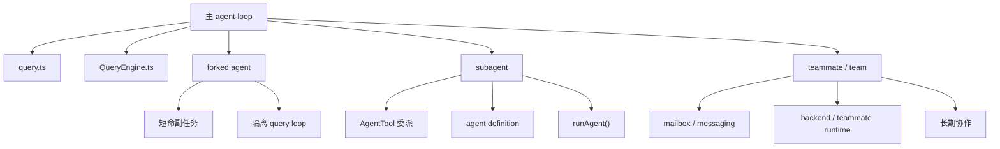
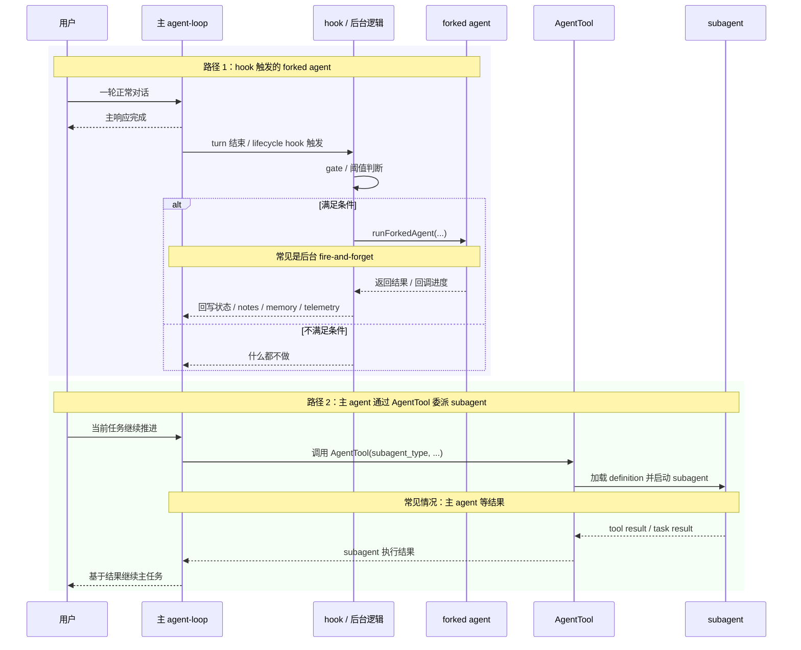
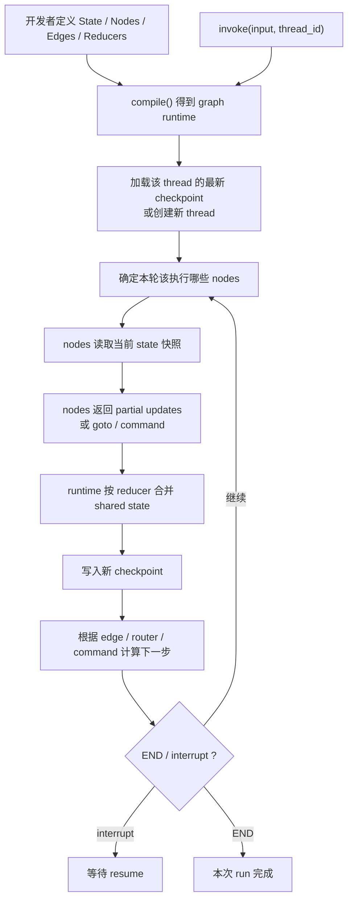
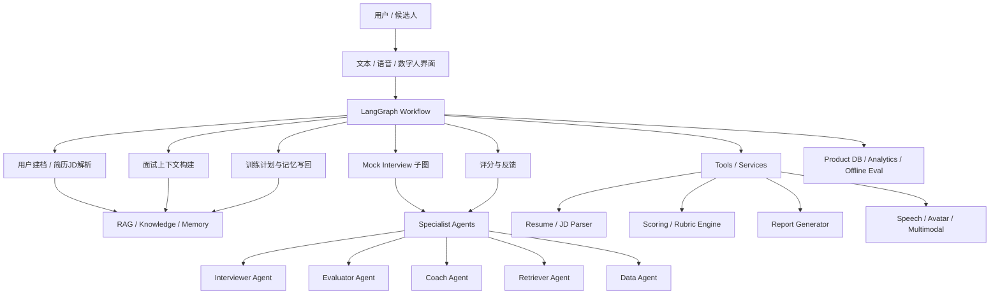
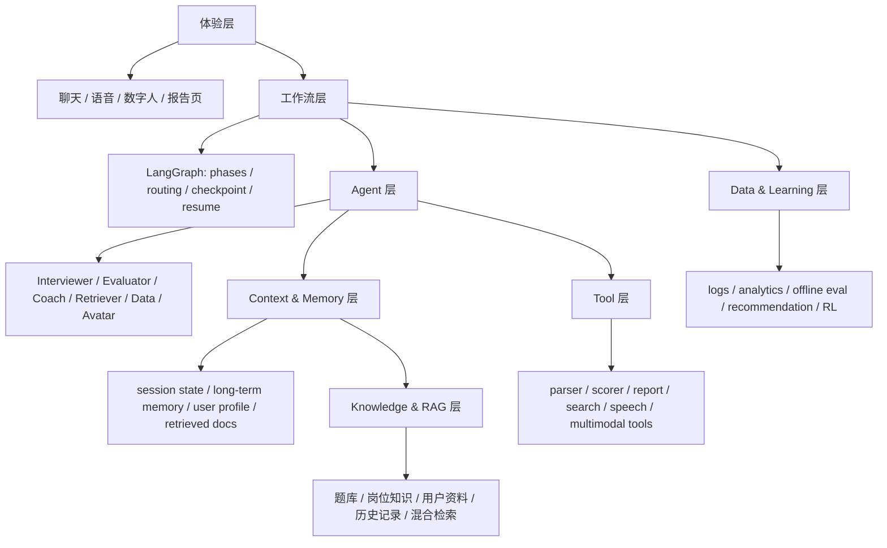

# Multi-Agent 架构深拆

## 模块定位

很多产品说自己有 multi-agent，实际上只是：

- 给模型几个不同 persona
- 或者让主模型生成一段“请另一个专家回答”的 prompt

Claude Code 明显不是这个层级。  
它的更准确描述是：

- **底座仍然是一个主 `agent-loop`**
- 但在这个主 loop 之上，又叠了一套可扩展的：
  - `forked agent`
  - `subagent`
  - `teammate / team`

所以 Claude Code 不是“没有 multi-agent，只是一个 loop”，也不是“一上来就是 swarm”。  
它更像：

- **一个主 agent-loop**
- **+ 一套逐层长出来的多代理运行时**

这也是这篇文档的主线。

---

## 核心源码边界

| 文件 | 责任 |
| --- | --- |
| `src/tools/AgentTool/AgentTool.tsx` | Agent 工具入口，负责 spawn、后台模式、隔离模式、队友模式 |
| `src/tools/AgentTool/runAgent.ts` | 子代理真实运行时 |
| `src/tools/AgentTool/forkSubagent.ts` | fork 子代理路径与特殊提示增强 |
| `src/tools/AgentTool/loadAgentsDir.ts` | Agent definition 发现与解析 |
| `src/utils/forkedAgent.ts` | cache-safe fork 上下文克隆与共享 |
| `src/tools/shared/spawnMultiAgent.ts` | 多 Agent / teammate 共享启动逻辑 |
| `src/tools/SendMessageTool/SendMessageTool.ts` | Agent 之间的消息协议入口 |
| `src/tasks/LocalAgentTask/*` | 本地后台代理任务 |
| `src/tasks/InProcessTeammateTask/*` | 进程内 teammate 任务 |
| `src/tasks/RemoteAgentTask/*` | 远程代理任务 |
| `src/utils/swarm/backends/*` | 多 Agent 后端注册与适配 |

---

## 一、Claude Code 到底有没有 Multi-Agent

### 1.1 它当然有一个主 `agent-loop`

Claude Code 的主执行底座仍然是：

- `query.ts`
- `QueryEngine.ts`

默认情况下，系统确实是一个主 agent 在循环：

- 接收用户输入
- 调模型
- 执行工具
- 进入下一轮

所以如果只看主执行内核，说它“有一个 agent-loop”是对的。

### 1.2 但它又明显不止一个主 loop

因为源码里还同时存在下面这些能力：

- `AgentTool` 可以显式拉起别的 agent
- `runAgent.ts` 会给子代理构造完整 runtime
- `forkedAgent.ts` 可以跑隔离的子 query loop
- `spawnMultiAgent.ts` 可以拉起 teammate / team
- `SendMessageTool` 可以让 agent 之间通信
- `LocalAgentTask` / `InProcessTeammateTask` / `RemoteAgentTask` 说明它们还有自己的生命周期

所以 Claude Code 的真实结构不是：

- “单 agent” vs “multi-agent” 二选一

而是：

- **单主 loop 为底座**
- **多代理能力作为扩展层挂在上面**

### 1.3 最短结论

一句话钉死：

**Claude Code 的默认执行形态是单主 agent-loop，但架构上确实有 multi-agent 系统；multi-agent 不是替代主 loop，而是建立在主 loop 之上的调度与协作层。**

---

## 二、总骨架：主 loop + `forked agent` + `subagent` + `teammate/team`



这三层不是互斥替代关系，而是分工不同：

| 层级 | 更像什么 | 主要目标 | 生命周期 |
| --- | --- | --- | --- |
| `forked agent` | 底层执行机制 | 跑一个隔离的短命副任务 | 短 |
| `subagent` | 正式任务代理 | 主 agent 把明确工作委派出去 | 一项任务内 |
| `teammate / team` | 多代理协作拓扑 | 多个 agent 持续协作、互发消息 | 更长 |

最短一句话记住：

- `forked agent`：怎么执行副任务
- `subagent`：把任务委派给谁
- `teammate / team`：多个 agent 怎么组织成长期协作结构

---

## 三、`forked agent`：短命、隔离、偏基础设施层的子 query loop

### 3.1 它是什么

`forked agent` 不是一种产品层 agent 角色，而更像：

- **底层执行机制**
- 用来临时拉起一个隔离的小 query loop
- 让它做某个副任务，做完就结束

入口是：

- `runForkedAgent(...)`
- `createSubagentContext(...)`

### 3.2 它解决的问题是什么

它主要解决的是：

- 怎么复用父线程的一部分上下文前缀
- 怎么在不污染主线程状态的前提下跑一个副任务
- 怎么让这条副任务仍然能吃到 prompt cache 的好处

所以它更关心：

- cache-safe params
- 状态克隆
- 子 query loop 生命周期

### 3.3 它典型用在哪

这一层更常见于：

- SessionMemory
- `extractMemories`
- `autoDream`
- Full Compaction 的某些 summary 路径
- 其它短命 side task

也就是说，它并不一定意味着“用户感知到一个新 agent”，很多时候只是系统内部为了做副任务临时 fork 一次。

### 3.4 它的生命周期是什么样

如果只抓主线，`forked agent` 的生命周期可以压成 5 步：

1. 主 loop 或某条 hook 发现需要一个子任务。
2. 调用方准备：
   - `cacheSafeParams`
   - `promptMessages`
   - `canUseTool`
3. `runForkedAgent(...)` 调 `createSubagentContext(...)`，造一个隔离子上下文。
4. 子 `query(...)` 跑完一条短命任务。
5. 结果通过返回值或 `onMessage` 回到调用方，fork 结束。

这里最关键的一点是：`forked agent` 不是长期常驻的小 agent，也不是主 loop 旁边另一条持久主线；它更像主 loop 在某个时刻临时拉起的一条隔离子 `query(...)`。

### 3.5 它是在什么时候、怎么被主 loop 拉起来的

常见有两类启动语义：

#### 3.5.1 turn 结束后的后台触发

这类 forked agent 常见于：

- `extractMemories`
- `autoDream`
- `SessionMemory`

典型链路是：

- 主 loop 一轮响应结束
- `stopHooks` 或 `post-sampling hook` 触发后台逻辑
- 后台逻辑做 gate / 阈值判断
- 满足条件后才 `runForkedAgent(...)`

对应源码：

- `src/query/stopHooks.ts`
- `src/services/extractMemories/extractMemories.ts`
- `src/services/autoDream/autoDream.ts`
- `src/services/SessionMemory/sessionMemory.ts`

这一类从主会话视角看是“异步后台任务”：主线程不会停在这里等它跑完。

#### 3.5.2 当前主链里的同步触发

这类 forked agent 常见于：

- Full Compaction 生成 compact summary
- `sideQuestion`

典型链路是：

- 主 loop 正在执行当前任务
- 某一步明确需要一条子 query loop
- 直接 `await runForkedAgent(...)`
- 不等它结束，主链不能继续

对应源码：

- `src/services/compact/compact.ts`
- `src/utils/sideQuestion.ts`

这一类从主会话视角看不是“后台 housekeeping”，而是当前步骤的同步依赖。

### 3.6 它是怎么被拉起来的

真正的底层入口是：

- `src/utils/forkedAgent.ts` 里的 `runForkedAgent(...)`

这个 helper 主要做四件事：

1. 接收父线程给它的 `cacheSafeParams`
2. 调 `createSubagentContext(...)` 造一个隔离的子 `ToolUseContext`
3. 组装子请求的消息：
   - `initialMessages = [...forkContextMessages, ...promptMessages]`
4. 真正调用 `query(...)` 跑一条子 query loop

所以它不是“另一个特殊模型模式”，本质上还是重新跑一次 `query(...)`；只是上下文和权限是专门收紧过的。

#### 3.6.1 什么叫“隔离 query loop”

这里说的“隔离 query loop”，不是说它换了一套完全不同的推理引擎，而是说：

- 它仍然调用同一个 `query(...)`
- 但跑在一个专门为子任务克隆出来的 `ToolUseContext` 里
- 默认不会直接复用主 loop 那些正在不断变化的可变运行时状态

这层隔离主要由 `createSubagentContext(...)` 完成。它会默认：

- 克隆 `readFileState`
- 克隆 `contentReplacementState`
- 重置 `loadedNestedMemoryPaths`、`nestedMemoryAttachmentTriggers`、`dynamicSkillDirTriggers`
- 创建新的 child `AbortController`
- 生成新的 `agentId`、`queryTracking.chainId`、更深的 `depth`
- 默认把某些会直接改主线程 UI / app state 的回调收紧或置空

所以“隔离”的重点不是“消息完全不共享”，而是：

- **共享父线程的 cache-safe 前缀骨架**
- **隔离父线程的 mutable runtime state**

这也是为什么 `forked agent` 适合做：

- SessionMemory
- `extractMemories`
- `autoDream`
- compact summary

这类“需要借用主线程上下文，但又不能污染主线程状态”的副任务。

#### 3.6.2 它的上下文是怎么构建的

`forked agent` 的上下文，不是只靠一条 prompt 拼出来的。更准确地说，可以拆成四层：

| 输入层 | 典型内容 | 作用 |
| --- | --- | --- |
| cache-safe 骨架 | `systemPrompt`、`userContext`、`systemContext`、`toolUseContext`、`forkContextMessages` | 让子任务继承父线程的 system / tools / thinking / messages 前缀 |
| 子任务 prompt | `promptMessages` | 告诉这次 fork 到底要做什么 |
| 工具边界 | `canUseTool` | 限制这次 fork 允许调用哪些工具 |
| 子上下文覆写 | `overrides` | 允许个别场景共享或替换部分隔离状态 |

其中最关键的两段是：

##### A. `cacheSafeParams`

它来自父线程，典型由：

- `createCacheSafeParams(context)`

打包出来，里面会放：

- `systemPrompt`
- `userContext`
- `systemContext`
- `toolUseContext`
- `forkContextMessages`

它的作用不是“直接拼成一段文本”，而是把这次子任务需要继承的父线程前缀骨架带下来。

##### B. `promptMessages`

这是这次 forked agent 自己的新任务说明。  
例如：

- SessionMemory 的“更新 notes 文件” prompt
- `extractMemories` 的“memory extraction subagent” prompt
- Full Compaction 的 summary request
- `autoDream` 的 consolidation prompt

最终在消息侧，`runForkedAgent(...)` 会组出：

```ts
initialMessages = [...forkContextMessages, ...promptMessages]
```

也就是说：

- 前半段是父线程继承下来的消息前缀
- 后半段才是这次子任务新增的 prompt

但要注意，`systemPrompt / userContext / systemContext / toolUseContext` 并不会被简单拼进 `messages` 数组；它们仍然作为 `query(...)` 的独立参数通道传进去。

##### C. `canUseTool`

这里也特别容易误解。`canUseTool` 不是一个 tool，也不是 LLM 能直接调用的函数；它更像这次 forked agent 的**运行时工具权限守门员**。

可以把这几层分清：

- tools schema
  - 告诉模型“理论上有哪些工具存在”
- prompt 约束
  - 告诉模型“这次最好怎么用工具，或不要用工具”
- `canUseTool`
  - 真正决定“模型一旦发出 `tool_use`，runtime 到底让不让它执行”

所以流程不是“LLM 调用 `canUseTool`”，而是：

1. LLM 先基于 system prompt、messages、tools schema 输出一个 `tool_use`
2. runtime 收到这个 `tool_use`
3. runtime 调 `canUseTool(tool, input)` 做审查
4. 允许了才真正执行 `tool.call(...)`

这也是为什么不同 forked agent 会传不同的 `canUseTool`：

- Full Compaction 用 `createCompactCanUseTool()`
  - 直接拒绝所有工具，只允许产出文本 summary
- `extractMemories` / `autoDream` 用 `createAutoMemCanUseTool(memoryDir)`
  - 只允许只读工具、只读 Bash，以及 memory 目录内的 `Edit/Write`
- SessionMemory 用 `createMemoryFileCanUseTool(memoryPath)`
  - 只允许编辑那一个 notes 文件

因此，`canUseTool` 虽然也属于这次 fork 的“输入”，但它不是语义上下文，而是执行上下文的一部分：它定义的是这条子 query loop 的 runtime 权限边界。

### 3.6.3 为什么它看起来会带一点“对子任务并非绝对必要”的上下文

这是 `forked agent` 的一个工程权衡。

为了尽量复用父线程的 Prompt Cache，子任务通常会尽量继承：

- 广义 system prompt
- tools
- thinkingConfig 相关参数
- messages 前缀

这意味着对子任务来说，输入里有时会带上一点“不完全必要、但有利于 cache hit”的前缀骨架。

所以 `forked agent` 的目标不是“把子任务上下文压到理论最小”，而更像：

- **宁可多带一点 cache-safe 前缀**
- **也尽量吃到主线程刚刚形成的 prompt cache**

这也是为什么 `extractMemories` 这类轻量、频繁、贴着最近增量工作的 fork 很适合走这条路；而 Full Compaction 虽然也优先尝试 cache-sharing fork，但在必要时会为了正确性和可控性接受 fallback。

### 3.7 它是怎么和主 Agent 通信的

`forked agent` 和主 agent 的通信，通常不是 mailbox / sendMessage 这种“对话式通信”，而更像函数调用式通信。

最常见有两种方式：

#### 3.7.1 直接返回结果

`runForkedAgent(...)` 跑完后直接返回：

- `messages`
- `totalUsage`

调用方再自己处理这些结果。

例如：

- compact 路径会取最后一条 assistant summary
- `extractMemories` 会解析它写了哪些 memory 文件

#### 3.7.2 运行中通过 `onMessage` 回调上报

少数场景会传：

- `onMessage`

例如 `autoDream` 会边跑边把 assistant 输出映射成 DreamTask 进度。这里仍然不是 agent 间互发消息，而是：

- 子 loop 把流式消息回调给调用方
- 调用方据此更新主线程 UI / 任务状态

所以更准确地说，`forked agent` 和主 agent 的通信主要是：

- 返回值
- 回调

而不是团队协作层的 mailbox 协议。

### 3.8 它和 `teammate / team` 最大的区别

`forked agent`：

- 短命
- 任务型
- 返回值 / 回调通信
- 没有 mailbox 协议

`teammate / team`：

- 生命周期更长
- 有 team context / mailbox
- 可以互发消息
- 更像真正的多 agent 协作

所以如果把两者混在一起，最容易误以为 Claude Code 的所有“子 agent”都在互相聊天。其实 `forked agent` 更接近“临时助手”，而 `teammate / team` 才更接近“长期队友”。

### 3.9 一句话总结

**`forked agent` 更像多代理运行时里的“基础设施层执行器”：主 loop 在需要时临时拉起一条隔离子 `query(...)`，通过返回值或回调收结果，而不是和它长期对话。**

---

## 两种“主 agent 拉起另一个 agent 去做事”的链路有什么不同

前面单看 `forked agent` 和后面单看 `subagent` 都容易懂，但真正容易混的地方其实是：

- `hook` 触发的 `forked agent`
- 主 agent 通过 `AgentTool` 委派 `subagent`

它们表面上都像：

- 主 agent 又拉起了另一个 agent 去做事

但运行语义并不一样。

### 3.10 `hook` 到底是什么

这里的 `hook` 更像：

- 某个固定生命周期节点上的回调插槽

比如：

- 一轮模型响应结束后
- session start 时
- compact 后

系统会在这些时机自动执行一段附加逻辑。

所以它不是“消息队列本身”，更准确地说是：

- 主流程先发生一个生命周期事件
- 然后把某些后台逻辑挂在这个事件上

如果一定要类比，它有一点像“事件触发后异步投递一个后台任务”，但源码语义上更接近：

- lifecycle callback
- hook callback

而不是一套完整的队列系统。

### 3.11 两条链并排看



### 3.12 它们最本质的区别

#### 3.12.1 谁触发

`hook` 触发的 `forked agent`：

- 系统在某个生命周期节点上顺手触发
- 常见于：
  - `post-sampling hook`
  - `stopHooks`
  - housekeeping / turn-end 维护逻辑

`AgentTool` 委派的 `subagent`：

- 主 agent 当前就在做任务
- 它自己判断这件事适合委派
- 然后显式调用 `AgentTool`

所以最短可以记成：

- hook-fork：系统自己顺手触发
- `AgentTool`-subagent：主 agent 主动调度

#### 3.12.2 主链是否依赖结果

`hook` 触发的 `forked agent`：

- 常见是不阻塞主 agent
- 主响应已经完成
- 后台维护逻辑 fire-and-forget 地继续跑

但要注意：

- 这只是 hook 触发那一类 `forked agent` 的常见语义
- 不是所有 `forked agent` 都异步
- Full Compaction 那类 `forked agent` 仍然可能在主链里被 `await`

`AgentTool` 委派的 `subagent`：

- 常见情况是主 agent 会等它的结果
- 然后基于 tool result / task result 继续下一步

但它同样也有例外：

- `subagent` 支持 `run_in_background`
- 这时主 agent 也可以不在当前 turn 里同步等待

所以更精确的说法是：

- hook 型 `forked agent` 常见偏后台维护
- plain `subagent` 常见偏同步委派
- 两者都存在“可以不等结果”的变体，但默认语义不同

#### 3.12.3 它们在系统里被当成什么对象

`forked agent`：

- 更像一个短命的隔离子 `query(...)`
- 重点是“怎么执行一个副任务”
- 常见用于：
  - SessionMemory
  - `extractMemories`
  - `autoDream`
  - compact summary

`subagent`：

- 更像一个正式任务代理
- 重点是“把哪项工作委派给哪个专员”
- 常见用于：
  - 通用研究
  - 规划
  - 验证
  - 文档顾问
  - 状态栏配置等明确职责

#### 3.12.4 它们怎么和主 agent 通信

`forked agent` 更常见的是：

- 返回值
- `onMessage` 回调

更像函数调用式通信。

`subagent` 更常见的是：

- `AgentTool` 的 tool result
- task 状态
- background completion 通知

如果再进入 `teammate / team` 模式，通信才会上升到：

- mailbox
- `SendMessageTool`
- team context

### 3.13 一句话钉死

**`hook` 触发的 `forked agent` 更像系统挂在生命周期节点上的后台维护任务；主 agent 通过 `AgentTool` 委派的 `subagent` 更像当前任务里的正式分工。前者常见不阻塞主链，后者常见会等结果回来，但两者都存在例外。**

---

## 四、`subagent`：主 agent 通过 `AgentTool` 委派出去的任务代理

### 4.1 `subagent` 和 `forked agent` 的区别

两者之所以容易混，是因为它们确实有一层“表面相似性”：

- 都不是主 loop 本体
- 都会跑一条子 `query(...)`
- 都有自己的上下文、工具边界和生命周期
- 都可能和主线程隔离状态
- 跑完后都要把结果回给主 agent

所以从运行表现上看，它们都会像“主 agent 拉起了另一个 agent 去做事”。

但真正的分水岭不在“会不会拉起子 loop”，而在“系统把它当成什么层级的对象”。

`subagent` 不是在回答“怎么 fork 一条 query loop”，而是在回答：

- 主 agent 怎么把一个明确任务交给另一个 agent 去做

所以它更强调：

- agent definition
- 任务描述
- 能力面
- 生命周期
- 结果怎么回给主 agent

所以两者虽然最后都可能表现成“主 agent 拉起另一个 agent 去做事”，但层级不同：

- `forked agent` 偏基础设施层
- `subagent` 偏任务委派层

可以把这个区别压成一句话：

- `forked agent` 回答的是：**怎么临时执行一个隔离副任务**
- `subagent` 回答的是：**主 agent 怎么把正式工作委派给另一个具备独立身份的 agent**

### 4.2 它的生命周期是什么样

如果按和 `forked agent` 一样的方式去看，`subagent` 的生命周期也可以压成 5 步：

1. 主 agent 决定把一项明确工作委派出去。
2. `AgentTool` 解析输入，确定：
   - `subagent_type`
   - `run_in_background`
   - `team_name`
   - `isolation`
   - `cwd`
3. 系统加载这个 agent 的 definition，并据此构建它自己的 runtime。
4. `runAgent.ts` 真正跑起这条子代理 query loop。
5. 结果通过 tool result、任务状态或后台完成通知回到主 agent。

所以 `subagent` 不是“系统顺手做个副任务”，而是“主 agent 正式把一项工作派给另一个具备独立身份的 agent”。

### 4.3 它是在什么时候、怎么被主 agent 拉起来的

`subagent` 的典型触发点不是 hook，而是主 agent 自己使用：

- `AgentTool`

也就是说，它的触发语义通常是：

- 主 agent 当前正在做任务
- 它判断这件事适合委派
- 于是显式发起一次 agent spawn

这和 `forked agent` 很不同：

- `forked agent` 常常由 stopHooks / post-sampling hook / side task helper 拉起
- `subagent` 更像主 agent 在当前工作流里主动做出的调度决策

在 `AgentTool.tsx` 里，这次委派会带上丰富的参数面，例如：

- `subagent_type`
- `model`
- `run_in_background`
- `team_name`
- `mode`
- `isolation`
- `cwd`

这说明它不是单一 spawn 路径，而是一个真正的代理调度入口。

### 4.4 `loadAgentsDir.ts`：Agent 是声明式定义，不是硬编码人格

这个模块决定了 Claude Code 的 multi-agent 为什么“像系统”，而不只是 prompt 技巧。

它解析的 agent 定义字段很多，包括：

- `tools`
- `disallowedTools`
- `prompt`
- `model`
- `effort`
- `permissionMode`
- `mcpServers`
- `hooks`
- `maxTurns`
- `skills`
- `initialPrompt`
- `memory`
- `background`
- `isolation`

这意味着一个 agent 定义不是一句“你是某某专家”，而是一个完整运行单元的声明：

- 它用什么工具
- 它能不能后台运行
- 它有没有自己的 MCP 服务器
- 它有没有自己的技能包
- 它的权限模式是什么
- 它是否拥有独立记忆

这已经是 runtime spec 级别，而不是 prompt persona 级别。

#### 4.4.1 普通 `subagent` 是怎么加载 `agent definition` 的

这条链其实很直接，不是“主 agent 临时拼一段 prompt”，而是：

1. `AgentTool` 先读输入里的 `subagent_type`
2. 如果用户没显式给类型，而且当前不是 fork path，就默认落到 `general-purpose`
3. 然后到 `toolUseContext.options.agentDefinitions.activeAgents` 里找同名 `agentType`
4. 找到后把这份 `selectedAgent` 直接传给 `runAgent({ agentDefinition: selectedAgent, ... })`

也就是说，普通 `subagent` 的启动心智模型其实很简单：

- 先从 `activeAgents` 里选中一份正式 `AgentDefinition`
- 再按这份 definition 去启动一个任务代理

这也是为什么 `subagent` 和 `forked agent` 不一样：

- `forked agent` 更像“继承父线程前缀，再补一个窄任务 prompt”
- 普通 `subagent` 更像“先选中一个声明式代理规格，再让它接任务”

源码主链就在：

- `src/tools/AgentTool/AgentTool.tsx`
  - `effectiveType`
  - `activeAgents.find(...)`
  - `selectedAgent = found`
  - `runAgent({ agentDefinition: selectedAgent, ... })`

#### 4.4.2 `AgentDefinition` 里到底有什么，它是定义好的吗

对，`AgentDefinition` 是预先定义好的，但不是只有一种来源。

在 `loadAgentsDir.ts` 里，Claude Code 先定义了 `BaseAgentDefinition`，再把它扩成三类：

- `BuiltInAgentDefinition`
- `CustomAgentDefinition`
- `PluginAgentDefinition`

然后把它们合成统一的 `AgentDefinition` 联合类型。

所以这里的“定义好”更准确地说是：

- 不是主 agent 每次临场凭空发明一个人格
- 而是系统先加载一批正式 agent 定义
- 再在运行时合并成 `allAgents / activeAgents`
- 主 agent 只是在这一批已声明的代理里选一个来委派

这些 definition 里真正定义的，不只是 prompt，而是整套运行规格。比较关键的字段包括：

- `agentType`
- `whenToUse`
- `tools`
- `disallowedTools`
- `skills`
- `mcpServers`
- `hooks`
- `color`
- `model`
- `effort`
- `permissionMode`
- `maxTurns`
- `background`
- `initialPrompt`
- `memory`
- `isolation`
- `omitClaudeMd`
- `requiredMcpServers`

还有一个很关键但容易忽略的点：

- 这三类 agent 都有 `getSystemPrompt(...)`
- 也就是说，system prompt 只是 definition 的一部分
- 不是 definition 的全部

从加载顺序看，`loadAgentsDir.ts` 最后会把多种来源合并进来，例如：

- built-in agents
- plugin agents
- user settings agents
- project settings agents
- policy settings agents
- flag settings agents

然后再通过 `getActiveAgentsFromList(...)` 做一轮优先级覆盖和去重。

所以一句话钉死：

**普通 `subagent` 不是主 agent 临时“造”出来的，而是从系统预先加载好的 `activeAgents` 里挑出一份 `AgentDefinition`，再按这份声明式规格启动。**

#### 4.4.3 先把四个概念拆开：`AgentDefinition`、`loadAgentsDir`、`AgentTool`、`runAgent`

`subagent` 这一块最容易看乱，是因为这四个名字不在同一层：

- `AgentDefinition`
  - 是规格书
  - 描述“某类 subagent 应该长什么样”
- `loadAgentsDir`
  - 是规格书加载器
  - 负责把各种来源的 agent 定义收集成 `allAgents / activeAgents`
- `AgentTool`
  - 是主 agent 的委派入口
  - 负责在当前任务里选中一个 definition，并整理启动参数
- `runAgent`
  - 是真正的 subagent runtime 启动器
  - 负责把选中的 definition 变成一个活着的子代理

所以最短可以记成：

- `AgentDefinition` = 规格书
- `loadAgentsDir` = 装配规格书
- `AgentTool` = 选择并发起委派
- `runAgent` = 按规格书真正跑起来

如果把这四层混在一起，就很容易把：

- “系统里有哪些 subagent 可选”
- “当前这次任务到底选哪个”
- “这个 subagent 实际看到什么上下文”

三件事看成同一件事。

#### 4.4.4 这套流程的完整时序：先构建 definition 池，再构建一次运行实例

如果顺着源码主线看，`subagent` 的完整链路其实可以拆成 6 步：

##### 第 1 步：系统先准备好可选 agent 列表

这一步发生在更早的阶段，不是用户刚提任务时才现做。

`loadAgentsDir.ts` 会先把各种来源的 agent definitions 收集起来，形成：

- `allAgents`
- `activeAgents`

这时系统只是知道：

- “有哪些 subagent 可选”

还没决定用谁。

##### 第 2 步：主 agent 在当前任务里决定要委派

用户现在提了个复杂任务，主 agent 判断：

- 这事适合交给 `general-purpose`
- 或 `Plan`
- 或 `statusline-setup`
- 等等

这时主 agent 调 `AgentTool`。

##### 第 3 步：`AgentTool` 从 `activeAgents` 里选中一个 definition

这是最关键的选择点。

它大致做的是：

1. 读 `subagent_type`
2. 算 `effectiveType`
3. 去 `toolUseContext.options.agentDefinitions.activeAgents` 里找
4. 找到 `selectedAgent`

所以这一步的结果是：

- **从一堆可选规格书里，选中一份具体规格书**

##### 第 4 步：`AgentTool` 做启动前裁决和参数整理

选到 `selectedAgent` 以后，还不能立刻跑。

它还会处理：

- permission deny rules
- `requiredMcpServers`
- `selectedAgent.background`
- `selectedAgent.isolation`
- `model` 覆盖关系
- worker tool pool
- 是否 background / worktree / remote

所以这一层相当于：

- **把“选中的规格书”转成“这次调用的实际运行参数”**

##### 第 5 步：`runAgent` 把 definition 实体化成 runtime

这一步才真正进入“subagent 上下文和运行时构建”。

它会基于 `selectedAgent`：

- 确定 `resolvedAgentModel`
- 生成 `agentSystemPrompt`
- 取 `getUserContext()` / `getSystemContext()`
- 应用 `permissionMode`
- 解析 `tools / disallowedTools`
- 预加载 `skills`
- 注册 `hooks`
- 初始化 agent-specific MCP
- 处理 `memory`
- 组织 `initialMessages`

这时 subagent 才真正“活起来”。

##### 第 6 步：最后跑 `query(...)`

`runAgent` 底层还是会走到：

- `query(...)`

所以最终你看到的 subagent，本质上也是一条子 agent loop。

只是这条 loop：

- 不是直接继承父线程前缀的 fork
- 而是先按 `AgentDefinition` 搭好独立身份和能力面，再跑起来

##### 为什么这块容易看乱

因为这里其实有两次“构建”：

- 第一次构建：构建“可选代理集合”
  - 这是 `loadAgentsDir.ts` 在做的
  - 它解决的是“系统里有哪些 agent、每个 agent 的规格是什么”
- 第二次构建：构建“这次被选中的 subagent 运行时”
  - 这是 `AgentTool -> runAgent` 在做的
  - 它解决的是“当前这次任务具体选哪一个 agent、用什么参数启动、它这次实际看到什么上下文”

所以不是一个“构建过程”，而是两层：

- **先构建 definition 池**
- **再构建某个 definition 的一次运行实例**

### 4.5 `subagent` 的上下文和运行时：从 `selectedAgent` 到运行实例

这一节开始，不再把 `loadAgentsDir`、`AgentTool`、`runAgent` 混成一个黑盒，而是只盯着一件事：

- 在 `AgentTool` 已经选中了 `selectedAgent` 之后
- 这份声明式 `AgentDefinition`
- 是怎么一步步变成一个真正运行中的 subagent 实例的

最短心智模型是：

- `loadAgentsDir` 负责“先把可选 definition 池准备好”
- `AgentTool` 负责“这次任务选中哪一个 definition，并整理启动参数”
- `runAgent` 负责“把这个 `selectedAgent` 真正跑起来”

所以这里讲的“上下文和运行时构建”，指的不是 definition 池的构建，而是：

- **某个已选中的 `selectedAgent`，如何被实体化成一次运行实例**

这里是 `subagent` 和 `forked agent` 差异最大的地方。

`forked agent` 的上下文重点是：

- 继承父线程 cache-safe 前缀
- 再补一个窄任务 prompt

而 `subagent` 的重点是：

- 先把“这个 agent 是谁”构建完整
- 再把任务交给它

在源码里，这条链主要落在：

- `loadAgentsDir.ts`
- `runAgent.ts`

`runAgent.ts` 负责给 subagent 准备：

- agent-specific system prompt
- agent 自己的 tools / disallowedTools
- model / effort / permission mode
- hooks / skills
- agent memory
- agent-specific MCP servers
- `background` / `worktree` / `cwd` 等运行方式

也就是说，`subagent` 不是把主 agent prompt 稍微改改，而是按 agent definition 搭起一套独立身份和能力面，再用这套 runtime 去跑一条子 query loop。

### 4.6 `AgentTool.tsx`：委派入口如何选择、裁决并组织启动参数

这一节的重点，不是再重复“系统里有哪些 agent”，而是说明：

- 主 agent 当前这次决定委派时
- `AgentTool` 怎么从 `activeAgents` 里选中一个 `selectedAgent`
- 又怎么把它变成适合这次调用的实际启动参数

所以可以把 `AgentTool` 理解成：

- **definition 选择器**
- **启动前裁决器**
- **运行参数组织器**

`AgentTool` 是主 agent 调度子代理的入口。  
从输入 schema 就能看出它支持的模式很多：

- `subagent_type`
- `model`
- `run_in_background`
- `name`
- `team_name`
- `mode`
- `isolation`
- `cwd`

它支持的不是单一路径，而是多个 spawn 形态：

- 普通同步子代理
- 后台子代理
- worktree 隔离子代理
- remote agent
- teammate / team spawn
- fork-subagent 模式

这说明 `AgentTool` 在系统里的角色不是一个小工具，而是：

- **代理运行时入口**

更准确地说，它其实是一把**共用的委派入口**：

- 普通 `subagent`
- `teammate / team`

都先经过同一个 `AgentTool` surface。

但它不是“同一套参数原样往下传”，而是在 `call()` 里分成了两条不同分支：

#### 4.6.1 同一把 `AgentTool`，两条不同分支

第一条是普通 `subagent` 分支：

- 主 LLM提供：
  - `description`
  - `prompt`
  - `subagent_type`
  - 可选的 `model / run_in_background / isolation / cwd`
- `AgentTool` 先从 `activeAgents` 里选中 `selectedAgent`
- 再做 deny / MCP / background / isolation 等裁决
- 最后走：
  - `selectedAgent -> runAgent(...)`

第二条是 `teammate / team` 分支：

- 主 LLM除了 `prompt` 和可选的 `subagent_type` 之外，还会提供：
  - `name`
  - `team_name`
  - 可选的 `mode`
- `AgentTool` 先根据参数和当前 `AppState.teamContext` 解析出 `teamName`
- 只要同时满足：
  - `teamName`
  - `name`
- 就不会再走普通 `selectedAgent -> runAgent(...)`
- 而是直接转去：
  - `spawnTeammate(...)`

所以它不是“两把不同工具”：

- **普通委派** 和 **team 招人**
- 共用同一把 `AgentTool`
- 只是内部在 `call()` 里按参数分流

最短可以记成：

- `subagent`：`AgentTool -> selectedAgent -> runAgent(...)`
- `teammate`：`AgentTool -> team_name + name -> spawnTeammate(...)`

这也是为什么 `AgentTool` 的输入 schema 里会同时出现两类字段：

- 普通委派字段：
  - `subagent_type`
  - `model`
  - `run_in_background`
  - `isolation`
  - `cwd`
- team 招人字段：
  - `name`
  - `team_name`
  - `mode`

前者主要在教主 LLM“怎么做一次正式任务委派”，后者则是在教主 LLM“怎么把一个 agent 作为 teammate 拉进 team”。

#### 4.6.2 它为什么像“多代理调度入口”

因为 `AgentTool` 不只是决定“选哪个 agent”，它还会在真正启动前把几类关键约束一起裁决掉：

- 这个 agent definition 在当前权限模式下能不能用
- 所需 MCP servers 是否满足
- 要不要 background
- 能不能开 `worktree`
- 当前上下文里 team 参数是否可用

例如：

- teammate 不能继续 spawn teammate
- in-process teammate 不能再起 background subagent
- team 模式下只要 `team_name + name` 同时出现，就会改走 `spawnTeammate(...)`

所以 `AgentTool` 在系统里的真实角色更像：

- **统一入口**
- **分支选择器**
- **启动前裁决器**
- **参数组织器**

#### 4.6.3 为什么 `AgentTool` 本身通常要 upfront，而不是 deferred

这里和 team workflow tools 有一个很重要的加载差异：

- `AgentTool` 本身更像主 agent 的基础委派入口
- team workflow tools 更像一组场景化协作工具

所以从加载策略看，二者并不对称。

`AgentTool` 之所以通常要 upfront，核心原因有三层：

1. 主 agent 很可能在首轮就需要做正式委派  
   如果连 `AgentTool` 本身都要先靠一轮 `ToolSearch` 才能拿到，主 loop 做多代理分流的延迟就会明显增加。

2. 它是多条委派分支共用的入口  
   普通 `subagent`、后台代理、worktree 代理、team 招人，入口都先经过它。

3. 源码里对它有明确的“不要放到 ToolSearch 后面”的倾向  
   `isDeferredTool(...)` 对某些必须 turn 1 可见的工具会显式排除，`AgentTool` 就属于这种“在特定分支实验里必须首轮可见”的核心入口思路。

所以更准确地说：

- **`AgentTool` 是主 agent 的 delegation primitive**
- **不是一把偶尔才发现的 workflow accessory**

这也是为什么前面我们会把它归到更像 `non-deferred tools` 的一侧。

### 4.7 `runAgent.ts`：如何把 `selectedAgent` 实体化成真正运行的 subagent

如果说 `AgentTool` 负责“选中谁、怎么派”，那 `runAgent.ts` 负责的就是：

- 让这个 `selectedAgent` 真正长出自己的 system prompt
- 长出自己的 tools / permission / hooks / skills / memory / MCP
- 长出自己的 `initialMessages`
- 最后进入一条真正的子 `query(...)` loop

所以它不是一个薄薄的 prompt wrapper，而是：

- **subagent runtime 的实体化器**

这个文件几乎可以看成“主 loop 的子代理版启动器”。

它负责：

- 初始化 agent-specific MCP servers
- 解析 model / permission mode
- 构建 agent 专属 system prompt
- 预加载 hooks 和 skills
- 合并 agent 的工具池
- 创建 subagent context
- 调用主 `query(...)`
- 清理任务、缓存、MCP 连接和 shell 资源

这说明子代理并不是一个轻量 prompt 分支，而是：

- **重用主执行引擎的完整 runtime**

也就是说：

- 主代理和子代理共享同一套 loop 内核
- 差异来自上下文、工具集、MCP、权限和任务承载方式

### 4.8 它是怎么和主 agent 通信的

plain `subagent` 最常见的回传方式，不是 mailbox，而是：

- `AgentTool` 的 tool result
- 任务状态回传
- 后台完成后的通知 / 汇总结果

也就是说，主 agent 最常见的体验是：

- 我把工作委派出去
- 然后拿到一份结果、状态或完成通知

只有当它进一步进入 teammate / team 模式时，通信才会升级成：

- mailbox
- `SendMessageTool`
- team context

所以不能把所有 `subagent` 都想成“在和主 agent 发消息聊天”；很多 `subagent` 的通信形态仍然更接近“委派任务 -> 等结果回来”。

### 4.9 worktree 隔离：不只是 prompt 隔离，而是工作目录隔离

`AgentTool.tsx` 里对 `isolation: 'worktree'` 做了完整处理：

- 创建独立 worktree
- 必要时向 fork child 注入路径转换 notice
- 在 agent 完成后检查 worktree 是否有变化
- 无变化时自动清理
- 有变化时保留并记录路径信息

这意味着：

- 子代理可以在独立副本中修改代码
- 不直接污染主工作树
- 适合方案试验、并行改动、风险隔离

这已经非常贴近真实工程协作。

### 4.10 background tasks：子代理能脱离当前 turn 继续活着

`AgentTool` 对 `run_in_background` 的支持，使得子代理不再被绑定在当前同步对话里。

这会带来几种能力：

- 长耗时任务可异步进行
- 主 agent 可以继续做别的事
- 完成后再通过通知或消息回收结果

从任务目录结构也能看出来，系统把后台代理视为一种独立生命周期对象，而不是“当前函数里的异步 Promise”。

### 4.11 Claude Code 内置 subagent 场景总览

前面讲的是抽象机制，这里落到更具体的 built-in subagent 场景。

先给结论：

- Claude Code 的架构里，确实准备了多类正式 `subagent`
- 但“架构上存在”和“当前这个逆向 build 里大概率会自然启用”不是一回事

这是因为 `src/tools/AgentTool/builtInAgents.ts` 里有多层 gate：

- `general-purpose`
- `statusline-setup`
- `claude-code-guide`
  - 这三类更容易在当前 build 里出现
- `Explore`
- `Plan`
- `verification`
  - 这三类在架构里明确存在，但在当前 build 里大概率默认不开

#### 4.11.1 先看总表

| agent type | 典型任务 | 只读/可写 | 是否后台 | 当前 build 大概率可用 |
| --- | --- | --- | --- | --- |
| `general-purpose` | 通用研究、复杂搜索、多步执行 | 可写 | 否 | 是 |
| `statusline-setup` | 配置状态栏、改 `~/.claude/settings.json` | 可写 | 否 | 是 |
| `claude-code-guide` | 回答 Claude Code / Agent SDK / Claude API 使用问题 | 只读为主 | 否 | 是 |
| `Explore` | 代码库搜索、文件定位、实现追踪 | 只读 | 否 | 否 |
| `Plan` | 复杂任务前做实现规划 | 只读 | 否 | 否 |
| `verification` | 独立验证实现结果 | 只读为主 | 是 | 否 |

这里的“当前 build 大概率可用”指的是：

- `builtInAgents.ts` 会不会把它们默认塞进 active built-ins
- 当前逆向 build 里 `feature()` 被 polyfill 成恒为 `false` 后，它们还能不能自然进入主流程

#### 4.11.2 `general-purpose`

这是默认通用专员，也是最像“主 agent 把一项正式工作委派出去”的常规 `subagent`。

典型任务：

- 让另一个 agent 去做复杂代码调查
- 让另一个 agent 去跨很多文件搜索实现线索
- 让另一个 agent 去完成一项不适合主 agent 亲自展开的多步任务

关键字段：

- `agentType = "general-purpose"`
- `whenToUse`
  - 复杂问题调研
  - 大代码库搜索
  - 多步任务执行
- `tools = ['*']`
- `model`
  - 没有显式写死，注释说明默认走 `getDefaultSubagentModel()`
- `permissionMode / memory / isolation / background`
  - 都没有显式声明

它的 system prompt 主旨也很直白：

- 你是 Claude Code 的通用代理
- 擅长跨大量文件搜索、理解架构、做多步研究
- 完成后给调用方一份简洁报告
- 不要主动创建无关文件，更不要主动创建文档文件

完整 prompt 源码位置：

- `src/tools/AgentTool/built-in/generalPurposeAgent.ts`

这也是为什么说它是最典型的“正式任务委派型 `subagent`”：

- 它不是系统内部顺手做个 side task
- 而是主 agent 明确地把一项正式工作交给一个具备独立身份的代理去做

#### 4.11.3 `statusline-setup`

这是当前 build 里最具体、最不抽象的内置 `subagent` 场景。

典型任务：

- 把用户 shell 里的 `PS1` 转成 Claude Code 的 `statusLine`
- 新建或更新状态栏脚本
- 修改 `~/.claude/settings.json` 里的状态栏配置

关键字段：

- `agentType = "statusline-setup"`
- `whenToUse`
  - 配置用户的 Claude Code 状态栏
- `tools = ['Read', 'Edit']`
- `model = 'sonnet'`
- `permissionMode / memory / isolation / background`
  - 没有显式声明

它的 system prompt 很长，但核心职责非常聚焦：

- 读取用户的 shell 配置
- 提取 `PS1`
- 把常见转义序列映射成 status line 命令
- 必要时创建脚本文件
- 更新 `~/.claude/settings.json` 里的 `statusLine`
- 最后还要求提醒父 agent：以后状态栏相关修改应继续使用这个 agent

完整 prompt 源码位置：

- `src/tools/AgentTool/built-in/statuslineSetup.ts`

这一例子特别重要，因为它不是“研究型代理”，而是一个非常明确的“配置型专员”。它说明 `subagent` 不只是用来搜索代码，也可以用来承接具体产品操作任务。

#### 4.11.4 `claude-code-guide`

这是一个“产品顾问型” `subagent`。

典型任务：

- 回答 “Claude Code 能不能做 X”
- 回答 “Agent SDK 该怎么用”
- 回答 “Claude API / 工具调用 / MCP / hooks / skills / settings 应该怎么配置”

关键字段：

- `agentType = "claude-code-guide"`
- `whenToUse`
  - 用户问 Claude Code 怎么用
  - 问 Agent SDK 怎么用
  - 问 Claude API 怎么用
- `tools`
  - 本地搜索工具
  - `WebFetch`
  - `WebSearch`
  - 具体会根据 embedded search 是否启用而不同
- `model = 'haiku'`
- `permissionMode = 'dontAsk'`
- `memory / isolation / background`
  - 没有显式声明

它的 system prompt 不只是一个静态文案，而是会动态拼接用户当前环境信息，例如：

- custom skills
- custom agents
- MCP servers
- 用户 `settings.json`

基础 prompt 主旨是：

- 你是 Claude guide agent
- 要优先用官方文档回答 Claude Code / Agent SDK / Claude API 的问题
- 先抓 docs map，再抓具体页面
- 回答时要引用准确文档来源

完整 prompt 源码位置：

- `src/tools/AgentTool/built-in/claudeCodeGuideAgent.ts`

这说明 `subagent` 的“独立身份”不仅体现在一个名字上，还体现在：

- 它有自己专属的工具池
- 自己专属的回答规范
- 自己专属的 system prompt 拼装逻辑

#### 4.11.5 `Explore`

这是架构上非常清晰的“只读搜索专员”。

典型任务：

- 快速定位某个实现在哪个文件里
- 大范围 grep 某个 API、配置项、错误码或关键词
- 回答“这个功能大概是怎么工作的”这类只读调研问题

关键字段：

- `agentType = "Explore"`
- `whenToUse`
  - 快速找文件
  - 大范围 grep / glob
  - 回答“这个实现在哪、怎么工作的”
- `disallowedTools`
  - `AgentTool`
  - `ExitPlanModeTool`
  - `FileEditTool`
  - `FileWriteTool`
  - `NotebookEditTool`
- `model`
  - ant 内部默认 `inherit`
  - 外部 build 默认 `haiku`
- `omitClaudeMd = true`
- `permissionMode / memory / isolation / background`
  - 没有显式声明

它的 system prompt 主旨是：

- 你是文件搜索专家
- 严格只读
- 不准创建、修改、删除、移动文件
- `Bash` 只能做只读操作
- 要尽快、高效地完成搜索和分析

完整 prompt 源码位置：

- `src/tools/AgentTool/built-in/exploreAgent.ts`

但要注意，它在当前 build 里大概率默认不开。原因不在 prompt，而在 `builtInAgents.ts`：

- `Explore` 和 `Plan` 只有在 `areExplorePlanAgentsEnabled()` 为真时才会加入 built-ins
- 这条链又受 `feature('BUILTIN_EXPLORE_PLAN_AGENTS')` 影响
- 而这份逆向 build 里 `feature()` 被 polyfill 成恒为 `false`

所以它是：

- 架构上明确存在
- 当前 build 里未必默认活跃

#### 4.11.6 `Plan`

这是“复杂任务前先做只读规划”的规划专员。

典型任务：

- 在正式改代码前先设计实现方案
- 识别最关键的 3-5 个实现文件
- 梳理依赖顺序、风险点和架构取舍

关键字段：

- `agentType = "Plan"`
- `whenToUse`
  - 设计实现策略
  - 识别关键文件
  - 考虑架构取舍
- `tools = EXPLORE_AGENT.tools`
- `disallowedTools`
  - `AgentTool`
  - `ExitPlanModeTool`
  - `FileEditTool`
  - `FileWriteTool`
  - `NotebookEditTool`
- `model = 'inherit'`
- `omitClaudeMd = true`
- `permissionMode / memory / isolation / background`
  - 没有显式声明

它的 system prompt 主旨是：

- 你是软件架构和规划专家
- 严格只读
- 先理解需求，再广泛探索代码
- 最后给出 step-by-step plan
- 并且必须列出 `Critical Files for Implementation`

完整 prompt 源码位置：

- `src/tools/AgentTool/built-in/planAgent.ts`

这也是为什么前面说它“很像复杂任务前常见的 planning”，但又不能等同于所有 planning：

- 它确实是一个正式的规划专员
- 但 Claude Code 里还有主 agent 自己 planning、plan mode、plan attachment 等别的 planning 机制

和 `Explore` 一样，它在当前 build 里也大概率默认不开，原因是同一组 feature gate。

#### 4.11.7 `verification`

这是最具有“对抗性角色”色彩的 built-in `subagent`。

典型任务：

- 在实现完成后独立跑 build / tests / lint / type-check
- 针对 API、前端、脚本或基础设施改动做对抗性验证
- 给主 agent 一个 `PASS / FAIL / PARTIAL` 结论，而不是只复述实现看起来对不对

关键字段：

- `agentType = "verification"`
- `whenToUse`
  - 非 trivial 改动完成后做独立验证
- `background = true`
- `disallowedTools`
  - `AgentTool`
  - `ExitPlanModeTool`
  - `FileEditTool`
  - `FileWriteTool`
  - `NotebookEditTool`
- `model = 'inherit'`
- `permissionMode / memory / isolation`
  - 没有显式声明
- `criticalSystemReminder_EXPERIMENTAL`
  - 明确重申“这是 verification-only task”

它的 system prompt 也非常强硬，主旨不是“确认实现看起来没问题”，而是：

- 尽量把实现搞坏
- 必须跑 build / tests / linters / type-check
- 必须做 adversarial probes
- 最后必须给出：
  - `VERDICT: PASS`
  - `VERDICT: FAIL`
  - `VERDICT: PARTIAL`

完整 prompt 源码位置：

- `src/tools/AgentTool/built-in/verificationAgent.ts`

它之所以很重要，是因为这说明 `subagent` 不只是“帮主 agent 干活”，还可以是一个带明显“对抗性验证人格”的独立角色。

但它在当前 build 里同样大概率默认不开，因为 `builtInAgents.ts` 里要求：

- `feature('VERIFICATION_AGENT')`
- 对应 GrowthBook gate

而当前这份逆向 build 的 `feature()` 也是恒为 `false`。

#### 4.11.8 为什么这里不直接贴完整 system prompt

这些 built-in agent 的完整 system prompt 在源码里都能找到，而且很多都很长，尤其是：

- `statusline-setup`
- `claude-code-guide`
- `verification`

如果把完整原文都塞进这一节，会让这部分从“架构分析”退化成“prompt dump”。所以这里更合适的做法是：

- 保留完整 prompt 的源码位置
- 在正文里总结 prompt 的角色定位、关键约束和典型输出要求

如果后面要单独深挖，也更适合再开一个“built-in subagent prompts 附录”。

### 4.12 一句话总结

**`subagent` 是主 agent 真正在委派任务时用到的正式子代理实例：它不是临时 fork 一个小副任务，而是按 agent definition 搭起一个具备独立身份、能力面和运行方式的任务代理。**

---

## 五、`teammate / team`：主 `agent-loop` 如何升级成一个长期协作小组

前面的 `forked agent` 和 `subagent` 更像：

- 主 loop 临时拉起一个子运行体
- 然后等结果回来

但 `teammate / team` 不一样。它不是一次性的委派调用，而是：

- 主 `agent-loop` 先变成一个 **team lead**
- 再把多个 teammate loops 挂到自己周围
- 用 `teamContext + task list + mailbox` 持续协作

所以这一层更适合用“完整生命周期”来理解。

### 5.1 team 的目的和作用是什么

team 的目的不是“多开几个 agent”，而是让主 `agent-loop` 从：

- 单个执行者

升级成：

- 一个能建队、分工、收消息、管任务、最后解散团队的协调者

它最适合的任务类型是：

- 需要多 agent 并行推进的复杂任务
- 前端 / 后端 / 验证并行
- 研究 / 规划 / 实现 / 验证分阶段协作
- 不是一次性委派，而是要持续分工、催办、交接、关停的工作

这也是 `TeamCreate` prompt 里明确写的 when-to-use：

- 用户明确要求用 team / swarm / group of agents
- 用户要求多个 agent 协作
- 任务复杂到适合并行拆分

对应源码：

- `src/tools/TeamCreateTool/prompt.ts`

### 5.2 一个具体场景：主 loop 怎么从“单兵”变成“team lead”

假设用户让 Claude Code 实现一个“带后台 API 和前端页面的新功能”，并且希望多 agent 并行协作。

这时主 `agent-loop` 可能会这样决策：

1. 先建一个 team，例如 `feature-x`
2. 再拉几个 teammate：
   - `researcher`
   - `backend-builder`
   - `frontend-builder`
   - 必要时再加 `verification` 型队友
3. 用 task list 把任务拆开
4. 持续接收队友消息和 idle 通知
5. 最后统一关停团队并清理现场

所以 team 的意义不是“又多了一种 agent 类型”，而是：

- **主 loop 的工作方式变了**
- 它从“自己做”或“偶尔委派一下”变成了“带着一组 teammate 持续协作”

### 在这个具体场景里，team file 和 task list 会长什么样

继续沿用上面的例子：

- 主 `agent-loop` 建了一个叫 `feature-x` 的 team
- 拉了：
  - `researcher`
  - `backend-builder`
  - `frontend-builder`
- 再把“调研 / 后端 / 前端 / 联调验证”拆成 4 个 task

这时磁盘上大致会长成：

```text
~/.claude/
  teams/
    feature-x/
      config.json
  tasks/
    feature-x/
      .lock
      .highwatermark
      1.json
      2.json
      3.json
      4.json
```

#### 1 team file：团队花名册 + 运行时成员状态

`TeamCreate` 会先写：

- `~/.claude/teams/feature-x/config.json`

一个很像真实落盘的例子是：

```json
{
  "name": "feature-x",
  "description": "Implement feature X with frontend and backend work",
  "createdAt": 1776130000000,
  "leadAgentId": "team-lead@feature-x",
  "leadSessionId": "session-uuid-of-main-loop",
  "members": [
    {
      "agentId": "team-lead@feature-x",
      "name": "team-lead",
      "agentType": "team-lead",
      "model": "sonnet",
      "joinedAt": 1776130000000,
      "tmuxPaneId": "",
      "cwd": "D:/repo",
      "subscriptions": []
    },
    {
      "agentId": "researcher@feature-x",
      "name": "researcher",
      "agentType": "Explore",
      "model": "haiku",
      "prompt": "Investigate similar implementations for feature X",
      "color": "blue",
      "planModeRequired": false,
      "joinedAt": 1776130010000,
      "tmuxPaneId": "in-process",
      "cwd": "D:/repo",
      "subscriptions": [],
      "backendType": "in-process",
      "isActive": true
    },
    {
      "agentId": "backend-builder@feature-x",
      "name": "backend-builder",
      "agentType": "general-purpose",
      "model": "sonnet",
      "prompt": "Implement backend API for feature X",
      "color": "green",
      "planModeRequired": false,
      "joinedAt": 1776130020000,
      "tmuxPaneId": "in-process",
      "cwd": "D:/repo",
      "subscriptions": [],
      "backendType": "in-process",
      "isActive": true
    },
    {
      "agentId": "frontend-builder@feature-x",
      "name": "frontend-builder",
      "agentType": "general-purpose",
      "model": "sonnet",
      "prompt": "Implement frontend UI for feature X",
      "color": "orange",
      "planModeRequired": false,
      "joinedAt": 1776130030000,
      "tmuxPaneId": "in-process",
      "cwd": "D:/repo",
      "subscriptions": [],
      "backendType": "in-process",
      "isActive": true
    }
  ]
}
```

这份 `config.json` 的作用不是单纯“列一下成员名单”，而是：

- 记录这个 team 叫什么
- 记录 leader 是谁
- 记录哪些 teammate 已经加入
- 记录每个人的：
  - `name`
  - `agentType`
  - `model`
  - 初始 `prompt`
  - `cwd`
  - `backendType`
  - `tmuxPaneId`
  - `isActive`

后面：

- 主 loop
- UI
- team discovery
- mailbox
- shutdown / cleanup

都会靠它继续工作。

对应源码类型：

- `src/utils/swarm/teamHelpers.ts`

#### 2 task list：工作看板 + 任务依赖关系

任务目录会在：

- `~/.claude/tasks/feature-x/`

每个 task 都是一个单独 JSON 文件。  
对应类型在：

- `src/utils/tasks.ts`

例如：

`1.json`

```json
{
  "id": "1",
  "subject": "Investigate similar implementations",
  "description": "Find existing backend and frontend patterns related to feature X",
  "activeForm": "Investigating similar implementations",
  "owner": "researcher",
  "status": "in_progress",
  "blocks": ["2", "3"],
  "blockedBy": [],
  "metadata": {
    "area": "research"
  }
}
```

`2.json`

```json
{
  "id": "2",
  "subject": "Implement backend API",
  "description": "Add API route and persistence for feature X",
  "activeForm": "Implementing backend API",
  "owner": "backend-builder",
  "status": "pending",
  "blocks": ["4"],
  "blockedBy": ["1"],
  "metadata": {
    "area": "backend"
  }
}
```

`3.json`

```json
{
  "id": "3",
  "subject": "Implement frontend UI",
  "description": "Build page and integrate with feature X backend",
  "activeForm": "Implementing frontend UI",
  "owner": "frontend-builder",
  "status": "pending",
  "blocks": ["4"],
  "blockedBy": ["1"],
  "metadata": {
    "area": "frontend"
  }
}
```

`4.json`

```json
{
  "id": "4",
  "subject": "Integrate and verify feature X",
  "description": "Test end-to-end flow and verify UX/API behavior",
  "activeForm": "Verifying feature X",
  "status": "pending",
  "blocks": [],
  "blockedBy": ["2", "3"],
  "metadata": {
    "area": "verification"
  }
}
```

目录里还会有两个辅助文件：

- `.lock`
  - 并发锁，防止多个 agent 同时改 task list 打架
- `.highwatermark`
  - 记录历史最大 task id，避免 reset / 删除后重用旧编号

#### 3 这两块分别在管什么

最短区分：

- `team file`
  - 管“人”
- `task list`
  - 管“活”

也就是：

- `config.json` 告诉系统“这支队里有哪些成员，他们现在是谁、在哪、活跃不活跃”
- `1.json / 2.json / 3.json / 4.json` 告诉系统“这支队现在各自在干什么、谁阻塞谁、谁在负责”

#### 4 生命周期里它们怎么变化

建队时：

- 写 `team file`
- 建空的 task list 目录

拉 teammate 时：

- `team file.members` 增加成员
- task list 通常还没变化，除非主 loop 同时开始建任务

分工时：

- task list 新增 `1.json / 2.json / 3.json / 4.json`
- `owner` 开始写入 teammate 名字

每轮结束时：

- `team file` 里的 `isActive` 可能被更新成 `false`
- task 的 `status` 可能从 `pending` 变成 `in_progress` 或 `completed`

重分配时：

- `team file` 通常不变
- task list 的 `owner / status / blockedBy / blocks` 会变化

关停时：

- 先优雅 shutdown teammates
- 再删 `~/.claude/teams/{team-name}/`
- 再删 `~/.claude/tasks/{team-name}/`


### 5.3 第一步：建队

建队入口是：

- `src/tools/TeamCreateTool/TeamCreateTool.ts`

这一动作会同时完成几件事：

#### 5.3.1 写 team file

会在磁盘上创建：

- `~/.claude/teams/{team-name}/config.json`

里面记录：

- `name`
- `description`
- `createdAt`
- `leadAgentId`
- `leadSessionId`
- `members`
- 可选的 team-wide allowed paths / hidden panes 等

对应类型定义在：

- `src/utils/swarm/teamHelpers.ts`

#### 5.3.2 建 task list 目录

`TeamCreate` 还会同时创建：

- `~/.claude/tasks/{team-name}/`

源码注释甚至直接写了：

- `Team = Project = TaskList`

也就是说，team 和 task list 是 1:1 对应的，不是两个彼此无关的概念。

#### 5.3.3 更新主 loop 的 `teamContext`

主 `agent-loop` 会在 `AppState` 里写入：

- `teamName`
- `teamFilePath`
- `leadAgentId`
- `teammates`

而且会把当前主会话登记成 leader。

这一步很关键，因为它说明：

- team 不是“主 loop 外面的另一个系统”
- 而是主 loop 自己切换成了“team lead 视角”

#### 5.3.4 注册后续清理责任

`TeamCreate` 还会：

- `registerTeamForSessionCleanup(...)`

也就是说，从建队那一刻起，系统已经把“以后要收尾”这件事记上了。

### 5.4 第二步：拉 teammate

建队之后，主 loop 会继续通过：

- `AgentTool`
- 或共享入口 `spawnTeammate(...)`

来招人。核心运行时在：

- `src/tools/shared/spawnMultiAgent.ts`

#### 5.4.1 启动时机

这不是 hook 自动顺手触发，而是主 loop 主动决定：

- 这件事需要持续分工
- 现在该把哪类 teammate 招进 team

所以 teammate / team 这一层，本质上是：

- **主 loop 主动进入协作模式**

#### 5.4.2 启动参数

启动 teammate 时，常见会带这些参数：

- `name`
- `prompt`
- `team_name`
- `agent_type`
- `model`
- `cwd`
- `plan_mode_required`
- `use_splitpane`

这里最重要的是：

- `team_name`
  - 说明这个 agent 不是孤立 subagent，而是要加入某个 team
- `name`
  - 之后 mailbox、task owner、team config 都靠这个人类可读名字协作

#### 5.4.3 后端选择

`spawnMultiAgent.ts` 不只会“起一个 agent”，它还会决定 agent 运行在哪种 backend 上：

- `in-process`
- `tmux`
- `iTerm2`

如果 pane backend 不可用，还会 fallback 到 in-process。

所以 teammate / team 这层已经不是 prompt 技巧，而是：

- 有真正的 backend abstraction
- 有环境探测
- 有降级逻辑

###  `teammate` 的上下文和运行时是怎么构建的

这一块和普通 `subagent` 很像，但会多叠一整层 team runtime。

最短一句话先钉住：

**普通 `subagent` 是“按 `AgentDefinition` 跑一次任务代理”；`teammate` 是“先把一个 agent 纳入 team，再把这份 agent definition team 化，然后让它长期活着、持续收任务和发消息”。**

可以按 5 层来看。

#### 第 1 层：先构建“team 身份壳”

这层主要在：

- `src/tools/shared/spawnMultiAgent.ts`
- `src/utils/swarm/spawnInProcess.ts`

先准备的不是 prompt，而是“这个 teammate 是谁”。

会先确定这些东西：

- `name`
- `teamName`
- `agentId`
- `taskId`
- `color`
- `planModeRequired`
- `parentSessionId`
- `model`

如果是 in-process teammate，还会显式创建：

- `TeammateIdentity`
- `TeammateContext`
- 独立 `AbortController`
- `InProcessTeammateTaskState`

所以最先构建的，其实不是 LLM 上下文，而是：

- **team 成员身份 + 生命周期壳子**

#### 第 2 层：把它注册进 team runtime

这层同样很关键，因为 `teammate` 不是孤立 agent。

启动时会把它接进这些运行时系统：

- `AppState.teamContext`
- team file
- task framework
- backend registry
- mailbox 协议

尤其是 in-process 路径里，会先把它注册成一个：

- `in_process_teammate` task

也就是说，系统先让它在当前 session 里“有位置”：

- 能显示
- 能跟踪
- 能 kill
- 能 idle
- 能接 task

所以这一步的作用是：

- **先把 teammate 接进团队运行时，再谈 prompt**

#### 这里的“注册进 team runtime”到底包含什么

这里容易误解成：

- 往 `team file.members` 里加一行
- 再给某个 task 写个 `owner`

但真正的“注册进 team runtime”比这要宽一层。

它至少同时包含三类动作：

1. **磁盘侧注册**
   - 先由 `TeamCreate` 建好：
     - `~/.claude/teams/{team-name}/config.json`
     - `~/.claude/tasks/{team-name}/`
   - 再在 `spawn teammate` 时把新成员补进 `team file.members`
   - 后续如果有具体任务，再往 `task list` 里写 `owner / status / blockedBy / blocks`

2. **主会话内存态注册**
   - 把这个 teammate 同步进 `AppState.teamContext`
   - 让主 loop 立刻知道：
     - 队里多了谁
     - 这个成员现在归哪个 team
     - 后面 mailbox / idle notification / cleanup 该往哪路由

3. **执行框架注册**
   - 如果是 in-process teammate，还会把它注册成一个活的 `in_process_teammate` task
   - 也就是除了磁盘账本外，系统里还真的多了一个可显示、可跟踪、可 kill、可 idle、可继续接活的执行槽位

所以更准确地说：

- `team file` 主要管“人”的底账
- `task list` 主要管“活”的底账
- “注册进 team runtime”还要把这个人成为**当前 session 里活着的团队成员**

顺序上通常也是：

1. 先 `TeamCreate`
2. 先建好 `team file` 和 `task list` 目录
3. 再 `spawn teammate`
4. 再把成员写进 `team file`、同步进 `teamContext`
5. 最后在运行框架里注册这个 teammate 的活状态

所以一般不是“先有 teammate，再顺手补 team”，而是：

- **先有 team 容器**
- **再把 teammate 纳入 team**
- **再让它进入可持续协作的运行时**

#### 第 3 层：构建 teammate 专属 system prompt

这层主要在：

- `src/utils/swarm/inProcessRunner.ts`
- `src/utils/swarm/teammatePromptAddendum.ts`

in-process teammate 不会简单直接拿普通 subagent 的 system prompt 原样跑。

它会先：

1. 取完整主 agent 那套 `getSystemPrompt(...)`
2. 再追加固定的 teammate addendum

这段 addendum 的核心语义是：

- 你现在在 team 里
- 想跟别人沟通必须用 `SendMessage`
- 你直接输出文本别人是看不见的
- 用户主要和 team lead 交互
- 你要通过 task system 和 teammate messaging 协作

然后如果传了 `agentDefinition`，还会再把它自己的 custom agent prompt 追加进去。

所以 teammate 的 system prompt 更像：

- 主系统提示
- + teammate 协作附录
- + 可选的 custom agent prompt

这说明：

- **teammate 从 system prompt 开始就被改造成 team-aware agent**

这里再补一层和“继承主 agent 骨架”相关的细节：

- 它拿的是完整主 agent 那套 `getSystemPrompt(...)`
- 但不是把主会话所有 `messages` 原样背在身上
- in-process teammate 启动时会把继承下来的 `toolUseContext.messages` 清空

原因不是“不要上下文”，而是：

- teammate 会在自己的长期循环里维护 `allMessages`
- 如果把父会话整段 `messages` 直接钉进来，会让这些历史随着 teammate 生命周期一起常驻
- `/clear`、auto-compact 之后也不容易干净地收掉

所以这里体现出来的不是“完全不继承父骨架”，而是：

- **继承 system / tools / model 这类稳定骨架**
- **主动切断不适合长期常驻的父消息历史**

#### 第 4 层：把普通 agent definition “team 化”

这是最关键的一层。

在 `src/utils/swarm/inProcessRunner.ts` 里，它不会直接拿传进来的 `agentDefinition` 原样跑，而是构造一个：

- `resolvedAgentDefinition`

这个 `resolvedAgentDefinition` 会做三件事：

1. 继承普通 agent 的一部分能力
   - `tools`
   - `model`
   - `memory`
   - 原有 custom prompt

2. 强行补上 team 必需工具
   - `SendMessage`
   - `TaskCreate`
   - `TaskGet`
   - `TaskList`
   - `TaskUpdate`
   - `TeamCreate`
   - `TeamDelete`

3. 再按当前 task 状态动态覆写 `permissionMode`

为什么必须补 team tools？

因为 teammate 不只是“做活”，还得：

- 收消息
- 发消息
- 看任务板
- 抢任务
- 更新状态
- 响应 shutdown

所以它不能只是一个“普通 agent definition 的原样实例”。

最准确的理解是：

- **teammate 会把普通 `AgentDefinition` 作为底子**
- **再包装成一个带 team 工具、team prompt、team 权限语义的 team-aware definition**

这里还要再补一句“启动加载”层面的工程含义：

- teammate 确实会把 team-essential tools 注进自己的可用工具池
- 但这不等于这些工具的完整 schema 一定首轮全部摊开

因为这组工具里大部分本身就是偏 workflow 的 `shouldDefer` 工具：

- `SendMessage`
- `TaskCreate`
- `TaskGet`
- `TaskList`
- `TaskUpdate`
- `TeamCreate`
- `TeamDelete`

所以在 `ToolSearch` 开启时，更准确的运行语义是：

- teammate 的**能力面**里有这些工具
- 但其中较重、较场景化的 workflow tools 仍然可以继续走延迟加载
- 真正需要时，再由主模型或 teammate 自己通过 `ToolSearch` 把完整 schema 拉出来

这就解释了为什么：

- `teammate / team` 架构很复杂
- 相关 tool prompt 也很长

但系统依然会尽量避免把所有 workflow tool prompt 在每次请求一上来就全部铺进前缀里。

#### 第 5 层：最后才进入长期运行循环

这层还是在 `src/utils/swarm/inProcessRunner.ts`。

它的核心不是“跑一次 `runAgent` 就结束”，而是：

1. 用 `runWithTeammateContext(...)` 跑在 teammate 的 AsyncLocalStorage 上下文里
2. 调 `runAgent(...)`
3. 一轮做完后发送 idle notification 给 leader
4. 再去轮询：
   - mailbox
   - task list
5. 如果有新消息 / 新任务，再继续下一轮
6. 直到：
   - abort
   - shutdown request 获批
   - backend 被 kill

这就是为什么 `teammate` 和普通 `subagent` 最大的差别在于：

- 普通 `subagent`：一次任务型
- `teammate`：持续循环型

#### 一句话收束

**`teammate` 的上下文和运行时构建，不是“把普通 subagent 启起来再加个 team_name”，而是“先把它注册成团队成员，再用 teammate 专属 prompt、team-essential tools、mailbox/task runtime 和长期循环，把一份普通 agent definition 包装成 team-aware agent”。**

### 5.5 第三步：主 loop 为什么要维护 `teamContext`

`teamContext` 的作用不是单纯给 UI 上色，而是主 loop 后面持续协作的运行时锚点。

它至少要让主 loop 随时知道：

- 我现在是不是某个 team 的 leader
- 这个 team 叫什么
- team file 在哪
- 已经有哪些 teammate
- 每个 teammate 的名字、颜色、pane/session 信息、cwd、启动时间

也就是说：

- `subagent` 更像一次性委派对象
- `teamContext` 则让 teammates 成为主 loop 持续可见、可管理的一组协作成员

#### 5.5.1 这里的 `AppState` 到底是什么

这里顺手把一个容易混的概念钉清楚：

- `AppState`
  - 不是 transcript
  - 不是 `state.messages`
  - 也不是长期记忆文件

它更像：

- **Claude Code 当前这次 session 的内存态总状态树**

定义在：

- `src/state/AppStateStore.ts`
- React/store 封装在 `src/state/AppState.tsx`

最短可以这样记：

- `transcript`
  - 记“发生过什么”
- `messages`
  - 管“本轮模型看什么”
- `AppState`
  - 管“这个应用现在处于什么状态”

所以在 team 模式下，需要同时分清三层：

- `team file`
  - 磁盘上的团队底账
- `task list`
  - 磁盘上的工作看板
- `AppState.teamContext`
  - 当前主会话内存里“我现在正带着哪个 team”的活状态

也就是说，`TeamCreate` 不只是往磁盘写一份 `config.json`，还会同步更新主会话内存里的：

- `teamContext.teamName`
- `teamContext.teamFilePath`
- `teamContext.leadAgentId`
- `teamContext.teammates`

这样主 `agent-loop` 后面才能：

- 知道自己现在是不是某个 team 的 leader
- 知道有哪些 teammate 已经加入
- 把 teammate 消息和 idle 通知接回当前主会话
- 在最后 cleanup 时清空 `teamContext`

源码里，tools 和 runtime 一般通过：

- `getAppState()`
- `setAppState(...)`

来读写这棵状态树。  
所以 `AppState` 在这里不是“给模型看的上下文”，而是：

- **给 Claude Code 运行时自己维护当前会话状态用的内存对象**

#### 5.5.2 这些内存态配置 / 状态各自是做什么的，是怎么维护的

如果把 `team file / task list` 看成磁盘侧底账，那下面这些就是 teammate 的“活运行时”：

- `AppState.teamContext`
- `InProcessTeammateTaskState`
- mailbox 监听 / 轮询
- idle notification
- backend 注册

它们的共同目标都不是“长期存档”，而是：

- **让 teammate 从一次性子任务，变成可持续协作的团队成员**

可以逐个看。

##### `AppState.teamContext`

它更像 **leader 侧的团队运行时视图**。

它回答的是：

- 当前主会话是不是正在带某个 team
- 这个 team 叫什么
- `team file` 在哪
- 当前队里有哪些 teammate

它主要在这些时机被维护：

- `TeamCreate` 时写入初始 `teamName / teamFilePath / leadAgentId / teammates`
- `spawn teammate` 时追加成员
- teammate 被 kill / shutdown 时移除成员
- `TeamDelete` 时整体清空

所以它的作用不是“多存一份 team file”，而是：

- 让主 loop 在当前 session 里始终知道“我现在正带着哪支队”

##### `InProcessTeammateTaskState`

它是 **某个 in-process teammate 的执行槽位**，偏 AppState/UI/runtime 跟踪，不是 mailbox 本身。

它里面会放这类东西：

- 身份：`identity`
- 当前输入：`prompt`、`model`、`selectedAgent`
- 控制器：`abortController`、`currentWorkAbortController`
- 状态：`permissionMode`、`awaitingPlanApproval`
- 进度和结果：`progress`、`result`、`messages`
- 生命周期：`isIdle`、`shutdownRequested`

源码注释甚至直接把这个边界写出来了：

- `TeammateContext` 是 AsyncLocalStorage 里的运行时上下文
- `InProcessTeammateTaskState` 是给 `AppState` 持久 / UI 跟踪用的 plain data

它的维护方式大致是：

- `spawnInProcessTeammate(...)` 创建初始 state 并注册
- `inProcessRunner.ts` 每轮运行时持续更新
- 完成 / 异常 / kill / shutdown 时清理或移除

所以它的意义是：

- 让系统知道“这个 teammate 现在正在干嘛”
- 让 UI 能展示、让 leader 能等待、让 runtime 能中断

##### mailbox 监听 / 轮询

这是 teammate 能 **长期存活并继续收新活** 的关键。

如果没有 mailbox，teammate 就只会像普通 subagent 一样：

- 跑完一轮
- 返回结果
- 结束

有了 mailbox 后，它在一轮结束后还能继续：

- 收 leader 发来的新消息
- 收 plan approval / shutdown request 这类控制消息
- 把消息标为已读
- 决定下一轮要不要继续跑

它主要通过：

- `readMailbox(...)`
- `writeToMailbox(...)`
- `markMessageAsReadByIndex(...)`

来维护；而 `inProcessRunner.ts` 会在每轮结束后继续轮询 mailbox。

所以 mailbox 不是存档，而是：

- **teammate 的持续通信通道**

##### idle notification

它的语义不是“任务彻底完成”，而是：

- **我这轮干完了，但我还活着，现在空闲，可以继续派活**

这正是 teammate 和普通 subagent 的分界线之一：

- 普通 subagent 往往做完就返回
- teammate 做完当前一轮后先 idle，再等待下一轮

这类通知通常由 `inProcessRunner.ts` 在一轮结束后自动发送，作用是：

- 给 leader 一个明确调度信号
- 不让主 loop 靠猜测判断“它是不是已经做完”

##### backend 注册

这块更偏 **运行平台选择和统一管理**。

因为 teammate 不一定总是 in-process，它可能跑在：

- `in-process`
- `tmux`
- `iTerm2`

所以系统需要 backend registry 来回答：

- 现在环境里能用哪些 backend
- 这次 spawn 应该落到哪种执行器
- 后续 kill / 管理 / cleanup 该找谁

它维护的是：

- backend 检测结果
- backend executor 缓存
- in-process fallback 状态

所以它的意义不是“存成员信息”，而是：

- **给 teammate 提供执行宿主，并让后续管理动作知道该找哪条 backend 路径**

最短收束可以记成：

- `team file / task list` 管磁盘底账
- `teamContext / task state / mailbox / idle / backend registry` 管活运行时

也正因为有这层内存态，teammate 才不是“一次性子调用”，而是“长期团队成员”。

### 5.6 第四步：task list 怎么驱动 team 协作

建完队、拉完 teammate 后，主 loop 不会只靠口头“你去做这个”。  
它通常会把任务真正写进 task list，对应：

- `src/tools/TaskCreateTool/TaskCreateTool.ts`
- `src/tools/TaskUpdateTool/TaskUpdateTool.ts`
- `src/tools/TaskListTool/TaskListTool.ts`

但这里要先钉住一个最容易混的点：

- `TeamCreate`
- `TaskCreate`
- `TaskUpdate`

都不是 agent，它们是 **tool**。

也就是说：

- 主 agent 先用 LLM 想清楚：
  - 要不要建 team
  - 要拉哪些 teammate
  - task 怎么拆
  - owner 和依赖怎么设
- 然后再把这个决策变成 tool 参数
- 最后由固定代码去：
  - 写 team file
  - 建 task 目录
  - 写 task JSON
  - 更新 `owner / status / blockedBy / blocks`

最短可以记成：

- **主 agent 负责规划**
- **tool 负责落盘**

#### 5.6.1 task list 和平时 UI 里的 todo-list 是什么关系

在单 agent 视角下，它确实很像 todo-list：

- `pending`
- `in_progress`
- `completed`

做完一项就标记一下。

但在 team 模式下，它已经不只是“按顺序打勾的待办清单”了，而是：

- 有 `owner`
- 有 `blockedBy`
- 有 `blocks`
- 有 claim / reassign / unassign
- 有 teammate busy / idle 状态联动

所以更准确地说：

- 单人模式下，它更像 todo-list
- team 模式下，它更像一块轻量任务板

#### 5.6.2 主 agent 到底在规划什么

主 agent 在 team 模式下，通常会同时规划两件事：

1. **决定拉哪些 teammate**
2. **决定 task list 怎么写**

这两件事通常会互相影响，但推荐顺序一般是：

1. `TeamCreate`
2. 先搭出一版 task list
3. 再 `spawn teammates`
4. 再显式指派 owner 或留给后续认领

这也是 `TeamCreate` prompt 里推荐的 workflow：

1. Create team
2. Create tasks
3. Spawn teammates
4. Assign tasks
5. Mark tasks completed
6. Idle and notify
7. Shutdown team

但这不是 rigid 流程，更准确的现实是：

- 先有一个初始规划
- 然后主 agent 再根据执行反馈持续改 task、改 owner、补依赖、增删 teammate

也就是说，主 agent 更像：

- **持续调度者**

不是：

- **一次性把计划写死的人**

#### 5.6.3 主 agent 怎么决定拉哪些 teammate

这一步不能乱来，因为不同 teammate 的工具和约束不一样。

`TeamCreate` prompt 直接要求主 agent 按 agent type 的能力来选人：

- `Explore / Plan` 这类只读 agent
  - 只能做 research / planning / search
  - 不该分 implementation work
- `general-purpose` 这类全能力 agent
  - 才适合改代码、写文件、跑命令
- custom agents
  - 要看它们自己的工具边界

所以“拉哪些 teammate”不是拍脑袋，而是：

- **主 agent 根据 agent definition 的能力面来分工**

#### 5.6.4 主 agent 怎么把 task 写成可调度的任务板

这一步也不是随便写几条自然语言，而是主 agent 先做 LLM 决策，再调用 task 工具落成结构化字段。

例如主 agent 可能先想清楚：

- Task 1：调研现有类似实现
- Task 2：设计后端接口
- Task 3：实现前端页面
- Task 4：联调并验证

然后分别调用：

- `TaskCreate`
  - 先创建 task，本地代码默认写成：
    - `status: pending`
    - `owner: undefined`
    - `blocks: []`
    - `blockedBy: []`
- `TaskUpdate`
  - 再去补：
    - `owner`
    - `addBlockedBy`
    - `addBlocks`
    - `status`

所以最准确的理解是：

- LLM 决定 task 结构
- tool 把结构落成 JSON

#### 5.6.5 `owner` 是怎么把 task 和 teammate 关联起来的

`owner` 本质上只是 task 里的一个字符串名字，比如：

```json
{
  "id": "2",
  "owner": "backend-builder"
}
```

它和 teammate 的关联不是靠目录结构自动完成，而是靠三件事一起接上：

1. task 里的 `owner`
2. teammate 的 `identity.agentName`
3. 运行时的 `claimTask(...) / updateTask(...)`

所以：

- 写 `owner`
  - 是静态分配
- spawn 出对应 teammate
  - 是让这份分配真正可执行

这也是为什么 task 可以先写好，而 teammate 后面再拉起来：

- 任务可以先躺在任务板里
- 等对应 teammate 注册并开始运行
- 它再接上这项活

#### 5.6.6 主 agent 指派任务 vs teammate 认领任务

这两种都存在。

##### A. 主 agent 已经明确指定 owner

例如：

```json
{
  "id": "2",
  "subject": "Implement backend API",
  "owner": "backend-builder",
  "status": "pending"
}
```

这时这项任务语义上已经分给了 `backend-builder`。

##### B. 主 agent 先不指定 owner

例如：

```json
{
  "id": "3",
  "subject": "Write test coverage",
  "status": "pending"
}
```

这时它就是开放池里的活，后续由可用 teammate 去认领。

所以：

- `owner` = 显式指派
- `claimTask(...)` = 运行时认领

#### 5.6.7 teammate 不是随便认领任务

teammate 也不是看见 task 就乱抢。

in-process 路径里，`inProcessRunner.ts` 会：

1. `listTasks(taskListId)`
2. 找可用任务
3. 调 `claimTask(...)`
4. claim 成功后再把状态更新为 `in_progress`

而 `claimTask(...)` 本身又会检查：

- 任务是否已被别人 claim
- 任务是否已经 `completed`
- `blockedBy` 里是否还有未完成任务
- 必要时还会检查 agent 是否已经忙着别的未完成任务
- 并且整个认领过程会加锁，避免并发冲突

所以 teammate 只能认领：

- **未完成**
- **未被别人占用**
- **未被 blocker 卡住**
- **并且自己当前适合继续接活**

#### 5.6.8 `blockedBy` / `blocks` 到底是什么意思，由谁维护

`blockedBy` 的意思是：

- **这个任务在这些任务完成之前，不能开始**

例如：

```json
{
  "id": "3",
  "blockedBy": ["1"]
}
```

意思就是：

- Task 3 要等 Task 1 完成

反过来：

- `blocks`
  - 表示“我会阻塞谁”

这两者主要由主 agent 或任何有权限的队员，通过 task 工具显式维护：

- `TaskUpdate(addBlockedBy / addBlocks)`
- 或底层 `blockTask(...)`

也就是说：

- **依赖关系不是 runtime 自动猜出来的**
- **而是由任务规划 / 更新逻辑显式写进去的**

runtime 的职责是读取这些依赖，并在认领时执行规则：

- 如果 `blockedBy` 里还有未完成项，`claimTask(...)` 就会返回 `blocked`

#### 5.6.9 task 推进不是“一人一活做完就散”，也不是简单串行

这里最容易误解成两种错误模型：

1. `spawn` 一个 teammate，就永远绑定一个 task
2. task list 按 `1.json -> 2.json -> 3.json` 串行执行

这两种都不对。

更真实的语义是：

- `teammate` 是长期成员
- `task` 是阶段性工作

所以：

- 做完当前 task 后，这一轮结束了
- 但这个 teammate 通常还没结束
- 它会先进入 idle
- 然后继续等 mailbox 或 task list 给它下一项活

同时 task 推进也不是按编号串行，而是按：

- `owner`
- `blockedBy`
- `blocks`
- 当前 `status`

来决定。

例如前面的例子里，更自然的推进方式是：

1. Task 1 先做
2. Task 2 和 Task 3 在 Task 1 之后并行
3. Task 4 等 Task 2 和 Task 3 都完成再开始

对 in-process teammate 来说，一轮 run 完以后，如果没有新的 leader 消息，`inProcessRunner.ts` 还会继续：

1. 看 mailbox
2. 再看 task list
3. 尝试 claim 一个可用任务
4. claim 成功就把它格式化成新的 prompt，继续下一轮

所以 teammate 的下一项工作通常来自两边：

- leader 直接发来的消息
- task list 上可认领的新任务

最短一句话收束：

**team 模式下的 task list 不是简单 todo-list，而是一块由主 agent 规划、由 tool 落盘、再由 owner / 依赖 / claim 规则共同驱动的任务板。**

### 5.7 第五步：mailbox 这条通信层是怎么工作的

这一节专门讲 `mailbox`。  
如果上一节的 `task list` 更像“任务板”，那这里的 `mailbox` 就更像“消息箱 / 控制通道”。

#### 5.7.1 team 其实有两套“通信 / 协作”机制

这里先钉住一个最容易混的总区别：

- `task list`
  - 管 **task state / work**
- `mailbox`
  - 管 **agent communication / talk**

也就是说：

- 凡是 task 本身的增删改查
  - 走任务板
- 凡是 agent 之间的补充说明、通知、控制协议
  - 走消息箱

最常见的划分是：

##### 走 `task list` 的

- 创建初始 task list
- 新增 task
- 删除 task
- 改 `owner`
- 改 `status`
- 改 `blockedBy / blocks`

##### 走 `mailbox` 的

- leader 给 teammate 的补充指令
- teammate 给 leader 的进展 / 求助
- teammate 和 teammate 之间的 peer DM
- idle notification
- shutdown request / response
- permission / plan approval 这类控制消息

所以最短可以记成：

- **task list 管 work**
- **mailbox 管 talk**

#### 5.7.2 为什么必须同时有这两套机制

因为 team 协作天然同时有两类信息：

1. **长期结构化信息**
   - 有哪些任务
   - 谁 owner
   - 依赖关系是什么
   - 当前状态是什么

2. **短期交互性信息**
   - 临时指令
   - 进展反馈
   - 催办
   - 审批
   - shutdown / permission 这类控制请求

前者适合 task list，后者适合 mailbox。

如果只用一套，会很别扭：

- 只用 mailbox
  - 任务会散落在消息流里，难以看 owner / 依赖 / 状态
- 只用 task list
  - 能记任务，但很难表达临时沟通、审批、控制协议

所以 Claude Code 才把两者拆开：

- `task list`
  - 更像任务板 / 状态机 / source of truth for work
- `mailbox`
  - 更像收件箱 / 异步沟通层 / control plane

#### 5.7.3 主 agent 写 `task list` 和写 `mailbox` 的机制不一样

虽然两者都落在文件系统里，但写法完全不是一回事。

##### 写 `task list`

主 agent 通常通过：

- `TaskCreate`
- `TaskUpdate`
- `TaskList`

再由底层：

- `createTask(...)`
- `updateTask(...)`
- `blockTask(...)`
- `deleteTask(...)`

去改 `~/.claude/tasks/{team}/<id>.json`。

这条链的特点是：

- 强 schema
- 强状态字段
- 有 owner / blocker / status 语义
- 像在改结构化记录

##### 写 `mailbox`

主 agent 通常通过：

- `SendMessageTool`
- 或某些 runtime helper

再由底层：

- `writeToMailbox(...)`

把消息投递到：

- `~/.claude/teams/{team}/inboxes/{agent}.json`

这条链的特点是：

- 追加 / 投递消息
- 可读写普通文本
- 也可写结构化控制消息
- 更像发信 / 发通知

所以：

- 写 task list = 改状态记录
- 写 mailbox = 投递消息

#### 5.7.4 teammate 读 `task list` 和读 `mailbox` 的机制也不一样

##### 读 `mailbox`

这里的“轮询”不是：

- 一个 agent 去扫所有 teammate 的 inbox

而是：

- **每个 teammate 周期性检查“我自己的 inbox 里有没有新消息”**

这里再补一个容易误解的点：

- 这不是独立的 cron / scheduler / 定时任务系统
- 更准确地说，它是 teammate 在 idle 等待循环里的 sleep + poll

也就是：

- teammate 自己一直活着
- 进入等待态后
- 每隔一小段时间再检查一次 mailbox

所以“周期性检查”更像：

- **运行循环里的 polling**

不是：

- **额外注册一条后台定时任务**

典型动作是：

- `readMailbox(...)`
- 判断是否有新普通消息、shutdown、permission、plan approval 等控制消息
- `markMessageAsReadByIndex(...)`

所以它更像：

- **收件箱轮询**

##### 读 `task list`

这边不是“收消息”，而是：

- `listTasks(...)`
- 看当前有没有可认领任务
- `claimTask(...)`
- `updateTask(..., { status: 'in_progress' })`

所以它更像：

- **检查任务板并认领工作**

从 in-process teammate 的实现上说，task list 也会在等待循环里被周期性检查；但业务语义上，它检查的是：

- **有没有可做任务**

不是：

- **有没有人给我发新消息**

最短一句话收束：

**虽然 `task list` 和 `mailbox` 都落在文件系统里，但前者是结构化任务状态存储，后者是异步消息/控制通道；leader 写它们的方式不同，teammate 读取它们的目的也不同。**

这一步就是 team 和普通 subagent 最大的分水岭。

普通 subagent 常见是：

- 委派任务
- 等 tool result

而 teammate / team 常见是：

- 持续消息交换
- 自动投递
- idle 通知
- shutdown request / response

#### 5.7.5 mailbox

核心通信层在：

- `src/utils/teammateMailbox.ts`
- `src/tools/SendMessageTool/SendMessageTool.ts`

`SendMessageTool` 支持：

- 给某个 teammate 发消息
- 向 `*` 广播
- 发 `shutdown_request`
- 发 `shutdown_response`
- 发 `plan_approval_response`

也就是说，team 这一层的通信已经不是“父 prompt 转述”，而是明确的协议层。

#### 5.7.6 初始任务怎么送过去

这点也很能说明问题，因为这里最容易把三件事混在一起：

- teammate 自己的 `system prompt`
- leader 发给它的第一条任务指令
- 后续它从 `task list` 继续接活

这里先钉住：

- **初始任务怎么送过去** 说的不是“把 `system prompt` 发给 teammate”
- 说的是“**teammate 刚启动时，第一条工作指令是怎么交给它的**”

也就是：

- `system prompt` 回答“你是谁、怎么工作”
- 初始任务回答“你现在先干什么”

前者属于 teammate runtime 构建的一部分；后者属于第一轮工作输入。

在 pane/tmux 模式下：

- 启动 teammate 时并不直接把第一条任务说明塞进命令行
- 而是先把 agent 起起来，让它加入 team
- 再通过 `writeToMailbox(...)` 把这条初始任务 / 初始指令送过去

所以这里更像：

- 先 spawn teammate
- 再通过 mailbox 发第一封“开工指令”

而 in-process 模式下：

- 初始 prompt 会直接通过启动函数传进去
- 不再额外写 mailbox，避免重复 welcome message

所以这里更像：

- 启动 teammate 时，直接把第一条工作 prompt 一起传进去

但这并不等于 teammate 后面只靠 mailbox 干活。  
更准确地说：

- **mailbox** 更适合发“第一条任务说明 / 补充说明 / 协调指令”
- **task list** 更适合承载“正式任务板上的长期工作项”

所以 teammate 的稳定运行节奏更像：

1. 先收到一条初始任务指令  
   - pane/tmux 常走 mailbox
   - in-process 常直接作为启动 prompt

2. 之后进入长期循环  
   - 先看 mailbox 有没有更紧急的新消息
   - 再看 `task list` 有没有可认领、可继续推进的 task

3. 从 `task list` 取到 task 时，也不是把 task JSON 原样塞给模型  
   - runtime 会先 `claimTask(...)`
   - 再把 `subject + description` 格式化成自然语言 prompt
   - 然后作为下一轮工作输入送进 `runAgent(...)`

所以这节最准确的结论是：

- **初始任务怎么送过去** 讲的是 teammate 第一条工作指令的投递方式
- 它不等于 teammate 的 `system prompt`
- 也不等于在否定 `task list`
- 而是在说明：team 里“第一条开工指令”和“后续正式任务板供活”是两层不同机制

#### 5.7.7 自动消息投递

`TeamCreate` prompt 里还特别强调了一点：

- 来自 teammates 的消息会自动投递给主 loop
- 主 loop 不需要手动轮询 inbox
- 如果主 loop 正在忙，这些消息会排队，等当前 turn 结束后再送达

这说明主 `agent-loop` 和 team 的关系不是“偶尔查一下状态”，而是：

- teammates 的消息会继续回流进主会话

但这里还要补一个关键细节：  
leader 侧“读 mailbox”的机制，和 teammate 自己轮询 inbox 并不完全一样。

前面讲 teammate 时，我们一直在说：

- 每个 teammate 在 idle 等待循环里
- 周期性检查**自己的** inbox
- 有新消息就继续下一轮

而 leader / 主 `agent-loop` 这边，更准确地说是：

- teammate 侧更像“**自己轮询自己的 inbox**”
- leader 侧更像“**runtime 自动把 teammate 消息回投到主会话**”

leader 侧最关键的模块在：

- `src/hooks/useInboxPoller.ts`

这条 hook 做的事情更接近：

1. 判断当前会话是不是需要 polling  
   - process-based teammate 会 poll 自己的 inbox
   - team lead 也会 poll 自己的 inbox
   - in-process teammate 则不会走这里，因为它们有 `inProcessRunner.ts` 里的专用等待循环

2. 读取当前 agent 的 unread mailbox messages  
   - 通过 `readUnreadMessages(...)`

3. 按消息类型分流  
   - 普通 teammate 消息
   - permission request / response
   - sandbox permission request / response
   - shutdown request / approval
   - plan approval request / response
   - team permission update
   - mode set request

4. 再把这些消息接回 leader 的主会话  
   - 如果 leader 当前 idle，就直接走 `onSubmitMessage(...)`，作为新的 turn 送回主 loop
   - 如果 leader 当前正忙，就先放进 `AppState.inbox.messages`
   - 等主会话空闲后，再统一投递

所以最准确的说法是：

- **同一条 mailbox 底层通信层**，leader 和 teammate 都会用到
- **但 teammate 更像“主动收件”**
- **leader 更像“由 `useInboxPoller.ts` 做消息分流，再自动回投到主会话”**

### 5.8 第六步：idle notification 为什么这么重要

teammate 并不是一直占着前台。  
在 team 模式下，一个非常关键的机制是：

- **每个 teammate 在 turn 结束后会自动进入 idle**
- **然后给 leader 发 idle notification**

对应初始化逻辑在：

- `src/utils/swarm/teammateInit.ts`

这里会注册一个 Stop hook，用来：

- 把 teammate 标成 idle
- 给 leader 发一条 idle notification
- 可选带上最近 peer DM summary

这意味着对主 loop 来说，teammate 的常态不是“永远忙碌”，而是：

- 干完一轮
- 自动 idle
- 等下一条指令

这也是为什么 `TeamCreate` prompt 反复强调：

- 不要把 idle 当成错误
- idle teammate 仍然可以继续收消息
- 发消息给 idle teammate 就会把它唤醒

### 5.9 第七步：主 loop 为什么像 PM / tech lead

把上面这些连起来，就能看出主 `agent-loop` 在 team 模式下的角色已经变了。

它不再只是：

- 自己编码
- 自己回答用户

而更像：

- 建 team
- 招人
- 拆 task
- 指定 owner
- 接收 teammate 消息
- 判断下一步谁继续做
- 决定是否继续追问、转交、催办
- 最后负责关停

所以 team 模式下，主 loop 最像的是：

- PM
- tech lead
- coordinator

而不是“所有工作都自己干的主执行者”。

### 5.10 第八步：怎么优雅关停 team

team 收尾不是一上来就删目录。

`TeamCreate` prompt 明确建议的流程是：

1. 任务完成后
2. 先通过 `SendMessage` 发 `shutdown_request`
3. 等 teammate 结束
4. 再清理 team

这里要特别注意一件事：

- `TeamCreate` 的 prompt 不是只在教“怎么建队”
- 它其实把整条 team workflow 都写进去了

也就是说，`TeamCreate` 这把 tool 的说明里本来就包含：

- 什么时候该建 team
- teammate 类型怎么选
- task list 和 team 是 1:1 对应
- teammate idle 和 automatic delivery 该怎么理解
- 最后如何 **gracefully shut down your team**

所以 `5.10` 这里说的关停流程，并不是从别处推出来的附会结论，而是 `TeamCreate` prompt 自己明确写出来的 team workflow 最后一环。

这也是为什么 `SendMessageTool` 里会专门有：

- `shutdown_request`
- `shutdown_response`

它说明“解散团队”本身也是被协议化处理的，不是 leader 单方面粗暴杀掉。

### 5.11 第九步：最后 `TeamDelete` 清理什么

真正的清理入口是：

- `src/tools/TeamDeleteTool/TeamDeleteTool.ts`

它会先检查：

- 这个 team 里是不是还有非 leader 的 active members

如果还有活跃 teammate，就会拒绝 cleanup，并明确提示：

- 先 graceful shutdown

只有没有活跃成员时，才会继续：

- 清理 team 目录
- 清理 task 目录
- `unregisterTeamForSessionCleanup(...)`
- 清掉 leader team name
- 清空 `teamContext`
- 清空 inbox

所以 team 的生命周期不是“聊完就没了”，而是：

- 一个完整的、可收尾、可清理、可防误删的运行时对象

### 5.12 把完整生命周期压成一条链

可以直接记成：

1. 主 `agent-loop` 调 `TeamCreate`
2. 当前主会话变成 team lead，并写入 `teamContext`
3. 建 team file 和 task list 目录
4. 主 loop 通过 `spawnMultiAgent` / `AgentTool` 拉 teammate
5. 系统为 teammate 选择 backend：in-process / tmux / iTerm2
6. 主 loop 用 task list 拆任务、分配 owner
7. teammates 通过 mailbox 持续发消息
8. teammates 每轮结束自动 idle，并通知 leader
9. 主 loop 根据消息继续协调下一步
10. 任务完成后先发 shutdown request
11. 最后 `TeamDelete` 清理 team 和 task 空间

### 5.14 一句话总结

**`teammate / team` 不是“多拉几个 subagent”那么简单，而是把主 `agent-loop` 升级成一个能建队、分工、收消息、管任务、最后解散团队的长期协作调度者。**

---

## 六、Claude Code 三种 Multi-Agent 的编排、启动逻辑

这一节把前面拆开的细节重新收成三条主线：

- `forked agent`
- `subagent`
- `teammate / team`

它们都会表现成“主系统又拉起了另一个 agent 去做事”，但编排方式完全不是一回事。

### 6.1 先给总判断

最短可以记成：

- `forked agent`
  - **系统内部编排**
  - 由 hook / 内部流程 / runtime 代码直接触发
- `subagent`
  - **主 LLM 通过 `AgentTool` 做一次正式委派**
  - 以 tool result 形式回到主会话
- `teammate / team`
  - **主 LLM 通过一组 team tools 搭建长期协作系统**
  - 不是一次 tool call 就结束，而是持续调度

所以三者最本质的区别，可以先钉成一句话：

**`forked agent` 是执行机制，`subagent` 是委派对象，`teammate/team` 是协作拓扑。**

### 6.2 第一种：`forked agent` 是系统内部编排，不是主 LLM tool call

这条路最容易和 `AgentTool` 混。

#### 6.2.1 谁触发

大多数 `forked agent` 不是主 LLM自己调用某个 tool 拉起来的，而是系统内部代码直接：

- `runForkedAgent(...)`

常见触发源有两类：

- turn 结束后的后台 hook / housekeeping  
  比如：
  - `SessionMemory`
  - `extractMemories`
  - `autoDream`
- 主链内部的同步调用  
  比如：
  - Full Compaction summary

所以 `forked agent` 的启动语义是：

- **由 runtime 决定“现在要不要起一个子 loop”**
- 不是由主 LLM 先看到一个 tool prompt，再自己决定调用

#### 6.2.2 它怎么被编排

系统内部会准备：

- `cacheSafeParams`
- `promptMessages`
- `canUseTool`

然后直接：

- `runForkedAgent(...)`

去拉起一条隔离的子 `query(...)`。

这条编排更像：

- “系统顺手起一个短命助手做副任务”

而不是：

- “主 agent 正式分派一个有独立身份的代理”

#### 6.2.3 workflow 是怎么被约束的

这里的 workflow 主要不是靠主 LLM学工具 prompt，而是靠：

- 触发时机本身
- 专用 fork prompt
- `canUseTool`
- 上下文裁剪与权限边界

也就是：

- hook / 内部流程决定“为什么跑”
- fork prompt 决定“这次到底做什么”
- runtime 决定“能用哪些工具”

所以它更偏：

- **系统工程式 orchestration**

而不是：

- **tool-guided userland orchestration**

这里要额外防一个很常见的混淆：

- 本节说的 **`forked agent`**
  - 指的是 runtime 内部通过 `runForkedAgent(...)` 拉起的短命子 loop
- 后面 `AgentTool` prompt 里说的 **fork**
  - 指的是主 LLM在 `AgentTool` 里可选择的 `fork yourself` 路径

两者名字很像，但不是同一层东西：

- `forked agent` = 系统内部执行机制
- `AgentTool` 里的 fork = 主 LLM可选的一种委派/分流形态

### 6.3 第二种：`subagent` 是主 LLM 通过 `AgentTool` 做一次正式委派

这条路就明显是 tool-driven 了。

#### 6.3.1 谁触发

这里是主 LLM自己决定：

- 当前任务适不适合委派
- 应该选哪个 `subagent_type`
- 要不要 background / isolation / model override

然后调用：

- `AgentTool`

#### 6.3.2 这条路的完整时序

最顺的链是：

1. `loadAgentsDir.ts`
   - 先把 built-in / custom agent definitions 装进 `activeAgents`
2. 主 LLM 看到 `AgentTool` prompt
   - 学会什么时候该用 agent
   - 学会 prompt 该怎么写
3. 主 LLM 调 `AgentTool`
   - 带 `subagent_type / prompt / model / isolation / run_in_background ...`
4. `AgentTool` 从 `activeAgents` 里选中 `selectedAgent`
   - 并做 deny / MCP / isolation / background 裁决
5. `runAgent(...)`
   - 把 `selectedAgent` 实体化成真正运行的 subagent
6. subagent 运行完成
   - 结果以 tool result / task result 的形式回到主会话

#### 6.3.3 `AgentTool` 的 prompt 在教主 LLM什么

`AgentTool` 这条 prompt 很长，因为它不只是在说“能起 agent”，而是在教主 LLM：

- 什么时候该委派
- 什么时候不该委派
- 该选 fresh subagent、fork、自带 worktree 的子代理，还是 background agent
- 如果是 fresh subagent，prompt 应该怎么写才算完整 briefing
- 子 agent 完成后，结果怎么回到用户可见回答里

更准确地说，这条 prompt 几乎像一份“主 LLM如何正确使用多代理委派”的操作手册。

它主要在教 5 类事情：

##### 1. 什么时候值得调用 `AgentTool`

- 复杂、多步、适合并行或分工的任务
- 需要独立调查、独立实现或独立验证的任务

它会把 `AgentTool` 描述成：

- 能启动 specialized agents
- 也能在 fork gate 打开时 fork 自己

也就是说，它先教主 LLM判断：

- **该不该进入 agent delegation 这条路**

##### 2. 什么时候根本不该用 `AgentTool`

这条 prompt 不是只劝主 LLM“多用 agent”，它还专门写了：

- 如果只是读一个确定文件
- 如果只是找某个 class / 关键词
- 如果只是在 2-3 个文件里搜代码

更适合直接用：

- `FileRead`
- `Glob`
- 或 Bash 里的 `find / grep`

这说明 `AgentTool` prompt 也在做一件很重要的事：

- **防止主 LLM把普通文件读写/搜索问题误升级成 agent 委派**

##### 3. 该选哪一种 agent 运行形态

这部分是它最像 workflow 手册的地方。

在 fork gate 打开时，它会专门插入 `## When to fork`，教主 LLM区分：

- 什么时候该 fork 自己
- 什么时候该起 fresh subagent
- 为什么 research 很适合 fork
- 为什么 fork 共享父上下文和 prompt cache
- 为什么 fork 不该乱设 `model`

在普通委派路径里，它又会教：

- `run_in_background` 什么时候该开
- foreground 和 background 的取舍
- `isolation: "worktree"` 是什么
- ant 内部 build 里 `isolation: "remote"` 又是什么

也就是说，`AgentTool` prompt 不只在教“选哪个 agent type”，还在教：

- **这次该以哪种运行形态启动它**

##### 4. prompt 到底该怎么写

这是 `AgentTool` prompt 里最有“主 LLM工作手册”味道的一段。

它明确要求主 LLM：

- 把子 agent 当成“刚进屋但很聪明的同事”来 brief
- 解释目标是什么、为什么重要
- 说清已经试过什么、排除了什么
- 给足 surrounding context，让子 agent 能自己做判断
- 如果需要短答案，要显式说明

它还特别强调：

- **Never delegate understanding**

也就是不要写：

- “based on your findings, fix the bug”
- “based on the research, implement it”

这种把理解和综合都甩给子 agent 的 prompt。

更好的 prompt 应该能证明：

- 主 LLM自己已经理解了问题
- 然后把这个理解结构化地交给子 agent

##### 5. 结果怎么回收，后续怎么处理

`AgentTool` prompt 还会教主 LLM：

- agent 完成后会只回一条消息
- 这个结果默认对用户不可见
- 主 LLM自己需要把结果总结回用户可见回答
- background agent 完成后会自动通知
- 不要 sleep、poll、主动去追后台进度
- 如果用户要求“并行”，必须在同一条 assistant message 里一次发多个 `AgentTool` 调用

所以它并不只是启动说明书，还在教：

- **启动后主 LLM该怎么消费、整合和回述 agent 结果**

再补一个很容易忽略的点：

- `AgentTool` 的 prompt 还会根据当前上下文动态裁剪参数说明

比如：

- in-process teammate 上下文里，会明确说：
  - `run_in_background`
  - `name`
  - `team_name`
  - `mode`
  不可用
- teammate 上下文里，也会明确说：
  - teammates 不能再 spawn teammates
  - 要起普通 subagent 就得省略 `name / team_name / mode`

所以它不是一段完全静态的说明，而是：

- **带上下文条件的主 LLM操作手册**

也就是说：

- **主 LLM负责决定“该不该委派、委派给谁、prompt 怎么写”**
- **runtime 负责真正把这次委派跑起来**

#### 6.3.4 为什么它比 teammate 简单

因为普通 `subagent` 通常就是：

- 一次委派
- 一个运行实例
- 一个结果回传

它没有：

- team file
- task list
- mailbox
- idle notification
- 持续成员身份

所以从编排上说，它更像：

- **一次 agent-style tool call**

### 6.4 第三种：`teammate / team` 是主 LLM用多把工具搭起一个长期协作系统

这是三条路里最复杂的一条。

#### 6.4.1 它不是只靠 `AgentTool`

`teammate / team` 最大的误区就是把它理解成：

- “主 LLM 调一次 `AgentTool`，就有了一个 team”

其实不是。

更准确地说，team 模式通常要配合一组工具：

- `TeamCreate`
- `TaskCreate`
- `TaskList`
- `TaskUpdate`
- `SendMessage`
- `TeamDelete`
- 再加 `AgentTool` 负责拉 teammate

也就是说：

- `AgentTool` 在这里主要承担“拉人”
- 但整个 team 系统的编排，靠的是**整组工具共同完成**

从加载策略看，这组工具也分成两层：

- `AgentTool` 更像基础委派入口，通常要 upfront 可见
- `TeamCreate / TaskCreate / TaskList / TaskUpdate / SendMessage / TeamDelete` 更像 workflow layer，很多都属于适合 deferred 的工具

所以 team 模式不是“一开始就把整套 swarm prompt 全塞进前缀”。  
更接近的是：

- 先保证主 agent 看得见最基础的委派入口
- 再把 team / task / messaging 这批更重的 workflow tools 尽量按需暴露

#### 6.4.2 推荐编排链是什么

`TeamCreate` prompt 本身就给了一条推荐 workflow：

1. `TeamCreate`
   - 建 team 容器
   - 建 task list 目录
2. `TaskCreate / TaskList / TaskUpdate`
   - 先把任务板搭起来
3. `AgentTool`
   - 按合适的 `subagent_type` 拉 teammate
4. `TaskUpdate`
   - 指定 owner、补依赖、改状态
5. `SendMessage`
   - 发补充说明、协调指令、协议消息
6. `TeamDelete`
   - 最后清理 team

但这条顺序更像：

- **推荐 workflow**

而不是：

- **一次性写死的 rigid pipeline**

实际运行里经常是：

- 先建 team
- 先建几项 task
- 拉一两个 teammate
- 再补 task / 改 owner / 追加人手

所以它是动态调度，不是静态流水线。

这里再把“启动加载”和“运行编排”拆开看，会更清楚：

- 启动加载解决的是：
  - 主模型先看见哪些工具
  - 哪些工具先只暴露名字、不暴露完整 schema
- 运行编排解决的是：
  - 先建队还是先拉人
  - 何时建 task
  - 何时发消息
  - 何时关停

也就是说，`ToolSearch` / deferred loading 处理的是**能力暴露成本**，  
而 `TeamCreate + AgentTool + Task* + SendMessage + TeamDelete` 处理的是**团队协作 workflow**。  
两者互相配合，但不是同一个问题。

#### 6.4.3 这些 tool prompt 分别在教主 LLM什么

这是 team 编排里最关键的一层。

##### `TeamCreate`

它在教主 LLM：

- 什么时候值得建 team
- teammate 类型该怎么选
- team workflow 推荐顺序是什么
- `Team = TaskList` 这条 1:1 关系是什么
- 自动消息投递是什么，不要手动查 inbox
- idle 是正常等待态，不是故障
- peer DM summary 为什么只做 informational visibility
- 最后怎么 graceful shutdown 整个 team

更完整地说，`TeamCreate` 其实把一整条 team workflow 都写进去了：

1. Create team
2. Create tasks
3. Spawn teammates
4. Assign tasks
5. Teammates work and mark tasks completed
6. Teammates go idle and notify
7. Shutdown your team

它不只是“创建 team file”的工具说明，而是在教主 LLM：

- 什么场景下值得从单 agent 升级成 team
- 建队之后推荐的编排顺序是什么
- 什么时候该耐心等 idle teammate，什么时候该继续派活
- 最后为什么必须先 `SendMessage(shutdown_request)`，再 `TeamDelete`

可以说，`TeamCreate` 像 team 模式的**总纲手册**。

##### `TaskCreate`

它在教主 LLM：

- 什么时候该把工作结构化成 task
- task 的 `subject / description / activeForm` 怎么写
- 新 task 默认 `pending + no owner`
- 给其他 agent 留多少上下文才够
- 什么时候根本不值得建 task
- 建完 task 后如果有依赖，要再交给 `TaskUpdate`

它其实还在教主 LLM一条很具体的 task discipline：

- 接到复杂任务后要尽快把要求 capture 成 task
- 开始工作前就该把对应 task 标成 `in_progress`
- 完成后要及时补 `completed`
- 如果实现过程中发现新增工作，应继续补新 task，而不是把新增范围塞回旧任务描述里

也就是说，`TaskCreate` 不只是“写一个 task JSON”，而是在教：

- **如何把模糊工作变成可调度的任务板**

##### `TaskList`

它在教主 LLM和 teammate：

- 什么时候该回来看任务板
- 哪些 task 算 available
- 多个 available task 时优先按 ID 顺序
- 完成一项后继续找下一项
- 在真正更新前，必要时先用 `TaskGet` 看完整详情
- team lead 在分配前也应该先看看盘面里到底已经有什么任务

它其实不只是“列出任务”，还在教一套轻量调度纪律：

- 可用任务通常是：
  - `pending`
  - 没有 owner
  - `blockedBy` 为空
- 如果有多项 available work，默认先看更早的 ID
- 完成当前 task 后，不要凭感觉接下一项，而是再回 TaskList 看最新盘面

##### `TaskUpdate`

它在教主 LLM和 teammate：

- 什么时候改 `status`
- 什么时候绝不能标 `completed`
- `owner / addBlockedBy / addBlocks` 的语义
- 任务依赖和 ownership 应该如何维护
- `deleted` 是真的删除，不是普通“完成”
- 更新前先 `TaskGet`，避免拿陈旧状态乱改

这条 prompt 其实非常像 task board 的状态机说明：

- `pending -> in_progress -> completed`
- `deleted` 是单独的清除路径

而且它还在强调一条很重要的 team discipline：

- 遇到 blocker 时，不要把当前 task 草率标完成
- 应继续保持 `in_progress`
- 必要时补一个新 task 描述 blocker

##### `SendMessage`

它在教主 LLM和 teammate：

- 什么该通过消息沟通
- 什么该通过 `TaskUpdate` 落状态
- 私发和广播怎么用
- shutdown / approval 这类协议消息怎么回
- 普通文本输出别人看不见，必须用这把工具
- 自动消息投递已经存在，不需要手动“查 inbox”
- 要用 teammate **name**，不要用 UUID
- 广播是线性成本，不要滥用
- 不要自己发 structured JSON status，状态更新该走 `TaskUpdate`

更完整地说，这条 prompt 同时在教两件事：

1. **普通 team 沟通**
   - 私发
   - 广播
   - 转达、补充说明、协调指令
2. **协议化控制消息**
   - `shutdown_request / shutdown_response`
   - `plan_approval_response`
   - 以及 legacy protocol response 的写法

所以 `SendMessage` 并不是一个“聊天小工具”，而是在教主 LLM和 teammate：

- **什么属于 talk**
- **什么属于 control plane**
- **什么不该伪装成 message，而应该写回 task board**

##### `TeamDelete`

它在教主 LLM：

- team 清理不是直接删目录
- 必须先 graceful shutdown
- 还有 active members 时删不掉
- 它删的不只是 team file，还包括 task 目录和当前 session 的 team context
- team name 通常来自当前 session context，而不是每次都让主 LLM重新指定

它其实是在教主 LLM：

- `TeamDelete` 是**最后一步清场**
- 不是“建队失败了就随手删目录”的普通文件操作
- 它只有在整个 team 生命周期真的结束后才应该调用

所以 team 这一套，本质上是：

- **主 LLM通过一组带 workflow 指导的工具 prompt，学会如何搭队、拆任务、拉人、发消息、收尾**

#### 6.4.4 `teammate` 为什么又比普通 subagent 更复杂

因为 teammate 不是“一次 tool call 的执行结果”，而是：

- 先被 spawn 成 team 成员
- 再被注册进 team runtime
- 再在长期循环里：
  - 看 mailbox
  - 看 task list
  - 继续接下一项工作

并且这套协作同时分成两层：

- `task list`
  - 管 work / owner / status / blockedBy
- `mailbox`
  - 管 talk / coordination / control messages

所以 team 编排不只是“派工作”，还包括：

- 任务板编排
- 通信协议编排
- leader-side 自动消息投递
- idle / shutdown 生命周期编排

#### 6.4.5 主 agent 在这里到底扮演什么角色

team 模式下，主 `agent-loop` 更像：

- PM
- tech lead
- coordinator

它负责：

- 决定要不要建 team
- 决定拉哪些 teammate
- 决定 task 怎么拆
- 决定 owner 和依赖
- 根据执行反馈继续调度
- 最后 graceful shutdown + cleanup

所以和普通 `subagent` 最大的不同是：

- `subagent` 更像“把一项工作正式委派出去”
- `teammate / team` 更像“把主 loop 升级成长期协作调度者”

### 6.5 三条编排链并排看

| 路径 | 谁触发 | 主 LLM是否直接参与调度 | 主要入口 | 结果怎么回主线 |
| --- | --- | --- | --- | --- |
| `forked agent` | hook / 内部流程 / runtime | 通常不直接参与 | `runForkedAgent(...)` | 返回值 / 回调 / 后台状态回写 |
| `subagent` | 主 LLM | 是 | `AgentTool -> runAgent(...)` | tool result / task result |
| `teammate / team` | 主 LLM + team runtime | 是，而且持续参与 | `TeamCreate + task tools + AgentTool + SendMessage` | 自动消息投递 + task list + 长期调度 |

### 6.6 一句话收束

如果把 Claude Code 的 multi-agent 编排压成一句话：

**`forked agent` 是系统内部自己起副任务，`subagent` 是主 LLM通过 `AgentTool` 做一次正式委派，`teammate / team` 则是主 LLM借助一整套带 workflow 指导的 team tools，把主 loop 变成一个长期协作调度者。**

---

## 七、`teammate / team` 和 LangGraph：两种 Multi-Agent 编排范式的差异与组合

前面几节已经把 Claude Code 自己这套 multi-agent runtime 拆开了。  
但如果把视角再拉高一层，会发现这里其实还藏着一个更大的问题：

- Claude Code 的 `teammate / team`
- 和 LangGraph 这类显式 workflow / graph runtime

虽然都能做 multi-agent 编排，但它们表达 workflow 的方式并不一样。

更准确地说：

- Claude Code 的 `teammate / team` 更像 **agent-native / organization-first orchestration**
- LangGraph 更像 **graph-native / workflow-runtime-first orchestration**

这一节的重点不是说谁更强，而是说清楚：

- 为什么 Claude Code 没有直接选 LangGraph 式显式 graph
- 这两种范式最本质的区别是什么
- 如果真的想把两种范式叠起来，最合理的工程做法是什么

### 7.1 先给总判断

最短可以先记成两句话：

- `teammate / team`
  - 更像：**把 workflow 写成一套团队协作协议**
- LangGraph
  - 更像：**把 workflow 写成一套显式状态图 / 运行时程序**

也就是说，两者的差异不只是“一个偏 prompt，一个偏代码”，而是：

- **workflow 到底被表达在什么层**

Claude Code 这边，workflow 主要被分散表达在：

- `TeamCreate / TaskCreate / TaskUpdate / SendMessage / TeamDelete / AgentTool` 的 tool prompt
- `teamContext`
- `task list`
- `mailbox`
- leader 和 teammate 的持续循环与调度判断

LangGraph 这边，workflow 更主要地被表达在：

- graph nodes
- edges / routers
- shared state
- checkpoint / interrupt / resume
- workflow runtime 本身

所以如果压成一句话：

- Claude Code `teammate / team`：**protocolized collaboration**
- LangGraph：**explicit workflow runtime**

### 7.2 为什么 Claude Code 没有直接选显式 graph

我更倾向把这理解成：它不是“少了一层工程化”，而是从一开始就在为另一类产品形态做设计。

#### 7.2.1 它首先服务的是交互式 coding assistant，不是后台工作流引擎

Claude Code 的主场景是：

- 用户持续追问
- 用户中途改要求
- 主 loop 和用户保持强交互
- 主 loop 需要一边推进任务，一边临场重组分工

在这种场景里，如果一开始就把 workflow 画成显式 graph，往往会遇到一个实际问题：

- 图不是不能画
- 而是用户一插话、上下文一变化，图很容易要重写

所以更自然的做法是：

- 先让主 loop 保持 agentic leader 身份
- 再通过 team tools、task board、mailbox 持续重排协作

#### 7.2.2 它要把 teammate 维护成长寿命的“成员”，而不是一次性节点

从实现上看，Claude Code 的 teammate 很明显不是一次性 graph node。

它们会：

- 有稳定 `name`
- 被登记进 `team file`
- 被写进 `AppState.teamContext`
- 在 idle 后继续活着
- 轮询 mailbox
- 轮询 task list
- 继续接后续任务
- 处理 shutdown request

这更像：

- actor / member / teammate

而不是：

- 一次执行完就结束的 workflow node

#### 7.2.3 它把“沟通”当成一等公民

Claude Code 的 `teammate / team` 有两条并存的控制面：

- `task list`
  - 管工作结构、依赖、owner、进度
- `mailbox`
  - 管解释、协商、peer DM、shutdown、权限往返、idle 通知

这说明在这套范式里：

- 协作不是“全都能压成 state transition”
- 很多信息本来就是 message

而显式 graph 更擅长的是：

- state flow
- control flow
- node transition

所以 Claude Code 没把所有协作都收敛成 edge/router，很大程度上是因为：

- 它认为 team coordination 里有一部分天然就该是消息协议

#### 7.2.4 它想让 teammate、subagent、主 agent 尽量复用同一套执行内核

现在这套架构里，主 agent、普通 `subagent`、in-process teammate，本质上都还能复用：

- `query(...)`
- `runAgent(...)`
- 同一套 tool runtime
- 同一套 permission / memory / MCP / UI 行为

如果换成完全 graph-native 的执行框架，就很容易把现在这套统一 agent loop 撕成两层：

- 一层 graph runtime
- 一层 node 内部再跑 agent runtime

这样当然不是不能做，但复杂度会明显升高。

所以现在的选择其实是在优先保证：

- **一个统一 agent engine**
- **多个不同协作壳子**

#### 7.2.5 它还要兼容异构 backend

Claude Code 的 teammate 不是全都跑在一个进程内。

它还要兼容：

- in-process teammate
- tmux / pane teammate
- 不同 backend 的收件、唤醒、关停

这时：

- team file
- task list
- mailbox

这种文件系统外化状态，就非常适合做：

- 跨进程
- 跨 pane
- 可恢复
- 可观察

的 team substrate。

如果全压成单一 graph runtime，跨 backend 一致性并不会天然更简单。

#### 7.2.6 它其实不是“完全没有 graph”，而是把 graph 压扁成了 task board

这里有个很容易忽略的点：

- Claude Code 的 task 并不是普通 checklist item

它已经带了明显的局部图结构：

- `owner`
- `status`
- `blocks`
- `blockedBy`

所以更准确地说，Claude Code 不是不要依赖关系，而是：

- 没把图提升成独立 workflow runtime
- 而是把图压扁成了 agent 更容易读写的任务板

可以把这理解成：

- **它不是没有 graph**
- **而是用 agent-readable 的软图替代了 explicit graph**

### 7.3 这两种范式最本质的区别是什么

如果从“workflow 编排到底放在哪一层”来拆，可以分成 6 个维度。

#### 7.3.1 workflow 写在什么地方

`teammate / team`：

- workflow 更多写在：
  - tool prompt
  - leader 的决策
  - task list
  - mailbox 协议
  - 团队运行时规则

LangGraph：

- workflow 更多写在：
  - graph
  - node
  - edge
  - router
  - shared state
  - checkpoint / interrupt 语义

所以：

- Claude team 是 **prompt/protocol-native**
- LangGraph 是 **runtime/graph-native**

#### 7.3.2 谁是真正的编排者

`teammate / team`：

- 主要编排者还是主 LLM
- 它负责：
  - 要不要建队
  - 拉哪些 teammate
  - task 怎么拆
  - owner / blockedBy 怎么改
  - 什么时候发消息、什么时候收尾

LangGraph：

- 主要编排者是 graph runtime + 开发者预先定义的结构
- LLM 更多在节点内部做判断，而不是持续重写外层流程骨架

所以：

- Claude team：**model-led orchestration**
- LangGraph：**runtime-led orchestration**

#### 7.3.3 状态模型是什么

`teammate / team` 的状态模型，更像“组织状态”：

- 有哪些成员
- 每个成员是否 idle / active
- 任务板上有哪些 task
- 谁 owner 谁
- 谁 block 谁
- mailbox 里有没有新消息

LangGraph 的状态模型，更像“程序状态”：

- 当前 graph state 是什么
- 当前执行到哪个 node
- node 产出了哪些字段
- 下一步该走哪条 edge
- 从哪个 checkpoint 恢复

所以：

- Claude team：状态是 **协作现场**
- LangGraph：状态是 **工作流内存**

#### 7.3.4 通信模型是什么

`teammate / team`：

- 通信是一等公民
- 既有：
  - `task list`
  - 也有：
  - `mailbox`
- 很多信息不是单纯数据传递，而是协作沟通

LangGraph：

- 更偏通过：
  - shared state
  - node output
  - edge/router
  - `Send`
  来表达控制和数据流

所以：

- Claude team：**communication-first**
- LangGraph：**state-flow-first**

#### 7.3.5 失败恢复模型是什么

`teammate / team` 更像恢复“协作现场”：

- task list 还在
- mailbox 还在
- teamContext 能重建
- leader / teammate 能继续接力

LangGraph 更像恢复“执行轨迹”：

- checkpoint
- node boundary
- resume from state
- interrupt 后继续

所以：

- Claude team：恢复的是 **组织上下文**
- LangGraph：恢复的是 **程序执行轨迹**

#### 7.3.6 人类介入模型是什么

`teammate / team`：

- 人类更像持续共同指挥者
- 可以一直插话、改任务、改优先级、改分工

LangGraph：

- 人类更像 graph 里的受控中断点 / 审批点
- 在特定节点补材料、审阅、批准，再继续跑

所以：

- Claude team：**co-driving**
- LangGraph：**interrupt/review**

### 7.4 各自更适合什么场景

#### 7.4.1 更适合 `teammate / team` 的场景

- 开放式 coding task
- 代码库探索
- 复杂调试
- 任务边界会持续变化的交互式工作
- 中途需要不断重排分工和优先级的协作任务
- “先建一支队再边做边拆”的高不确定工作

这类任务的特点是：

- 不是只有“多步骤”
- 更重要的是“中途会重组协作”

#### 7.4.2 更适合 LangGraph 的场景

- 后台长流程
- 企业工作流
- 多系统 API 编排
- 需要审批 / checkpoint / audit / resume 的流程
- 外层流程骨架大体稳定，只是局部节点需要 LLM 智能

这类任务的特点是：

- 不是没有不确定性
- 但外层执行秩序更重要

### 7.5 为什么不适合把 Claude Code 的 `teammate / team` 彻底改成“仅 LangGraph 编排”

如果真的把当前 `teammate / team` 全部改写成纯 graph runtime，我认为至少会损失 4 件很重要的东西。

#### 7.5.1 teammate 会从“成员”退化成“节点 / 工具”

现在的 teammate 是：

- 有名字
- 有 team 身份
- 能 idle
- 能唤醒
- 能私发消息
- 能认领任务

如果全压成 graph，最后很容易变成：

- supervisor 调 worker node
- worker 返回结果

这会更像普通 `subagent` / supervisor 模式，而不再像真正的 teammate。

#### 7.5.2 很多真实协作沟通会被硬塞成状态转移

现在这套 team 系统里，很多消息本来就应该是 message：

- 补充说明
- 请求协助
- peer DM
- shutdown 往返
- 权限同步

如果全都强行压成 state/edge，不是不能做，而是表达会变得别扭，最后大概率又要重新补一层 mailbox。

#### 7.5.3 跨 backend 的 teammate runtime 会变难统一

当前 team runtime 已经天然适配：

- in-process
- tmux / pane
- 文件系统 mailbox

如果完全改成 graph-first，反而会把这层 backend 差异重新推回 graph runtime 里处理。

#### 7.5.4 交互式 UX 会明显变僵

Claude Code 的强项之一，就是主 loop 可以边和用户对话，边改 team 结构。  
如果完全 graph 化，就会更倾向于：

- 先定流程
- 再执行流程

这对交互式 coding assistant 来说并不一定是最优。

所以更稳的结论是：

- **不该用 LangGraph 取代 `teammate / team`**
- **更适合在外层叠一层 graph/workflow shell**

### 7.6 如果要把两种范式叠起来，最合理的方向是什么

更合理的方向不是：

- 用 graph 替换 team runtime

而是：

- **外层 graph，内层 team**

也就是：

- graph 管阶段、门禁、检查点、汇总、恢复
- team 管阶段内的探索、拆分、并行、沟通、认领、协作

可以把它画成：

```text
User Request
  -> Workflow Planner / Workflow Definition
  -> Workflow Run (phase graph)
  -> phase node
       -> stable step: single-agent / normal tools
       -> uncertain step: team phase
            -> TeamCreate / AgentTool / Task* / SendMessage
            -> mailbox + task list + teammates
            -> phase summary / artifacts
  -> graph router decides next phase
  -> human gate / resume if needed
```

所以真正推荐的混合范式是：

- **LangGraph 管 coarse workflow**
- **Claude team 管 fine-grained collaboration**

### 7.7 如果真要改 Claude Code，该怎么做

如果从 Claude Code 现有架构出发，最合理的改法应该是“加一层 workflow shell”，而不是“重写 team runtime”。

#### 7.7.1 新增 `workflowContext`，但不要替换 `teamContext`

现在已经有：

- `teamContext`

更合理的扩展是再新增：

- `workflowContext`

让它专门记录：

- `workflowRunId`
- 当前 phase / node
- phase 输入输出
- checkpoint / approval 状态
- graph-level metadata

也就是说：

- `teamContext` 继续管“组织状态”
- `workflowContext` 新增来管“阶段级工作流状态”

#### 7.7.2 graph 不要细化到 teammate turn，而要停在 phase 级

不要让 graph node 变成：

- 某个 teammate 的一轮回复

更合适的是让 node 表示：

- `research`
- `implementation`
- `verification`
- `doc-update`
- `release-check`

这样 graph 负责的是：

- 阶段边界
- 阶段顺序
- 阶段 checkpoint

而不是阶段内部每个 teammate 的细节协作。

#### 7.7.3 新增一种 node 类型：`team_phase`

这个 node 的语义可以定义成：

- 进入该 phase 时
- 不是直接做一次普通 tool chain
- 而是启动一个受约束的 team 协作阶段

graph 需要给 `team_phase` 注入：

- phase goal
- success criteria
- allowed tools / budget / timebox
- output contract

然后 `team_phase` 内部继续复用现有的：

- `TeamCreate`
- `AgentTool`
- `TaskCreate / TaskList / TaskUpdate`
- `SendMessage`
- `TeamDelete`

也就是说：

- **把 team 当成 graph runtime 里的一个高阶 node**

而不是把它拆没。

#### 7.7.4 保留 task list / mailbox，不要让 graph 取代它们

在混合方案里：

- graph 不该取代 `task list`
- graph 也不该取代 `mailbox`

因为这两者在 team phase 内部仍然有独立价值：

- task list 管局部依赖、认领、进度、owner
- mailbox 管局部协调、peer message、shutdown、权限往返

所以更合理的关系是：

- graph 是阶段外壳
- task list / mailbox 是阶段内 substrate

#### 7.7.5 给每个 `team_phase` 增加结构化 `phase summary`

现在的 team 结束后，leader 往往会吸收消息并继续工作。  
但如果叠上 graph runtime，就需要一个更稳定的 phase output contract。

例如一个 `team_phase` 结束后，应该产出：

- `artifacts`
- `decisions`
- `openRisks`
- `verificationStatus`
- `nextRecommendedSteps`

这样 graph router 才能在 phase 边界做下一步决定。

也就是说，混合方案里最重要的新能力之一不是“改掉 team”，而是：

- **把 team 的结果结构化地交给 graph**

#### 7.7.6 checkpoint 放在 graph 边界，不要强塞进每个 teammate turn

当前 team runtime 里，teammate 可以持续 idle / wakeup / 收消息。  
如果把 graph checkpoint 细化到每个 teammate turn，会让系统极其复杂。

更合适的是把 checkpoint 放在：

- phase start
- phase end
- human gate
- retry boundary

这样：

- team phase 内部仍然保持 actor-like 灵活性
- graph phase 外部才承担 durable execution 责任

#### 7.7.7 human-in-the-loop 也放在 graph 边界

混合方案里最合适的人类介入方式，不是把用户的每次插话都 graph 化。  
更自然的是：

- 日常交互里，用户仍然主要和 leader 说话
- 在 graph 边界上，才显式出现：
  - approval gate
  - clarification gate
  - verification gate
  - resume / retry gate

这样既能保留 Claude Code 的 conversational UX，又能获得 workflow runtime 的边界治理。

#### 7.7.8 最实际的落地顺序应该是：先模板化，再动态图化

如果真要做这层混合编排，我更建议分两步：

第一步：

- 只支持少数固定 workflow 模板
- 例如：
  - `research -> implement -> verify -> docs`
  - `plan -> parallel-build -> integrate -> verify`

第二步：

- 再允许 leader / LLM 动态改 graph
- 比如：
  - 加 phase
  - 删 phase
  - 重连 phase

原因很简单：

- 现在的 team runtime 已经够复杂
- 如果一开始就把外层 graph 也做成完全动态图，系统复杂度会一下子爆炸

### 7.8 一句话总结

如果把这场讨论压成一句话：

**Claude Code 的 `teammate / team` 没有直接选 LangGraph 式显式 graph，不是因为它不需要 workflow，而是因为它优先把 workflow 建模成“可持续协作的组织协议”；如果以后要和 graph/runtime 范式组合，最合理的方式也不是用 graph 替换 team，而是在外层加阶段级 workflow shell，让 graph 管秩序，让 team 管阶段内自治。**

---

## 八、LangGraph 的作用与流程流转：`graph runtime + 开发者预先定义结构`

前面我们主要在拆 Claude Code 自己的 multi-agent runtime。  
但如果把视角切到更一般的 Agentic Workflow，会遇到另一个非常典型的问题：

- LangGraph 这类 graph runtime，到底在系统里负责什么
- 它和 Flowable / BPMN 这种流程引擎的“流转”逻辑到底差在哪
- 在一个 AI-native 项目里，`node`、`shared state`、`checkpoint`、`store`、业务数据库应该怎么分工

这一节专门把这条线捋清楚。

### 8.1 先给总判断

最短可以先记成一句话：

- **LangGraph 更像“代码定义的、带 checkpoint 的共享状态工作流运行时”**

它不是：

- 传统 BPM 引擎那种“解释 BPMN XML，再让 execution token 沿着固定图元流转”

而更像：

- 开发者先在代码里定义：
  - `State`
  - `Nodes`
  - `Edges / Routers`
  - `Reducers`
  - `Subgraph`
- 再由 graph runtime 在运行时：
  - 读取当前 state
  - 调度应该执行的 node
  - 合并 node 产出的 state update
  - 落 checkpoint
  - 计算下一步该走到哪里

所以它的核心不是“流程图长什么样”，而是：

- **共享状态如何演化**
- **节点如何被调度**
- **执行如何被中断、恢复、重试**

### 8.2 它所谓“预先定义的结构”到底是什么

如果用 Flowable 的脑子来对照，LangGraph 里预先定义的“结构”大致可以拆成 6 样东西。

#### 8.2.1 `State`

这是整张 graph 的共享状态 schema。  
它最像：

- Flowable 里的流程变量

但通常比“流程变量”更核心，因为 LangGraph 的很多路由与恢复逻辑都围绕它展开。

在一个 AI 应用里，常见会放进 `State` 的内容有：

- 当前任务目标
- 当前 phase
- 用户输入摘要
- 中间推理结果
- 检索结果摘要
- 当前 step 的输出
- 下一步动作

#### 8.2.2 `Reducers`

这点是 LangGraph 特别容易被忽略、但又特别关键的地方。

每个 state key 都有自己的合并规则：

- 没写 reducer 时，通常更像覆盖
- 写了 reducer 时，可以是：
  - append
  - merge
  - sum
  - 自定义聚合

所以 LangGraph 的 shared state 不是“几个 node 抢着改同一个大对象”，而是：

- node 返回 partial update
- runtime 按 reducer 合并

也正因为这样，并行 fan-out 时如果多个 node 同时写同一个 key，而这个 key 又没有合适的 reducer，就会出现并发更新冲突。

#### 8.2.3 `Nodes`

`node` 本质上就是函数。  
它不是 BPMN 的某种固定图元，而更像：

- 一个明确步骤的执行单元

典型动作是：

1. 读取当前 state
2. 调用 LLM / tool / retriever / 外部服务
3. 返回 partial update，或者返回“该跳去哪里”的控制信息

所以它更像：

- 代码里的业务步骤

而不是：

- 标准化流程语言里的抽象节点类型

#### 8.2.4 `Edges / Routers`

`edge` 决定从一个 node 到下一个 node。  
如果加上条件路由，它就相当于：

- “根据当前 state 判断下一步走哪条边”

所以在一个 AI workflow 里，很自然能表达：

- 答得好，进入高难追问
- 答得差，先补基础
- 已有足够证据，进入评分
- 缺材料，先走检索或人工澄清

#### 8.2.5 `Subgraph`

当某一段流程本身就比较完整时，可以单独抽成子图。  
这特别适合：

- 一段可复用的业务 phase
- 一段内部也有多步路由的流程

比如：

- 技术面 mock 子图
- 行为面 mock 子图
- 面试后反馈生成子图

#### 8.2.6 `Checkpointer`

这个不是业务节点，而是 runtime 的持久化能力。  
它负责保存：

- 当前 thread 的 state 快照
- 当前 run 执行到哪里
- 下一步该继续什么

所以它更像：

- durable execution substrate

而不是：

- 业务数据库

### 8.3 一次 LangGraph run 是怎么流转的

把运行时主线压成一句话，就是：

- **读取 thread 的最新状态 -> 调度 node -> 合并更新 -> 持久化 checkpoint -> 计算下一步**

可以先看成这张图：



如果按步骤展开，可以理解成：

#### 8.3.1 先 compile graph

开发者先定义好：

- state schema
- nodes
- normal edges
- conditional edges
- reducers
- checkpointer

然后编译成一个可执行 graph。

#### 8.3.2 运行时用 `thread_id` 找执行实例

每次执行都不是“无状态跑一次”。  
通常都会带一个：

- `thread_id`

它对应的是：

- 一个 workflow 实例
- 一条可持续累积 checkpoint 的执行链

这点和 Flowable 里“process instance”的味道很接近，但 LangGraph 更强调的是：

- 这是某条 graph state 的持续演化上下文

#### 8.3.3 runtime 取回当前 state 快照

如果是第一次跑，就从 `START` 开始。  
如果不是第一次跑，就会从这个 thread 的最新 checkpoint 恢复。

所以真正被恢复的不是某个抽象 token，而是：

- 当前共享状态
- 当前执行位置
- 下一批待执行节点

#### 8.3.4 当前 step 的 node 读取 state 并各自产出 update

每个 node 会拿到当前 state 的快照，做自己的事情，然后返回：

- 某些字段的新值
- 或者更明确的控制信息

注意这里的关键是：

- node 通常不直接“原地修改”全局对象
- 它更像在说：
  - “我建议把这些字段更新成这样”

#### 8.3.5 runtime 用 reducer 合并 shared state

所有 node 返回的 partial updates，不是简单粗暴直接覆盖，而是：

- 按 state key 的 reducer 逐项合并

这就是 LangGraph shared state 的核心。

所以它非常像：

- “状态驱动调度”

而不是：

- “流程 token 沿边穿图”

#### 8.3.6 每个边界都可以落 checkpoint

一旦合并完 state，runtime 就可以把当前结果保存成一个新的 checkpoint。

于是它天然支持：

- 长流程恢复
- 失败重试
- 中断后继续
- human-in-the-loop

#### 8.3.7 再决定下一步去哪里

最后 runtime 根据：

- edge
- router
- command / goto
- 是否 interrupt
- 是否 END

来决定下一批该执行的 node。

所以 LangGraph 的“流转”本质上不是：

- token 穿过 BPMN 图元

而是：

- **状态演化 + 调度循环**

### 8.4 `shared state` 为什么不是“大家随便改一个大对象”

很多人第一次看 LangGraph，会误以为它只是：

- “一堆 node 共享一个 JSON”

但真正关键的不是“共享”，而是“如何受控地共享”。

#### 8.4.1 node 通常返回的是 partial update

也就是说，node 更像在声明：

- 我本轮产出了什么

而不是直接全量覆盖整个 state。

#### 8.4.2 reducer 决定的是“怎么合并”

比如：

- `messages` 这种字段，适合 append 型 reducer
- 统计字段，适合 sum / merge
- 普通标量，可能就是覆盖

所以真正决定 shared state 语义的，不只是 schema，还有：

- reducer

#### 8.4.3 并行时要特别小心 state key 的冲突

如果你做 fan-out / parallel branches，多个 node 同时更新同一个字段，就要提前想清楚：

- 是允许拼接
- 还是允许聚合
- 还是只能有一个写者

这也是 LangGraph 和很多普通“函数编排”框架的不同点：

- 它把共享状态冲突显式地摆到了开发者面前

### 8.5 `thread`、`checkpoint`、`store`、业务数据库分别是什么

在 AI workflow 项目里，最容易混的就是这 4 层。  
可以直接并排理解：

#### 8.5.1 `thread`

它表示：

- 一次 graph workflow 的执行实例

对你的项目来说，可以很自然地对应：

- 一场 mock interview session
- 或者一条长期 coaching session

#### 8.5.2 `checkpoint`

它表示：

- 这个 thread 在某个执行边界上的可恢复快照

它主要服务于：

- 暂停
- 恢复
- retry
- interrupt
- durable execution

#### 8.5.3 `store`

它表示：

- 跨多个 thread 的长期记忆存储

所以它不是当前 run 的“即时状态”，而更像：

- 这个用户跨多场面试反复暴露出的长期弱点
- 这个用户偏好的反馈方式
- 历史专题训练轨迹

#### 8.5.4 业务数据库

这层不是 LangGraph 自动替你设计好的，但产品真正落地时又非常重要。

它通常负责：

- 用户可见历史记录
- 报表
- 分析
- 审计
- 训练数据沉淀

也就是说：

- `checkpoint` 是 runtime 的恢复层
- `store` 是长期记忆层
- 业务数据库是产品层的正式账本

### 8.6 它和 Flowable / BPMN 的流转逻辑差在哪

如果用你已经熟悉的 Flowable 来类比，最核心的差异可以压成 4 组映射。

#### 8.6.1 流程定义方式不同

Flowable 更像：

- BPMN XML / 标准图元

LangGraph 更像：

- 代码定义的 graph + state schema + node function

#### 8.6.2 流转核心对象不同

Flowable 更强调：

- execution / token 沿边流转

LangGraph 更强调：

- shared state 演化
- node 调度
- checkpoint 边界

#### 8.6.3 持久化思路不同

Flowable 通常有一套非常明确的：

- 运行时表
- 历史表
- 任务表

LangGraph 更像：

- graph runtime + checkpointer backend

它要求你把“可恢复执行”持久化下来，但不会天然替你生成一整套业务审计模型。

#### 8.6.4 人工停顿方式不同

Flowable 里很常见的是：

- user task
- receive task
- external event

LangGraph 里更常见的是：

- `interrupt`
- `resume`

也就是说，它不是把人工停顿都建模成某种固定图元，而是让你在代码里控制：

- 什么时候停
- 等什么输入
- 拿到输入后如何继续

### 8.7 这对 AI 工作流意味着什么

对 AI-native 项目来说，LangGraph 最适合承接的位置通常是：

- **显式的外层 workflow 骨架**

它擅长的是：

- 稳定阶段
- 状态传递
- 条件分支
- checkpoint / resume
- long-running job
- human-in-the-loop

但它通常不会自动替你做好：

- context engineering
- memory policy
- tool governance
- agent persona / role design
- 产品级数据模型

所以更现实的理解是：

- **LangGraph 管“什么时候做什么”**
- **具体那一步“怎么想、怎么做”，仍然要靠 agent、tool、memory、prompt 和业务代码共同完成**

---

## 九、`AI 智能面试官 / 面试辅导多智能体`：更适合什么编排范式与总体架构

这一节把前面的讨论从“Claude Code 源码分析”切回到一个具体项目：

- `AI 智能面试官`
- 或者说：
  - `AI 面试辅导多智能体`

你前面已经给了一个很清楚的目标范围：

- `rag`
- 多智能体
- `workflow`
- 强化学习
- 数据处理
- 数字人
- 多模态

问题不在于这些模块能不能都做，而在于：

- 它们不在同一层
- 也不该在第一阶段同时作为主线铺开

### 9.1 先给总判断：这个项目适合“外层 LangGraph，内层 agent + tool + memory”

我更推荐把这类项目理解成：

- **业务工作流 + 多智能体协作 + 检索记忆系统 + 多模态交互层 + 持续优化闭环**

而不是：

- 复刻一个 Claude Code 式 coding agent

从 workflow 编排范式上，更合适的是：

- **显式 workflow 负责外层骨架**
- **局部 agent 自主性负责开放任务**

也就是：

- `LangGraph` 管：
  - 建档
  - 解析
  - mock interview phase
  - 评分
  - 反馈
  - 训练计划
  - 记忆写回
- specialist agents 管：
  - 如何追问
  - 如何评分
  - 如何解释错误
  - 如何个性化辅导

所以结论不是“全做成 LangGraph agent”，而是：

- **让 LangGraph 做骨架，让 agent 做局部智能**

### 9.2 为什么这个项目比较适合 LangGraph 这类显式 workflow

这个项目和 Claude Code 那种开放式 coding assistant 最大的不同，是它天然带着比较稳定的业务 phase。

#### 9.2.1 它有清晰阶段

很典型的一条主链路就是：

1. 用户建档 / 目标设定
2. 简历解析 / JD 解析
3. 岗位画像构建
4. 题目生成或检索
5. mock interview
6. 实时追问
7. 评分
8. 反馈生成
9. 训练计划
10. 记忆写回

这就天然适合 workflow 骨架。

#### 9.2.2 它有明显的状态流转

流程里会持续传递的状态很多，比如：

- 用户画像
- 当前岗位目标
- 当前面试模式
- 当前轮次
- 问题与回答记录
- 当前评分
- 下一步动作

这正是 shared state 擅长表达的东西。

#### 9.2.3 它有很多条件路由

例如：

- 技术面还是行为面
- 回答太浅，要不要继续追问
- 分数过低，是先补基础还是继续模拟
- 是否需要人工 review
- 是否生成专项训练计划

这也非常适合显式 graph。

#### 9.2.4 它常常是长流程，而且需要恢复

一场完整的 mock interview 不一定是几秒钟完成的。  
它很可能需要：

- 中途暂停
- 断点恢复
- 人工介入
- 审核后继续
- 异步生成长报告

LangGraph 的 checkpoint / thread / resume 在这里就很有意义。

#### 9.2.5 它虽然有多智能体，但外层秩序比“自由协作”更重要

这类项目不是没有 agent 分工，而是：

- 外层流程通常比较稳定
- 内层某些步骤才需要开放式推理

所以它更像：

- **workflow-first, agent-enhanced**

而不是：

- **organization-first / fully open-ended swarm**

### 9.3 这个项目最适合的总体编排范式是什么

如果把推荐范式压成一句话，就是：

- **外层 LangGraph，内层 specialist agents，外围再挂 memory / RAG / tools / data**

可以画成：



这里真正稳定的主骨架是：

- graph

而真正需要灵活性的地方是：

- interviewer 怎么追问
- evaluator 怎么诊断弱点
- coach 怎么生成个性化建议

### 9.4 你提到的几个模块，分别在系统里扮演什么角色

这一步很关键，因为这些模块不是同一层。

#### 9.4.1 `RAG`

`RAG` 不是整个产品，而是知识与记忆底座。  
它至少可以承载 4 类数据：

- 岗位知识
- 面试题库
- 用户私有资料
- 历史面试/训练记忆

它服务的是：

- 当前这轮 workflow 需要什么知识，就按需召回什么

#### 9.4.2 多智能体

多智能体不是为了“显得高级”，而是为了角色分工清楚。  
这类项目里最常见的角色包括：

- `Orchestrator`
- `Interviewer Agent`
- `Evaluator Agent`
- `Coach Agent`
- `Retriever Agent`
- `Data Agent`
- `Avatar Agent`

但要注意：

- 不是每个 agent 都要高度自由
- 很多 agent 完全可以做成窄职责、强约束的 specialist

#### 9.4.3 `workflow`

workflow 是外层骨架。  
它负责明确：

- 哪个阶段先做
- 什么时候转分支
- 什么地方落 checkpoint
- 什么地方等待人工输入

这层最适合由 LangGraph 或类似 graph runtime 承接。

#### 9.4.4 强化学习

强化学习更适合作为后期优化层，而不是第一阶段主线。  
更现实的切入点通常是：

- 题目推荐排序
- 追问策略优化
- 反馈风格选择
- 学习路径推荐

所以第一阶段一般更稳的顺序是：

- 先把 workflow + evaluator + memory 跑通
- 再做离线评估
- 最后才考虑 RL / bandit / policy optimization

#### 9.4.5 数据处理

这层往往决定系统上限，但又最容易被低估。  
它通常包括：

- 简历解析与结构化
- JD 解析与结构化
- 题库清洗与标签化
- mock log 结构化
- 评分结果标准化
- 训练样本构建

很多后续能力其实都建立在这层之上：

- 更好的 RAG
- 更好的个性化
- 更好的推荐
- 更好的评估

#### 9.4.6 数字人与多模态

它们更像：

- 交互形态层

而不是：

- 核心推理层

最有价值的多模态能力一般是：

- 语音输入
- 语音输出
- 视频/表情分析
- 简历/作品集理解
- 代码题场景里的代码理解

但从工程优先级看，通常不应该压过：

- 面试流程本身
- 评分逻辑
- 反馈质量

### 9.5 一个更清楚的分层架构图

如果把整个 `AI 智能面试官` 项目压成分层架构，更清楚的结构通常是：



这张图最关键的意思是：

- `workflow`、`agent`、`memory`、`RAG`、`tool`、`data` 都是不同层
- 不要把它们混成“一个大而全的 agent”

### 9.6 第一版最值得做的，不是把所有模块同时做出来

如果从落地顺序看，更推荐的第一版是：

#### 9.6.1 先打通文本版闭环

先做：

- 简历上传 / JD 上传
- RAG 检索岗位和题库
- 一个 interviewer agent
- 一个 evaluator agent
- 一个 coach agent
- 一条固定 workflow：
  - 出题
  - 回答
  - 追问
  - 评分
  - 反馈
  - 训练计划
  - 记忆写回

只要这条链通了，产品就已经具备清晰价值。

#### 9.6.2 再补强个性化和长期记忆

第二阶段再加：

- 用户长期画像
- 历史表现趋势
- 弱点专题训练
- 个性化推荐

#### 9.6.3 最后再上语音、数字人、多模态和 RL

这些都很重要，但更适合放到“系统主链稳定之后”。

更现实的顺序通常是：

1. 文本 mock interview
2. 语音互动
3. 数字人与多模态增强
4. 离线评估与策略优化
5. RL / bandit / recommendation optimization

### 9.7 一句话收束

如果把整段讨论压成一句话：

**`AI 智能面试官 / 面试辅导多智能体` 这类项目，最适合采用“外层 LangGraph workflow + 内层 specialist agents + 分层 memory / RAG + 强约束 tools + 后置的数据优化层”这套混合范式；它不是 Claude Code 那种开放式 team runtime 的主场，但非常适合把 LangGraph 当成业务骨架。**

---

## 十、Multi-Agent 的核心设计范式

### 10.1 Agents as runtime objects

agent 有自己的定义、上下文、工具集、权限和生命周期。

### 10.2 Shared engine, specialized context

子代理不重复造 loop，而是复用主引擎，替换上下文与能力面。

### 10.3 Isolation as a first-class feature

隔离不只是 prompt 隔离，还包括：

- worktree 隔离
- cwd 覆盖
- remote 运行
- 任务级状态隔离

### 10.4 Protocolized communication

agent 协作通过 mailbox 和 `SendMessageTool` 完成，而不是把父代理当唯一调度中心。

### 10.5 Backend abstraction

teammate 可以在不同后端上运行，说明系统已经在做真正的 execution backend abstraction。

---

## 十一、为什么它算 Harness Engineering

Harness Engineering 的高级阶段，不只是单代理稳定运行，而是让多个代理在受控 runtime 中协作。  
Claude Code 的 Multi-Agent 架构之所以高级，就在于它解决了下面这些难题：

- 如何声明 agent 的能力边界
- 如何让子代理复用主执行引擎
- 如何隔离工作空间
- 如何后台运行
- 如何协议化通信
- 如何控制缓存成本

这已经明显不是 prompt trick，而是系统工程。

---

## 十二、当前逆向版本的限制

需要注意：

- remote agent 相关路径很多是 ant-only 或 feature-gated
- 某些 swarm / coordinator 增强路径在当前构建未必活跃
- 某些 team 相关后端在当前逆向版本里可能不完整

但即便如此，Multi-Agent 的主架构已经完整可见：

- declarative agent definition
- `AgentTool` spawn surface
- `runAgent()` runtime
- mailbox communication
- task / backend abstraction

---

## 十三、后续最值得继续深挖的点

- `runAgent()` 具体如何复用主 `query()` loop
- `forkedAgent.ts` 如何在 clone 与共享之间平衡缓存和隔离
- worktree cleanup 的完整生命周期
- background task 如何与主 REPL 状态同步
- teammate mailbox 的消息格式与消费机制
