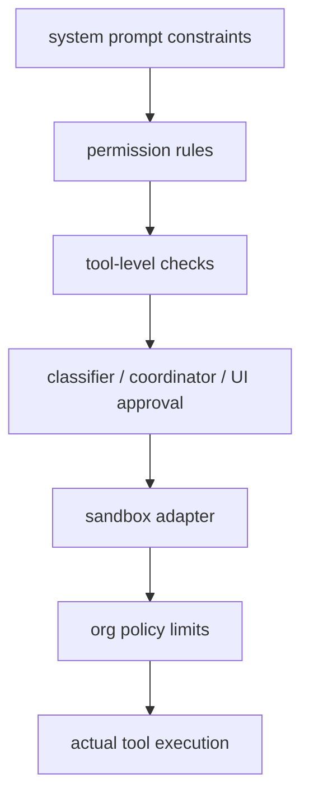

# 安全与约束深拆

## 模块定位

Claude Code 的安全设计不是“写几段安全提示词”那么简单。  
它真正做的是把安全放进执行系统里，让每次工具调用都经过多层约束。

这个模块要解决的问题是：

- 工具调用什么时候允许、什么时候拒绝、什么时候要问用户
- 自动模式如何避免演变成无限权限模式
- 文件系统和网络访问如何落到 OS 级隔离
- 组织策略如何全局收敛能力
- 查询生命周期如何避免乱序或重入

## 核心源码边界

| 文件 | 责任 |
| --- | --- |
| `src/hooks/useCanUseTool.tsx` | 工具权限判定总入口，串联自动检查、分类器和交互 UI |
| `src/utils/permissions/permissions.ts` | 权限规则解析与核心判定链 |
| `src/utils/permissions/permissionSetup.ts` | 自动模式、危险权限识别与模式切换 |
| `src/utils/sandbox/sandbox-adapter.ts` | 把权限规则翻译成 OS 级沙箱配置 |
| `src/services/policyLimits/index.ts` | 组织级 policy limit 拉取与本地缓存 |
| `src/utils/QueryGuard.ts` | 查询生命周期并发保护 |
| `src/constants/prompts.ts` | 安全相关的系统行为约束提示 |

## 这套安全体系是分层的

重点不在于某一层有多强，而在于它们是叠加的。  
这就是 defense in depth。

## `permissions.ts`：权限不是布尔值，而是决策链

`hasPermissionsToUseToolInner(...)` 是这个模块最关键的函数之一。  
它的价值不只是“返回 allow / deny / ask”，而是把判断顺序明确写死了。

根据源码，至少能看出这条链大致是：

1. 工具是否被整体 deny
2. 工具是否被整体 ask
3. 调用工具自身的 `checkPermissions(...)`
4. 工具实现是否返回 deny
5. 工具是否要求用户交互，即使在 bypass 模式也要 ask
6. 内容级 ask 规则是否命中
7. 是否触发 bypass-immune safety check
8. 当前模式是否允许 bypass permissions
9. 是否命中 always-allow
10. 最终把 passthrough 转成 ask 或 allow

### 这条链的设计意义

它把不同来源的约束分清楚了：

- 配置规则是一层
- 工具自身检查是一层
- 安全检查是一层
- 当前模式是一层

这样一来，“为什么这次被允许”或“为什么这次必须提问”就能追溯到具体决策来源。

## bypass-immune safety checks：非常关键的设计

源码里的注释写得很明确：

- 某些 safety checks 是 bypass-immune

比如：

- `.git/`
- `.claude/`
- `.vscode/`
- shell config

这些路径即使在 bypass mode 下也不能直接跳过确认。  
这是一种非常成熟的安全分层：

- bypass 是对“普通权限流程”的绕过
- 不是对“高风险安全边界”的绕过

这点很重要，因为很多 agent 系统一旦进入所谓 YOLO mode，就几乎失去边界了。

## `useCanUseTool.tsx`：权限入口其实是一个编排器

这个 hook 不是简单调一次 `hasPermissionsToUseTool(...)`。  
它会根据结果继续分流到不同处理器：

- coordinator handler
- swarm worker handler
- speculative bash classifier
- interactive permission dialog

如果命中允许，它还会记录：

- classifier approval
- auto mode denial
- permission decision log

这说明 UI 层并不是直接弹窗，而是接在一个权限 orchestration 层后面。

## `permissionSetup.ts`：自动模式不是放开权限，而是主动收紧

这是很多人容易忽略的设计亮点。  
自动模式看起来像“让 agent 自动工作”，但源码里其实做了反方向处理：  
进入自动模式时，会识别和剥离危险规则。

源码里重点关注的包括：

- `Bash(*)`
- `PowerShell(*)`
- 类似 `iex:*` 这种危险 PowerShell 规则
- 子代理和 tmux send-keys 一类可能绕过分类器的能力

### 这说明什么

Claude Code 不把 auto mode 理解成“无脑放行”。  
它更像：

- 在更高自动化程度下
- 用更严格的权限边界和分类器来兜底

这很符合 Harness Engineering 的精神：  
自动化越强，执行框架越要保守。

## `sandbox-adapter.ts`：真正落到 OS 级隔离

如果只有权限规则，没有 OS 级隔离，模型或工具依然可能越界。  
`sandbox-adapter.ts` 的作用就是把高层权限配置落到可执行沙箱。

它会收集和转换：

- `WebFetch` 的 allow / deny domain
- `Edit` / `Read` 规则对应的文件系统 allow / deny
- settings 中 `sandbox.filesystem.*`
- 当前工作目录与额外允许目录

### 特别值得注意的几个安全细节

源码里有几个很成熟的防线：

- 永远拒绝写 settings 文件，防止 sandbox escape
- 永远拒绝写 `.claude/skills`，因为它和 `.claude/commands` / `.claude/agents` 具有同等级别的高权限
- 对 bare git repository escape 做专门缓解，特别处理 `HEAD`、`objects`、`refs`、`hooks`、`config`

这说明安全设计不是抽象层面的，而是非常贴近真实攻击面的。

## `policyLimits/index.ts`：组织策略是单独一层

这个模块负责拉取和缓存组织级 policy limits。  
从源码可以看到它具备：

- 本地缓存
- 重试与退避
- ETag / 304
- 后台轮询
- 同步 `isPolicyAllowed(...)` 读取

非常关键的一点是：它采用 fail-open 设计。  
也就是说，策略服务出问题时，不会直接让整个产品瘫痪。

这体现的是工程系统的现实主义：

- 组织策略很重要
- 但可用性也同样重要

## `QueryGuard.ts`：安全不仅是权限，也包括生命周期约束

`QueryGuard` 看起来不像典型安全模块，但它在系统稳定性和约束性上很重要。  
源码把查询生命周期建模成同步状态机：

- `idle`
- `dispatching`
- `running`

它的目标是：

- 避免查询重入
- 避免队列处理和直接提交之间的竞态
- 避免取消后的陈旧 finally 块误清理新查询

这种“生命周期防乱序”虽然不是权限安全，但属于 execution safety。

## 这个模块体现的开发范式

### 1. Defense in depth

提示词、权限规则、工具检查、UI 批准、沙箱、组织策略多层叠加。

### 2. Policy / mechanism separation

- `permissions.ts` 管决策逻辑
- `permissionSetup.ts` 管模式与规则预处理
- `sandbox-adapter.ts` 管底层执行约束

### 3. Safety checks as first-class runtime behavior

安全不是额外补丁，而是每次工具执行都要经历的系统路径。

### 4. Trust gradients

不同工具、不同路径、不同文件、不同模式并不被等价对待。

### 5. Execution safety, not just content safety

系统关心的不只是“模型会不会说危险内容”，还关心“模型会不会真的危险执行”。

## 为什么这算 Harness Engineering

成熟的 Harness Engineering 必须解决一个问题：  
当模型拥有工具后，谁来约束它？

Claude Code 的答案很明确：

- 不是只靠模型自觉
- 不是只靠提示词
- 而是用权限系统、模式系统、沙箱系统和组织策略共同托底

这正是 agent 产品和普通聊天产品的关键差异。

## 当前逆向版本的限制

当前构建里有一些与分类器、协调器、多机桥接相关的路径仍然是 feature-gated。  
所以你在源码中会看到安全链条的完整骨架，但并不是每个分支都处于活跃状态。

不过主干安全架构已经非常完整，而且恰恰最值得学习。

## 后续最值得继续深挖的点

- `permissions.ts` 中不同 `decisionReason` 的完整分类
- `permissionSetup.ts` 如何在 auto / plan / bypass 之间切换
- `sandbox-adapter.ts` 如何把规则翻成具体 runtime config
- `QueryGuard` 与 REPL 输入队列的配合
- 安全提示词与硬约束之间的边界在哪里
