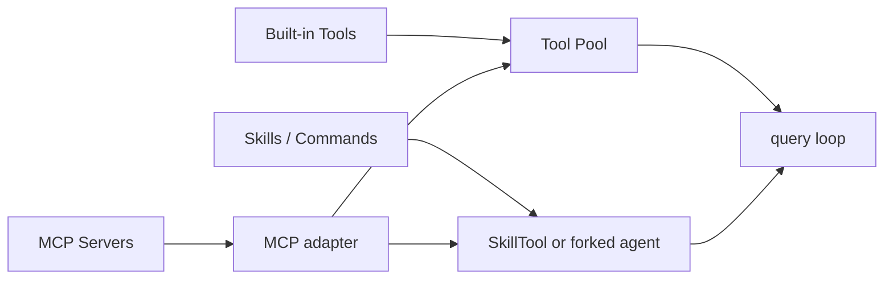

# 工具、Skill 与 MCP 深拆

## 1. 模块定位

Claude Code 真正强的地方，不只是“能调工具”，而是把不同来源的能力统一成一套可编排的执行接口。

在这个系统里：

- Tool 是基础执行能力
- Skill 是可复用的 prompt-capability package
- MCP 是外部能力供应层

而系统真正厉害的地方在于：  
这三类东西最终都被归一到同一条能力总线上。

## 2. 核心源码边界

| 文件 | 责任 |
| --- | --- |
| `src/Tool.ts` | 工具统一协议、`ToolUseContext`、`ToolResult` 等核心抽象 |
| `src/tools.ts` | 内置工具注册表与工具池组装 |
| `src/tools/*` | 各内置工具实现 |
| `src/skills/loadSkillsDir.ts` | Skill 发现、解析和装配 |
| `src/tools/SkillTool/SkillTool.ts` | Skill 执行入口 |
| `src/skills/mcpSkillBuilders.ts` | MCP 技能构建桥接 |
| `src/services/mcp/config.ts` | MCP 配置发现与去重 |
| `src/services/mcp/client.ts` | MCP 连接、能力抓取、调用适配 |
| `src/services/mcp/useManageMCPConnections.ts` | MCP 连接管理 |

## 3. 统一能力平面



这个图背后的核心思想是：

- 模型不需要知道一个能力来自内置模块、Markdown 技能包，还是远程 MCP server
- runtime 负责把这些不同来源的能力规整成统一可调用对象

这就是 adapter architecture 的典型应用。

## 4. Tool：从统一协议、工具池装配到 prompt cache 与多 agent 继承的一整套运行时能力面

如果只看最终发给模型的 `tools` / tool schema，很容易把 Claude Code 的 Tool 理解成：

- 一组静态 JSON Schema
- 模型想用哪把就直接调用
- 工具跑完把结果原样塞回上下文

但从 `Tool.ts`、`tools.ts`、`ToolSearch`、`query.ts` 以及多 agent 运行时这几条链连起来看，Claude Code 里的 Tool 更准确的定义是：

- 协议层，它是统一的运行时能力接口
- 注册层，它会被组装成有顺序、有缓存意识的工具池
- 上下文层，它是 prompt 前缀的重要组成部分
- 调度层，它又分成 upfront tools 和 deferred tools
- 多 agent 层，它会作为 cache-safe 骨架被 forked agent 和 teammate 继承
- 治理层，它还有 prompt 侧和 runtime 侧两层自我约束

所以 Tool 不是“外挂命令集合”，而是一整套被精细工程化的能力面。

### 4.1 第一层：`Tool.ts` 先把 Tool 抽象成统一协议

`src/Tool.ts` 的价值不只是定义几个类型，而是把整个工具运行平面抽象出来。

最关键的两个东西是：

- `ToolUseContext`
- `ToolResult`

它们决定了 Tool 在 Claude Code 里不是孤立函数，而是完整 agent runtime 的参与者。

### 4.2 `ToolUseContext`：工具不是纯函数，而是运行在完整 runtime 里

`ToolUseContext` 不只是几个执行参数，它携带的是整套共享 runtime 状态，例如：

- `commands`
- `tools`
- `mainLoopModel`
- `thinkingConfig`
- `mcpClients`
- `mcpResources`
- `agentDefinitions`
- `customSystemPrompt`
- `appendSystemPrompt`
- `refreshTools`

以及运行态状态：

- `readFileState`
- `loadedNestedMemoryPaths`
- `dynamicSkillDirTriggers`
- `discoveredSkillNames`
- `messages`
- AppState 的 getter / setter

这意味着 Tool 调用并不是：

- 给定输入
- 返回输出

而更像是：

- 在共享 agent runtime 中读取状态
- 调用能力
- 写回消息、权限、上下文或派生状态

所以 Claude Code 里的 Tool，本质上是 runtime participant，而不是外挂命令。

### 4.3 `ToolResult`：工具结果不只是字符串

在 Claude Code 里，工具结果也不是简单文本。  
它可以携带：

- `newMessages`
- `contextModifier`
- `mcpMeta`

这说明 Tool 返回的不是“打印给模型看的一段结果”，而是：

- 可以追加消息
- 可以改写上下文
- 可以携带额外 runtime 元数据

Tool 之所以能深度参与 query loop，就是因为它的返回值本身就被设计成运行时结构，而不是字符串。

### 4.4 第二层：`tools.ts` 把 Tool 组装成最终工具池

真正决定一轮请求里“模型到底看到哪些工具”的，不是某把工具文件本身，而是 `tools.ts` 里的工具池装配链。

这条链最关键的函数是：

- `getAllBaseTools()`
- `getTools()`
- `assembleToolPool(...)`

它们共同完成的是：

- 枚举当前环境可用的 built-in tools
- 结合模式、规则和 feature gate 做过滤
- 再与 MCP tools 合并成最终能力面

### 4.5 `getAllBaseTools()`、`getTools()`、`assembleToolPool(...)` 各管什么

可以把这三个函数理解成三层筛子。

#### A. `getAllBaseTools()`

它是当前环境里所有 built-in tools 的总源头。  
各种工具是否存在、是否受 feature / 平台 /环境影响，都会先经过这层。

#### B. `getTools()`

它会在 built-in tool 基础上，继续根据这些条件筛掉当前不该出现的工具：

- 简化模式
- REPL 模式
- deny 规则
- `isEnabled()` 结果

所以它解决的是：

- 当前这个运行模式里，哪些 built-in tool 真正可见

#### C. `assembleToolPool(...)`

这是最核心的一层。  
它会把 built-in tools 和 MCP tools 合并成最终工具池，同时：

- 先过滤 deny rules
- built-in / MCP 分区排序
- 用 `uniqBy(name)` 去重
- 尽量保持 built-in 前缀稳定

也就是说，Claude Code 的工具注册表关心的不只是功能可用性，还关心：

- 工具列表顺序
- 工具池稳定性
- 这份能力面会不会破坏 prompt cache

### 4.6 Tool 也是 prompt 前缀材料，而不是消息之外的“无关输入”

这里最容易产生误解的点是：  
很多人会盯着 `messages`，以为 prompt cache 只和消息数组有关。

但一次请求的完整输入骨架，至少有四块会共同影响前缀匹配：

- system prompt
- messages
- tools
- thinking config

其中 `tools` 虽然不是 `messages` 里的文本块，而是 API request 顶层字段，但它同样属于这次请求的输入前缀。

所以如果：

- 工具列表顺序乱跳
- tool description / schema 频繁漂移
- 同一把工具这轮有、下轮没有

都会破坏前缀稳定性。

从工程视角可以把它压成一句话：

- `system prompt` 是系统约束前缀
- `messages` 是对话前缀
- `tools` 是能力面前缀
- `thinkingConfig` 是推理配置前缀

它们不是四套彼此独立的 cache，而是一次请求里共同参与前缀匹配的四块材料。

### 4.7 第三层：Tool 不是都 upfront 暴露，还会按加载策略拆成两侧

源码里没有一张“官方分类表”，真正的判定逻辑在 `isDeferredTool(...)`。

它大致遵循这些规则：

- MCP tools 默认更倾向于 deferred
- `shouldDefer: true` 的 built-in tools 也算 deferred
- `alwaysLoad: true` 的 MCP tools 不延迟
- `ToolSearch` 自己不能延迟
- 某些必须首轮可见的核心工具会强制前置

所以更准确地说：

- `deferred` 不是业务分类
- 而是加载策略分类

### 4.8 `non-deferred tools` 和 `deferred tools` 可以怎么理解

大致可以把当前仓库里的工具理解成两侧。

比较像 `non-deferred tools`、默认前置的，通常是：

- `AgentTool`
- `BashTool` / `PowerShellTool`
- `FileReadTool`
- `FileEditTool`
- `FileWriteTool`
- `GlobTool` / `GrepTool`
- `SkillTool`
- `BriefTool`
- `ToolSearchTool`

这些工具的共同点通常是：

- 首轮就很可能被用到
- 是主执行平面的基础能力
- 不适合再先走一轮“搜工具定义”

比较像 `deferred tools`、更适合按需发现的，通常是：

- Web 侧：
  - `WebSearchTool`
  - `WebFetchTool`
- Plan / 会话控制侧：
  - `EnterPlanModeTool`
  - `ExitPlanModeV2Tool`
  - `AskUserQuestionTool`
  - `ConfigTool`
  - `TodoWriteTool`
- Worktree / 后台任务侧：
  - `EnterWorktreeTool`
  - `ExitWorktreeTool`
  - `TaskOutputTool`
  - `TaskStopTool`
- Notebook / LSP / MCP 侧：
  - `NotebookEditTool`
  - `LSPTool`
  - `ListMcpResourcesTool`
  - `ReadMcpResourceTool`
  - 默认绝大多数 MCP tools
- Team / multi-agent workflow 侧：
  - `TeamCreateTool`
  - `TeamDeleteTool`
  - `SendMessageTool`
  - `TaskCreateTool`
  - `TaskGetTool`
  - `TaskListTool`
  - `TaskUpdateTool`
- 调度 / 远程 / 定时侧：
  - `CronCreateTool`
  - `CronDeleteTool`
  - `CronListTool`
  - `RemoteTriggerTool`

这里要特别注意一句：

- `shouldDefer: true` 只表示“可以延迟加载”
- 不是说“它永远不会出现在前面”

只有当 `ToolSearch` 真正启用、当前模型支持、当前 provider 也支持时，这些工具才会被真正后置。  
如果 `ToolSearch` 没开，它们仍然可能直接进入本轮 tool list。

### 4.9 `ToolSearch`：deferred tool 的目录服务和 schema 拉取入口

`ToolSearch` 不是“决定哪些工具延迟”的那层。  
真正决定 deferral 的，是 runtime 里的这些规则：

- `isDeferredTool(tool)`
- `shouldDefer`
- `alwaysLoad`
- `isToolSearchEnabled(...)`

`ToolSearch` 真正负责的是：

- 当 deferred tools 不再 upfront 暴露完整 schema 时
- 给主模型一条“按需取回完整工具定义”的路径

可以把这条链压成 4 步：

1. runtime 先决定哪些工具属于 deferred pool
2. 首轮请求里，模型只会知道这些 deferred tools 的名字
3. 如果主模型真要用其中某把工具，就先调 `ToolSearch`
4. `ToolSearch` 把完整 JSON Schema 取回来，后续这把工具才真正可调用

所以 `ToolSearch` 解决的不是“有没有工具”，而是：

- 什么时候值得把完整 schema 放进当前 prompt

它更像：

- deferred tool 的目录服务
- schema 拉取入口

而不是“工具商店”。

再往下一层，runtime 还会做两件事：

- 用 `extractDiscoveredToolNames(messages)` 记住哪些 deferred tools 已经被发现过
- 后续请求里继续带上这些“已发现工具”，避免每轮都重新搜一遍

另外还有个容易被忽略的点：

- tool 自己可以带 `searchHint`
- `ToolSearch` 做关键词匹配时会利用它来提高召回质量
- 但 deferred tool 名单里通常不会把这段 hint 原样渲染给模型看

所以 `searchHint` 更像 runtime 侧帮助 ToolSearch 排序的能力标签。

### 4.10 为什么这套工具装配机制能帮助 prompt cache

这套机制本质上是在配合做两件事：

1. 尽量让稳定、常用、基础的工具留在前面
2. 把长而重、场景化、并非每轮都要用的工具尽量后置

这也是为什么：

- `assembleToolPool(...)` 会强调 built-in / MCP 的顺序稳定
- `toolToAPISchema(...)` 会缓存 session-stable 的 tool schema base
- `defer_loading` 和 `cache_control` 这类 per-request 字段只作为 overlay 叠上去

还有一个很细但很重要的工程点：

- 系统缓存的不是某次序列化后的整段 tools JSON
- 而是更稳定的 base schema：
  - `name`
  - `description`
  - `input_schema`
  - 以及可能的 `strict` / `eager_input_streaming`

然后每轮再叠：

- `defer_loading`
- `cache_control`

这样做的目的，就是避免：

- `tool.prompt()` 轻微变化
- feature gate 漂移
- 某轮 defer、某轮不 defer

把整段工具前缀字节流搅乱得太厉害。

#### 4.10.1 运行时 `Tool` 对象很大，但真正发给 LLM 的是另一层投影

这里还有一个很容易混淆的点：

- `src/Tool.ts` 里的 `Tool` 类型字段很多
- 但真正发给 API / LLM 的不是这整个运行时对象
- 而是 `toolToAPISchema(...)` 投影出来的一份 tool schema

这条映射链大致是：

```text
运行时 Tool 对象
  -> toolToAPISchema(tool, ...)
  -> API tools 数组里的单条 schema
  -> 随请求一起进入模型上下文
```

其中最关键的映射不是很多人直觉以为的“`description()` 就是工具 prompt”，而是：

- `name <- tool.name`
- `description <- await tool.prompt(...)`
- `input_schema <- tool.inputJSONSchema ?? zodToJsonSchema(tool.inputSchema)`

也就是说，Claude Code 里大量“写给主模型看的工具 workflow 指导”，通常都不是放在运行时 `tool.description(...)` 里，而是：

- 写在 `tool.prompt()`
- 最终落进 API tool schema 的 `description`

反过来，`tool.description(input, ...)` 更像运行时/界面侧的工具调用说明，不是定义工具本身那段 schema prompt。

所以如果从“哪些属性对 LLM 可见”来分，最常见的是两层：

- 直接进入 tool schema 的：
  - `name`
  - `description`，但它的来源其实通常是 `tool.prompt()`
  - `input_schema`
- 可能作为附加 schema 字段一起发送、但更偏 API 行为控制的：
  - `strict`
  - `eager_input_streaming`
  - `defer_loading`
  - `cache_control`

而这些运行时字段虽然很重要，却通常不直接成为主模型眼前的 tool schema 正文：

- `call`
- `checkPermissions`
- `validateInput`
- `isReadOnly`
- `isConcurrencySafe`
- `renderToolUseMessage`
- `renderToolResultMessage`
- `userFacingName`
- `getToolUseSummary`
- `searchHint`

尤其是 `searchHint`，它更像 runtime 侧给 `ToolSearch` 做关键词召回和排序的能力标签，而不是普通 tool schema 里显式展示给模型看的正文。

#### 4.10.2 `BashTool` 很能说明“工具 prompt 在编排 workflow”

`BashTool` 是一个特别典型的例子。

如果只看名字，你会以为它只是：

- 执行 shell 命令

但它真正给模型看的 `tool.prompt()` 远不止一句“run bash command”，而是一整套 shell workflow 指导，典型内容包括：

- 什么时候别用 Bash，改用 `FileRead` / `FileEdit` / `Glob` / `Grep`
- 多条命令该并行发多个 tool call，还是在一个 Bash 调用里用 `&&`
- git 命令怎么避免 destructive 操作和跳过 hooks
- 长任务怎么用 `run_in_background`
- 不要乱写 `sleep`
- sandbox 失败时什么时候才该开 `dangerouslyDisableSandbox`

所以 `BashTool` 这种工具非常能说明一件事：

- Claude Code 的 tool prompt 不只是“能力说明”
- 它经常在直接编排主模型的工作流
- 而这些工作流指导，最终就是作为 tool schema 的 `description` 进入模型上下文的

### 4.11 Tool 作为 cache-safe 骨架，会被 forked agent 和 teammate 继承

这部分和多代理文档是连着的，但从 Tool 视角看会更清楚。

#### A. `forked agent`

`forked agent` 继承主线程骨架时，不是直接拷一份“已经序列化好的 tools JSON”。  
它继承的是：

- `cacheSafeParams.toolUseContext`
- 以及其中的 `options.tools`、`mainLoopModel`、`thinkingConfig` 等运行时骨架

然后 `runForkedAgent(...)` 会：

- 用 `createSubagentContext(...)` 克隆隔离子上下文
- 把消息侧组装成 `initialMessages = [...forkContextMessages, ...promptMessages]`
- 再重新走一次正常的 `query(...)`

所以它继承的是：

- 父 agent 的 cache-safe tools / model / thinking / message 前缀骨架

而不是：

- 一份原封不动直接复用的 tool schema 文本块

tool schema 仍然会根据继承下来的 `options.tools` 重新生成。  
但因为输入骨架和父请求很接近，所以仍然能尽量吃到 prompt cache。

#### B. `teammate`

`teammate` 的情况更微妙一些。

一方面，它确实会继承父 agent 的大骨架：

- 取完整主 agent 那套 `getSystemPrompt(...)`
- 继承父 `toolUseContext`
- 继承父 `options.tools` 作为基础能力面

但另一方面，它又不会原样照搬：

- in-process teammate 会主动把 `toolUseContext.messages` 清空
- 因为 teammate 不直接读父会话整段 `messages`
- 它会在自己的长期循环里维护 `allMessages`

同时，`resolvedAgentDefinition` 还会把一组 team-essential tools 强行补进来：

- `SendMessage`
- `TeamCreate`
- `TeamDelete`
- `TaskCreate`
- `TaskGet`
- `TaskList`
- `TaskUpdate`

这意味着 teammate 的工具骨架不是：

- 完全照抄父 agent

而是：

- 继承父 agent 的基础能力面
- 再注入 team 协作必需工具
- 再按 teammate 自己的生命周期重建消息上下文

这里也正好能回答一个常见误解：

- team workflow tools prompt 很长
- 但它们大多本身就是 `shouldDefer: true`

所以即便 teammate 把这些工具注进了可用工具池，它们也不等于一定会在首轮把完整 schema 全摊开。  
如果 `ToolSearch` 开着，这些工具仍然可以继续走延迟加载，只在真正需要时才把 schema 拉出来。

最短一句话记住：

- `forked agent` 继承的是父请求的 cache-safe 工具骨架
- `teammate` 继承的是父 agent 的基础能力面，再额外 team 化
- `ToolSearch` 负责把这套能力面里“重而场景化”的那部分继续后置

### 4.12 Tool 还有两层很重要的“自我约束”

如果只看 tool schema，很容易把 Claude Code 的工具理解成：

- 只要工具存在
- 模型就自己决定什么时候调用
- 调完把结果原样塞回上下文

但真实实现比这克制得多。  
至少还有两层非常关键的约束：

- prompt 侧：工具自己会写“什么时候别用我”
- runtime 侧：工具结果进入上下文前要先过预算治理

#### A. “万能工具里写别用我”

这类机制最典型的就是 `AgentTool`。

它虽然像一把通用委派入口，但它的 prompt 里会明确写：

- `When NOT to use the Agent tool`

而且不是一句空泛提醒，而是非常具体地告诉主模型：

- 想读一个明确文件路径时，不要用 `AgentTool`
- 想查某个类定义时，不要用 `AgentTool`
- 只是在 2-3 个文件里找代码时，不要用 `AgentTool`
- 这类事情更适合直接交给更近、更快、更便宜的工具

这说明 Claude Code 的工具 prompt 不只是“教模型怎么用我”，还会：

- 主动声明自己不该被用的场景

从工程视角，这非常重要，因为 `AgentTool`、`EnterPlanModeTool`、`TaskCreateTool`、`TodoWriteTool` 这类 workflow / orchestration 工具，如果没有这层自我克制，很容易把简单问题升级成重编排问题。

#### B. “工具输出要有预算”

第二层约束不在工具选择，而在工具结果回流上下文时。

Claude Code 并不是让所有 `tool_result` 原样无限堆进 `messages`。  
在真正发请求前，`query.ts` 会先调用：

- `applyToolResultBudget(...)`

去治理这一轮消息里的聚合 `tool_result` 大小。

这层预算至少表达了两件事：

1. 工具输出不是天然应该完整常驻上下文的  
   很大的结果会被落盘、替换成 preview，或者按预算裁成更轻的表示。

2. 工具结果治理不是靠模型“自觉少说点”  
   而是 runtime 在消息真正送进模型前先做硬处理。

源码里甚至还有一条配套 system 提示，会直接提醒模型：

- 处理工具结果时，如果有重要信息，最好先写进自己的回答里
- 因为原始 tool result 之后可能会被清掉

所以这里能看出 Claude Code 对工具结果的态度不是：

- 工具跑出来多少，就全都永久喂回模型

而是：

- 工具结果是上下文资源，要被预算、治理、替换、压缩

### 4.13 一句话把 Tool 模块钉住

Tool 的完整链路可以压成一句话：

```text
Tool 先被 `Tool.ts` 规整成统一运行时协议，
再由 `tools.ts` 装配成有顺序、有缓存意识的能力面，
通过 upfront / deferred / ToolSearch 机制控制何时把完整 schema 暴露给模型，
并作为 cache-safe 骨架被多 agent 继承，
最后再通过 prompt 侧边界提示和 runtime 侧结果预算持续治理。
```

## 5. Skill：先进入运行时，再渐进式披露到模型上下文的声明式能力包

如果只看目录结构，Skill 很容易被误解成“放在 `skills/` 里的 prompt 模板”或“一个 slash command 文件夹”。  
但从 `loadSkillsDir.ts`、`commands.ts`、`SkillTool.ts` 和 `processSlashCommand.tsx` 这一整条链看，Claude Code 里的 Skill 更准确的定义是：

- 作者侧，它是目录里的 `SKILL.md` 或 legacy `commands/` 文档
- 运行时侧，它会被 loader 解析成统一的 `Command(type='prompt')`
- 上下文侧，它不会在启动时整体塞进主 agent prompt，而是按需、渐进式披露
- 执行侧，它既可以内联注入主线程，也可以 fork 成 subagent，还可以在 coordinator/worker 架构里先给主线程摘要、再给 worker 正文

所以 Skill 不是“快捷命令”，而是一个目录式、声明式、可调度的能力包。

### 5.1 Skill 的来源与文件形态

Skill 可以从多个来源加载：

- managed
- user
- project
- plugin
- bundled
- MCP
- legacy `commands/`

这里还要区分两类磁盘形态：

- `skills/` 目录下的正式 skill 只支持目录格式：`skill-name/SKILL.md`
- `commands/` 目录是更老的 prompt-command 兼容层，既支持目录格式，也支持单个 `.md` 文件

两者最后都会被规整成统一的 `Command(type='prompt')`，所以运行时看上去都像“skill/command”，只是 `loadedFrom` 不同。

### 5.2 第一层：Skill 先从文件加载进进程内存

`loadSkillsFromSkillsDir(...)` 做的不是“把目录名列出来”，而是真正去读 `SKILL.md`：

- 扫描 `skills/` 下的子目录
- 定位每个 skill 的 `SKILL.md`
- `readFile(...)` 读取完整文件
- `parseFrontmatter(...)` 拆成 frontmatter 和 `markdownContent`
- `parseSkillFrontmatterFields(...)` 提取结构化元数据
- `createSkillCommand(...)` 生成运行时 `Command`

这一步非常关键，因为它回答了一个容易混淆的问题：

- Skill 的完整文件内容，确实会在加载期就进入 Claude Code 进程内存
- 但这不等于它会在启动时就进入主 agent 的 LLM 上下文

也就是说，Claude Code 里要分清两层：

- “加载进程序运行时内存”
- “进入模型本轮 prompt 上下文”

Skill 先完成前者，再按需触发后者。

#### 5.2.1 初次加载进内存的通常只有 `SKILL.md`，不是整个 skill 目录

这里也要特别区分“skill 目录里有什么”与“loader 一开始真的读了什么”。

一个完整的 skill 目录当然可能不只有：

- `SKILL.md`

它还可能带：

- `references/`
- `scripts/`
- 模板文件
- 其它辅助资源

但对本地 `skills/` loader 来说，初始化时最先、最核心被读进内存的，通常就是：

- `skill-name/SKILL.md`

这些额外资源并不会在扫描阶段被整个 eager load。  
更准确地说：

- `SKILL.md` 负责把 skill 先注册成 `Command`
- 其它资源通常在后续真正 invocation 时，才按需被 skill 正文、shell 注入或普通 tool use 间接读到

所以“skill 被加载进运行时”并不等于：

- skill 目录里的每个 references/script 文件都已经进入主 agent 上下文

它只意味着：

- runtime 已经知道有这么一个 skill
- 并且拿到了足够把它规整成 `Command` 的核心定义

### 5.3 第二层：Skill 被规整成 `Command`，而不是立刻进入 prompt

`createSkillCommand(...)` 会把 frontmatter 和正文组装成统一的 `Command` 对象。  
这个 `Command` 是 Skill 的运行时形态，而不是模型直接看到的 prompt 形态。

它至少会携带这些关键信息：

- `name`
- `description`
- `whenToUse`
- `allowedTools`
- `context`
- `agent`
- `model`
- `effort`
- `hooks`
- `paths`
- `disableModelInvocation`
- `userInvocable`
- `getPromptForCommand(args, context)`

其中最重要的是两层：

- 上半层是元信息：`description`、`whenToUse`、`allowedTools`、`context` 等
- 下半层是正文出口：`getPromptForCommand(...)`

`getPromptForCommand(...)` 里闭包保存了 `markdownContent`，所以后续调用 skill 时，并不是再“根据 frontmatter 去磁盘读文件”，而是直接在内存里把已经加载好的正文渲染出来。

可以把这条转换链记成：

```text
SKILL.md / commands/*.md
  -> parseFrontmatter(...)
  -> parseSkillFrontmatterFields(...)
  -> createSkillCommand(...)
  -> Command(type='prompt')
```

### 5.4 frontmatter 真正在描述什么

frontmatter 不是简单的展示信息，它决定了这个 Skill 以后怎么被调度、授权和执行。

源码里会解析的字段包括：

- `allowed-tools`
- `arguments`
- `argument-hint`
- `when_to_use`
- `version`
- `model`
- `disable-model-invocation`
- `user-invocable`
- `hooks`
- `context: fork`
- `agent`
- `effort`
- `shell`
- `paths`

这些字段大致分别在解决四类问题：

- 什么时候该用它：`description`、`when_to_use`
- 谁能调它：`disable-model-invocation`、`user-invocable`
- 调起来给什么权限：`allowed-tools`
- 正文进谁的上下文：`context`、`agent`、`model`、`effort`

这一点很重要，因为它说明 Skill 在 Claude Code 里不是“提示词文本块”，而是“声明式能力定义”。

### 5.5 第三层：先进入 command registry，再渐进式披露给模型

Skill 进入运行时以后，会先进入 `commands.ts` 这套 command/skill registry，而不是直接进入主 agent prompt。

这里又有几层状态：

- 基础命令列表：`getCommands(cwd)`
- 会话中动态发现的技能：`dynamicSkills`
- 带 `paths` 但尚未激活的条件技能：`conditionalSkills`
- `SkillTool` 实际可见的 prompt skills：`getSkillToolCommands(...)`

这时模型真正“知道”的，通常还只是 skill 的轻量元信息，而不是完整正文。  
源码里甚至有一条非常直白的注释：skill 的 token 预算估算只看 frontmatter 级信息，因为 full content 只在 invocation 时才真正进入 prompt 流。

所以这里要严格区分：

- command registry 是程序侧的数据结构
- 模型上下文是一次 query 里的 prompt 内容

Skill 先进入前者，再按需进入后者。

### 5.6 Skill / Command / listing 这三层在目录变化时怎么更新

上一小节讲的是静态结构：`SKILL.md -> Command -> command registry -> listing`。  
但运行时还有一个更实际的问题：

- 如果 `skills/` 或 `commands/` 目录变了
- Claude Code 怎么把新的 skill 重新带进运行时
- 又怎么让主 agent 后续看到新的 skill 列表/摘要层

这里要分三类更新路径看。

#### A. 固定 skill/command 目录 watcher

Claude Code 确实有专门的 skill 文件 watcher。  
`skillChangeDetector.ts` 会用 `chokidar` 监听这些目录：

- `~/.claude/skills`
- `~/.claude/commands`
- 项目级 `.claude/skills`
- 项目级 `.claude/commands`
- `--add-dir` 对应目录下的 `.claude/skills`

监听的事件包括：

- `add`
- `change`
- `unlink`

而且它不是“文件一变立刻同步重建一切”，而是先 debounce，再批量 reload，避免 git 操作或批量修改时疯狂重载。

#### B. 不是原地 patch 旧对象，而是清缓存再重建

目录变化后，Claude Code 的语义不是：

- 原地修改某个旧 `Command`
- 原地 patch 某个 registry 条目

而是更偏运行时重建：

- `clearSkillCaches()`
- `clearCommandsCache()`
- `resetSentSkillNames()`
- `skillsChanged.emit()`

也就是说，更准确的说法是：

- 旧的 `Command` / registry 视图作废
- 下一次再按磁盘重新加载，生成新的 `Command`
- 再重新得到新的 command registry 结果

#### C. 除了 watcher，还有两条“运行时发现”路径

Skill 更新不只来自目录 watcher。

第一条是文件操作触发的动态发现：

- `discoverSkillDirsForPaths(...)`
- `addSkillDirectories(...)`
- `dynamicSkills`
- `skillsLoaded.emit()`

这条链的意思是：

- 当当前操作触及某些文件路径时
- 系统会沿路径向上找嵌套的 `.claude/skills`
- 找到后动态加载
- 把新 skill 放进 `dynamicSkills`

第二条是 `paths` 条件激活：

- skill 本来已经加载过
- 但因为有 `paths` frontmatter，所以先留在 `conditionalSkills`
- 等当前文件路径命中时，再移入 `dynamicSkills`

所以“新 skill 出现在模型眼前”至少有三种来源：

- 目录 watcher 发现 skill 文件变了
- 文件操作触发动态发现了新的 skill 目录
- 已有 skill 因为 `paths` 匹配而被激活

#### D. `Command`、registry、listing 分别怎么更新

这三层的更新方式并不一样：

- `Command` 更新：
  - 更准确地说，是旧对象失效、重新从磁盘生成新对象
- command registry 更新：
  - 清缓存后，下一次 `getCommands()` / `getSkillToolCommands()` 重新计算
- skill listing / 摘要层更新：
  - 不是 watcher 直接强插进当前 prompt
  - 而是通过 `resetSentSkillNames()` 让下一轮 attachment / message 构建时重新发新的 listing

这条链可以压成：

```text
skill/commands 目录变化
  -> watcher / dynamic discovery / conditional activation
  -> clearSkillCaches() / clearCommandsCache()
  -> 重新生成 Command
  -> 重新得到新的 command registry
  -> resetSentSkillNames()
  -> 下一轮重新生成 skill_listing
  -> 再注入主 agent messages
```

#### E. skill listing 在主 agent 上下文里不是 system prompt，而是 messages 侧的 `<system-reminder>`

这里还有一个很关键的结构点：

- `skill_listing` 先是 attachment
- 然后会被转成 `isMeta: true` 的 user message
- 再用 `<system-reminder> ... </system-reminder>` 包起来

所以 skill 列表/摘要层的位置不是：

- 静态 system prompt 本体

而是：

- `messages` 部分里，runtime 注入的 `<system-reminder>` meta message

这也解释了为什么它可以随着目录变化、动态发现或 `paths` 激活而在后续轮次增量刷新。

#### F. REPL / 主线程是怎么接住这次更新的

在本地 REPL 里，`useSkillsChange(...)` 会订阅 skill 变化，然后：

- `clearCommandsCache()`
- `getCommands(cwd)`
- `setLocalCommands(...)`

所以 UI / 主线程维护的 commands 列表是 hot-reloadable 的。  
而 skill listing 则在后续 attachment 构建时，基于新的 commands / registry 结果重新生成。

### 5.7 为什么说这是“渐进式披露”

Claude Code 对 Skill 采用的不是“一启动把所有 skill 全文都塞进 system prompt”的策略，而是更克制的两段式策略：

1. 先给模型一个 skill 列表/摘要层
2. 只有模型真正调用 `SkillTool` 时，才展开目标 skill 的完整正文

这套设计有三个直接收益：

- 降低主线程 prompt 污染，避免大量 skill 正文把上下文挤满
- 维持更稳定的前缀，把变化尽量推迟到调用时
- 允许同一份 Skill 走不同执行路径：inline、fork、coordinator/worker

所以“Skill 被加载进内存”与“Skill 被披露进模型上下文”是两个不同阶段。

### 5.8 `paths` 与动态技能触发

带 `paths` frontmatter 的 Skill 不一定一开始就对模型可见。  
加载阶段，这类 skill 会先进入 `conditionalSkills`，而不是直接成为 unconditional skill。

等到系统发现当前操作触及了匹配的文件路径后，`activateConditionalSkillsForPaths(...)` 才会：

- 用 `ignore` 风格规则匹配路径
- 把命中的 skill 从 `conditionalSkills` 移到 `dynamicSkills`
- 让它在本会话中对模型可见

这说明 Skill 不是纯手动命令，它也可以是“与当前文件路径相关的上下文能力注入层”。

### 5.9 `SkillTool`：把 registry 里的 Skill 按需搬进执行面

`SkillTool` 是 skill 从“运行时对象”进入“执行流”的总入口。  
它做的核心事情包括：

- 通过 `getAllCommands(context)` 合并本地 commands 和 MCP skills
- 通过 `findCommand(...)` 在 registry 里找到目标 skill
- 检查 `disableModelInvocation`
- 检查权限规则与安全属性
- 根据 `command.context` 选择 inline 或 fork
- 在需要时把 skill 正文转换成当前轮 messages，或 subagent 的 `promptMessages`

它不是简单“把 Markdown 原文塞给模型”，而是一个技能调度器。

#### 5.9.1 `command.getPromptForCommand(args, context)` 真正在做什么

最近这串对话里，一个特别值得单独钉住的点是：

- `SkillTool` 真正把 skill 正文变成可执行 prompt 的关键入口
- 往往不是某个外部 read 命令
- 而是 `command.getPromptForCommand(args, context)`

这一步做的事情，远不只是“把 `SKILL.md` 文件读出来”。

对于本地 skill，它至少可能会做这几层处理：

1. 以 `markdownContent` 为基础拿到完整 skill 正文
2. 做参数替换
3. 替换 `${CLAUDE_SKILL_DIR}`、`${CLAUDE_SESSION_ID}` 这类运行时变量
4. 在允许的情况下执行 skill 正文里的 shell 注入语法，把命令输出嵌回 prompt 文本

所以 `getPromptForCommand(...)` 更像：

- 把“声明式 skill 定义”
- 渲染成“当前这次调用真正要喂给 agent 的 prompt 正文”

而不是简单文件读取。

#### 5.9.2 Skill 里的 shell 注入，不等于 LLM 发起了一次普通 tool use

这里最容易误会的一点是：

- skill 正文里如果写了 shell 片段
- 最终也可能真的调用 `BashTool`

但这不等于：

- 主模型先看完 skill
- 然后自己显式产出一个 `tool_use(BashTool, ...)`

本地 skill 有一类特殊机制，是 runtime 在渲染 skill prompt 时主动处理的。  
大致可以理解成：

- 先扫描 skill 正文里的特定 shell 注入语法
- 再由 runtime 直接调用 `BashTool.call(...)` 或对应 PowerShell 实现
- 把命令输出嵌回 skill prompt 文本

所以这类 shell 注入的语义更接近：

- runtime 预处理

而不是：

- LLM 正常发起的工具调用

两者的差别可以压成一句话：

- shell 注入：调用者是 runtime，结果先嵌进 skill 正文，再交给模型
- 普通 tool use：调用者是 LLM，工具结果作为 tool result 回流到会话里

也因此，skill 里如果只是普通地写：

- “请运行 `git status`”
- “再用 `npm test` 检查”

这通常仍然属于后续由模型自己决定是否用 `BashTool` 的普通 tool use。  
只有写进 skill 特定注入语法里的命令，才会在渲染 skill prompt 时被 runtime 预执行。

#### 5.9.3 本地 skill、MCP skill、remote canonical skill 的预处理强度并不一样

这又是一个很容易被“都叫 skill”掩盖掉的差异。

从预处理强度上，至少可以粗分成三类：

##### A. 本地 skill

本地 skill 通常能力最强，可能支持：

- 参数替换
- `${CLAUDE_SKILL_DIR}` / `${CLAUDE_SESSION_ID}` 这类变量替换
- skill 正文里的 shell 注入预执行

所以它像一个：

- 本地、可执行、可渲染的能力包

##### B. MCP skill

MCP skill 虽然也会进入 `Command` 体系，但因为它被视为 remote / untrusted，通常不会启用和本地 skill 同等级别的 shell 注入预处理。

更准确地说，它更像：

- 远程提供的 skill 定义
- 仍可进入 registry 和 `SkillTool`
- 但 runtime 会对它的预处理能力更克制

##### C. remote canonical skill

还有一类 remote canonical skill，处理方式会更保守。  
它通常更接近：

- 声明式 markdown 内容

而不是本地那种“可带较强预处理能力的 skill 包”。  
这类 skill 通常不会启用：

- `!command` 这类 shell 注入
- 本地 skill 那种完整参数插值能力

但 runtime 仍可能给它补一些最基础的上下文变量或目录信息，让它能被安全地拼进执行流。

### 5.10 三条最典型的 Skill 注入路径

Skill 从 runtime 进入模型上下文时，至少有三条很典型的路径。

#### 5.10.1 `inline skill`：完整正文进入主 agent 当前轮上下文

默认路径是内联执行。

大致流程是：

```text
主 agent
  -> SkillTool(skill, args)
  -> getAllCommands() + findCommand()
  -> processPromptSlashCommand(...)
  -> getMessagesForPromptSlashCommand(...)
  -> command.getPromptForCommand(args, context)
  -> 生成 messages / attachments / command_permissions
  -> 注入主 agent 当前轮 messages
```

这里有几个很重要的细节：

- `command.getPromptForCommand(...)` 会基于内存里的 `markdownContent` 渲染完整 skill 正文
- 渲染结果会和 attachment、权限信息一起进入当前轮消息
- `registerSkillHooks(...)` 会把 frontmatter 里的 hooks 注册成 session hooks
- `addInvokedSkill(...)` 会把 skill 内容记录到运行时状态里，方便 compaction / recovery

所以 `inline skill` 的本质是：

- 正文进主线程
- 主 agent 自己读 skill 全文
- 主 agent 自己继续推理和调用工具

这里顺手也能回答一个常见疑问：

- inline skill 的完整正文并不是启动时就常驻主 agent 上下文
- 而是只有在这次 skill 真被调用时，才通过当前轮 messages 注入

所以它依然属于“按需展开”，只不过展开后是进主线程，而不是进 subagent。

#### 5.10.2 `fork skill`：完整正文主要进入 subagent 上下文

如果 `command.context === 'fork'`，`SkillTool` 会走 `executeForkedSkill(...)`。

大致流程是：

```text
主 agent
  -> SkillTool(skill, args)
  -> getAllCommands() + findCommand()
  -> command.context === 'fork'
  -> executeForkedSkill(...)
  -> prepareForkedCommandContext(...)
  -> command.getPromptForCommand(args, context)
  -> skillContent -> promptMessages
  -> runAgent(...)
  -> subagent 执行
  -> 提取 resultText
  -> Tool result 返回主 agent
```

这里最关键的转折点在 `prepareForkedCommandContext(...)`：

- 它先调用 `command.getPromptForCommand(...)`
- 把正文拼成 `skillContent`
- 再包装成 `promptMessages = [createUserMessage({ content: skillContent })]`
- 同时基于 `allowedTools` 构造 `modifiedGetAppState`
- 再按 `command.agent` 或默认 `general-purpose` 选 base agent

所以 `fork skill` 的核心不是“主线程先吞正文再转发”，而是：

- 主线程负责选 skill、启动 fork
- subagent 负责真正消费 skill 全文
- 主线程主要收到工具结果

`executeForkedSkill(...)` 最终返回的不是 skill 正文本身，而是更像：

- `status: 'forked'`
- `agentId`
- `result`

这就是主 agent 与 subagent 在 fork skill 场景下最重要的通信形态。

#### 5.10.3 `coordinator/worker skill`：主线程先拿摘要，worker 再拿正文

在 `processPromptSlashCommand.tsx` 里，还能看到一条更“分层”的路径：

- coordinator mode 下
- 如果当前是主线程而不是 subagent/worker
- 就先跳过完整 skill 正文和权限展开
- 只返回一个 skill 摘要，告诉 coordinator：
  - skill 名称
  - `description`
  - `whenToUse`
  - `allowedTools`
  - 应该怎样在 Agent prompt 里让 worker 使用这个 skill

然后后续的 worker 真正调用 `SkillTool` 时，才会走正常的 `getPromptForCommand(...)`，吃到完整 skill 正文。

所以这条链不是：

- coordinator 先读完整 skill，再转发给 worker

而是：

- coordinator 先只拿“技能摘要 + 委派提示”
- worker 之后再自己展开 skill 全文

需要注意的是，这条路径在当前逆向仓库里更多体现为源码设计意图。  
因为当前 build 里 `feature()` 被硬编码为 `false`，所以 `COORDINATOR_MODE` 相关分支并不是这个构建下默认活跃的主路径。

### 5.11 三条路径并排看：谁拿正文，谁拿结果

把三条路径并排看，会非常清楚：

| 路径 | 主线程拿到什么 | 谁真正拿到完整 skill 正文 |
| --- | --- | --- |
| `inline skill` | 完整 skill 正文、附件、权限信息 | 主 agent |
| `fork skill` | tool result、`agentId`、`resultText` | subagent |
| `coordinator/worker skill` | 先拿 skill 摘要和委派提示，后续拿 worker 结果 | worker |

也可以压成三句：

- `inline skill`：正文进主线程
- `fork skill`：正文进 subagent，主线程拿结果
- `coordinator/worker skill`：主线程先拿摘要，正文延后到 worker

### 5.12 `subagent` 怎么和主 agent 通信

Skill 路径里的主子通信，不是 teammate/team 那种 mailbox + task list 机制，而是更紧凑的同步编排。

#### A. `inline skill`

严格说没有“主子通信”，因为它根本不出主线程。  
skill 正文被转换成当前轮的 messages，主 agent 直接继续工作。

#### B. `fork skill`

这里的通信链是：

- 主线程通过 `SkillTool` 调 `runAgent(...)`
- subagent 的上下文来自 `promptMessages`
- subagent 执行过程中的消息先在工具内部收集成 `agentMessages`
- 最后 `extractResultText(...)` 提取出结果文本
- 再通过 `SkillTool` 的 tool result 回给主 agent

所以 fork skill 的通信重点是：

- 子 agent 吃的是 skill 全文
- 主 agent 收的是结果，而不是全文

这也是为什么 fork skill 能隔离上下文污染。

#### C. `coordinator/worker skill`

这里的通信更像两段式委派：

- 主线程先拿 skill 摘要
- 在 agent prompt 里要求 worker 使用某个 skill
- worker 自己调用 SkillTool
- worker 执行完成后把结果再回给 coordinator

这里主线程与 worker 之间传的是“任务/指令”和“结果”，而不是直接传整份 skill 正文。

### 5.12.1 三条 skill 路径再并排压成一张小结构图

如果把最近关于 inline / fork / coordinator-worker 的讨论再压成一张很小的结构图，会更清楚：

```text
inline skill
  主 agent
    -> SkillTool
    -> getPromptForCommand(...)
    -> skill 正文注入主线程 messages
    -> 主 agent 继续执行

fork skill
  主 agent
    -> SkillTool
    -> getPromptForCommand(...)
    -> skill 正文变成 subagent promptMessages
    -> runAgent(...)
    -> subagent 消费正文
    -> 结果回主 agent

coordinator / worker skill
  coordinator
    -> 先拿 skill 摘要 / 委派提示
    -> 指示 worker 使用 skill
  worker
    -> SkillTool
    -> getPromptForCommand(...)
    -> worker 消费正文
    -> 结果回 coordinator
```

所以三条路径的关键差别不是“有没有用到同一个 skill”，而是：

- 完整正文最终落在哪个 agent 的上下文里
- 主线程拿到的是正文，还是摘要，还是结果

### 5.13 Skill 的状态回流：hooks、compaction、agent scope

Skill 不只是一次性 prompt 注入，还会留下运行时状态。

#### A. hooks

`registerSkillHooks(...)` 会把 skill frontmatter 里的 hooks 注册成 session-scoped hooks：

- 按 session 维持
- `once: true` 的 hook 成功执行一次后自动移除
- `skillRoot` 会一起传入，供相关环境变量或脚本使用

这说明 Skill 可以在“正文执行之后”继续影响会话行为。

#### B. invoked skill tracking

`addInvokedSkill(...)` 会把已调用 skill 记进 `STATE.invokedSkills`：

- `skillName`
- `skillPath`
- `content`
- `invokedAt`
- `agentId`

其中 `agentId` 非常重要，因为它让 Claude Code 可以在 compaction / recovery 时按 agent 作用域恢复 skill，避免主线程与子线程之间互相串味。

所以 Skill 的“正文”并不是注入一次就完全消失，它还会通过运行时状态参与后续压缩和恢复。

### 5.14 安全与信任边界：Skill 也受权限系统治理

Skill 虽然经常写成 Markdown，但它绝不是“天然安全的文本块”。  
Claude Code 明确把它纳入权限和信任边界体系里治理。

#### A. `disableModelInvocation`

如果 skill 标记了 `disableModelInvocation`，模型就不能主动调用它。  
这说明“skill 在 registry 里存在”与“模型可以直接调它”是两回事。

#### B. `SAFE_SKILL_PROPERTIES` allowlist

`SkillTool.ts` 里有 `SAFE_SKILL_PROPERTIES` 这组 allowlist。  
它的意思不是“所有 skill 都自动放行”，而是：

- 如果一个 skill 只用了这组白名单属性
- 且没有其它有意义的扩展字段
- 那么它可以被自动视为安全 skill

反过来，只要 skill 上带了白名单外、且有实际意义的字段，就会进入更严格的权限判断。  
这是一种“默认保守”的设计，能保证以后新增新字段时默认不是自动放行。

#### C. MCP skill 的额外信任边界

`loadSkillsDir.ts` 里有一句很关键的注释：

- `MCP skills are remote and untrusted`

因此，对从 MCP 加载的 skill：

- 系统不会执行 markdown 正文里的内联 shell 注入
- 只把它当成远程、不完全可信的 skill 内容来处理

这说明 Claude Code 对本地 skill 和远程 skill 的信任边界是分开的，而且分得很清楚。

#### D. `references/`、`scripts/` 最终怎么参与执行

skill 目录里那些额外资源，大多不是 loader 提前整个吞进去，而是在后续执行时按两类方式介入：

第一类是 runtime 预处理式介入：

- skill 正文里包含特定变量或 shell 注入语法
- runtime 在 `getPromptForCommand(...)` 阶段就把这些内容展开
- 命令输出直接嵌进 skill prompt

第二类是普通 agent tool use 式介入：

- skill 正文只是描述“去运行某脚本”“去读某份参考文档”
- 然后后续由主 agent / subagent 自己决定用 `BashTool`、`FileReadTool` 等去执行

所以 `references/`、`scripts/` 是否“被用上”，不能简单理解成：

- 只要 skill 被加载就一定会运行这些文件

更准确地说是：

- loader 先只注册 skill
- skill invocation 时再按正文需要和信任边界，决定这些辅助资源如何介入执行流

### 5.15 一句话把 Skill 模块钉住

Skill 的完整链路可以压成一句话：

```text
Skill 文件先被 loader 读入进程内存并规整成 Command，
再通过 command registry 渐进式披露给模型，
调用时按 inline / fork / coordinator-worker 三条路径进入不同层级的上下文，
并通过 hooks、invokedSkills、tool result 持续参与会话状态。
```

## 6. MCP：外部能力供应层，而不是单一工具

MCP 在这个项目里并不是“再加几个 remote tools”，而是一整层扩展协议。

### 6.1 `mcp/config.ts`

这个模块负责发现和合并多来源 MCP 配置：

- enterprise
- user
- project
- local
- plugin
- claude.ai connector

而且它不是只按名字合并，还会按签名去重：

- stdio server 会比较 command array
- remote server 会比较 URL
- 对 claude.ai connector 代理 URL 还会做 unwrap

这说明设计者非常清楚：  
MCP 的问题不只是“能连上”，还包括“多来源配置如何治理”。

### 6.2 `mcp/client.ts`

这是 MCP 适配的主 runtime：

- 连接 server
- 管理 transport
- 拉取 tools / commands / resources
- 做缓存
- 处理 OAuth / session 失效
- 适配资源读取和工具调用结果

其中很多操作都做了 memoize / cache：

- `connectToServer`
- `fetchToolsForClient`
- `fetchResourcesForClient`
- `fetchCommandsForClient`

这说明 MCP 在系统里被视为一种高成本外部依赖，需要连接复用和抓取缓存。

### 6.3 MCP 不只是 Tool，还能提供 Command 和 Resource

这点非常关键。  
MCP 接入后，系统不是只拿到 tool：

- tools 可以进工具池
- commands 可以变成 skill/command 表面
- resources 可以通过资源工具暴露给模型

所以 MCP 在 Claude Code 中是“外部能力总线”。

## 7. 这个模块体现的开发范式

### 7.1 Capability normalization

不同来源的能力最终都被规整成统一的运行协议。

### 7.2 Declarative metadata first

无论是 tool、skill 还是 agent 定义，系统都非常依赖 frontmatter / schema / metadata。

### 7.3 Adapter pattern

MCP server、Markdown skill、built-in tool 都通过 adapter 接入 runtime。

### 7.4 Registry + assembly

能力不是直接散落使用，而是先注册、过滤、去重、排序，再形成最终能力池。

### 7.5 Trust-aware extensibility

扩展能力不是默认可信，特别是远程 skill / MCP，需要专门的信任边界控制。

## 8. 为什么这算 Harness Engineering

Harness Engineering 的一个重要特征，就是让“能力扩展”仍然留在系统控制面内。  
Claude Code 在这点上非常典型：

- 工具有统一 contract
- Skill 有统一 loader 和执行器
- MCP 有统一 adapter 和资源面
- 所有能力最终都受权限、缓存、上下文和 agent runtime 约束

这说明它不是在系统外部拼插件，而是在系统内部建设能力编排层。

## 9. 当前逆向版本的限制

当前仓库里与 MCP-Skill 联动有关的部分仍有桩实现痕迹，例如：

- `src/skills/mcpSkills.ts`

所以“Skill 与 MCP 的所有联动路径”在当前构建未必全部可运行。  
但从架构骨架看，设计意图已经非常清晰。

## 10. 后续最值得继续深挖的点

- `ToolUseContext` 如何作为全系统共享 runtime context
- `SkillTool` 什么时候选择 inline，什么时候选择 forked execution
- MCP commands / resources 如何映射回内部命令和工具面
- `assembleToolPool(...)` 为什么要为 prompt cache 稳定性服务
- MCP 信任边界与权限系统的交叉点在哪里
