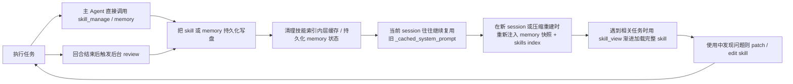

# Hermes Agent 闭环学习机制源码分析

> 本文基于当前仓库源码进行分析，重点参考 `run_agent.py`、`agent/prompt_builder.py`、`tools/skills_tool.py`、`tools/skill_manager_tool.py`、`tools/memory_tool.py`、`hermes_state.py`、`tools/session_search_tool.py`。  
> 结论先说：Hermes 的“闭环学习”不是训练意义上的 online learning，也不是带自动评测器的强化学习闭环；它更像一套把“经验沉淀”做成一等公民的运行时知识循环系统。

## 一句话结论

Hermes 把长期知识拆成了三类，并把它们嵌进了 Agent 的主循环里：

- **程序性知识**：skill，保存“怎么做”
- **声明性知识**：`MEMORY.md` / `USER.md`，保存“记住什么”
- **情节性回忆**：`state.db` + `session_search`，保存“过去发生过什么”

因此它的闭环不是“模型权重越用越更新”，而是：

1. 执行任务
2. 反思这次过程是否值得沉淀
3. 写成 skill 或 memory
4. 下次启动时把这些知识重新注入系统提示或按需加载
5. 在使用过程中继续修补、扩展、淘汰旧知识

这一方向是成立的，而且源码里确实已经有比较完整的实现；但它依然明显依赖模型判断，不是确定性管线。

## 与你 7 点描述的对照

| 方向 | 结论 | 我的判断 |
| --- | --- | --- |
| 1. 闭环触发机制 | 已实现，但偏概率型 | 有主动路径，也有后台 review 路径；都依赖模型判断，不是硬编码规则引擎 |
| 2. skill 生成与写入 | 已实现，但有边界 | 本地 skills 可创建/修改/删除；外部技能目录和插件技能不是完全可写 |
| 3. 技能加载与复用 | 已实现，而且做得比较成熟 | 渐进式加载明确存在；技能索引有 LRU + 磁盘快照双层缓存 |
| 4. 后台审查和周期性整合 | 已实现，但不是全自动“统一整理器” | memory/skill review 都有；压缩前会先 flush memory；skill 不会在压缩前单独强刷 |
| 5. 闭环执行 | 成立 | 执行、提炼、存储、索引、复用、更新这条链路在代码里能串起来 |
| 6. 局限性 | 你说得基本对，而且还能补充更多 | 缺少确定性评价、缺少冲突治理、当前会话内的新 skill 不一定立刻进入系统索引 |
| 7. 总结 | 基本准确 | Hermes 的强项是“学习作为架构能力”，而不是“学习作为模型训练能力” |

## 1. 闭环触发机制

### 1.1 主动路径：主 Agent 直接决定保存 skill

Hermes 没有把“是否创建 skill”做成一个独立的、确定性的规则引擎，而是把这件事交给主 Agent 在主循环里自主判断。换句话说，主动路径不是“代码检测到某种模式后自动写 skill”，而是“代码持续提醒模型去思考这件事，并在工具面上给它真实的落点”。这一点非常关键，因为它决定了 Hermes 的学习能力本质上是 **prompted behavior + tool affordance**，而不是硬编码流程。

#### 1.1.1 主动路径的核心定义

所谓“主动路径”，指的是：

- 主 Agent 在当前任务执行过程中
- 没有等待后台 review agent 介入
- 直接判断“这次经验值得沉淀”
- 然后自己调用 `skill_manage`

这条路径的强项是即时性。只要模型在当前上下文里已经意识到：

- 这次问题比较复杂
- 自己刚刚经历了试错
- 解决方案具有跨任务复用价值

它就可以当场把方法沉淀下来，而不必等到会话结束后再做二次审查。

但它的弱点也正来自这里：是否“意识到值得沉淀”，主要依赖模型判断，而不是规则引擎。

#### 1.1.2 第一层驱动：`SKILLS_GUIDANCE` 作为 system prompt 级行为约束

主动路径最上层的驱动力来自 `SKILLS_GUIDANCE`。它定义在 [agent/prompt_builder.py](D:/Agent/hermes-agent/agent/prompt_builder.py:164)，核心意思是：

- 完成复杂任务后要考虑保存 skill
- 修掉 tricky error 后要考虑保存 skill
- 发现 non-trivial workflow 后要考虑保存 skill
- 使用已有 skill 时如果发现它过时、缺步骤、命令错误，要立即 patch

这段话的重要性在于，它不只是“产品介绍”，而是会真正进入 system prompt，成为模型在本会话中的高优先级行为约束。

更具体地说，`_build_system_prompt()` 在组装提示词时，会把一组和工具能力相关的 guidance 拼进去：

- `MEMORY_GUIDANCE`
- `SESSION_SEARCH_GUIDANCE`
- `SKILLS_GUIDANCE`

但 `SKILLS_GUIDANCE` 不是无条件注入的。只有当前会话的 `valid_tool_names` 里真的包含 `skill_manage`，它才会进入最终 system prompt。见 [run_agent.py](D:/Agent/hermes-agent/run_agent.py:3379) 到 [run_agent.py](D:/Agent/hermes-agent/run_agent.py:3387)。

这意味着模型接收到的不是抽象建议，而是：

- 你现在拥有这个工具
- 你现在就可以用它
- 这件事应当成为你的默认工作流之一

从行为引导的角度看，`SKILLS_GUIDANCE` 改写的是模型心中的“完成定义”：

- 没有它时：把眼前问题解决即可
- 有了它时：解决问题之后，还要额外判断这次过程是否应该被沉淀为 skill

#### 1.1.3 第二层驱动：`skill_manage` 的 schema description 作为调用启发

如果说 `SKILLS_GUIDANCE` 负责告诉模型“你应该重视沉淀 skill 这件事”，那么 `skill_manage` 自身的 schema description 负责进一步告诉模型“什么情况下值得调用，以及调用时应该怎么想”。

`SKILL_MANAGE_SCHEMA` 定义在 [tools/skill_manager_tool.py](D:/Agent/hermes-agent/tools/skill_manager_tool.py:681)。它的 `description` 里包含了几类非常直接的调用启发：

- skill 是 procedural memory，也就是“怎么做”的可复用方法，而不是普通笔记
- `create`、`patch`、`edit`、`delete`、`write_file`、`remove_file` 分别适用于不同修改粒度
- 复杂任务成功、错误被克服、用户纠正后的方法更好、发现了 reusable workflow 时，应该创建 skill
- skill 过时、错误、缺步骤时，应该更新 skill
- 简单 one-off 不要沉淀
- 创建/删除前应先确认
- 好的 skill 应该包含 trigger conditions、编号步骤、准确命令、pitfalls、verification

见 [tools/skill_manager_tool.py](D:/Agent/hermes-agent/tools/skill_manager_tool.py:691) 到 [tools/skill_manager_tool.py](D:/Agent/hermes-agent/tools/skill_manager_tool.py:699)。

这一层更像是：

- API 使用手册
- 经验沉淀判断手册
- skill 质量标准清单

它不会像 system prompt 那样全局改变模型人格，但会在模型准备发起 tool call 时显著影响它的选择：

- 是不是现在该调用 `skill_manage`
- 是用 `create` 还是 `patch`
- 写出来的 skill 应该长什么样

##### `skill_manage` 各动作的边界：`patch`、`edit`、`write_file`、`remove_file` 并不等价

这里有一个很容易被混淆的点：`patch`、`edit`、`write_file`、`remove_file` 都属于“操作 skill”，但它们操作的对象层级并不相同。

从实现上看，`skill_manage()` 会按 `action` 分发到不同处理函数，见 [tools/skill_manager_tool.py](D:/Agent/hermes-agent/tools/skill_manager_tool.py:616)。其中：

- `create` -> `_create_skill()`：创建一个新的 skill
- `edit` -> `_edit_skill()`：整篇替换 `SKILL.md`
- `patch` -> `_patch_skill()`：对 `SKILL.md` 或某个 supporting file 做局部替换
- `write_file` -> `_write_file()`：新增或覆盖 supporting file
- `remove_file` -> `_remove_file()`：删除 supporting file
- `delete` -> `_delete_skill()`：删除整个 skill

它们的关系可以概括为下表：

| 动作 | 主要改什么 | 适合场景 | 特点 |
| --- | --- | --- | --- |
| `create` | 新建整个 skill | 以前没有这类方法，需要第一次沉淀 | 创建 skill 目录和 `SKILL.md` |
| `patch` | 局部修改 `SKILL.md` 或某个 supporting file | 修一个错误命令、补一步、替换一小段说明 | 默认改 `SKILL.md`，带 `file_path` 时也能改附属文件 |
| `edit` | 整篇替换 `SKILL.md` | 结构重写、大范围改写、全面重构 | 需要提供完整新正文 |
| `write_file` | 新增或覆盖 supporting file | 增加 `references/`、`templates/`、`scripts/`、`assets/` 中的文件 | 不是局部改，而是整份写入/覆盖 |
| `remove_file` | 删除 supporting file | 删除过时模板、旧脚本、旧参考文档 | 只删附属文件，不删整个 skill |
| `delete` | 删除整个 skill 目录 | 整个 skill 废弃 | 风险最大，语义最强 |

其中最关键的两个区别是：

- `patch` vs `edit`：
  `patch` 是“手术刀式”的局部修补，优先用于修错命令、补坑点、更新一小段说明；`edit` 是“整页重写”，适合 major overhaul。Hermes 在 schema description 里明确把 `patch` 作为 preferred for fixes，把 `edit` 定位成 full rewrite for major overhauls，见 [tools/skill_manager_tool.py](D:/Agent/hermes-agent/tools/skill_manager_tool.py:685) 之后的 schema 文本。
- `patch` / `edit` vs `write_file` / `remove_file`：
  前两者主要围绕 skill 的正文或既有文件内容做修改，后两者主要围绕 skill 目录中的 supporting files 做增删。也就是说，`write_file` 和 `remove_file` 确实也是“操作 skill”，但它们更偏向维护 skill 的配套材料，而不是重写 skill 主文档。

还有一个实现细节很值得注意：`patch` 的能力其实比直觉里更大。它默认 patch 的是 `SKILL.md`，但如果显式传入 `file_path`，也可以去 patch 某个 supporting file；相比之下，`write_file` 是整份写入或覆盖文件，不是局部替换。这意味着 Hermes 在动作设计上故意把“局部改”和“整份写”分开了，以降低模型做 skill 维护时的破坏性。

#### 1.1.4 第三层驱动：skills index 让模型先“看到技能世界”

主动路径不只是“知道有 `skill_manage` 这个写入工具”，还包括模型先被置于一个“技能优先”的认知环境里。

Hermes 会在 system prompt 里注入一个 skills index。这不是工具，而是一段由 `build_skills_system_prompt()` 动态生成的技能目录，见 [agent/prompt_builder.py](D:/Agent/hermes-agent/agent/prompt_builder.py:583) 和 [run_agent.py](D:/Agent/hermes-agent/run_agent.py:3452) 之后的调用链。

这个 index 通常只包含：

- 分类
- 技能名
- 简短描述

它不会把所有技能正文一股脑塞进上下文，但它会明确告诉模型：

- 当前有哪些 skill 存在
- 应该优先去加载相关 skill
- 如果 skill 有问题，应该用 `skill_manage(action='patch')` 修复

这一点很重要，因为它会反过来强化主动路径的另外一面：不只是“我可以创建 skill”，而且是“我当前身处一个技能系统中，skill 是主要工作载体之一”。

与它配套的两个工具是：

- `skills_list`：返回最小化的技能元数据，相当于工具化的目录查询
- `skill_view`：真正加载某个 skill 的正文和相关 supporting files

也就是说，Hermes 给模型构造的是一个完整的工作心智：

1. 先知道有哪些 skill
2. 遇到相关任务先加载 skill
3. 发现 skill 不足就 patch
4. 发现新方法就 create

主动路径正是在这个技能化工作环境中发生的。

#### 1.1.5 主循环里的“持续压力”：不是自动创建器，而是注意力维持器

Hermes 还做了一件很 subtle 但很重要的事：在主循环里持续统计“距离上次使用 `skill_manage` 已经经历了多少轮工具迭代”。

见 [run_agent.py](D:/Agent/hermes-agent/run_agent.py:8655) 到 [run_agent.py](D:/Agent/hermes-agent/run_agent.py:8657)。

这段逻辑本身**不会直接创建 skill**。它的作用不是：

- 满 10 次工具调用就自动写一个 skill

而是：

- 维持系统对“经验可能值得沉淀”的注意力
- 为后续的 skill review 提供触发条件

也就是说，这个计数器本质上是一个“注意力维持器”，不是“自动落盘器”。

它和主动路径的关系是：

- 主动路径：当前任务里模型自己想到并调用 `skill_manage`
- review 路径：如果当前没想到，系统后面还有一次回头看这件事的机会

因此 Hermes 的设计不是“只赌模型当场想起来”，而是“当场想起来最好，想不起来后面再补审一次”。

#### 1.1.6 从“想到要保存”到“真正落盘”的路由链

主动路径还包含一个容易被忽略的点：模型不是只在脑子里“决定一下”，而是决定后真的要走完整工具链。

这条链路可以拆成下面几步：

1. `SKILLS_GUIDANCE` 和 `skill_manage` schema description 共同影响模型判断
2. 模型输出一个 `tool_call`，函数名为 `skill_manage`
3. `run_agent.py` 在工具执行阶段接收到这个调用
4. 调用会进入 `handle_function_call()`，见 `model_tools.py`
5. 再由 `registry.dispatch()` 找到注册好的 handler
6. handler 进入 `skill_manage(action=..., name=..., ...)`
7. `skill_manage()` 再按 `action` 分发到 `_create_skill()`、`_patch_skill()`、`_edit_skill()` 等具体函数

这里有一个很重要的工程事实：

- `skill_manage` 不是像 `memory`、`todo` 那样的 agent-level 特殊工具
- 它走的是 Hermes 的通用 registry dispatch 路径

所以主动路径从工程上不是“主 Agent 内部有一段私有魔法逻辑自动存技能”，而是：

- 模型做判断
- 模型显式发 tool call
- Hermes 用统一工具分发机制执行

这让 skill 沉淀既是“智能行为”，也是“标准工具调用”。

#### 1.1.7 为什么说它是 LLM judgment-driven，而不是 deterministic trigger

综合上面几层，我们可以更准确地给主动路径下定义：

- Hermes 并没有写一条类似 “如果工具调用超过 5 次，就自动创建 skill” 的硬规则
- Hermes 也没有在主循环里内置一个独立的判别器，把本轮轨迹打分后自动保存
- Hermes 做的是把“该不该沉淀”“怎么沉淀”“沉淀成什么样”这些信息都暴露给模型
- 然后由模型在当前任务过程中自己决定是否调用 `skill_manage`

因此这条路径的本质是：

- 不是代码在“检测到某种条件后必定创建 skill”
- 而是代码把能力、时机判断、质量要求和执行接口都暴露给模型
- 模型再在主任务执行过程中自己决定是否触发 skill 沉淀

如果要更严格地表述，应该说：

> Hermes 支持主 Agent 在任务过程中主动把经验沉淀为 skill，但这个触发是 **LLM judgment-driven** 的运行时行为，不是 deterministic trigger，也不是规则引擎自动落盘。

#### 1.1.8 具体什么场景下，主 Agent 会比较合理地调用 `skill_manage`

前面的分析解释了“为什么模型会想到这件事”，但如果要真正理解主动路径，还需要落到非常具体的任务场景上。一个简单判断标准是：

> 当当前任务产出的不再只是“一次性的答案”，而是一套未来还会反复用到的方法时，`skill_manage` 就开始变得合理。

下面是几类最典型的调用场景。

##### 场景 A：复杂任务做成了，并形成了可复用流程

这是最标准的 `create` 场景。

例如用户让 Hermes 排查一个 Python 服务无法启动的问题，主 Agent 在当前任务中连续做了这些事：

1. 读取配置文件
2. 查看启动日志
3. 发现环境变量缺失
4. 继续追到 `.env` 加载顺序有误
5. 最后补出正确的启动顺序和验证命令

如果模型意识到：

- 这不是一个单点答案，而是一条多步排障路径
- 中间经历了试错和收敛
- 最终已经形成了“以后还能复用”的方法

那么它就很有可能调用：

- `skill_manage(action="create", ...)`

这类 skill 通常会沉淀成：

- 触发条件：什么时候该用这套排障法
- 编号步骤：先查什么、再查什么
- pitfalls：常见误判点
- verification：最后怎么确认修好

##### 场景 B：用户纠正了模型，并暴露出稳定的团队规范

这也是很典型的 `create` 场景。

比如用户在对话中明确说：

- 不要用 `pip install`
- 我们团队统一用 `uv pip install`
- 测试统一先跑 `python -m pytest tests/unit -q`

如果模型判断这些不是一次性偏好，而是当前环境里的稳定工作约定，那么它就有理由把这些经验沉淀成一个本地 workflow skill。

这里沉淀的不是“用户刚才说过一句话”，而是：

- 这个环境里的正确操作方式
- 以后再做类似任务时，应该优先遵循的本地规范

##### 场景 C：使用已有 skill 时，发现它已经过时

这是最典型的 `patch` 场景。

例如主 Agent 先加载了一个已有 skill，里面写的是：

- `docker-compose up`
- 旧版 CLI 参数
- 已经过期的路径布局

但它在当前任务执行中发现：

- 现在应该用 `docker compose up`
- 参数名称已经变了
- 原验证命令不再成立

这时最合理的动作通常不是新建 skill，而是：

- `skill_manage(action="patch", ...)`

因为这里的核心不是“发现了全新方法”，而是“现有方法需要被局部修补”。

##### 场景 D：skill 主文档整体结构已经不适合继续 patch

这是更适合 `edit` 的场景。

例如一个已有 skill 虽然主题没错，但正文组织极差：

- 没有 trigger conditions
- 步骤顺序混乱
- 命令散落在段落里
- 没有 pitfalls
- 没有 verification

如果模型判断继续小修小补已经不划算，而应该整体重写 `SKILL.md` 的结构，那么更合理的动作是：

- `skill_manage(action="edit", ...)`

这里体现的正是 `patch` 与 `edit` 的边界：

- `patch` 适合局部修补
- `edit` 适合 major overhaul

##### 场景 E：skill 主文档足够清楚，但需要补 supporting files

这是 `write_file` 的典型场景。

例如主 Agent 刚创建了一个新 skill，`SKILL.md` 已经把主流程讲清楚了，但它还希望补上配套材料，例如：

- `references/api.md`
- `templates/config.yaml`
- `scripts/check_env.py`

这时候模型可能不会去大改 `SKILL.md`，而是直接：

- `skill_manage(action="write_file", ...)`

这说明 Hermes 的 skill 不是单一 Markdown 文档，而是可以逐渐长成“主说明 + 配套材料”的知识包。

##### 场景 F：supporting file 已经过时，需要移除

这是 `remove_file` 的典型场景。

例如某个 skill 目录里还有一个：

- `templates/legacy-config.yaml`

模型在实际执行中发现这个模板已经彻底废弃，继续保留只会误导未来任务，那么合理动作就是：

- `skill_manage(action="remove_file", ...)`

这类操作虽然不是改 `SKILL.md` 本身，但仍然是在维护 skill 的整体质量。

##### 场景 G：整个 skill 都不再有价值

这是最少见但也最强语义的 `delete` 场景。

例如某个 skill 完全建立在一个已经下线的内部平台上，而主 Agent 在当前任务中确认：

- 平台已经废弃
- skill 无法通过 patch 或 edit 挽救
- 保留它只会制造错误引导

这时才可能合理地调用：

- `skill_manage(action="delete", ...)`

之所以说它最少见，是因为 `delete` 的破坏性最大，通常需要更强的确定性。

##### 场景 H：哪些情况通常不应该调用 `skill_manage`

反过来说，很多任务虽然完成了，但并不值得 skill 化。

通常不该调用 `skill_manage` 的场景包括：

- 只是回答了一个单次事实问题
- 只是做了一个很简单的一步操作
- 只是临时生成了一段一次性文本
- 没有形成稳定流程，只是碰巧试出来一次
- 用户明确表示“别保存”“这只是临时的”

例如：

- “把这句话翻译成英文”
- “查一下这个文件有多少行”
- “把 README 里一个错别字改掉”

这些通常都不值得创建 skill，因为它们没有形成可复用方法。

##### 一个非常实用的经验判断

主 Agent 更可能合理调用 `skill_manage`，通常是因为同时满足了下面两三条：

- 任务用了多步工具链，而不是一次性回答
- 中间有试错、修正、路线调整
- 最终形成了可复用的方法
- 这个方法以后大概率还会再用
- 如果不沉淀，下次很可能重复踩坑

如果把它压缩成一句话，可以记成：

- 有新套路了 -> `create`
- 旧套路错了 -> `patch`
- 旧套路得重写 -> `edit`
- 套路要补材料 -> `write_file`
- 套路附件该删了 -> `remove_file`
- 套路彻底作废 -> `delete`

### 1.2 后台路径：对话结束后 fork 一个 review agent

这一点源码里是明确落地的，而且它和 1.1 的“主 Agent 当场自觉沉淀”很不一样。  
如果说 1.1 讲的是 **在线执行中的主动保存**，那么 1.2 讲的是 **回合结束后的异步复盘**：用户已经拿到主回答，主 Agent 不再占着前台注意力，系统再悄悄起一个 review agent 回头看“刚才那段对话里，有没有值得补存的 memory 或 skill”。

#### 1.2.1 后台路径的核心定义

所谓“后台路径”，指的是：

- 当前回合的主响应已经生成
- 用户这一轮没有打断
- 系统通过 `_should_review_memory` / `_should_review_skills` 判断这轮对话已经积累了足够多的可复盘信号
- 于是额外启动一个后台 review agent
- 让它基于刚才的对话快照，自行判断是否要写 memory / skill

和 1.1 最大的差异在于：

- 1.1 是 **主 Agent 在执行任务时顺手沉淀**
- 1.2 是 **系统在回合结束后补做一次“经验审计”**

所以后台路径的设计目标不是“取代主动路径”，而是：

- 尽量补上主 Agent 当场没想到沉淀的那部分经验
- 又不打断当前用户拿结果

这里可以先把 1.2 和 1.3 的分工记住：

- **1.2 讲的是后台路径的执行形态**：什么时候 fork、fork 出来的 agent 做什么、写回哪里
- **1.3 讲的是后台路径的触发机制**：`_should_review_memory` / `_should_review_skills` 怎么算、计数器怎么维护、何时真正满足补审条件

#### 1.2.2 触发时机：一定发生在主响应之后，而不是抢占前台

后台路径最重要的工程特点，是它严格发生在主响应之后。

`run_conversation()` 的尾部会先确认这几个条件：

- 已经拿到了 `final_response`
- 当前回合没有被 `interrupted`
- `_should_review_memory` 或 `_should_review_skills` 至少有一个为真

满足后才会调用 `_spawn_background_review(...)`，见 [run_agent.py](D:/Agent/hermes-agent/run_agent.py:11320) 到 [run_agent.py](D:/Agent/hermes-agent/run_agent.py:11343)。

这里 1.2 先只强调“后台 review 的启动发生在主响应之后”。至于这两个条件本身：

- 为什么要拆成 memory / skill 两个门控位
- `_should_review_memory` 为什么按 user turn 计数
- `_should_review_skills` 为什么按 tool iteration 计数

这些更底层的触发逻辑，会在 1.3 里专门拆开说明。

源码注释也写得很明确：

- “Background memory/skill review — runs AFTER the response is delivered”
- “so it never competes with the user's task for model attention”

这正是后台路径与主动路径的本质区别之一：

- 主动路径发生在“做事中”
- 后台路径发生在“做完后”

因此它不会影响当前主回答的完成节奏，也不会把“是否该沉淀经验”这件事塞回主 Agent 的注意力主通道。

#### 1.2.3 后台 review 审查什么：memory、skill 与 combined prompt

这一节最容易混淆的地方，是把“审查对象”和“prompt 形式”混成一件事。

##### 审查对象：后台 review 真正处理的是哪两类长期知识

更准确地说，Hermes 的后台 review 真正要处理的长期知识，其实只有两类：

- **memory**：用户偏好、persona、沟通方式、工作习惯、协作期待、长期有效的环境事实
- **skill**：一类任务的可复用做法、试错后形成的稳定路径、应写进操作手册的流程知识

也就是说，后台路径不是单一的“自动建 skill 线程”，而是一个围绕 **两类长期知识沉淀** 组织起来的异步复盘子系统：

- memory review 负责回答“这段协作关系里，有什么以后还该记住”
- skill review 负责回答“这次做事过程中，有什么以后还该复用”

这也正好对应到 1.3 里的两套触发条件：

- `memory review` 之所以单独存在，是因为 Hermes 认为“长期记忆沉淀”应该按 user turn 节奏去检查
- `skill review` 之所以单独存在，是因为 Hermes 认为“方法论沉淀”更应该按复杂工具工作量去检查

换句话说，1.2 在这里讲的是“后台 review 分成哪两类知识审查”，而 1.3 继续往下讲的是“这两类审查为什么分别由不同计数器驱动”。

##### prompt 定义与选择逻辑：为什么是三个 prompt，而不是三类知识

在这两类审查对象之上，Hermes 又定义了三种 review prompt，见：

- `_MEMORY_REVIEW_PROMPT`，定义于 [run_agent.py](D:/Agent/hermes-agent/run_agent.py:2340)
- `_SKILL_REVIEW_PROMPT`，定义于 [run_agent.py](D:/Agent/hermes-agent/run_agent.py:2351)
- `_COMBINED_REVIEW_PROMPT`，定义于 [run_agent.py](D:/Agent/hermes-agent/run_agent.py:2361)

它们的关系不是“三种不同知识类型”，而是：

- `memory prompt`：只审 memory
- `skill prompt`：只审 skill
- `combined prompt`：一次同时审 memory 和 skill

因此，`_COMBINED_REVIEW_PROMPT` 不是第三类独立审查对象，而只是一个工程上的合并执行入口。它的意义在于：

- 避免同一轮同时 fork 两个 review agent
- 让一次后台补审同时覆盖两条知识沉淀通道
- 降低额外模型调用和异步并发复杂度

这也和 1.3.7 的结论是对齐的：当 `_should_review_memory` 和 `_should_review_skills` 同时为真时，Hermes 不会起两个 review agent，而是选择 `_COMBINED_REVIEW_PROMPT` 走一次合并补审。

所以，如果把 1.2.3 压缩成一句话，可以这样概括：

> Hermes 的后台 review 不是只做 skill 审查，而是围绕 memory 与 skill 两类长期知识展开；三种 review prompt 只是这两类审查任务及其合并执行方式的不同入口。

##### prompt 如何引导 LLM：把 review agent 限定在“记忆筛选”或“方法提炼”的视角里

这里要强调一个很重要的点：这三个并不是“三个不同的 review agent”，而是**同一个后台 review agent 在启动时可选的三种复盘任务说明**。

它们的共同作用，不是给模型补充知识，而是**约束模型的复盘视角**，让 review agent 不要泛泛地回顾整段对话，而是带着明确问题去检查“有没有值得沉淀的长期知识”。

`_MEMORY_REVIEW_PROMPT` 的思路是把 review agent 暂时变成一个“长期记忆筛选器”。

它刻意把模型的注意力引向：

- 用户是谁、有什么偏好、透露了哪些长期稳定的信息
- 用户希望 agent 以后如何配合、如何表达、如何工作

它要避免的是让模型把 memory 存成：

- 一次性任务细节
- 短期执行过程
- 普通对话摘要

也就是说，这个 prompt 的真正作用不是“让模型回忆任务”，而是“让模型判断这段关系里有没有以后还该记住的东西”。

`_SKILL_REVIEW_PROMPT` 的思路则不同，它是把 review agent 暂时变成一个“可复用方法提炼器”。

它刻意关注的不是：

- 任务有没有完成
- 用户画像是什么

而是：

- 这次是否采用了 non-trivial approach
- 过程中是否经历了 trial and error
- 是否因为经验发现而 changed course
- 是否暴露出一种以后还能复用的更优方法

所以它关注的是“过程中的方法论价值”，而不是“这次具体做了什么”。

`_COMBINED_REVIEW_PROMPT` 则是在工程上把前两者合并成一次后台复盘。

它的作用不是简单把两个 prompt 拼接起来，而是先在 prompt 内部替模型做了一次任务分栏：

- 一栏检查 memory：有没有用户偏好、persona、协作方式值得记
- 一栏检查 skills：有没有非平凡做法、试错经验、流程知识值得沉淀

这样可以避免 Hermes 为同一轮同时起两个 review agent，也能减少两种知识沉淀之间的混淆。

这三个 prompt 还有一个共同的设计特点：它们都带了一个保守收口。

也就是：

- 只有真的有东西值得保存才动手
- 如果没有，就直接 `"Nothing to save."`

这一点非常关键，因为它是在压制 LLM “什么都想记下来”的倾向，避免：

- 普通任务也被写成 skill
- 一次性信息被写进 memory
- 后台 review 变成泛滥的自动归档器

如果把它们压缩成一句话，可以这样理解：

- `_MEMORY_REVIEW_PROMPT` 负责让后台 review agent 关注“这个人和这段协作关系里，有什么以后还该记得”
- `_SKILL_REVIEW_PROMPT` 负责让后台 review agent 关注“这次做事过程中，有什么以后还该复用”
- `_COMBINED_REVIEW_PROMPT` 负责让一次后台复盘同时覆盖这两类长期知识沉淀

#### 1.2.4 review agent 不是轻量 summarizer，而是一次真正的 agent fork

真正执行后台 review 的函数是 `_spawn_background_review()`，定义在 [run_agent.py](D:/Agent/hermes-agent/run_agent.py:2375)。

从实现形态上看，它不是做一个简短的字符串摘要，也不是写死一段规则判断，而是：

- 在后台线程里 new 一个新的 `AIAgent`
- 继承主会话的 `model`
- 继承 `provider`
- 继承 `platform`
- 把刚才的完整 `messages_snapshot` 当作 `conversation_history` 喂进去
- 再追加一条 review prompt，当成新一轮 user message 让 review agent 去跑

实现上可以看到：

- `review_agent = AIAgent(model=self.model, max_iterations=8, quiet_mode=True, platform=self.platform, provider=self.provider)`
- 然后 `review_agent.run_conversation(user_message=prompt, conversation_history=messages_snapshot)`

见 [run_agent.py](D:/Agent/hermes-agent/run_agent.py:2405) 到 [run_agent.py](D:/Agent/hermes-agent/run_agent.py:2418)。

因此，把它理解成“完整 agent fork”是成立的，但要比 1.1 更精确一点：它不是复制整个进程状态，而是复制一套足以做复盘决策的关键运行语境：

- 同模型
- 同 provider
- 同平台
- 同一段对话历史快照
- 同样的工具面

这也是为什么它能做的不只是“看一眼总结一下”，而是真正调用工具去改 memory 或 skill。

#### 1.2.5 它写回的是共享存储，而不是私有草稿

后台路径最有力量的一点在于：review agent 的输出不是“建议”，而是可以直接落到共享存储。

代码注释明确写了：

- “Writes directly to the shared memory/skill stores”

实现上也能看到它会把主 Agent 的 memory 相关状态直接挂给 review agent：

- `review_agent._memory_store = self._memory_store`
- `review_agent._memory_enabled = self._memory_enabled`
- `review_agent._user_profile_enabled = self._user_profile_enabled`

见 [run_agent.py](D:/Agent/hermes-agent/run_agent.py:2411) 到 [run_agent.py](D:/Agent/hermes-agent/run_agent.py:2416)。

这意味着后台 review 的结果不是“另存一份待审核草稿”，而是：

- 真正更新 `MEMORY.md` / `USER.md`
- 真正创建或更新 skill

因此后台路径是 Hermes 闭环里非常关键的一环：它能把“本轮已经过去的经验”重新接回长期知识层。

#### 1.2.6 它会刻意避免 review 套 review 的递归链

后台路径里有一个很重要但很容易忽略的工程细节：review agent 会把自己的 memory / skill nudge interval 清零。

代码里有两句非常关键：

- `review_agent._memory_nudge_interval = 0`
- `review_agent._skill_nudge_interval = 0`

见 [run_agent.py](D:/Agent/hermes-agent/run_agent.py:2415) 到 [run_agent.py](D:/Agent/hermes-agent/run_agent.py:2416)。

这意味着 review agent 自己不会在执行 review 的过程中再触发新一轮 review。否则系统就可能出现：

- 主 Agent 结束 -> 启动 review agent
- review agent 又满足条件 -> 再启动 review agent
- 无限递归

这也是后台路径和主动路径在工程约束上的另一个重要差异：

- 主动路径主要考虑“怎么让模型想到去保存”
- 后台路径还必须考虑“怎么避免异步补审机制自我递归”

#### 1.2.7 它是静默执行的，但不是完全无痕

后台 review 会尽量静默，不去污染用户当前看到的主回答。

实现上它会：

- 打开 `os.devnull`
- 用 `contextlib.redirect_stdout` / `redirect_stderr` 把 review agent 的标准输出吃掉
- `quiet_mode=True`

见 [run_agent.py](D:/Agent/hermes-agent/run_agent.py:2401) 到 [run_agent.py](D:/Agent/hermes-agent/run_agent.py:2410)。

但它又不是完全无痕，因为 Hermes 还是会在 review 完成后扫描 review agent 的工具消息，把成功动作总结成一个简短提示：

- skill created
- skill updated
- memory updated
- user profile updated

这些 summary 会：

- 用 `_safe_print()` 打一条很短的提示
- 如果配置了 `background_review_callback`，还会通过 callback 发给 gateway

见 [run_agent.py](D:/Agent/hermes-agent/run_agent.py:2420) 到 [run_agent.py](D:/Agent/hermes-agent/run_agent.py:2454)。

所以它的用户体验策略不是“把后台过程完全暴露”，而是：

- 执行过程尽量无感
- 结果发生了重要沉淀时，再给一个极小的可见提示

#### 1.2.8 典型场景：后台路径最适合捡漏哪些经验

后台路径最适合补上的，通常是那些：

- 主 Agent 当时忙于完成任务，没空显式沉淀
- 但从事后看明显有复用价值
- 或者对 memory 很重要、但不适合插进主回答里的信息

例如下面几类场景就特别适合后台 review：

##### 场景 A：主 Agent 成功解决了复杂问题，但当场没显式建 skill

比如主 Agent 通过多步工具调用终于排查出了一个部署问题，主回答顺利给用户交付了修复方案，但它没有在前台顺手调用 `skill_manage`。

这时后台 review 会比较适合回头检查：

- 刚才是不是形成了一条成熟的 troubleshooting workflow
- 这条 workflow 值不值得写成 skill

也就是说，后台路径在这里扮演的是“补建档”的角色。

##### 场景 B：对话里透露了用户偏好，但主任务不适合被打断去存 memory

例如用户在任务过程中随口透露：

- 讨厌冗长回答
- 团队统一使用某个命令风格
- 希望以后默认按某种格式输出

这些信息对长期协作很有价值，但主 Agent 当时的注意力可能都放在完成任务上。  
后台 memory review 就非常适合把这些稳定偏好补记下来。

##### 场景 C：主 Agent 用了某个旧 skill，并在执行中踩到了它的坑

主 Agent 在前台也许只是完成了任务，没有顺手 patch 旧 skill；后台 skill review 则会回头看：

- 这次是不是暴露了 skill 的过时点
- 是否应当更新已有 skill，而不是创建新 skill

这让 Hermes 的 skill 维护不完全依赖主 Agent 的即时自觉。

#### 1.2.9 后台路径的边界：它是 best-effort 补审，不是强一致审计系统

虽然后台路径很强，但也要避免说得过满。

它的边界至少有这几条：

- 它只在本轮有 `final_response` 且未被打断时触发
- 它是 best-effort，异常会被吞掉并写 debug log，不会反过来影响主回答
- 它的判断仍然依赖 LLM，不是规则审计器
- 它有 `max_iterations=8` 的上限，不会无限探索
- 它完成后会主动 `close()` review agent，避免资源泄漏

见 [run_agent.py](D:/Agent/hermes-agent/run_agent.py:2405)、[run_agent.py](D:/Agent/hermes-agent/run_agent.py:2462) 以及 `finally` 里的清理逻辑。

因此更准确地说，后台路径不是“严格的事务型学习管线”，而是：

- 一次异步的、静默的、受限步数的经验复盘
- 用来补救主 Agent 没来得及或没意识到沉淀的知识

#### 1.2.10 对后台路径的准确总结

如果要把 1.2 压缩成一句话，可以这样描述：

> Hermes 在每轮任务完成后，都会在满足条件时异步 fork 一个 review agent，让它基于刚刚的对话快照做一次“经验补审”，并把值得长期保留的 memory / skill 直接写回共享知识层，同时尽量不打断用户当前体验。

#### 1.2.11 forked review agent 与 prompt cache 的关系：不继承主会话缓存，但仍运行在同一套 cache-safe 机制里

这一点很容易被误解，所以最好拆成两层来看。

第一层，是**它不会继承主 Agent 当前这条会话已经建立好的 cache-safe 状态**。

源码里后台审查不是“复用主 Agent 对象再多跑一轮”，而是在 [run_agent.py](D:/Agent/hermes-agent/run_agent.py:2405) 重新构造了一个新的 `AIAgent(...)`：

- 它会继承一些高层配置，比如 `model`、`platform`、`provider`
- 它会共享 memory store 等长期存储对象
- 但它不是主 Agent 自身的续跑，也不会把主 Agent 里已经形成的运行时缓存状态直接带过去

这意味着主 Agent 当前会话里的这些东西，不会原封不动地被 review agent 继承：

- 已经构建好的 `_cached_system_prompt`
- 当前会话内部累计出来的计数器状态
- 已固定下来的 prompt 前缀
- 本轮已经形成的 prompt cache 命中条件

从 prompt cache 的角度看，后台 review 更像是**开启了一条新的独立会话链路**，而不是“沿着主链继续往下跑”。

第二层，是**它虽然不继承主会话已有缓存状态，但它自己仍然运行在同一套 cache-safe 设计之下**。

也就是说，review agent 不是一个完全特殊的旁路实现，它仍然是标准 `AIAgent`。而 `AIAgent` 本身就遵循 Hermes 那套缓存友好的基本原则：

- system prompt 会缓存到 `_cached_system_prompt`
- `_build_system_prompt()` 的设计目标就是“每个 session 构建一次，然后复用”，见 [run_agent.py](D:/Agent/hermes-agent/run_agent.py:3349)
- memory 注入采取“冻结快照”策略，`load_from_disk()` 之后面向 system prompt 的内容不会在会话中途实时漂移，见 [tools/memory_tool.py](D:/Agent/hermes-agent/tools/memory_tool.py:121) 和 [tools/memory_tool.py](D:/Agent/hermes-agent/tools/memory_tool.py:363)

所以更准确地说：

- 它**不会继承主 Agent 已经命中的那份缓存上下文**
- 但它**会在自己的那条 review 会话里重新建立一套 cache-safe 的稳定前缀**

这两句话并不矛盾，反而正好说明 Hermes 的设计边界很清晰。

##### 为什么它天然很难直接“吃到”主 Agent 那份 prompt cache

即使不看对象实例是否复用，只看输入构成，review agent 也很难直接复用主 Agent 当前那份 prompt cache 前缀，因为它的输入条件已经变了：

- 它是一个新建的 `AIAgent`
- 它的下一条 user message 不是用户原问题，而是 review prompt
- review prompt 还分 memory review / skill review / combined review 三种
- `conversation_history` 是一份当下截取的 `messages_snapshot`

更进一步，Hermes 的 system prompt 里还会写入会话起始时间、session id、模型、provider 等信息，见 [run_agent.py](D:/Agent/hermes-agent/run_agent.py:3483)。这也意味着 review agent 即使和主 Agent 使用同一模型，其 system prompt 前缀通常也不是完全相同的。

因此，Hermes 真正重点保护的，是**主对话链路内部的缓存稳定性**；而后台 fork 的 review agent，更偏向“独立、安静、尽量低干扰地完成一次补审”，并没有被专门设计成要跨实例复用主会话 prompt cache。

##### 一个更不容易混淆的总结说法

如果要非常精炼地概括这一点，可以这样说：

> forked review agent 不继承主 Agent 已经建立好的 cache-safe 状态；它只是运行在同一套 cache-safe 架构里，但会以一个新的独立会话重新建立自己的稳定前缀。

### 1.3 后台 review 的触发逻辑：计数器、prompt 与启动时机

这是理解 Hermes 闭环机制时最容易被说得过头的地方。

源码里并没有一个明确的“任务成功率评估器”或“技能复用率评估器”。它的触发更像是：

- **memory review**：按用户轮次计数，达到 `memory.nudge_interval` 后触发。默认值在 `run_agent.py:1206-1215`。
- **skill review**：按“自上次使用 `skill_manage` 以来的工具迭代次数”计数，达到 `skills.creation_nudge_interval` 后触发。默认值在 `run_agent.py:1331-1334`，计数逻辑在 `run_agent.py:8655-8657`，触发检查在 `run_agent.py:11320-11324`。

所以它更准确的机制是：

- 先用计数器判断“是否值得回顾”
- 再由 review prompt 让模型做语义层面的判断

而不是：

- 先做客观评测
- 再把高分方案自动固化

这也是为什么 Hermes 的闭环很强，但仍然带有明显的概率性质。

#### 1.3.1 为什么后台 review 需要双门控，而不是每轮 user turn 结束都 fork

这一小节真正要回答的，其实不是“为什么有两个布尔条件”这么表层的问题，而是：

- 为什么 Hermes 不在每个 user turn 结束后都无脑 fork 一个 review agent
- 为什么即使要 fork，也要拆成 `memory` 和 `skill` 两条独立门控

##### 先说第一层：**不是每一轮对话都值得补审**

很多 user turn 只是：

- 一个简短追问
- 一次确认或澄清
- 一个非常一次性的微小任务
- 普通聊天或礼貌性回应

这类回合往往既没有形成：

- 值得长期保存的用户偏好或协作信息

也没有形成：

- 值得沉淀成 skill 的可复用方法

如果每轮都强制 fork 一个 review agent，会带来四类明显问题：

- **成本膨胀**：后台 review 不是零成本钩子，而是真的会 `new AIAgent(...)` 再跑一轮补审，见 [run_agent.py](D:/Agent/hermes-agent/run_agent.py:2405)
- **噪声增加**：LLM 很容易把普通回合也“总结出点什么”，导致 memory / skill 过度归档
- **知识层被污染**：一次性信息、低价值经验、碎片化方法更容易被写进长期存储
- **工程上没有必要**：Hermes 把后台 review 定位成 best-effort 的补审器，而不是每轮必跑的事务后置钩子，真正 fork 前还要求 `final_response` 存在、未被打断、并且至少一个 review 条件为真，见 [run_agent.py](D:/Agent/hermes-agent/run_agent.py:11338)

因此，`_should_review_memory` / `_should_review_skills` 的第一层作用，就是把 forked review agent 从“每轮必跑的机械复盘器”变成“有信号才启动的选择性补审器”。

##### 再说第二层：**即使决定要补审，也不能只用一个统一的 review 条件**

这是因为 Hermes 在后台补审时，真正要处理的是两类不同的长期知识对象：

- **memory**：用户偏好、沟通方式、工作习惯、项目约定、环境事实
- **skill**：一类任务的可复用做法、步骤、排错套路、试错后形成的方法

它们的目标文件也不同：

- memory 最终写到 `MEMORY.md` / `USER.md`，见 [tools/memory_tool.py](D:/Agent/hermes-agent/tools/memory_tool.py:1)
- skill 最终写到 `~/.hermes/skills/.../SKILL.md` 及 supporting files，见 [tools/skill_manager_tool.py](D:/Agent/hermes-agent/tools/skill_manager_tool.py:681)

更关键的是，它们“成熟”的节奏并不一样。

`memory review` 更适合回答：

- 经过这么多轮交流，用户有没有逐渐暴露出稳定偏好、协作方式、长期事实

所以它天然更适合按 **user turn 节奏** 去检查。

`skill review` 更适合回答：

- 最近是不是做了不少复杂工具工作
- 过程中有没有试错、改路线、形成可复用的方法论

所以它天然更适合按 **tool-calling iteration 的工作量节奏** 去检查。

如果把两者混成一个统一条件，就会出现典型失真：

- 聊天轮次很多，但并没有发生复杂工具工作，却被迫频繁做 skill review
- 工具工作很复杂，但用户轮次不多，结果又容易错过 skill review

因此，这两个条件的第二层作用，是把后台补审按知识类型做分流：

- `memory` 走偏“关系与长期偏好”的检查路径
- `skill` 走偏“方法与流程复用”的检查路径

所以更准确地说，Hermes 的设计不是“一个 review 触发器”，而是：

- 一个用来控制 **是否值得 fork**
- 再用来决定 **该 fork 成哪种 review**

的双门控机制。

#### 1.3.2 `_should_review_memory`：它不是“换了用户才加一”，而是“来了一个新的 user turn 就加一”

这一点非常容易被误解。

`_should_review_memory` 依赖的不是“不同用户数量”，而是计数器 `self._turns_since_memory`。初始化见 [run_agent.py](D:/Agent/hermes-agent/run_agent.py:1208)，计算逻辑见 [run_agent.py](D:/Agent/hermes-agent/run_agent.py:8375)。

它真正统计的是：

- 距离上次真正处理 memory 之后
- 又经历了多少次新的 user turn

这里的“user turn”在实现上基本等价于：

- 同一个 `AIAgent` 实例里，又进入了一次新的 `run_conversation()`
- 并且这一轮带来了一个新的用户输入

关键点是：

- **不要求换了一个新的用户 id**
- **不要求新开一个 session**
- **同一个用户、同一个 session 连续发多条消息，也会连续加一**

这正是为什么源码在每轮开始时会做：

- `self._user_turn_count += 1`
- 然后在 memory 条件满足可用前提时，`self._turns_since_memory += 1`

见 [run_agent.py](D:/Agent/hermes-agent/run_agent.py:8369) 到 [run_agent.py](D:/Agent/hermes-agent/run_agent.py:8381)。

这样设计的理由也很自然：用户的偏好、工作方式、合作习惯，并不会只在“新建 session”时一次性暴露出来，而是可能在第 3 轮、第 8 轮、第 15 轮才逐渐显露。

所以 `_turns_since_memory` 本质上是在统计：

- “又出现了一次新的观察机会”

而不是：

- “系统又遇到了一个全新的用户”

#### 1.3.3 `_turns_since_memory` 是怎么维护的：它会跨多个 user turn 累积，但不是永久全局计数器

`_turns_since_memory` 有三个关键特征，正好可以对应到“会不会累计、什么时候清零、它是不是持久化状态”这三个常见疑问。

第一，它会跨多个 user turn 累积。

源码专门写了注释说明：

- `_turns_since_memory and _iters_since_skill are NOT reset here`
- `must persist across run_conversation calls so that nudge logic accumulates correctly`

见 [run_agent.py](D:/Agent/hermes-agent/run_agent.py:8337)。

这意味着在同一个 `AIAgent` 实例里，只要连续发生多轮用户输入，而中间又没有真正处理 memory，它就会一直增长。

第二，它不是“每轮结束自动清零”。

它只在这两类时机清零：

- 主 Agent 实际调用了 `memory` 工具，见 [run_agent.py](D:/Agent/hermes-agent/run_agent.py:7465) 和 [run_agent.py](D:/Agent/hermes-agent/run_agent.py:7752)
- 达到 `memory.nudge_interval` 阈值，本轮把 `_should_review_memory` 置为 `True` 时，见 [run_agent.py](D:/Agent/hermes-agent/run_agent.py:8380) 到 [run_agent.py](D:/Agent/hermes-agent/run_agent.py:8381)

第三，它不是写进数据库的永久会话计数器，而是 **AIAgent 实例内的运行时状态**。

这意味着：

- 在 CLI 这种长寿命 agent 里，它会跨很多轮持续累积
- 在会为每条消息新建 agent 的路径里，它可能从 0 重新开始

因此最准确的描述应该是：

> `_turns_since_memory` 会跨同一个 agent 实例承载的多个 user turn 累积；它不是“不同用户计数器”，也不是持久化到所有会话生命周期中的全局计数器。

#### 1.3.4 `_should_review_skills`：不是按用户轮次算，而是按“复杂工具工作已经积累了多少轮”来算

`_should_review_skills` 的语义和 memory review 完全不同。

它依赖的是 `self._iters_since_skill`，初始化见 [run_agent.py](D:/Agent/hermes-agent/run_agent.py:1209)，递增逻辑见 [run_agent.py](D:/Agent/hermes-agent/run_agent.py:8655)，触发检查见 [run_agent.py](D:/Agent/hermes-agent/run_agent.py:11319)。

它真正统计的不是：

- 对话已经进行了多少轮

而是：

- 自上次真正使用 `skill_manage` 以来
- 主 Agent 又经历了多少次 tool-calling iteration

这背后的判断非常 Hermes：

- memory 更像“随着聊天推进，是否暴露了值得长期记住的事实”
- skill 更像“随着复杂工作推进，是否形成了值得长期复用的做法”

也正因为如此，skill review 不是在每轮开始时先算，而是要等主循环跑完，再看这轮以及最近几轮的工具工作量是不是已经高到值得回头复盘。

所以 `_iters_since_skill` 本质上是在统计：

- “又积累了一次值得检查方法沉淀的复杂工具工作机会”

而不是：

- “对话又多进行了一轮”

#### 1.3.5 `_iters_since_skill` 是怎么维护的：它不会在每个用户 turn 结束时清零

`_iters_since_skill` 也有三个关键特征，和 `_turns_since_memory` 一样，也可以从“会不会累计、什么时候清零、它是不是持久化状态”三层去理解。

它的维护方式可以拆成三步：

第一步，递增。

只要这一轮发生了一次 tool-calling iteration，并且 `skill_manage` 工具可用，就会执行：

- `self._iters_since_skill += 1`

见 [run_agent.py](D:/Agent/hermes-agent/run_agent.py:8655) 到 [run_agent.py](D:/Agent/hermes-agent/run_agent.py:8657)。

第二步，真正处理了 skill 时清零。

如果主 Agent 在工具调用阶段实际用了 `skill_manage`，就会把这个计数器清零，见：

- [run_agent.py](D:/Agent/hermes-agent/run_agent.py:7467)
- [run_agent.py](D:/Agent/hermes-agent/run_agent.py:7754)

第三步，达到 review 阈值时也清零。

在回合尾部，如果：

- `self._iters_since_skill >= self._skill_nudge_interval`

并且 `skill_manage` 工具可用，那么：

- `_should_review_skills = True`
- `self._iters_since_skill = 0`

见 [run_agent.py](D:/Agent/hermes-agent/run_agent.py:11319) 到 [run_agent.py](D:/Agent/hermes-agent/run_agent.py:11324)。

这说明它的实际含义是：

- “已经做了不少复杂工具工作，但长时间没有沉淀 skill 了”

因此它确实会跨多个 user turn 累积，但它的积累单位不是“turn 数量”，而是“工具工作迭代数量”。

同时也要把它和 `_turns_since_memory` 一样看待：`_iters_since_skill` 也是 **AIAgent 实例内的运行时状态**，不是数据库里的持久化字段，也不是单纯绑定在 `session_id` 上的全局计数器。它会随着同一个 agent 实例跨多轮 `run_conversation()` 保持，但如果重新 new 了一个新的 `AIAgent`，这个计数器就会从 0 重新开始。

#### 1.3.6 “条件计算时机不同，但 review agent 启动时机相同” 到底是什么意思

这句话的意思不是说它们在不同线程里跑，而是说：

- 两个布尔条件是在 **不同阶段** 算出来的
- 但真正启动后台 review 的动作，都统一放在 **主回答完成之后**

`_should_review_memory` 是在回合开始时就先算的，因为它只依赖：

- turn 计数器
- memory 工具是否可用
- memory store 是否存在

见 [run_agent.py](D:/Agent/hermes-agent/run_agent.py:8375) 到 [run_agent.py](D:/Agent/hermes-agent/run_agent.py:8381)。

`_should_review_skills` 则是在回合尾部才算，因为它必须先经历完整的主 Agent 工具循环，才能知道这轮累计了多少 tool-calling iteration。见 [run_agent.py](D:/Agent/hermes-agent/run_agent.py:11319)。

但不管这两个条件各自是什么时候算出来的，后台 review 真正启动都要再满足统一的收尾条件：

- 本轮已经拿到 `final_response`
- 本轮没有被 `interrupted`
- `_should_review_memory` 或 `_should_review_skills` 至少有一个为真

然后才会调用 `_spawn_background_review(...)`，见 [run_agent.py](D:/Agent/hermes-agent/run_agent.py:11338)。

所以更准确地说：

- **条件判断的时机不同**
- **后台 fork 的执行时机相同**

这样做的工程目的，是把“主任务交付”和“事后经验复盘”严格分层，不让 review 抢占主 Agent 当前回答的注意力。

#### 1.3.7 如果两个条件同时为真，会发生什么：不是起两个 review agent，而是起一个 combined review

这也是很容易误解的一点。

Hermes 不会因为：

- `_should_review_memory = True`
- `_should_review_skills = True`

就起两个后台 agent。

相反，它会只起 **一个** review agent，然后根据触发组合选择 prompt：

- 两者都为真 -> `_COMBINED_REVIEW_PROMPT`
- 只有 memory 为真 -> `_MEMORY_REVIEW_PROMPT`
- 只有 skill 为真 -> `_SKILL_REVIEW_PROMPT`

见 [run_agent.py](D:/Agent/hermes-agent/run_agent.py:2392) 到 [run_agent.py](D:/Agent/hermes-agent/run_agent.py:2396)。

这意味着 Hermes 的后台复盘模型是：

- “一次后台复盘任务里，可以同时处理多种长期知识沉淀”

而不是：

- “每种沉淀都必须单独 fork 一个异步 agent”

这样的实现更省资源，也能减少并发补审之间的互相打扰。

#### 1.3.8 review agent 拿到的上下文到底有哪些：review prompt、历史消息、自己的 system prompt、自己的工具面

这一点如果不拆开说，很容易把“主会话上下文”和“review agent 自己的运行上下文”混在一起。

后台 review agent 至少会拿到四类东西。

#####  **review prompt**

也就是三选一：

- `_MEMORY_REVIEW_PROMPT`
- `_SKILL_REVIEW_PROMPT`
- `_COMBINED_REVIEW_PROMPT`

它会作为这次 review 会话的 `user_message` 传给新的 `AIAgent`，见 [run_agent.py](D:/Agent/hermes-agent/run_agent.py:2392) 到 [run_agent.py](D:/Agent/hermes-agent/run_agent.py:2420)。

##### **历史消息快照**

主会话在回合末会把当前 `messages` 复制成 `messages_snapshot`，然后作为 `conversation_history` 传给 review agent，见 [run_agent.py](D:/Agent/hermes-agent/run_agent.py:11341) 和 [run_agent.py](D:/Agent/hermes-agent/run_agent.py:2420)。

这里的“历史消息快照”不是“自上次 review 以来的纯增量窗口”，而是：

- **当前主会话在本轮结束时，`messages` 中仍然保留着的完整消息快照**

因此，只要某些消息还没有因为压缩、裁剪、切 session 等原因被移出 `messages`，它们就会一起进入 review agent 的 `conversation_history`。

这份历史消息里最常见的类型是：

- `user`
- `assistant`
- `tool`

也就是说，它通常会覆盖：

- 之前各轮仍保留在当前会话里的 `user / assistant / tool`
- 当前这一轮新加入的 `user` 消息
- 当前这一轮工具调用阶段产生的 `assistant` 工具调用消息
- 当前这一轮所有 `tool` 返回结果
- 当前这一轮最终的 `assistant` 文本回复

换句话说，review agent 看到的并不只是“用户说了什么”，而是**主 Agent 到本轮结束为止保留下来的实际执行轨迹**。

不过这里还有两个很重要的边界。

第一，`messages_snapshot` **通常不包含主会话的 `system` message**。

因为 Hermes 的 system prompt 并不是常驻在 `messages` 里的，而是在真正发 API 请求时通过 `_cached_system_prompt` 前插。见 [run_agent.py](D:/Agent/hermes-agent/run_agent.py:7094)。

第二，如果会话已经发生过 context compression，那么这份“历史消息快照”里还可能包含 **压缩后的 handoff summary**，但它不是独立的特殊 message type。

Hermes 压缩上下文时，不会引入一个新的 `summary` 或 `compressed` role，而是把 summary 作为标准消息体系中的一部分重新塞回 `messages`：

- 有时以一条 `assistant` 消息出现
- 有时以一条 `user` 消息出现
- 有时直接并入 tail 的第一条现有消息内容里

见 [agent/context_compressor.py](D:/Agent/hermes-agent/agent/context_compressor.py:1077) 到 [agent/context_compressor.py](D:/Agent/hermes-agent/agent/context_compressor.py:1135)。

因此更精确地说，review agent 拿到的历史消息类型通常是：

- `user`
- `assistant`
- `tool`

但其中某些 `user` 或 `assistant` 消息，内容上可能已经是 **context compaction summary / handoff text**，而不是原始逐轮对话文本。

##### **review agent 新建的 system prompt**

这里要特别注意，它拿到的不是“主 Agent 原封不动的 system prompt 文本快照”，因为 Hermes 的主 system prompt 并不存放在 `messages_snapshot` 里，而是在真正发 API 请求时通过 `_cached_system_prompt` 前插。见 [run_agent.py](D:/Agent/hermes-agent/run_agent.py:7094)。

因此 review agent 会：

- 新建一个自己的 `AIAgent`
- 再按自己这一条 review 会话去构建或恢复自己的 `_cached_system_prompt`

也就是说，它继承的是同一套 system prompt 构建机制，而不是直接继承主会话的 prompt 对象本身。这也是为什么 1.2.11 里说它不继承主会话已经形成的 cache-safe 状态

##### **review agent 自己的工具面**。

后台 review 不是把主 Agent 的 `self.tools` 指针直接拷过去，而是重新 new 一个 `AIAgent`，由它自己再走一遍 `get_tool_definitions(...)`，见 [run_agent.py](D:/Agent/hermes-agent/run_agent.py:1089) 和 [run_agent.py](D:/Agent/hermes-agent/run_agent.py:2405)。

因此它通常会拥有：

- 与主 Agent 相近的工具集合
- 自己独立的 `valid_tool_names`
- 自己独立的运行时工具状态

但在 memory 这条线上，Hermes 又会显式共享主 Agent 的长期存储对象：

- `review_agent._memory_store = self._memory_store`
- `review_agent._memory_enabled = self._memory_enabled`
- `review_agent._user_profile_enabled = self._user_profile_enabled`

见 [run_agent.py](D:/Agent/hermes-agent/run_agent.py:2413) 到 [run_agent.py](D:/Agent/hermes-agent/run_agent.py:2416)。

同时，它还会把：

- `review_agent._memory_nudge_interval = 0`
- `review_agent._skill_nudge_interval = 0`

都置零，以避免“review 套 review”的递归链。见 [run_agent.py](D:/Agent/hermes-agent/run_agent.py:2415) 到 [run_agent.py](D:/Agent/hermes-agent/run_agent.py:2416)。

因此，最准确的总结应该是：

> review agent 继承的是“足够完成补审任务的运行语境”，包括对话历史快照、同模型/同平台/同 provider、自己的 system prompt 与工具面，以及共享的长期 memory 存储；但它不是主 Agent 运行时对象的原地续跑。

#### 1.3.9 一个不容易混淆的总表：memory review vs skill review

为了避免把这两套机制混在一起，可以用下面这张表做压缩记忆：

| 维度 | memory review | skill review |
| --- | --- | --- |
| 目标 | 记住用户/环境/协作上的长期事实 | 记住可复用的方法、步骤、排错套路 |
| 目标存储 | `MEMORY.md` / `USER.md` | `SKILL.md` + supporting files |
| 依赖计数器 | `_turns_since_memory` | `_iters_since_skill` |
| 计数单位 | 新的 user turn | tool-calling iteration |
| 是否要求“不同用户” | 否 | 否 |
| 是否跨多个 turn 累积 | 是 | 是 |
| 常见清零时机 | 调用 `memory`；达到 review 阈值 | 调用 `skill_manage`；达到 review 阈值 |
| 条件计算时机 | 回合开始时 | 回合结束前 |
| 真正启动 review 的时机 | 主回答完成后 | 主回答完成后 |
| review prompt | `_MEMORY_REVIEW_PROMPT` | `_SKILL_REVIEW_PROMPT` |

从设计哲学上看，它们的差别可以压缩成一句话：

- **memory review** 关注“这段协作关系里，有什么以后还该记得的”
- **skill review** 关注“这段工作过程里，有什么以后还该复用的”

## 2. skill 生成：不是普通笔记，而是可操作的程序性知识包

### 2.1 skill 的写入能力是真实存在的

`tools/skill_manager_tool.py` 把 skill 当成“程序性记忆”来处理，并提供了完整的管理动作：

- `create`
- `edit`
- `patch`
- `delete`
- `write_file`
- `remove_file`

见 `tools/skill_manager_tool.py:304-566` 和入口 `skill_manage()`，`tools/skill_manager_tool.py:616-670`。

而且这里不只是“工具真的能写文件”，还包括 **tool schema 的 description 会主动指导 LLM 什么时候生成 skill、以及 skill 应该写成什么样**。

`SKILL_MANAGE_SCHEMA` 定义在 [tools/skill_manager_tool.py](D:/Agent/hermes-agent/tools/skill_manager_tool.py:681)。它的 `description` 不是简单的工具简介，而更像一份给模型的 skill 生成/维护操作手册，里面会明确告诉 LLM：

- skill 是 procedural memory，也就是“可复用做法”，不是普通笔记
- 新 skill 默认写到 `~/.hermes/skills/` 这一统一本地目录
- 什么场景适合 `create`：复杂任务成功、克服错误、发现 reusable workflow、用户明确要求记住某个 procedure
- 什么场景适合更新：skill 过时、步骤错误、缺坑点、踩到了旧 skill 没覆盖的问题
- 简单 one-off 不要沉淀
- 创建 / 删除前应该确认
- 好的 skill 应该包含 trigger conditions、编号步骤、准确命令、pitfalls、verification

也就是说，Hermes 在 skill 生成这件事上并不是“模型随手写一个 markdown 文件”，而是通过 `skill_manage` 的 schema description 先把 LLM 的注意力约束到：

- 现在值不值得沉淀
- 应该用哪个 action
- 一份合格 skill 大致应该长什么样

这也解释了为什么 Hermes 的 skill 生成虽然仍然依赖模型判断，但它不是完全无引导的自由发挥。更前面的 1.1.3 讲的是这层 description 如何影响主 Agent 的调用判断；放到 2.1 这里看，则可以把它理解成：**Hermes 不只给了“写 skill 的能力”，还给了“写 skill 的行为规范”**。

它不是只能新建一个 `SKILL.md`，而是可以同时维护 supporting files：

- `references/`
- `templates/`
- `scripts/`
- `assets/`

这意味着 Hermes 的 skill 更接近“可执行操作手册 + 关联资源包”，而不是一段纯说明文字。

### 2.2 统一目录是对的，但“所有技能完全可写”要修正

你的描述里有一句“所有 skill 文件都放在统一目录下，并且 Agent 对该目录有完全读写权限，不止能创建，还能修改和删除”。这句话大体方向没错，但源码层面要加两个边界。

成立的部分：

- 默认本地技能目录是 `~/.hermes/skills/`，`tools/skills_tool.py` 明确把它视为主要技能存储位置。见 `tools/skills_tool.py:85-88`。
- `skill_manage` 可以对本地 skill 做完整 CRUD。见 `tools/skill_manager_tool.py:304-566`。

这里还可以再精确一点：

- 这个“统一目录”本质上是当前 `HERMES_HOME` 下的 skills 根目录；默认显示成 `~/.hermes/skills/`，但在 profile 模式下它其实是当前 profile 作用域里的 skills 目录，而不是所有实例共享的唯一物理路径。
- “统一目录”说的是统一根目录，不等于所有 skill 都必须平铺在同一级。Hermes 的 skill 结构本身就支持 category 子目录和 skill 目录层次，见 `tools/skills_tool.py` 顶部文档里的目录示例。

需要修正的部分：

- Hermes 同时支持 `skills.external_dirs`，这些外部目录里的技能**是只读的**，Agent 不能直接修改。见 `agent/prompt_builder.py:596`，以及 `tools/skill_manager_tool.py:375-376`、`418-419`、`539-540`、`576-577`。
- plugin skill 也不是统一放在 `~/.hermes/skills/` 里，它们通过 `plugin:skill` 命名空间暴露，读取路径走插件管理器。见 `tools/skills_tool.py:804` 之后的 qualified name 分支。
- 即使是本地可写 skill，也不是“任意位置随便写”。supporting files 只能落在允许的子目录里，例如 `references/`、`templates/`、`scripts/`、`assets/`；写完之后还要经过校验和安全扫描，不满足要求会回滚，见 `tools/skill_manager_tool.py:100-214`、`304-566`。
- `SKILL_MANAGE_SCHEMA` 在文案上说的是 “existing skills can be modified wherever they live”，这比真实实现更宽；真正落到代码层面，Hermes 对 external skills 和 plugin skills 的写权限是收敛的，而不是无差别开放。

因此，更准确的说法应该是：

> Hermes 对**当前 profile 下的本地技能根目录**具备较强的读写能力；对外部技能目录和插件技能则偏向只读或受控访问。而且即使是本地 skill，写操作也仍受允许子目录、结构校验和安全扫描约束。

### 2.3 生成 skill 时并不是裸写文件，而是带验证和回滚

Hermes 在这块做得比“随手把 markdown 丢到目录里”要严谨。

它不是“模型决定了就直接落盘”，而是走一条相当完整的同步写入链路。这条链路也不是框架外层统一注册的 hook，而是 **`skill_manager_tool` 各个写操作函数内部自己执行的前置校验 + 写后扫描 + 回滚流程**。也就是说，典型流程通常是：

- 先做前置校验
- 这里的前置校验包括：skill 名字是否合法、frontmatter 是否完整、内容大小是否超限、supporting file 是否落在允许的子目录里，见 `tools/skill_manager_tool.py:100-214`
- 再原子写入文件
- 写完立刻调用 `_security_scan_skill(...)`，它内部会执行 `scan_skill(..., source="agent-created")`
- 如果扫描不通过，就在当前函数里当场 rollback

见 `tools/skill_manager_tool.py:56-70`、`304-566`。

从实现上看，不同 action 的 rollback 方式也略有区别：

- `_create_skill()` 写完后会扫描，失败时直接删掉整个新 skill 目录
- `_edit_skill()` 会先备份原内容，扫描失败就把原文写回
- `_patch_skill()` 会保留原文本，扫描失败就恢复原文本
- `_write_file()` 会在扫描失败时恢复原文件，或删除刚新建的 supporting file

也就是说，Hermes 在 skill 写入上的“验证与回滚”更像是 **每个写操作 handler 自带的同步 post-write guard**，而不是一个脱离业务函数、单独异步运行的外部审计器。

安全策略本身定义在 `tools/skills_guard.py`：

- `agent-created` 的策略是 `safe=allow, caution=allow, dangerous=ask`，见 `tools/skills_guard.py:39-46`
- 但 `skill_manager_tool` 对 `ask` 结果会按危险处理并阻断，所以 agent-created skill 实际上是“允许安全/谨慎项，阻断危险项”

这说明 Hermes 的自我改进并不是完全裸奔的。

## 3. 技能加载与复用：从磁盘目录到运行时上下文的完整链路

这一章如果用一条最核心的主线来概括，就是：

> **skill 先以目录形态存在于磁盘，再被压缩成轻量索引进入 system prompt；只有当模型判断它相关时，才通过 `skill_view()` 把完整内容按需拉进运行时上下文；如果正文还不够，再继续按需加载 linked files。**

从架构类型上看，这确实是一个非常标准的 **渐进式加载 / progressive disclosure**；但 Hermes 做得比较巧的地方在于：它把缓存、过滤和行为引导都集中放在最值钱的“技能索引层”，而不是粗暴地把所有 skill 正文预加载进上下文。

### 3.1 先给结论：这条链路一共分成哪几层

如果把 Hermes 的 skill 加载过程画成最简骨架，可以拆成五层：

1. **磁盘目录层**：skill 先以 `SKILL.md + supporting files` 的目录结构存在于本地或外部技能目录中
2. **索引层**：构建 system prompt 时，只把 category / name / description 这种轻量 metadata 注入上下文
3. **正文层**：模型真正判断相关时，再显式调用 `skill_view(name)` 加载完整 `SKILL.md`
4. **附属文件层**：如果正文还不够，再调用 `skill_view(name, file_path=...)` 加载 `references/`、`templates/`、`scripts/`、`assets/`
5. **运行时能力层**：进入上下文的不只是 markdown 正文，还会带上 `linked_files`、`setup_needed`、环境变量缺失等 readiness 信息

所以 Hermes 的 skill 不是“一上来就全部塞进 prompt”，而是：

- **先让模型知道有哪些 skill**
- **再让模型决定是否真的值得加载**
- **加载之后再决定要不要继续深入到附属文件**

这就是它“渐进式加载”最核心的结构。

### 3.2 第一步：skill 在磁盘上首先是目录，不是单一字符串

Hermes 的 skill 在磁盘上不是一段孤立文本，而是一个目录化知识包。默认本地根目录是当前 `HERMES_HOME` 下的 `skills/`，用户通常看到的是 `~/.hermes/skills/`。目录里至少会有：

- `SKILL.md`
- 可选的 `references/`
- 可选的 `templates/`
- 可选的 `scripts/`
- 可选的 `assets/`

这层结构定义在 [tools/skills_tool.py](D:/Agent/hermes-agent/tools/skills_tool.py:1) 顶部文档里。

这里可以先把一个很基础、但很关键的函数钉住：`get_skills_dir()`。

它定义在 [hermes_constants.py](D:/Agent/hermes-agent/hermes_constants.py:235)，实现非常直接：

- `get_skills_dir() -> get_hermes_home() / "skills"`

也就是说，它返回的不是 skill 列表、也不是缓存对象，而是 **当前 profile 下本地 skills 根目录的 `Path`**。因此：

- 默认 profile 下，它通常指向 `~/.hermes/skills/`
- profile 模式下，它会指向对应 profile 自己的 `$HERMES_HOME/skills`

所以从工程语义上讲，`get_skills_dir()` 是 Hermes 本地技能库的“统一入口路径”。

而且 Hermes 支持的技能来源并不只一种：

- **本地 skill 库**：当前 profile 下可写的主技能根目录
- **external skill dirs**：通过 `skills.external_dirs` 配置接入的只读技能目录
- **plugin skills**：通过 `plugin:skill` 这种 qualified name 访问的插件技能

其中有两个实现细节很重要：

- **skills index** 这条链路会直接调用 `get_skills_dir()`，然后再配合 `get_all_skills_dirs()[1:]` 拼出“本地目录 + external dirs”的主扫描集合，见 [agent/prompt_builder.py](D:/Agent/hermes-agent/agent/prompt_builder.py:601)
- **`skills_list` / `skill_view`** 虽然语义上也围绕同一个本地根目录工作，但在实现里并没有直接调 `get_skills_dir()`，而是在 `tools/skills_tool.py` 模块加载时先算出 `SKILLS_DIR = get_hermes_home() / "skills"`，然后再额外合并 `external_dirs`，见 [tools/skills_tool.py](D:/Agent/hermes-agent/tools/skills_tool.py:84)

- 在本地目录和 external dirs 之间，**本地优先**；重名时本地 skill 覆盖外部 skill，见 [tools/skills_tool.py](D:/Agent/hermes-agent/tools/skills_tool.py:546)
- plugin skills 走的是 **旁路分发**：它们通过 `skill_view("plugin:skill")` 进入插件注册表，并不属于本地 / external skill 索引的主扫描路径，见 [tools/skills_tool.py](D:/Agent/hermes-agent/tools/skills_tool.py:818)

也就是说，Hermes 的“技能面”本质上是一个联邦结构，但主路径仍然是：

- 本地 skills 根目录
- 再加 external dirs
- 本地优先

### 3.3 skills index 是怎么构建的：从技能元数据到 prompt 文本结构

如果说 3.2 讲的是“skill 在磁盘上长什么样”，那么 3.3 讲的就是“这些磁盘目录里的 skill，最后是怎么变成 system prompt 里那段技能索引的”。

真正的构建入口在 [agent/prompt_builder.py](D:/Agent/hermes-agent/agent/prompt_builder.py:583) 的 `build_skills_system_prompt()`。它内部并不是简单地“扫一遍目录然后拼字符串”，而是大致分成四步：

第一步，确定参与索引构建的技能来源。

主索引链路会拿到：

- 本地 skills 根目录
- external skill dirs

对应实现是：

- `skills_dir = get_skills_dir()`
- `external_dirs = get_all_skills_dirs()[1:]`

见 [agent/prompt_builder.py](D:/Agent/hermes-agent/agent/prompt_builder.py:602)。

这里要注意一个边界：**plugin skills 不在这条主 skills index 构建链路里**。plugin skills 主要通过 qualified name，例如 `plugin:skill`，在 `skill_view()` 里走插件注册表旁路分发；也就是说，Hermes 的 system prompt skills index 主要覆盖的是本地和 external skill 目录，而不是整个 plugin skill universe。

第二步，把单个 skill 先抽成可序列化的轻量元数据。

无论是从 snapshot 恢复，还是冷启动重新扫目录，单个 skill 在进入最终索引前，都会先被压缩成一份 metadata。核心字段由 `_build_snapshot_entry()` 生成，见 [agent/prompt_builder.py](D:/Agent/hermes-agent/agent/prompt_builder.py:499)。这份中间结构至少包含：

- `skill_name`
- `category`
- `frontmatter_name`
- `description`
- `platforms`
- `conditions`

也就是说，在真正拼成 prompt 文本前，Hermes 先把每个 skill 从“磁盘目录 + markdown 文件”抽象成“轻量技能条目”。

第三步，把所有条目整理成分类索引，而不是扁平列表。

在内存里，`build_skills_system_prompt()` 主要维护两份中间结构：

- `skills_by_category: dict[str, list[tuple[str, str]]]`
- `category_descriptions: dict[str, str]`

见 [agent/prompt_builder.py](D:/Agent/hermes-agent/agent/prompt_builder.py:632)。

你可以把它粗略理解成这种形状：

```python
skills_by_category = {
    "general": [
        ("code-review", "Review code for bugs, regressions, and missing tests"),
        ("planning", "Turn requests into concrete implementation plans"),
    ],
    "mlops": [
        ("axolotl", "Fine-tuning workflow for Axolotl"),
    ],
}

category_descriptions = {
    "general": "General-purpose development workflows",
    "mlops": "Model training, evaluation, and deployment skills",
}
```

也就是说，Hermes 的 skills index 在逻辑上是：

- category
- category description
- 该 category 下的 skill 列表

而不是一个简单的全局扁平技能列表。

第四步，再把这些中间结构渲染成 system prompt 文本。

真正落到 prompt 里的，不是 JSON，也不是 Python dict，而是一段格式化文本。渲染逻辑在 [agent/prompt_builder.py](D:/Agent/hermes-agent/agent/prompt_builder.py:756) 之后，最终会生成一个类似下面的结构：

```text
## Skills (mandatory)
Before replying, scan the skills below. If a skill matches or is even partially relevant to your task, you MUST load it with skill_view(name) and follow its instructions.
...
<available_skills>
  general: General-purpose development workflows
    - code-review: Review code for bugs, regressions, and missing tests
    - planning: Turn requests into concrete implementation plans
  mlops: Model training, evaluation, and deployment skills
    - axolotl: Fine-tuning workflow for Axolotl
</available_skills>

Only proceed without loading a skill if genuinely none are relevant to the task.
```

所以 `skills index` 的最终结构其实可以分成两块：

- **行为指令头**：告诉模型必须先扫 skills、相关时必须 `skill_view(name)`、skill 有问题要 patch
- **`<available_skills>` 区块**：真正的 category -> skill name -> description 目录内容

这一点很关键，因为它说明 Hermes 注入的不是一个被动目录，而是一个**带工作规则的技能索引**。

再补一层更细的构建逻辑：在最终进入 `skills_by_category` 之前，Hermes 还会对条目做一轮筛选和整形：

- 按平台兼容性过滤
- 按 disabled skill 列表过滤
- 按 `requires_tools / requires_toolsets / fallback_for_*` 条件过滤
- 本地优先，external skill 重名时跳过外部重复项
- category 内部按 skill name 排序并再去重

所以最后进入 prompt 的 skills index，并不是磁盘原始全集，而是一个已经按**当前平台、当前工具面、当前配置**裁剪过的轻量目录。

### 3.4 第二步：构建 system prompt 时，只注入轻量 skills index

3.3 讲的是 skills index **内部是怎么构建出来的**；到了 3.4，要强调的重点则是：**运行时为什么只把 index 注入 system prompt，而不是把全部 skill 正文一股脑预加载进去。**

在 `run_agent.py` 的 `_build_system_prompt()` 里，只要当前会话的 `valid_tool_names` 里存在技能相关工具：

- `skills_list`
- `skill_view`
- `skill_manage`

Hermes 就会把 `build_skills_system_prompt(...)` 生成出的索引块追加进 system prompt，见 [run_agent.py](D:/Agent/hermes-agent/run_agent.py:3452)。

#### 3.4.1 三种 skill 工具分别负责什么

虽然这三个工具都属于 skill 体系，但它们并不做同一件事。

- `skills_list`：负责**发现**。它返回当前可用 skill 的最小元数据列表，通常只有 `name / description / category`，适合做轻量目录查询。
- `skill_view`：负责**加载**。当模型判断某个 skill 相关时，再把该 skill 的完整正文、linked files、readiness/setup 信息按需拉进当前上下文。
- `skill_manage`：负责**维护**。它是写路径，不是读路径，用来创建、patch、edit、delete skill，以及增删 supporting files。

可以把这三者理解成一套很清晰的分工：

- `skills_list` 回答“现在有哪些 skill”
- `skill_view` 回答“这个 skill 的具体内容是什么”
- `skill_manage` 回答“这个 skill 体系要怎么被创建和修改”

这也是为什么 system prompt 里虽然会感知这三个工具是否可用，但它真正常驻注入的仍然只是一个轻量 index，而不是三个工具各自的输出结果。

#### 3.4.2 `skills_list` / `skill_view` 与 skills index cache 的关系

这里最容易搞混的一点，是把 **system prompt 里的 skills index**、**`skills_list()` 的返回值**、**`skill_view()` 读出来的正文** 当成同一份缓存的不同视图。源码并不是这么实现的。

更准确地说，Hermes 这里有三条相邻但不同的链路：

1. **system prompt 的 skills index 链路**
   这条链路走 `build_skills_system_prompt()`，服务目标是把 `<available_skills>` 这块轻量目录注入 system prompt。它带两层缓存：进程内 LRU 和磁盘快照 `.skills_prompt_snapshot.json`。见 [agent/prompt_builder.py](D:/Agent/hermes-agent/agent/prompt_builder.py:583)。
2. **`skills_list()` 的工具链路**
   `skills_list()` 并不直接读取上面的 snapshot；它会调用 `_find_all_skills()`，现场递归扫描本地 `SKILLS_DIR` 和 `external_dirs`，读取 `SKILL.md` 前部内容、解析 frontmatter、做平台和 disabled 过滤，然后返回最小元数据列表。见 [tools/skills_tool.py](D:/Agent/hermes-agent/tools/skills_tool.py:647) 和 [tools/skills_tool.py](D:/Agent/hermes-agent/tools/skills_tool.py:527)。
3. **`skill_view()` 的正文链路**
   `skill_view()` 也不是从 skills snapshot 里拿正文。它会先定位具体 skill 对应的 `SKILL.md`，再直接从磁盘读取完整内容；如果传了 `file_path`，则继续读取 `references/`、`templates/`、`assets/`、`scripts/` 等附属文件；如果是 `plugin:skill`，则走插件注册表旁路分发后再读取插件 skill 文件。见 [tools/skills_tool.py](D:/Agent/hermes-agent/tools/skills_tool.py:804)。

所以更贴近源码的说法应该是：

- **缓存最重、最成熟的是 system prompt 的 skills index 层**
- **`skills_list` 是工具化的实时目录查询**
- **`skill_view` 是工具化的按需正文加载**

这种切分其实很合理。因为最常走、最贵的一条路径，是“每轮构建 system prompt 时都可能发生的 index 生成”；而 `skills_list` / `skill_view` 属于显式工具调用，频率更低，更强调返回磁盘上的实时状态。

顺带一提，`skill_manage` 成功写入本地 skill 后会清理 skills prompt cache 和 snapshot，所以后续重建 index 时能看到新状态；但 `skill_view()` 本身仍然是直接读文件，不依赖这份 snapshot。见 [tools/skill_manager_tool.py](D:/Agent/hermes-agent/tools/skill_manager_tool.py:669)。

#### 3.4.3 为什么默认常驻上下文里只放 index，不直接放正文

这里真正重要的取舍是：

- **进入 system prompt 的，只是轻量 index**
- **不会在这一层预加载所有 `SKILL.md` 正文**

也就是说，主 Agent 在开始工作时先拿到的是：

- “这里有哪些 skill”
- “你应该在什么情况下优先加载它们”

而不是：

- “所有 skill 的完整内容”

这样设计的直接收益有两个：

- **控制 prompt token 成本**：技能系统可以很大，但 system prompt 仍然只保留轻量目录
- **把正文加载推迟到真正相关时**：只有模型自己判断某个 skill 有关，才会进入 `skill_view(name)` 那一层

所以从运行时上下文的角度看，Hermes 在这一层注入的不是“技能正文集合”，而是一个：

- **可发现的技能目录**
- 加上 **必须先扫 skill、相关时必须继续加载的使用规则**

### 3.5 第三步：索引层是整套系统最成熟的地方，因为它有缓存、过滤和去重

如果说整套技能系统里哪一块最工程化，我会选 **skills index 的构建层**。

但这里有一个很重要的理解前提：Hermes 在 skills index 这块其实不止一层缓存，而是**外层 session 级缓存 + 内层 index 级缓存** 的组合。

#### 3.5.1 先分清三层：`_cached_system_prompt` 在外，`LRU / snapshot` 在内

很多人第一次看这段代码时，会直接把注意力放在 `build_skills_system_prompt()` 的 LRU 和 snapshot 上。但如果只盯着这两层，很容易误以为“每个 user turn 都会在 LRU 和 snapshot 之间选一次”。源码真实运行起来并不是这样。

真正的缓存层次更接近：

1. **最外层：`AIAgent._cached_system_prompt`**
   这是整个 system prompt 的 session 级缓存。`run_conversation()` 会优先看它；如果它已经存在，就直接复用整段 system prompt，不再重新调用 `_build_system_prompt()`。见 [run_agent.py](D:/Agent/hermes-agent/run_agent.py:8392)。
2. **中间层：`build_skills_system_prompt()` 的进程内 LRU**
   只有当 system prompt 真的需要重建时，才会进入这一层；它缓存的是 skills index 这段文本，而不是整个 system prompt。见 [agent/prompt_builder.py](D:/Agent/hermes-agent/agent/prompt_builder.py:428)。
3. **最内层：磁盘 snapshot `.skills_prompt_snapshot.json`**
   当 LRU miss 时，Hermes 才会尝试从 snapshot 恢复轻量技能元数据。见 [agent/prompt_builder.py](D:/Agent/hermes-agent/agent/prompt_builder.py:434)。

所以更准确的运行顺序是：

- 先看当前 `AIAgent` 的 `_cached_system_prompt`
- 只有它失效或为空，才会调用 `_build_system_prompt()`
- 而 `_build_system_prompt()` 真正走到 skills 那一层时，才会在 `LRU -> snapshot -> 全量扫描` 之间选择

这意味着：**LRU / snapshot 的命中边界不是 user turn，而是“这次是否真的需要重建 system prompt”**。

#### 3.5.2 `_cached_system_prompt`：外层 session 级 system prompt 缓存

如果说 3.5.1 只是先把缓存层次摆出来，那么这里就把最外层那一层单独拎出来说清楚。

##### 3.5.2.1 它缓存的是什么：不是消息历史，而是整段 system prompt 成品

它定义在 `AIAgent.__init__` 里，初始值是 `None`，旁边注释写得很明确：**built once per session, only rebuilt on compression**。见 [run_agent.py](D:/Agent/hermes-agent/run_agent.py:1152)。

它缓存的不是：

- `messages` 历史数组
- 当前回合的 `user / assistant / tool` 消息
- 工具调用结果

而是 `_build_system_prompt()` 拼出来的那整段 **完整 system prompt 文本成品**。见 [run_agent.py](D:/Agent/hermes-agent/run_agent.py:3349)。

这段成品里通常会包含：

- agent identity，例如 `SOUL.md` 或默认身份文案
- `MEMORY_GUIDANCE` / `SESSION_SEARCH_GUIDANCE` / `SKILLS_GUIDANCE`
- tool-use enforcement 和模型特定执行约束
- 传入的 `system_message`
- memory / user profile 的冻结快照
- 外部 memory provider 注入的 system prompt block
- skills index
- context files，如 `AGENTS.md`
- 会话起始时间、session id、model、provider
- environment hints 和 platform hints

但它**明确不包含** `ephemeral_system_prompt`。源码在 `_build_system_prompt()` 里专门注明：`ephemeral_system_prompt` 是在 API call 时再临时注入的，不进入 cached/stored system prompt。见 [run_agent.py](D:/Agent/hermes-agent/run_agent.py:3427)。

所以，从语义上讲，`_cached_system_prompt` 更像是：

- **这个 session 的稳定系统前缀**

而不是：

- **这个 session 的完整上下文快照**

##### 3.5.2.2 它存在哪里：不只是内存变量，还有一份 SQLite 快照

`_cached_system_prompt` 的主副本确实首先存在于当前 `AIAgent` 实例内存里，但 Hermes 又把它往前推了一步：它还会把这段已经组装好的 system prompt 快照写入 SQLite 的 `sessions.system_prompt` 字段。见 [hermes_state.py](D:/Agent/hermes-agent/hermes_state.py:403)。

因此，这里实际上有两种保存形态：

- **内存态**：当前 `AIAgent` 实例里的 `self._cached_system_prompt`
- **持久态**：`SessionDB` 里的 `sessions.system_prompt`

这也是为什么 Hermes 在“继续旧 session”时，常常不会重新 build system prompt，而是优先从 session DB 把旧的 `system_prompt` 原样读回来，再塞进 `self._cached_system_prompt`。见 [run_agent.py](D:/Agent/hermes-agent/run_agent.py:8403) 到 [run_agent.py](D:/Agent/hermes-agent/run_agent.py:8417)。

这么做的核心目的不是省一点拼接字符串的时间，而是：

- **保持当前 session 的 system prompt 前缀稳定**
- **避免继续会话时因为磁盘上 memory / skill 状态变了，又意外重建出一份不同的 system prompt**
- **从而尽量保护 prompt cache 命中**

##### 3.5.2.3 它的创建、恢复、重建和清理时机

它的生命周期可以分成四步来看：

1. **初始化**
   `AIAgent.__init__` 时先置为 `None`。这表示“当前实例还没有为这个 session 建好 system prompt”。见 [run_agent.py](D:/Agent/hermes-agent/run_agent.py:1152)。
2. **首次创建或恢复**
   `run_conversation()` 开头如果发现 `self._cached_system_prompt is None`，就会进入两条分支：
   - 如果这是继续中的旧 session，并且 session DB 里已经存过 `system_prompt`，就直接恢复旧值
   - 否则就调用 `_build_system_prompt(system_message)` 从头构建  
   见 [run_agent.py](D:/Agent/hermes-agent/run_agent.py:8403) 到 [run_agent.py](D:/Agent/hermes-agent/run_agent.py:8419)。
3. **写回持久层**
   新构建出来的 system prompt 会再写回 SQLite，形成一份持久快照。见 [run_agent.py](D:/Agent/hermes-agent/run_agent.py:8435) 到 [run_agent.py](D:/Agent/hermes-agent/run_agent.py:8439)。
4. **失效与重建**
   最明确的清理入口是 `_invalidate_system_prompt()`，它会把 `self._cached_system_prompt = None`，并重载 memory store；下一次真正需要 system prompt 时，再重新 build。见 [run_agent.py](D:/Agent/hermes-agent/run_agent.py:3676) 到 [run_agent.py](D:/Agent/hermes-agent/run_agent.py:3685)。

当前最核心的重建场景是 **context compression**。压缩发生后，Hermes 会：

- 先 `_invalidate_system_prompt()`
- 再重新 `_build_system_prompt(system_message)`
- 然后把新值重新写回 `self._cached_system_prompt`
- 并更新新的 session DB 记录

见 [run_agent.py](D:/Agent/hermes-agent/run_agent.py:7234) 到 [run_agent.py](D:/Agent/hermes-agent/run_agent.py:7263)。

还有一个非常关键的工程边界是：

- memory 写盘后，当前 session 的 `_cached_system_prompt` **不会立刻自动失效**
- skill 写盘后，当前 session 的 `_cached_system_prompt` **也不会立刻自动重建**

Hermes 故意这么做，是为了优先保持当前 session 的 system prompt 稳定，而不是追求“刚写完长期知识就立刻反映到当前前缀里”。

##### 3.5.2.4 它真正怎么参与 API 调用

Hermes 在真正拼 `api_messages` 时，并不是把 system prompt 常驻放在 `messages` 里，而是到调用前才前插：

- 如果 `self._cached_system_prompt` 存在，就把它作为一条 `{"role": "system", "content": ...}` 放到最前面

见 [run_agent.py](D:/Agent/hermes-agent/run_agent.py:7093) 到 [run_agent.py](D:/Agent/hermes-agent/run_agent.py:7094)。

如果当前还存在 `ephemeral_system_prompt`，那么 Hermes 会在 API-call time 把两者临时拼成：

- `_cached_system_prompt`
- 加上 `ephemeral_system_prompt`

再一起作为本次请求的 system 内容发出去。见 [run_agent.py](D:/Agent/hermes-agent/run_agent.py:8109) 到 [run_agent.py](D:/Agent/hermes-agent/run_agent.py:8113)。

这再次说明：

- `_cached_system_prompt` 是**稳定底座**
- `ephemeral_system_prompt` 是**临时叠加层**

#### 3.5.3 `build_skills_system_prompt()` 什么时候走 LRU，什么时候走 snapshot

一旦真正进入 `build_skills_system_prompt()`，内部顺序其实非常固定：

1. **先查进程内 LRU**
   代码会先按 `skills_dir`、`external_dirs`、`available_tools`、`available_toolsets`、`platform_hint` 组成 `cache_key`，然后查询 `_SKILLS_PROMPT_CACHE`。只要命中，就立刻返回，不会继续看 snapshot，也不会重算 manifest。见 [agent/prompt_builder.py](D:/Agent/hermes-agent/agent/prompt_builder.py:616) 到 [agent/prompt_builder.py](D:/Agent/hermes-agent/agent/prompt_builder.py:627)。
2. **LRU miss 时，再查磁盘 snapshot**
   只有 LRU 没命中，才会进入 `_load_skills_snapshot(skills_dir)`。这时如果 snapshot 结构和 manifest 校验都通过，就直接使用 snapshot 里的预解析 metadata。见 [agent/prompt_builder.py](D:/Agent/hermes-agent/agent/prompt_builder.py:631) 到 [agent/prompt_builder.py](D:/Agent/hermes-agent/agent/prompt_builder.py:639)。
3. **两层都 miss 时，走全量扫描**
   如果 snapshot 不存在、版本不对、manifest 不匹配，或者其他原因导致失效，就重新扫描本地 skills 目录，构建 metadata，再把结果写回 snapshot。见 [agent/prompt_builder.py](D:/Agent/hermes-agent/agent/prompt_builder.py:664) 到 [agent/prompt_builder.py](D:/Agent/hermes-agent/agent/prompt_builder.py:704)。

所以这里的命中逻辑可以压成一句话：

- **外层没触发重建：不会进入 LRU / snapshot**
- **外层触发了重建：内部永远先查 LRU，再查 snapshot，最后才冷扫描**

#### 3.5.4 为什么在单会话里，很多时候你几乎感觉不到 LRU / snapshot 的存在

这也是我们最近对话里一个很关键的澄清点。

如果是在一个典型的 Hermes 主会话里：

- 第一次 user turn 可能会构建 `_cached_system_prompt`
- 之后同一个 `AIAgent` 实例里的后续 user turn，往往直接复用 `_cached_system_prompt`

这会导致一个结果：

- **内层的 `build_skills_system_prompt()` 根本没有再次执行**
- 那么 **LRU 和 snapshot 也就没有出场机会**

所以在“单个 AIAgent + 同一个 session + 没有压缩重建”的主路径下，最强、最常见的缓存其实不是 LRU，而是 `_cached_system_prompt`。

这并不意味着 LRU 没价值，而是说明：

- `_cached_system_prompt` 主要服务 **同一 agent、同一 session 的跨 turn 复用**
- LRU 主要服务 **同一 Hermes 进程内、不同 `AIAgent` 实例或不同重建时机之间的复用**

比如：

- 后台 review agent 是新建的 `AIAgent`，它自己的 `_cached_system_prompt` 一开始为空，但仍可能命中同进程的 skills LRU
- context compression 之后，当前 agent 的 `_cached_system_prompt` 会失效；下一次重建 system prompt 时，也可能先吃到 skills LRU

#### 3.5.5 snapshot 不会“主动监听失效”，而是读取时做懒校验

`build_skills_system_prompt()` 做了两层内层缓存：

1. **进程内 LRU cache**
2. **磁盘 snapshot `.skills_prompt_snapshot.json`**

对应位置在：

- `_SKILLS_PROMPT_CACHE`：[agent/prompt_builder.py](D:/Agent/hermes-agent/agent/prompt_builder.py:428)
- `_skills_prompt_snapshot_path()`：[agent/prompt_builder.py](D:/Agent/hermes-agent/agent/prompt_builder.py:434)
- `_load_skills_snapshot()`：[agent/prompt_builder.py](D:/Agent/hermes-agent/agent/prompt_builder.py:462)
- `_write_skills_snapshot()`：[agent/prompt_builder.py](D:/Agent/hermes-agent/agent/prompt_builder.py:480)

这两层缓存不是盲用的。磁盘 snapshot 会拿 manifest 做校验，manifest 记录的是**本地 skills 目录下** `SKILL.md` / `DESCRIPTION.md` 的 `mtime_ns` 和 `size`；只有 manifest 仍然匹配时，snapshot 才会被复用。

但这里要特别注意：Hermes 没有给这份 manifest 单独配一个文件系统 watcher。也就是说：

- 不是 skill 文件一变，系统就立刻收到通知
- 也不是变化一发生，就自动删掉 LRU 和 snapshot

真实机制是：

- **下次代码尝试读取 snapshot 时**
- 才会重新计算当前 manifest
- 然后把它和 snapshot 内记录的 manifest 做比较
- 如果不匹配，就判定 snapshot 失效并 `return None`

见 [agent/prompt_builder.py](D:/Agent/hermes-agent/agent/prompt_builder.py:462) 到 [agent/prompt_builder.py](D:/Agent/hermes-agent/agent/prompt_builder.py:477)。

因此，它更准确的失效模式是：

- **读取时懒校验**
- **失效时忽略旧 snapshot**
- **然后走冷扫描并重写 snapshot**

而不是：

- “监听目录变化”
- “一变化就立刻删除缓存文件”

更进一步，manifest mismatch 只会让 snapshot 本次不被复用；它不会当场自动清掉进程内 LRU。因为只要 LRU 命中，代码连 snapshot 校验这一步都不会进入。

所以它的完整策略其实是：

- **热路径**：进程内直接命中 LRU
- **冷启动但文件未变**：命中磁盘 snapshot
- **两层都 miss 或文件已变**：重新扫描本地目录，再写回 snapshot

#### 3.5.6 snapshot 命中后，会回填 LRU

还有一个很容易忽略、但很说明设计意图的细节：

- LRU 不是一个只能由“全量扫描结果”填充的缓存
- 它也可以由 snapshot 恢复出来的结果回填

因为 `build_skills_system_prompt()` 在函数结尾会统一把最终 `result` 写回 `_SKILLS_PROMPT_CACHE`。因此，只要这次调用不是直接命中 LRU，而是：

- 命中了 snapshot
- 或者走了冷扫描

最终生成出来的 skills index 文本，都会重新进入当前进程内的 LRU。见 [agent/prompt_builder.py](D:/Agent/hermes-agent/agent/prompt_builder.py:801) 到 [agent/prompt_builder.py](D:/Agent/hermes-agent/agent/prompt_builder.py:808)。

所以可以把两层内层缓存理解成：

- **snapshot** 更像跨进程 / 冷启动时的落盘中间层
- **LRU** 更像当前 Python 进程内的热缓存层

这也是为什么“启动后第一次重建命中 snapshot，之后同进程的后续重建再命中 LRU”是完全可能发生的。

但 Hermes 的巧妙之处不只在缓存，还在 **过滤和去重**：

- 会按平台兼容性过滤 skill
- 会按 disabled skill 列表过滤
- 会按 `requires_tools / requires_toolsets / fallback_for_*` 条件过滤
- 会把当前可用工具集和 toolset 放进 cache key，避免不同平台 / 工具面共用错索引
- 在 local vs external skill 重名时，保留本地 skill，跳过外部重复项

这意味着模型最终在 system prompt 里看到的，不是磁盘上的原始全集，而是：

- **当前平台下可用的**
- **当前工具面下应该展示的**
- **当前配置下没有被禁用的**
- **并且已经按本地优先去重过的**

这一层做得很“克制”：它把最强缓存和最强过滤都放在了 **技能索引层**，因为这恰好是每轮构建 system prompt 时最贵、也最值得优化的地方。

### 3.6 第四步：模型真正需要时，才用 `skill_view()` 把正文拉进上下文

第二层渐进加载发生在模型真正判断某个 skill 相关之后。

Hermes 不是在 system prompt 阶段预加载所有 `SKILL.md`，而是要求模型显式调用：

- `skill_view(name)`

对应工具定义在 [tools/skills_tool.py](D:/Agent/hermes-agent/tools/skills_tool.py:804)。

这一点很关键，因为它决定了 **完整 skill 正文进入运行时上下文的方式**：

- 不是预先写进 system prompt
- 而是通过一次 tool call，把 `skill_view()` 的结果作为 `tool` 消息追加进当前会话

这意味着完整 skill 正文真正进入上下文，是在：

- 模型先看到技能索引
- 再判断某个 skill 相关
- 再主动拉取正文

而不是一开始就占满 prompt token。

这里还有一个与 system prompt 索引平行的工具侧 discovery 路径：

- `skills_list()` 只返回最小 metadata，适合做工具式目录查询
- `skill_view()` 再负责加载完整内容

见 [tools/skills_tool.py](D:/Agent/hermes-agent/tools/skills_tool.py:647) 和 [tools/skills_tool.py](D:/Agent/hermes-agent/tools/skills_tool.py:804)。

所以 Hermes 的 discovery 其实有两条路：

- **主路径**：system prompt 自带的 skills index
- **工具路径**：模型自己调用 `skills_list()` 再决定要不要 `skill_view()`

但无论走哪条路，完整正文都不会在第一步就进入上下文。

### 3.7 第五步：如果正文还不够，再继续加载 linked files 和 readiness 信息

Hermes 的渐进式加载不是二级，而是**三级 disclosure**。

第一次 `skill_view(name)` 返回的通常不只是 `SKILL.md` 正文，还会告诉模型这个 skill 下面还挂着哪些附属材料。对应字段包括：

- `linked_files`
- `required_environment_variables`
- `missing_required_environment_variables`
- `missing_credential_files`
- `setup_needed`
- `readiness_status`
- `usage_hint`

见 [tools/skills_tool.py](D:/Agent/hermes-agent/tools/skills_tool.py:1174) 到 [tools/skills_tool.py](D:/Agent/hermes-agent/tools/skills_tool.py:1279)。

这里的 `linked_files` 会把 skill 目录下的附属资源按类型列出来：

- `references`
- `templates`
- `assets`
- `scripts`

如果模型判断正文还不够，就可以继续调用：

- `skill_view(name, file_path="references/api.md")`

去按需加载某个具体文件。

所以从“进入运行时上下文”的角度看，Hermes skill 的渐进层级是：

1. **索引进入 system prompt**
2. **正文进入 tool result**
3. **附属文件再按需进入 tool result**

这也解释了为什么我说它不只是“知识片段”，而更像一个 **运行时能力包**：

- 它有正文
- 有参考资料
- 有模板和脚本
- 还有环境 readiness / setup 元信息

### 3.8 这到底算不算非常典型的“skill 渐进式加载”

如果只看架构骨架，它非常典型。

因为它完整符合 progressive disclosure 的标准套路：

- **Tier 1**：metadata / index
- **Tier 2**：full instructions
- **Tier 3**：linked files / supporting material

这甚至在 `tools/skills_tool.py` 顶部文档里就直接写出来了。

但 Hermes 的巧妙之处不在“层级发明”，而在**层级落点**。

我觉得它比较巧的地方主要有四个：

- **缓存放在索引层，而不是正文层**  
  这是最值钱的优化点，因为 system prompt 的前缀最贵、最常复用。
- **索引不是静态目录，而是行为驱动器**  
  它不只是把 skill 列给模型看，而是强引导模型先扫 skill、再按需 load。
- **索引会按当前环境做裁剪**  
  平台、禁用状态、工具可用性、toolset 条件都会影响索引内容。
- **正文进入上下文是延迟的、显式的**  
  skill 只有在真正相关时才会通过 `skill_view()` 进入当前对话，而不会平白占据 prompt token。

所以我会把它评价成：

> Hermes 的 skill 渐进式加载非常典型，但做得很克制。它没有在每一层都过度复杂化，而是把缓存、过滤、去重和行为引导精准地加在了最关键的索引层。

### 3.9 真实边界：最强缓存只覆盖索引层，不覆盖所有读路径

这里也要避免说得太满。

Hermes 的“成熟”主要体现在 **skills index 构建层**，不是说整个技能读取体系所有路径都做了同等强度的缓存。

成立的部分：

- `build_skills_system_prompt()` 确实有进程内 LRU + 磁盘 snapshot

不完全成立的部分：

- `skills_list()` 仍然会递归扫描本地和 external skill dirs，见 [tools/skills_tool.py](D:/Agent/hermes-agent/tools/skills_tool.py:527)
- `skill_view()` 仍然会按需定位 skill 并读文件，见 [tools/skills_tool.py](D:/Agent/hermes-agent/tools/skills_tool.py:804)
- plugin skills 通过 qualified name 走单独分发路径，本来也不在本地 / external skills snapshot 这条主索引缓存链上

所以更严谨的说法应该是：

> Hermes 对“系统提示里的技能索引”做了强缓存；对“真正查看 skill 正文和附属文件的读路径”则保留按需扫描、按需读取的策略。

这个取舍其实是合理的，因为：

- 索引层是每轮都可能碰到的高频、高成本路径
- 正文层和附属文件层则更适合按需读取

最后再补一个很容易忽略的现实边界：

- skill 被新建或更新后，`skill_manage` 会清理 skills prompt cache 和 snapshot
- 但当前 session 的 system prompt 通常不会因为此事立刻重建

所以“新 skill 立刻出现在当前会话稳定索引里”并不是 Hermes 最优先保证的目标；更现实的即时收益，仍然主要来自：

- 模型知道自己刚刚创建了这个 skill
- 或者后续显式再次调用 `skill_view()`

关于这一点的更深入边界，可以和 6.4 放在一起理解。

## 4. 后台审查、记忆审查与上下文压缩

### 4.1 Hermes 实际上有两套 review：memory 和 skill

这点你说得对，而且代码层面很清楚。

Hermes 不是只有 skill review，它至少有两套“沉淀机制”：

- **memory review**
- **skill review**

memory 的目标是把用户偏好、稳定习惯、行为期待等抽到 `MEMORY.md` / `USER.md` 里；
skill 的目标是把“如何解决一类问题”的程序性经验写入 skill。

从设计哲学上看，这是 Hermes 闭环的核心分层：

- 用户是什么样的人，用 memory 记
- 某类任务怎么做，用 skill 记

更具体的源码级触发机制可以直接对应到 1.3：

- `memory review` 由 `_turns_since_memory` 驱动，按新的 user turn 计数
- `skill review` 由 `_iters_since_skill` 驱动，按 tool-calling iteration 计数
- 两者条件分别在不同阶段计算，但统一在主回答结束后触发后台 review
- 如果两者同时满足，不会起两个 review agent，而是用一次 `_COMBINED_REVIEW_PROMPT` 做合并复盘

因此，4.1 这里更适合把它理解成“知识分层”；具体到计数器、上下文、启动时机的细节，则应以 1.3 的说明为准。

### 4.2 review 在后台跑，不打断当前用户任务

这点实现得很好。

后台 review 在响应完成后才启动，并且放到 daemon thread 里跑。见 `run_agent.py:2375-2468` 与 `11336-11343`。

它的特征是：

- 不占用当前回合的主输出
- 不污染当前用户看到的主回答
- 可以通过 `background_review_callback` 给 gateway 发一个简短通知，比如“某个 skill 创建了”或“memory updated”

见 `run_agent.py:673` 和 `2454`。

这很像一个“异步经验整理器”，而不是同步规划器。

### 4.3 长对话压缩前，确实会先尝试保存 memory

这部分与你的描述基本吻合，而且源码里的实现链路其实相当清楚。它不是“压缩器顺手把 memory 文件存一下”，而是 **在真正压缩上下文之前，专门给模型一轮只做 memory 补写的机会**。

#### 4.3.1 触发点：一进入 `_compress_context()`，先做 pre-compression memory flush

`run_agent.py` 的 `_compress_context()` 在真正调用 `context_compressor.compress(...)` 之前，第一步就是：

- `self.flush_memories(messages, min_turns=0)`

这里 `min_turns=0` 很关键，它表示：**压缩场景下不走平时的最小轮数门槛，而是直接尝试 flush**。见 [run_agent.py](D:/Agent/hermes-agent/run_agent.py:7200) 到 [run_agent.py](D:/Agent/hermes-agent/run_agent.py:7220)。

也就是说，Hermes 的顺序是：

1. 先看看当前上下文里有没有值得进入长期 memory 的信息
2. 再真正压缩上下文

#### 4.3.2 具体怎么做：临时插入一条 flush 提示，让模型先“补记一笔”

`flush_memories()` 不是静态规则抽取器，而是会临时往当前 `messages` 末尾追加一条特殊消息。它的核心内容大意是：

- 当前 session 即将被压缩
- 先保存任何值得记住的东西
- 优先保存用户偏好、修正、 recurring patterns
- 不要优先保存 task-specific details

实现上这条提示是以一条额外的 `user` message 形式追加进去的，并带一个 `_flush_sentinel` 供后续清理使用。见 [run_agent.py](D:/Agent/hermes-agent/run_agent.py:7066) 到 [run_agent.py](D:/Agent/hermes-agent/run_agent.py:7073)。

这一步的本质很像：

- 在上下文真正要丢之前
- 临时开启一个“最后补记一轮”的小回合

#### 4.3.3 这轮 flush 调用的工具面是收窄的：只开放 `memory`

追加 flush 提示之后，Hermes 会把当前消息整理成一次单独的 API 调用。

这里有两个边界特别重要：

- 如果当前 `self._cached_system_prompt` 存在，flush 调用仍然会带着这份稳定的 system prompt 前缀一起发出
- 但工具不是全开，而是**只取出 `memory` 这个工具定义**，专门用于这次 flush 调用

见 [run_agent.py](D:/Agent/hermes-agent/run_agent.py:7075) 到 [run_agent.py](D:/Agent/hermes-agent/run_agent.py:7105)。

这意味着它不是一次普通“继续主任务”的回合，而是一轮被高度约束的补写调用：

- 上下文沿用当前主会话
- system prompt 仍是当前 session 的稳定前缀
- 但可执行动作基本只剩下 `memory`

#### 4.3.4 如果模型真的发出 `memory` tool call，就当场写盘

这次 flush API 调用返回后，Hermes 会解析响应里的 tool calls。

如果模型调用了 `memory`，Hermes 就会：

- 解析 `tc.function.arguments`
- 提取 `action / target / content / old_text`
- 再直接调用 `tools.memory_tool.memory_tool(...)`
- 把内容写进 `MEMORY.md` 或 `USER.md`

见 [run_agent.py](D:/Agent/hermes-agent/run_agent.py:7155) 到 [run_agent.py](D:/Agent/hermes-agent/run_agent.py:7187)。

所以这条链不是：

- “模型总结一段文字，压缩器帮它自动存起来”

而是：

- “模型在压缩前被单独提醒一次”
- “如果它判断某些信息值得长期保留”
- “它就显式调用 `memory` 工具”
- “Hermes 当场执行这个工具调用，把 memory 持久化写盘”

#### 4.3.5 flush 完成后，不把这轮补写提示留在主消息历史里

这也是实现上很细但很重要的一点。

`flush_memories()` 在 `finally` 里会根据 `_flush_sentinel`，把这次 flush 临时插入的消息以及其后的 flush artifact 从 `messages` 里清掉。见 [run_agent.py](D:/Agent/hermes-agent/run_agent.py:7190) 到 [run_agent.py](D:/Agent/hermes-agent/run_agent.py:7198)。

所以它更像一个：

- **幕后补写钩子**

而不是：

- **给主对话新增一轮永久保留的可见回合**

#### 4.3.6 flush 之后，才进入真正的压缩与后续 memory/session 处理

`flush_memories()` 跑完后，Hermes 才继续：

- `self._memory_manager.on_pre_compress(messages)`：通知外部 memory provider 在压缩前处理消息
- `self.context_compressor.compress(...)`：真正压缩上下文
- `_invalidate_system_prompt()` + `_build_system_prompt(...)`：失效并重建 system prompt
- `commit_memory_session(messages)`：当 compression 导致 session rotation 时，触发外部 memory provider 的 end-of-session extraction

见 [run_agent.py](D:/Agent/hermes-agent/run_agent.py:7221) 到 [run_agent.py](D:/Agent/hermes-agent/run_agent.py:7244)。

这说明 Hermes 确实把“先保住长期知识，再压缩短期上下文”作为设计原则，而且这条原则不只作用于内建 file-backed memory，也作用于外部 memory provider。

但也要补一句：

> 压缩前显式 flush 的是 **memory**，不是单独的 **skill flush**。skill 的沉淀仍主要依赖主 Agent 直接调用 `skill_manage`，或结束后触发 background review。

### 4.4 memory 采取“冻结快照”策略，是为了不打破 prompt cache

`tools/memory_tool.py` 里写得很清楚：

- memory 有两个文件：`MEMORY.md` 和 `USER.md`
- 它们在 session start 时加载到 frozen snapshot
- 中途写盘是立即生效的，但**不会修改当前 session 的 system prompt**

见 `tools/memory_tool.py:5-23`、`121-125`、`359-363`。

这背后的目的不是功能限制，而是**稳定 prompt cache**。

Hermes 的闭环之所以能一边学习一边不把成本打爆，关键就在于：

- 长期知识可以持续写盘
- 当前 session 的系统提示尽量保持稳定
- 真正重新注入通常发生在下一个 session 或压缩后

## 5. 闭环执行链路：执行、提炼、存储、索引、复用、更新

可以把 Hermes 的闭环画成下面这条链：



这里最容易误读的一步，是 `D -> E -> F -> G` 这段。

它不是：

- “一写盘，当前 session 的 system prompt 就立刻热更新”

而更接近：

- 先把长期知识 durable 地写到磁盘
- skill 的话，顺手清理 `prompt_builder` 层的内层 skills cache；memory 的话，持久层立即更新
- 但当前主会话往往仍继续使用已经冻结好的 `_cached_system_prompt`
- 等到下一次真正的 system prompt 重建点，再把新的 memory snapshot 和 skills index 注入进去

这也就是为什么第 5 节这条链必须和 3.5、6.4 放在一起看：

- **3.5** 讲的是缓存分层：外层 `_cached_system_prompt` 比内层 skills LRU / snapshot 更强势
- **6.4** 讲的是闭环后果：新 memory / 新 skill 写盘后，不一定立刻进入当前 session 的稳定 system prompt

所以 Hermes 的“学习”不是纯粹的即时热更新，而是更像：

- **先写入长期知识层**
- **再在合适的重建点把它重新接回运行时前缀**

如果把情节性回忆也加进来，还可以补上一条旁路：

- 过去对话会进入 `state.db`
- SQLite 侧使用 FTS5 建全文索引
- `session_search` 再把命中的旧会话摘要给当前 Agent

见 `hermes_state.py:5-11`、`117`、`1000-1002`，以及 `tools/session_search_tool.py:5-11`、`297-307`。

所以 Hermes 的闭环其实是一个“三层知识环”：

- **skill**：沉淀方法
- **memory**：沉淀长期事实和偏好
- **session_search**：召回过去经历

这也是它和普通“有工具调用的聊天代理”最大的不同点之一。

## 6. 局限性与真实边界

### 6.1 skill 创建仍然依赖模型判断，不是确定性触发

这是当前最大的限制。

Hermes 确实有：

- nudge interval
- 后台 review
- skill 管理工具

但最终“值不值得写 skill”仍由模型判断。

所以它会出现：

- 应该沉淀但没沉淀
- 不太值得沉淀却写了一个
- 同类经验被拆成多个重复 skill

的问题。

### 6.2 目前没有内建的 skill 质量基准和复用率仪表盘

源码里能看到：

- 技能创建、编辑、patch、删除
- 技能索引缓存
- 技能按需加载

但看不到一套系统级的：

- skill reuse hit rate
- skill success rate
- skill staleness score
- conflicting skill detection
- 自动 AB test / benchmark runner

也就是说，Hermes 已经能“学习”，但还不太能“量化自己学得好不好”。

### 6.3 本地 skill 具备强可变性，确实有破坏好技能的风险

你的判断是成立的。

`skill_manage` 对本地 skill 支持：

- patch
- edit
- delete
- write_file
- remove_file

这意味着它既能自我改进，也能把一个好 skill 修坏，甚至删掉。

虽然有安全扫描和结构校验，但这些机制主要防的是危险内容和明显格式问题，不负责“语义质量保证”。

### 6.4 当前 session 内，新写入的长期知识不一定立刻进入稳定 system prompt

这一点其实是 3.5 那套缓存设计在闭环学习上的直接后果。

如果只看表面，很容易以为：

- memory 写盘了，下一轮 system prompt 就该立刻带上新 memory
- skill 创建成功了，下一轮 system prompt 里的 skills index 就该立刻出现新 skill

但 Hermes 并不是这么工作的。它更优先保证的是：

- **当前 session 的 system prompt 前缀稳定**
- **prompt cache 尽量不被中途写盘打断**

##### 先看根因：当前 session 最稳定的不是文件系统，而是 `_cached_system_prompt`

`AIAgent._build_system_prompt()` 的设计目标就是“每个 session 构建一次，然后复用”；`run_conversation()` 在继续会话时，甚至会优先从 session DB 读回旧的 `system_prompt`，而不是贸然重建。见 [run_agent.py](D:/Agent/hermes-agent/run_agent.py:3349) 和 [run_agent.py](D:/Agent/hermes-agent/run_agent.py:8397)。

这意味着在当前 session 内，真正主导后续各轮 API 调用的，是已经冻结下来的：

- `self._cached_system_prompt`

而不是：

- “磁盘上此刻最新的 memory 文件”
- “磁盘上此刻最新的 skills 目录状态”

##### memory 为什么不会立刻反映进当前 session 的 system prompt

`tools/memory_tool.py` 在模块头部就把设计说得非常明确：

- memory / user 两份文件会在 **session start** 时注入 system prompt 的 frozen snapshot
- mid-session writes 会立即写盘，但**不会修改当前 session 的 system prompt**

见 [tools/memory_tool.py](D:/Agent/hermes-agent/tools/memory_tool.py:11) 到 [tools/memory_tool.py](D:/Agent/hermes-agent/tools/memory_tool.py:14)。

实现层面也对应得很严：

- `MemoryStore.load_from_disk()` 会捕获一份 `_system_prompt_snapshot`
- `format_for_system_prompt()` 返回的是这份 frozen snapshot，而不是 live state

见 [tools/memory_tool.py](D:/Agent/hermes-agent/tools/memory_tool.py:121) 到 [tools/memory_tool.py](D:/Agent/hermes-agent/tools/memory_tool.py:125)，以及 [tools/memory_tool.py](D:/Agent/hermes-agent/tools/memory_tool.py:359) 到 [tools/memory_tool.py](D:/Agent/hermes-agent/tools/memory_tool.py:365)。

所以更准确地说：

- memory 的**持久层**是即时更新的
- memory 的**system prompt 注入层**在当前 session 内是冻结的

##### skill 为什么也不会立刻反映进当前 session 的稳定索引

skill 这边的情况和 memory 不完全一样，但结论相似。

`skill_manage` 成功写入本地 skill 后，确实会清理 `prompt_builder` 层的 skills LRU 和 snapshot：

- `clear_skills_system_prompt_cache(clear_snapshot=True)`

见 [tools/skill_manager_tool.py](D:/Agent/hermes-agent/tools/skill_manager_tool.py:667) 到 [tools/skill_manager_tool.py](D:/Agent/hermes-agent/tools/skill_manager_tool.py:670)。

但这里清掉的只是 **skills index 的内层缓存**，不是当前 `AIAgent` 的：

- `_cached_system_prompt`

而 3.5 已经分析过，真正挡在最外层的恰恰是这份 session 级 system prompt 缓存。因此只要当前会话没有触发 system prompt 重建，那么即使内层 skills cache 已经清掉：

- 当前这条主会话仍可能继续使用旧的 `_cached_system_prompt`
- 新 skill 也就不会自动出现在当前 session 的稳定 `<available_skills>` 索引里

##### 什么时候这些新知识才更可靠地进入 system prompt

对 memory 和 skill 来说，更可靠的进入时机通常都是：

- **新 session 开始时**
- **上下文压缩后触发 system prompt rebuild 时**
- **显式 reset / continuation 重建 system prompt 时**

其中 memory 会在 `_invalidate_system_prompt()` 后通过 `load_from_disk()` 重新捕获 snapshot；skill 则会在下一次真正调用 `_build_system_prompt()` 时重新构建 skills index。见 [run_agent.py](D:/Agent/hermes-agent/run_agent.py:3676) 到 [run_agent.py](D:/Agent/hermes-agent/run_agent.py:3685)，以及 [run_agent.py](D:/Agent/hermes-agent/run_agent.py:7234) 到 [run_agent.py](D:/Agent/hermes-agent/run_agent.py:7236)。

##### 这不是 bug，而是 Hermes 的有意识取舍

所以，Hermes 在这块真正追求的不是：

- “一切长期知识写盘后，当前 session 立刻热更新 system prompt”

而是：

- “长期知识先 durable 地落盘”
- “当前 session 的 system prompt 尽量稳定”
- “在下一次合适的重建点，再把这些知识重新注入”

这会带来一个很现实的结果：

- 新建 skill 对**未来 session** 的收益最明确
- 新 memory 对**未来 session** 的收益也最明确
- 对**当前 session** 的即时收益，更多依赖模型已经知道自己刚刚做了这次写入，或者随后显式调用 `skill_view()` / `memory(read)` 等工具继续使用 live state

从 prompt cache 的角度看，这是非常合理的折中；从“即时学习反馈”的角度看，它确实意味着 Hermes 的闭环学习存在一个刻意保留下来的“重建延迟”。

### 6.5 外部技能库、插件技能、本地技能共同组成“联邦技能面”

所以“所有 skill 都在一个统一目录里”也不能绝对化。

当前至少有三类来源：

- 本地 `~/.hermes/skills/`
- `skills.external_dirs`
- plugin skills（`plugin:skill`）

真正统一的不是“物理目录”，而是“Agent 最终看到的技能接口”。

## 7. 我对 Hermes 闭环学习机制的总体判断

### 7.1 为什么它值得关注

Hermes 有价值的地方，不是它已经把“Agent learning”彻底做完了，而是它把学习能力嵌进了运行时主架构：

- 有 skill 写入工具
- 有 memory 写入工具
- 有后台 review
- 有压缩前 memory flush
- 有 skill 索引缓存
- 有 session_search 做跨会话召回

很多 Agent 系统只做到“会执行任务”，Hermes 进一步做到“会把经验留下来，并在未来任务里继续消费这些经验”。

这就是它热度高的根本原因。

### 7.2 它真正强的是“知识工程闭环”，不是“模型训练闭环”

如果用更工程化的话来总结：

- Hermes 不是在自动微调模型
- Hermes 是在自动建设和维护一个随使用增长的外部知识层

这个知识层由：

- markdown skill
- file-backed memory
- SQLite transcript recall

共同组成。

所以最准确的总结不是“模型越用越强”，而是：

> **Hermes 让 Agent 的外部可操作知识底座越用越厚。**

### 7.3 方向正确，但下一步还缺这些能力

如果继续往前走，我认为 Hermes 下一阶段最值得补的能力是：

- skill 质量评测与复用率统计
- skill 冲突检测和自动合并建议
- 对“当前 session 新 skill 立即可见”的更细粒度机制
- 针对 skill 的过期检测、版本化和回滚
- 更强的自动 benchmark，把“值得沉淀”从纯模型判断升级成“模型判断 + 可观测指标”

## 8. 最终结论

如果只看架构层面，Hermes 的闭环学习机制是**真实存在且设计清晰**的，不是单纯的概念包装。

它已经具备：

- 任务后反思
- 经验写入
- 可复用 skill
- 渐进式技能加载
- 双层缓存
- 后台审查
- 压缩前记忆保全
- 跨会话检索回忆

但它也仍然存在清晰的边界：

- 触发不是确定性的
- 学习效果没有系统化量化
- 技能之间没有强一致性治理
- 当前会话对新技能的即时吸收不是完全无缝

所以我对 Hermes 的判断是：

> **它已经把“学习”做成了 Agent 架构里的一级能力，这一点非常难得；但它现在更像“运行时知识闭环系统”，而不是“自评测、自优化、可量化的全自动学习系统”。**

## 参考源码位置

- `README.md:14-21`
- `run_agent.py:1206-1215`
- `run_agent.py:1331-1334`
- `run_agent.py:2351-2462`
- `run_agent.py:3349-3461`
- `run_agent.py:7040-7220`
- `run_agent.py:7235-7244`
- `run_agent.py:8376-8380`
- `run_agent.py:8655-8657`
- `run_agent.py:11320-11343`
- `agent/prompt_builder.py:164`
- `agent/prompt_builder.py:428-429`
- `agent/prompt_builder.py:434`
- `agent/prompt_builder.py:462-494`
- `agent/prompt_builder.py:583-805`
- `tools/skills_tool.py:85-88`
- `tools/skills_tool.py:527-675`
- `tools/skills_tool.py:804-1290`
- `tools/skill_manager_tool.py:56-70`
- `tools/skill_manager_tool.py:304-566`
- `tools/skill_manager_tool.py:669-699`
- `tools/memory_tool.py:5-23`
- `tools/memory_tool.py:121-125`
- `tools/memory_tool.py:195`
- `tools/memory_tool.py:359-363`
- `tools/skills_guard.py:39-46`
- `tools/session_search_tool.py:5-11`
- `tools/session_search_tool.py:297-307`
- `hermes_state.py:5-11`
- `hermes_state.py:117`
- `hermes_state.py:1000-1002`
