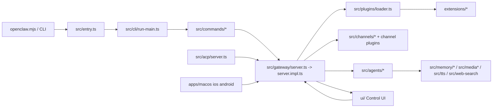
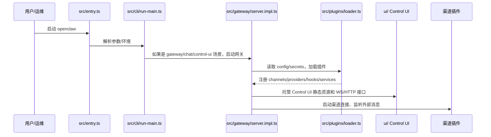
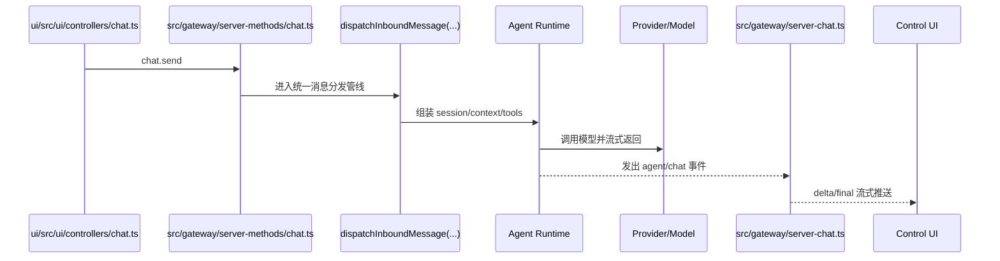

# OpenClaw 整体架构说明

## 1. 文档目标

本文基于 OpenClaw 仓库顶层目录、入口文件、注册接口和模块边界进行整理，重点说明：

- 系统模块的顶层划分
- 前后端及外部服务接口的入口位置
- 各模块之间的依赖关系与集成方式
- OpenClaw 的整体架构模式与 Agent 开发范式

本文不下钻到函数级实现，主要聚焦顶层结构和模块职责。

---

## 2. 总体架构判断

OpenClaw 不是一个单一的聊天机器人程序，而是一个：

- 以 `CLI` 和 `Gateway` 为宿主入口
- 以 `Agent Runtime` 为执行核心
- 以 `Plugin SDK + extensions/*` 为扩展机制
- 以多渠道、多模型、多客户端为接入面的统一 AI Runtime 平台

从顶层看，整个系统可以分成 5 层：

1. 宿主入口层：CLI、Gateway、ACP、TUI、Control UI、原生客户端
2. 核心运行时层：Agent、Session、Routing、Config、Secrets、Infra
3. 能力服务层：渠道、模型、记忆、多模态、语音、搜索、图像生成
4. 扩展插件层：`extensions/*`
5. 客户端与控制面层：`ui/` 和 `apps/*`



---

## 3. 顶层目录与功能模块划分

### 3.1 核心入口与工作区

| 目录/文件 | 角色 | 说明 |
| --- | --- | --- |
| `openclaw.mjs` | 生产入口包装器 | Node 版本检查、加载构建产物 `dist/entry.js` |
| `src/entry.ts` | 主入口 | CLI 启动、环境标准化、help/version 快路径 |
| `scripts/run-node.mjs` | 开发入口 | 开发态自动构建并启动 `openclaw.mjs` |
| `package.json` | 根包定义 | 工作区、脚本、构建、测试、导出面 |
| `pnpm-workspace.yaml` | Monorepo 工作区 | 包含根包、`ui`、`packages/*`、`extensions/*` |

### 3.2 核心源码层

| 目录 | 功能定位 | 主要职责 |
| --- | --- | --- |
| `src/cli/` | CLI 框架 | 参数解析、命令注册、子 CLI 装配 |
| `src/commands/` | 业务命令层 | `agent`、`onboard`、`doctor`、`status`、`models`、`channels` 等 |
| `src/gateway/` | 后端控制平面 | WebSocket/HTTP 服务、事件广播、前端托管、插件方法暴露 |
| `src/agents/` | Agent 核心 | system prompt、tool catalog、skills、subagent、auth profiles、上下文压缩 |
| `src/channels/` | 渠道抽象层 | 渠道插件注册、会话模型、allowlist、线程/提及/命令 gating |
| `src/routing/` | 路由层 | 将渠道消息解析到目标 agent 与 session |
| `src/plugins/` | 插件内核 | 插件发现、装载、注册、hook、provider/channel/service 接入 |
| `src/plugin-sdk/` | 插件 SDK | 稳定公开接口、运行时 API、插件定义辅助 |
| `src/config/` | 配置中心 | schema、默认值、校验、迁移、插件配置、会话配置 |
| `src/secrets/` | 密钥管理 | secret ref、密钥解析、运行时快照、网关鉴权面 |
| `src/sessions/` | 会话状态层 | session key/id、生命周期事件、转录事件 |
| `src/infra/` | 基础设施层 | 进程、端口、路径、安全策略、系统事件、安装与运行时支撑 |

### 3.3 能力服务层

| 目录 | 能力方向 | 说明 |
| --- | --- | --- |
| `src/memory/` | 记忆与检索 | embedding、向量检索、索引与查询管理 |
| `src/media/` | 媒体处理 | 图片、音频、PDF、ffmpeg、文件服务 |
| `src/media-understanding/` | 多模态理解 | 图像/视频描述、音频转写 |
| `src/tts/` | 语音合成 | TTS provider 抽象与运行时 |
| `src/image-generation/` | 图像生成 | 图像生成 provider 运行时 |
| `src/web-search/` | 搜索能力 | Web 搜索 provider 运行时 |
| `src/context-engine/` | 上下文引擎 | 上下文组装与压缩引擎槽位 |
| `src/hooks/` | Hook 系统 | 插件 hook、内部 hook、消息 hook 装配 |
| `src/acp/` | ACP 协议接入 | Gateway-backed ACP server |

### 3.4 前端与客户端层

| 目录 | 功能 | 说明 |
| --- | --- | --- |
| `ui/` | Web Control UI | 基于 Vite + Lit 的控制台前端 |
| `apps/macos` | macOS 客户端 | 本地桌面宿主与原生界面 |
| `apps/ios` | iOS 客户端 | 移动端原生应用 |
| `apps/android` | Android 客户端 | Android 原生应用 |
| `apps/shared/OpenClawKit` | 共享客户端库 | 原生端共享协议/能力模型 |

### 3.5 扩展与兼容层

| 目录 | 功能 | 说明 |
| --- | --- | --- |
| `extensions/` | 插件扩展层 | 渠道、模型、记忆、服务类插件 |
| `packages/clawdbot` | 兼容包 | 向 `openclaw` 转发的兼容壳 |
| `packages/moltbot` | 兼容包 | 向 `openclaw` 转发的兼容壳 |

---

## 4. 系统入口文件与集成入口

### 4.1 为什么 OpenClaw 看起来“入口很多”

OpenClaw 的“入口多”，本质上不是因为它有很多套不同系统，而是因为它要同时接住多种接入面：

- 本地命令行入口
- Web 控制台入口
- 原生 App 入口
- IDE/协议入口
- 外部消息渠道入口

这些入口最终大多都会汇入同一套 Agent 运行时，只是进入系统的方式不同。

可以把这些入口分成两类：

- 面向人使用的接入面：CLI、Web UI、移动端、桌面端
- 面向程序或平台的接入面：ACP、Telegram、Discord、Slack、WhatsApp 等

所以第 4 节中的“入口”，更准确地说是“系统接入面”和“系统接入协议”。

### 4.2 哪些入口经过 Gateway，哪些可以绕过 Gateway

OpenClaw 里，Gateway 很关键，但它不是所有路径的唯一入口。

#### 必须经过 Gateway 的入口

- Web UI
- 移动端 / 桌面端
- ACP
- 长驻运行时里的外部消息渠道

这些入口通常先连接到 Gateway，再由 Gateway 把请求送入 session、agent、channels、plugins 等内部子系统。

对应的主要入口文件包括：

- Gateway 对外入口：`src/gateway/server.ts`
- Gateway 总装配中心：`src/gateway/server.impl.ts`
- Gateway 方法入口：`src/gateway/server-methods/`
- 前端网关通信层：`ui/src/ui/app-gateway.ts`
- ACP 入口：`src/acp/server.ts`

#### 可以绕过 Gateway 的入口

- 本地 CLI，尤其是直接执行 agent 的场景

这条路径可以直接进入核心运行时：

- `openclaw.mjs`
- `src/entry.ts`
- `src/cli/run-main.ts`
- `src/commands/agent.ts`
- `src/agents/agent-command.ts`

因此，Gateway 更准确的定位不是“所有入口的唯一入口”，而是：

> 多客户端、多渠道、长驻服务模式下的统一控制面。

### 4.3 Gateway 到底是什么

Gateway 的职责不是直接完成模型推理，而是承担系统的统一控制和调度职责：

- 接住来自 Web UI、原生端、ACP 和渠道运行时的请求
- 托管 Control UI 静态资源和 WebSocket/HTTP 接口
- 维护连接、事件流、状态同步
- 管理会话、节点、设备、审批流、健康状态等控制面能力
- 把请求转发给 Agent 运行时和插件能力层

关键文件：

- `src/gateway/server.ts`
- `src/gateway/server.impl.ts`
- `src/gateway/control-ui.ts`
- `src/gateway/server-chat.ts`
- `src/gateway/server-methods/chat.ts`

其中 `src/gateway/server.impl.ts` 是系统最重要的集成中心之一，它把配置、密钥、插件、渠道、事件、节点、会话、Control UI 以及 WebSocket/HTTP 服务装配到一起。

### 4.4 启动时序：系统先做了什么

如果用户启动的是 OpenClaw 主程序，系统的大致启动流程如下：



启动阶段的本质不是“开始聊天”，而是：

- 准备配置和密钥
- 装配插件和渠道
- 启动 Gateway 控制面
- 暴露 UI、客户端、协议入口和渠道接入点
- 等待输入进入系统

### 4.5 用户输入之后，是怎么流转的

如果用户从 Control UI 发送一条消息，主链路大致是：



这里的关键点是：

- UI 不直接调用模型
- UI 先调用 Gateway
- Gateway 再进入统一的消息分发与 Agent 执行链
- 最后再通过事件流把结果推回前端

### 4.6 不同入口的输入主链路

#### 1. CLI 直接发起 agent 运行

主要路径：

- `src/entry.ts`
- `src/cli/run-main.ts`
- `src/commands/agent.ts`
- `src/agents/agent-command.ts`

这是一条可以绕过 Gateway 的本地执行路径。

#### 2. Web UI / App 发起聊天

主要路径：

- `ui/src/ui/controllers/chat.ts`
- `ui/src/ui/app-gateway.ts`
- `src/gateway/server-methods/chat.ts`
- `src/gateway/server-chat.ts`
- `src/agents/agent-command.ts`

这是一条经过 Gateway 的客户端路径。

#### 3. ACP 发起请求

主要路径：

- `src/acp/server.ts`
- `src/gateway/client.ts`
- `src/gateway/server-methods/*`
- `src/agents/*`

ACP 本身不直接执行业务，而是把协议请求翻译成 Gateway/Agent 调用。

#### 4. 外部消息渠道发来消息

主要路径：

- 渠道插件接收外部平台消息
- `src/routing/resolve-route.ts`
- 统一 Agent 执行链
- 再通过渠道插件回发到原平台

因此外部渠道并不是直接“调模型”，而是先进入渠道适配层和路由层。

### 4.7 它和 ChatGPT 的区别

如果只看 Control UI 聊天体验，OpenClaw 和 ChatGPT 很像：

- 用户输入
- 组装上下文
- 调用模型
- 流式返回
- 保存会话

但 OpenClaw 的系统定位与 ChatGPT 不同。

ChatGPT 更像：

- 一个成品聊天应用

OpenClaw 更像：

- 一个多入口、多渠道、多 Agent、多插件的 AI 运行平台

OpenClaw 比典型聊天应用多出来的关键能力是：

- 多入口：CLI、Web UI、App、ACP、外部消息渠道
- 多出口：结果不一定只显示在网页里，也可以发回 Telegram、Discord、WhatsApp 等
- 多 Agent：不同渠道、群组、账号、线程可路由到不同 agent
- 多插件：模型、记忆、搜索、语音、图像生成、上下文引擎都可扩展

### 4.8 这一节的核心结论

要理解第 4 节，可以抓住下面这几句话：

- “入口多”指的是接入面多，不是系统割裂
- Gateway 很关键，但不是所有路径的唯一入口
- Web UI / App / ACP / 外部渠道大多经过 Gateway
- 本地 CLI 某些路径可以直接进入 Agent Runtime
- 真正统一系统行为的，不是入口本身，而是后面的 session、routing、agent 和 plugin runtime

---

## 5. 核心模块设计说明

### 5.1 CLI 与命令体系

主要目录：

- `src/entry.ts`
- `src/cli/`
- `src/commands/`

职责：

- 接收用户命令
- 解析 profile/env
- 注册内建命令和插件命令
- 将请求转发给 agent、gateway、doctor、onboard、models、channels、sessions 等子系统

设计特点：

- 命令是系统外壳，不直接承载复杂业务
- 真正的能力落在 `commands`、`gateway`、`agents`、`plugins` 等模块中
- 插件可向 CLI 注入命令，说明 CLI 也是可扩展的

### 5.2 Gateway 控制平面

主要目录：

- `src/gateway/`
- `src/gateway/server/`
- `src/gateway/server-methods/`

职责：

- 提供 WebSocket 和 HTTP 服务
- 托管 Control UI
- 提供会话、健康状态、节点、设备、agent、聊天事件等统一接口
- 广播系统事件与运行时事件
- 装载插件暴露的网关方法

设计特点：

- Gateway 是系统的控制平面
- 它不是简单 API 层，而是统一编排中心
- 它把插件、会话、节点、前端、客户端、外部协议统一接进来

### 5.3 Agent 运行时

主要目录：

- `src/agents/`
- `src/commands/agent.ts`
- `src/agents/agent-command.ts`

职责：

- 组织模型调用
- 维护 system prompt 与上下文
- 管理工具调用
- 管理 subagent
- 管理 auth profiles、skills、tool policy、会话写入

设计特点：

- Agent 不是一个孤立对象，而是一组运行时能力的组合
- 子代理是一级能力，不是附属特性
- 工具、skills、prompt、上下文、hook 都是可插拔的

### 5.4 渠道层

主要目录：

- `src/channels/`
- `src/channels/plugins/`
- `src/routing/`

职责：

- 抽象 Telegram、Discord、Slack、WhatsApp 等外部消息渠道
- 统一渠道消息模型
- 处理命令授权、提及规则、allowlist、线程、回发行为
- 把渠道身份映射到 agent/session

关键入口：

- 渠道注册表：`src/channels/registry.ts`
- 渠道路由：`src/routing/resolve-route.ts`
- 渠道插件契约：`src/channels/plugins/types.plugin.ts`

设计特点：

- 渠道适配与 Agent 逻辑解耦
- 通过统一 contract，把不同消息平台挂接到同一运行时
- `routing` 单独存在，说明“消息落到哪个 agent”是独立问题

### 5.5 插件系统

主要目录：

- `src/plugins/`
- `src/plugin-sdk/`
- `extensions/`

职责：

- 发现插件
- 读取 manifest
- 校验配置
- 动态装载插件模块
- 建立 provider/channel/service/hook/command 注册表
- 向核心运行时暴露稳定 SDK

关键入口：

- 插件装载器：`src/plugins/loader.ts`
- 插件运行时：`src/plugins/runtime/index.ts`
- 插件类型系统：`src/plugins/types.ts`
- SDK 入口：`src/plugin-sdk/index.ts`
- 插件定义辅助：`src/plugin-sdk/plugin-entry.ts`

设计特点：

- OpenClaw 的扩展不是“旁路扩展”，而是架构主轴
- 插件可以注册：
  - channel
  - provider
  - memory
  - web search
  - image generation
  - speech
  - context engine
  - hook
  - command
  - gateway method

### 5.6 配置与密钥体系

主要目录：

- `src/config/`
- `src/secrets/`

职责：

- 配置 schema、默认值、迁移与校验
- 插件配置、渠道配置、网关配置、模型配置
- secret ref 与运行时快照
- 网关鉴权面和命令密钥分配

设计特点：

- 配置不是简单 JSON 读写，而是强 schema、强约束、可迁移
- secrets 被单独抽象，避免散落在各 provider/channel 实现中
- Gateway 在启动和热重载时都会显式激活 secret runtime snapshot

### 5.7 Session 与状态管理

主要目录：

- `src/sessions/`
- `src/config/sessions/`

职责：

- session key / session id 生成
- 生命周期事件
- transcript 写入
- 会话映射与标签

设计特点：

- OpenClaw 很多能力围绕 session 组织，而不是围绕一次 HTTP 请求
- session 是 Agent、渠道、前端、Gateway 共同依赖的核心状态单元

### 5.8 记忆、多模态与能力服务

主要目录：

- `src/memory/`
- `src/media/`
- `src/media-understanding/`
- `src/tts/`
- `src/image-generation/`
- `src/web-search/`

职责：

- 提供记忆检索、媒体处理、音频转写、TTS、图像生成、Web 搜索等能力

设计特点：

- 这些能力都不是直接写死在 Agent 中
- 它们通过 runtime/provider/plugin 机制注入到 Agent 和 Gateway

### 5.9 Context Engine

主要目录：

- `src/context-engine/`

职责：

- 维护上下文引擎注册表
- 根据配置槽位选择当前上下文引擎
- 支持替换上下文构造和压缩策略

关键入口：

- `src/context-engine/registry.ts`

设计特点：

- 上下文引擎是可替换槽位
- 说明 OpenClaw 把“如何组装上下文”从 Agent 主流程中独立出来了

---

## 6. 前后端与外部接口的集成方式

### 6.1 Web 前端与 Gateway

集成链路：

- `ui/src/main.ts`
- `ui/src/ui/app.ts`
- `ui/src/ui/app-gateway.ts`
- `src/gateway/control-ui.ts`
- `src/gateway/server.impl.ts`

模式：

- Gateway 负责静态资源托管
- 前端通过 Gateway Browser Client 建立连接
- 前端通过事件流订阅 chat、agent、presence、sessions、exec approval 等状态

这意味着：

- 前端不是单独后端服务
- Gateway 同时承担 API 层、事件总线和前端宿主

### 6.2 原生客户端与 Gateway

集成位置：

- `apps/macos`
- `apps/ios`
- `apps/android`
- `apps/shared/OpenClawKit`

模式：

- 原生端围绕共享协议/模型与 Gateway 集成
- 原生端更多承担终端宿主、设备能力、界面交互职责

### 6.3 ACP 与 Gateway

集成位置：

- `src/acp/server.ts`

模式：

- ACP 服务器本身不直接执行业务
- 它通过 Gateway Client 连接 Gateway
- 再把外部 ACP 请求翻译成内部 agent/session/gateway 调用

因此 ACP 在架构上属于 Gateway 的外部协议适配层。

---

## 7. 模块依赖关系

### 7.1 宏观依赖图

```text
CLI / ACP / UI / Native Apps
            |
            v
         Gateway
            |
            v
   Config / Secrets / Sessions / Infra
            |
            v
 Plugin Loader + Plugin Runtime + Channel Runtime
            |
            v
 Agents / Routing / Context Engine / Tools
            |
            v
 Memory / Media / TTS / Search / ImageGen / Providers
            |
            v
 External Channels / Model Providers / Remote Services
```

### 7.2 关键依赖关系说明

#### `src/gateway/server.impl.ts`

这是最核心的系统集成点，依赖：

- `src/config/*`
- `src/secrets/*`
- `src/plugins/*`
- `src/channels/*`
- `src/agents/*`
- `src/sessions/*`
- `src/infra/*`
- `ui/` 托管逻辑

它的角色类似整个系统的“控制面装配器”。

#### `src/plugins/loader.ts`

依赖：

- 配置
- 插件发现
- manifest registry
- plugin runtime
- channel/provider/service/hook 类型系统

它的角色是“扩展总线”，负责把 `extensions/*` 转成系统内部可消费的能力注册表。

#### `src/plugin-sdk/*`

依赖核心 contract，但反过来为扩展层提供稳定边界：

- 插件作者通过 SDK 接入
- 不直接侵入核心内部实现

这说明 OpenClaw 明确区分了：

- 核心内部实现
- 扩展公开接口

#### `src/routing/resolve-route.ts`

依赖：

- 渠道消息上下文
- 配置中的 bindings
- agent 默认值
- session key 规则

它的角色是“渠道身份 -> Agent/Session”的路由器。

#### `src/context-engine/registry.ts`

依赖：

- 插件注册
- 配置槽位

它的角色是“上下文组装策略的可插拔解析器”。

---

## 8. Agent 开发范式

### 8.1 核心思路

OpenClaw 的 Agent 开发范式不是直接改一个中心化 Agent 类，而是通过以下方式扩展：

- 通过 Plugin SDK 定义插件入口
- 通过 runtime API 注入能力
- 通过 hook 改写生命周期行为
- 通过 provider/channel/context-engine 插槽接入专用实现

### 8.2 典型扩展方式

#### 方式 1：通用插件

入口：

- `src/plugin-sdk/plugin-entry.ts`

方式：

- 使用 `definePluginEntry(...)`
- 注册 command、hook、provider、service、tools 等能力

#### 方式 2：渠道插件

入口契约：

- `src/channels/plugins/types.plugin.ts`

方式：

- 实现 `ChannelPlugin`
- 提供 config、setup、pairing、status、outbound、gateway、security 等适配器

#### 方式 3：Provider 插件

入口契约：

- `src/plugins/types.ts`

方式：

- 注册模型供应商
- 注册 auth 方法
- 注册 catalog、dynamic model、usage、stream wrapper 等 provider 行为

#### 方式 4：Context Engine

入口：

- `src/context-engine/registry.ts`

方式：

- 注册新的 context engine
- 再通过配置槽位选择启用哪个实现

#### 方式 5：Hook 驱动扩展

入口：

- `src/plugins/types.ts`

可扩展生命周期包括：

- `before_model_resolve`
- `before_prompt_build`
- `before_agent_start`
- `before_tool_call`
- `after_tool_call`
- `session_start`
- `session_end`
- `subagent_spawning`
- `gateway_start`
- `gateway_stop`

这说明 OpenClaw 的 Agent 生命周期是事件化、可插拔的。

---

## 9. `extensions/*` 的顶层职责分组

根据各扩展的 manifest，可以把 `extensions/*` 大致分为以下几类。

### 9.1 渠道类扩展

主要包括：

- `discord`
- `telegram`
- `slack`
- `signal`
- `imessage`
- `line`
- `googlechat`
- `irc`
- `matrix`
- `mattermost`
- `msteams`
- `nextcloud-talk`
- `nostr`
- `synology-chat`
- `twitch`
- `whatsapp`
- `zalo`
- `zalouser`
- `feishu`
- `bluebubbles`

职责：

- 对接外部消息平台
- 提供渠道配置、鉴权、发送、状态探测、线程与会话规则

### 9.2 模型供应商类扩展

主要包括：

- `openai`
- `anthropic`
- `google`
- `ollama`
- `openrouter`
- `amazon-bedrock`
- `mistral`
- `moonshot`
- `xai`
- `together`
- `vllm`
- `sglang`
- `volcengine`
- `huggingface`
- `nvidia`
- `byteplus`
- `qianfan`
- `venice`
- `zai`
- `xiaomi`

职责：

- 提供模型 catalog
- 提供认证方法
- 提供动态模型发现
- 提供运行时模型归一化
- 提供 usage / pricing / stream 策略

### 9.3 记忆类扩展

主要包括：

- `memory-core`
- `memory-lancedb`

职责：

- 提供记忆槽位能力
- 实现检索、嵌入、索引和向量存储

### 9.4 工具与服务类扩展

主要包括：

- `device-pair`
- `voice-call`
- `talk-voice`
- `thread-ownership`
- `diagnostics-otel`
- `diffs`
- `llm-task`
- `phone-control`
- `open-prose`

职责：

- 提供非渠道、非基础模型层的独立运行时能力

---

## 10. 架构模式总结

从设计上看，OpenClaw 采用了以下几个明显的架构模式：

### 10.1 Monorepo + Workspace

- 根包承载核心 runtime
- `ui/` 承载 Web 前端
- `packages/` 承载兼容包
- `extensions/` 承载扩展插件

### 10.2 Plugin-first 内核

- 核心只定义 contract、runtime、注册表和装载逻辑
- 真正的渠道、provider、记忆、工具等能力尽量外置到扩展层

### 10.3 Gateway 统一控制面

- Gateway 统一承载：
  - WebSocket/HTTP
  - Control UI
  - 原生客户端交互
  - ACP 接入
  - 节点与事件广播

### 10.4 Session-centered 运行时

- Session 是消息、Agent、UI、Gateway 协同的核心单元
- 不是围绕单次请求做设计，而是围绕长期会话和转录管理

### 10.5 Channel-agnostic Agent Runtime

- 渠道逻辑与 Agent 逻辑分离
- 通过路由、渠道契约和 session key 将渠道接入统一执行面

### 10.6 Hook / Event 驱动扩展

- Agent 生命周期、工具调用、子代理生命周期、Gateway 生命周期都能被 hook
- 说明架构天然支持旁路增强和运行时插桩

---

## 11. 结论

用一句话概括 OpenClaw：

> OpenClaw 是一个以 Gateway 为控制平面、以 Agent Runtime 为执行核心、以插件系统为扩展机制、以多渠道和多模型为接入面的统一 AI Runtime 平台。

它的关键价值不在某一个单独功能模块，而在于以下组合能力：

- 多入口：CLI、Gateway、ACP、Web UI、原生端
- 多接入：Telegram、Discord、WhatsApp、Slack 等渠道
- 多能力：记忆、语音、多模态、Web 搜索、图像生成
- 多模型：OpenAI、Anthropic、Google、Ollama 等 provider
- 可扩展：Plugin SDK、hook、context engine、subagent

从源码结构上看，最值得优先掌握的主干模块是：

1. `src/entry.ts`、`src/cli/`、`src/commands/`
2. `src/gateway/server.impl.ts`
3. `src/plugins/loader.ts`、`src/plugins/types.ts`、`src/plugin-sdk/`
4. `src/channels/`、`src/routing/`
5. `src/agents/`
6. `src/config/`、`src/secrets/`、`src/sessions/`

如果后续继续深入，建议下一步按下面顺序阅读：

1. CLI 启动链路
2. Gateway 启动链路
3. 插件装载链路
4. 渠道消息如何路由到 Agent
5. Agent 运行时如何调用工具、子代理、记忆和 provider
