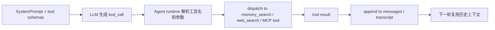

# Phase 3: Agent 运行时与会话编排

## 1. 模块定位

这一层是 OpenClaw 最能体现 Agent 开发范式的核心模块。

如果说：

- `CLI` 解决的是本地命令入口
- `Gateway` 解决的是统一控制平面

那么 `Agent 运行时与会话编排` 解决的就是：

- 用户输入如何进入一个可持续的 Agent 会话
- Agent 如何被 prompt、skills、tools、model、memory、plugins 共同驱动
- 一次运行如何被持久化、回放、扩展和编排

从源码边界上，这一层主要由以下模块提供：

- Agent 入口与运行主链：`src/agents/agent-command.ts`
- 嵌入式运行时：`src/agents/pi-embedded.ts`、`src/agents/pi-embedded-runner/*`
- 工具系统：`src/agents/pi-tools.ts`、`src/agents/openclaw-tools.ts`、`src/agents/tool-catalog.ts`
- 技能系统：`src/agents/skills.ts`、`src/agents/skills/workspace.ts`、`src/agents/skills/plugin-skills.ts`
- MCP 工具接入：`src/agents/embedded-pi-mcp.ts`、`src/agents/pi-bundle-mcp-tools.ts`、`src/plugins/bundle-mcp.ts`
- 模型接入：`src/agents/model-catalog.ts`、`src/agents/models-config.ts`、`src/plugins/provider-runtime.ts`
- 会话管理：`src/agents/command/session.ts`、`src/config/sessions/*`、`src/sessions/*`
- 子代理编排：`src/agents/subagent-spawn.ts`、`src/agents/subagent-registry.ts`
- 记忆与检索：`src/agents/memory-search.ts`、`src/memory/*`

## 2. 先修正几个关键判断

你提的重点已经抓到了很重要的方向，但结合源码后，可以做几个更准确的修正。

### 2.1 “文件即记忆（File-first Memory）”基本成立，但要补充限定

更准确的说法是：

> OpenClaw 的基础上下文与长期状态是明显的 file-first；而语义记忆和向量记忆则是可选增强层。

也就是说：

- Session store 是文件
- Transcript 是文件
- Skills 是文件
- Workspace / bootstrap context 也是文件
- Memory search 会直接把文件内容和 session transcript 纳入索引
- 但“长期语义记忆”还可以通过 memory 插件扩展，不是只有文件一种机制

所以更准确的提法应该是：

> File-first Context + Search-augmented Memory

### 2.2 “技能即插件（Skills as Plugins）”不准确

更准确的说法是：

> Skills 是独立的技能层；插件可以向技能层注入 skills，但 skills 不等于 plugins。

从源码看：

- 技能主系统在 `src/agents/skills/*`
- 插件只是可以通过 `src/agents/skills/plugin-skills.ts` 提供额外 skill 目录

因此：

- plugin 是代码扩展单元
- skill 是 prompt/runtime 级操作知识单元

二者有交集，但不是同一个抽象层。

### 2.3 “内置工具”是核心判断，而且应该再往前提

更准确的说法是：

> OpenClaw 的 Agent 范式本质上是一个“工具增强型嵌入式 Agent runtime”，而不是一个纯 prompt 聊天壳。

从源码看，工具系统不只是附加能力，而是 Agent 运行时的一级核心。

### 2.4 还应补充两个你没单独提出来、但非常关键的点

1. `Session-first orchestration`
   - Agent 不是围绕一次 HTTP 请求运转，而是围绕 sessionKey / sessionId 和持久化 transcript 运转

2. `Subagent-native architecture`
   - 子代理不是补丁能力，而是一级能力，贯穿工具、会话、生命周期和事件系统

### 2.5 还要再补一个边界判断：MCP 不是被 Skills 吞掉的

更准确地说：

> Skills 负责知识和流程，Tools 负责执行接口，MCP 负责把外部工具服务器接进 Agent runtime。

从源码看：

- `src/agents/embedded-pi-mcp.ts` 负责装配 MCP 配置
- `src/agents/pi-bundle-mcp-tools.ts` 负责把 MCP server 暴露成 Agent tools
- `src/agents/mcp-stdio.ts` 负责解析 stdio 型 MCP server

所以 MCP 在 Agent 运行时里是一条独立工具接入链，而不是“skill 目录里附带几个脚本”。

### 2.6 先统一这篇里的 run / attempt / session 术语

如果不先统一术语，后面很容易把“run”“attempt”“SessionEntry”“transcript”“activeSession”混成一层。

这篇后面默认按下面这组口径来理解：

- `Session` 子系统
  - 广义会话体系
  - 包括 `sessionKey`、`SessionEntry`、transcript、运行时消息工作集，以及相关事件与持久化逻辑

- `SessionEntry`
  - `src/config/sessions/types.ts` 里的结构化会话状态条目
  - 保存路由、配置、统计、`skillsSnapshot`、`systemPromptReport` 等

- `transcript`
  - 会话消息日志
  - 以 JSONL 保存 user / assistant / tool result 等时间线内容

- `activeSession`
  - 每个 attempt 内部创建出来的运行时 session 对象
  - 由 `createAgentSession(...)` 生成，见 `src/agents/pi-embedded-runner/run/attempt.ts:1889-1906`

- `activeSession.messages`
  - 当前 attempt 可直接参与消息整理的工作集
  - 后续会被 sanitize / truncate / assemble 成本轮 message bundle

- `run`
  - 一次用户可感知的外层执行
  - 由 `runEmbeddedPiAgent(...)` 驱动，里面可能包含多次 attempt

- `attempt`
  - `run` 内部的一次具体尝试
  - 每次都会重新装配本轮 system-side 输入、创建本次运行时 session、整理消息并执行 tool-calling loop

后面如果写“Session 解析”，默认指的是 **Session 子系统解析**；  
如果写“session 状态”，默认优先指 **`SessionEntry` 这条结构化状态**；  
如果写“历史消息”，默认优先指 **transcript 与 `activeSession.messages` 这两层**。

## 3. OpenClaw 底层 Agent 技术框架是什么

这一节如果只说“底层用了 `@mariozechner/pi-coding-agent`”，其实还是不够好理解。  
更准确的说法应该是：

> **OpenClaw 底层不是一个“裸 LLM + prompt”的聊天壳，而是一套“底层 embedded agent framework + OpenClaw 自己的运行时装配层”的双层结构。**

可以先把它拆成两层：

### 3.1 第一层：底层 embedded agent framework

从依赖和实际调用点看，OpenClaw 的底层 Agent 基座主要来自：

- `@mariozechner/pi-coding-agent`
- `@mariozechner/pi-agent-core`
- `@mariozechner/pi-ai`

这层提供的不是 OpenClaw 自己的业务语义，而是更通用的 Agent 运行能力，例如：

- `createAgentSession(...)`
- `SessionManager`
- 底层 stream / tool-calling / coding session 机制

最直接的源码证据是：

- `src/agents/pi-embedded-runner/run/attempt.ts`
  - 直接从 `@mariozechner/pi-coding-agent` 导入 `createAgentSession`、`SessionManager`
- `src/agents/pi-tools.ts`
  - 在 OpenClaw 的工具装配层之下，组合底层 coding tool runtime
- `src/agents/pi-embedded.ts`
  - 对外导出 `runEmbeddedPiAgent`

所以这层更像：

> **通用的 embedded coding-agent runtime 基座**

### 3.2 第二层：OpenClaw 自己的运行时装配层

OpenClaw 真正的特色，不是在“从零实现了一个 Agent 框架”，而是在底层 framework 之上，又显式展开了一整层自己的运行时装配：

- session 解析与持久化
- workspace / bootstrap files / skills 装配
- system prompt 生成
- core/plugin/MCP/LSP tools 汇合
- model/provider/auth/fallback 选择
- transcript 修复、裁剪和回写
- Context Engine 接入
- subagent 生命周期治理

对应主文件是：

- `src/agents/agent-command.ts`
- `src/agents/pi-embedded-runner/run.ts`
- `src/agents/pi-embedded-runner/run/attempt.ts`
- `src/agents/pi-tools.ts`
- `src/agents/system-prompt.ts`
- `src/config/sessions/*`

所以，如果要用一句话概括 OpenClaw 的底层 Agent 技术框架，最准确的说法是：

> **底层用 `pi-coding-agent` 这类 embedded agent framework 提供通用 Agent 能力，上层由 OpenClaw 自己接管 session、prompt、tools、plugins、MCP、fallback、context 和 subagent 编排。**

### 3.3 一轮 Agent 运行到底是怎么转起来的

这一块是原来最容易讲抽象的地方。  
从源码主链看，一轮运行其实可以分成 8 步。

#### 1. 外层入口先把“要跑哪一个会话子系统实例”定下来

这一层通常从：

- `src/agents/agent-command.ts`

开始。

它先解决的不是“立刻调模型”，而是：

- 当前是哪个 `sessionKey / sessionId`
- 当前 workspace 是什么
- 当前 agent 身份是什么
- 当前 run 要用哪个 model/provider/auth 配置

也就是说，**OpenClaw 是先解析 `Session` 子系统，再开始跑 Agent**。  
这里拿到的不只是一个抽象“会话名”，而是后续运行要依赖的 `sessionKey / sessionId / SessionEntry / sessionFile` 这一组会话材料。

#### 2. 运行时主循环启动，先解析 active context engine 和 failover 环境

真正进入 embedded runtime 之后，会走：

- `src/agents/pi-embedded-runner/run.ts`

这里负责：

- `ensureContextEnginesInitialized()`
- `resolveContextEngine(...)`
- provider/auth profile/fallback 状态准备
- run 级重试/退避/降级控制

所以这一层不是“单次模型调用”，而是：

> **包着多次 attempt、auth/fallback、compaction 恢复的外层 run loop**

#### 3. 每次 attempt 先重建本轮 system-side 输入

进入：

- `src/agents/pi-embedded-runner/run/attempt.ts`

之后，首先会组装这轮 attempt 的 system-side 输入。  
这里更准确的拆法不是笼统说“system-side context”，而是两层：

- `SystemPrompt` 文本层
- `tools[]` 结构化工具层

构建主线是：

- `resolveSkillsPromptForRun(...)`
- 解析 bootstrap/context files
- `createOpenClawCodingTools(...)`
- 可选 `createBundleMcpToolRuntime(...)`
- 可选 `createBundleLspToolRuntime(...)`
- 合成 `effectiveTools`
- `buildEmbeddedSystemPrompt(...)`
- `buildSystemPromptReport(...)`

这一段非常关键，因为它说明：

- `SystemPrompt` 不是固定模板，而是按本轮环境动态生成的文本
- skills 不是直接写死在 prompt 里，而是先解析成 `skillsPrompt`
- tools 也不是固定集合，而是每轮按当前 runtime 配置装配成 `effectiveTools`

如果按统一术语压成一句话，可以记成：

```text
本轮 system-side 输入
= SystemPrompt 文本层
+ tools[] 结构化工具层
```

这里的 `tools[]` 是分析术语。  
放回 OpenClaw 代码里，更贴近的具体形态是：

```text
effectiveTools
 -> toToolDefinitions(...)
 -> ToolDefinition[] / customTools
 -> createAgentSession(...)
```

其中：

- bootstrap/context files、`skillsPrompt`、tool list 文本摘要
  - 都属于 `SystemPrompt` 文本层
- `effectiveTools`
  - 才是后面真正进入 runtime 的结构化工具来源

这里还要补一个边界：

- `/context list` 里的 `Tool schemas (JSON)` 和 `Tools:`
  - 都是报告标签
- 真正的架构对象名仍然是 `tools[]`

#### 4. 然后才打开 transcript、准备 sessionManager，并创建本次 attempt 的运行时 session 对象

在同一个 `attempt.ts` 里，完成工具装配后，会调用：

- `SessionManager.open(params.sessionFile)`
- `prepareSessionManagerForRun(...)`
- `splitSdkTools(...)`
- `createAgentSession(...)`

这里的“每次 attempt”要按外层 `run` loop 的粒度理解。也就是：

- `run.ts` 的外层重试循环每进入一次 `runEmbeddedAttempt(...)`
- 就会在 `attempt.ts` 里重新走一遍 `SessionManager.open(...) -> prepareSessionManagerForRun(...) -> createAgentSession(...)`
- 它不是同一个 attempt 内部每一次 tool call、每一个中间 step 都重新打开 transcript

也就是说：

```text
transcript (.jsonl)
 -> SessionManager.open(sessionFile)
 -> prepareSessionManagerForRun(...)
 -> effectiveTools 拆成 builtInTools / customTools
 -> createAgentSession(...)
 -> const activeSession = session
```

这一步很重要，因为它说明：

- 不是“直接把 transcript 文件文本读出来丢给模型”
- 而是先通过 `sessionManager` 打开和规范化当前 session 状态
- 完整工具定义不是只存在于 `SystemPrompt` 文本里
- 它还会以 `tools[]` 的形式注册进真正的 Agent runtime
- OpenClaw 这里走的是“`SystemPrompt` 文本层 + `tools[]` 结构化工具层”并存的范式
- `createAgentSession(...)` 产出的不是 `SessionEntry`，而是本次 attempt 的运行时 session 对象
- 源码里紧接着就有 `const activeSession = session`，见 `src/agents/pi-embedded-runner/run/attempt.ts:1889-1906`

这里更值得强调的是三层关系：

- `transcript`
  - 是磁盘上的持久化会话日志
- `sessionManager`
  - 是把 transcript 解析成“当前 session 状态”的中间层
- `activeSession.messages`
  - 是本次 attempt 真正拿来组 prompt 的内存工作集

#### 5. 在真正调模型前，每次 attempt 都会重建本轮 message context bundle

运行时 session 对象建好之后，并不会立刻把原始 transcript 全塞给模型，而是先从 `activeSession.messages` 出发，再走一遍消息整理链。
这里最关键的点是：

- `message context bundle` 不是 transcript 的原样投递
- 它是每次 attempt 都重新整理出来的一份“当前可送给模型的历史版本”
- 这里的 `attempt` 仍然指外层 `runEmbeddedAttempt(...)` 的一次执行，而不是同一 attempt 内部的 tool loop 迭代

更准确的过程是：

```text
上一轮 transcript
 -> SessionManager.open(...)
 -> createAgentSession(...)
 -> activeSession.messages
 -> sanitize / validate / truncate / repair
 -> contextEngine.assemble(...)
 -> 本次 attempt 的 message context bundle
```

对应源码里，`activeSession.messages` 会先进入：

- `sanitizeSessionHistory(...)`
- `validateGeminiTurns(...)`
- `validateAnthropicTurns(...)`
- `limitHistoryTurns(...)`
- `sanitizeToolUseResultPairing(...)`
- `contextEngine.assemble(...)`

而且这不是“一次性整理完就永远不动”的。  
在同一个 attempt 里，如果会话叶子需要修复，还会：

- 读取 `sessionManager.getLeafEntry()`
- 必要时 `branch(...)` 或 `resetLeaf()`
- 再通过 `sessionManager.buildSessionContext()` 重新构造 session context
- 然后把结果写回 `activeSession.messages`

见 `src/agents/pi-embedded-runner/run/attempt.ts:2477-2485`。

所以这一步的作用是：

- 修复历史消息格式
- 裁剪过长历史
- 保证 tool_use / tool_result 对齐
- 让 Context Engine 再做最终 assemble
- 把“持久化日志里的历史”收敛成本次 attempt 真正可用的 message bundle

所以 OpenClaw 的上下文不是“读取 session 文件后直接喂给模型”，而是：

> **transcript -> sessionManager -> `activeSession.messages` -> sanitize/repair/truncate -> contextEngine assemble -> 本轮 message bundle**

如果要把这一段压成一句更稳的结论：

> **每次 attempt 都会重新构造本轮 message context bundle；真正参与构造的是 `activeSession.messages` 这份运行时工作集，而不是原始 transcript 文件本身。**

#### 6. 模型开始运行，进入真正的工具调用循环

到这一步，才进入大家最熟悉的 Agent loop。

但 OpenClaw 这条循环不是单纯一句 “ReAct”，而是更明确的 tool-calling loop：

```text
SystemPrompt + tool schemas
 -> LLM 生成 tool_call
 -> runtime 解析工具名和参数
 -> 分发到 core/plugin/MCP/LSP tools
 -> tool result 回写 messages / transcript
 -> 模型继续读结果并决定下一步
```

这里面可以发生的能力调用包括：

- `memory_search / memory_get`
- `web_search / web_fetch`
- 内建文件/进程/消息工具
- plugin tools
- MCP tools

所以从运行时视角看，OpenClaw 更像：

> **一个带显式工具编排和消息回写的 Agent loop**

#### 7. 一轮结束后，不是“返回文本就结束”，还要把结果写回会话体系

这一节按默认主线理解，其实只要抓住两条写回链就够了：

- **消息历史写回 `transcript`**
- **会话元状态写回 `SessionEntry`**

第一条链，是消息历史这一侧。

在同一个 attempt 的 tool loop 里，用户消息、assistant 消息、tool result 等内容已经通过 `SessionManager` 持续承接并落进 transcript/history 体系，所以到“一轮结束”时，消息侧不是凭空新建一份摘要，而是：

- 本轮消息已经进入 `sessionManager`
- `sessionManager` 背后的 transcript/history 已经保存了这轮会话痕迹
- 下一轮新的 attempt 再从这条会话历史里恢复出新的 `activeSession.messages`

第二条链，是 `SessionEntry` 这一侧。

`attempt.ts` 结束时会返回一组结构化运行结果，见 `src/agents/pi-embedded-runner/run/attempt.ts:2884-2902`，其中包括：

- `systemPromptReport`
- `attemptUsage`
- `compactionCount`
- `aborted / timedOut / promptError`
- 以及 `messagesSnapshot`、`assistantTexts`、`toolMetas` 等运行结果

然后外层 command 路径会调用 `updateSessionStoreAfterAgentRun(...)`，见 `src/agents/agent-command.ts:1258-1268` 和 `src/agents/command/session-store.ts:21-127`，把这些结果写回 `SessionEntry`：

- 更新 runtime model / provider
- 更新 `abortedLastRun`
- 写回 `systemPromptReport`
- 更新 `inputTokens / outputTokens / totalTokens / cacheRead / cacheWrite`
- 累加 `estimatedCostUsd`
- 累加 `compactionCount`

所以第 7 步最简单、也最贴近默认主线的理解是：

```text
tool loop 结束
 -> 消息历史已经写进 transcript / sessionManager
 -> attempt 返回 structured result
 -> 外层 updateSessionStoreAfterAgentRun(...)
 -> SessionEntry 写回最新 usage / report / state
```

这样一轮结束后，至少会留下两类结果：

- 会话历史
  - transcript / sessionManager 这一侧承接了本轮消息
- 会话元状态
  - `SessionEntry` 上的 model、usage、compaction、`systemPromptReport` 等字段

补充一句：`afterTurn(...)` 确实是 Context Engine 的扩展点，但默认 `legacy` 引擎里它是 no-op，所以这里不把它当成主线来讲。

这样下一轮运行时，系统拿到的就不只是“上次 assistant 说了什么”，而是：

- 完整的消息历史基础
- 最新的 session 级状态与统计

#### 8. 如果失败、超时、上下文溢出，还可能继续在 run 外层重试

这就是为什么 OpenClaw 不能被理解成“单次函数调用 Agent”。

在 `src/agents/pi-embedded-runner/run.ts` 里，外层 run loop 还会处理：

- auth profile failover
- model/provider failover
- compaction 恢复
- timeout / overload backoff

所以真实的一轮 user-visible run，更接近：

```text
Session subsystem resolved
 -> outer run loop
    -> attempt 1
       -> build system-side context / tools / message working set
       -> tool-calling loop
       -> attempt 收尾：afterTurn / transcript / SessionEntry update
       -> 成功：结束整轮 run
       -> 失败但可恢复：回到 outer run loop
    -> attempt 2 / attempt 3 / ...
       -> 重复同样结构
 -> 最终成功，或者 fallback / retry 也无法恢复
```

如果把这条链翻成“带注释的人话”，更容易理解：

```text
Session subsystem resolved
 -> 先确定“这次到底在哪个会话体系里运行”
 -> 包括 sessionKey / sessionId / SessionEntry / sessionFile / workspace / agent 身份 / 当前配置

outer run loop
 -> 外层总控循环
 -> 负责 auth profile、provider/model fallback、context overflow 恢复、超时/退避

attempt 1 / attempt 2 / ...
 -> 一次 run 里不一定只尝试一次
 -> 可能第一次失败，随后切换 auth / provider / compaction 后再试

build prompt / tools / history
 -> 每次 attempt 都会重新组装这轮要用的 SystemPrompt、skillsPrompt、effectiveTools 和消息工作集
 -> 这里不是复用上一轮的“完整 prompt 字符串”，而是按当前状态重建

tool-calling loop
 -> 模型开始真正运行
 -> 决定是否调用 memory_search / web_search / MCP / 内建工具
 -> 工具返回结果后，模型再继续下一步

attempt 收尾：afterTurn / transcript / SessionEntry update
 -> 注意：这一步已经在 tool-calling loop 之外
 -> 它属于“本次 attempt 结束后的收尾”
 -> 这一轮结束后，把消息和结果写回 transcript
 -> 更新 SessionEntry 状态、usage、systemPromptReport
 -> 让 Context Engine 做 afterTurn / ingest

成功 / 回到 outer run loop
 -> 如果这次 attempt 成功，就结束整轮 run
 -> 如果失败但还能恢复，就回到 outer run loop，换一种方式再试
```

也可以压缩成一句最容易记的总结：

> **OpenClaw 的一轮 Agent run，不是“拼 prompt 调一次模型”，而是“先确定会话，再进入带重试能力的 outer run loop；每次 attempt 动态重建上下文和工具，内部跑一轮 tool-calling，结束后再做 attempt 收尾和状态回写”。**

### 3.4 Agent 运行时的工具调用循环

如果把 `memory_search`、`web_search` 和 MCP tools 放回运行时视角，它们并不是 Context Engine 的一部分，而是同一条 tool-calling 循环里的不同工具来源。



这条循环里，三类能力的位置不一样，但进入模型的方式是统一的。

- `memory_search / memory_get`
  - 这是内部记忆检索工具
  - `memory_search` 走的是 hybrid memory index，主要检索 `MEMORY.md`、`memory/*.md`，并且在配置允许时也可以纳入 session transcripts
  - `memory_get` 负责把命中的记忆文件片段按需读回，尽量控制上下文大小
  - 结果会作为 tool result 回到消息历史里，后续 turn 再被 `sanitizeSessionHistory(...)` 和 `contextEngine.assemble(...)` 读取

- `web_search / web_fetch`
  - 这是联网检索工具
  - `web_search` 先通过 provider runtime 选择可用后端，再生成具体 tool definition
  - `web_fetch` 则负责把网页正文抓取并整理成可回传的工具结果
  - 它们的返回值同样会进入 message bundle，变成后续 turn 的历史输入

- `MCP tools`
  - 这是外部工具服务器接入的结果
  - runtime 会把 stdio MCP server `listTools()` 出来的工具转换成 OpenClaw tool
  - 一旦注册进 `effectiveTools`，它们在循环里和内建工具没有区别，都会被模型按 tool calling 机制调用

从 ReAct 的角度看，OpenClaw 确实也是“先判断要不要查、查什么、查完再回答”的循环；但它比经典 ReAct 更完整，因为它还显式处理了：

- tool 名称和参数归一化
- schema 兼容和校验
- tool call / tool result 的 transcript 持久化
- 工具策略和 allow/deny 控制
- MCP / provider / plugin 多来源工具的统一编排

所以更准确的说法不是“只有 ReAct”，而是：

> OpenClaw 的 Agent runtime 运行的是一条带工具编排、消息持久化和上下文回写的 tool-calling 循环。

#### 3.4.1 Skills 的渐进式披露，本质上也靠 tool calling 落地

这里要拆得更细一点，不然很容易把 Skills 误解成另一套执行引擎。  
从源码看，Skills 在 OpenClaw 里其实分成 4 个阶段：

##### 第一阶段：把 skill 目录注入到 SystemPrompt

这一步发生在 attempt 的 system-side context 构建阶段：

- `resolveSkillsPromptForRun(...)`：`src/agents/pi-embedded-runner/run/attempt.ts:1441`
- `formatSkillsCompact(...)` / `formatSkillsForPrompt(...)`：`src/agents/skills/workspace.ts:543`、`src/agents/skills/workspace.ts:687`

这里进入 prompt 的不是完整 skill 正文，而只是 skill catalog，例如：

- `<available_skills>`
- `<name>`
- `<description>`（预算够时）
- `<location>`

也就是说，这一步只是告诉模型：

> **“有哪些技能可选，它们大概是做什么的，文件在哪。”**

##### 第二阶段：模型先做“要不要读 skill”的决策

这一步还没有真正展开 skill 正文，而是在 `SystemPrompt` 规则里先做选择。

`src/agents/system-prompt.ts:20-30` 里已经把规则写死了：

- 先扫描 `<available_skills>`
- 如果只有一个 skill 明显匹配，就去读它的 `SKILL.md`
- 如果多个都可能匹配，先选最具体的那个
- 如果没有明确匹配，就不要读任何 `SKILL.md`
- 一开始不要同时读很多个 skill

所以这一步的本质是：

> **Skills 先作为“知识路由目录”出现，而不是一上来就把所有 skill 正文塞进上下文。**

##### 第三阶段：真正展开 skill 正文时，靠的是 tool calling

一旦模型决定某个 skill 匹配，真正的展开动作就不是“框架内部魔法”，而是：

- 调用 `read` 工具
- 去读取那个 skill 目录里的 `SKILL.md`

所以最核心的一条链是：

```text
skills roots / SkillSnapshot
 -> 生成 skillsPrompt（只有 available_skills 目录）
 -> 放进 SystemPrompt
 -> 模型判断 skill 是否匹配
 -> 如果匹配：tool call = read SKILL.md
 -> SKILL.md 内容进入 messages
 -> 模型继续后续步骤
```

这也是为什么更准确的定义应该是：

> **Skills 不是一套脱离 tools 的独立执行机制，而是一种“先目录提示、再按需通过 tool calling 展开正文”的知识路由层。**

##### 第四阶段：读完 `SKILL.md` 之后，真正执行仍然回到普通工具体系

这是最容易被忽略的一点。  
`SKILL.md` 读出来之后，接下来发生什么，并不是由“skill runtime”接管，而是重新回到普通的工具调用面。

最常见有两种路径：

**路径 A：`SKILL.md` 已经把执行方式写清楚**

这种情况下，模型通常不需要再读脚本正文，直接就能执行：

```text
tool call 1: read SKILL.md
tool call 2: exec scripts/foo.sh --arg ...
```

也就是说：

- `SKILL.md` 负责说明“该执行什么、怎么执行”
- 真正落地还是靠 `exec` 或其它工具

**路径 B：`SKILL.md` 只给出资源线索，没有把细节讲透**

这种情况下，模型才会继续展开 skill 目录里的其它资源：

```text
tool call 1: read SKILL.md
tool call 2: read scripts/foo.sh 或 templates/bar.md
tool call 3: exec scripts/foo.sh ... / 调用其它工具
```

所以更准确的判断是：

- `read SKILL.md` 基本是渐进式披露的关键步骤
- 是否还要 `read` skill 包里的脚本/模板，是**按需**的，不是固定流程

##### 为什么 skill 包里有脚本，也不代表 Skills 变成了脚本执行引擎

OpenClaw 的 skill 机制默认认的是：

- `SKILL.md`
- frontmatter
- skill 目录

源码也明确假设了 skill 文件可能引用相对路径资源：

- `src/agents/skills/workspace.ts:548-549`

这说明 skill 包可以带：

- 脚本
- 模板
- 说明文件
- 其它附属资源

但这些资源不会因为放在 skill 目录里，就被 OpenClaw 自动执行。  
模型仍然要通过普通工具去处理它们，例如：

- `read`
- `exec`
- 其它内建/tool plugin/MCP tools

这里还有一个很关键的路径规则。源码里已经明确提示：

- `src/agents/skills/workspace.ts:548-549`

如果 `SKILL.md` 里引用的是相对路径资源，那么这些路径应该：

- 先以 **skill 目录** 为基准解析
- 再在真正的工具调用里尽量使用解析后的绝对路径

也就是说，skill 里的：

```text
scripts/foo.sh
```

在执行时更准确的理解不是“相对当前 shell cwd 去猜”，而是：

```text
<skill-dir>/scripts/foo.sh
```

这样做的目的是：

- 避免 workspace cwd 歧义
- 避免 sandbox / copied workspace 场景下路径跑偏
- 让 `read`、`exec` 和其它工具使用同一个确定目标

所以“有脚本的 skill”和“纯文档型 skill”的区别，不在于机制变了，而在于：

> **前者会把后续 tool calling 链拉长，后者通常在读完 `SKILL.md` 后就能直接进入任务执行。**

##### 一个特例：skill command dispatch

还有一种特殊路径，不是“先读 skill 再手动决定工具”，而是 skill frontmatter 直接声明命令分发：

- `src/agents/skills/workspace.ts:879-924`
- `src/agents/skills/types.ts:40-56`

例如：

- `command-dispatch: tool`
- `command-tool: <toolName>`

这时 skill 可以把一个 skill command 直接映射到某个 tool。  
但本质仍然不是“skill 自己执行”，而是：

> **skill 负责命令路由，真正执行仍然是 tool dispatch。**

如果把这一整段压成一句最短的结论：

> **OpenClaw 的 Skills 负责“提示模型该读哪份知识、走哪条流程”；而具体内容的展开和最终执行，仍然主要通过普通 tool calling 完成。**

### 3.5 这是不是 ReAct

可以说它有明显的 ReAct 风格，但不能简单等价成“就是 textbook ReAct”。

经典 ReAct 更强调：

```text
思考 -> 行动 -> 观察
```

而 OpenClaw 的实际运行时更接近：

```text
Session 子系统解析
 -> outer run loop
 -> SystemPrompt（含 Skills + bootstrap files + tool list 文本）
 -> tools[]
 -> createAgentSession
 -> `activeSession.messages` -> sanitize / truncate / context assemble
 -> tool-calling loop
 -> transcript / afterTurn / SessionEntry update
 -> fallback / compaction / retry
```

所以更准确的判断应该是：

- **它包含 ReAct 式“查资料/调工具/看结果再继续”的局部循环**
- **但整体上是一个 session-first、tool-centric、runtime-governed 的 embedded agent architecture**

也就是说：

> **ReAct 只是 OpenClaw Agent runtime 里的局部行为模式；完整架构描述应该是“嵌入式 Agent framework + OpenClaw 运行时装配与会话编排”。**

## 4. Agent 主执行链路

从 `src/agents/agent-command.ts` 看，Agent 的主执行链大致如下：

```text
入口（CLI / Gateway / ACP / Channel）
 -> src/agents/agent-command.ts
 -> resolveSession(...)
 -> ensureAgentWorkspace(...)
 -> buildWorkspaceSkillSnapshot(...)
 -> loadModelCatalog(...)
 -> runEmbeddedPiAgent(...)
 -> updateSessionStoreAfterAgentRun(...)
 -> deliver / transcript / events
```

这条链说明了 OpenClaw Agent 的几个重要特征：

- 先解析 `Session` 子系统，再开始运行
- 先准备 workspace / skills / model，再开始推理
- 运行结果会分别写回 `SessionEntry` 和 transcript
- agent run 不是一次性无状态调用

如果再展开到 embedded runtime 的工具装配阶段，还会继续进入：

```text
createOpenClawCodingTools(...)
 -> core tools + plugin tools
 -> （支持的路径上）createBundleMcpToolRuntime(...)
 -> 最终形成当前 run 的 effective tools
```

也就是说，Agent 运行时在真正开始 tool loop 之前，已经把 skills、插件工具、内建工具以及可接入的 MCP 工具一起装配成当前会话可用的能力面。

## 5. File-first Memory：文件优先的上下文与记忆体系

这是 OpenClaw 很有特色的一点，但要把“记忆”拆成两层理解。

### 5.1 第一层：基础上下文本身就是文件优先

从源码看，OpenClaw 把最核心的运行状态都放在文件层：

- Session store：`src/config/sessions/store.ts`
- Session transcript：`src/config/sessions/transcript.ts`
- Session file 解析与绑定：`src/config/sessions/session-file.ts`
- Skills：`src/agents/skills/workspace.ts`
- 模型注册文件：`src/agents/models-config.ts` 中的 `models.json`

特别是 transcript：

- `src/config/sessions/transcript.ts` 使用 `SessionManager`
- 以 JSONL 文件形式记录 session 内容
- `resolveSessionTranscriptFile(...)` 会把 sessionId/sessionKey 映射到 transcript file

这说明 OpenClaw 的“长期上下文”天然就是 file-backed 的。

### 5.2 第二层：Memory Search 会直接把文件和 Session 文件纳入检索

相关代码：

- `src/agents/memory-search.ts`
- `src/memory/session-files.ts`
- `src/memory/index.ts`

`src/memory/session-files.ts` 很关键，它会：

- 枚举 agent 对应的 transcript `.jsonl`
- 抽取 user / assistant 文本
- 形成可检索的 session file entries

这说明 memory search 不是脱离 session 的另一个黑箱数据库，而是直接围绕文件和 transcript 运转。

### 5.3 但 Memory 不是只有文件

OpenClaw 同时保留了插件化 memory 扩展能力：

- `extensions/memory-core/openclaw.plugin.json`
- `extensions/memory-lancedb/openclaw.plugin.json`
- `src/plugins/config-state.ts` 中还有 memory slot 概念

这说明：

- 文件和 transcript 是基础记忆层
- 向量记忆 / recall / capture 是可选增强层

所以这块最准确的总结是：

> OpenClaw 的 Agent 运行时采用 file-first 的上下文与 transcript 体系，再叠加可选的 memory search / vector memory 插件。

## 6. Skills：独立技能层，而不是“插件等价物”

这是 OpenClaw Agent 范式里另一个很重要的设计。

### 6.1 技能层的核心作用

技能层负责：

- 把可复用操作知识组织成 `SKILL.md`
- 构造成技能 prompt 快照
- 在运行时注入 system prompt
- 形成一种“提示级插件机制”

核心代码：

- `src/agents/skills.ts`
- `src/agents/skills/workspace.ts`
- `src/agents/system-prompt.ts`

其中：

- `buildWorkspaceSkillSnapshot(...)`
- `buildWorkspaceSkillsPrompt(...)`
- `resolveSkillsPromptForRun(...)`

共同构成了技能 prompt 的生成链。

### 6.2 Skills 在运行时如何被使用

`src/agents/agent-command.ts` 中会在新 session 或缺失 snapshot 时：

- 计算 `skillsSnapshot`
- 存入 `SessionEntry.skillsSnapshot`

而 `src/agents/system-prompt.ts` 里会把 skills prompt 注入系统提示，并明确要求模型：

- 先扫描可用 skills
- 判断是否有明确匹配 skill
- 需要时先读 `SKILL.md`

这说明 skill 不是随手附带的提示文本，而是被纳入了运行时协议。

### 6.3 Skills 和 Plugins 的真实关系

`src/agents/skills/plugin-skills.ts` 说明：

- 插件 manifest 可以暴露自己的 skill 目录
- Gateway / Agent 在加载插件后，也能把插件提供的 skills 纳入技能层

因此真实关系是：

```text
Skills = 独立技能层
Plugins = 可扩展能力层
Plugins 可以向 Skills 层注入技能
```

所以“Skills as Plugins”不准确，更准确的是：

> Skills are a runtime prompt layer; plugins can contribute skills.

## 7. 内置工具：OpenClaw Agent 范式的硬核心

从源码看，工具系统不是外围附属，而是 Agent runtime 的一等公民。

### 7.1 工具目录与核心模块

关键文件：

- `src/agents/tool-catalog.ts`
- `src/agents/pi-tools.ts`
- `src/agents/openclaw-tools.ts`
- `src/plugins/tools.ts`

### 7.2 工具的来源是三层叠加

#### 第一层：底层 framework 的 coding tools

`src/agents/pi-tools.ts` 直接引入：

- `codingTools`
- `createReadTool`
- `readTool`

这些来自 `@mariozechner/pi-coding-agent`。

这说明 OpenClaw 不是从零开始手写文件/命令工具，而是在底层 agent framework 之上扩展。

#### 第二层：OpenClaw 自己的核心工具

`src/agents/openclaw-tools.ts` 会注册一整套 OpenClaw 原生工具，例如：

- `browser`
- `canvas`
- `nodes`
- `cron`
- `message`
- `gateway`
- `agents_list`
- `sessions_list`
- `sessions_history`
- `sessions_send`
- `sessions_spawn`
- `sessions_yield`
- `subagents`
- `session_status`
- `web_search`
- `web_fetch`
- `image`
- `image_generate`
- `tts`

这些工具高度体现了 OpenClaw 的平台属性。

#### 第三层：插件工具

`src/plugins/tools.ts` 中的 `resolvePluginTools(...)` 会把插件声明的工具工厂加载进来。

这说明工具系统最终是：

```text
底层 framework 工具
 + OpenClaw 内建工具
 + 插件工具
```

### 7.3 工具不是“全开”的，而是策略驱动

`src/agents/pi-tools.ts` 中还会结合：

- `resolveEffectiveToolPolicy(...)`
- `resolveGroupToolPolicy(...)`
- `resolveToolProfilePolicy(...)`
- provider/tool policy

来决定哪些工具可用、哪些需要限制。

因此，OpenClaw 的工具系统不是一个平铺列表，而是“策略驱动工具面”。

### 7.4 MCP 是 Agent 工具面的独立外部来源

如果只看 Agent runtime，本地工具面并不是只来自 framework/core/plugin 三层，还可以再接入一层外部 MCP 工具。

这条链在源码里的关键节点是：

- `src/agents/embedded-pi-mcp.ts`
  - 合并插件 bundle 提供的 `mcpServers` 与用户配置中的 `cfg?.mcp?.servers`
- `src/agents/pi-bundle-mcp-tools.ts`
  - 启动 stdio MCP client
  - 调用 `listTools()`
  - 把 MCP tools 转成 OpenClaw Agent tools
- `src/agents/mcp-stdio.ts`
  - 当前只支持 `stdio` 型 MCP server

因此，如果从 Agent runtime 的角度重写工具来源，更完整的表述是：

```text
底层 framework 工具
 + OpenClaw 内建工具
 + 插件工具
 + 可接入的 MCP 外部工具
```

这不是说 MCP 取代了 plugins 或 skills，而是说它为 Agent 增加了一条“外部工具服务器 -> 本地 tool 视图”的桥接链。

## 8. 大模型接入方式：内建 provider + provider plugin + CLI backend

这一块是 OpenClaw Agent runtime 很重要的抽象层。

### 8.1 模型接入的主入口

关键代码：

- `src/agents/model-catalog.ts`
- `src/agents/models-config.ts`
- `src/plugins/provider-runtime.ts`
- `src/agents/cli-backends.ts`

### 8.2 第一类：内建 / 标准 provider 接入

`src/agents/model-catalog.ts` 会：

- 调用 `ensureOpenClawModelsJson(...)`
- 使用底层 `ModelRegistry`
- 结合 auth storage 和 `models.json`
- 加载基础模型目录

这说明 OpenClaw 把模型接入做成了一个显式 catalog，而不是散落在各处 if/else。

### 8.3 第二类：provider plugin 扩展

`src/agents/model-catalog.ts` 还会调用：

- `augmentModelCatalogWithProviderPlugins(...)`

而 `src/plugins/provider-runtime.ts` 则说明 provider plugins 可以扩展：

- dynamic model resolution
- extra params
- stream wrapping
- runtime auth
- usage auth / usage snapshot
- built-in model suppression

这说明 OpenClaw 的模型提供方接入不是硬编码在 core 里，而是插件可扩展的。

### 8.4 第三类：CLI backend

`src/agents/cli-backends.ts` 非常关键，它说明 OpenClaw 还支持把外部 CLI 当作模型后端，例如：

- `claude-cli`
- `codex-cli`

这意味着 OpenClaw 的 Agent runtime 不只支持“HTTP API 型模型接入”，还支持“外部 CLI 代理后端”。

这里还可以看到一个和 MCP 的交叉点：

- `src/agents/cli-runner/bundle-mcp.ts` 会在 `claude-cli` 这类 CLI backend 路径上准备 bundle MCP 配置
- 它会把插件 bundle MCP 配置与已有 `--mcp-config` 合并
- 然后把结果写成临时 `mcp.json`
- 再通过 `--strict-mcp-config --mcp-config <path>` 注入给 CLI backend

这说明 OpenClaw 的 MCP 集成并不只服务于本地内建 tool runtime，也会参与某些 CLI backend 的运行时装配。

### 8.5 可以支持哪些类型的模型接入

结合源码，至少可以归纳出这些类型：

1. 标准 API provider
   - OpenAI、Anthropic、Google、Ollama 等

2. 通过 provider plugin 扩展的 provider
   - 见 `extensions/*` 中大量 provider 扩展

3. 自托管 / 兼容 API provider
   - 通过 `models.providers.*` 和 provider runtime 扩展

4. CLI backend provider
   - `claude-cli`
   - `codex-cli`

5. 动态模型解析 provider
   - provider plugin 在运行时决定最终 model

### 8.6 模型接入不是“选一个 provider”这么简单

从 `src/agents/agent-command.ts` 和 `src/agents/pi-embedded-runner/run.ts` 看，模型层还包含：

- model allowlist
- session/model override
- provider auth profile
- model fallback
- dynamic auth refresh
- capability 判断
- tool 兼容性处理

因此，OpenClaw 的模型接入实际上是一个“带治理能力的模型运行时”。

## 9. Session 会话管理：Session-first orchestration

这块是 OpenClaw 和普通“调用一次模型 API”最不同的地方之一。

### 9.1 Session 解析是运行的第一步

在 `src/agents/agent-command.ts` 里，`resolveSession(...)` 是整个执行链前半段最早发生的核心步骤之一。

对应文件：

- `src/agents/command/session.ts`

这个模块负责：

- 解析 `sessionId`
- 推导 `sessionKey`
- 加载 session store
- 判断是否新 session
- 恢复持久化的 thinking / verbose 等 session 级状态

更准确地说，这一步是在解析 **广义 `Session` 子系统** 的入口锚点。  
它要先把这条消息放回正确的会话体系里，后面才谈得上 run / attempt / transcript 续接。

### 9.2 Session 的持久化结构很丰富

`src/config/sessions/types.ts` 里的 `SessionEntry` 非常能说明设计思路。

里面不只是“sessionId + updatedAt”这么简单，而是还包含：

- `sessionFile`
- `spawnedBy`
- `spawnDepth`
- `status`
- `thinkingLevel`
- `verboseLevel`
- `providerOverride`
- `modelOverride`
- `modelProvider`
- `model`
- `deliveryContext`
- `lastChannel`
- `lastTo`
- `skillsSnapshot`
- `systemPromptReport`
- `acp`

这说明这里说的“session 状态”，更准确地是指 `SessionEntry` 这条结构化状态。  
它不是单纯聊天记录索引，而是整个 Agent 运行状态的持久化条目。

### 9.3 Session store 是文件化状态库

`src/config/sessions/store.ts` 负责：

- 从磁盘加载 store
- 维护缓存
- 加锁写入
- 迁移和清理
- 归一化 session entry

因此，Session store 在 OpenClaw 中相当于一个本地文件化状态数据库。

### 9.4 Transcript 是独立的 JSONL 运行日志

`src/config/sessions/transcript.ts` 负责：

- 为 session 解析 transcript file
- 在 transcript 中追加消息
- 发出 transcript update 事件

因此：

- session store / `SessionEntry` 记录元数据和运行状态
- transcript 记录消息流和运行轨迹

这是 OpenClaw 会话系统很典型的双层结构。

### 9.5 运行时还有一层 `activeSession.messages`

除了 `SessionEntry` 和 transcript，运行时还存在一层经常被忽略的消息工作集：

- `activeSession.messages`

它不是 session store 的字段，也不是 transcript 文件本身，而是每个 attempt 内部的运行时消息视图。  
这层消息会在真正调模型前经历：

- `sanitizeSessionHistory(...)`
- `limitHistoryTurns(...)`
- `contextEngine.assemble(...)`

然后才形成这轮真正提交给模型的 message bundle。

所以如果把会话相关层次压成一句话，可以记成：

```text
Session 子系统
= SessionEntry（结构化状态）
+ transcript（消息日志）
+ activeSession.messages（运行时消息工作集）
```

## 10. Subagent：不是附加功能，而是一级能力

从源码看，OpenClaw 的子代理体系是内建的，而不是后来补上的 feature。

关键文件：

- `src/agents/subagent-spawn.ts`
- `src/agents/subagent-registry.ts`
- `src/agents/openclaw-tools.ts`
- `src/agents/tool-catalog.ts`

### 10.1 子代理从工具层就是一级能力

在工具层里已经有：

- `sessions_spawn`
- `sessions_yield`
- `subagents`

这说明“生成子任务/子 session/子 agent”不是 hack，而是官方工作流。

### 10.2 子代理有独立的注册表和生命周期

`src/agents/subagent-registry.ts` 负责：

- 记录 run 状态
- 管理 announce / completion
- 维护运行生命周期
- 与 session store 对齐

所以 subagent 不是简单地“再起一个 agent”，而是受 registry、session、event 共同管理。

## 11. OpenClaw 的 Agent 开发范式：源码归纳

结合上面这些模块，可以把 OpenClaw 的 Agent 开发范式总结成下面几条。

### 11.1 Session-first，而不是 request-first

Agent 运行围绕 session 运转，不围绕单次 API 请求运转。

### 11.2 File-first context，而不是黑箱 memory

最基础的上下文、skills、transcript、session state 都是文件化的。

### 11.3 Tool-centric，而不是纯聊天型 agent

工具系统是一级核心，且由底层 framework 工具 + OpenClaw 原生工具 + 插件工具叠加而成。

### 11.4 Skill-layered，而不是把行为全塞进 system prompt

Skills 被做成一个独立、可快照、可筛选、可由插件注入的运行时层。

### 11.5 Plugin-extended，而不是 core-only

模型、memory、工具、skills、hooks 都可以通过插件参与运行。

### 11.6 Subagent-native，而不是单 agent 串行执行

子代理和 session 编排是一级能力。

### 11.7 MCP-aware，而不是只依赖内建工具

Agent runtime 可以在支持的路径上把外部 MCP server 暴露成当前 run 的 tools。

### 11.8 Runtime-governed，而不是裸模型调用

模型选择、auth profile、fallback、tool policy、session override、delivery policy 都被运行时统一治理。

## 12. 小结

这一层最准确的概括是：

> OpenClaw 的 Agent 模块不是一个“简单聊天调用器”，而是一个 session-first、tool-centric、file-backed、plugin-extended、MCP-aware、subagent-native 的嵌入式 Agent 运行时。

如果把你最初关心的要点重新整理成更准确的一版，我会建议写成：

1. `File-first Context + Search-augmented Memory`
2. `Skills are a runtime layer, and plugins can contribute skills`
3. `Built-in tools are a first-class core of the runtime`
4. `The underlying framework is pi-coding-agent embedded runtime + OpenClaw orchestration`
5. `Model access is plugin-extendable and supports provider/API/CLI-backend patterns`
6. `MCP is an external tool integration path, not a synonym for skills`
7. `Session management is persistent, file-backed, and central to orchestration`
8. `Subagent orchestration is a first-class Agent capability`

这 8 条比原始提法更完整，也更贴合源码体现出来的真实设计。


## 测试

对，但要稍微修正一下。

**1. 你的这组区分，方向是对的**
- **记忆检索（RAG）**：主要是从“自己可控的语料”里检索，再喂给模型。
- **联网 Web 搜索**：主要是通过搜索工具去外网拿最新信息。
- **Agentic RAG / Tool**：更强调“Agent 自己决定查什么、怎么查、查完再读什么”。

放到 OpenClaw 里看，基本就是：
- `memory_search / memory_get`：偏经典记忆侧 RAG，见 `src/agents/system-prompt.ts`、`src/agents/memory-search.ts`
- web search provider/tool：偏联网工具检索，见 `src/web-search/runtime.ts`
- MCP：是一种把外部能力接进来的协议层，不等于某一种检索算法，见 `src/agents/embedded-pi-mcp.ts`

**2. “Tool/MCP 取代 RAG”这句话，严格说不准确**
更准确的说法应该是：

> **Tool/MCP 不会取代“检索增强”这件事，只会取代某一种 RAG 实现方式。**

因为它们不是同一层概念：

- **RAG**：是一种“先检索，再把结果增强进上下文”的方法论
- **Tool**：是 Agent 调用外部能力的接口
- **MCP**：是把这些外部能力标准化接进来的协议/通道

所以：
- Tool/MCP 可以让 Agent 不必依赖“内置向量库 + 本地索引”这一种固定 RAG 形态
- 但只要 Agent 还在“查资料 -> 读结果 -> 再回答”，本质上仍然是在做检索增强

**3. 我会把它们分成三层**
- **数据层**
  - `MEMORY.md`、session transcript、文档库、网页、Notion、Confluence、数据库
- **检索层**
  - 向量检索、关键词检索、混合检索、API 搜索
- **接入层**
  - 内建 tool
  - plugin tool
  - MCP tool

所以“Tool/MCP 取代 RAG”通常真正想表达的是：

> **把“检索层”从内置本地索引，换成外部工具/API/MCP 服务来完成。**

不是说不需要检索了。

**4. 在 OpenClaw 里的更准确理解**
- `memory_search` 这条线：是比较典型的 RAG，默认还是 hybrid retrieval，不只是向量库，见 `src/agents/memory-search.ts`、`src/memory/manager-search.ts`
- web search tool：是开放域、实时信息检索
- MCP：可以把“另一个检索系统”接进来
  - 比如远程知识库
  - 文档搜索服务
  - 向量数据库
  - 企业内部 API

所以 MCP 更像：

> **让 Agent 能调用“外部 RAG 系统”或“外部搜索系统”**

而不是替代检索本身。

**5. 一句话总结**
我会这样记：

- **RAG**：解决“去哪里找依据”
- **Tool**：解决“怎么调用这个能力”
- **MCP**：解决“怎么把外部能力标准化接进来”

所以最稳的结论是：

> **Tool/MCP 不是取代 RAG，而是让 RAG 不必局限于本地向量库这一种实现。**


之前在讲OpenClaw的Context Engine 只是一个可替换的上下文管理策略槽位，不是Context Engineering，即上下文工程具体的实现。我觉得OpenClaw的Context Engineering也是一个亮点，值得学习它的上下文工程，号称“无限上下文”，它是怎么实现的呢，
