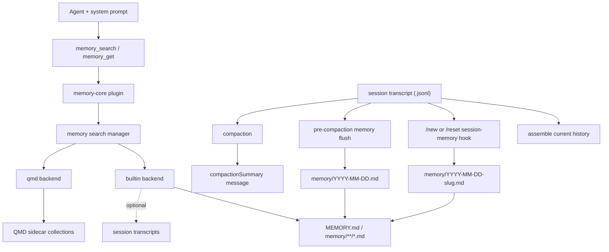
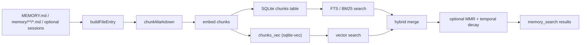
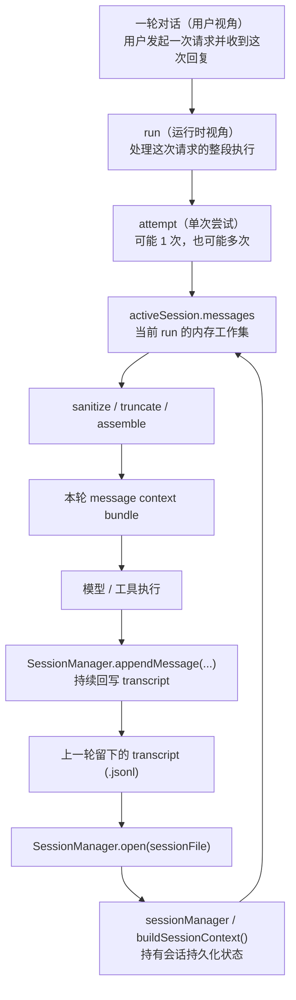

# Phase 8 记忆系统架构

## 1. 本文范围

这篇文档聚焦 OpenClaw 的 **记忆系统架构**，重点回答 4 个问题：

- OpenClaw 的记忆系统到底由哪些层组成
- `memory-core`、`memory-lancedb`、`builtin`、`qmd` 分别是什么
- `memory_search` 背后的 builtin backend 是怎么工作的
- `transcript`、`memory flush`、`compaction summary` 在记忆体系里各自扮演什么角色

不在本文展开的内容：

- `web-search` 的 provider/runtime 细节
- `media`、`media-understanding`、`tts`、`image-generation` 的能力栈
- Context Engine 的完整生命周期治理

这些内容分别更适合放在：

- `architecture/phase4_ Plugins、Skills 与工具扩展机制.md`
- `architecture/phase9_ Context Engine.md`
- `architecture/openclaw-overall-architecture.md`

---

## 2. 文件系统、代码图、知识图谱：三种不同强度的结构关系

> OpenClaw 的记忆系统是一个 **file-first、tool-first 的 recall 架构**：Agent 通过 `memory_search` / `memory_get` 检索 `MEMORY.md` 与 `memory/*.md` 这类持久记忆语料；会话侧则由 `transcript`、`memory flush` 与 `compaction summary` 共同维持“原始历史、持久沉淀、压缩工作记忆”三条并行链路。

### 2.1 利用结构关系检索

在讨论 OpenClaw 的 memory 之前，先建立一个更通用的检索视角会更稳：  
Agent 并不是只靠“向量检索”找信息。实际工程里，常见的线索来源至少有 3 层：

| 结构层 | 节点和边大致是什么 | 更适合解决什么 | 强项 | 弱项 |
| --- | --- | --- | --- | --- |
| 文件系统 | 目录、文件；包含、同级、命名、边界、镜像关系 | 先去哪里找、哪些文件大概率相关 | 成本低、可解释、缩小范围快 | 关系偏弱，不直接表达依赖和因果 |
| 代码图 | 文件、模块、符号；`import`、定义/引用、调用、实现、注册、配置读取 | 多跳定位真实依赖链、调用链、装配链 | 结构硬、精度高、适合工程分析 | 动态注册、反射、字符串路由会让图不完整 |
| 知识图谱 | 实体、属性、关系；语义、时间、因果、约束、角色 | 领域知识、跨概念关系推理 | 关系显式，适合复杂语义查询 | 建图和维护成本最高 |

这 3 层里：

- 文件系统更像 **弱结构图**
- 代码图更像 **强结构图**
- 知识图谱更像 **显式语义图**

它们都能组织线索，但组织方式不同。

#### 2.1.1 文件系统不是推理器，但它是导航器

“文件系统和目录结构提供的是组织线索，不是推理能力”这句话的准确含义是：

- 它不会直接回答“为什么”
- 但它能先告诉 Agent “先去哪里看”

文件系统里天然就有一些弱关系：

- 包含关系：`src/memory/*` 大概率属于 memory 子域
- 同级关系：同一目录下的文件通常讨论同一主题
- 命名关系：`foo.ts`、`foo.test.ts`、`types.ts`、`index.ts`
- 边界关系：`extensions/*`、`src/config/*`、`src/agents/*` 代表不同职责层

这些关系不会直接推出答案，但会显著改变检索路径：

- 先缩小搜索范围
- 先给候选文件排序
- 命中一个文件后，优先看它的同级文件、测试文件、类型文件、文档文件

所以文件系统的核心作用不是“推理”，而是 **组织搜索空间**。

#### 2.1.2 关键词搜索本身不算用了结构关系

纯 `grep`、关键词、正则，最多只是在做 **词法命中**。

真正“用上结构关系”，至少要做到下面几种事里的一个：

1. 先用关键词找到 seed 文件或 seed 符号，再沿定义/引用/调用/注册关系扩一两跳
2. 先根据目录边界或模块边界缩小范围，再只在局部子图里搜
3. 候选文件很多时，按图距离、依赖距离或同目录邻近关系重排
4. 不再问“哪个文件包含这个词”，而是直接问“谁调用它、谁实现它、谁读取这个配置”

所以最实用的工程流程通常是：

```text
关键词搜索找入口
 -> 结构关系扩展邻居
 -> 只读少量关键节点
 -> 不够再下一跳
```

这里的“多跳推理”并不要求先有一张显式知识图谱；  
很多问题只靠“文件系统 + 代码图 + 局部阅读 + LLM 整合”就能完成。

#### 2.1.3 代码本身确实自带很多“天然索引”

“代码本身自带图谱结构，`import`，变量名的引用，代码库很多索引是天然的”这个判断基本成立。

代码库里常见的天然结构线索包括：

- `import / export` 图
- 符号定义 / 引用图
- 调用图
- 类型依赖图
- 配置键读取链
- 插件、命令、路由、事件的注册链
- 测试到目标模块的覆盖关系

这些关系不一定被统一存进 Neo4j 这类知识图谱系统，但它们已经足够支持很多工程分析任务。

更准确地说：

- 文件系统负责“先去哪里看”
- 代码图负责“它和谁真的连着”
- RAG 负责“语义上像不像、内容上有没有证据”
- LLM 负责“把这些线索拼成结论”

#### 2.1.4 把这个视角放回 OpenClaw

放回 OpenClaw，可以把几条检索主线理解成：

- `memory_search / memory_get`
  - 更偏 **file-first + tool-first Agentic RAG**
  - 语料主要是 `MEMORY.md`、`memory/*.md`
- `memory-lancedb auto-recall`
  - 更偏 **预注入式 recall**
  - 先查 LanceDB，再把结果 prepend 到 prompt
- 代码理解类问题
  - 更依赖 **文件系统线索 + 代码图线索**
  - 比如 `src/plugins/slots.ts`、`src/config/types.plugins.ts`、`extensions/memory-core/index.ts`、`extensions/memory-lancedb/index.ts` 这类跨文件多跳关系

所以本文后面讲 OpenClaw memory 时，要一直记住一个前提：

> 检索不只有“向量库”这一种形态。  
> 在真实工程里，文件系统、代码图和语义 recall 往往是叠加工作的。

---

## 3. 先分清几组最容易混淆的概念

### 3.1 `plugins.slots.memory` 和 `memory.backend` 不是一回事

- `plugins.slots.memory`
  - 说的是 **当前激活哪个 memory 插件**
  - 这一层属于 plugin slot / 扩展装配层
- `memory.backend = builtin | qmd`
  - 说的是 **core memory 使用哪套检索后端**
  - 这一层属于 core memory runtime 的 backend 选择

更准确地说：

- `plugins.slots.memory` 决定“谁来提供 memory 这类扩展能力”
- `memory.backend` 决定“当使用 core memory 时，底层 recall 引擎是 builtin 还是 qmd”

对应源码：

- `src/config/types.memory.ts`
- `src/memory/backend-config.ts`
- `src/memory/search-manager.ts`

### 3.2 `memory-core` 和 `memory-lancedb` 不是同一个东西的两个后端

它们都属于 memory 插件，但职责并不相同。

- `extensions/memory-core/index.ts`
  - 暴露 `memory_search` 和 `memory_get`
  - 这是 OpenClaw 当前 file-backed recall 主线的插件壳
- `extensions/memory-lancedb/index.ts`
  - 暴露 `memory_recall`、`memory_store`、`memory_forget`
  - 带有 auto-recall / auto-capture hook
  - 更像一套独立的长期记忆插件

所以不能把它们理解成：

- `memory-core = 抽象层`
- `memory-lancedb = 透明替换 storage backend`

更准确的理解是：

- `memory-core`：默认文件记忆检索工具的插件壳
- `memory-lancedb`：另一条长期记忆插件路线，工具接口和生命周期都不同

### 3.3 `builtin` 和 `qmd` 都是 backend，但可见性不同

- `builtin`
  - 是 OpenClaw 仓库内建的实现
  - 代码都在仓库里，可以完整看清切块、embedding、索引、检索、合并
- `qmd`
  - 是 OpenClaw 已接好的外部 sidecar/backend
  - OpenClaw 负责配置、调用、fallback、结果接入
  - 但 QMD 内部的排序/重排细节不在本仓库里

所以：

- `builtin` 适合拿来讲原理
- `qmd` 适合拿来讲扩展边界与接入方式

### 3.4 `transcript`、`MEMORY.md`、`memory/*.md`、`compaction summary` 不是同一种“记忆”

这是最近最容易混淆的一组概念。

- `transcript`
  - 是 **会话原始日志**
  - 以 `.jsonl` 形式记录 session header 与消息时间线
  - 属于 Session 子系统
- `MEMORY.md`
  - 是 **核心记忆页 / curated memory**
  - 更适合放稳定、低噪声、人工整理过的项目级事实
  - 默认参与 recall，但不是默认自动写入目标
- `memory/*.md`
  - 是 **可检索的持久记忆语料**
  - 更适合放事实、偏好、决定、进展、摘要
  - 默认就是 builtin memory 的主语料之一
- `compaction summary`
  - 是 **压缩后的工作记忆产物**
  - 它服务于后续 turn 的上下文连续性
  - 不等于长期记忆文档，也不等于原始 transcript

一句话记忆：

- `transcript` 偏原始会话历史
- `MEMORY.md` 偏核心、整理过的稳定记忆
- `memory/*.md` 偏可复用记忆沉淀
- `compaction summary` 偏压缩后的工作上下文

### 3.5 Memory、Web Search、MCP、Context Engine 分属不同层

- Memory
  - 检索 OpenClaw 自己维护的记忆语料
- Web Search
  - 检索开放世界网页信息
- MCP
  - 外部能力接入协议，不是检索算法
- Context Engine
  - 管理上下文 assemble / compact / afterTurn，不负责检索本身

一句话记忆：

- Retrieval 解决“去哪里找依据”
- Tool 解决“Agent 怎么调用能力”
- MCP 解决“外部能力怎么接进来”
- Context Engine 解决“结果怎么进入上下文生命周期”

---

## 4. 从 Agent 视角看，Memory 是怎么进入系统的

OpenClaw 不是把 memory 做成一个隐式后台，而是把它显式做成 Agent 可调用工具。

其中有三层特别关键：

| 层 | 作用 | 关键文件 |
| --- | --- | --- |
| System Prompt | 明确要求模型在回答 prior work / decisions / dates / preferences / todos 之前先 recall | `src/agents/system-prompt.ts` |
| Tool 暴露层 | 暴露 `memory_search` / `memory_get` | `src/agents/tools/memory-tool.ts` |
| Memory 插件层 | 注册这些工具并挂到 runtime | `extensions/memory-core/index.ts` |

从 `src/agents/system-prompt.ts` 可以看到两层明确约束：

- 先用 `memory_search` 检索 `MEMORY.md + memory/*.md`
- 再用 `memory_get` 拉取真正需要的少量行，避免上下文膨胀

对应的 tool 描述也写得很清楚：

- `memory_search`：优先搜索 `MEMORY.md + memory/*.md`，可选扩展到 session transcripts，见 `src/agents/tools/memory-tool.ts`
- `memory_get`：在搜索后按路径和行号安全拉取更小片段，见 `src/agents/tools/memory-tool.ts`

所以从 Agent 行为角度看，Memory 不是一个“可有可无的优化项”，而是默认 recall 主线的一部分。

### 4.1 `memory_search -> memory_get` 为什么要拆成两步

OpenClaw 这里不是“一个 tool 直接把整篇记忆文档塞回上下文”，而是故意拆成：

- `memory_search`
  - 负责粗召回
  - 用自然语言 query 去做 hybrid retrieval
  - 返回 top snippets + `path` + `startLine/endLine`
  - 见 `src/agents/tools/memory-tool.ts:86-126` 与 `src/memory/manager.ts:259-366`
- `memory_get`
  - 负责精读验证
  - 按 `path`、`from`、`lines` 去读更小片段
  - 不再做语义搜索，而是定点读取
  - 见 `src/agents/tools/memory-tool.ts:142-166`

它的典型分步流程是：

1. 模型先调用 `memory_search(query=...)`
2. backend 在 `MEMORY.md`、`memory/*.md` 和可选 sessions 上做 hybrid retrieval，返回少量候选 chunk
3. 模型根据返回的 `path + line range + snippet` 判断哪一段最像目标记忆
4. 再调用 `memory_get(path=..., from=..., lines=...)` 读取更完整的局部原文
5. 最后基于精读后的片段回答，必要时还可以再次改 query 重搜

它背后的原理可以概括成：

- 第一步解决“可能在哪里”
- 第二步解决“把原文那几行给我”

这样拆的好处是：

- 避免一次把整篇记忆文件注入 prompt
- 让 recall 可以先探索、再验证
- 把“语义检索”和“精确取证”分开，减少误读 chunk 的风险
- 更适合 Agentic RAG，因为模型可以根据第一轮结果决定是否继续搜、换 query，还是直接读某几行

如果用一句最短的话概括：

> `memory_search` 像“先找哪本书哪几页”，`memory_get` 像“再翻到那几页仔细看”。

---

## 5. 记忆系统的两条主线：检索链路与写入/压缩链路

### 5.1 总体结构



### 5.2 各层职责

| 层 | 主要职责 | 关键文件 |
| --- | --- | --- |
| Agent 侧配置层 | 解析 memorySearch 配置、embedding provider、chunking、hybrid 参数、sync 策略 | `src/agents/memory-search.ts` |
| Tool 层 | 定义 `memory_search` / `memory_get` 的 schema、描述和执行逻辑 | `src/agents/tools/memory-tool.ts` |
| 插件壳层 | 把 memory 工具和 CLI 注册进 runtime | `extensions/memory-core/index.ts` |
| backend 选择层 | 根据 `memory.backend` 选择 `builtin` 或 `qmd`，并处理 fallback | `src/memory/search-manager.ts` |
| builtin backend | 管理索引、embedding、SQLite、FTS、向量检索、hybrid merge | `src/memory/manager.ts`、`src/memory/manager-search.ts`、`src/memory/hybrid.ts` |
| qmd backend | 管理 QMD collections、update/embed、query/search/vsearch、mcporter | `src/memory/qmd-manager.ts` |
| Session 子系统 | 保存 transcript、维护当前会话消息历史、支撑 compaction 与 hooks | `src/config/sessions/transcript.ts`、`src/agents/pi-embedded-runner/run/attempt.ts` |

### 5.3 如果一定要用“短期 / 长期记忆”来分

建议按下面这套更接近源码的映射来写：

- 短期工作上下文
  - `activeSession.messages`
  - `transcript`
  - 最新的 `compaction summary`
- 持久可检索记忆
  - `MEMORY.md`
  - `memory/*.md`
- 可选会话型 recall 语料
  - 经过转换后的 session transcripts

不要写成：

- “短期记忆 = `memory/*.md`”
- “长期记忆 = 只有 `MEMORY.md`”

因为在 OpenClaw 里，`memory/*.md` 明显属于 **持久可检索语料**，而不是短期上下文本身。

---

## 6. builtin backend：OpenClaw 仓库内真正可完整阅读的 recall 引擎

如果只选一条主线学习 OpenClaw Memory，应该先看 `builtin`。

### 6.1 数据源是 file-first 的

builtin backend 的设计起点不是“先有一个抽象向量库”，而是“先有文件化记忆，再从文件派生索引”。

默认主数据源包括：

- `MEMORY.md`
- `memory/**/*.md`
- `extraPaths`

session transcripts 不是默认主来源。`src/agents/memory-search.ts` 里默认 `sources` 只有 `["memory"]`，sessions 只有在显式启用 sessionMemory 后才会进入候选源。

关键文件：

- `src/agents/memory-search.ts`
- `src/memory/internal.ts`
- `src/memory/session-files.ts`

这意味着：

- 文件本身才是一等数据源
- 索引、embedding、FTS、向量表都只是派生层
- builtin 默认不会先按日期挑选 `memory/YYYY-MM-DD*.md`

`src/memory/internal.ts` 的 `listMemoryFiles(...)` 会递归遍历整个 `memory/` 目录，因此：

- `MEMORY.md`
- `memory/**/*.md`
- 其中所有 `memory/YYYY-MM-DD.md`
- 以及所有 `memory/YYYY-MM-DD-slug.md`

都会进入 builtin 的候选语料池。

### 6.2 session transcript 进入 recall 时会先被转换

就算开启了 session memory，builtin 也不是直接把 `.jsonl` 原样拿去检索。

`src/memory/session-files.ts` 的 `buildSessionEntry(...)` 做了几件事：

- 只抽取 `user` / `assistant` 消息
- 只保留文本内容
- 会做敏感信息裁剪
- 最终转成 `User: ...` / `Assistant: ...` 形式的文本块

所以 session transcript 更像是：

- 原始消息日志
- 可选地被转换成另一份 recall 语料

而不是和 `memory/*.md` 完全同层的默认记忆文件。

### 6.3 文档会先切块，再进入 embedding / index

builtin backend 明确实现了 Markdown 切块逻辑。

主链路在：

- `src/memory/internal.ts`
  - `listMemoryFiles(...)`
  - `buildFileEntry(...)`
  - `chunkMarkdown(...)`
- `src/memory/manager-embedding-ops.ts`
  - 对 chunk 做 embedding
  - 然后写入 SQLite 和向量表

这一段说明了一个很重要的事实：

> OpenClaw 的 builtin semantic retrieval，确实走的是“文档 -> chunk -> embedding -> 索引 -> 检索”这条经典链路。

### 6.4 embedding provider 可以是本地，也可以是远程

`src/agents/memory-search.ts` 里已经把 provider 类型写明了，例如：

- `openai`
- `local`
- `gemini`
- `voyage`
- `mistral`
- `ollama`
- `auto`

所以：

- builtin backend 的检索运行在本地
- 但 embedding model 不一定是本地模型

### 6.5 builtin 的存储不是外部向量数据库，而是 SQLite + `sqlite-vec`

这是理解 OpenClaw memory 非常关键的一点。

builtin backend 默认用：

- SQLite 作为主存储
- FTS 表做关键词检索
- `sqlite-vec` 做向量索引

所以对于 builtin 而言：

- 需要 embedding model
- 需要向量索引
- 但不需要单独部署一个外部向量数据库服务

关键文件：

- `src/memory/sqlite-vec.ts`
- `src/memory/manager.ts`
- `src/memory/manager-search.ts`

### 6.6 builtin 明确实现了 hybrid retrieval

OpenClaw 的 builtin backend 不是“纯向量 top-k”，而是显式的混合检索：

- FTS / BM25 关键词检索
- 向量语义检索
- 加权合并
- 可选 MMR 重排
- 可选时间衰减

对应源码：

- `src/memory/manager-search.ts`
- `src/memory/manager.ts`
- `src/memory/hybrid.ts`

### 6.7 builtin 在没有 embedding provider 时会降级为 FTS-only

这说明 memory 系统不是“没有 embedding 就彻底不可用”。

当没有可用 embedding provider 时：

- 仍然可以做关键词检索
- 但 search mode 会退化成 `fts-only`

当 provider 可用时：

- search mode 才是 `hybrid`

### 6.8 索引刷新默认是积极的

这部分也很重要，因为它回答了“记忆文档什么时候被检索到”。

`src/agents/memory-search.ts` 的默认 sync 策略是：

- `onSessionStart = true`
- `onSearch = true`
- `watch = true`

而 `src/memory/manager-sync-ops.ts` 会默认监听：

- `MEMORY.md`
- `memory.md`
- `memory/**/*.md`
- `extraPaths`

所以默认 builtin 会在下面几种时机保持索引新鲜：

- session 启动时
- 搜索前发现索引 dirty 时
- 文件变化被 watcher 捕获后

### 6.9 规模增长时 builtin 怎么控制

这是理解 `memory/*.md` 为什么不会直接把 prompt 撑爆的关键。

虽然 builtin 默认会把整个 `memory/**/*.md` 作为 recall 语料池，但它的控制点不在“先按日期挑文件”，而在后面的索引和检索阶段：

- 运行前先把文档切成 chunks，而不是查询时逐文件全文扫描
- 检索时走 FTS / 向量索引，而不是逐文件遍历
- 只取 top-k 结果，不把全库内容塞进上下文
- 搜索后再用 `memory_get` 按路径和行号拉更小片段

默认参数本身也比较克制：

- `maxResults = 6`
- `candidateMultiplier = 4`
- 候选数有上限封顶

所以 builtin 的真实策略不是：

- “最近文件优先，旧文件不看”

而是：

- “全库建索引，chunk 级别 top-k recall”

这也意味着一个很重要的实践结论：

> 上下文大小通常不会因为 `memory/*.md` 增长而线性爆炸，但 recall 质量会受到语料质量影响；如果把 `memory/` 变成无限增长的流水账池，检索噪声会越来越重。

### 6.10 builtin 主流程



---

## 7. 变更感知与索引刷新机制

这里最容易混淆的是：OpenClaw 并不存在一个统一的“所有记忆材料都靠 watcher 热重载”的机制。更准确地说，至少要分成下面三条链。

### 7.1 `transcript`、`sessionManager`、`activeSession.messages` 与下一轮 `message context bundle`

这一段最好不要只记成 `transcript -> bundle`，因为中间还有一个很关键的过渡层：`sessionManager`。
更准确地说，这条链最接近“即时生效”，但关键点不在文件 watcher，而在 **session 运行时状态**。

先直接给出三者分工：

| 层 | 主要职责 | 更像什么 |
| --- | --- | --- |
| `transcript` | 把会话历史持久化到 `.jsonl` | 磁盘上的原始日志 |
| `sessionManager` | 打开 transcript、维护叶子、分支和当前会话上下文 | 持久化状态管理层 |
| `activeSession.messages` | 当前 run 真正拿来组 prompt 的消息工作集 | 内存里的工作副本 |

- 每轮 run 组装 message bundle 时，直接从 `activeSession.messages` 取当前消息工作集
- 然后依次做 `sanitizeSessionHistory(...)`、validate、`limitHistoryTurns(...)`、repair pairing
- 最后才交给 `contextEngine.assemble(...)`

对应源码：
- `src/agents/pi-embedded-runner/run/attempt.ts:2130-2172`

所以更准确的说法是：

- `transcript` 是最底层的持久化来源
- `sessionManager` 是把 transcript 变成“当前会话状态”的中间层
- 下一轮 `message context bundle` 的新鲜度主要来自 `activeSession.messages`
- 它不是“等 `.jsonl` 文件变化后再被 watcher 读回来，才影响下一轮上下文”

为什么不是同一 `attempt` 内每一步都回读 transcript：

- 因为那样太慢，也没必要。同一个 `attempt` 里，消息是活的、会被不断修整，运行中的真工作副本是 `activeSession.messages`
- 但如果外层 `run` loop 进入下一次新的 `attempt`，OpenClaw 仍会重新走 `SessionManager.open(...) -> prepareSessionManagerForRun(...) -> createAgentSession(...)` 这条链

它们的联系：

- activeSession.messages 不是凭空来的，它是通过 sessionManager 从 session 文件状态恢复出来的
- 当前 run 里的消息变化，最终又会通过 SessionManager.appendMessage(...) 之类的路径落回 transcript
- 所以两者是：
  - transcript = 持久化源/落盘目标
  - activeSession.messages = 运行时投影/工作副本

#### 7.1.1`run`、`attempt`、一轮对话、`transcript`、`sessionManager`、`activeSession.messages` 应该怎么对齐理解

这里最容易混的是“用户视角的一轮对话”和运行时内部对象的粒度。

- 一轮对话
  - 更接近用户视角的说法
  - 可以粗略理解成“用户发起这次请求，到系统完成这次回答”
- `run`
  - 更接近运行时视角
  - 处理这次请求的整段执行过程
- `attempt`
  - 是 `run` 内部的一次具体尝试
  - 一个 `run` 里可能只有一次 `attempt`，也可能因为重试、failover、compaction 等出现多次尝试
- `transcript`
  - 是跨 `run` 持久保存的 `.jsonl` 会话日志
  - 保存“之前发生过什么”
- `sessionManager`
  - 是连接 transcript 和运行时 session 的中间层
  - 负责打开 session file、维护 leaf / branch，并在需要时重建 session context
- `activeSession.messages`
  - 是当前 `run` 里真正参与组 prompt 的内存工作集
  - 保存“这次执行准备拿什么历史去喂模型”

从 OpenClaw 侧能直接确认的是：

- 先 `SessionManager.open(params.sessionFile)` 打开 transcript 对应的 session 状态，见 `src/agents/pi-embedded-runner/run/attempt.ts:1795-1803`
- 再把这个 `sessionManager` 传给 `createAgentSession(...)`，然后得到当前 run 使用的 `session`，也就是 `activeSession`，见 `src/agents/pi-embedded-runner/run/attempt.ts:1889-1906`
- 本轮真正组装上下文时，直接使用的是 `activeSession.messages`，见 `src/agents/pi-embedded-runner/run/attempt.ts:2130-2172`
- 当需要从 session manager 当前叶子重新恢复上下文时，会调用 `sessionManager.buildSessionContext()`，再把结果写回 `activeSession.messages`，见 `src/agents/pi-embedded-runner/run/attempt.ts:2477-2485`

所以更稳的理解是：

- `transcript` 负责持久化、恢复、回放
- `sessionManager` 负责把 transcript 解析成当前 session 状态，并在需要时重建上下文
- `activeSession.messages` 负责当前 run 的运行时工作集
- 下一轮 `message context bundle` 不是每一步都直接从 `.jsonl` 现读，而是主要从已经恢复好的 `activeSession.messages` 继续推进



一句话收束：

> `transcript` 更像跨 run 的持久化事实来源，`sessionManager` 更像中间状态层，`activeSession.messages` 更像当前 run 的工作副本；构建本轮 `message context bundle` 时，系统主要操作的是后者，而不是每一步都重新扫描前者。

### 7.2 `MEMORY.md` / `memory/*.md -> builtin memory 检索索引`

这条链才是典型的文件级“热重载”。

如果只看默认 builtin memory，这条链不是“文件一变就立刻重建索引”，而是下面这套更细的机制：

```text
chokidar 监听 memory 文件
 -> 等文件写稳定
 -> add / change / unlink 事件
 -> dirty = true
 -> scheduleWatchSync() 再做一层 debounce
 -> sync()
 -> 判断 full reindex 还是增量 sync
 -> 重建变更文件的索引
```

也就是说，它更像 **事件驱动 + 两层 debounce + 串行化 sync + 增量索引**，而不是专门的消息队列系统。

如果先不展开 `sync()` 内部细节，只看它之前那一段“怎么被触发”的流程，可以先记成：

```text
MemoryManager 初始化
 -> ensureWatcher()
 -> ensureIntervalSync()

ensureWatcher()
 -> chokidar.watch(
      MEMORY.md,
      memory.md,
      memory/**/*.md,
      extraPaths...
    )

watcher 配置
 -> ignoreInitial = true
 -> ignored = 跳过 .git / node_modules / .venv ...
 -> awaitWriteFinish = true
    -> stabilityThreshold = watchDebounceMs
    -> pollInterval = 100

文件发生 add / change / unlink
 -> markDirty()
    -> dirty = true
    -> scheduleWatchSync()

scheduleWatchSync()
 -> 如果已有 watchTimer：先 clearTimeout()
 -> 重新 setTimeout(watchDebounceMs)
 -> 到点后：
    -> sync({ reason: "watch" })

session start（兜底）
 -> warmSession(sessionKey)
 -> 如果 onSessionStart 开启：
    -> sync({ reason: "session-start" })

search 前（兜底）
 -> 如果 onSearch 开启 && dirty = true：
    -> sync({ reason: "search" })
 -> 然后再真正执行 memory search
```

这里的 `reason` 不是搜索关键词，而是“这次 sync 是因为什么被触发的触发来源标签”。在当前源码里最常见的几种是：

- `watch`
  - 来自 memory 文件 watcher
- `session-start`
  - 来自 session 启动时的预热同步
- `search`
  - 来自真正执行检索前的兜底同步

这个标签不只是为了日志更清楚；在后面的 `shouldSyncSessions(...)` 里，它还会影响 `sessions` 这条可选 recall 链是否要一起同步。

#### 7.2.1 watcher 到底监听什么

`MemoryManager` 构造时就会调用：

- `ensureWatcher()`
- `ensureSessionListener()`
- `ensureIntervalSync()`

见 `src/memory/manager.ts:235-237`。

其中 `ensureWatcher()` 会用 `chokidar.watch(...)` 监听：

- `MEMORY.md`
- `memory.md`
- `memory/**/*.md`
- 配置里的 `extraPaths`

见 `src/memory/manager-sync-ops.ts:377-431`。

这里还有几个很关键的 watcher 细节：

- 额外路径如果是 symlink，会跳过，不纳入监听
- `.git`、`node_modules`、`.venv` 等目录会被忽略
- 开了 `awaitWriteFinish`
  - `stabilityThreshold = watchDebounceMs`
  - `pollInterval = 100`

见 `src/memory/manager-sync-ops.ts:79-86`、`src/memory/manager-sync-ops.ts:389-423`。

`awaitWriteFinish` 的作用可以先记成：

- watcher 不会在文件还在连续写入时立刻抛事件
- 而是每 `100ms` 看一次文件是否还在变化
- 只有连续稳定了 `stabilityThreshold` 这么久，才把 `add` / `change` 事件交给上层

所以这已经是第一层“防抖/稳定化”：**先等文件写完，再往上报。**

#### 7.2.2 watcher 收到事件后做什么

watcher 实际上只监听三类事件：

- `add`
  - 新文件出现
- `change`
  - 文件内容变化
- `unlink`
  - 文件被删除

见 `src/memory/manager-sync-ops.ts:429-431`。

这三个事件不会直接触发“重建索引”，而是统一走 `markDirty()`：

- `this.dirty = true`
- `this.scheduleWatchSync()`

见 `src/memory/manager-sync-ops.ts:425-427`。

这里的 `dirty` 不是 watcher 自己的状态，而是 `MemoryManager` 的状态字段，定义在 `src/memory/manager-sync-ops.ts:138`。它的含义很简单：

> 当前 memory 文件语料已经和索引不一致了，后续应该同步。

所以 watcher 在这一层只干两件轻量的事：

- 把索引标成脏
- 安排后续 sync

#### 7.2.3 第二层 debounce：`scheduleWatchSync()`

`scheduleWatchSync()` 在 `src/memory/manager-sync-ops.ts:658-670`。

它的逻辑是：

- 如果已经有一个 watcher timer 在等，就先清掉
- 然后重新开一个新的 `setTimeout(...)`
- 等 `watchDebounceMs` 过去后，才真正调用 `this.sync({ reason: "watch" })`

所以第二层 debounce 解决的是另一个问题：

- 第一层 `awaitWriteFinish` 解决“单个文件是不是还没写完”
- 第二层 `scheduleWatchSync()` 解决“最近是不是连续来了很多 watcher 事件，先合并一下再 sync”

例如一次保存动作可能导致：

- `MEMORY.md` 改了
- `memory/a.md` 改了
- `memory/b.md` 被删了

如果每个事件都立刻 sync，就会非常浪费。第二层 debounce 的作用，就是把这串事件并成一次 sync。

#### 7.2.4 `sync()` 里面具体怎么判断“全量重建”还是“增量更新”

`sync()` 的判断顺序不是“先看 dirty，不脏就不动”这么简单，而是下面这条主线：

```text
sync()
 -> 如果已有 sync 在跑，先串行化 / 排队
 -> runSync()
    -> 读 meta、当前配置、targetSessionFiles
    -> 如果是 targeted session refresh：
       -> 只 sync 这些 session files
       -> return

    -> needsFullReindex =
       force || !meta || provider/model/providerKey 变了 ||
       sources/scopeHash 变了 || chunking 变了 || vectorDims 缺失

    -> 如果 needsFullReindex：
       -> runSafeReindex()
       -> return

    -> shouldSyncMemory = dirty / force
    -> shouldSyncSessions = sessionsDirty / targeted files / force

    -> syncMemoryFiles()
       -> 列文件
       -> 比 hash
       -> 只重建 changed files
       -> 删除 stale rows

    -> syncSessionFiles()
       -> 列 session files 或用 targeted files
       -> 比 hash
       -> 只重建 changed files
```

关键入口在：

- `src/memory/manager.ts:454-472`
- `src/memory/manager-sync-ops.ts:935-1047`

##### **1. 最外层 `sync()` 先做串行化**

`MemoryManager.sync()` 本身不决定“全量还是增量”，它先保证同一时间只跑一份 sync：

- 如果当前没有 sync 在跑，就启动 `runSyncWithReadonlyRecovery(...)`
- 如果已经有 sync 在跑：
  - 普通请求直接复用当前那份 `this.syncing`
  - 带 `sessionFiles` 的 targeted session refresh 会进一个轻量排队器 `enqueueTargetedSessionSync(...)`

见 `src/memory/manager.ts:454-502`。

所以真正的判断逻辑在 `runSync()` 里。

---

##### **2. `runSync()` 开头先准备判断条件**

一进去先做几件准备工作，见 `src/memory/manager-sync-ops.ts:949-953`：

- `ensureVectorReady()`
- `readMeta()`
- `resolveConfiguredSourcesForMeta()`
- `resolveConfiguredScopeHash()`
- `normalizeTargetSessionFiles(params?.sessionFiles)`

这里的 `meta` 很关键。它是上一次索引写下来的元数据，字段大概是：

- `model`
- `provider`
- `providerKey`
- `sources`
- `scopeHash`
- `chunkTokens`
- `chunkOverlap`
- `vectorDims`

定义在 `src/memory/manager-sync-ops.ts:55-62`，读取/写入在：

- `src/memory/manager-sync-ops.ts:1315-1331`
- `src/memory/manager-sync-ops.ts:1333-1341`

你可以把 `meta` 理解成：

> “这份索引当时是按什么配置建出来的说明书。”

---

##### **3. 第一优先级：targeted session refresh 特判**

这一步很容易忽略，但它在 `needsFullReindex` 之前，见 `src/memory/manager-sync-ops.ts:954-990`。

这里要先加一个边界说明：`targeted session refresh` 说的不是 `MEMORY.md` / `memory/*.md` 这条文件 watcher 主线，而是 **可选的 `sessions` source**。默认 builtin memory 的 `sources` 是 `["memory"]`，见 `src/agents/memory-search.ts:112-119`；只有当配置把 `"sessions"` 也加进来时，这个分支才真正有意义。

如果满足：

- `params.sessionFiles` 有值
- 且当前 source 包含 `"sessions"`

那么它会直接走：

- `syncSessionFiles({ needsFullReindex: false, targetSessionFiles: ... })`
- `clearSyncedSessionFiles(...)`
- 然后 `return`

也就是说：

> 如果这是一次“只刷新某几个 transcript 文件”的定向刷新，就先不要考虑全量重建。

这个分支主要是给 post-compaction 之类的 targeted transcript refresh 用的。

它更新的也不是“原始 transcript JSONL 全量文本”本身，而是 transcript 派生出来的 session recall 条目。`buildSessionEntry(...)` 会先把 transcript 转成只包含 `user / assistant` 文本的可检索视图，再把它们索引进 builtin memory，见 `src/memory/session-files.ts:74-115`。

---

##### **4. 第二优先级：算 `needsFullReindex`**

真正判断“要不要全量重建”的表达式在 `src/memory/manager-sync-ops.ts:992-1002`。

它是这些条件的“或”：

- `params.force && !hasTargetSessionFiles`
  - 显式强制重建，而且不是 targeted session refresh
- `!meta`
  - 没有旧 meta，通常就是第一次建索引
- `meta.model !== this.provider.model`
  - embedding model 变了
- `meta.provider !== this.provider.id`
  - embedding provider 变了
- `meta.providerKey !== this.providerKey`
  - provider 的关键配置变了
- `this.metaSourcesDiffer(meta, configuredSources)`
  - source 集合变了，例如 memory/sessions 组合变了
- `meta.scopeHash !== configuredScopeHash`
  - 作用域变了，例如 extraPaths 之类的索引范围变了
- `meta.chunkTokens !== this.settings.chunking.tokens`
  - chunk 大小变了
- `meta.chunkOverlap !== this.settings.chunking.overlap`
  - chunk overlap 变了
- `vectorReady && !meta?.vectorDims`
  - 向量功能可用，但旧 meta 没有记录向量维度，说明索引结构不完整

这几个条件有个共同点：

> 只要旧索引的“建法”已经和当前配置不兼容，就不能只做增量更新，得整库重建。

---

##### **5. 如果 `needsFullReindex = true`，就走 full rebuild**

见 `src/memory/manager-sync-ops.ts:1004-1022`。

默认走：

- `runSafeReindex(...)`

测试场景才可能走：

- `runUnsafeReindex(...)`

**`runSafeReindex()` 做了什么**

在 `src/memory/manager-sync-ops.ts:1145-1253`。

主线是：

```text
创建临时 sqlite 索引库
 -> 全量重建 memory / sessions 索引
 -> writeMeta(nextMeta)
 -> 关闭旧库和临时库
 -> 原子替换 index 文件
```

关键点：

- 用 temp DB 重建
- 成功后再 `swapIndexFiles(...)`
- 这样比直接在现有 DB 上重建更安全

所以 full reindex 不是“把 dirty 文件补一下”，而是：

> 重新用当前配置建一套新索引，再原子替换旧索引。

---

##### **6. 如果不是 full reindex，才进入增量 sync**

这部分在 `src/memory/manager-sync-ops.ts:1024-1045`。

先算两个布尔值：

- `shouldSyncMemory`
- `shouldSyncSessions`

这两个布尔值的作用很直接：**决定这次 `sync()` 到底要不要刷新哪一类索引。**

因为 builtin memory 至少可能同时面对两条来源：

- `memory`
  - 也就是 `MEMORY.md / memory/*.md`
- `sessions`
  - 也就是可选的 transcript-derived session recall

所以 `runSync()` 不是每次都无脑把两边全刷一遍，而是先算：

- `shouldSyncMemory`
  - 这次要不要刷新 memory 文件这一侧的索引
- `shouldSyncSessions`
  - 这次要不要刷新 sessions 这一侧的索引

然后再决定是否调用：

- `syncMemoryFiles(...)`
- `syncSessionFiles(...)`

这样拆开的直接好处是：

- 改了 `MEMORY.md` 时，不必顺手重扫所有 session recall
- transcript 增长到阈值时，不必顺手重扫 `memory/*.md`
- 两边都没脏时，`sync()` 也可以很快返回

所以这两个布尔值本质上就是两个同步开关，而不是额外的抽象层。

**`shouldSyncMemory`**

```ts
this.sources.has("memory") &&
((!hasTargetSessionFiles && params?.force) || needsFullReindex || this.dirty)
```

见 `src/memory/manager-sync-ops.ts:1024-1026`。

注意这里虽然写了 `needsFullReindex`，但实际上执行到这里时它已经是 `false`，因为如果是 `true` 上面就 `return` 了。

所以在增量路径里，`shouldSyncMemory` 实际上主要看：

- `force`
- 或者 `this.dirty`

而 `dirty` 就是 watcher 那条链设置的“索引脏了”。

**`shouldSyncSessions`**

调用的是 `shouldSyncSessions(...)`，定义在 `src/memory/manager-sync-ops.ts:673-693`。

这里要特别注意：`reason` 参数会直接参与这个判断。它不是“查什么内容”，而是“为什么这次要先跑 sync”。

它的逻辑更细一点：

- 没有 `"sessions"` source -> false
- 显式传了 `sessionFiles` -> true
- `force` -> true
- `reason === "session-start"` 或 `reason === "watch"` -> false
- `needsFullReindex` -> true
- 否则看 `this.sessionsDirty && this.sessionsDirtyFiles.size > 0`

也就是说：

> memory 文件 watcher 触发的 `reason: "watch"`，默认只刷新 memory 索引，不顺带把 sessions 索引也刷一遍。

而 `reason: "search"` 的语义则是：

- 这次 sync 不是 watcher 触发的
- 而是在真正 recall 前，为了保证索引尽量新鲜而补的一次同步
- 因此如果此时 `sessionsDirty` 也成立，它是可以把 `sessions` 那边一起补上的

---

##### **7. 增量 sync 里，怎么做到“不是全量重建”**

真正的增量核心在 `syncMemoryFiles()` / `syncSessionFiles()`。

**memory 文件这边**

见 `src/memory/manager-sync-ops.ts:696-784`。

逻辑是：

1. 列出当前所有 memory 文件
2. 为每个文件生成 `entry`
3. 查数据库里旧记录的 `hash`
4. 如果 `record.hash === entry.hash`，直接跳过
   - `src/memory/manager-sync-ops.ts:738-750`
5. 只有 hash 变了，才 `indexFile(...)`
6. 最后把已经不存在的文件从索引里删掉
   - `src/memory/manager-sync-ops.ts:761-780`

所以增量并不是“只扫描一个刚改的文件”，而是：

> 会重新枚举 memory 文件列表，但只重建 hash 变化的文件。

**sessions 这边**

见 `src/memory/manager-sync-ops.ts:787-930`。

逻辑类似，但多一个 targeted / dirty-files 选择：

- full reindex 时：全部 session files
- targeted refresh 时：只处理目标 transcript
- 普通增量时：优先只处理 `sessionsDirtyFiles`

而且同样会按 hash 跳过没变的文件，见 `src/memory/manager-sync-ops.ts:849-861`。

---

##### **8. 一句话区分 full reindex 和 incremental**

你可以这样记：

- **full reindex**
  - 问题是“旧索引的建法已经和当前配置不兼容了”
  - 解决办法：整套重建
- **incremental sync**
  - 问题是“配置没变，只是部分文件内容变了”
  - 解决办法：按 hash 只重建变化文件，并清掉已删除文件

---

##### **9. 最后给你一个最贴近源码的伪代码**

```text
sync()
 -> 如果已有 sync 在跑，先串行化/排队
 -> runSync()
    -> 读 meta、当前配置、targetSessionFiles
    -> 如果是 targeted session refresh：
       -> 只 sync 这些 session files
       -> return

    -> needsFullReindex =
       force || !meta || provider/model/providerKey 变了 ||
       sources/scopeHash 变了 || chunking 变了 || vectorDims 缺失

    -> 如果 needsFullReindex：
       -> runSafeReindex()
       -> return

    -> shouldSyncMemory = dirty / force
    -> shouldSyncSessions = sessionsDirty / targeted files / force

    -> syncMemoryFiles()
       -> 列文件
       -> 比 hash
       -> 只重建 changed files
       -> 删除 stale rows

    -> syncSessionFiles()
       -> 列 session files 或用 targeted files
       -> 比 hash
       -> 只重建 changed files
```

##### 10 为什么还有 `warmSession(...)` 和 search 前兜底

watcher 只是主要机制，不是唯一机制。OpenClaw 还加了两层兜底：

- session 开始时，`warmSession(...)` 会触发一次后台 sync
- 搜索前如果发现 `dirty` 或 `sessionsDirty`，也会补一次 sync

见 `src/memory/manager.ts:243-272` 和 `src/agents/memory-search.ts:234-256`。

所以对 `MEMORY.md` 和 `memory/*.md` 来说，最稳的理解是：

- 有真正的文件 watcher
- watcher 只负责“发现变化并标脏”
- 真正的索引更新要走 `sync()`
- `sync()` 会先串行化，再判断 full reindex 还是增量 sync
- 即使 watcher 没来得及跑完，session start 和 search 前还有兜底同步

一句话收束：

> `MEMORY.md` / `memory/*.md` 这条链不是“文件一改立刻重建索引”，而是 **watcher 发现变化 -> dirty 标记 -> debounce -> 串行化 sync -> 按配置判断 full reindex 或增量更新**。

### 7.3 `transcript -> session-based memory recall 索引`

这条链和上面两条都不同。如果 builtin memory 的 `sources` 里包含 `"sessions"`，OpenClaw 不会用 `chokidar` 盯 transcript 文件，而是走 **事件驱动 + 增量阈值同步**。

这里也要强调默认边界：

- 默认 `sources = ["memory"]`
- 所以默认 builtin memory 只把 `MEMORY.md / memory/*.md` 当 recall 主语料
- `transcript` 只有在显式开启 `"sessions"` source 后，才会进入这条 session-based recall 链

对应源码：
- `src/agents/memory-search.ts:112-119`
- `src/agents/memory-search.ts:323-345`

而且即使开启了 `"sessions"`，索引的也不是 transcript 的原始 JSONL 结构；`buildSessionEntry(...)` 会先抽取 `user / assistant` 文本、做敏感信息清洗，再生成 session recall 条目，见 `src/memory/session-files.ts:74-115`。

对应源码：
- `src/sessions/transcript-events.ts`
- `src/config/sessions/transcript.ts:216-218`
- `src/memory/manager-sync-ops.ts:434-557`

它的机制是：

1. transcript 每次追加消息后，调用 `emitSessionTranscriptUpdate(...)`
2. memory manager 订阅这个 update event
3. 把对应 `sessionFile` 放进 pending 集合
4. 5 秒 debounce 后跑 `processSessionDeltaBatch()`
5. 只有累计增长量超过 `deltaBytes` / `deltaMessages` 阈值时，才把该 transcript 标成 `sessionsDirty` 并触发 `sync({ reason: "session-delta" })`

这意味着：

- 它确实能感知 transcript 更新
- 但不是“每来一条消息就立刻重建 recall 索引”
- 它更像 event-driven eventual sync

默认配置里这套阈值也是开的：

- `sync.sessions.deltaBytes`
- `sync.sessions.deltaMessages`
- `sync.sessions.postCompactionForce`

见 `src/agents/memory-search.ts:243-255`。

### 7.4 compaction 之后还有一条特殊刷新路径

compaction 完成后，OpenClaw 会显式触发两件事：

- 先 `emitSessionTranscriptUpdate(sessionFile)`
- 如果 session-based memory source 开启，且 `postCompactionForce = true`，再对该 transcript 做一次定向 `sync({ reason: "post-compaction", sessionFiles: [...] })`

对应源码：
- `src/agents/pi-embedded-runner/compact.ts:316-334`
- `src/agents/pi-embedded-runner/compact.ts:362-377`

这条路径的意义是：

- compaction 会改写会话历史结构
- 所以仅靠普通 delta 阈值有时不够
- `postCompactionForce` 用来确保 session recall 索引尽快与压缩后的 transcript 对齐

### 7.5 这一节最重要的结论

可以把 OpenClaw 的“热重载”理解成下面这个分层图：

```text
transcript -> activeSession.messages -> sanitize / assemble -> 下一轮 message bundle
                 ^ 这是运行时即时更新主线，不靠文件 watcher

MEMORY.md / memory/*.md -> chokidar watcher -> dirty -> debounce sync -> builtin recall 索引
                            ^ 这是文件记忆的热重载主线

transcript (as memory source) -> transcript update event -> delta threshold -> targeted sync
                                  ^ 这是 session recall 的事件驱动增量同步主线
```

所以更准确的总结是：

- 对下一轮 `message context bundle` 来说，关键是 session 运行时状态，不是 transcript 文件 watcher
- 对 `MEMORY.md` / `memory/*.md` 来说，确实有 watcher 式热重载
- 对 session transcript 进入 builtin recall 这件事来说，靠的是事件驱动和阈值增量同步，不是逐条消息立即重建索引

## 8. `transcript`、`memory flush`、`compaction summary`：三条并行链路

这一节是最近最需要补清楚的地方。

### 8.1 `transcript`：原始会话日志

`transcript` 是 Session 子系统的一部分，它的职责不是“长期记忆沉淀”，而是：

- 保存原始会话历史
- 支撑下轮 history assemble
- 提供审计、恢复、回放、hooks 的原始材料

如果按“用途 / 写入时机 / 内容形态”来统一理解，它更像：

- 主要用途
  - 保存原始会话历史
  - 作为 `activeSession.messages` 和后续 history assemble 的底稿
  - 作为 `session-memory hook`、可选 session recall、compaction 等流程的原始输入材料
  - 间接参与 `message context bundle` 的形成：它不是 bundle 本身，而是先恢复成运行时消息工作集，再经过 sanitize / truncate / assemble 进入本轮消息上下文
- 写入时机
  - transcript 首次创建时，先写入一个 `type: "session"` 的 header
  - 之后随着会话推进，新的消息记录会持续追加到 `.jsonl` 文件中
  - 这里的粒度不是“整轮对话结束后一次性写一条”，而是按 message/event 粒度逐条落盘；一次用户请求通常会拆成多条历史记录
- 内容形态
  - 开头是 session header
  - 后面是逐条追加的消息记录
  - 这些记录可能包含 `user`、`assistant`、`toolResult`，以及 `compactionSummary` 这类会话历史消息
  - 更接近会话运行历史，而不是整理后的项目知识页

`src/config/sessions/transcript.ts` 里可以看到：

- 文件开头先写入一个 `type: "session"` 的 header
- 后面是逐条追加的消息记录

所以从人类视角看是一“轮”对话，从 transcript 视角看往往会拆成多条 message record，例如：

- `user`
- 带 tool call 内容块的 `assistant`
- `toolResult`
- 最终回答的 `assistant`

所以 `transcript` 更像：

- 会话流水账
- 原始事实底稿
- `message context bundle` 的间接上游来源

而不是项目级知识库。

### 8.2 `memory/*.md`：持久可检索记忆

`memory/*.md` 是 builtin memory 的主语料之一，它更适合承载：

- 用户偏好
- 重要决定
- 项目事实
- 任务进展
- 摘要化的长期记忆

如果也按“用途 / 写入时机 / 内容形态”来理解，它更像：

- 主要用途
  - 作为 builtin memory 的持久 recall 语料
  - 供 `memory_search` / `memory_get` 检索和精读
- 写入时机
  - 用户或 Agent 普通编辑
  - `/new` / `/reset` 时由 `session-memory hook` 生成会话摘录卡片
  - compaction 前由 `memory flush` 沉淀 durable memories
- 内容形态
  - 不是 `.jsonl` 原始日志
  - 更像整理过、可复用、适合以后再查的 Markdown 记忆页

它和 `transcript` 的最大区别在于：

- `transcript` 偏原始、按 turn 记录
- `memory/*.md` 偏沉淀、为了 recall 复用而写

但 `MEMORY.md`、`memory/YYYY-MM-DD.md`、`memory/YYYY-MM-DD-slug.md` 也不是同一层材料。

### 8.3 `MEMORY.md`、`memory/YYYY-MM-DD.md`、`memory/YYYY-MM-DD-slug.md` 的区别

#### `MEMORY.md`

`MEMORY.md` 更像：

- 稳定、人工整理过的核心记忆页
- 高价值、低噪声、长期复用的项目事实
- builtin recall 的默认主语料之一

它有一个很重要的特性：

- 它默认参与 `memory_search` / `memory_get`
- 但 **不会被这些工具自动写入**
- `memory flush` 也明确把它当成 read-only reference file

所以 `MEMORY.md` 的最佳定位是：

- curated memory
- 不是默认自动沉淀目标

#### `memory/YYYY-MM-DD.md`

这是 **memory flush** 的 canonical 目标文件。

它的写入时机是：

- session 快接近 compaction 阈值时
- 在真正 heavy compaction 之前
- 先做一次 pre-compaction memory flush

它的写入约束最强：

- 只能写 `memory/YYYY-MM-DD.md`
- 只能 append
- 不允许 overwrite
- 只写 durable memories
- 不允许改 `MEMORY.md`、`SOUL.md`、`TOOLS.md`、`AGENTS.md`

所以它更像：

- 自动沉淀出来的长期记忆页

#### `memory/YYYY-MM-DD-<slug>.md`

这是 **session-memory hook** 的目标文件。

它的写入时机是：

- `/new`
- `/reset`

它的内容来源是：

- 从上一段 transcript 全量历史里，筛出最近 N 条符合条件的 `user / assistant` 消息
- 过滤 command、tool/system 噪声
- 再生成一个 slug 文件名

这里的 `slug` 不是固定字面后缀，而是 LLM 基于最近会话摘录生成的 1-2 个词短主题名；如果生成失败，会回退成 `HHMM` 这种时间戳片段。

它之所以只保留 `user / assistant`，主要是因为这条链路想保留的是“这段会话在讨论什么、得出了什么回应”，而不是完整的运行噪声。`tool`、`system`、命令消息更接近内部机制或 housekeeping；把它们混进来会降低卡片可读性，也会让 slug 更容易偏题。

这里还要特别注意两个边界：

- 它取的不是“最新一轮对话”
- 它取的是“整个 transcript 中，过滤后的最近 N 条 `user / assistant` 消息”，默认 N=15

这也意味着：

- `toolResult`
- `compactionSummary`
- 其他非 `user / assistant` 的历史消息

即使存在于 transcript 中，也不会被写进这类文件。

它虽然标题里写着 `Conversation Summary`，但从实现上看，正文更接近：

- 最近若干条消息摘录
- 而不是 LLM 深度提炼后的长期知识摘要

所以它更像：

- 会话摘录卡片
- 而不是严格意义上的长期知识沉淀

### 8.4 `memory/*.md` 什么时候更新

按源码看，`memory_search` / `memory_get` 自己不会写这些记忆文档；它们只负责检索。

真正会更新 `memory/*.md` 的，主要有 3 类路径：

#### 路径 A：手工或普通文件编辑

- 用户直接修改
- Agent 通过普通文件写工具修改

这是最普通的一条路径。

#### 路径 B：`/new` 或 `/reset` 触发的 session-memory hook

`src/hooks/bundled/session-memory/handler.ts` 会在 `/new` 或 `/reset` 时运行。

它会：

- 找到上一段 session transcript
- 遍历上一段 session transcript，筛出最近 N 条 `user / assistant` 消息，并过滤 tool/system/命令噪声
- 可选让 LLM 生成一个描述性短主题名作为 slug
- 最终写入 `memory/YYYY-MM-DD-<slug>.md`

所以这条链路更像：

- “换会话时，给上一段会话留下一张摘录卡片”

#### 路径 C：compaction 前的 memory flush

这是另一条非常关键的链路。

`src/auto-reply/reply/memory-flush.ts` 明确把它定义为：

- pre-compaction memory flush
- 在重压缩前先做一次 agentic memory write

它的目标不是备份整段原始对话，而是：

- 在上下文快要被 aggressive trimming 之前
- 先把“值得长期保留的内容”写进 `memory/YYYY-MM-DD.md`

而且它有很强的写入约束：

- 只能写 `memory/YYYY-MM-DD.md`
- append-only
- 不允许覆盖已有条目
- `MEMORY.md`、`SOUL.md`、`TOOLS.md`、`AGENTS.md` 都应视为 read-only

所以 `memory flush` 更准确的定位是：

- **压缩前的记忆抽取**
- 不是原始 transcript 备份
- 也不是 compaction summary 本身

### 8.5 什么是 durable memories

源码没有给出一张严格 schema，但从 `memory flush` 的 prompt 约束和 memory recall 的用途，可以推导出它真正想保留的东西：

- 用户偏好
- 重要决定
- 持久约束
- 跨会话 TODO
- 关键事实和关键标识符
- 已确认的阶段性结论

不太适合写进 `memory/YYYY-MM-DD.md` 的通常是：

- 原始整段对话
- 临时讨论来回
- 一次性执行细节
- 已过期猜测
- 纯工具噪声
- 只对当前 turn 有意义的上下文

所以“durable memories”最准确的工作定义可以写成：

> 跨 session 仍然值得被检索回来，而且丢了会影响后续工作的内容。

### 8.6 `compaction summary`：压缩后的工作记忆

当 session 接近 token 上限时，OpenClaw 会做 compaction。

这条链路和 `memory flush` 不一样：

- `memory flush` 是“先把长期有价值的信息沉淀到磁盘”
- `compaction` 是“把当前工作上下文压缩成更短、还能继续对话的形式”

OpenClaw 自己的 compaction safeguard 会强制 summary 具备固定结构，例如：

- `## Decisions`
- `## Open TODOs`
- `## Constraints/Rules`
- `## Pending user asks`
- `## Exact identifiers`

同时它还会：

- 严格保留关键 identifiers 的字面值
- 保留最近若干 turn 的 verbatim 片段
- 追加工具失败摘要、文件操作摘要
- 可再注入工作区关键规则摘要

对应源码：

- `src/agents/pi-extensions/compaction-safeguard.ts`

从 OpenClaw 侧处理逻辑看，compaction 后的历史里会出现 `role: "compactionSummary"` 的消息类型；`src/agents/pi-embedded-runner/google.ts` 专门有一段逻辑识别最新 compaction summary，并据此清理过期 usage 快照。

所以 `compaction summary` 的定位更准确地说是：

- 压缩后的会话工作记忆
- 仍属于 Session / history 一侧
- 不是长期记忆文档

### 8.7 五类材料的对照表

| 材料 | 典型格式 | 主要更新时机 | 主要作用 | 默认是否是 builtin memory 主语料 |
| --- | --- | --- | --- | --- |
| `transcript` | `.jsonl` | 创建时先写 header，之后逐条追加消息 | 保留原始会话历史、支撑 assemble / 恢复 / 审计 | 否，默认不是 |
| `memory/YYYY-MM-DD-<slug>.md` | `.md` | `/new` / `/reset` | 保留最近会话摘录，形成可检索卡片 | 是 |
| `memory/YYYY-MM-DD.md` | `.md` | pre-compaction memory flush | 沉淀 durable memories，供以后 recall | 是 |
| `MEMORY.md` | `.md` | 主要靠手工维护或显式编辑 | 稳定、整理过的项目级核心记忆 | 是 |
| `compaction summary` | session history 中的摘要消息 | compaction 后 | 压缩工作上下文，维持后续连续性 | 否 |

一句话压缩：

- `transcript` 是原始流水
- `memory/YYYY-MM-DD-<slug>.md` 是会话卡片
- `memory/YYYY-MM-DD.md` 是长期沉淀页
- `MEMORY.md` 是核心记忆页
- `compaction summary` 是压缩工作记忆

---

## 9. 提示词层面到底在要求什么

这一节不逐字摘抄源码，而是总结“提示词到底在约束什么”。

### 9.1 Memory Recall 提示词的大意

`src/agents/system-prompt.ts` 的核心要求可以概括成：

- 只要 `memory_search` / `memory_get` 可用
- 在回答 prior work / decisions / dates / preferences / todos 这类问题前
- 先搜 `MEMORY.md + memory/*.md`
- 再按需用 `memory_get` 取更小片段
- 如果查过仍然不确定，要明确告诉用户“已经查过，但仍然不确定”

也就是说，它要求的是：

- 先 recall
- 再作答
- 不要装作记得

### 9.2 Memory Flush 提示词的大意

`src/auto-reply/reply/memory-flush.ts` 里的默认 prompt / systemPrompt，意图非常清楚：

- 当前是 pre-compaction memory flush
- session 快到 auto-compaction 了
- 只把 durable memories 写进 `memory/YYYY-MM-DD.md`
- 如果文件已存在，只能 append
- `MEMORY.md`、`SOUL.md`、`TOOLS.md`、`AGENTS.md` 都是只读参考
- 如果没什么值得存的，就返回 silent token

所以它在提示词层面鼓励的是：

- 只提炼长期有价值的信息
- 不要把 flush 当成自由写文件
- 不要污染 bootstrap/reference 文件

### 9.3 Session-Memory Hook 的实际约束

`session-memory hook` 没有像 `memory flush` 那样强约束“只存 durable memories”。

它的真实行为更接近：

- 过滤 transcript 中的非消息噪声
- 只取最近 N 条 `user / assistant`
- 用这些消息生成一个更像“短主题名”的 slug
- 写成 `memory/YYYY-MM-DD-<slug>.md`

这里保留 `user / assistant` 的一个现实原因是：这份文件既要给人读，也要给 slug 生成器用。相比之下，tool/system/命令消息通常更像执行噪声，不利于文件命名，也不利于后续把它当作会话卡片来回顾。

所以这条路径默认得到的并不是“强提炼后的长期记忆”，而是：

- 更轻量的会话摘录卡片

### 9.4 Compaction Summary 提示词的大意

`src/agents/pi-extensions/compaction-safeguard.ts` 的 compaction 结构提示，大意可以概括成：

- 生成一个紧凑、事实化的 summary
- 必须包含固定章节
- 不要漏掉用户尚未解决的 ask
- `Exact identifiers` 一节要尽量原样保留 IDs、URLs、路径、端口、日期、时间等
- 最近若干 turn 需要 verbatim 保留

所以 compaction 的关注点是：

- 压缩上下文，但不要丢关键事实
- 压缩上下文，但不要丢未完成的用户请求
- 压缩上下文，但不要损坏关键字面标识符

---

## 10. qmd backend：已接入的外部 sidecar backend

### 10.1 QMD 在 OpenClaw 里的定位

`qmd` 不是 MCP，也不是一个抽象概念，而是一个可选 memory backend。

配置层已经明确：

- `memory.backend = "builtin" | "qmd"`
- `memory.qmd.searchMode = "query" | "search" | "vsearch"`

### 10.2 OpenClaw 对 QMD 负责什么

OpenClaw 已经把 QMD 接入得很完整，主要负责：

- 解析 QMD 配置
- 管理 collections
- 管理默认 memory paths、自定义 paths、session exports
- 管理 update / embed 周期
- 执行 `query/search/vsearch`
- 解析结果并转换成 OpenClaw 的 `MemorySearchResult`
- 当 QMD 不可用时 fallback 到 builtin

关键文件：

- `src/memory/backend-config.ts`
- `src/memory/qmd-manager.ts`
- `src/memory/search-manager.ts`

### 10.3 OpenClaw 对 QMD 不负责什么

OpenClaw **不重新实现 QMD 的内部检索算法**。

所以从本仓库能确定的只有：

- QMD 支持 `query/search/vsearch`
- `search` 更偏词法 / search-oriented retrieval
- `vsearch` 更偏 vector retrieval
- `query` 是更重的标准流，注释里提到 `query expansion + rerank`

但 QMD 自己内部到底如何做排序、融合、重排，这些细节不在 OpenClaw 仓库中。

因此文档里最安全的写法是：

> QMD 是已接入的外部 sidecar memory backend；OpenClaw 负责其配置、调用、结果接入与回退，但 QMD 内部检索细节不属于 OpenClaw 仓库内实现。

### 10.4 QMD 也可以经由 MCP/mcporter 被调用

这正好说明：

- MCP 不是 retrieval 本身
- MCP 只是 retrieval 的调用通道之一

在 QMD 场景下：

- 关闭 `mcporter`：OpenClaw 直接调用 `qmd`
- 开启 `mcporter`：OpenClaw 通过 MCP runtime 去调用 QMD

所以更准确的话应该是：

> MCP 可以承载 retrieval，但不会替代 retrieval。

---

## 11. `memory-core` 和 `memory-lancedb` 应该怎么写进架构文档

### 11.1 先说结论：它们是两套 memory 插件方案，不是同一条链上的两个后端

这一节最容易写错的地方，是把 `memory-lancedb` 误写成“`memory_search` 背后的另一个存储后端”。

按源码看，更准确的关系是：

- `memory-core` 和 `memory-lancedb` 都是 `kind: "memory"` 的 memory 插件，见 `extensions/memory-core/index.ts` 与 `extensions/memory-lancedb/index.ts:292-297`
- 但 memory slot 是排他的；一次运行里只能有一个插件占用 `plugins.slots.memory`
- 默认 memory slot 指向 `memory-core`，见 `src/plugins/slots.ts:17-19`
- 文档也明确写了：如果要使用 `memory-lancedb`，需要把 `plugins.slots.memory = "memory-lancedb"`，见 `docs/tools/plugin.md:91-92`

所以它们在运行时的关系更像：

- `memory-core`：默认主线
- `memory-lancedb`：可切换的另一种 memory 方案

而不是：

- `memory-core`：抽象层
- `memory-lancedb`：它的透明 backend

### 11.2 `memory-core`：文件记忆主线

`memory-core` 的定位很清晰：

- 它是默认 file-backed memory recall 工具的插件壳
- 它注册 `memory_search` / `memory_get`
- 它把 core memory runtime 暴露给 Agent 使用
- 它对应的 system prompt 约束，是“先对 `MEMORY.md + memory/*.md` 做 `memory_search`，再按需 `memory_get`”，见 `src/agents/system-prompt.ts:46-52`

这条线的检索来源主要是：

- `MEMORY.md`
- `memory/*.md`
- 可选的 session transcripts

关键文件：

- `extensions/memory-core/index.ts`
- `src/agents/tools/memory-tool.ts`
- `src/agents/system-prompt.ts:46-52`

### 11.3 `memory-lancedb`：数据库记忆主线

`memory-lancedb` 不是 `memory_search` 的另一个透明 backend，而是另一条独立的长期记忆插件路线。

它的特点是：

- 自己维护 LanceDB 向量存储，见 `extensions/memory-lancedb/index.ts:57-157`
- 自己暴露工具：`memory_recall`、`memory_store`、`memory_forget`，见 `extensions/memory-lancedb/index.ts:314-494`
- 自己有 `autoRecall` / `autoCapture` hook，见 `extensions/memory-lancedb/index.ts:546-657`
- `autoRecall` 是在 `before_agent_start` 阶段做向量检索后把结果 `prependContext` 注入 prompt，见 `extensions/memory-lancedb/index.ts:546-569`
- `autoCapture` 主要从 user messages 中筛选值得保留的内容，再写入 LanceDB，见 `extensions/memory-lancedb/index.ts:574-657`

这条线的检索来源不是 `MEMORY.md` / `memory/*.md`，而是 LanceDB 里的 memory entries；这些 entry 主要来自：

- `memory_store` 的显式写入
- `autoCapture` 从会话消息中抽取后的写入

### 11.4 最推荐写进文档的对照表

| 维度 | `memory-core` | `memory-lancedb` |
| --- | --- | --- |
| 运行时关系 | 默认 memory slot 插件 | 切换后替代 `memory-core` 的另一种 memory slot 插件 |
| 是否可同时作为主 memory 插件生效 | 否，memory slot 排他 | 否，memory slot 排他 |
| 默认工具 | `memory_search`、`memory_get` | `memory_recall`、`memory_store`、`memory_forget` |
| 主要检索来源 | `MEMORY.md`、`memory/*.md`、可选 session transcripts | LanceDB memory entries |
| 主要写入来源 | 文件编辑、`memory flush`、`session-memory hook` | `memory_store`、`autoCapture` |
| 典型 recall 方式 | LLM 主动 tool-call | auto-recall 预注入，或显式 `memory_recall` |
| 更接近哪种范式 | tool-first Agentic RAG | auto-recall long-term memory |

### 11.5 这一节最重要的边界句

如果只留一句最重要的话，我会建议写成：

> `memory-core` 和 `memory-lancedb` 都属于 OpenClaw 的 memory 插件生态，但它们不是“同一套 API 的不同后端”，而是 **数据源、工具接口、写入链路和 recall 方式都不同的两套记忆方案**；在运行时，它们通过排他的 `plugins.slots.memory` 二选一生效。

---

## 12. 这套设计和 RAG / Agentic RAG 的关系

### 12.1 先说结论：OpenClaw 同时包含更像传统 RAG 的路径，也包含更像 Agentic RAG 的路径

如果把 RAG 广义理解为“先检索依据，再生成回答”，那么 OpenClaw 的 memory 体系显然属于 RAG。

但它内部并不是只有一种组织方式：

- `memory-core` 的 `memory_search -> memory_get`
  - 更接近 **tool-first、prompt-guided 的 Agentic RAG**
- `memory-lancedb` 的 `autoRecall`
  - 更接近 **系统先检索、再预注入上下文** 的传统/隐式 RAG

所以文档里最准确的说法不是“OpenClaw 是 RAG”或“OpenClaw 是 Agentic RAG”二选一，而是：

> OpenClaw 的记忆系统同时容纳了 **传统 RAG 风格** 和 **Agentic RAG 风格** 的 recall 路线，其中 `memory-core` 更偏工具驱动的 Agentic RAG，而 `memory-lancedb autoRecall` 更偏预注入式 recall。

### 12.2 传统 RAG 和 Agentic RAG 的区别

| 维度 | 传统 RAG | Agentic RAG |
| --- | --- | --- |
| 谁决定检索 | 系统/管线预先决定 | LLM 在运行中决定 |
| 典型流程 | 先检索 top-k，再把结果拼进 prompt | 先判断要不要查，再 tool-call 检索，必要时继续查 |
| 上下文注入方式 | 检索结果通常直接预注入 | 检索结果作为 tool result 或后续读取片段进入历史 |
| 控制感 | 强，可预测 | 更灵活，但更依赖模型判断 |
| 典型风险 | 一次召回定胜负，容易塞太多或塞错块 | 模型可能没意识到该查、查错 query、查一半就停 |

压缩成一句话：

- 传统 RAG 更像“系统先帮你把资料摊桌上”
- Agentic RAG 更像“模型自己决定什么时候去资料柜里翻”

### 12.3 `memory-core` 为什么更接近 Agentic RAG

`memory-core` 这条线有几个非常明确的信号：

- system prompt 明确要求：在回答 prior work / decisions / dates / people / preferences / todos 前，先运行 `memory_search`，再按需运行 `memory_get`，见 `src/agents/system-prompt.ts:46-52`
- `memory_search` 本身就是一个显式工具，返回 snippet、path、line range，而不是后台直接把全文塞进 prompt，见 `src/agents/tools/memory-tool.ts:86-126`
- `memory_get` 也是显式工具，用来在搜索后定点精读更小片段，见 `src/agents/tools/memory-tool.ts:142-145`

这条路径的典型特征是：

- 模型要先判断是否该 recall
- 模型要自己构造 query
- 模型可以决定是否继续搜下一跳
- 模型可以决定是否再 `memory_get` 取局部原文

所以它虽然带有很强的 prompt 护栏，但运行形态仍然是：

- **LLM 主动调工具**
- **分步检索**
- **按需精读**

这里所谓“强 prompt 护栏”，本质上是在尽量压低 Agentic RAG 的几类典型风险：

- 模型没意识到该查
- 模型 query 写得不好
- 模型查到一半就停

但护栏只能降低风险，不能替代模型决策本身。最终是否 recall、query 怎么写、何时继续 `memory_get`、何时停止，仍然由模型在运行中决定。

这就是 Agentic RAG 的典型特征。

### 12.4 `memory-lancedb autoRecall` 为什么更接近传统 RAG

`memory-lancedb` 的 `autoRecall` 不是等模型先发起 tool call，而是在 `before_agent_start` 阶段先做检索：

- 先对 `event.prompt` 做 embedding
- 再对 LanceDB 执行 vector search
- 然后把命中的 memories 直接 `prependContext` 到 prompt

见 `extensions/memory-lancedb/index.ts:546-569`。

这条路径的特征是：

- 检索由系统预先触发
- 结果直接进入 prompt
- 模型拿到的是“已经被查好的相关记忆”

所以它更接近传统 RAG 的固定流程，只不过语料不是 `MEMORY.md + memory/*.md`，而是 LanceDB 里的 long-term memory entries。

### 12.5 builtin memory 的 retrieval 本身并不“传统”

需要再区分一个层次：

- “是不是传统 RAG / Agentic RAG”说的是 **检索组织方式**
- “retrieval 本身是不是简陋”说的是 **底层检索实现能力**

OpenClaw builtin memory 的底层检索并不简单。按源码看，它是：

- file-first
- chunk-based
- embedding-driven
- FTS + vector hybrid retrieval
- optional rerank / temporal decay

见 `src/memory/manager.ts:321-347`。

所以更准确的说法是：

- `memory-core` 在 **使用方式** 上更像 Agentic RAG
- 但在 **底层实现** 上，它也不是“纯向量 top-k”那种最简单的 RAG

换句话说，OpenClaw 更像是在组合两层能力：

- 外层是 Agentic 的检索决策与 tool-call 流程
- 内层是传统 RAG 常见的检索优化手段，例如 hybrid retrieval、阈值控制、候选扩展、MMR 和 temporal decay

### 12.6 两种路线各自的优缺点

#### `memory-core` / Agentic RAG 风格

优点：

- 按需检索，不必每轮都查
- 可以分步检索，先粗召回，再 `memory_get` 精读
- 更省上下文，不容易一口气塞入大量 recall 文本
- 更适合多跳问题，因为模型可以改 query、继续搜、继续读

缺点：

- 更依赖模型判断
- 模型可能没意识到该查
- 模型可能 query 写得不好
- 第一轮没搜准时，后续推理也会跟着偏

#### `memory-lancedb autoRecall` / 传统 RAG 风格

优点：

- recall 触发更稳定
- 不依赖模型先“想起来要查”
- 对用户偏好、长期事实这类常驻上下文很有效

缺点：

- 容易把并不需要的记忆也预先塞进 prompt
- 一次检索的结果质量更关键
- 灵活性不如多步 tool-call recall

### 12.7 Tool / MCP 没有取代 retrieval

更准确的说法是：

- Tool 把 retrieval 暴露成 Agent 可调度能力
- MCP 把外部 retrieval 能力标准化接进来
- retrieval 本身仍然存在

所以“Tool/MCP 取代 RAG”这种说法，只在很狭义的意义上成立：

- 它取代的是“写死在系统里的单一路径 RAG 管线”
- 不是取代“检索”这件事

---

## 13. 从源码学习 OpenClaw Memory 的推荐顺序

如果你是为了理解 OpenClaw 的 Memory 架构，建议按下面顺序读：

1. `src/agents/system-prompt.ts`
   - 先看 memory 在 Agent 行为里被如何要求使用
2. `src/agents/tools/memory-tool.ts`
   - 看 `memory_search` / `memory_get` 的外部接口
3. `extensions/memory-core/index.ts`
   - 看 memory 工具是如何进入 runtime 的
4. `src/agents/memory-search.ts`
   - 看 builtin 的配置模型、provider、chunking、sync、hybrid 参数
5. `src/memory/search-manager.ts`
   - 看 backend 选择、qmd fallback
6. `src/memory/internal.ts`
   - 看 file-first、切块、memory files
7. `src/memory/session-files.ts`
   - 看 session transcript 怎样被转换成 recall 语料
8. `src/auto-reply/reply/memory-flush.ts`
   - 看 pre-compaction memory flush 的约束和提示词
9. `src/hooks/bundled/session-memory/handler.ts`
   - 看 `/new` / `/reset` 如何落 memory 文件
10. `src/agents/pi-extensions/compaction-safeguard.ts`
   - 看 compaction summary 的结构约束
11. `src/memory/manager-search.ts`
   - 看 keyword/vector 两条检索路径
12. `src/memory/hybrid.ts`
   - 看 merge、MMR、temporal decay
13. `src/memory/qmd-manager.ts`
   - 最后再看 QMD 这个外部 backend 的接入边界

---

## 14. 小结

OpenClaw 的记忆系统最值得记住的结论有 7 个：

- 它是 **file-first** 的，不是“先有向量库、再想办法挂文件”
- `memory-core` 是当前默认 recall 主线的插件壳
- `memory.backend = builtin | qmd` 说的是 core memory backend，不是 plugin slot
- `MEMORY.md` 与 `memory/*.md` 是默认持久记忆语料，`transcript` 不是同层材料
- `memory flush` 是压缩前的记忆抽取，不是 transcript 备份
- `compaction summary` 是压缩后的工作记忆，不是长期记忆文档
- `builtin` 是仓库内可完整阅读的混合检索实现，`qmd` 则是外接 sidecar backend

如果再压缩成一句话：

> OpenClaw 的 Memory 不是一个孤立的“向量库功能”，而是一条从 transcript、memory files、切块、embedding、混合检索，到 compaction、memory flush、Agent 工具调用的完整 recall 架构。

