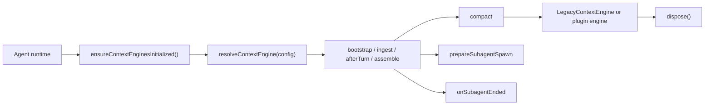
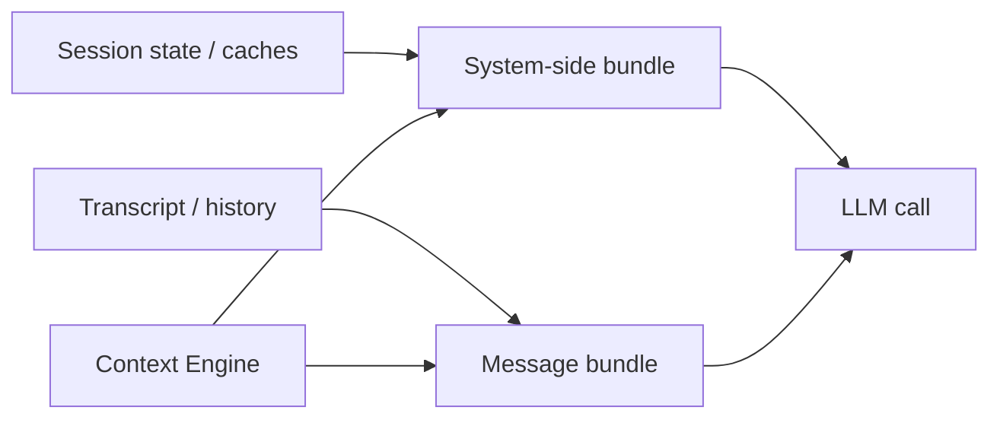
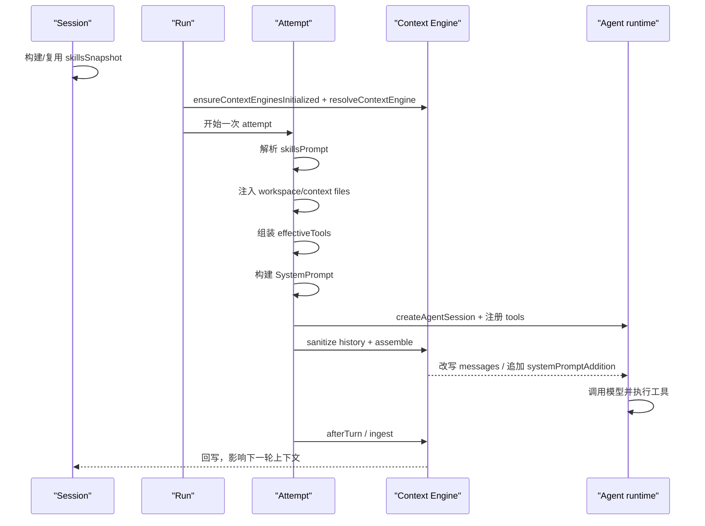

# Phase 9: Context Engine 架构说明

Context Engine 是 OpenClaw 里很容易被低估、但实际上非常关键的一层。  
它不是一个单纯的“提示词拼接器”，而是一个**可替换的上下文管理策略槽位**：负责在 Agent 运行前后，协调会话输入、上下文装配、压缩策略、子代理生命周期收尾，以及与旧版运行模式的兼容。

在 OpenClaw 里，“上下文”也不是单一的 prompt 文本，而是一组要一起交给运行时的材料：session 状态、transcript、skills prompt、system prompt、context files、tools/schema、以及运行时约束和可选扩展面。

## 1. 定位

从源码看，Context Engine 的职责不是“替代 Agent”，而是为 Agent 提供一层**独立的上下文治理面**。它介于：

- `prompt`：本轮模型输入如何组织
- `session`：这轮任务的状态如何延续
- `memory`：需要从外部记忆系统里检索什么
- `subagent`：子代理结束后如何回收和通知

因此它更像是：

> **Agent 上下文编排的可插拔策略层**

### 1.1 什么叫“可替换的上下文管理策略槽位”

这句话可以拆成 4 层来理解：

#### 1. 上下文管理

这里的“上下文管理”不是指模型推理本身，而是指：

- 这一轮要带哪些历史消息进模型
- 历史太长了该怎么裁剪
- 什么时候压缩
- skills、workspace files、memory 结果如何拼进去
- 一轮结束后，哪些消息要写回上下文系统
- 子代理结束后，结果如何回收

也就是说，Context Engine 管的是：

> **模型调用前后，上下文怎么被整理、压缩、回写。**

#### 2. 策略

“策略”强调的是：这些事情并不是只有一种固定做法。

例如“上下文太长怎么办”，理论上就可以有多种策略：

- 简单截断最近 N 条
- 先压缩成摘要，再保留最近若干轮
- 对工具结果做单独裁剪
- 子代理只回收摘要，不回收完整 transcript
- 对不同 session 使用不同 token 预算

所以 Context Engine 不是一个“固定算法名”，而是一套：

> **上下文该如何组织和演化的规则/算法集合。**

#### 3. 槽位

“槽位”不是比喻，而是 OpenClaw 架构里真实存在的一个可插拔位置。

源码上这件事很明确：

- `src/plugins/slots.ts:12-20`
  - `kind: "context-engine"` 对应 `contextEngine` 这个独占 slot
  - 默认值是 `legacy`
- `src/context-engine/registry.ts:323-338`
  - `resolveContextEngine(config)` 会根据当前配置决定用哪个 engine

所以“槽位”可以直接理解成：

> **OpenClaw 专门预留了一个“上下文怎么管理”的实现位置。**

#### 4. 可替换

“可替换”指的不是“程序运行时随便热切换函数”，而是：

- 默认有一个实现：`legacy`
- 也可以有别的实现注册进来
- 配置 slot 后，由新的实现接管这套生命周期

默认实现来自 core：

- `src/context-engine/legacy.ts:21-89`

插件也可以注册自己的实现：

- `src/plugins/types.ts:1339-1343`
  - `registerContextEngine(id, factory)`

所以更准确的理解是：

> **Context Engine 是一个独占的上下文实现槽位，默认用 core 的 `legacy`，但可以被新的实现替换。**

### 1.2 默认 `legacy` 和新 Context Engine 的关系

这里还要再区分两层，不然很容易误解成“只要有 Context Engine 接口，就默认已经有一整套新的上下文算法”。

实际上不是这样。

`legacy` 的定位是：

- 用新的 `ContextEngine` 接口，包装旧的 OpenClaw 上下文流程
- 保证旧逻辑在引入 slot 机制后仍然能跑

从 `src/context-engine/legacy.ts:14-20` 可以直接看出它的本质：

- `ingest`: no-op
- `assemble`: pass-through
- `compact`: 委托给旧 runtime compaction

也就是说，`legacy` 更像：

> **兼容层 / 适配层**

而一个“真正的新 Context Engine 范式”则更进一步：

- 真正实现 `ingest / ingestBatch`
- 真正实现 `assemble`
- 真正实现 `compact`
- 真正实现 `afterTurn`
- 可能还会实现 `prepareSubagentSpawn / onSubagentEnded`

它不只是“挂上了新接口”，而是：

> **真的把上下文生命周期治理逻辑搬进 engine 本身。**

### 1.3 这套生命周期钩子是谁实现的

在契约层面，生命周期定义在：

- `src/context-engine/types.ts:68-176`

核心方法包括：

- `bootstrap(...)`
- `ingest(...)`
- `ingestBatch(...)`
- `afterTurn(...)`
- `assemble(...)`
- `compact(...)`
- `prepareSubagentSpawn(...)`
- `onSubagentEnded(...)`

这些首先是一组**上下文生命周期接口**，不是说每个默认实现都会完整拥有一套新算法。

默认情况下：

- active engine 是 core 的 `legacy`
- 它只实现最小兼容子集

而当你安装并选中了新的 context-engine 插件后，这些钩子通常就由该插件实现。

运行时的调用点也很明确：

- `bootstrap(...)`：`src/agents/pi-embedded-runner/run/attempt.ts:1805-1814`
- `assemble(...)`：`src/agents/pi-embedded-runner/run/attempt.ts:2163-2184`
- `afterTurn(...)` / `ingestBatch(...)` / `ingest(...)`：`src/agents/pi-embedded-runner/run/attempt.ts:2731-2781`
- `compact(...)`：`src/agents/pi-embedded-runner/run.ts:1134`
- `onSubagentEnded(...)`：`src/agents/subagent-registry.ts:401-406`

所以从运行视角看，Context Engine 不是“一个静态配置项”，而是：

> **在固定生命周期节点被 runtime 调用的一组上下文钩子。**

### 1.4 这些“上下文生命周期钩子”分别做什么

这组方法可以直接按“什么时候调用、解决什么问题”来理解：

- `bootstrap(...)`
  - 时机：已有 session file、准备进入一次 run 时
  - 作用：让引擎先做初始化，必要时导入历史上下文或建立自己的索引/存储
  - 调用点：`src/agents/pi-embedded-runner/run/attempt.ts:1805-1814`

- `ingest(...)`
  - 时机：一轮结束后，如果引擎没有提供批量接口，runtime 会逐条回写新消息
  - 作用：把单条消息纳入引擎自己的上下文存储
  - 调用点：`src/agents/pi-embedded-runner/run/attempt.ts:2768-2777`

- `ingestBatch(...)`
  - 时机：一轮结束后，如果引擎支持批量摄入
  - 作用：把当前 turn 新增的整批消息一次性写入，减少逐条处理开销
  - 调用点：`src/agents/pi-embedded-runner/run/attempt.ts:2755-2766`

- `afterTurn(...)`
  - 时机：一轮 run attempt 完成后
  - 作用：做 post-turn 生命周期收尾，例如持久化 canonical context、后台压缩决策、把本轮状态写回上下文系统
  - 调用点：`src/agents/pi-embedded-runner/run/attempt.ts:2731-2752`

- `assemble(...)`
  - 时机：真正调用模型前，消息历史已经过基础 sanitize / validate / truncate 之后
  - 作用：返回“这一轮真正要送给模型的 messages”，并可选追加 `systemPromptAddition`
  - 调用点：`src/agents/pi-embedded-runner/run/attempt.ts:2163-2184`

- `compact(...)`
  - 时机：手动 `/compact` 或上下文溢出恢复时
  - 作用：压缩上下文，通常通过摘要、裁剪、归档等方式降低 token 占用
  - 调用点：`src/agents/pi-embedded-runner/run.ts:1134`、`src/agents/pi-embedded-runner/compact.ts:1199`

- `prepareSubagentSpawn(...)`
  - 时机：子代理启动前
  - 作用：为子代理准备上下文状态，必要时返回 rollback 句柄，以便 spawn 失败时撤销准备动作
  - 契约定义：`src/context-engine/types.ts:156-166`

- `onSubagentEnded(...)`
  - 时机：子代理生命周期结束后
  - 作用：回收子代理上下文、清理状态，或把结果并回主上下文系统
  - 调用点：`src/agents/subagent-registry.ts:389-406`

- `dispose()`
  - 时机：引擎实例退出或被替换时
  - 作用：释放引擎持有的资源，例如连接、句柄、临时状态

如果把它们压缩成一句话，这组钩子覆盖的是：

```text
会话初始化
 -> 消息摄入
 -> 模型前组装
 -> 上下文压缩
 -> 回合后回写
 -> 子代理生命周期治理
```

对应的核心目录和文件主要是：

- `src/context-engine/types.ts`
- `src/context-engine/registry.ts`
- `src/context-engine/init.ts`
- `src/context-engine/legacy.ts`
- `src/context-engine/delegate.ts`
- `src/context-engine/index.ts`

同时，它还会通过插件与运行时边界被接入到系统中：

- `src/plugin-sdk/index.ts`
- `src/plugins/types.ts`
- `src/plugins/loader.ts`
- `src/plugins/slots.ts`
- `src/config/types.plugins.ts`

## 2. 目录结构与职责划分

### `src/context-engine/types.ts`

这里定义了 Context Engine 的核心契约。它不是一个单函数接口，而是一个完整生命周期协议，主要包含：

- `bootstrap(...)`
- `ingest(...)`
- `ingestBatch(...)`
- `afterTurn(...)`
- `assemble(...)`
- `compact(...)`
- `prepareSubagentSpawn(...)`
- `onSubagentEnded(...)`
- `dispose()`

这说明 Context Engine 不是只在“发给模型前”起作用，而是覆盖了：

- 会话启动前的准备
- 消息进入时的增量处理
- 一轮交互结束后的收尾
- 上下文组装
- 上下文压缩
- 子代理生命周期回调

### `src/context-engine/registry.ts`

这是注册与解析的核心。它维护的是一个**进程级全局注册表**，并且带有“所有权”和“独占槽位”语义。

关键点有三个：

1. `registerContextEngineForOwner(...)` 用于按 owner 注册
2. `registerContextEngine(...)` 是给插件 SDK 暴露的公共入口
3. `resolveContextEngine(...)` 会根据配置选择当前激活的引擎

### `src/context-engine/init.ts`

这个文件负责 Context Engine 的初始化入口，最重要的是：

- `ensureContextEnginesInitialized()`

它是幂等的，并且会保证默认的 legacy 引擎被注册进来。

### `src/context-engine/legacy.ts`

这里是向后兼容层，提供默认的 `LegacyContextEngine`。

它的定位不是“最强实现”，而是：

- 保证旧流程可用
- 为没有配置其他引擎的场景提供默认值
- 让新旧运行模式平滑过渡

### `src/context-engine/delegate.ts`

这里是一个很重要的运行时桥接层。它把某些能力委托给 Agent 运行时里的专门实现，并使用动态导入隔离边界。

### `src/context-engine/index.ts`

统一导出上面的注册、解析、初始化、legacy 和 delegate 能力，是对外的聚合入口。

## 3. 注册机制

Context Engine 不是硬编码在 Agent 里的一种“if/else 逻辑”，而是一个**注册式槽位**。

### 3.1 公共注册入口

插件和外部扩展侧通过 `registerContextEngine(...)` 接入，底层会落到：

- `src/context-engine/registry.ts`
- `src/plugin-sdk/index.ts`
- `src/plugins/types.ts`

在插件 API 里，它被明确标注为**exclusive slot**，也就是同一时刻只允许一个活跃实现。

### 3.2 槽位选择

插件槽位配置来自：

- `src/config/types.plugins.ts`

这里 `slots.contextEngine` 是一个独立配置项，而不是和 memory 共用一个槽。

槽位解析逻辑在：

- `src/plugins/slots.ts`

它会把 `context-engine` 这个插件类型映射到 `contextEngine` 槽位，并默认回退到 `legacy`。

### 3.3 所有权与独占性

`src/context-engine/registry.ts` 的设计很强调“谁有权注册什么”：

- core 可以占用默认槽位
- public SDK 以固定 owner 注册
- 插件通过 `plugin:<id>` 的 owner 标识接入

这套设计的价值是：

- 避免多个扩展同时抢同一个上下文策略
- 避免不同来源的引擎互相覆盖
- 让“默认实现”和“插件替换实现”共存

### 3.4 兼容旧实现

注册表里还有一个很实用的兼容层：  
`resolveContextEngine(...)` 会包一层 `sessionKey` 兼容适配。

这意味着：

- 新引擎可以显式支持 `sessionKey`
- 老实现如果只接受旧参数，也能继续工作

这类兼容并不是“多余代码”，而是 Context Engine 能独立演进的关键原因之一。

### 3.5 context-engine 插件在运行时怎么生效

如果把一条新的 context-engine 插件从“安装完成”一直看到“真正参与一轮 Agent 运行”，主链其实很清楚：

```text
插件被加载
 -> 插件调用 registerContextEngine(id, factory)
 -> registry 记住这个 engine factory
 -> config.plugins.slots.contextEngine 选中它
 -> Agent run 启动时 resolveContextEngine(config)
 -> 得到 active engine 实例
 -> 在 bootstrap / assemble / compact / afterTurn 等节点调用它
```

可以拆成 4 步来看：

#### 1. 插件先完成注册

插件真正注册 Context Engine 的入口，不是直接改 `src/context-engine/*`，而是通过插件 API：

- `src/plugins/registry.ts:957-980`

这里会把插件调用的 `registerContextEngine(id, factory)` 落到：

- `src/context-engine/registry.ts:257-279`

并且带上 `plugin:<id>` 的 owner 信息。  
这意味着：

- 插件注册的是一个 `factory`
- registry 里保存的是“如何创建这个 engine”的工厂
- core 保留了 `legacy` 这个默认 id，插件不能抢占

#### 2. 只有被加载并生效的插件，注册结果才会进入 registry

插件不是“存在于磁盘上就一定参与运行时”。  
插件加载器会先根据配置算一遍启用状态：

- `src/plugins/loader.ts:898-918`
- `src/plugins/loader.ts:961-964`

也就是说：

- 先判断插件是否 enabled
- enabled 的插件才会继续进入运行时注册阶段

如果某个 context-engine 插件没有被真正加载，它就不会把自己的 engine 注册进 registry。  
这也是为什么：

- `config.plugins.slots.contextEngine` 指向一个未注册 id 时
- `resolveContextEngine(...)` 会直接报错

对应逻辑在：

- `src/context-engine/registry.ts:323-338`

#### 3. slot 负责决定“当前到底用哪个 engine”

Context Engine 是独占槽位，不是“所有注册 engine 一起生效”。  
最终谁是 active engine，要看：

- `src/config/types.plugins.ts:19-24`
- `src/plugins/slots.ts:12-20`

关键点是：

- 插件 `kind: "context-engine"` 会映射到 `plugins.slots.contextEngine`
- 默认值是 `legacy`
- 如果你把 slot 切到某个插件 id，后续 run 就会优先解析这个插件提供的 engine

所以注册解决的是：

> **系统里有哪些 engine 可选**

而 slot 解决的是：

> **这一轮运行究竟选哪一个**

#### 4. runtime 在每次 run 开始时真正解析并调用 active engine

真正让插件 engine 生效的关键点，在 Agent runtime 里：

- `src/agents/pi-embedded-runner/run.ts:879-883`

运行时会：

1. `ensureContextEnginesInitialized()`
2. `resolveContextEngine(params.config)`

这里拿到的就是这一轮 run 的 active engine。  
而且它是：

- **每次 run 解析一次**
- **同一 run 内跨 retry attempt 复用**

随后，这个 engine 会在固定生命周期节点被真正调用：

- `bootstrap(...)`：`src/agents/pi-embedded-runner/run/attempt.ts:1805-1814`
- `assemble(...)`：`src/agents/pi-embedded-runner/run/attempt.ts:2163-2184`
- `afterTurn(...)` / `ingestBatch(...)` / `ingest(...)`：`src/agents/pi-embedded-runner/run/attempt.ts:2731-2781`
- `compact(...)`：`src/agents/pi-embedded-runner/run.ts:1134`
- `onSubagentEnded(...)`：`src/agents/subagent-registry.ts:401-406`

所以一个 context-engine 插件“生效”并不是一句抽象配置，而是：

> **它先把自己的 factory 注册进全局 registry，再由 slot 选中，最后在每次 run 中被 runtime 解析成 active engine，并在具体生命周期节点上接管上下文治理。**

## 4. 运行链路

Context Engine 的运行路径不是单点调用，而是贯穿 Agent 生命周期。



### 4.1 Agent 启动时

在 `src/agents/pi-embedded-runner/run.ts` 里，运行时会先确保 Context Engine 已初始化，再根据配置解析当前引擎。

这一步决定了：

- 当前会话使用哪个上下文策略
- 是否由引擎自身接管压缩
- 是否需要 legacy 兼容路径

### 4.2 一轮消息处理时

在 `src/agents/pi-embedded-runner/compact.ts` 里，Context Engine 会参与：

- 当前 token 预算评估
- 压缩触发
- 上下文整理
- 可能的 hooks 协作

如果引擎声明了 `ownsCompaction`，运行时会把压缩责任交给它，而不是使用内置的自动压缩逻辑。

### 4.3 子代理收尾时

在 `src/agents/subagent-registry.ts` 里，会向 Context Engine 发送子代理结束通知：

- `notifyContextEngineSubagentEnded(...)`

这说明 Context Engine 不只是“主对话上下文”，也能参与子代理生命周期治理。

## 5. OpenClaw 上下文包含什么

这一节最容易混的地方，是把 `Session`、`SystemPrompt`、`history`、`tool schema` 和“初始上下文”全说成同一种东西。  
结合源码，更准确、统一的口径应该是：

> **OpenClaw 每次调 LLM，直接输入不是“四个并列部分”，而是两大块：**
>
> **1. system-side context bundle**  
> **2. message context bundle**
>
> 而 `Session` 更像这两大块的持久化来源和缓存，不是直接等于模型输入。

### 5.1 先统一三个概念

为了不再混淆，先把 3 个概念分开：

- `Session`
  - 长期持久化的会话状态和缓存
  - 例如 `sessionId`、`sessionKey`、路由、模型覆盖、`skillsSnapshot`、`systemPromptReport`
  - 定义见 `src/config/sessions/types.ts:330-389`

- `system-side context bundle`
  - 每次 attempt 前临时重建的“系统侧启动包”
  - 包含 `SystemPrompt` 文本，以及结构化 `tools[]`
  - 主组装点在 `src/agents/pi-embedded-runner/run/attempt.ts:1441-1762`

- `message context bundle`
  - 真正送给模型的消息序列
  - 来自 transcript / history，经 sanitize、truncate、repair、`contextEngine.assemble(...)` 之后形成
  - 主组装点在 `src/agents/pi-embedded-runner/run/attempt.ts:2130-2184`

所以：

- `Session` 不是 prompt
- `SystemPrompt` 不是全部上下文
- “初始上下文”如果要保留这个说法，指的应该是 **本轮 run 开始前已经装配好的 system-side bundle + message bundle**

### 5.2 严格说，每次调 LLM 的直接输入是什么

如果按“这一次模型调用真正拿到了什么”来定义，最准确的结构是：

```text
LLM input
 = system-side context bundle
 + message context bundle
```

其中：

- `system-side context bundle`
  - 一部分是普通文本，例如 `SystemPrompt`
  - 一部分是结构化注册，例如 `tools[]`

- `message context bundle`
  - 是本轮真正提交给模型的消息列表
  - 包含用户、助手、工具调用、工具结果，以及必要时的压缩摘要消息

这也解释了为什么你之前那句“四个并列部分”不够准确：

- `tool call / tool result` 不是独立于会话历史之外的第四类，它们本来就是 message/history 的一部分
- `compaction summary` 也不是永远单独平行存在，它通常是在被写回后，作为 history/message 的一部分继续参与后续轮次
- `tool schema` 也不等于 `SystemPrompt` 文本，它属于 `tools[]` 这一层的结构化参数部分

### 5.3 第一大块：system-side context bundle

system-side bundle 是 OpenClaw 每次 attempt 前临时组装的“系统侧启动包”。  
它的构建主线在：

- `src/agents/pi-embedded-runner/run/attempt.ts:1441-1762`

更准确地说，它不是“Session 里原样拿出一大段文本”，而是运行时根据当前会话材料和工作区材料临时重建出来的。  
这一块如果按真实输入来拆，最准确的是两层：

- `SystemPrompt` 文本层
- 结构化 `tools[]` 层

而如果你看的是 `/context list`，它还会再额外把这两层拆开展示成一些报告标签；这些标签不是新的输入层。

#### 5.3.1 `SystemPrompt` 文本层

这部分最终会作为系统提示词文本出现，核心来自：

- `src/agents/pi-embedded-runner/system-prompt.ts:56-84`
- `src/agents/system-prompt.ts:423-450`

它通常包含：

- runtime identity 和 safety 规则
- `# Project Context` 这一类项目上下文块
- injected workspace/context files
- skills 使用规则和 `skillsPrompt`
- tool list 的文本摘要
- sandbox / channel / owner / timezone / memory citations 等运行约束
- 如果 Context Engine 返回了 `systemPromptAddition`，还会 prepend 到这段文本前面  
  见 `src/agents/pi-embedded-runner/run/attempt.ts:2174-2180`

这里要注意一个边界：

- “项目上下文”在源码里通常不是独立于 `context files` 的另一包东西
- 它更常见的来源，就是 `contextFiles` 被注入到 `# Project Context` 这段里，见 `src/agents/system-prompt.ts:617-639`

所以更准确地说，下面这些内容多数都属于 `SystemPrompt` 文本层：

- 项目上下文
- 注入的 workspace/context files
- skills 列表文本
- tools 的摘要列表
- 各种运行时边界说明

这里说的 `workspace/context files`，从源码上看，通常主要就是 workspace 里的那组 bootstrap markdown 文件。默认识别的文件名在：

- `src/agents/workspace.ts:25-33`
- `src/agents/workspace.ts:169-179`

包括：

- `AGENTS.md`
- `SOUL.md`
- `TOOLS.md`
- `IDENTITY.md`
- `USER.md`
- `HEARTBEAT.md`
- `BOOTSTRAP.md`
- `MEMORY.md`
- `memory.md`

默认加载链路是：

- `src/agents/workspace.ts:487-527`
- `src/agents/bootstrap-files.ts:98-117`
- `src/agents/pi-embedded-helpers/bootstrap.ts:198-257`

所以你在 `/context list` 里经常看到的：

- `AGENTS.md`
- `SOUL.md`
- `TOOLS.md`
- `IDENTITY.md`
- `USER.md`

确实就是这一层最常见的组成部分。  
但更准确地说，它不只包括这 5 个文件，还可能包含：

- `HEARTBEAT.md`
- `BOOTSTRAP.md`
- `MEMORY.md` / `memory.md`

另外，这一层也不是每次都全量注入：

- 子代理 / cron session 会走最小 allowlist，见 `src/agents/workspace.ts:549-565`
- lightweight bootstrap mode 会进一步缩减，heartbeat 场景甚至只保留 `HEARTBEAT.md`，见 `src/agents/bootstrap-files.ts:47-62`
- 最终注入时还会按 `bootstrapMaxChars` / `bootstrapTotalMaxChars` 做截断，见 `src/agents/pi-embedded-helpers/bootstrap.ts:198-257`

##### 这些 bootstrap markdown 按职责怎么分组

如果按职责来理解，这些文件大致可以分成 5 组：

- 治理类
  - `AGENTS.md`
  - `BOOTSTRAP.md`
  - 作用：定义仓库规则、协作约束、启动注意事项、工作边界

- 身份类
  - `SOUL.md`
  - `IDENTITY.md`
  - `USER.md`
  - 作用：定义 Agent 的角色气质、当前身份、面向用户时的合作方式

- 工具类
  - `TOOLS.md`
  - 作用：解释工具如何使用、有哪些约定和经验，不决定工具是否可用

- 记忆类
  - `MEMORY.md`
  - `memory.md`
  - 作用：沉淀工作区级长期记忆、项目经验和稳定约定

- 定时任务类
  - `HEARTBEAT.md`
  - 作用：描述 heartbeat / 巡检 / 定时提醒场景下的默认工作流

所以更准确地说，`workspace/context files` 不是“随便几份 markdown”，而是：

> **围绕治理、身份、工具、记忆和定时任务组织的一组工作区级上下文说明书。**

#### 5.3.2 `tools[]` 的结构化工具层

这部分不是 prompt 文本，而是 runtime 里的真实结构化工具集合。

它的来源和去向是：

- `src/agents/pi-embedded-runner/run/attempt.ts:1502-1589`
  - 先组装 `effectiveTools`
  - 里面会合并 core tools、plugin tools、MCP tools、LSP tools
- `src/agents/pi-embedded-runner/tool-split.ts:8-15`
  - 再把这批工具转成 `customTools`
- `src/agents/pi-embedded-runner/run/attempt.ts:1860-1902`
  - 最后交给 `createAgentSession(...)`

所以更准确的定位是：

- **属于 system-side context bundle**
- **但不属于 `SystemPrompt` 文本本身**
- **架构上更准确的名字是 `tools[]`，不是 `Tool schemas (JSON)`**

这里要特别区分“架构层对象”和“报告层标签”。

##### 架构层：真实进入 runtime 的是 `tools[]`

真正进入 runtime 的，不是一行 `Tool schemas (JSON)` 文案，而是整批 `tools[]`。

这批工具对象至少会包含：

- `name`
- `description`
- `parameters`
- `execute`

这里的 `tools[]` 也是分析术语。  
放回 OpenClaw 代码里，更贴近的具体形态其实是：

```text
effectiveTools
 -> toToolDefinitions(...)
 -> ToolDefinition[] / customTools
 -> createAgentSession(...)
```

它们经过：

```text
effectiveTools
 -> splitSdkTools(...)
 -> customTools
 -> createAgentSession(...)
```

之后，才真正成为这一轮模型可调用的结构化工具集合。

##### 报告层：`/context list` 会把 `tools[]` 拆成两种标签

这点从 `/context list` 的报告结构能直接看出来：

- `src/agents/system-prompt-report.ts:111-140`

它明确把 tools 拆成：

- `listChars`
  - tool list 的文本摘要成本
- `schemaChars`
  - `tools[]` 里 schema 部分的 JSON 成本

再加上 `/context list` 自己额外打印的一行：

- `Tools: ...`
  - 对应 `report.tools.entries.map((t) => t.name)`
  - 只是名字索引，不是第三份真实输入

也就是说：

- `Tool schemas (JSON)` 是 `/context list` 对 `tools[]` 中 schema 成本的统计标签
- `Tools:` 是 `/context list` 对 `tools[]` 中 name 列表的展示标签

它们都来自 `tools[]`，但都不等于 `tools[]` 这个架构对象本身。

所以如果把 `system-side bundle` 压成一句话，可以记成：

```text
system-side bundle
= 每轮临时重建的 SystemPrompt 文本
+ 当前可用 tools[] 的结构化注册面
```

##### `TOOLS.md`、tool list 文本摘要、`tools[]`、`Tool schemas (JSON)` 的区别

这几样东西都和“工具”有关，但属于不同层次：

- `TOOLS.md`
  - 是 workspace 里的 markdown 文档
  - 属于 bootstrap/context files，会进入 `SystemPrompt` 文本层
  - 它的作用是告诉 Agent“工具怎么用、有哪些约定”
  - 它不决定工具是否可用，源码里有明确说明，见 `src/agents/system-prompt.ts:449`

- tool list 文本摘要
  - 是 runtime 根据当前 `effectiveTools` 动态生成的工具摘要文本
  - 来自 `toolNames + toolSummaries`
  - 会进入 `SystemPrompt` 的 `## Tooling` 段
  - 作用是告诉模型“这一轮有哪些工具可用、它们大概做什么”
  - 对应 `src/agents/pi-embedded-runner/system-prompt.ts:76-77`、`src/agents/system-prompt.ts:426-450`

- `tools[]`
  - 是 runtime 里的真实结构化工具集合
  - 典型内容包括 `name / description / parameters / execute`
  - 会通过 `effectiveTools -> splitSdkTools(...) -> createAgentSession(...)` 进入 runtime
  - 作用是支撑模型 tool-calling 和运行时参数校验/执行
  - 对应 `src/agents/pi-embedded-runner/run/attempt.ts:1502-1589`、`src/agents/pi-embedded-runner/run/attempt.ts:1860-1902`

- `Tool schemas (JSON)`
  - 不是架构层正式对象名，而是 `/context list` 的报告标签
  - 它统计的是 `tools[]` 里 `parameters schema` 的 JSON 成本
  - 作用是告诉你“结构化工具定义大概吃了多少预算”

可以直接记成：

```text
TOOLS.md = 文档层
tool list = 提示词摘要层
tools[] = 结构化执行层
Tool schemas (JSON) = tools[] 的 schema 预算标签
```

### 5.4 第二大块：message context bundle

message bundle 是本轮真正送给模型的消息序列。  
它的来源和装配主线在：

- `src/agents/pi-embedded-runner/run/attempt.ts:2130-2184`

顺序很清楚：

1. `sanitizeSessionHistory(...)`
2. provider 相关 validate
3. `limitHistoryTurns(...)`
4. `sanitizeToolUseResultPairing(...)`
5. `contextEngine.assemble(...)`

最后得到的就是这轮真正交给模型的 `messages`。

但这里也要补一句边界：

- message bundle 的直接工作底座是运行时的 `activeSession.messages`
- 这层消息工作集又是由历史 transcript 和当前 turn 共同形成的
- 所以它不是“从 SessionEntry 直接读出一段 history”，而是“从会话消息工作集再整理出本轮可提交消息”

这一层通常包含：

- 当前用户消息
- 之前的用户 / 助手消息
- assistant 消息里的工具调用内容块
- 工具返回消息
- 如果之前发生过 compaction，并且摘要已经写回会话历史，那么这些摘要消息也会作为 history 的一部分继续参与
- 如果是多模态 turn，也会包含当前消息里的图片/媒体输入片段

所以：

- `tool call / tool result` 属于 message bundle
- `compaction summary` 如果存在，也通常属于 message bundle

它们不是和 history 并列的另一层，而是 history/messages 里的具体内容类型。  
其中 `toolCall` 经常是 assistant message 里的内容块，`toolResult` 则常常表现为独立消息角色；这也是为什么“工具调用消息”这个词只能算近似说法，而不是严格类型定义。

### 5.5 `Session` 在这里到底是什么

`Session` 很重要，但它不是“直接喂给模型的那一整包上下文”。

这一节最容易误会的点，是把 `Session` 一个词同时拿来指：

- `SessionEntry`
- transcript
- 运行时 `activeSession`
- 整个会话子系统

如果不先拆开，这句“Session 是上下文来源”就会显得过宽。

更严谨的说法是：

> **广义的 `Session` 子系统，是 message bundle 的主要持久化来源、缓存和路由容器，并为 system-side bundle 提供会话侧输入、快照和缓存。**

但如果把词收窄到 `SessionEntry`，它并没有装下整个 bundle。  
从 `src/config/sessions/types.ts:68-185`、`src/config/sessions/types.ts:330-389` 可以直接看到，`SessionEntry` 里主要存的是：

- `skillsSnapshot`
- `systemPromptReport`
- session 路由和 delivery 信息
- 运行统计
- 其它运行时状态

而消息历史则单独进入 transcript：

- `src/config/sessions/transcript.ts:67-180`

与此同时，运行时真正参与本轮 message bundle 装配的，是当前的 `activeSession.messages`，见：

- `src/agents/pi-embedded-runner/run/attempt.ts:2130-2184`

所以最准确的一组拆分应该是：

- `SessionEntry` 保存的是状态、缓存、报告
- `Transcript` 保存的是消息历史
- `activeSession.messages` 保存的是当前运行时可直接处理的消息工作集
- 每次 run 再从这些会话材料出发，重建 message bundle，并为 system-side bundle 提供会话侧输入

也就是说：

- 如果你说的是 **广义 Session 子系统**，那“它托管 message bundle，并为 system-side bundle 提供会话侧输入与缓存”是成立的
- 如果你说的是 **狭义 SessionEntry**，那这句话就不够准确，因为 transcript 和运行时消息工作集没有被说出来

#### 5.5.1 这也意味着 OpenClaw 的“记忆”至少有三层

如果从“Agent 能记住什么”这个角度看，OpenClaw 里的记忆不止一种，至少可以拆成三层：

- **第一层：会话短期记忆**
  - 这是最贴近对话现场的一层。
  - `SessionEntry` 保存短期会话状态、路由、运行配置、`skillsSnapshot`、`systemPromptReport` 等，见 `src/config/sessions/types.ts:330-389`
  - `Transcript` 保存短期会话内容本身，也就是用户/助手消息、tool call、tool result 等历史，见 `src/config/sessions/transcript.ts:67-180`
  - 所以如果说“Agent 记得刚才聊过什么、这一轮之前发生了什么”，主要靠的是 `Session + Transcript`

- **第二层：工作区长期记忆**
  - 这层主要是 workspace 里的 `MEMORY.md` / `memory.md`
  - 它更像项目级、目录级的长期经验、约定和背景知识，而不是这轮刚刚发生的对话
  - 在 `SystemPrompt` 侧，它会作为 bootstrap/context files 的一部分被纳入 system-side context bundle，见 `src/agents/workspace.ts:487-527`、`src/agents/bootstrap-files.ts:98-117`

- **第三层：外部可检索记忆**
  - 这层对应 `memory_search` / `memory_get` 这条检索链，不是单纯把 markdown 全量塞进 prompt
  - system prompt 会明确提示先对 `MEMORY.md + memory/*.md` 做 `memory_search`，见 `src/agents/system-prompt.ts:46-52`
  - 默认检索源是 `memory`，可选再把 `sessions` 纳入检索源，见 `src/agents/memory-search.ts:15-89`
  - 检索方式默认不是“只有向量库”，而是向量检索和关键词检索并存的 hybrid retrieval；默认向量权重更高，见 `src/agents/memory-search.ts:82-103`、`src/memory/manager-search.ts:15-140`
  - 这套能力默认挂在 memory slot 上，默认实现是 `memory-core`，但也可以由其它 memory 插件替换，见 `src/plugins/slots.ts:12-20`

所以最容易记住的一句话是：

```text
短期对话记忆 = Session + Transcript
工作区长期记忆 = MEMORY.md / memory.md
外部检索记忆 = memory_search / memory_get 背后的 memory index
```

### 5.6 “初始上下文”这个说法该怎么理解

“初始上下文”不是 OpenClaw 里的官方源码类型，更适合作为分析术语来用。

如果保留这个说法，建议统一定义成：

> **一轮 run/attempt 在真正调用模型之前，已经装配好的 system-side context bundle + message context bundle。**

所以它不是：

- 单独一个 `prompt`
- 单独一个 `session`
- 单独一个 JSON 对象

而是：

```text
初始上下文
 = SystemPrompt 文本层
 + tools[] 结构化工具层
 + 当前轮 message/history
```

### 5.7 `/context list` 看到的到底是什么

`/context list` 很容易让人误以为它展示了“全部上下文”。  
其实它更接近：

> **system-side bundle 的诊断报告**

对应逻辑是：

- `src/agents/system-prompt-report.ts:111-140`
- `src/auto-reply/reply/commands-system-prompt.ts:18-25`

它重点展示的是：

- `SystemPrompt` 文本总量
- `# Project Context` 占多少
- injected files 占多少
- skills prompt 占多少
- tool list 文本占多少
- `tools[]` 里 schema 成本占多少（以 `Tool schemas (JSON)` 报告标签显示）

它**不等于**完整的 message history。  
所以 `/context list` 更适合回答：

- 这一轮 system-side context 有多大
- tools/schema 吃掉了多少预算

而不是回答：

- 这轮模型完整看到了哪些历史消息

### 5.8 一句统一口径

如果要把 OpenClaw 的上下文结构压成一句准确、统一的话，建议写成：

> **OpenClaw 每次调 LLM，直接输入由两大块组成：**
>
> **1. system-side context bundle**  
> 包括 `SystemPrompt` 文本层，以及结构化的 `tools[]` 工具层；其中 `SystemPrompt` 文本通常包含项目上下文、注入的 workspace/context files、skills 文本、tool list 文本和运行时约束。  
>
> **2. message context bundle**  
> 包括当前轮消息和会话历史；其中工具调用、工具返回结果，以及 compaction 后写回的摘要消息，都属于这一层的消息内容。

而 `Session` 的准确定位则是：

> **Session 是这些上下文材料的持久化来源、缓存和状态容器，不等于“本轮直接送给模型的上下文”。**

### 5.9 上下文分层图



### 5.10 上下文是在什么时机构建的

这也是理解 OpenClaw Context Engine 时非常关键的一点：

> OpenClaw 的上下文不是在程序启动时一次性构建好的，而是“会话级缓存 + 每次 run/attempt 前重建 + 回合结束后回写”。

换句话说，它是**分阶段构建**的。

#### 第一阶段：会话建立/恢复时，先准备可复用缓存

在 `src/agents/agent-command.ts:908-937`，如果是新 session，或者当前 session 里还没有 `skillsSnapshot`，OpenClaw 会先：

- `buildWorkspaceSkillSnapshot(...)`
- 把结果写进 session store

这一步并不会构造完整 prompt，而是先把 Skills 这部分整理成可复用的会话级缓存。

所以这一阶段更像：

```text
Session 初始化
 -> Skills snapshot 预构建
 -> 持久化到 session
```

#### 第二阶段：每次真正开始 run 时，先选定 Context Engine

在 `src/agents/pi-embedded-runner/run.ts:879-883`，运行时会：

- `ensureContextEnginesInitialized()`
- `resolveContextEngine(config)`

而且这一步是**每次 run 解析一次**，然后在同一轮 retry/attempt 中复用，避免每次 attempt 都重新初始化 Context Engine。

所以这里决定的是：

- 这一轮由哪个 context strategy 接管
- 是否由该引擎参与 assemble / compact / afterTurn / ingest

#### 第三阶段：每次 attempt 前，重建 system-side context

真正的大头发生在 `src/agents/pi-embedded-runner/run/attempt.ts`。

在一次 attempt 里，OpenClaw 会按顺序做这些事：

1. 解析 skills prompt  
   `src/agents/pi-embedded-runner/run/attempt.ts:1426-1446`

2. 注入 bootstrap / workspace context files  
   `src/agents/pi-embedded-runner/run/attempt.ts:1448-1458`

3. 组装工具集合，得到 `effectiveTools`  
   `src/agents/pi-embedded-runner/run/attempt.ts:1502-1589`

4. 组装 runtime metadata  
   例如 model、provider、channel、sandbox、timezone 等  
   `src/agents/pi-embedded-runner/run/attempt.ts:1675-1692`

5. 构建本轮 `SystemPrompt`  
   `src/agents/pi-embedded-runner/run/attempt.ts:1707-1734`

6. 生成 `systemPromptReport`，供 `/context list` 和 session store 使用  
   `src/agents/pi-embedded-runner/run/attempt.ts:1735-1762`

7. 创建 Agent runtime，并把 tools 注册进去  
   `src/agents/pi-embedded-runner/run/attempt.ts:1860-1902`

所以最核心的结论是：

> **OpenClaw 的 system-side context 是每次 attempt 前现组装的，不是 session 创建时一次性冻结的。**

这也是为什么：

- 当前 model 改了，上下文会变
- 当前 channel 改了，上下文会变
- 当前 sandbox / tools policy / MCP / plugin 可见性变了，上下文也会变

#### 第四阶段：模型调用前，再组装消息历史上下文

在 system prompt 和 tools 准备好之后，还要处理另一条线：**消息历史上下文**。

这一步发生在 `src/agents/pi-embedded-runner/run/attempt.ts:2130-2189`。

顺序是：

- `sanitizeSessionHistory(...)`
- validate / truncate / repair
- `contextEngine.assemble(...)`

这说明 Context Engine 处理的不是“只有 system prompt”，而是：

- transcript/history 这部分该怎么裁剪
- 是否要改写 message 列表
- 是否要额外 prepend 一段 `systemPromptAddition`

所以在真正送进模型前，OpenClaw 至少有两条上下文装配线：

```text
system-side context
 + message/history context
 -> 最终形成这一轮模型输入
```

#### 第五阶段：一轮结束后回写，影响下一轮上下文

当前轮结束后，Context Engine 还会参与 post-turn 生命周期。

在 `src/agents/pi-embedded-runner/run/attempt.ts:2731-2780`，运行时会调用：

- `contextEngine.afterTurn(...)`
- 或 fallback 到 `ingestBatch(...)` / `ingest(...)`

这一步的意义是：

- 把新消息写回上下文系统
- 为下一轮 assemble 做准备
- 在需要时触发 compaction / 子代理相关收尾策略

所以 OpenClaw 的上下文不是“只进不出”的，而是一个滚动演化过程。

#### 第六阶段：`/context list` 看到的是“上一轮结果”或“即时估算”

这也是经常会让人误解的一点。

`/context list` 并不是每次都实时复刻完整运行，而是：

- 优先读取最近一次真实 run 存下来的 `systemPromptReport`  
  `src/auto-reply/reply/commands-context-report.ts:48-50`
- 如果没有，再临时走 `resolveCommandsSystemPromptBundle(...)` 做 estimate  
  `src/auto-reply/reply/commands-context-report.ts:53-74`

所以 `/context list` 展示的是：

- 上一轮真实上下文装配结果
- 或一份按当前配置推导出来的即时估算

它是诊断视图，不是上下文本体。

#### 一张时序图



#### 一句话总结

可以直接记成：

```text
Session 建立时缓存一部分
 -> 每次 attempt 前重建 system-side context
 -> 模型调用前再 assemble 历史消息上下文
 -> 回合结束后 afterTurn / ingest 回写
```

## 6. 与 Agent prompt / session / memory / subagent 的关系

### 6.1 与 prompt 的关系

prompt 负责“模型最终看到什么”。  
Context Engine 负责“在送进 prompt 之前，上下文如何整理”。

也就是说它可以影响：

- 消息排序
- 消息裁剪
- 系统提示补充
- 历史片段拼装

它不是 prompt 的替代品，而是 prompt 的上游编排层。

### 6.2 与 session 的关系

session 负责“这次任务是谁、在哪、持续了多久”。  
Context Engine 负责“这个 session 在当前轮次应该如何被构造为模型上下文”。

所以 session 是状态容器，Context Engine 是状态解释器和装配器。

### 6.3 与 memory 的关系

memory 负责“从外部持久化记忆里检索什么”。  
Context Engine 负责“检索到的内容要不要进本轮上下文、怎么进、何时压缩”。

两者是互补关系，不是替代关系：

- memory 解决“存哪儿”
- context engine 解决“怎么用”

#### 6.3.1 记忆检索、Web 搜索、MCP 不是 Context Engine 本体

这里还要再明确一个边界：  
`memory_search`、联网 Web 搜索、MCP tools 这些能力，**主归属其实是 Agent runtime 的工具调用循环**，而不是 Context Engine 本体。

更准确地说：

- `memory_search / memory_get`
  - 属于记忆检索工具链
  - 解决“去哪里查历史记忆和知识”
- web search tool
  - 属于联网检索工具链
  - 解决“去哪里查最新外部信息”
- MCP tools
  - 属于外部能力接入层
  - 解决“怎么把另一个系统的检索/操作能力接进来”

它们更接近 Agent 运行时里的这条链：

```text
SystemPrompt / rules
 -> 模型决定是否调用 memory_search / web_search / MCP tool
 -> tool result 写入消息历史
 -> 后续 turn 再被 Context Engine assemble / compact / afterTurn 处理
```

所以在文档分工上，最合适的理解是：

- `phase3_ Agent 运行时与会话编排.md`
  - 主讲这条工具调用/检索循环
- `phase8_ 记忆、多模态与能力服务.md`
  - 主讲 memory、web-search、MCP 这些能力从哪里来、怎么接入
- 本文 `phase9_ Context Engine.md`
  - 只负责说明这些能力的结果怎样回流为上下文，并在后续轮次里被整理、压缩和回写

这也是为什么在源码里：

- 模型前的消息整理由 `contextEngine.assemble(...)` 处理，见 `src/agents/pi-embedded-runner/run/attempt.ts:2148-2184`
- 回合结束后的上下文回写由 `afterTurn / ingestBatch / ingest` 处理，见 `src/agents/pi-embedded-runner/run/attempt.ts:2731-2781`

而不是让 Context Engine 自己去直接发起联网搜索或 MCP 调用。

### 6.4 与 subagent 的关系

subagent 是独立执行单元。  
Context Engine 需要知道：

- 子代理是否会继承父级上下文
- 子代理结束后是否需要通知当前引擎
- 子代理 spawn/结束时如何保持上下文语义一致

源码里 `prepareSubagentSpawn(...)` 和 `onSubagentEnded(...)` 正是为这类场景预留的生命周期钩子。

### 6.5 与工具调用循环的边界

`memory_search`、`web_search` 和 MCP tools 不是 Context Engine 本体的职责，它们属于更上游的 Agent 运行时工具调用循环。

更准确地说：

- 工具调用循环负责“模型这一轮要不要查、查什么、怎么查、查完怎么把结果写回消息历史”。
- Context Engine 负责“这些消息历史、工具结果和压缩结果，在下一轮应该怎么重新装配成上下文”。

所以这三者的关系应该按下面这条链来理解：

```text
tool call / tool result
 -> message bundle / transcript
 -> Context Engine assemble / compact
 -> 下一轮 system-side + message context
```

也就是说，memory_search / web_search / MCP 的结果会被 Context Engine 看到并参与后续上下文，但它们本身不属于 Context Engine 的生命周期接口。

## 7. 为什么它是独立扩展槽位

Context Engine 之所以不是直接写死在 Agent runtime 里，原因很明确：

### 7.1 它承载的是策略，不是固定实现

不同场景下，上下文策略可能完全不同：

- 长会话需要更强的压缩
- 任务型 agent 更关注结构化输入
- 子代理场景更关注继承和清理
- 不同模型上下文窗口不同，策略也不同

所以它应该能被替换，而不是被固定。

### 7.2 它需要独立演进

Context Engine 的生命周期比单次 prompt 组装更长，涉及：

- bootstrap
- ingest
- afterTurn
- compact
- subagent cleanup

这些能力如果硬塞进 Agent 主流程，会导致运行时越来越臃肿。

### 7.3 它需要兼容旧实现

`LegacyContextEngine` 的存在说明 OpenClaw 不是一开始就要求所有实现都支持新契约。  
独立槽位让系统可以：

- 默认走 legacy
- 逐步替换成更智能的实现
- 不破坏现有会话和插件

### 7.4 它可以被插件接管

通过 `src/plugins/loader.ts` 和 `src/plugins/types.ts`，插件可以注册自己的 context engine。  
这让“上下文策略”从核心逻辑里解耦出来，成为真正的扩展点。

## 8. 设计价值

Context Engine 的设计价值，可以总结成四点：

1. **把上下文管理从 Agent 主逻辑中拆出来**，避免 prompt/session/memory 逻辑混成一团。
2. **允许插件替换上下文策略**，让不同场景拥有不同 compaction 和 assembly 行为。
3. **保留 legacy 兼容层**，让旧系统可以平滑运行。
4. **把子代理生命周期纳入上下文治理**，使 Agent 范式不只局限于“单轮对话”。

## 9. 小结

如果把 OpenClaw 的 Agent 运行时看成一条流水线，那么 Context Engine 处在非常关键的“上下文编排层”：

- 它不直接替代模型
- 也不直接替代 memory
- 更不是普通的 prompt helper

它负责的是：

> **在 Agent 进入模型前、模型返回后、子代理启动和结束时，统一管理上下文策略。**

这就是它为什么必须作为一个独立扩展槽位存在，而不是被写死在 Agent runtime 里。
